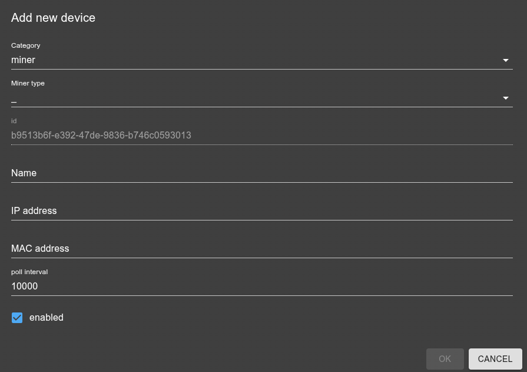

# IoBroker.miner
**Tests:** 

## Miner-Adapter für ioBroker
Interaktion mit verschiedenen Krypto-Miner-APIs

## Roadmap
- [X] v0.1: Geräteverwaltung, TRM-Implementierung
- [X] Weitere Miner-Unterstützung: bos+, xmrig, avalon, ...?
- [ ] weitere Funktionen implementieren (Steuerung + Informationen von Geräten)
- [ ] Pools Unterstützung
- [ ] Geräteerkennung
- [ ] Wache
- [ ] mehr: siehe Todo.md / issues
- [ ] Lizenz-Plugin in .releaseconfig korrigieren

## Verwendung
Beim Hinzufügen eines neuen Geräts in den Instanzeinstellungen (oder im Admin-Gerätemanager) sollte ein Dialogfeld wie dieses angezeigt werden:



Die Optionen sollten weitgehend selbsterklärend sein. Alle Optionen verfügen außerdem über Tooltips mit weiteren Details. Sollten dennoch Fragen offen sein, können Sie diese gerne in einem Issue, einer Diskussion oder im Forum stellen.

## Objektmodell
Alle Objekte werden unter folgendem Pfad erstellt:

`miner.<instance>.miner.<minerId>`

`<minerId>` ist die stabile ID aus der Gerätekonfiguration (`settings.id`). Dies ermöglicht mehrere Miner-Prozesse auf demselben Host.

### Gruppen (Kanäle)
- `info`: Identitäts-/Konfigurations-/Firmware-/Verbindungsmetadaten
- `stats`: Live-Leistungsmetriken (Hashrate, Shares, Stromverbrauch, Temperaturen, ...)
- `control`: beschreibbare Steuerelemente (Start/Stopp, Neustart, ...)
- `raw`: Rohdaten der API (Experte)

### Entitäten (optionale Teilbäume)
Manche Miner legen Unterentitäten offen. Falls verfügbar, werden diese unterhalb des Miners platziert:

- `pools.<index>...`
- `hardware.gpus.<index>...`
- `hardware.hashboards.<index>...`

### Beispiele
- `miner.0.miner.<minerId>.control.running`
- `miner.0.miner.<minerId>.stats.totalHashrate`
- `miner.0.miner.<minerId>.hardware.gpus.0.stats.temp`
- `miner.0.miner.<minerId>.raw.stats`

### Beispielbaum
Dies ist lediglich eine Übersicht/Idee/ein Plan. Noch sind nicht alle Elemente umgesetzt, aber er soll Ihnen eine Vorstellung von der geplanten Struktur und Benennung vermitteln. Die tatsächliche Umsetzung kann in einigen Details abweichen, die allgemeine Struktur sollte jedoch ähnlich sein.

```
miner.0
  miner
    <minerId>                        (device)
      info                           (channel)
        minerType                    (string)   e.g. xmRig / teamRedMiner / bosMiner
        host                         (string)
        version                      (string)   (maps to feature: version)
        online                        (boolean)  derived from lastSeen
        lastSeen                     (number)   unix ms
      stats                          (channel)
        totalHashrate                (number)   H/s (maps to feature: totalHashrate)
        power                        (number)   W
        efficiency                   (number)   H/W
        acceptedShares               (number)
        rejectedShares               (number)
      control                        (channel)  (writable states only here, top-level)
        running                      (boolean)  start/stop (maps to feature: running)
        reboot                       (boolean)  "button"
        profile                      (string)   performance profile (e.g. low/medium/high)
      pools                          (channel)
        0                            (channel)
          info
            url                      (string)
            user                     (string)
          stats
            status                   (string)
            acceptedShares           (number)
            rejectedShares           (number)
        1 ...
      hardware                       (channel)
        gpus                         (channel)
          0                          (channel)
            info
              name                   (string)
            stats
              hashrate               (number)
              temp                   (number)   °C
              fanRpm                 (number)
              power                  (number)
          1 ...
        hashboards                   (channel)  (ASICs)
          0
            stats
              hashrate               (number)
              temp                   (number)
      raw                            (channel)
        stats                        (object/string) raw miner payload (maps to feature: rawStats)
```

## Credits
- Das Logo wurde mit ChatGPT erstellt.

## Changelog
<!--
    Placeholder for the next version (at the beginning of the line):
    ### **WORK IN PROGRESS**
-->
### **WORK IN PROGRESS**
- (copilot) Adapter requires node.js >= 22 now
* (SimonFischer04) **FIXED**: Removed example configuration (option1, option2) from native section and code (fixes #126 / E5040)

### 1.0.4 (2026-04-07)
* (SimonFischer04) fix repo url in package-json

### 1.0.3 (2026-04-07)
* (SimonFischer04) increase admin requirement to fix DM (does not work at all with current stable 7.7.22)

### 1.0.2 (2026-04-07)
* (SimonFischer04) **CI/CD**: Migrated deploy workflow from NPM classic tokens to Trusted Publishing (OIDC) (fixes #80)
* (SimonFischer04) cleanup readme

### 1.0.1 (2026-04-06)
* (SimonFischer04) fix release

### 1.0.0 (2026-04-06)
* (SimonFischer04) **FIXED**: Added missing size attributes (xs, xl) to admin configuration fields
* (SimonFischer04) **ENHANCED**: Updated dependencies to recommended versions (admin 7.6.17, js-controller 6.0.11)
* (SimonFischer04) **ENHANCED**: Added copyright notice to README
* (SimonFischer04) **NEW**: Added support for Avalon (Canaan) devices via CGMiner-compatible socket API (port 4028), including start/stop (softon/softoff) and stats polling
* (SimonFischer04) **ENHANCED**: Restructured object model with dedicated channels for control, info, stats, and raw data (**breaking change** – legacy state paths are auto-cleaned on startup)
* (SimonFischer04) **NEW**: Added info states (minerType, host, online, lastSeen) and stats states (power, efficiency, acceptedShares, rejectedShares) to match the documented object model
* (SimonFischer04) **NEW**: Added reboot control state (button) with wiring in state change handler
* (SimonFischer04) **NEW**: Added running switch control to Device Manager for devices supporting the running feature
* (SimonFischer04) **NEW**: Added performance profile feature with control.profile state and Device Manager dropdown (low/medium/high) — initially for Avalon miners via ascset workmode command
* (SimonFischer04) **ENHANCED**: Renamed SGMiner to CGMiner throughout the codebase to better reflect the underlying API
* (SimonFischer04) **FIXED**: Fixed copyright formatting in README to satisfy ioBroker repository checker (fixes #95)

### 0.0.1 (2026-02-15)
* (SimonFischer04) initial release

[Older changelogs can be found there](CHANGELOG_OLD.md)

## License

Copyright (c) 2026 SimonFischer04 <simi.fischa@gmail.com>  

This project is licensed under the GNU General Public License v3.0 - see [LICENSE](https://github.com/SimonFischer04/ioBroker.miner/blob/main/LICENSE) for details.