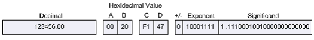
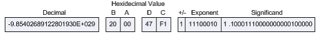
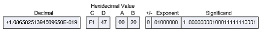
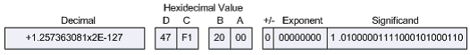
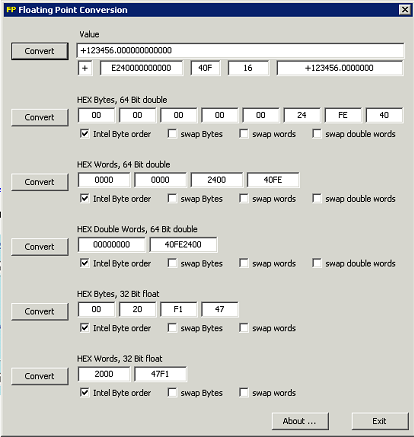

# iobroker.modbus

**Dieser Adapter nutzt die Sentry-Bibliotheken, um Ausnahmen und Codefehler automatisch an die Entwickler zu melden.** Weitere Details und Informationen zum Deaktivieren der Fehlerberichterstattung finden Sie in [der Sentry-Plugin-Dokumentation](https://github.com/ioBroker/plugin-sentry#plugin-sentry) . Die Sentry-Berichterstattung wird ab js-controller 3.0 verwendet.

Implementierung von Modbus Slave und Master für ioBroker. Folgende Typen werden unterstützt:

- Modbus RTU über seriell (Master)
- Modbus RTU über TCP (Master)
- Modbus TCP (Slave, Master)
- Modbus TCP mit SSL/TLS (Master)

## SSL/TLS-Unterstützung

Für sichere Verbindungen zu Geräten, die SSL/TLS-Verschlüsselung erfordern (wie z. B. der Kostal KSEM Smart Energy Meter an Port 802), können Sie „TCP mit SSL/TLS“ als Verbindungstyp auswählen. Dadurch stehen Ihnen folgende Konfigurationsoptionen zur Verfügung:

- **SSL-Zertifikatsdateipfad** : Pfad zu Ihrer SSL-Zertifikatsdatei im PEM-Format
- **Pfad zur SSL-Privatschlüsseldatei** : Pfad zu Ihrer SSL-Privatschlüsseldatei im PEM-Format
- **Dateipfad des SSL-CA-Zertifikats** : Pfad zur CA-Zertifikatsdatei im PEM-Format (optional)
- **Nicht autorisierte Zertifikate ablehnen** : Deaktivieren Sie diese Option, um selbstsignierte Zertifikate zuzulassen.

Hinweis: Die Zertifikatsdateien müssen für den ioBroker-Prozess zugänglich sein und im PEM-Format vorliegen.

## Einstellungen

### Partner-IP-Adresse

IP-Adresse des Modbus-Partners.

### Hafen

TCP-Port des Modbus-Partners, wenn dieser als Master (Client) konfiguriert ist, oder eigener Port, wenn er als Slave (Server) konfiguriert ist.

### Geräte-ID

Modbus-Geräte-ID. Wichtig, wenn eine TCP/Modbus-Brücke verwendet wird.

### Typ

Slave (Server) oder Master (Client).

### Gerät auswählen (seriell)

Bei seriellen Verbindungen können Sie die Adressierungsmethode für das Gerät auswählen:

- **Serielle Schnittstelle** : Wählen Sie einen festen Portpfad (z. B.`COM3` oder`/dev/ttyUSB0` ).
- **USB-Geräte-ID** : Wählen Sie das Gerät anhand seiner festen USB-Kennung (Hersteller-ID/Produkt-ID/Seriennummer) aus. Der tatsächliche Port wird beim Start ermittelt, sodass die Verbindung auch dann funktioniert, wenn das Betriebssystem einen anderen Portnamen zuweist (z. B. nach einem Neustart oder erneutem Anschließen).

### Verwenden Sie Aliase als Adresse

Normalerweise können alle Register Adressen von 0 bis 65535 haben. Mithilfe von Aliasen lassen sich virtuelle Adressfelder für jeden Registertyp definieren. Normalerweise:

- Die diskreten Eingänge liegen zwischen 10001 und 20000.
- Die Spulen sind von 1 bis 1000.
- Die Eingangsregister reichen von 30001 bis 40000.
- Die Registernummern lauten 40001 bis 60000.

Jeder Alias wird intern einer Adresse zugeordnet, z. B. wird 30011 dem Eingangsregister 10 zugeordnet usw.

### Direkte Adressen

Wird für Binäreingänge und Spulen verwendet. Ohne dieses Flag werden die Bits wie folgt adressiert:`0 => 15, 1 => 14, 2 => 13, ..., 15 => 0` Wenn dieses Flag aktiviert ist, werden die Bits wie folgt adressiert:`0 => 0, 1 => 1, 2 => 2, ..., 15 => 15` Die

### Adressen nicht an 16 Bit (Wort) ausrichten.

Normalerweise sind die Adressen der Spulen und der diskreten Eingänge 16-Bit-ausgerichtet. Beispielsweise werden Adressen von 3 bis 20 an Adressen von 0 bis 32 ausgerichtet. Wenn diese Option aktiviert ist, werden die Adressen nicht ausgerichtet.

### Verwenden Sie nicht mehrere Register.

Falls ein Slave den Befehl "write multiple registers" nicht unterstützt, können Sie ihn aktivieren, um Warnungen zu erhalten, wenn mehrere Register beschrieben werden.

### Verwenden Sie ausschließlich mehrere Schreibregister.

Wenn ein Slave nur den Befehl "write multiple registers" unterstützt, können Sie dies aktivieren, sodass die Register immer mit dem Befehl FC15/FC16 beschrieben werden.

### Runde Real auf

Wie viele Nachkommastellen stehen bei Gleitkommazahlen und Gleitkommazahlen?

### Datenabfrageintervall

Zyklisches Abfrageintervall (Nur relevant für Master)

### Wiederverbindungsverzögerung

Wiederverbindungsintervall (Nur relevant für Master)

### Lesezeitüberschreitung

Timeout für Leseanfragen in Millisekunden. Wenn innerhalb dieser Zeit keine Antwort von einem Slave empfangen wird, wird die Verbindung getrennt.

### Pulszeit

Wenn für Spulen ein Impuls verwendet wird, definiert dies das Intervall in Millisekunden, also wie lange der Impuls ist.

### Wartezeit

Wartezeit zwischen dem Abfragen zweier verschiedener Geräte-IDs in Millisekunden.

### Maximale Leseanforderungslänge

Maximale Länge des Befehls READ\_MULTIPLE\_REGISTERS: Anzahl der zu lesenden Register.

Manche Systeme erfordern, dass zunächst eine Schreibanforderung ausgeführt wird, bevor die Daten bei einer Leseanforderung bereitgestellt werden. Sie können diesen Modus erzwingen, indem Sie die „Maximale Leseanforderungslänge“ auf 1 setzen.

**Hinweis:** Einige USB-Modbus-Lösungen (z. B. basierend auf`socat` ) können Schwierigkeiten bei der Zusammenarbeit haben`serialport` npm-Modul.

Es gibt ein Software-Gateway [**Modbus RTU <-> Modbus RTU über TCP**](http://mbus.sourceforge.net/index.html) , um die Verwendung des seriellen RTU-über-TCP-Protokolls zu ermöglichen.

Beide Lösungen, **RTU über TCP** und **TCP,** funktionieren gut.

### Leseintervall

Verzögerung zwischen zwei Leseanfragen in Millisekunden. Standardwert: 0.

### Schreibe das Intervall

Verzögerung zwischen zwei Schreibanforderungen in Millisekunden. Standardwert: 0.

### Status unverändert aktualisieren

Normalerweise wird ein Wert, der sich nicht geändert hat, nicht in ioBroker geschrieben. Dieses Flag ermöglicht es, den Zeitstempel des Werts in jedem Zyklus zu aktualisieren.

### Wertbereinigung

Aktivieren Sie die automatische Bereinigung ungültiger Registerwerte (NaN, Unendlich, extreme Gleitkommazahlen wie ±3,4e38). Diese Funktion verhindert, dass fehlerhafte Modbus-Gleitkommazahlen in die ioBroker-Zustände gelangen. Dies ist besonders nützlich für Geräte wie SolarEdge-Wechselrichter, die aufgrund von Timeouts oder internen Skalierungsfehlern gelegentlich ungültige Werte zurückgeben.

Wenn diese Option aktiviert ist, können Sie die Bereinigungsoptionen pro Register konfigurieren:

- **Bereinigen** : Aktivieren Sie die Bereinigung für dieses spezifische Register.
- **Bereinigungsaktion** : Wählen Sie aus, wie ungültige Werte behandelt werden sollen.
  - _Letzten gültigen Wert beibehalten_ : Speichert den letzten bekannten gültigen Wert, wenn ein ungültiger Wert erkannt wird.
  - _Ersetzen durch 0_ : Ungültige Werte werden durch 0 ersetzt.
- **Mindestwert** : Optionaler Mindestwertschwellenwert
- **Maximal gültiger Wert** : Optionaler Schwellenwert für den maximal gültigen Wert

Ungültige Werte erkannt:

- `NaN` (Keine Zahl)
- `Infinity` oder`-Infinity`
- Extremwerte von Gleitkommazahlen (≥3,4e38 oder ≤-3,4e38) - typische Modbus-Fehlerwerte
- Werte außerhalb des konfigurierten Minimal-/Maximalbereichs

### Adressen dürfen nicht in die ID aufgenommen werden.

Fügen Sie keine Adresse in die generierte ioBroker-ID ein.`10_Input10` vs`_Input10` Die

### Punkte in ID beibehalten

Mit dieser Flagge wird der Name lauten`Inputs.Input10` Ohne =>`Inputs_Input10` Die

## Parameter für eine einzelne Adressleitung in der Konfiguration

### Adresse

Zu lesende Modbus-Adresse.

### Slave-ID

Falls mehrere Slaves vorhanden sind, handelt es sich hier um die ID, sofern nicht die in der globalen Konfiguration angegebene Standard-ID verwendet wird.

### Name

Dies ist der Name für den Parameter.

### Beschreibung

Parameterbeschreibung.

### Einheit

Einheit des Parameters.

### Typ

Der aus Bus zu lesende Datentyp. Einzelheiten zu den möglichen Datentypen finden Sie im Abschnitt Datentypen.

### Länge

Länge des Parameters. Bei den meisten Parametern wird diese anhand des Datentyps bestimmt, bei Zeichenketten hingegen definiert sie die Länge in Bytes / Zeichen.

### Faktor

Dieser Faktor wird verwendet, um den vom Bus gelesenen Wert für die statische Skalierung zu multiplizieren. Die Berechnung sieht also wie folgt aus:`val = x * Factor + Offset` Die

### Offset

Dieser Offset wird nach der obigen Multiplikation zum gelesenen Wert addiert. Die Berechnung sieht also wie folgt aus:`val = x * Factor + Offset` Die

### Formel

Dieses Feld kann für erweiterte Berechnungen verwendet werden, falls Faktor und Offset nicht ausreichen. **Ist dieses Feld gesetzt, werden Faktor und Offset ignoriert.** Die Formel wird von der Funktion \`eval()\` ausgeführt. Daher werden alle gängigen Funktionen unterstützt, insbesondere mathematische Funktionen. Die Formel muss der JavaScript-Syntax entsprechen und daher Groß- und Kleinschreibung beachten.

In der Formel muss „x“ für den von Modbus gelesenen Wert verwendet werden. Z. B.`x * Math.pow(10, sf['40065'])`

Mithilfe des "sf"-Arrays (siehe obiges Beispiel) können Sie auf andere gelesene Modbus-Werte zugreifen, wenn diese in der Konfiguration als "Skalierungsfaktor" gekennzeichnet sind (siehe unten Informationen zum "SF"-Flag).

Kann die Formel zur Laufzeit nicht ausgewertet werden, schreibt der Adapter eine Warnmeldung in das Protokoll.

Ein weiterer Anwendungsfall für Formeln könnte auch darin bestehen, unplausible Daten mithilfe einer Formel wie einer solchen zu verhindern.`x > 2000000 ? null : x`

### Rolle

ioBroker-Rolle zuweisen.

### Zimmer

ioBroker-Raum zuweisen.

### Umfrage

Wenn diese Funktion aktiviert ist, werden die Werte in einem vordefinierten Intervall von einem Slave abgefragt.

### WP

Schreibimpuls

### CW

Zyklisch schreiben

### SF

Verwenden Sie den Wert als Skalierungsfaktor. Dies ist erforderlich für dynamische Skalierungsfaktoren, die auf einigen Systemen über Schnittstellenwerte bereitgestellt werden. Wenn ein Wert mit diesem Flag markiert ist, wird er in einer Variablen mit folgender Namenskonvention gespeichert:`sf['Modbus_address']` Diese Variable kann dann später in beliebigen Formeln für andere Parameter verwendet werden. Beispielsweise kann die folgende Formel Folgendes festlegen:`(x * sf['40065']) + 50;`

### Desinfizieren (Expertenmodus)

Aktivieren Sie die Wertbereinigung für dieses Register. Diese Option ist nur verfügbar, wenn die „Wertbereinigung“ in den Adaptereinstellungen global aktiviert ist.

### Desinfektionsaktion (Expertenmodus)

Wählen Sie die Aktion aus, die ausgeführt werden soll, wenn ein ungültiger Wert erkannt wird:

- **Letzten gültigen Wert beibehalten** : Behält den zuletzt bekannten gültigen Wert bei.
- **Ersetzen durch 0** : Ersetzt den ungültigen Wert durch 0

### Mindestgültig / Maximal gültig (Expertenmodus)

Optionale Mindest- und Höchstwerte für die Bereichsvalidierung. Werte außerhalb dieses Bereichs werden als ungültig behandelt und gemäß der Bereinigungsaktion gelöscht.

## Datentypen

- `uint16be` -`Unsigned 16 bit (Big Endian): AABB => AABB`
- `uint16le` -`Unsigned 16 bit (Little Endian): AABB => BBAA`
- `int16be` -`Signed 16 bit (Big Endian): AABB => AABB`
- `int16le` -`Signed 16 bit (Little Endian): AABB => BBAA`
- `uint32be` -`Unsigned 32 bit (Big Endian): AABBCCDD => AABBCCDD`
- `uint32le` -`Unsigned 32 bit (Little Endian): AABBCCDD => DDCCBBAA`
- `uint32sw` -`Unsigned 32 bit (Big Endian Word Swap): AABBCCDD => CCDDAABB`
- `uint32sb` -`Unsigned 32 bit (Big Endian Byte Swap): AABBCCDD => DDCCBBAA`
- `int32be` -`Signed 32 bit (Big Endian): AABBCCDD => AABBCCDD`
- `int32le` -`Signed 32 bit (Little Endian): ABBCCDD => DDCCBBAA`
- `int32sw` -`Signed 32 bit (Big Endian Word Swap): AABBCCDD => CCDDAABB`
- `int32sb` -`Signed 32 bit (Big Endian Byte Swap): AABBCCDD => DDCCBBAA`
- `uint64be` -`Unsigned 64 bit (Big Endian): AABBCCDDEEFFGGHH => AABBCCDDEEFFGGHH`
- `uint64le` -`Unsigned 64 bit (Little Endian): AABBCCDDEEFFGGHH => HHGGFFEEDDCCBBAA`
- `uint8be` -`Unsigned 8 bit (Big Endian): AABB => BB`
- `uint8le` -`Unsigned 8 bit (Little Endian): AABB => AA`
- `int8be` -`Signed 8 bit (Big Endian): AABB => BB`
- `int8le` -`Signed 8 bit (Little Endian): AABB => AA`
- `floatbe` -`Float (Big Endian): AABBCCDD => AABBCCDD`
- `floatle` -`Float (Little Endian): AABBCCDD => DDCCBBAA`
- `floatsw` -`Float (Big Endian Word Swap): AABBCCDD => CCDDAABB`
- `floatsb` -`Float (Big Endian Byte Swap): AABBCCDD => DDCCBBAA`
- `doublebe` -`Double (Big Endian): AABBCCDDEEFFGGHH => AABBCCDDEEFFGGHH`
- `doublele` -`Double (Little Endian): AABBCCDDEEFFGGHH => HHGGFFEEDDCCBBAA`
- `string` -`String 8 bit (Zero-end): ABCDEF\0 => ABCDEF\0`
- `stringle` -`String 8 bit (Little Endian, Zero-end): ABCDEF\0 => BADCFE\0`
- `string16` -`String 16 bit (Zero-end): \0A\0B\0C\0D\0E\0F\0\0 => ABCDEF\0`
- `string16le` -`String 16 bit (Little Endian, Zero-end): A\0B\0C\0D\0E\0F\0\0\0 => ABCDEF\0`
- `rawhex` -`String with value in hex representation AABBCCDD.... => AABBCCDD....`

Die folgende Beschreibung wurde von [hier](http://www.chipkin.com/how-real-floating-point-and-32-bit-data-is-encoded-in-modbus-rtu-messages/) kopiert.

Das Punkt-zu-Punkt-Modbus-Protokoll ist aufgrund seiner einfachen Handhabung eine beliebte Wahl für die Kommunikation mit Remote-Tunnel-Einheiten (RTUs). Das Protokoll selbst regelt die Interaktionen der einzelnen Geräte in einem Modbus-Netzwerk, die Adressvergabe, die Nachrichtenerkennung und die Extraktion grundlegender Informationen aus den Daten. Kurz gesagt, bildet das Protokoll die Grundlage des gesamten Modbus-Netzwerks.

Diese Bequemlichkeit bringt jedoch auch Komplikationen mit sich, und das Modbus-RTU-Nachrichtenprotokoll bildet da keine Ausnahme. Das Protokoll selbst wurde für Geräte mit einer Registerlänge von 16 Bit entwickelt. Daher waren bei der Implementierung von 32-Bit-Datenelementen besondere Überlegungen erforderlich. Die Implementierung sieht die Verwendung von zwei aufeinanderfolgenden 16-Bit-Registern zur Darstellung von 32 Bit Daten bzw. im Wesentlichen 4 Byte Daten vor. Innerhalb dieser vier Byte Daten können Gleitkommadaten einfacher Genauigkeit in eine Modbus-RTU-Nachricht kodiert werden.

### Die Bedeutung der Byte-Reihenfolge

Modbus selbst definiert keinen Gleitkomma-Datentyp, es gilt jedoch als allgemein anerkannt, dass es 32-Bit-Gleitkommadaten gemäß dem IEEE-754-Standard implementiert. Der IEEE-Standard legt die Byte-Reihenfolge der Nutzdaten jedoch nicht eindeutig fest. Daher ist bei der Verarbeitung von 32-Bit-Daten die korrekte Adressierung der Daten von größter Bedeutung.

Beispielsweise sieht die Zahl 123/456,00 gemäß der IEEE-754-Norm für 32-Bit-Gleitkommazahlen einfacher Genauigkeit wie folgt aus:

Die Auswirkungen unterschiedlicher Byte-Reihenfolgen sind erheblich. Beispielsweise kann die Reihenfolge der 4 Datenbytes, die 123456,00 darstellen, in einem`B A D C` Diese Sequenz wird als „Byte-Swap“ bezeichnet. Bei der Interpretation als IEEE-744-Gleitkommadatentyp ergibt sich jedoch ein ganz anderes Ergebnis:

Die Anordnung gleicher Bytes in einer „CDAB“-Sequenz wird als „Worttausch“ bezeichnet. Auch hier weichen die Ergebnisse drastisch vom ursprünglichen Wert von 123456,00 ab:

Darüber hinaus beides`byte swap` und ein`word swap` würde im Wesentlichen die Reihenfolge der Bytes komplett umkehren, um ein weiteres Ergebnis zu erzielen:

Bei der Verwendung von Netzwerkprotokollen wie Modbus muss selbstverständlich genau darauf geachtet werden, in welcher Reihenfolge die Speicherbytes bei der Übertragung angeordnet sind, die sogenannte „Byte-Reihenfolge“.

### Byte-Reihenfolge bestimmen

Das Modbus-Protokoll selbst ist gemäß der Modbus Application Protocol Specification, V1.1.b, als „Big-Endian“-Protokoll deklariert:

**Modbus verwendet eine „Big-Endian“-Darstellung für Adressen und Datenelemente. Das bedeutet, dass bei der Übertragung einer numerischen Größe, die größer als ein Byte ist, das höchstwertige Byte zuerst gesendet wird.**

Big-Endian ist das am häufigsten verwendete Format für Netzwerkprotokolle – so häufig, dass es auch als „Netzwerkordnung“ bezeichnet wird.

Da das Modbus-RTU-Nachrichtenprotokoll Big-Endian ist, muss für den erfolgreichen Austausch eines 32-Bit-Datentyps über eine Modbus-RTU-Nachricht die Byte-Reihenfolge von Master und Slave berücksichtigt werden. Viele RTU-Master- und Slave-Geräte ermöglichen die Auswahl der Byte-Reihenfolge, insbesondere bei softwaresimulierten Einheiten. Es muss lediglich sichergestellt werden, dass beide Einheiten auf dieselbe Byte-Reihenfolge eingestellt sind.

Grundsätzlich bestimmt die Familie des Mikroprozessors eines Geräts dessen Byte-Reihenfolge (Endianness). Typischerweise findet man Big-Endian (das höherwertige Byte wird zuerst gespeichert, gefolgt vom niederwertigen) bei CPUs mit Motorola-Prozessor. Little-Endian (das niederwertige Byte wird zuerst gespeichert, gefolgt vom höherwertigen) findet man hingegen üblicherweise bei CPUs mit Intel-Architektur. Welcher der beiden Stile als „rückständig“ gilt, ist Ansichtssache.

Sind Byte-Reihenfolge und Byte-Reihenfolge jedoch nicht konfigurierbar, müssen Sie die Interpretation des Bytes festlegen. Dies kann durch Anfordern eines bekannten Gleitkommawertes vom Slave erfolgen. Wird ein unmöglicher Wert zurückgegeben, z. B. eine Zahl mit einem zweistelligen Exponenten, muss die Byte-Reihenfolge höchstwahrscheinlich angepasst werden.

### Praktische Hilfe

Die FieldServer Modbus RTU-Treiber bieten verschiedene Funktionsoperationen zur Verarbeitung von 32-Bit-Ganzzahlen und 32-Bit-Gleitkommazahlen. Wichtiger noch: Diese Funktionsoperationen berücksichtigen alle möglichen Byte-Sequenzierungen. Die folgende Tabelle zeigt die FieldServer-Funktionsoperationen, die zwei benachbarte 16-Bit-Register in einen 32-Bit-Ganzzahlwert kopieren.

| Funktionsschlüsselwort | Tauschmodus          | Quellbytes      | Zielbytes |
| ---------------------- | -------------------- | --------------- | --------- |
| 2.i16-1.i32            | N / A                | \[ ab ] \[ cd ] | \[ abcd ] |
| 2.i16-1.i32-s          | Byte- und Worttausch | \[ ab ] \[ cd ] | \[ dcba ] |
| 2.i16-1.i32-sb         | Byte-Tausch          | \[ ab ] \[ cd ] | \[ badc ] |
| 2.i16-1.i32-sw         | Worttausch           | \[ ab ] \[ cd ] | \[ cdab ] |

Die folgende Tabelle zeigt die FieldServer-Funktionsschritte, die zwei benachbarte 16-Bit-Register in einen 32-Bit-Gleitkommawert kopieren:

| Funktionsschlüsselwort | Tauschmodus          | Quellbytes      | Zielbytes |
| ---------------------- | -------------------- | --------------- | --------- |
| 2.i16-1.ifloat         | N / A                | \[ ab ] \[ cd ] | \[ abcd ] |
| 2.i16-1.ifloat-s       | Byte- und Worttausch | \[ ab ] \[ cd ] | \[ dcba ] |
| 2.i16-1.ifloat-sb      | Byte-Tausch          | \[ ab ] \[ cd ] | \[ badc ] |
| 2.i16-1.ifloat-sw      | Worttausch           | \[ ab ] \[ cd ] | \[ cdab ] |

Die folgende Tabelle zeigt die FieldServer-Funktionsschritte, die einen einzelnen 32-Bit-Gleitkommawert in zwei benachbarte 16-Bit-Register kopieren:

| Funktionsschlüsselwort | Tauschmodus          | Quellbytes      | Zielbytes      |
| ---------------------- | -------------------- | --------------- | -------------- |
| 1.float-2.i16          | N / A                | \[ ab ] \[ cd ] | \[ ab ]\[ cd ] |
| 1.float-2.i16-s        | Byte- und Worttausch | \[ ab ] \[ cd ] | \[ dc ]\[ ba ] |
| 1.float-2.i16-sb       | Byte-Tausch          | \[ ab ] \[ cd ] | \[ ba ]\[ dc ] |
| 1.float-2.i16-sw       | Worttausch           | \[ ab ] \[ cd ] | \[ cd ]\[ ab ] |

Angesichts der verschiedenen FieldServer-Funktionsschritte hängt die korrekte Verarbeitung von 32-Bit-Daten von der Auswahl des richtigen Schritts ab. Beobachten Sie das folgende Verhalten dieser FieldServer-Funktionsschritte bei dem bekannten einfachgenauen Dezimal-Gleitkommawert 123456,00:

| 16-Bit-Werte  | Funktionsverschiebung | Ergebnis  | Funktionsverschiebung | Ergebnis      |
| ------------- | --------------------- | --------- | --------------------- | ------------- |
| 0x2000 0x47F1 | 2.i16-1.float         | 123456.00 | 1.float-2.i16         | 0x2000 0x47F1 |
| 0xF147 0x0020 | 2.i16-1.float-s       | 123456.00 | 1.float-2.i16-s       | 0xF147 0X0020 |
| 0x0020 0xF147 | 2.i16-1.float-sb      | 123456.00 | 1.float-2.i16-sb      | 0x0020 0xF147 |
| 0x47F1 0x2000 | 2.i16-1.float-sw      | 123456.00 | 1.float-2.i16-sw      | 0x47F1 0x2000 |

Beachten Sie, dass unterschiedliche Byte- und Wortreihenfolgen die Verwendung der entsprechenden FieldServer-Funktion „move“ erfordern. Sobald die richtige Funktion ausgewählt ist, können die Daten in beide Richtungen konvertiert werden.

Von den zahlreichen Hexadezimal-zu-Gleitkomma-Umrechnern und -Rechnern im Internet ermöglichen nur wenige die Manipulation der Byte- und Wortreihenfolge. Ein solches Programm findet sich unter [www.61131.com/download.htm,](http://www.61131.com/download.htm) wo sowohl Linux- als auch Windows-Versionen heruntergeladen werden können. Nach der Installation wird das Programm als ausführbare Datei mit einer einzigen Benutzeroberfläche gestartet. Es zeigt den Dezimalwert 123456,00 wie folgt an:

Anschließend können Bytes und/oder Wörter vertauscht werden, um zu analysieren, welche potenziellen Endianness-Probleme zwischen Modbus RTU Master- und Slave-Geräten bestehen könnten.

## Export / Import von Registern

Mit der Export-/Importfunktion können Sie alle Registerdaten (nur eines Typs) in eine TSV-Datei (Tab-Separated Values) konvertieren und wieder zurück, um Daten einfach von einem Gerät auf ein anderes zu kopieren oder das Register in Excel zu bearbeiten.

Sie können Ihre Schemas mit anderen Benutzern in [modbus-templates](https://github.com/ioBroker/modbus-templates) teilen oder dort einige registrierte Schemas finden.

## Prüfen

Im Ordner befinden sich einige Programme.`test` zum Testen der TCP-Kommunikation:

- Ananas32/64 ist ein Slave-Simulator (nur Register und Eingänge, keine Spulen und digitale Eingänge).
- RMMS ist ein Master-Simulator
- mod\_RSsim.exe ist ein Slave-Simulator. Möglicherweise benötigen Sie [das Microsoft Visual C++ 2008 SP1 Redistributable Package,](https://www.microsoft.com/en-us/download/details.aspx?id=5582) um ihn zu starten (aufgrund eines Side-by-Side-Fehlers).

## Changelog
<!--
	Placeholder for the next version (at the beginning of the line):
	### **WORK IN PROGRESS**
-->
### 9.1.1 (2026-08-27)
- (@nobl) Fixed stale and overlapping polling cycles after a reconnect (ioBroker.modbus issue #595): a block read error was logged and swallowed, so the polling loop kept running after the request timeout had already trashed the socket and cleared the request FIFO. The next register request was queued after that cleanup and was therefore sent on the reconnected socket, before the fresh cycle started by the connect handler — two polling cycles then ran in parallel. A pending reconnect, a lost connection or a stopping master now aborts the remaining blocks, register types and device IDs of the running cycle
- (@GermanBluefox) Limited that abort to connection failures: a plain Modbus exception response (illegal data address, illegal function, device busy) leaves the socket intact, so the remaining blocks of that register type are read as before. Otherwise a single register the device rejects would have permanently hidden every block behind it, because the block order is fixed
- (@GermanBluefox) Fixed a second source of stale requests: the block loops only checked connected, which is still true while a reconnect is pending. A connection that died during the wait between two blocks therefore queued the next request into the already cleared FIFO
- (@GermanBluefox) A pending reconnect timer is now cancelled when the client reports connect, so the timer of the deliberately dropped socket cannot tear the fresh connection down again
- (@GermanBluefox) Added a regression test for the polling of the remaining blocks after a device rejects one of them with an exception response

### 9.1.0 (2026-08-14)
- (@johannes-lode) Slave mode: added a read-notification UI. Requires `@iobroker/modbus` >= 7.7.0. In slave mode you can now enable per-namespace read notifications (coils, discrete inputs, input registers, holding registers) and a counter expire time from the instance settings. A read-only counter state under `readNotify.<register id>` increments whenever an external master reads a register; the notification fires after the response has already gone out, so an updated value only takes effect on the master's next read
- (@johannes-lode) Added signed and string-typed 64-bit integer register types to the register-type dropdown (`int64be`/`int64le` and the `uint64`/`int64` be/le "as string" variants) for exact values beyond 2^53; selecting a 64-bit type also sets the register length to 4. Requires `@iobroker/modbus` >= 7.7.0
- (@johannes-lode) Added sign-extended int8 register types `signExtendedInt8be`/`signExtendedInt8le` to the register-type dropdown, so a foreign master reading the register as int16 gets the correct signed value. Requires `@iobroker/modbus` >= 7.7.0
- (@GermanBluefox) Updated `@iobroker/modbus` to 7.7.0: fixes the encoding/decoding of 64-bit registers, negative int8 values, and the slave write-back of single (FC6) and multiple (FC16) registers; removes the 100 ms response delay of the TCP slave server

### 9.0.1 (2026-08-06)
- (@GermanBluefox) Node.js 22 is required or higher
- (@GermanBluefox) GUI migrated to React 19/MUI9

### 8.3.1 (2026-07-13)
- (@GermanBluefox) Fixed repeated `Can not set value: The value of "offset" is out of range` errors when a device answers a combined read block with fewer registers than requested (issue #502, via `@iobroker/modbus`): the short response is now reported with a single clear warning and the values that were returned are still stored. Workaround without the update: set "Max address gap to combine" to 0
- (@GermanBluefox) Added Modbus/UDP support as a master (issue #222): select "UDP (Master)" as the connection type. Requires `@iobroker/modbus` >= 7.6.0
- (@GermanBluefox) The register table export/import dialog can now use CSV (`;`-separated, quoted) or JSON in addition to TSV, and the data can be saved to / loaded from a file (issue #249): pick the format in the dialog to mass-edit the data points in Excel or a text editor. Empty columns (e.g. an unused "name") are preserved, so a round-trip export→edit→import no longer breaks the format
- (@GermanBluefox) Register tables with many data points are now much faster to edit (issue #249): rows are virtualized (only the visible ones are rendered), and a new "freeze order" toolbar button keeps rows from re-sorting/jumping while you type
- (@GermanBluefox) When "Multi device IDs" is enabled, register tables can be shown as a tree grouped by slave/device ID with collapsible sections (issue #249): toggle it with the new "Group by device ID" toolbar button

### 8.3.0 (2026-07-03)
- (@GermanBluefox) Added a "Max address gap to combine" setting (issue #581): controls how large an address gap may be bridged when combining registers into one read request. Set it to 0 to read only contiguous configured registers, so devices that reject a non-existent register in a gap no longer fail the whole read (requires `@iobroker/modbus` >= 7.5.1)
- (@GermanBluefox) Added per-device timeout and wait time (issue #605): when "Multi device IDs" is enabled, the Connection tab shows a table of all device IDs used in the register tables, each with its own timeout and wait time (blank = global value)
- (@GermanBluefox) Added a proxy mode (issue #775): a master can additionally serve its polled data as a Modbus TCP slave. Enable it in the Connection tab (requires `@iobroker/modbus` >= 7.5.1)
- (@GermanBluefox) Fixed the TCP/SSL master not recovering after a communication loss (issue #594, via `@iobroker/modbus`): the receive buffer is now cleared and the socket recreated on every reconnect, so a frame cut off by the disconnect can no longer desync the parser and permanently break polling until an adapter restart
- (@GermanBluefox) Fixed cyclic write of non-polled holding registers in immediate-write mode `maxBlock < 2` (follow-up to issue #771, via `@iobroker/modbus`)
- (@GermanBluefox) Updated the `@iobroker/modbus` package: fixed `Put.floatle()` to write a valid IEEE-754 little-endian float and to stop dropping data written after it

[Older changelogs can be found there](https://github.com/ioBroker/ioBroker.modbus/blob/master/CHANGELOG_OLD.md)

## License
The MIT License (MIT)

Copyright (c) 2015-2026 Bluefox <dogafox@gmail.com>

Permission is hereby granted, free of charge, to any person obtaining a copy
of this software and associated documentation files (the "Software"), to deal
in the Software without restriction, including without limitation the rights
to use, copy, modify, merge, publish, distribute, sublicense, and/or sell
copies of the Software, and to permit persons to whom the Software is
furnished to do so, subject to the following conditions:

The above copyright notice and this permission notice shall be included in
all copies or substantial portions of the Software.

THE SOFTWARE IS PROVIDED "AS IS", WITHOUT WARRANTY OF ANY KIND, EXPRESS OR
IMPLIED, INCLUDING BUT NOT LIMITED TO THE WARRANTIES OF MERCHANTABILITY,
FITNESS FOR A PARTICULAR PURPOSE AND NONINFRINGEMENT. IN NO EVENT SHALL THE
AUTHORS OR COPYRIGHT HOLDERS BE LIABLE FOR ANY CLAIM, DAMAGES OR OTHER
LIABILITY, WHETHER IN AN ACTION OF CONTRACT, TORT OR OTHERWISE, ARISING FROM,
OUT OF OR IN CONNECTION WITH THE SOFTWARE OR THE USE OR OTHER DEALINGS IN
THE SOFTWARE.