# MQTT-Server und -Client
## Beschreibung
[MQTT](http://mqtt.org/) (Message Queue Telemetry Transport) ist ein einfaches Protokoll für die Kommunikation zwischen Geräten (M2M – Maschine-zu-Maschine).
Es verwendet ein Publisher-Subscriber-Modell zum Senden von Nachrichten über das TCP/IP-Protokoll.
Der zentrale Bestandteil des Protokolls ist ein MQTT-Server oder Broker, der Zugriff auf Publisher und Subscriber hat. Dieses Protokoll ist sehr primitiv: Ein kurzer Titel ohne Integrität (deshalb erfolgt die Übertragung auf TCP) und ohne Einschränkungen hinsichtlich Struktur, Kodierung oder Datenbankschema. Die einzige Anforderung an die Daten in jedem Paket: Sie müssen von der Kanalkennung begleitet sein. Diese Kennungsspezifikation wird als Topic Name bezeichnet.

Das MQTT-Protokoll erfordert einen Datenbroker. Dies ist die zentrale Idee der Technologie. Alle Geräte senden Daten ausschließlich an den Broker und empfangen auch ausschließlich von ihm. Nach Erhalt des Pakets sendet der Broker es entsprechend ihrer Abonnements an alle Geräte im Netzwerk. Damit das Gerät etwas vom Broker erhalten kann, muss es ein Thema abonnieren. Themen entstehen dynamisch beim Abonnieren oder beim Eintreffen eines Pakets mit diesem Thema. Durch das Abonnieren eines Themas kann man aufgeben. Themen sind somit ein praktischer Mechanismus zum Organisieren verschiedener Arten von Beziehungen: Eins-zu-viele, Viele-zu-eins und Viele-zu-viele.

**Wichtige Punkte:**

* die Geräte selbst stellen die Kommunikation mit dem Broker her, sie befinden sich möglicherweise hinter einem NAT und haben keine statischen IP-Adressen,
* Sie können SSL verwenden, um den Datenverkehr zu verschlüsseln,
* MQTT-Broker ermöglichen die Verbindung über das WebSocket-Protokoll auf Port 80,
* Verschiedene Broker können miteinander verbunden werden, indem sie Nachrichten voneinander abonnieren.

## Installation
Die Installation erfolgt auf der Registerkarte **Treiber** des [Verwaltungssystem](http://www.iobroker.net/?page_id=4179&lang=en).
Suchen Sie in der Treibergruppe **Netzwerk** nach einer Zeile mit dem Namen **MQTT-Adapter** und drücken Sie die Schaltfläche mit dem Plus-Symbol rechts neben der Zeile.

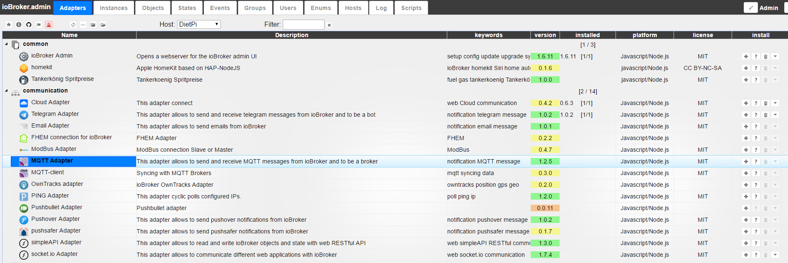

Sie sehen ein Popup-Fenster zur Treiberinstallation. Nach der Installation wird es automatisch geschlossen.

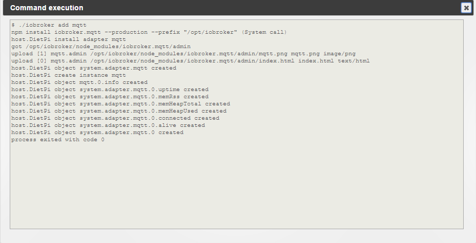

Wenn alles gut geht, wird auf der Registerkarte **Treibereinstellungen** die installierte Instanz des Treibers **mqtt.0** angezeigt.

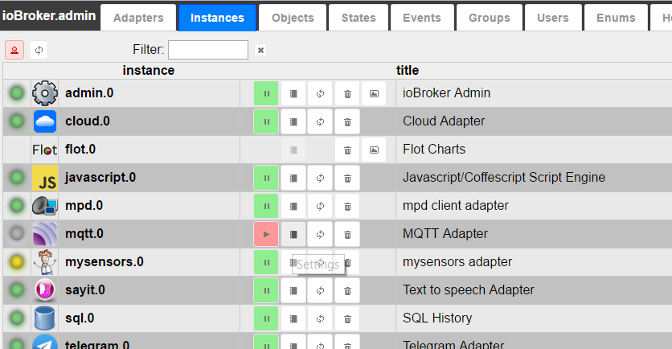

## Einstellung
Wie oben erwähnt, umfasst das MQTT-Protokoll einen Broker und Clients. Der ioBroker-Server kann sowohl als Broker als auch als Client fungieren.
Einstellungen zur Festlegung des Betriebsmodus – des Typs (Server/Broker oder Kunde/Abonnent). Berücksichtigen Sie alle Optionen.

### IoBroker arbeitet als MQTT-Broker
Die Grundeinstellungen für die Nutzung des Servers/Brokers sind in der Abbildung dargestellt:

* **WebSockets verwenden** - wenn für die Verbindung WEB-Sockets verwendet werden müssen, müssen Sie diese Option installieren. Der TCP-Server wird parallel zum WebSocket-Server ausgeführt.
* **Port** - der Port für die Verbindung über TCP (Standard ist 1883), ein WebSocket-Server (siehe Option oben) läuft auf Port +1 (Standard: 1884),
* **SSL** – diese Option wird verwendet, wenn Sie den gesamten Datenverkehr (TCP oder WebSocket) verschlüsseln möchten. Daher ist die Angabe von Zertifikaten erforderlich. Wählen Sie einfach aus einer Liste voreingestellter Zertifikate aus (angegeben in den Systemeinstellungen, siehe [Beschreibung des Systemverwaltungstreibers](http://www.iobroker.net/?page_id=4179&lang=en)).
* **Authentifizierungseinstellungen** (Benutzername und Passwort) - geben Sie bei Bedarf eine spezielle Benutzerauthentifizierung an. Diese Einstellung wird immer in Verbindung mit einer SSL-Verschlüsselungsoption verwendet (um Passwörter nicht im Klartext über eine unsichere Verbindung zu übertragen).
* **Private Werte maskieren** – die Vorlage (oder mehrere durch Kommas getrennte) zum Filtern von ioBroker-Variablen, die an den Client gesendet werden. Sie können Sonderzeichen verwenden, um eine Gruppe von Nachrichten anzugeben (z. B. „memRSS, mqtt.0“ – kann den Speicherstatus aller Variablen aller Treiber und alle Instanzvariablen des **mqtt.0-Treibers** übertragen),
* **Nur Änderungen senden** - Das Senden von Daten an den Client erfolgt nur im Falle einer Änderung einer Variablen (wenn der Status einfach aktualisiert wird - der Wert wird nicht geändert, die Kundennachricht wird nicht gesendet). Vom Client wird jede Nachricht akzeptiert, auch wenn sich der Wert nicht geändert hat.
* **Um beim Start private Werte anzugeben** - für jede erfolgreiche Clientverbindung werden alle bekannten Zustände (definiert durch den Maskenzustand) übertragen - um den Client über den aktuellen Zustand des ioBrokers zu informieren,
* **Status des Abonnements veröffentlichen** - unmittelbar nach dem Abonnement wird dem Kunden der Wert der Variable gesendet, auf der es signiert ist (beim ersten Start oder Neustart erhält der Client die Werte der Variablen, auf der es signiert ist, kann zum Initialisieren von Variablen verwendet werden),
* **Das Präfix für alle Werte** – wenn der angegebene Wert, wird er jedem gesendeten Thema als Präfix hinzugefügt. Wenn Sie beispielsweise iobroker/ angeben, werden alle Themen entlang der folgenden Zeilen gesendet: `iobroker/mqtt/0/connected`,
* **Ausgabeprotokoll für jede Änderung** - in der Protokolldatei werden Debuginformationen für jede Änderung angezeigt,
* **Um nicht nur Befehle, sondern auch den Status (ack=true) zu senden** - wenn diese Option nicht aktiv ist, sendet der Client nur Variablen/Befehle mit ack=false, wenn das Flag gesetzt ist, werden Variablen unabhängig vom Status von ack (false / true) übertragen,
* **Die maximale Länge des Namens eines Themas** - die maximale Anzahl an Zeichen für die Beschreibung des Themas, einschließlich Service.

Betrachten Sie als Beispiel den Datenaustausch zwischen dem Client basierend auf [Arduino-Platine](https://www.arduino.cc/) und dem Broker, einer Instanz des mqtt.0-Treibersystems ioBroker.

* - der Kunde – die Gebühr für die Entwicklung von [Arduino UNO](https://www.arduino.cc/en/Main/ArduinoBoardUno) + [Ethernet Shield](https://store.arduino.cc/product/A000072) basierend auf dem W5100-Chip,
* - Um mit der Ethernet-Karte zu arbeiten, verwenden Sie die Standard-[Bibliothek](https://www.arduino.cc/en/Reference/Ethernet) für die Arbeit mit der MQTT-Bibliothek [Pubsubclient](https://github.com/knolleary/pubsubclient),
* - der für die Untersuchung an Pin_8 angeschlossene AM2302-Sensor (Temperatur und Luftfeuchtigkeit) verwendete eine Bibliothek mit der Ressource [DHTlib](https://github.com/RobTillaart/Arduino/tree/master/libraries/DHTlib) von GitHub.com.
* - LED **led_green** ist mit Pin_9 verbunden, Steuerung im diskreten Modus ein/aus
* - Broker – ioBroker-Systemtreiber mqtt.

Formatthemen des Datenaustauschs:

* `example1/send_interval` – Client, der sich angemeldet hat, um das Übertragungsintervall der Temperatur- und Feuchtigkeitswerte zu ändern (int-Wert in Sekunden),
* `example1/temp` – Client veröffentlicht ein angegebenes Temperaturintervall mit DHT22-Sensor (Float-Typ),
* `example1/hum` – Client veröffentlicht ein angegebenes Feuchtigkeitswertintervall mit DHT22-Sensor (Float-Typ),
* `example1/led` – der Client ist auf die Statusänderung der LED (den Text an/aus oder 0/1 oder wahr/falsch) angemeldet.

Die Treibereinstellungen sind wie folgt:

Verbindung über TCP (WebSocket ist nicht erforderlich), Standardport 1883\. Der Client befindet sich im lokalen Netzwerk, daher ist eine Verschlüsselung des Datenverkehrs und eine Authentifizierung des Benutzers nicht erforderlich. Wir senden nur die Änderungen, da der Client die Angaben zum Sendeintervall und den LED-Status signiert hat. Es macht keinen Sinn, Informationen über die Aktualisierung einer Variablen zu erhalten (ohne deren Wert zu ändern). Beachten Sie diese Option zum Veröffentlichen des Abonnements, da der Client beim ersten Verbinden (oder nach dem Trennen der Verbindung) den Status der Variablen kennen muss, für die er signiert ist (das aktuelle Sendeintervall und ob die LED eingeschaltet werden soll). Die Einstellung zum Senden von Variablen ack = true oder false ist ebenfalls erwähnenswert, da eine Variable (die der Client signiert hat) von jedem Treiber/Skript/VIS geändert werden kann und alle Änderungen an den Client gesendet werden sollten. Der vollständige Code für das Arduino-Board sieht folgendermaßen aus:

<pre>// Bibliotheken verbinden

#enthalten
#enthalten
#include //https://github.com/knolleary/pubsubclient
#include //https://github.com/RobTillaart/Arduino/tree/master/libraries/DHTlib //Einstellungen eines Netzwerks byte mac[] = { 0xAB, 0xBC, 0xCD, 0xDE, 0xEF, 0x31 }; byte ip[] = { 192, 168, 69, 31 }; //IP-Adresse des Arduino-Boards byte mqttserver[] = { 192, 168, 69, 51 }; //IP-Adresse des ioBroker-Servers
EthernetClient ethClient; void callback(char *Thema, Byte* Nutzlast, vorzeichenlose int Länge); PubSubClient client(mqttserver, 1883, callback, ethClient);

//Globale Variablen

#define LED_pin 9 unsigned int send_interval = 10; // das Sendeintervall der Meldungen an den Server, standardmäßig 10 Sekunden unsigned long last_time = 0; // die aktuelle Zeit für den Timer dht DHT;
#define DHT22_PIN 8 Zeichen buff[20];
// Die Verarbeitungsfunktion für eingehende Verbindungen - Empfang von Daten bei einem Abonnement void callback(char * topic, byte * payload, unsigned int length) { Serial.println(""); Serial.println("-------"); Serial.println("Neuer Rückruf des MQTT-Brokers"); // Lassen Sie uns ein Subjekt (Thema) und einen Wert (Nutzlast) in eine Zeile umwandeln payload[length] = '\0'; String strTopic = String(topic); String strPayload = String((char * ) payload); // Recherche, die vom Server bei einem Abonnement "angekommen" ist:: // Änderung eines Abfrageintervalls if (strTopic == "example1/send_interval") { int tmp = strPayload.toInt(); if (tmp == 0) { send_interval = 10; } else { send_interval = strPayload.toInt(); } } // Ansteuerung einer LED if (strTopic == "example1/led") { if (strPayload == "off" || strPayload == "0" || strPayload == "false") digitalWrite(LED_pin, LOW); if (strPayload == "on" || strPayload == "1" || strPayload == "true") digitalWrite(LED_pin, HIGH); } Serial.print(strTopic); Serial.print(" "); Serial.println(strPayload); Serial.println("-------"); Serial.println(""); }

void setup() { Serial.begin(9600); Serial.println("Start..."); // Netzwerkverbindung starten Ethernet.begin(mac, ip); Serial.print("IP: "); Serial.println(Ethernet.localIP()); // Ein-/Ausgabeports initialisieren, Startwerte registrieren pinMode(LED_pin, OUTPUT); digitalWrite(LED_pin, LOW); // wenn die LED aus ist }

void loop() { // Wenn die MQTT-Verbindung inaktiv ist, dann versuchen wir diese herzustellen und zu veröffentlichen/abonnieren if (!client.connected()) { Serial.print("Connect to MQTT-boker... "); // Verbinden und veröffentlichen/abonnieren if (client.connect("example1")) { Serial.println("success"); // Wert von Sensoren if (DHT.read22(DHT22_PIN) == DHTLIB_OK) { dtostrf(DHT.humidity, 5, 2, buff); client.publish("example1/hum", buff); dtostrf(DHT.temperature, 5, 2, buff); client.publish("example1/temp", buff); } // für ein Abfrageintervall abonnieren client.subscribe("example1/send_interval"); // für die LED-Steuervariable abonnieren client.subscribe("example1/led"); } else { // Wenn keine Verbindung besteht, warten wir 10 Sekunden und versuchen es erneut. Serial.print("Failed, rc="); Serial.print(client.state()); Serial.println("Versuchen Sie es in 10 Sekunden erneut"); delay(10000); } // Wenn die Verbindung aktiv ist, werden die Daten im angegebenen Zeitintervall an den Server gesendet. } else { if (millis() &gt; (last_time + send_interval * 1000)) { last_time = millis(); if (DHT.read22(DHT22_PIN) == DHTLIB_OK) { dtostrf(DHT.humidity, 5, 2, buff); client.publish("example1/hum", buff); dtostrf(DHT.temperature, 5, 2, buff); client.publish("example1/temp", buff); } } } // Überprüfung eingehender Verbindungen bei einem Abonnement client.loop(); } </pre>

Das Ergebnis des Broker-Teils (Temperatur- und Feuchtigkeitsdaten werden mit dem voreingestellten Zeitraum aktualisiert):

Das Ergebnis der Clientseite (Ausgabe eingehender Datenabonnements an die Konsole zum Debuggen):

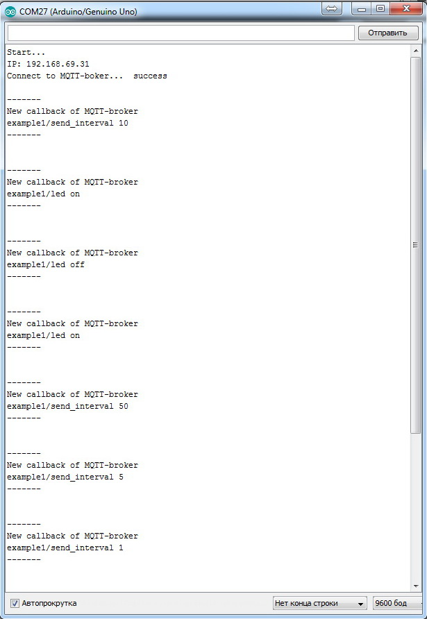

### IoBroker arbeitet als MQTT-Client
Beispielsweise muss für den MQTT-Treiber, der als Client/Abonnent fungiert, die entsprechende Konfigurationsart ausgewählt werden.
Die Optionen in diesem Satz ändern sich geringfügig:

* **Verbindungseinstellungen** - Geben Sie die URL und den Port des Brokers an (wenn Sie den Datenverkehr verschlüsseln möchten, geben Sie SSL an) - Einstellungen für die Verbindung mit dem Broker,
* **Authentifizierungseinstellungen** - Benutzername und Passwort, wenn der Broker eine Authentifizierung erfordert (es ist angebracht, SSL zu verwenden, um die Übertragung des Passworts im Klartext zu vermeiden),
* **Muster** - eine Maske für Variablen, die der Kunde abonniert (Variablenbroker), die Werte werden durch Kommas getrennt aufgelistet, das # (Raute) dient zur Kennzeichnung des Sets,
* **Private Werte maskieren** - Filtern Sie Variablen, die veröffentlicht werden sollen (Clientvariablen), deren Werte durch Kommas getrennt aufgelistet sind. Verwenden Sie zur Kennzeichnung einer Menge das Symbol * (Sternchen).
* **Nur Änderungen senden** - der Client veröffentlicht nur die Variablen, deren Wert sich geändert hat (gemäß Maske).
* **Um private Werte beim Start anzugeben** - wenn diese Option aktiviert ist, werden bei jedem Verbindungsaufbau alle Zustände (gemäß Maske) veröffentlicht, um die verfügbaren Variablen und ihre Werte zu deklarieren.
* **Das Präfix für alle Werte** – wenn der angegebene Wert, wird er jedem veröffentlichten Thema als Präfix hinzugefügt, z. B. wenn Sie client1 / angeben, werden alle Themen mit den folgenden Zeilen veröffentlicht: `client1/javascript/0/cubietruck`,
* **Ausgabeprotokoll für jede Änderung** - in der Protokolldatei werden Debuginformationen für jede Änderung angezeigt,
* **Um nicht nur das Team, sondern auch den Status zu senden (ack = true)** - wenn diese Option nicht aktiviert ist, sendet der Broker nur Variablen / Befehle mit ack = false, wenn die Option zu beachten, dass an alle Daten gesendet werden, unabhängig von ack = true oder ack = false,
* **Die maximale Länge eines Themas** - die maximale Anzahl an Zeichen für die Beschreibung des Themas, einschließlich Service.

Beispiele für das Setzen der Abonnementmaskenvariablen (Muster). Berücksichtigen Sie folgende Themen:

* "Sport"
* "Sport/Tennis"
* "Sport/Basketball"
* "Sport/Schwimmen"
* "Sport/Tennis/Finale"
* "Sport/Basketball/Finale"
* "Sport/Schwimmen/Finale"

Wenn Sie einen bestimmten Themensatz abonnieren möchten, können Sie die Zeichen # (Raute-Zeichen) oder + (Plus-Zeichen) verwenden.

* „Sport/Tennis/#“ (nur im Abonnement „Sport/Tennis“ und „Sport/Tennis/Finals“)
* „Sport/Tennis/+“ (Abonnement nur „Sport/Tennis/Finals“, nicht aber „Sport/Tennis“)

Wenn Sie bei JMS-Themen alle Themen „Finals“ abonnieren möchten, können Sie die Zeichen # (Raute-Zeichen) oder + (Plus-Zeichen) verwenden.

* "Sport/#/Finale"
* "Sport/+/Finale"

Wenn Sie bei MQTT-Themen alle Themen „Finals“ abonnieren möchten, können Sie das + (Pluszeichen) verwenden.

* "Sport/+/Finale"

Betrachten wir als Beispiel den Datenaustausch zwischen den beiden ioBroker-Systemen. Ein funktionierendes ioBroker-System für das BananaPi-Board (IP-Adresse 192.168.69.51) startet den MQTT-Treiber im Server-/Broker-Modus (siehe obiges Beispiel).
Mit dem Server verbindet sich ein Client, der Daten vom Sensor DHT22 – Temperatur und Luftfeuchtigkeit sowie signierte Variablen der Intervallmessübertragung und die Status-LED (aktiviert/deaktiviert) – wie im obigen Beispiel – veröffentlicht.
Das zweite Betriebssystem ioBroker auf dem Cubietruck-Board führt den MQTT-Treiber im Client-/Abonnenten-Modus aus.
Er meldet die Variablen Temperatur und Luftfeuchtigkeit des Brokers an (der wiederum Daten von einem anderen Client empfängt) und veröffentlicht alle Skriptvariablen (nur die Änderungen) des Boards. Die Client-Konfiguration sieht in etwa wie folgt aus:

Verbindungstyp – Der Kunde/Abonnent gibt die IP-Adresse des Brokers und den Port (Standard 1883) an.
Verkehrsverschlüsselung und Authentifizierung sind nicht erforderlich.

Maske für die Abonnements (Muster) – `mqtt/0/example1/hum,mqtt/0/example1/temp` – Der Client ist nur für Temperatur und Luftfeuchtigkeit angemeldet (Werte durch Komma getrennt, ohne Leerzeichen).

Maskieren Sie die Daten für die Veröffentlichung - `javascript.0.cubietruck.battery.*` - veröffentlichen Sie alle Skriptvariablen `cubietruck` in der Gruppe `battery`, Treiber `javascript.0`.

Um nur die Änderungen zu senden, senden Sie die Statusvariablen „Batterien“ (es macht keinen Sinn, sie zu senden, wenn sich der Wert nicht geändert hat). Um beim Start private Werte zu vergeben, gibt der Client beim Starten des Treibers sofort alle Variablen entsprechend der Maske frei, auch wenn sie null oder leer sind, um Variablen im Broker zu erstellen.

Um Daten mit ack=false zu senden, müssen die Variablen mit dem aktualisierten JavaScript-Treiber arbeiten, sodass sie immer ack=false sind. Das Ergebnis der Arbeit auf der Clientseite (Temperatur- und Feuchtigkeitsdaten eines anderen Kunden – siehe Beispiel oben):

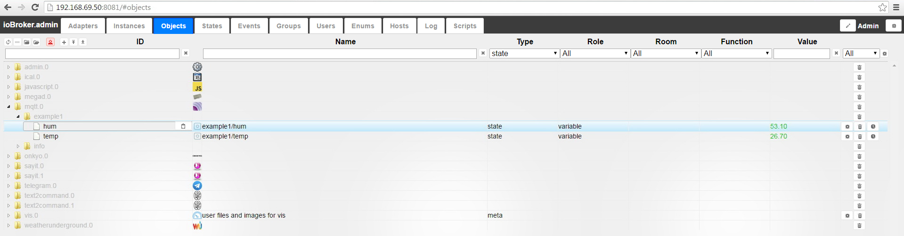

Das Ergebnis des Brokers (Statusdaten des Batterie-Clients):

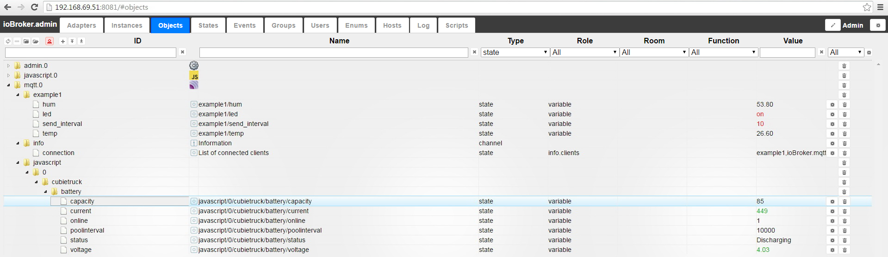

## Anwendung - MQTT-Gateway-Protokolle - ModBus RTU
Der MQTT-Treiber kann als Gateway für verschiedene Protokolle verwendet werden, um neue Geräte an das ioBroker-System oder andere Systeme anzuschließen. Arduino-Boards bilden eine universelle Basis für die Entwicklung solcher Lösungen. Im Netzwerk gibt es zahlreiche Beispiele, Bibliotheken und Best Practices. Eine große Community arbeitet mit diesen Controllern, und das System integriert eine Vielzahl von Geräten.

Betrachten wir beispielsweise das gängige Industrieprotokoll ModBus. Das ioBroker-System verfügt über einen entsprechenden Treiber – die Version ModBus TCP (über Ethernet). Sensoren, Controller und Aktoren arbeiten physikalisch über das RS-485-/232-Netzwerk und das ModBus-RTU-Protokoll. Zur Integration kann ein MQTT-Gateway – ModBus RTU basierend auf der Arduino-Plattform – eingesetzt werden. Betrachten wir ein Beispiel.

**Es gibt einen Temperatur- und Feuchtigkeitssensor** (für den Test auf Basis des Arduino Pro Mini Boards DHT22 Sensor), der Daten über ModBUS RTU ausgibt:

* Port UART (Sie können den MAX485-Chip verwenden, um die RS-485-Schnittstelle zu konvertieren) läuft bei 9600 mit den Optionen 8E1 (1 Startbit, 8 Datenbits, 1 gerades Paritätsbit, 1 Stoppbit),
* die Adresse des ModBus – 10,
* Temperaturadresse 0 der Wert multipliziert mit 10 (die Leserfunktion 3),
* Luftfeuchtigkeit – Wert von Adresse 1 multipliziert mit 10 (Lesefunktion 3),
* PWM-LED-Adresse 2 Wert 0...1023 zur Überprüfung der Aufnahmefunktion (Schreibfunktion 6).

Anschlussschema:

 von Fritzing

Der Code für den Arduino Pro Mini-Controller erzeugt Folgendes:

<pre>

#include //https://github.com/RobTillaart/Arduino/tree/master/libraries/DHTlib
#include //https://code.google.com/archive/p/simple-modbus/
#include //https://github.com/PaulStoffregen/MsTimer2 // Modbus-Register enum { TEMP, HUM, PWM, TEST, HOLDING_REGS_SIZE };
#define ID_MODBUS 10 // Modbus-Adresse des Slave-Geräts unsigned int holdingRegs[HOLDING_REGS_SIZE]; // Modbus-Register-Array // Temperatur- und Feuchtigkeitssensor DHT22 dht DHT;
#define DHT22_PIN 2
#define LED 9 // LED ist mit PWM-Pin 9 verbunden void setup() { // Modbus konfigurieren modbus_configure(& Serial, 9600, SERIAL_8E1, ID_MODBUS, 0, HOLDING_REGS_SIZE, holdingRegs); holdingRegs[TEST] = -157; // für den Test der negativen Werte // einen Timer für 2 Sekunden initialisieren, Daten in Temperatur- und Feuchtigkeitsregistern aktualisieren MsTimer2::set(2000, read_sensors); MsTimer2::start(); // Timer ausführen pinMode(LED, OUTPUT); // Initialisierung des LED-Anschlusses } // die Funktion wird alle 2 Sekunden vom Timer gestartet void read_sensors() { if (DHT.read22(DHT22_PIN) == DHTLIB_OK) { falls die Daten vom Sensor DHT22 gelesen werden konnten // schreiben wir einen Integer-Wert in das Feuchtigkeitsregister holdingRegs[HUM] = 10 *DHT.humidity; // wir schreiben einen Integer-Wert in das Temperaturregister holdingRegs[TEMP] = 10* DHT.temperature; } else { // falls das Lesen der Daten vom Sensor DHT22 nicht erfolgreich war, schreiben wir Null in die Register holdingRegs[HUM] = 0; holdingRegs[TEMP] = 0; } } void loop() { modbus_update(); // Modbus-Datenaktualisierung // Daten vom LED-Steuerregister an das PWM übertragen (Bitverschiebung um 2 Bit) analogWrite(LED, holdingRegs[PWM] >> 2); } </pre>
Um den Betriebscode und das Schema zu testen, können Sie eine Verbindung zum seriellen Port der Karte herstellen (z. B. mithilfe eines USB-UART-Konverters) und ein spezielles Programm verwenden, um den soeben erstellten Temperatur- und Feuchtigkeitssensor mit der ModBus-RTU-Schnittstelle abzufragen.
Für die Abfrage können Sie beispielsweise [qmodbus](http://qmodbus.sourceforge.net/) oder ein anderes Programm verwenden.

Einstellungen:

- Port (wählen Sie aus der Liste aus, welcher Port mit den seriellen Arduino-Boards verbunden ist);
- Geschwindigkeit und andere Parameter – 9600 8E1;
- Slave-ID: 10, Lesen: Funktion Nr. 3 Halteregister lesen, Startadresse: 0, Anzahl der Register: 3,
- Slave-ID: 10, Datensatz: Funktion Nr. 6, einzelnes Register schreiben, Startadresse: 2,

Die Antwort im Programm beim Lesen sollte ungefähr wie folgt lauten:

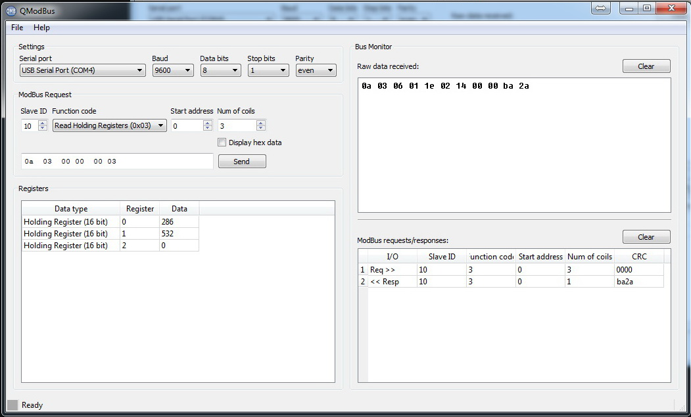

Die Antwort im Programm bei der Aufnahme:

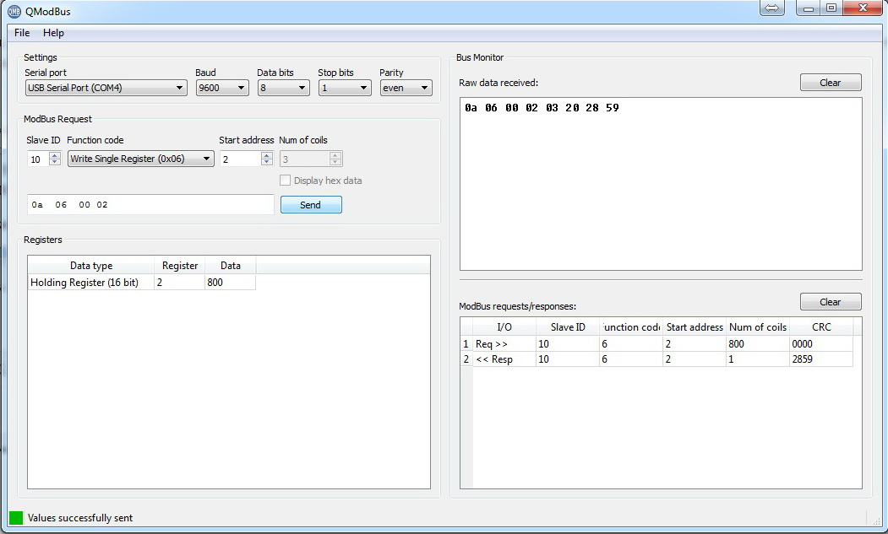

**Konfigurieren Sie nun das Gateway selbst und verbinden Sie es mit dem iobroker**

Das Gateway basiert auf der Arduino MEGA 2560-Plattform mit Ethernet-Shield – MQTT-Client, Broker – einem Instanz-mqtt.0-ioBroker-Systemtreiber.
Die Wahl des MEGA 2560 erfolgte aufgrund der Tatsache, dass dieses Board mehr als einen UART-Port besitzt. Der Serial0-Port (Pin_0 (RX) und Pin_1 (TX)) bzw. der einfache Serial-Port dient zur Ausgabe von Debug-Meldungen, der Serial1-Port (Pin_19 (RX) und Pin_18 (TX)) dient als Slave über ModBus.

* der Kunde – die Gebühr für die Entwicklung von Arduino MEGA 2560 + Ethernet Shield basierend auf dem W5100-Chip;
* Für die Arbeit mit der Ethernet-Karte wird die [Standardbibliothek](https://www.arduino.cc/en/Reference/Ethernet) verwendet.

zum Arbeiten mit der MQTT-Bibliothek [Pubsubclient](https://github.com/knolleary/pubsubclient);

* Verwenden Sie für die Umfrage zum Modbus die Bibliothek [SimpleModbus](https://code.google.com/archive/p/simple-modbus/) Version Master.
* Umfrage zum UART-Port (schließen Sie einfach den RX-Port-Master, den TX-Port-Slave und entsprechend den TX-Port-Master und den RX-Port-Slave an), der Übertragungssteuerungsport wird nicht verwendet (er ist für RS-485);
* Porteinstellungen: Geschwindigkeit 9600, 8E1;
* die Adresse des Slave-Geräts 10, eine Lesefunktion Nr. 3 (Halteregister lesen), Aufzeichnungsfunktion Nr. 6 (Einzelregister schreiben);
* Broker – ioBroker-Systemtreiber mqtt.

Formatthemen des Datenaustauschs:

* `modbusgateway/send_interval` – Client, der sich angemeldet hat, um das Übertragungsintervall der Temperatur- und Feuchtigkeitswerte zu ändern (int-Wert in Sekunden),
* `modbusgateway/temp` - Client veröffentlicht in einem bestimmten Intervall den Wert des Temperatursensors DHT22 (Typ Float),
* `modbusgateway/hum` - der Client veröffentlicht in einem bestimmten Intervall den Wert des Feuchtigkeitssensors DHT22 (Typ Float),
* `modbusgateway/led` - der Client ist auf die Zustandsänderung der LED (PWM-Steuerwert 0...1024) angemeldet.

Das Anschlussdiagramm sieht ungefähr so aus:

Für den Test wird das Slave-Gerät vom Master-Gerät mit Strom versorgt. Der Master wiederum arbeitet über den zu debuggenden USB-Port (Serial0).
Die Treibereinstellungen lauten wie folgt:

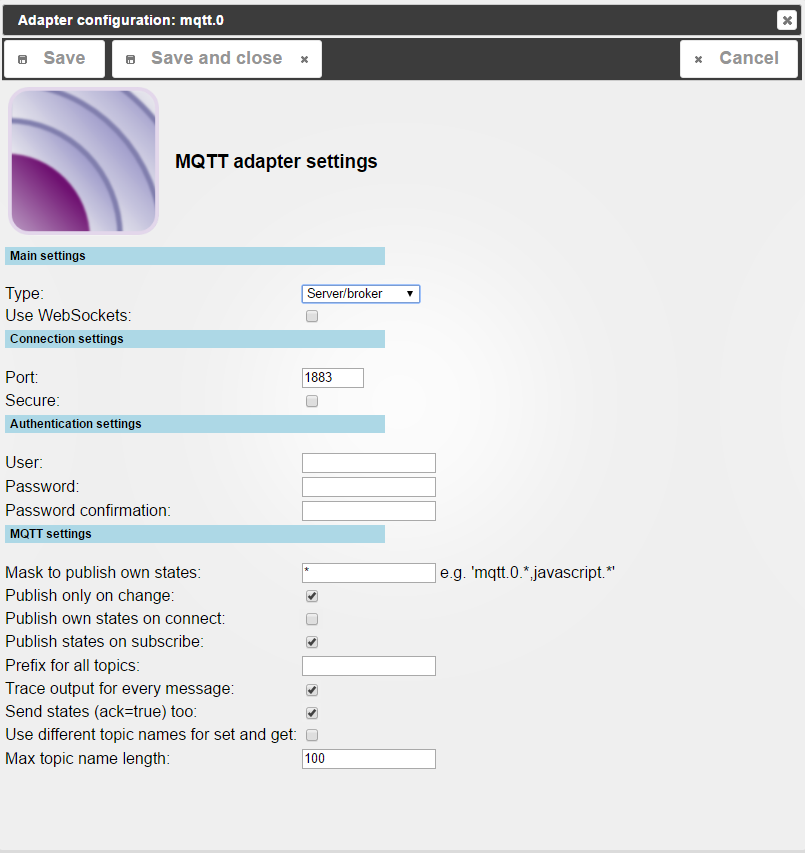

Verbindung über TCP (WebSocket ist nicht erforderlich), Standardport 1883\. Der Client befindet sich im lokalen Netzwerk, daher ist eine Verschlüsselung des Datenverkehrs und eine Authentifizierung des Benutzers nicht erforderlich. Wir senden nur die Änderungen, da der Client die Angaben zum Sendeintervall und den LED-Status signiert hat. Es macht keinen Sinn, Informationen über die Aktualisierung einer Variablen zu erhalten (ohne deren Wert zu ändern). Beachten Sie diese Option zum Veröffentlichen des Abonnements, da der Client beim ersten Verbinden (oder nach dem Trennen der Verbindung) den Status der Variablen kennen muss, für die er signiert ist (das aktuelle Sendeintervall und ob die LED eingeschaltet werden soll). Die Einstellung zum Senden von Variablen ack = true oder false ist ebenfalls erwähnenswert, da eine Variable (die der Client signiert hat) von jedem Treiber/Skript/VIS geändert werden kann und alle Änderungen an den Client gesendet werden sollten. Der vollständige Code für das Arduino-Board sieht folgendermaßen aus:

<pre class="">// Bibliotheken verbinden

#enthalten
#enthalten
#include //https://github.com/knolleary/pubsubclient
#include //https://github.com/RobTillaart/Arduino/tree/master/libraries/DHTlib
// Einstellungen eines Netzwerks byte mac[] = { 0xAB, 0xBC, 0xCD, 0xDE, 0xEF, 0x31 }; byte ip[] = { 192, 168, 69, 31 }; // IP-Adresse der Arduino-Platine byte mqttserver[] = { 192, 168, 69, 51 }; // IP-Adresse des ioBroker-Servers EthernetClient ethClient; void callback(char* topic, byte* payload, unsigned int length); PubSubClient client(mqttserver, 1884, callback, ethClient); // Globale Variablen unsigned int send_interval = 10; // das Sendeintervall der Meldungen an den Server, standardmäßig 10 Sekunden unsigned long last_time = 0; // die aktuelle Zeit für den Timer dht DHT;

#define DHT22_PIN 8 Zeichen buff[20];
//Die Verarbeitungsfunktion für eingehende Verbindungen - Empfang von Daten bei einem Abonnement void callback(char* topic, byte* payload, unsigned int length) { Serial.println(""); Serial.println("-------"); Serial.println("Neuer Rückruf des MQTT-Brokers"); // Lassen Sie uns ein Subjekt (Thema) und einen Wert (Nutzlast) in eine Zeile umwandeln payload[length] = '\0'; String strTopic = String(topic); String strPayload = String((char*)payload); // Recherche, die vom Server bei einem Abonnement "angekommen" ist: // Änderung des Anfrageintervalls if (strTopic == "example2/send_interval") { int tmp = strPayload.toInt(); if (tmp == 0) { send_interval = 10; } else { send_interval = strPayload.toInt(); } } Serial.print(strTopic); Serial.print(" "); Serial.println(strPayload); Serial.println("-------"); Serial.println(""); }

void setup() { Serial.begin(9600); Serial.println("Start..."); // Netzwerkverbindung starten Ethernet.begin(mac, ip); Serial.print("IP: "); Serial.println(Ethernet.localIP()); // Ein-/Ausgabeports initialisieren, Startwerte registrieren }

void loop() { // Wenn die MQTT-Verbindung inaktiv ist, dann versuchen wir diese herzustellen und zu veröffentlichen/abonnieren if (!client.connected()) { Serial.print("Connect to MQTT-boker... "); // Verbinden und veröffentlichen/abonnieren if (client.connect("example2")) { Serial.println("success"); // Wert von Sensoren if (DHT.read22(DHT22_PIN) == DHTLIB_OK) { dtostrf(DHT.humidity, 5, 2, buff); client.publish("example2/hum", buff); dtostrf(DHT.temperature, 5, 2, buff); client.publish("example2/temp", buff); } // Für ein Abfrageintervall abonnieren client.subscribe("example2/send_interval"); } else { // Wenn keine Verbindung besteht, warten wir 10 Sekunden und versuchen es erneut. Serial.print("Failed, rc="); Serial.print(client.state()); Serial.println("Versuchen Sie es in 10 Sekunden erneut"); delay(10000); } // Wenn die Verbindung aktiv ist, werden die Daten im angegebenen Zeitintervall an den Server gesendet. } else { if (millis() &gt; (last_time + send_interval * 1000)) { last_time = millis(); if (DHT.read22(DHT22_PIN) == DHTLIB_OK) { dtostrf(DHT.humidity, 5, 2, buff); client.publish("example2/hum", buff); dtostrf(DHT.temperature, 5, 2, buff); client.publish("example2/temp", buff); } } } // Überprüfung eingehender Verbindungen bei einem Abonnement client.loop(); } </pre>

Diese Lösung kann als Prototyp (Beispiel) eines ModBus-Netzwerks in Ihrem Automatisierungssystem verwendet werden. Die Daten vom Slave werden im gewünschten Abstand im ioBroker übertragen.

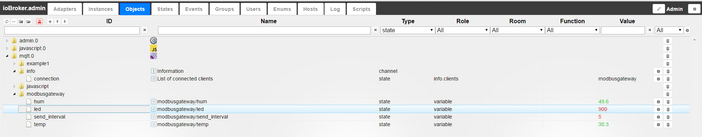

Vom MQTT-Client signierte Variablen und Weiterleitungen, die im Slave-Gerät im ModBus-Netzwerk benötigt werden.

## Anwendung - Anbindung mobiler Clients
Das MQTT-Protokoll hat sich in letzter Zeit aufgrund seiner Einfachheit, der Wirtschaftlichkeit des Datenverkehrs und der Entwicklung hochwertiger Bibliotheken für verschiedene Plattformen stark verbreitet.
Es gibt zahlreiche Programme für die Arbeit mit MQTT auf Mobilgeräten, zum Beispiel [IoT MQTT Dashboard](https://play.google.com/store/apps/details?id=com.thn.iotmqttdashboard&hl=en).
Mit diesem Programm können Sie sich mit dem MQTT-Broker in einem lokalen Netzwerk oder im Internet verbinden.

Betrachten wir ein Beispiel: Die Rolle des Brokers übernimmt das ioBroker-System, mit dem über MQTT eine Verbindung zum Client – der IoT MQTT Dashboard-Anwendung – hergestellt wird.

In diesem Beispiel steuern wir den Lichtcontroller [MegaD-328](http://www.ab-log.ru/smart-house/ethernet/megad-328), der über den Treiber [MegaD](http://www.iobroker.net/?page_id=4052&lang=en) mit dem ioBroker verbunden ist.

Steuert das Relais (MegaD-Port **P7**) des Lichts in der Lobby. Ein spezielles Skript, das durch den Status des Ports (Taste **P0**) und die MQTT-Variable **mqtt.0.remotectrl.light.hall** signiert ist und vom mobilen Client veröffentlicht wird, schaltet den Status des Ports um, der mit dem Switch (Port P7) verbunden ist.

Es stellt sich heraus, dass jedes Mal, wenn Sie die Taste drücken, die mit Port **P0** elektrisch verbunden ist (der Zustand **true** wird erfasst) und jedes Mal, wenn Sie den Wert der Variable **mqtt.0.remotectrl.light.hall** als **true** veröffentlichen, Port **P7** das Licht ein- oder ausschaltet.
Der Text des Skripts lautet wie folgt:

<pre>// Steuerung der Beleuchtung in der Halle mittels des Taster-Ports p0 des MegaD-Controllers die Treiberinstanz megad.0 on({ id : &#39;megad.0.p0_P0&#39;, change : &#39;any&#39; }, function(obj) { if (obj.newState.val != = &#39;&#39; || typeof obj.newState.val != = &quot;undefined&quot;) { if (obj.newState.val == = true) { if (getState(&#39;megad.0.p7_P7&#39;).val == = true) { setState(&#39;megad.0.p7_P7&#39;, false); } else { setState(&#39;megad.0.p7_P7&#39;, true); } } } }); // Die Steuerung der Beleuchtung in der Halle erfolgt remote über MQTT, ein Thema „mqtt.0.remotectrl.light.hall“ on({ id : ‚mqtt.0.remotectrl.light.hall‘, change : ‚any‘ }, function(obj) { if (obj.newState.val != = ‚‘ || typeof obj.newState.val != = ‚undefined‘) { if (obj.newState.val == = true) { if (getState(‚megad.0.p7_P7‘).val == = true) { setState(‚megad.0.p7_P7‘, false); } else { setState(‚megad.0.p7_P7‘, true); } } } });</pre>

Taster und Glühbirnen an MegaD-Controller anschließen:

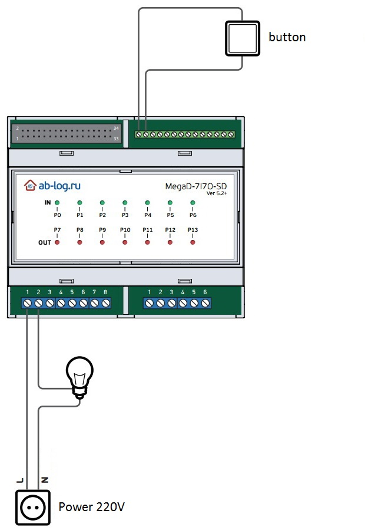

MQTT-Treibereinstellungen:

Der mobile Client kann Daten an die Variable mqtt.0.remotectrl.light.hall veröffentlichen und sich für einen echten Portstatus MegaD – megad.0.p7_P7 anmelden.

Konfigurieren Sie Veröffentlichungen und Abonnements:

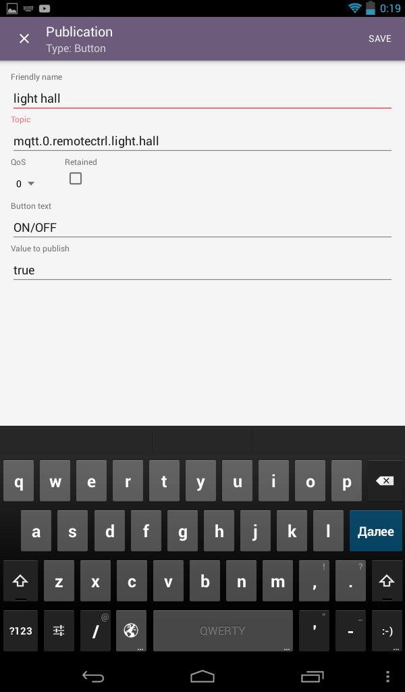

Insgesamt ist für die Lichtsteuerung eines Kanals das Steuerungsfenster (Veröffentlichen) und das Abonnementfenster ein echtes Zustandslichtrelais (für Feedback):

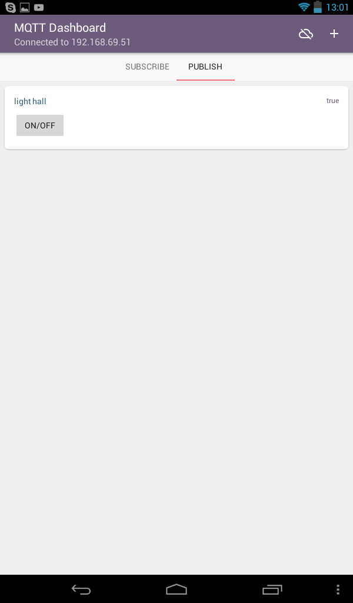

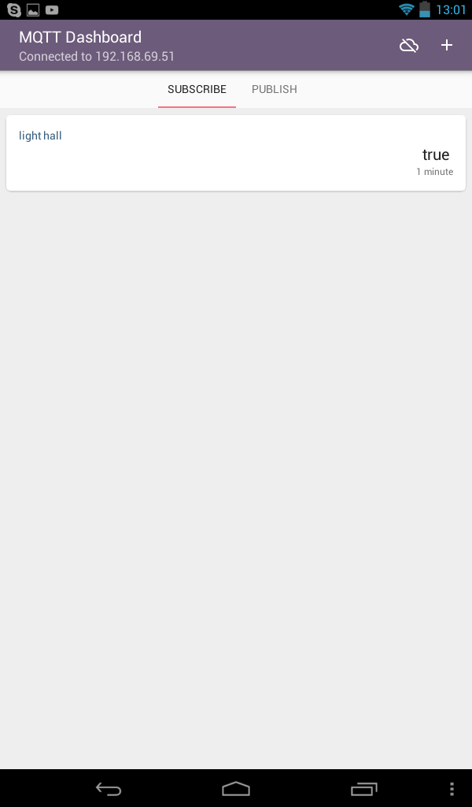

## Anwendung - Arbeiten mit Cloud-Servern
Das oben beschriebene Beispiel hat mehrere Nachteile. Erstens kann sich der mobile Client nicht immer im selben lokalen Netzwerk wie der ioBroker-Server befinden, und zweitens kann der ioBroker-Server selbst eingehende Verbindungen nicht immer annehmen, selbst wenn Portweiterleitung im Internet implementiert und die Verbindung geschützt ist (er befindet sich hinter einem NAT, das keinen Zugriff auf die Einstellungen hat). Im globalen Netzwerk gibt es viele verschiedene Dienste, die MQTT unterstützen – kostenpflichtige und kostenlose, beispielsweise zum Senden von Wetterdaten, Geolokalisierung usw. Einige Dienste können als MQTT-Protokollbroker fungieren und als Gateway (Bridge) verwendet werden, um Daten vom ioBroker ins globale Netzwerk zu übertragen oder dort abzurufen. Betrachten wir als Beispiel die Funktionsweise von Bundles:

* Server / Broker - Dienst [cloudmqtt.com](https://www.cloudmqtt.com/) (es gibt einen kostenlosen Tarif),
* Kunde/Abonnent – das ioBroker-System mit Internetzugang, veröffentlicht Daten zu Temperatur und Luftfeuchtigkeit (siehe [Beispiel oben](http://www.iobroker.net/?page_id=6435&lang=en#ioBroker_working_as_MQTT-broker)), veröffentlicht den tatsächlichen Status der Ports **P7-P13** (Relaistreiber MegaD **megad.0** – Lichtsteuerung), abonniert die Eigenschaften der Fernlichtsteuerung (eine Instanz des Treibers mqtt **mqtt.0**),
* Kunde/Abonnent – die Anwendung von [IoT MQTT Dashboard](https://play.google.com/store/apps/details?id=com.thn.iotmqttdashboard&hl=en) für die Fernarbeit – Abonnieren von Sensordaten zu Temperatur und Luftfeuchtigkeit, Abonnieren des tatsächlichen Status der Ports **P7-P13** (Relaistreiber MegaD **megad.0**), Veröffentlichung von Variablen einer Fernbedienungsleuchte (Treiberinstanz **mqtt.0**).

Das Ergebnis ist folgende Struktur:

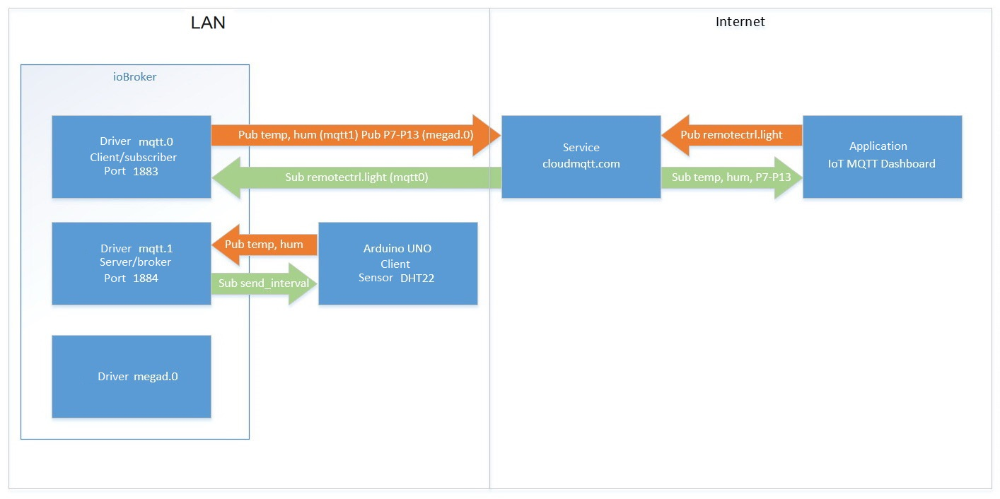

Bundle-Treiber **mqtt.1** (Broker) – Arduino UNO + Ethernet + DHT22 (Client) wie in [das obige Beispiel](http://www.iobroker.net/?page_id=6435&lang=en#ioBroker_working_as_MQTT-broker) mit einigen Änderungen.
Konfiguration einer Instanz des mqtt **driver.1**:

Code für die Arduino-Plattform:

<pre class="">// Bibliotheken verbinden

#enthalten
#enthalten
#include //https://github.com/knolleary/pubsubclient
#include //https://github.com/RobTillaart/Arduino/tree/master/libraries/DHTlib
// Einstellungen eines Netzwerks byte mac[] = { 0xAB, 0xBC, 0xCD, 0xDE, 0xEF, 0x31 }; byte ip[] = { 192, 168, 69, 31 }; // IP-Adresse der Arduino-Platine byte mqttserver[] = { 192, 168, 69, 51 }; // IP-Adresse des ioBroker-Servers EthernetClient ethClient; void callback(char* topic, byte* payload, unsigned int length); PubSubClient client(mqttserver, 1884, callback, ethClient); // Globale Variablen unsigned int send_interval = 10; // das Sendeintervall der Meldungen an den Server, standardmäßig 10 Sekunden unsigned long last_time = 0; // die aktuelle Zeit für den Timer dht DHT;

#define DHT22_PIN 8 char buff[20]; //Die Verarbeitungsfunktion für eingehende Verbindungen - Empfang von Daten bei einem Abonnement void callback(char* topic, byte* payload, unsigned int length) { Serial.println(""); Serial.println("-------"); Serial.println("Neuer Rückruf des MQTT-Brokers"); // Lassen Sie uns ein Subjekt (Thema) und einen Wert (Nutzlast) in eine Zeile umwandeln payload[length] = '\0'; String strTopic = String(topic); String strPayload = String((char*)payload); // Recherche, die vom Server bei einem Abonnement "angekommen" ist: // Änderung des Anfrageintervalls if (strTopic == "example2/send_interval") { int tmp = strPayload.toInt(); if (tmp == 0) { send_interval = 10; } sonst { send_interval = strPayload.toInt(); } } Serial.print(strTopic); Serial.print(" "); Serial.println(strPayload); Serial.println("-------"); Serial.println(""); }
void setup() { Serial.begin(9600); Serial.println("Start..."); // Netzwerkverbindung starten Ethernet.begin(mac, ip); Serial.print("IP: "); Serial.println(Ethernet.localIP()); // Ein-/Ausgabeports initialisieren, Startwerte registrieren }

void loop() { // Wenn die MQTT-Verbindung inaktiv ist, dann versuchen wir diese herzustellen und zu veröffentlichen/abonnieren if (!client.connected()) { Serial.print("Connect to MQTT-boker... "); // Verbinden und veröffentlichen/abonnieren if (client.connect("example2")) { Serial.println("success"); // Wert von Sensoren if (DHT.read22(DHT22_PIN) == DHTLIB_OK) { dtostrf(DHT.humidity, 5, 2, buff); client.publish("example2/hum", buff); dtostrf(DHT.temperature, 5, 2, buff); client.publish("example2/temp", buff); } // Für ein Abfrageintervall abonnieren client.subscribe("example2/send_interval"); } else { // Wenn keine Verbindung besteht, warten wir 10 Sekunden und versuchen es erneut. Serial.print("Failed, rc="); Serial.print(client.state()); Serial.println("Versuchen Sie es in 10 Sekunden erneut"); delay(10000); } // Wenn die Verbindung aktiv ist, werden die Daten im angegebenen Zeitintervall an den Server gesendet. } else { if (millis() &gt; (last_time + send_interval * 1000)) { last_time = millis(); if (DHT.read22(DHT22_PIN) == DHTLIB_OK) { dtostrf(DHT.humidity, 5, 2, buff); client.publish("example2/hum", buff); dtostrf(DHT.temperature, 5, 2, buff); client.publish("example2/temp", buff); } } } // Überprüfung eingehender Verbindungen bei einem Abonnement client.loop(); }</pre>

Das Ergebnis der Arbeit – **mqtt.1**-Treiberobjekte:

Richten wir nun die Veröffentlichung/Abonnement-Daten in der Cloud ein. Registrieren Sie sich zunächst auf der Website [cloudmqtt.com](https://www.cloudmqtt.com/), wählen Sie den gewünschten Tarif aus, erstellen Sie eine Instanz und nehmen Sie die Einstellungen vor:

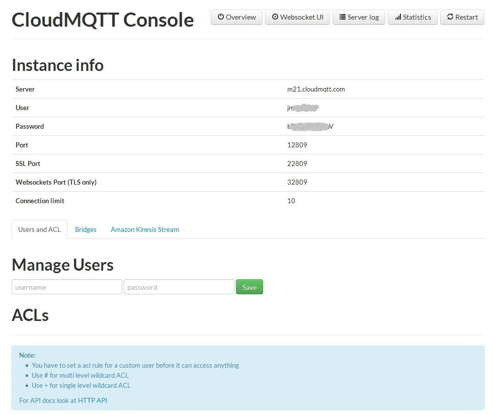

Aus Sicherheitsgründen empfiehlt es sich, einen separaten Benutzer zu erstellen. Nehmen wir an, es handelt sich um den Benutzer **iobroker** mit dem Passwort **1234**.
Erteilen Sie dem Benutzer Lese- und Schreibberechtigungen für alle Themen:

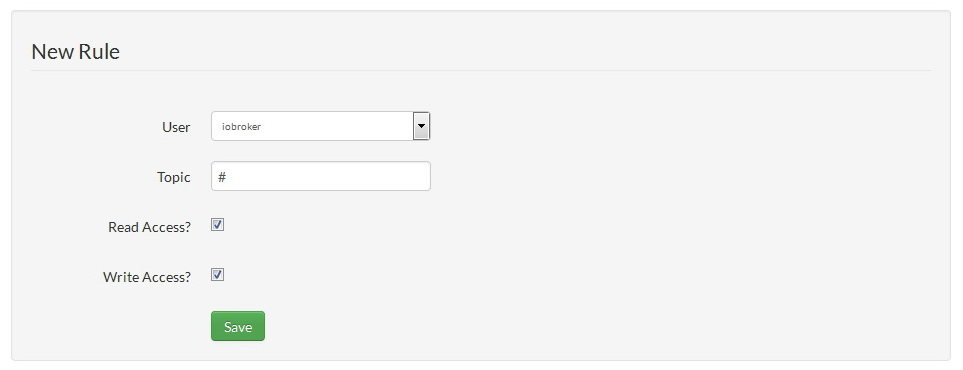

Als nächstes legen Sie die Instanz des mqtt **driver.0** so fest, dass sie als Client/Abonnent-Cloud-Broker eine Verbindung herstellt, und eine Liste von Veröffentlichungen/Abonnements:

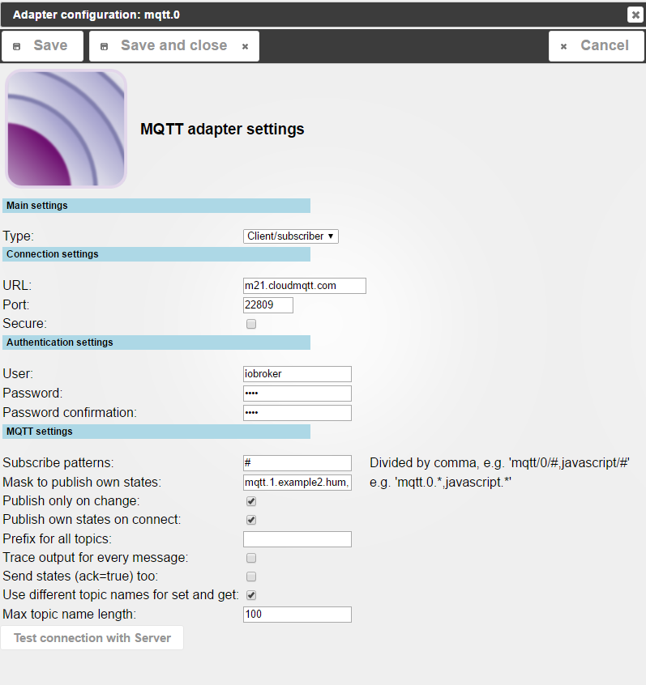

* Anschlussart – der Kunde/Abonnent,
* Verbindungseinstellungen – Geben Sie die im Control Panel [cloudmqtt.com](https://www.cloudmqtt.com/) ausgegebene URL an. Der verwendete Port ist **22809**, der mit **SSL** funktioniert.
* Geben Sie in den Authentifizierungsoptionen den Benutzernamen und das Passwort an.
* Muster – unser Client ioBroker wird auf allen Themen in der Cloud angemeldet sein, daher geben Sie hier das Nummernzeichen (**#**) an. Sie können eine Maske verwenden, um selektiv zu abonnieren.
* Maske der Eigenwerte, die der Client an den Server sendet: **Temperatur/Luftfeuchtigkeit** und den Status aller Ports MegaD (Ports mit Relais P7-P13). Dieses durch Komma getrennte Feld gibt die erforderlichen Variablen an: **mqtt.1.example2.hum,mqtt.1.example2.temp,megad.0.p7_P7,megad.0.p8_P8,megad.0.p9_P9,megad.0.p10_P10,megad.0.p11_P11,megad.0.p12_P12,megad.0.p13_P13**,
* Nur Änderungen senden – setzen Sie ein Häkchen, es werden nur die Änderungen veröffentlicht,
* eigene Werte gleich zu Beginn anzugeben – einfach Themen anlegen,
* um nicht nur Befehle, sondern auch den Status (ack=true) zu senden – es ist zu beachten, dass sowohl die Einstellung der Temperatur/Luftfeuchtigkeit den Treiber mqtt aktualisiert (ack=true).

Die Einstellungen wurden gespeichert. Stellen Sie sicher, dass die Verbindung hergestellt ist (beobachten Sie im Bedienfeld [cloudmqtt.com](https://www.cloudmqtt.com/) den Protokollserver).
Nach einiger Zeit werden folgende Daten angezeigt (im Bedienfeld-Link **WebsocketUI**):

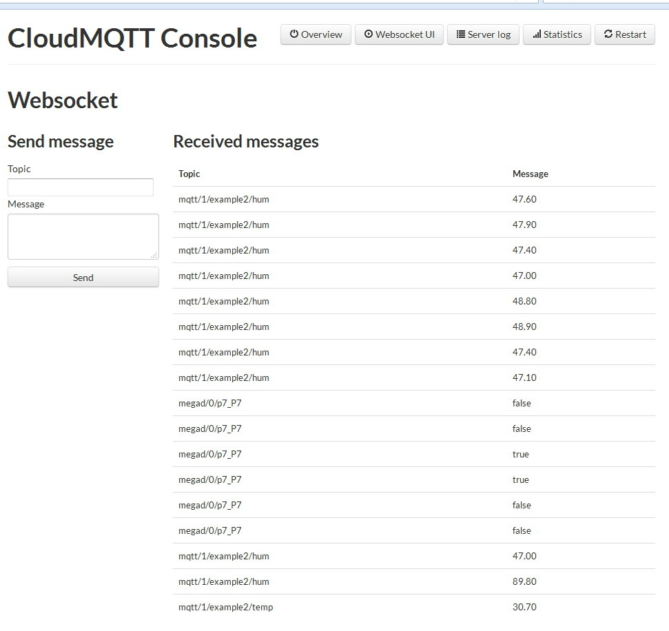

Abschließend muss nur noch ein mobiler Client konfiguriert werden, z. B. [IoT MQTT Dashboard](https://play.google.com/store/apps/details?id=com.thn.iotmqttdashboard&hl=en).
Neue Verbindung erstellen:

Themen zur Veröffentlichung erstellen (z.B. Beleuchtung der Halle - Port **P7** MegaD):

dann Abonnement für die Themen (Temperatur, Luftfeuchtigkeit, Hallenlicht auf Port **P7** MegaD) anlegen:

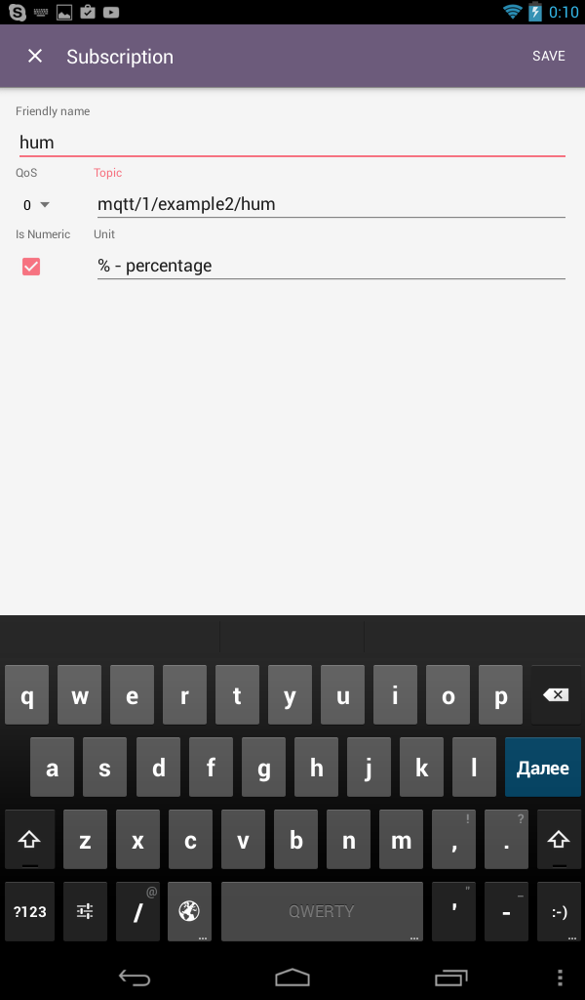

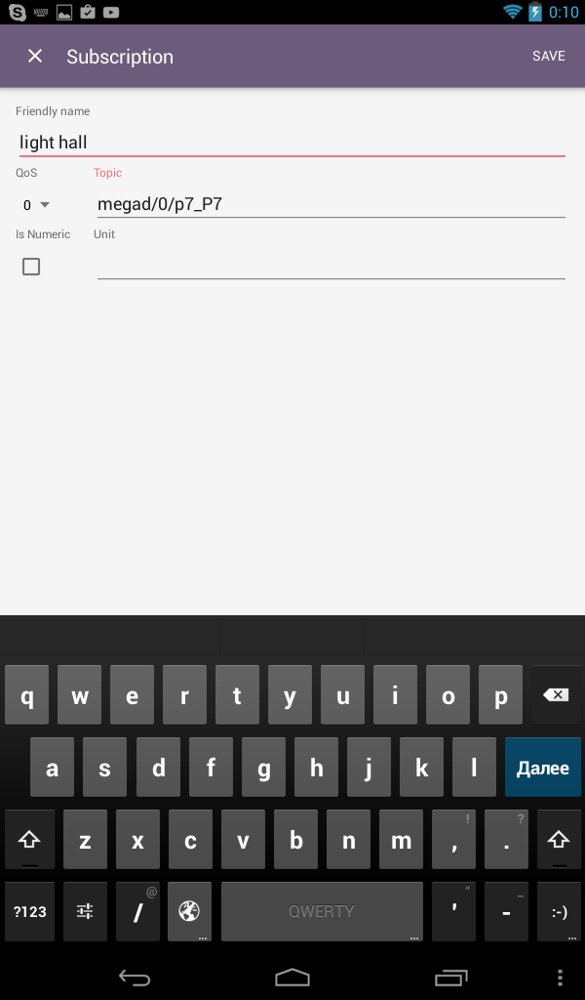

Am Ende könnte Ihr Dashboard ungefähr so aussehen:

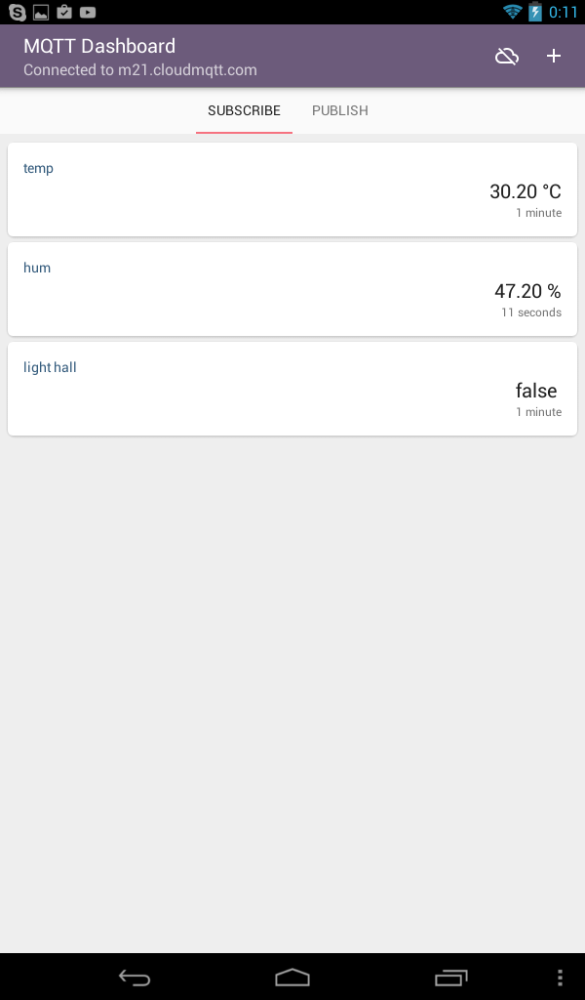

Nach der Erstellung der Veröffentlichungen auf einem mobilen Gerät sollte in der Treiberinstanz **mqtt.0** des Systems ioBroker die Variable Lichtsteuerung erscheinen, die im Skript zur Lichtsteuerung verwendet werden soll (siehe [Beispiel oben](http://www.iobroker.net/?page_id=6435&lang=en#Application_8211_connecting_mobile_clients)):

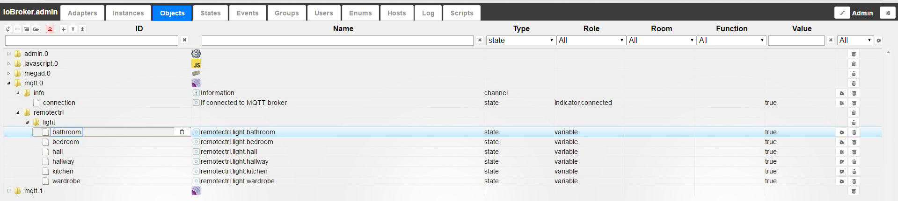

Herzlichen Glückwunsch! Jetzt können Sie das System ioBroker steuern und Daten über einen Cloud-Dienst empfangen!

## Changelog
### 6.1.4 (2025-05-07)
* (bluefox) Allowed disabling the client objects creation
* (bluefox) Create client objects with timeout (1s) to prevent memory leaks

### 6.1.3 (2025-05-04)
* (Code-X77) Corrected TLS communication
* (bluefox) Packages updated

### 6.1.2 (2024-09-04)
* (bluefox) Corrected error if the client has no ID

### 6.1.1 (2024-08-29)
* (bluefox) Added information about connected clients in the server mode

### 6.0.2 (2024-08-13)
* (bluefox) Added a space to the connection string for better readability

## License

The MIT License (MIT)

Copyright (c) 2014-2025, bluefox <dogafox@gmail.com>

Permission is hereby granted, free of charge, to any person obtaining a copy
of this software and associated documentation files (the "Software"), to deal
in the Software without restriction, including without limitation the rights
to use, copy, modify, merge, publish, distribute, sublicense, and/or sell
copies of the Software, and to permit persons to whom the Software is
furnished to do so, subject to the following conditions:

The above copyright notice and this permission notice shall be included in
all copies or substantial portions of the Software.

THE SOFTWARE IS PROVIDED "AS IS", WITHOUT WARRANTY OF ANY KIND, EXPRESS OR
IMPLIED, INCLUDING BUT NOT LIMITED TO THE WARRANTIES OF MERCHANTABILITY,
FITNESS FOR A PARTICULAR PURPOSE AND NONINFRINGEMENT. IN NO EVENT SHALL THE
AUTHORS OR COPYRIGHT HOLDERS BE LIABLE FOR ANY CLAIM, DAMAGES OR OTHER
LIABILITY, WHETHER IN AN ACTION OF CONTRACT, TORT OR OTHERWISE, ARISING FROM,
OUT OF OR IN CONNECTION WITH THE SOFTWARE OR THE USE OR OTHER DEALINGS IN
THE SOFTWARE.