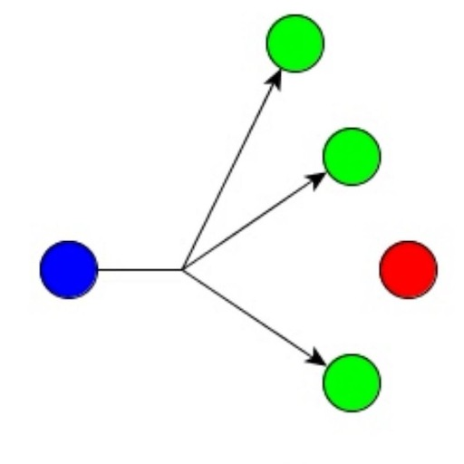

<h1>

ioBroker.multicast

</h1>

**Dieser Adapter verwendet Sentry-Bibliotheken, um Ausnahmen und Codefehler automatisch an die Entwickler zu melden.** Weitere Details und Informationen zum Deaktivieren der Fehlerberichterstattung finden Sie in Abschnitt [Sentry-Plugin-Dokumentation](https://github.com/ioBroker/plugin-sentry#plugin-sentry)! Die Sentry-Berichterstattung wird ab js-controller 3.0 verwendet.

# Multicast-API-Adapter für ioBroker
Dieser Adapter stellt eine API auf Basis des Multicast-Kommunikationsprotokolls bereit, um Zustände an Geräte mit benutzerdefinierter Firmware zu senden und von ihnen zu empfangen.

Zweck dieses Adapters war:

* eine Alternative zum HTTP-Post- und MQTT-Protokoll bereitstellen
* Eine einheitliche API auf Basis von Multicast-Kommunikation und JSON-formatierter Datenübertragung bereitstellen
* Halten Sie einen Zero-Touch-Adapter bereit, um beliebige Ethernet-Geräte (z. B. ESP-basierte Boards wie Wemos D1 mini) wie Vansware/Gosound Smart Plugs oder andere kundenspezifische Automatisierungslösungen zu integrieren.

### Berührungslos?
Die API ist so konzipiert, dass keine zusätzliche Konfiguration durch den Endbenutzer am Adapter selbst oder am verwendeten Gerät erforderlich ist.
Bei Verwendung von WLAN müssen lediglich die WLAN-Zugangsdaten angegeben werden (LAN-basierte Geräte werden vollautomatisch verarbeitet).
Dies erfordert vom Entwickler den Aufwand, die Binärdatei auf den entsprechenden Chipsatz (z. B. ESP-basierte Chipsätze) zu flashen.

Wenn die Firmware alle Regeln der API befolgt (siehe weiter unten), wird die Kommunikation wie folgt gehandhabt:

* Das Gerät sendet Statuswerte per UDP-Multicast
Der Adapter erkennt diese Nachricht und prüft, ob Zustände für dieses Gerät in ioBroker vorhanden sind.

#### Neues Gerät
Aus einer vorherigen Meldung ging hervor, dass der Adapter kein Gerät gefunden hat. Folgende Routine wird ausgeführt:

* ioBroker sendet eine Broadcast-Nachricht, um das Gerät zu initialisieren.
* Das Gerät sendet alle Zustände und die zugehörige Struktur an ioBroker.
* ioBroker erstellt das neue Gerät und alle erforderlichen Zustände
* Sobald alle Zustände erstellt sind, sendet ioBroker einen Handshake an das Gerät, um es zum Empfang von Daten zu veranlassen.
* Das Gerät beginnt, seine Zustände in Intervallen oder bei Änderungen (wie in der Firmware-Konfiguration definiert) zu senden.

#### Wiederverbindung bestehender Geräte
Aus einer vorherigen Nachricht ging hervor, dass der Adapter bereits ein Gerät anzeigt; folgende Routine wird ausgeführt:

* ioBroker prüft, ob die Konfiguration auf "Wiederherstellen" eingestellt ist.
* Wenn die Wiederherstellung aktiviert ist, sendet ioBroker alle Zustände (außer Informationszustände) an das Gerät.
* Sobald alle Status empfangen wurden, sendet das Gerät einen Handshake an ioBroker mit der Meldung „bereit zum Empfang von Daten“.
* ioBroker bestätigt
* Das Gerät beginnt, seine Zustände in Intervallen oder bei Änderungen (wie in der Firmware-Konfiguration definiert) zu senden.

#### Zustandsänderungen
Der Adapter ist so konzipiert, dass er bis zu fünf Wiederholungsversuche unternimmt, um sicherzustellen, dass alle Statusänderungen vom Gerät empfangen werden. Dieser Vorgang wird wie folgt abgewickelt:

Der Status in ioBroker wurde geändert.
Der Adapter erkennt die Wertänderung und sendet den neuen Wert an das Gerät.
* Das Gerät muss die Nachricht innerhalb von 500 ms bestätigen.
* Falls die Nachricht nicht bestätigt wird, sendet der Adapter den Wert erneut.
Dies wird bis zu maximal 5 Mal wiederholt. Danach wird eine Fehlermeldung angezeigt, die auf einen Kommunikationsverlust hinweist.

### API-Struktur und Dokumentation
{ noch zu erledigen / in Bearbeitung }

## Geplante Aufgaben:
* [ ] Implementiere eine Warteschlange, warte 20 ms nach einer Zustandsänderung eines Geräts und sende ein Array mit allen Zustandsaktualisierungen.
* [x] Ablaufwert per API implementieren
* [x] Status-Wiederholung optimieren, nicht alle 500 ms erneut auslösen
* [x] Wiederherstellungsdaten senden, wenn Harbert empfangen wird und die Verbindung zum Gerät FALSCH ist
* [x] Zustände implementieren (Fähigkeit für Wertelisten)
* [x] Korrekte Behandlung von Hostnamen und Hostnamenänderungen

## Changelog
<!--
    Placeholder for the next version (at the beginning of the line):
    ### __WORK IN PROGRESS__
-->

### __WORK IN PROGRESS__
* (DutchmanNL) Dependencies updated to current versions
* (DutchmanNL) Resolved remaining repository checker findings

### 0.2.0-ALpha.1
* (DutchmanNL) Maintenance: raise Node.js to 22, modernise CI and release tooling, update dependencies, resolve repository checker findings
* ([Andiling](https://github.com/andiling)) Expire value by API implemented
* (DutchmanNL) Rebuild retry functionality

### 0.1.6 (2021-03-23)
* (DutchmanNL) Dependency updates

### 0.1.5
* (Dutchman & Andiling) Stable-Release candidate

### 0.1.4
* (DutchmanNL) Fix Device Name
* (DutchmanNL) improved way of handling info channel values compatible with old firmware

### 0.1.3
* (Dutchman) Optimise state retry, don't fire every 500ms more queuing
* (Dutchman) Send recovery data if Harbeat is received and connection to device is FALSE
* (Dutchman) Implement states (capability for value list)

### 0.1.2
* (Dutchman) Optimise state retry, don't fire every 500ms more queuing
* (Dutchman) Correct handling of hostname and hostname changes

### 0.1.1
* (Dutchman) Send recovery data if Harbeat is received and connection to device is FALSE
* (Dutchman) Implement states (capability for value list)

### 0.1.0

* (Dutchman & Andiling) initial release

## License

MIT License

Copyright (c) 2021 Dutchman & Andiling

Permission is hereby granted, free of charge, to any person obtaining a copy
of this software and associated documentation files (the "Software"), to deal
in the Software without restriction, including without limitation the rights
to use, copy, modify, merge, publish, distribute, sublicense, and/or sell
copies of the Software, and to permit persons to whom the Software is
furnished to do so, subject to the following conditions:

The above copyright notice and this permission notice shall be included in all
copies or substantial portions of the Software.

THE SOFTWARE IS PROVIDED "AS IS", WITHOUT WARRANTY OF ANY KIND, EXPRESS OR
IMPLIED, INCLUDING BUT NOT LIMITED TO THE WARRANTIES OF MERCHANTABILITY,
FITNESS FOR A PARTICULAR PURPOSE AND NONINFRINGEMENT. IN NO EVENT SHALL THE
AUTHORS OR COPYRIGHT HOLDERS BE LIABLE FOR ANY CLAIM, DAMAGES OR OTHER
LIABILITY, WHETHER IN AN ACTION OF CONTRACT, TORT OR OTHERWISE, ARISING FROM,
OUT OF OR IN CONNECTION WITH THE SOFTWARE OR THE USE OR OTHER DEALINGS IN THE
SOFTWARE.