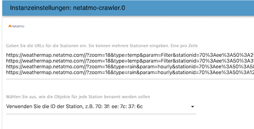

# ioBroker.netatmo-crawler

# netatmo-crawler-Adapter für ioBroker

Crawls Informationen von öffentlichen Netatmo-Stationen

# Inhaltsverzeichnis

- [Credits](#credits)
- [Änderungsprotokoll](#changelog)
- [Lizenz](#license)

# Anweisung

Um die URL Ihrer bevorzugten Wetterstation zu finden, befolgen Sie diese Schritte:

1. Öffnen Sie die [Netatmo-Wetterkarte](https://weathermap.netatmo.com)

2. Finde deinen Sender und klicke auf das Teilen-Symbol.

   

3. Klicken Sie auf _den Link zum Kopieren._

   

4. Fügen Sie den Link in den Instanzeinstellungen des Adapters ein.

   

# allgemeine Informationen

Der „Netatmo Crawler“ erfasst zahlreiche lokale Daten in Ihrer Nähe. Was fangen Sie mit all diesen Informationen an? Hier einige allgemeine Fakten und Beispiele:

## Luftfeuchtigkeit

Netatmo verwendet die relative Luftfeuchtigkeit. Diese ist das Verhältnis der aktuellen absoluten Luftfeuchtigkeit zur maximal möglichen absoluten Luftfeuchtigkeit (die von der aktuellen Lufttemperatur abhängt). Ein Wert von 100 Prozent relativer Luftfeuchtigkeit bedeutet, dass die Luft vollständig mit Wasserdampf gesättigt ist und keinen weiteren aufnehmen kann, wodurch Regen möglich ist. Das heißt aber nicht, dass die relative Luftfeuchtigkeit 100 Prozent betragen muss, damit es regnet – sie muss zwar dort, wo sich die Wolken bilden, 100 Prozent betragen, aber die relative Luftfeuchtigkeit in Bodennähe kann deutlich geringer sein.

## Regen

Verwendet die Einheit Millimeter. Falls Sie die Einheit Liter pro Kubikmeter bevorzugen, können Sie diese trotzdem verwenden. Sie können sie beispielsweise zum Bewässern im Garten verwenden.

## Druck

Die Luft um uns herum hat Gewicht und drückt auf alles, was sie berührt. Dieser Druck wird atmosphärischer Druck oder Luftdruck genannt. Was fängt man mit diesem Wert an? Ganz einfach: Wettervorhersage! Hoher Druck = gutes Wetter, niedriger Druck = schlechtes Wetter. Der normale Mittelwert liegt bei 1013 mbar. Für eine „echte“ Wettervorhersage benötigt man die Druckhistorie über einige Stunden (ich verwende vier Stunden). Fällt der Druck, ist mit schlechtem Wetter zu rechnen, steigt er, mit gutem. Ich habe [hier ein Skript für die Vorhersage](http://www.beteljuice.co.uk/zambretti/forecast.html) gefunden (es nennt sich Zambretti-Methode für eine 90%ige Vorhersage). Weitere Einheiten: 1 mbar = 100 Pa = 1 hPa

## Temperatur

Hier können Sie die gefühlte Temperatur berechnen. Bei niedrigen Temperaturen verwenden Sie den Windchill (10 °C oder weniger, Berechnung mit Wind), bei hohen Temperaturen den Hitzeindex (25 °C oder mehr, Berechnung mit Luftfeuchtigkeit). Beispielskript:

```
windchill1 = windchill(temp, windkmh); //Vars to-from IOBroker

function windchill(temperature, windspeed) {
	var windchill = 13.12 + 0.6215 * temperature - 11.37 * Math.pow(windspeed, 0.16) + 0.3965 * 
			temperature * Math.pow(windspeed, 0.16);
	return windchill;
}

heatindex1 = heatindex(temp, hum); //Vars to-from IOBroker

function heat(temperature, humidity) {
	var heatindex = -8.784695 + 1.61139411 * temperature + 2.338549 * humidity - 0.14611605 * 
			temperature * humidity - 0.012308094 * (temperature * temperature) - 
			0.016424828 * (humidity * humidity) + 0.002211732* (temperature *
			temperature) * humidity + 0.00072546 * temperature * (humidity * humidity)
			- 0.000003582 * (temperature * temperature) * (humidity * humidity);
	return heatindex;
}
```

## Wind

Die Windgeschwindigkeit wird anhand der Luftbewegung von hohem zu niedrigem Druck gemessen, üblicherweise aufgrund von Temperaturänderungen. Die Böenstärke ist der höchste Windwert, gemessen innerhalb eines kurzen Zeitraums (etwa drei Sekunden). Sie sollten ein Skript für Ihre Markise oder für die Zambretti-Methode erstellen (siehe oben).

## Credits

Dieser Adapter wäre ohne die großartige Arbeit von @bart1909 ( <https://github.com/jbart1909> )", der Vorversionen dieses Adapters (vor V1.xx) erstellt hat, nicht möglich gewesen.

Vielen Dank an [backfisch](https://github.com/backfisch88) für die ursprüngliche Idee und die Unterstützung!

## Changelog
<!--
	Placeholder for the next version (at the beginning of the line):
	### **WORK IN PROGRESS**
-->
### 1.2.0 (2026-05-10)
- (copilot) Adapter requires node.js >= 22 now
- (copilot) Adapter requires admin >= 7.7.22 now
- (mcm1957) Dependencies have been updated.

### 1.1.0 (2025-09-27)
* (mcm1957) Adapter requires node.js 20, js-controller 6.0.11 and admin 7.6.17 now.
* (Bart1909) Missing headers have been added [#95, #96]
* (mcm1957) Dependencies have been updated.

### 1.0.0 (2025-06-13)
* (Bart1909) A problem handling urls and authentication has been fixed.
* (mcm1957) Adapter has been migrated into iobroker-community-adapters organisation.
* (Bart1909) Adapter requires node.js 20, js-controller 6.0.11 and admin 7.4.10 now.
* (mcm1957) Dependencies have been updated.

### 0.8.0
* (Bart19) Adds additional 'rain_lastHour' state as 'rain' state is now real time value

### 0.7.1
* (Bart19) removed old news (#17)

## License

MIT License

Copyright (c) 2025-2026 iobroker-community-adapters <iobroker-community-adapters@gmx.de>  
Copyright (c) 2022 Bart19 <webmaster@bart19.de>

Permission is hereby granted, free of charge, to any person obtaining a copy
of this software and associated documentation files (the "Software"), to deal
in the Software without restriction, including without limitation the rights
to use, copy, modify, merge, publish, distribute, sublicense, and/or sell
copies of the Software, and to permit persons to whom the Software is
furnished to do so, subject to the following conditions:

The above copyright notice and this permission notice shall be included in all
copies or substantial portions of the Software.

THE SOFTWARE IS PROVIDED "AS IS", WITHOUT WARRANTY OF ANY KIND, EXPRESS OR
IMPLIED, INCLUDING BUT NOT LIMITED TO THE WARRANTIES OF MERCHANTABILITY,
FITNESS FOR A PARTICULAR PURPOSE AND NONINFRINGEMENT. IN NO EVENT SHALL THE
AUTHORS OR COPYRIGHT HOLDERS BE LIABLE FOR ANY CLAIM, DAMAGES OR OTHER
LIABILITY, WHETHER IN AN ACTION OF CONTRACT, TORT OR OTHERWISE, ARISING FROM,
OUT OF OR IN CONNECTION WITH THE SOFTWARE OR THE USE OR OTHER DEALINGS IN THE
SOFTWARE.