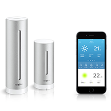

# ioBroker.netatmo

**Dieser Adapter nutzt die Sentry-Bibliotheken, um Ausnahmen und Codefehler automatisch an die Entwickler zu melden.** Weitere Details und Informationen zum Deaktivieren der Fehlerberichterstattung finden Sie in [der Sentry-Plugin-Dokumentation](https://github.com/ioBroker/plugin-sentry#plugin-sentry) ! Die Sentry-Berichterstattung wird ab js-controller 3.0 verwendet.

Netatmo-Adapter für ioBroker

## **Wichtiger Hinweis zu Echtzeitereignissen (Türklingel, Begrüßung, Anwesenheit, CO2-/Rauchalarm)**

Um Echtzeitereignisse von Netatmo zu empfangen, benötigen Sie ein IoT-/Pro-Cloud-Konto mit einer Assistenten- oder Remote-Lizenz und eine installierte IoT-Instanz, die mit diesem Konto verbunden ist. Die IoT-Instanz muss Version 1.14.0 oder höher aufweisen.

Bitte wählen Sie die IoT-Instanz in den Adaptereinstellungen aus und starten Sie den Adapter neu.

Netatmo-Adapterversionen vor Version 3.0 nutzten einen Heroku-Dienst zur Weiterleitung dieser Webhook-Ereignisse. Da Heroku diesen kostenlosen Dienst jedoch eingestellt hat, erhalten alle Netatmo-Versionen vor Version 3.0 ab dem 28.11.2022 keine Echtzeitereignisse mehr. Aus diesem Grund haben wir uns für die Nutzung bewährter und stabiler IoT-/Pro-Cloud-Dienste entschieden.

## **Wichtiger Hinweis zu den Änderungen der Authentifizierung im Oktober 2022**

Laut Netatmo wird die „alte“ Methode zur Authentifizierung mit Benutzername und Passwort, die direkt in den Adapter eingegeben werden, bis Oktober 2022 deaktiviert.

Version 2.0 des Adapters behebt diese Änderung und passt die Authentifizierung an. Alle Aktualisierungen vor Oktober 2022 sollten beim ersten Start ein automatisches und nahtloses Upgrade auf Version 2.0.0 ermöglichen – andernfalls ist eine neue Authentifizierung erforderlich.

## **Wichtiger Hinweis für Version 2.0.0!**

Mit Version 2.0 des Adapters ändert sich die Objektstruktur grundlegend! Anstelle von Namen verwenden wir nun eindeutige IDs, um sicherzustellen, dass doppelte oder sich ändernde Namen keine Probleme verursachen.

## Installation und Konfiguration

Sie müssen sich mit Ihrem NetAtmo-Konto über die Adapter-Admin-Benutzeroberfläche authentifizieren.

Wählen Sie zunächst alle relevanten Gerätetypen aus, für die Sie Daten synchronisieren möchten. Wenn Sie diese ändern, müssen Sie die Authentifizierung später erneut durchführen.

Wenn Sie eine spezielle Client-ID/ein spezielles Client-Geheimnis verwenden möchten (siehe unten), können Sie diese auch vor der Authentifizierung eingeben.

Klicken Sie auf die Schaltfläche „Mit Netatmo authentifizieren“, um den Authentifizierungsvorgang zu starten. Es öffnet sich ein neues Fenster/ein neuer Tab mit der Netatmo-Anmeldeseite. Nach der Anmeldung und Bestätigung des Datenzugriffs werden Sie zurück zu Ihrer Admin-Seite weitergeleitet.

Im Erfolgsfall schließen Sie einfach das Fenster und laden die Adapterkonfiguration neu. Im Fehlerfall überprüfen Sie die Fehlermeldung und versuchen Sie es erneut.

Standardmäßig wird ein allgemeiner API-Schlüssel für die Anfragen verwendet, wodurch das Aktualisierungsintervall auf 10 Minuten begrenzt ist!

Um das Intervall zu verlängern oder Live-Updates von Welcome & Presence sowie CO- und Rauchmeldern zu erhalten, müssen Sie Ihre eigene ID/Ihr eigenes Geheimnis aus Ihrer NetAtmo-App eingeben. Gehen Sie dazu auf die folgende URL, melden Sie sich mit Ihrem NetAtmo-Konto an und füllen Sie das angeforderte Formular unter <https://auth.netatmo.com/access/login?next_url=https%3A%2F%2Fdev.netatmo.com%2Fapps%2Fcreateanapp> aus!

Bitte stellen Sie sicher, dass Ihre Limits gemäß <https://dev.netatmo.com/guideline#rate-limits> konfiguriert werden (und beachten Sie, dass diese Limits auch für ALLE BENUTZER gelten, wenn Sie keine eigene ID/kein eigenes Geheimnis verwenden).

## Verwendung

Der Adapter sollte alle in der Konfiguration aktivierten Gerätetypen abfragen. Wenn Sie dies ändern, müssen Sie die „Authentifizierung bei Netatmo“ erneut durchführen.

Der Adapter erstellt anschließend Zustände mit Gerätedaten und zusätzlichen „Ereignis“-Zuständen für Geräte, die dies unterstützen. Um diese Ereignisse zu empfangen, müssen Sie die IoT-Instanz auswählen und ein Pro-Cloud-Konto hinzufügen (siehe oben).

Einige Geräte werden mit dem letzten Ereignis pro Typ initialisiert (sofern dieses zuletzt aufgetreten ist), z. B. Kameras. Bei anderen Gerätetypen (z. B. Rauch-/CO₂-Sensoren) werden die Ereignisse nicht aus der Vergangenheit vorab gespeichert; diese Zustände werden aktualisiert, sobald das nächste Ereignis empfangen wird.

### Besonderer Hinweis für iDiamant/Bubendorff Rollläden

Die Netatmo-API liefert keine Echtzeitdaten zu Änderungen an den Rollladenvorrichtungen. Die Daten werden stattdessen in einem festgelegten Abfrageintervall abgerufen. Das bedeutet, dass die Daten nicht in Echtzeit korrekt sind, wenn die Rollläden direkt oder über die Netatmo-App gesteuert werden.

Wenn die Geräte über den Adapter gesteuert werden, werden die Werte 2s und 17s nach der Steuerung aktualisiert, damit die Daten aktueller sind.

Je nach Gerät kann die Zielposition auf einen beliebigen Wert zwischen 0 % und 100 % oder nur auf 0 % oder 100 % (und -1 für Stopp) eingestellt werden. Für diese Aktionen können auch die praktischen Tasten Öffnen, Schließen und Stopp verwendet werden.

## sendTo-Unterstützung

### setAway

Mit dem Befehl sendTo können Sie auch alle Personen als abwesend markieren (z. B. wenn es als Alarmanlage verwendet wird).

```
sendTo('netatmo.0', "setAway", {homeId: '1234567890abcdefg'});
```

oder

```
sendTo('netatmo.0', "setAway");
```

Alle Personen für alle Kameras als abwesend markieren

Es ist auch möglich, eine oder mehrere bestimmte Personen als abwesend zu markieren.

```
sendTo('netatmo.0', "setAway", {homeId: '1234567890abcdefg', personsId: ['123123123123123']});
```

Der Parameter „homeId“ ist die Zeichenfolge, die hinter dem Namen Ihrer Kamera im Tab „Objekte“ angezeigt wird (optional, wenn mehrere Kameras installiert sind). „personsId“ ist die ID im Ordner „Bekannte Personen“.

### Startseite

Im Grunde gibt es die gleiche Funktionalität wie oben für "setAway" beschrieben, auch für "setHome", um Personen oder ganze Häuser als "belegt" zu markieren.

<!--
	Placeholder for the next version (at the beginning of the line):
	### **WORK IN PROGRESS**
-->

## Changelog

### __WORK IN PROGRESS__
* (@Apollon77) Removed the usage of a deprecated API from Netatmo which was used to enrich person data
* (@Apollon77) Added product type NACamDoorTag
* (@Apollon77) Allows value -2 for target position of Bubendorff roller shutters to put a Bubendorff shutter with jalousieable slats in jalousie mode

### 3.1.0 (2023-01-06)
* (Apollon77) Add support for Bubendorff roller shutters
* (Apollon77) Fix Monitoring State for Welcomes
* (Apollon77) Allow to just use CO2/Smoke sensors
* (Apollon77) Optimize Shutdown procedure

### 3.0.0 (2022-12-14)
* (Apollon77/bluefox) BREAKING CHANGE: Restructure Realtime events to be received via iot instance (iot >= 1.14.0 required)

### 2.1.2 (2022-11-17)
* (bluefox) Added missing objects for `Welcome` devices

### 2.1.1 (2022-09-30)
* (Apollon77) Make sure device types that require custom credentials are not selectable in UI without entering them
* (Apollon77) Fix a potential crash case

### 2.1.0 (2022-09-23)
* (Apollon77) Fix setAway
* (Apollon77) Adjust setAway/setHome message responses to return all errors/responses when multiple calls where done for multiple homes or persons

### 2.0.5 (2022-09-16)
* (Apollon77) Catch communication errors better

### 2.0.4 (2022-09-15)
* (Apollon77) Fix crash case with Smoke detector events

### 2.0.3 (2022-09-14)
* (Apollon77) Fixes and Optimizations for Doorbell devices

### 2.0.2 (2022-09-12)
IMPORTANT: This Adapter requires Admin 6.2.14+ to be configured!
* BREAKING: Object structure changes completely and now uses unique IDs instead of names!
* (Apollon77) Change the Authentication method as requested by Netatmo till October 2022
* (Apollon77) Doorbell integration
* (Apollon77) Converted to new APIs, values of several objects might be different
* (Apollon77) Fix crash cases reported by Sentry
* (Apollon77) Adjust setAway to the current API
* (Apollon77) Added setHome function (Welcome only) to mark all or specific persons as home (requires your own API key!)
* (Apollon77) setAway and setHome now also return the result of the call as callback tzo the message
* (Apollon77) Allow to edit floodlight and monitoring-state

### 1.7.1 (2022-03-30)
* (Apollon77) Fix Event cleanup

### 1.7.0 (2022-03-24)
* IMPORTANT: js-controller 3.3.19 is needed at least!
* (Apollon77) Activate events again (manually delete objects once if you get type errors)
* (Apollon77) Adjust some roles and written data to prevent warnings in logs

### 1.6.0 (2022-03-13)
* (Apollon77) Important: In person names (Welcome) in state IDs forbidden characters are now replaces by _!!
* (Apollon77) Fix another potential crash case reported by sentry

### 1.5.1 (2022-03-09)
* (Apollon77) Fix jsonconfig for Client secret

### 1.5.0 (2022-03-08)
* (kyuka-dom) Added support for netatmo carbon monoxide sensor.
* (kyuka-dom) Added support for netatmo smoke alarm.
* (foxriver76) prevent crashes if application limit reached
* (Apollon77) Allow to specify own id/secret in all cases
* (Apollon77/foxriver76) ensure that minimum polling interval of 10 minutes is respected if no individual ID/Secret is provided
* (Apollon77) Several pother fixes and optimizations
* (Apollon77) Add Sentry for crash reporting

### 1.4.4 (2021-07-21)
* (Apollon77) Fix typo that lead to a crash

### 1.4.3 (2021-06-27)
* (Apollon77) Fix typo to fix crash

### 1.4.2 (2021-06-27)
* (bluefox) Removed warnings about the type of states

### 1.4.0 (2021-06-24)
* (bluefox) Added the support of admin5 
* (bluefox) Removed warnings about the type of states

### 1.3.3
* (PArns) removed person history

### 1.3.2
* (PArns) Updated libs & merged pending patches
* (PArns) Changed update interval from 5 to 10 minutes (requested by Netatmo)

### 1.3.1
* (PArns) Fixed event cleanup crash

### 1.3.0
* (HMeyer) Added Netatmo Coach

### 1.2.2
* (PArns) Updated meta info

### 1.2.0
* (PArns) Fixed camera picture for events
* (PArns) Added camera vignette for events
* (PArns) Added camera video for events
* (PArns) Added new sub event type (human, vehicle, animal, unknown)
* (PArns) Added LastEventID within the LastEventData section

### 1.1.7
* (PArns) Added missing lib dependencies

### 1.1.6
* (PArns) Removed GIT requirement and included netatmo lib directly

### 1.1.5
* (PArns) Removed 502 error output if API has backend problems

### 1.1.4
* (PArns) Added support for unnamed modules

### 1.1.1
* (PArns) Simplified setAway

### 1.1.0
* (PArns) Added setAway function (Welcome only) to mark all or specific persons as away (requires your own API key!)

### 1.0.1
* (PArns) Fixed scope problems for presence & welcome (requires your own API key!)

### 1.0.0
* (PArns) Added live camera picture & stream for presence & welcome
* (PArns) Fixed known & unknown face image url for presence & welcome

### 0.6.2
* (PArns) Added name of last seen known face

### 0.6.1
* (PArns) Changed realtime server to use new general realtime server
* (PArns) Changed enums to channels to avoid enum creation
* (PArns) Simplified detection for movement-, known- & unknown- face events

### 0.6.0
* (PArns) Rewritten realtime updates to not need a local server any longer! Realtime updates are now turned on by default if a Welcome or Present cam is available

### 0.5.1
* (PArns) Optimized realtime updates to avoid updates if only movement was detected

### 0.5.0
* (PArns) Added realtime events for Netatmo Welcome

### 0.4.1
* (PArns) Removed log warnings for Wind sensor

### 0.4.0
* (PArns) Added absolute humidity
* (PArns) Added dewpoint

### 0.3.1
* (PArns) Reuse of preconfigured OAuth Client data
* (PArns) Added backward compatibility with existing installations

### 0.3.0
* (wep4you) Initial implementation of Netatmo welcome camera

### 0.2.2
* (PArns) Fixed SumRain24MaxDate & SumRain24Max which won't update in some rare cases

### 0.2.1
* (PArns) Corrected DateTime values & object types

### 0.2.0
* (PArns) Added SumRain1Max/SumRain1MaxDate & SumRain24Max/SumRain24MaxDate to get overall rain max since adapter installation

### 0.1.1
* (PArns) Fixed TemperatureAbsoluteMin/TemperatureAbsoluteMax

### 0.1.0
* (PArns) Fixed CO2 calibrating status
* (PArns) Added last update for devices
* (PArns) Added TemperatureAbsoluteMin/TemperatureAbsoluteMax to get overall temperature min/max since adapter installation

### 0.0.4
* (PArns) Fixed typo/missing parameter in GustStrength

### 0.0.3
* (PArns) Added error handling to prevent exceptions for missing parameters

### 0.0.2
* (PArns) Fixed rain sensor

### 0.0.1
* (PArns) Initial release

## License
MIT

Copyright (c) 2016-2025 Patrick Arns <iobroker@patrick-arns.de>