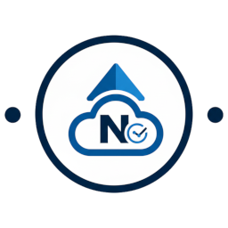

# ioBroker.nextcloud-Überwachung

**Dieser Adapter nutzt die Sentry-Bibliotheken, um Ausnahmen und Codefehler automatisch an die Entwickler zu melden.** Weitere Informationen und Anweisungen zum Deaktivieren der Fehlerberichterstattung finden Sie in der [Sentry-Plugin-Dokumentation](https://github.com/ioBroker/plugin-sentry#plugin-sentry) . Die Sentry-Berichterstattung wird ab js-controller 3.0 unterstützt.

Ich nutze meinen eigenen Sentry-Server, der auf Glitchtip basiert.

---

## Beschreibung

Dieser Adapter ermöglicht die detaillierte Überwachung Ihrer Nextcloud-Instanz über die offizielle OCS-API (`serverinfo` Es liefert zahlreiche Systemdaten, Benutzerstatistiken, Anteile sowie Leistungswerte aus PHP (OPcache/FPM) und der Datenbank direkt in ioBroker.

## Merkmale

- **Systemstatus:** CPU-Auslastung, RAM-Nutzung, freier Festplattenspeicher und Nextcloud-Version.
- **Nutzerstatistik:** Anzahl der aktiven Nutzer (5 Min., 1 Std., 24 Std.), Gesamtzahl der Dateien und Speichernutzung.
- **Freigaben:** Überwachung von Linkfreigaben, Gesprächsräumen und föderierten Freigaben.
- **Serverzustand:** PHP-Version, Speicherlimit, OPcache-Trefferrate und detaillierte FPM-Prozessstatistiken.
- **Widget:** Verwenden Sie das interne Widget, das einen htmlWidget-Datenpunkt im Speicherortordner erstellt; oder, falls Sie es selbst anpassen möchten, verwenden Sie [dieses hier](https://github.com/H5N1v2/VIS2-widget-nextcloud-monitoring) .

---

## Installation & Konfiguration

### 1. Verbindungseinstellungen

- **Domain:** Geben Sie Ihre Nextcloud-Domain ein (ohne Domain).`https://` (z.B,`cloud.yourdomain.com` ).
- **Token:** Das OCS-API-Token Ihrer Nextcloud (siehe Abschnitt „Anleitung: Token“).
- **Aktualisierungsintervall:** Zeit in Minuten zwischen API-Anfragen (Standard: 10 Min., Minimum: 5 Min.).
- **Mehrere Server:** Sie können jetzt mehrere Server hinzufügen, z. B. my\_server\_1 und einen weiteren Server, z. B. other\_server\_2.
- **Widget:**

1. **Aktivieren:** Aktivieren Sie das Kontrollkästchen „Widget erstellen“ in den Instanzeinstellungen für Ihren Standort.
2. **Zustand finden:** Der Adapter erstellt einen Zustand namens`htmlWidget` (unter`nextcloud-monitoring.0.SERVERNAME.htmlWidget` ).
3. **In VIS/VIS2:** \* Ziehen Sie ein Standard- **„HTML“-Widget** in Ihre Ansicht.
   - Weisen Sie der "HTML"-Eigenschaft dieses Widgets die Bindung Ihres Zustands zu:`{nextcloud-monitoring.0.SERVERNAME.htmlWidget}` Die
   - Passen Sie Breite und Höhe des Widget-Containers an den Inhalt an.

### 2. Datenoptionen

- **Apps überspringen:** Deaktiviert die detaillierte Liste der installierten Apps, um die API-Last zu reduzieren.
- **Updateprüfung überspringen:** Deaktiviert die Suche nach neuen Nextcloud-Versionen.

---

## Anleitung: Token erstellen und festlegen

Zugriff auf die`serverinfo` Die API benötigt ein gültiges API-Token. Dieses Token muss direkt in der Nextcloud-Konfiguration gespeichert werden.

### Token generieren (Linux / Windows)

Um den Zugriff zu ermöglichen, müssen Sie ein Token (eine zufällige Zeichenfolge) generieren und es in Ihrer Nextcloud-Instanz registrieren.`occ` Werkzeug.

**Befehl zum Generieren des Tokens:**

- **Linux (Terminal):**

`openssl rand -hex 32`

- **Windows (PowerShell):**

`$bytes = New-Object Byte[] 32; (New-Object System.Security.Cryptography.RNGCryptoServiceProvider).GetBytes($bytes); [System.BitConverter]::ToString($bytes).Replace("-", "").ToLower()`

- Alternativ können Sie Online-Tools wie beispielsweise verwenden

[it-tools.tech/token-generator](https://it-tools.tech/token-generator) .\*

## Token in Nextcloud festlegen

**Beispiel für Linux (Standardpfad) im Terminal:**

```bash
sudo -u www-data php /path_to/your/nextcloud_folder/occ config:app:set serverinfo token --value YOUR_GENERATED_TOKEN
```

**Beispiel für Linux (direkt im Nextcloud-Ordner) im Terminal:**

```bash
sudo -u www-data php occ config:app:set serverinfo token --value YOUR_GENERATED_TOKEN
```

**Wenn Sie Nextcloud in einem Webspace oder bei einem anderen Anbieter nutzen, benötigen Sie in der Regel kein sudo, sondern können einfach Folgendes tun:**

```bash
#Directly in your Nextcloudfolder
php occ config:app:set serverinfo token --value YOUR_GENERATED_TOKEN

#Or with path
php /path_to/your/nextcloud_folder/occ config:app:set serverinfo token --value YOUR_GENERATED_TOKEN
```

Befehl für Windows (PowerShell/CMD): Navigieren Sie zu Ihrem Nextcloud-Verzeichnis und führen Sie folgenden Befehl aus:

`php occ config:app:set serverinfo token --value YOUR_GENERATED_TOKEN`

Überwachte Datenpunkte (Auszug)

| Weg                           | Beschreibung                                     | Datentyp     |
| :---------------------------- | :----------------------------------------------- | :----------- |
| `system.version`              | Installierte Nextcloud-Version                   | Zeichenkette |
| `system.cpuload_1`            | CPU-Auslastung der letzten Minute                | Nummer       |
| `system.freespace`            | Freier Speicherplatz                             | Zeichenkette |
| `storage.num_users`           | Gesamtzahl der Nutzer                            | Nummer       |
| `server.php.opcache_hit_rate` | Effizienz des PHP-Caches                         | Zeichenkette |
| `fpm.active_processes`        | Aktive PHP-FPM-Prozesse                          | Nummer       |
| `activeUsers.last5min`        | Nutzer, die in den letzten 5 Minuten aktiv waren | Nummer       |

## Fehlerbehebung (FAQ)

### Ungültige Domäne: Geben Sie die Domäne ohne Protokoll ein.

```
Correct: mycloud.com or mycloud.com/folder

Incorrect: https://mycloud.com or http://mycloud.com/folder
```

### Die API liefert keine Daten:

Stellen Sie sicher, dass die App „Server Info“ (Standard-App) in Ihrer Nextcloud unter „Apps“ aktiviert ist. Ohne diese App kann der Adapter keine Daten abrufen.

### Token-Fehler:

Überprüfen Sie mit folgendem Befehl, ob das Token in Nextcloud korrekt gespeichert wurde:

- Unter Linux:

`sudo -u www-data php /path_to/your/nextcloud_folder/occ config:app:get serverinfo token`

- Oder falls Sie sich direkt im Ordner befinden, verwenden Sie:

`sudo -u www-data php occ config:app:get serverinfo token`

- Wenn Sie Ihre Nextcloud in einem Webspace oder bei einem anderen Anbieter nutzen, benötigen Sie in den meisten Fällen kein sudo:

`php occ config:app:get serverinfo token` oder`php /path_to/your/nextcloud_folder/occ config:app:get serverinfo token`

### Wartungsmodus:

Befindet sich Ihre Nextcloud im Wartungsmodus, kann der Adapter keine Daten abrufen und protokolliert eine entsprechende Meldung. Dies ist normales Verhalten, da die API während der Wartung deaktiviert ist.

## Unterstützung & Feedback

Falls Sie **Fehler** entdecken, **Funktionswünsche** haben oder **Verbesserungsvorschläge** machen möchten, erstellen Sie bitte ein **Issue** auf GitHub. Dies hilft, den Fortschritt zu verfolgen und anderen Nutzern mit ähnlichen Problemen zu helfen.

[👉 Hier ein neues Problem melden](https://github.com/H5N1v2/iobroker.nextcloud-monitoring/issues)

---

## Changelog
### 2.1.1 (2026-07-06)
* (H5N1v2) chore: update dependencies
* (H5N1v2) fix: [W5612] add translations for 'your-cloud.com' in multiple languages
* (H5N1v2) fix: [E6025] README.md must contain exactly one H1 heading, but found 6.

### 2.1.0 (2026-05-09)
* (H5N1v2) widget toggleable in the admin area.
* (H5N1v2) update dependencies.
* (copilot) Adapter requires node.js >= 22 now.

### 2.0.6 (2026-03-30)
* (H5N1v2) Update axios dependency to version 1.14.0

### 2.0.5 (2026-03-26)
* (H5N1v2) add sentry plugin to automatically report errors to developer

### 2.0.4 (2026-03-25)
* (H5N1v2) update @types/node dependency to version 22.19.15
* (mcm1957) fix: update opcache hit rate state type from string to number

[Older changelogs can be found there](https://github.com/H5N1v2/ioBroker.nextcloud-monitoring/blob/main/CHANGELOG_OLD.md)

## License
MIT License

Copyright (c) 2026 H5N1v2 <h5n1@iknox.de>

Permission is hereby granted, free of charge, to any person obtaining a copy
of this software and associated documentation files (the "Software"), to deal
in the Software without restriction, including without limitation the rights
to use, copy, modify, merge, publish, distribute, sublicense, and/or sell
copies of the Software, and to permit persons to whom the Software is
furnished to do so, subject to the following conditions:

The above copyright notice and this permission notice shall be included in all
copies or substantial portions of the Software.

THE SOFTWARE IS PROVIDED "AS IS", WITHOUT WARRANTY OF ANY KIND, EXPRESS OR
IMPLIED, INCLUDING BUT NOT LIMITED TO THE WARRANTIES OF MERCHANTABILITY,
FITNESS FOR A PARTICULAR PURPOSE AND NONINFRINGEMENT. IN NO EVENT SHALL THE
AUTHORS OR COPYRIGHT HOLDERS BE LIABLE FOR ANY CLAIM, DAMAGES OR OTHER
LIABILITY, WHETHER IN AN ACTION OF CONTRACT, TORT OR OTHERWISE, ARISING FROM,
OUT OF OR IN CONNECTION WITH THE SOFTWARE OR THE USE OR OTHER DEALINGS IN THE
SOFTWARE.