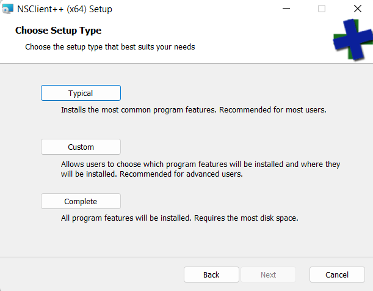

# Konfiguration und Verwendung des NSCLIENT-Adapters

## Allgemeine Informationen und Funktionen

Dieser Adapter ermöglicht die automatische Abfrage von Client-Systemen, die mit dem NsClient++-Agenten ausgestattet sind, und speichert die Ergebnisse in mehreren Zuständen. So werden (zum Beispiel) die folgenden Client-Daten in ioBroker verfügbar sein:

- Systemverfügbarkeit
- CPU-Auslastung in Prozent für mehrere Zeitbereiche
- Speicherbelastung für mehrere Zeitbereiche
- Speicherplatz mit absoluten Werten und als Prozentwerte

Zusätzlich gibt jede Prüfung einen binären Status und eine textuelle Statusmeldung zurück.

Dieser Adapter unterstützt eine unbegrenzte Anzahl von Geräten mit konfigurierbarem Abfrageintervall.

## Anforderungen

Dieser Adapter erfordert die Installation eines NsClient++-Agenten auf dem Zielsystem. Dieser Agent ist für Windows (getestet mit Windows 10 und Windows 11) und Linux verfügbar. Die NsClient++-Software ist [hier](https://nsclient.org/) kostenlos beschrieben und verfügbar.

__ACHTUNG:__ Der erforderliche nsclient-Agent wird nicht aktiv gepflegt, funktioniert aber immer noch stabil unter Win10 / Win11 und wird in Umgebungen verwendet, die auf Nagios-Netzwerküberwachung basieren.

## Herunterladen und Installieren des NsClient++-Agenten

### Client-Agent-Software herunterladen

__WICHTIG:__ Bitte beachten Sie, dass die nsclient++-Agentensoftware weder vom ioBroker-Team entwickelt noch gewartet wird. Das ioBroker-Entwicklungsteam kann keine Verantwortung für Schäden oder Sicherheitsrisiken übernehmen, die durch die nslient++-Software verursacht werden.

### Installation auf Windows-Systemen

Sie können die nsclient-Installationskits [hier](https://nsclient.org/download/) herunterladen. Bitte wählen Sie das zu Ihrem Betriebssystem passende Paket aus.

* Nachdem Sie die nsclient++-Software von [nsclient++-Homepage](https://nsclient.org/) heruntergeladen haben, starten Sie die Installation, indem Sie das heruntergeladene Image ausführen (z. B. NSCP-0.5.2.35-x64.msi).

* Wenn Sie dazu aufgefordert werden, wählen Sie _monitoring tool generic_ aus

* Wählen sie _installation_ _type_ _typical_ aus

* Fügen Sie die IP-Adressen der Hosts hinzu, die sich mit dem Agenten verbinden dürfen sollen. Sie können eine durch Komma getrennte Liste von IP-Adressen hinzufügen. Details siehe [nsclient++ Dokumentation](https://docs.nsclient.org/web/)

* Legen Sie ein sicheres Passwort fest.  
__WICHTIG: nsclient speichert das Passwort unverschlüsselt. Verwenden Sie also niemals ein Passwort, das für einen anderen Zugriff als den nsclient++-Agenten verwendet wird.__

* Aktivieren Sie _common_ _check_ _plugins_ und _WEB_ _server_ (andere Module sind für den ioBroker-Zugriff nicht erforderlich, aber Sie können sie gerne installieren, wenn eine andere Verwendung beabsichtigt ist.)

* Erlauben Sie der Installation, fortzufahren, und geben Sie ein Admin-Passwort ein, wenn Sie von Windows dazu aufgefordert werden

* Starten Sie das System neu, um die Installation abzuschließen (ja, es ist Windows).

### Installation auf Linux-Systemen

Weitere Informationen finden Sie auf der [nsclient++-Homepage](https://nsclient.org).

## Konfiguration des NsClient++-Agenten

* Stellen Sie eine Verbindung zur nsclient++-Weboberfläche her, indem Sie https://localhost:8443 öffnen. Autorisieren Sie mit dem während der Installation angegebenen Kennwort.
Eine Beschreibung der Web-UI finden Sie [in der Dokumentation](https://docs.nsclient.org/web/)

* Stellen Sie sicher, dass die erforderlichen Module geladen und aktiviert sind
Siehe die Liste der Module im nächsten Bild

* Höchstwahrscheinlich müssen Sie einige Module laden und aktivieren. Klicken Sie dazu auf die Zeile mit der Auflistung des Moduls, um die Modulkonfiguration zu öffnen. Markieren Sie die Schaltflächen _geladen_ und _aktiviert_.
__Vergessen Sie nicht, die Änderungen zu speichern__

* Sie können gerne auch andere Module aktivieren um diese zu testen  
__WARNUNG:__ Beim Aktivieren von Modulen, die Scripts ausführen können, können auf dem Zielsystem Sicherheitsrisiken entstehen. Stellen Sie sicher, dass Sie verstehen, wie nsclient++ funktioniert und wie Sie unbefugten Zugriff vermeiden, bevor Sie solche Module aktivieren. Der ioBoker.nsclient-Adapter unterstützt keine Aktion, die auf dem Zielsystem ausgelöst werden.

## Konfiguration des Adapters ioBroker.nsclient

Die Konfiguration des ioBroker.nsclient-Adapters ist in mehreren Registerkarten strukturiert. (Aktuell wird nur der Tab _Geräte_ verwendet.)

### Registerkarte _Geräte_

Auf der _Geräte_ werden alle Geräte konfiguriert, die von der Instanz überwacht werden sollen. Sie können für jedes Gerät eine neue Tabellenzeile mit folgenden Daten hinzufügen:

| Parameter | Typ | Beschreibung | Kommentar |
|----------|-------------|----------------------|------------------------------------|
| aktiv | boolesch | wenn auf true gesetzt, wird das Gerät verwendet | Dies kann verwendet werden, um ein einzelnes Gerät zu deaktivieren |
| Name | Text | Name des Geräts | Der Parameter wird verwendet, um den Namen der Datenpunkte zu erstellen. Namen müssen eindeutig sein und dürfen nicht mit einem Punkt oder aufeinanderfolgenden Punkten enden. |
| IP-Adresse | Text | IP-Adresse (IPv4 oder IPv6) oder ein Domänenname mit angehängter optionaler Portnummer | |
| Benutzername | Text | Benutzername zur Authentifizierung | Hinweis: nsclient erfordert, dass der Benutzername derzeit _admin_ lautet |
| Passwort | Text | Passwort zur Authentifizierung | |
| Abfrage (Sek.) | Nummer | Abfrageintervall in Sekunden | |
| Zeitüberschreitung (Sek.) | Zahl | Verarbeitungszeitüberschreitung in Sekunden | |
| CPU prüfen | boolesch | CPU-bezogene Prüfungen aktivieren | |
| Speicher prüfen | boolesch | speicherbezogene Prüfungen aktivieren | |
| Laufwerke prüfen | boolesch | Laufwerksbezogene Prüfungen aktivieren | |

IoBroker-Zustandsobjekte werden nach erfolgreicher Abfrage des Zielgeräts erstellt.

## Changelog
<!--
    Placeholder for the next version (at the beginning of the line):
    ### **WORK IN PROGRESS**
-->
### 0.1.2 (2022-12-03)
* (mcm1957) missing config data has been added to io-package.json (#15)
* (mcm1957) timer functions have been replaced with iob adapter versions (#22)
* (mcm1957) support for sentry has been added (#23)

### 0.1.1 (2022-09-25)
* (mcm1957) initial release for testing

## License
MIT License

Copyright (c) 2022 mcm1957 <mcm57@gmx.at>

Permission is hereby granted, free of charge, to any person obtaining a copy
of this software and associated documentation files (the "Software"), to deal
in the Software without restriction, including without limitation the rights
to use, copy, modify, merge, publish, distribute, sublicense, and/or sell
copies of the Software, and to permit persons to whom the Software is
furnished to do so, subject to the following conditions:

The above copyright notice and this permission notice shall be included in all
copies or substantial portions of the Software.

THE SOFTWARE IS PROVIDED "AS IS", WITHOUT WARRANTY OF ANY KIND, EXPRESS OR
IMPLIED, INCLUDING BUT NOT LIMITED TO THE WARRANTIES OF MERCHANTABILITY,
FITNESS FOR A PARTICULAR PURPOSE AND NONINFRINGEMENT. IN NO EVENT SHALL THE
AUTHORS OR COPYRIGHT HOLDERS BE LIABLE FOR ANY CLAIM, DAMAGES OR OTHER
LIABILITY, WHETHER IN AN ACTION OF CONTRACT, TORT OR OTHERWISE, ARISING FROM,
OUT OF OR IN CONNECTION WITH THE SOFTWARE OR THE USE OR OTHER DEALINGS IN THE
SOFTWARE.