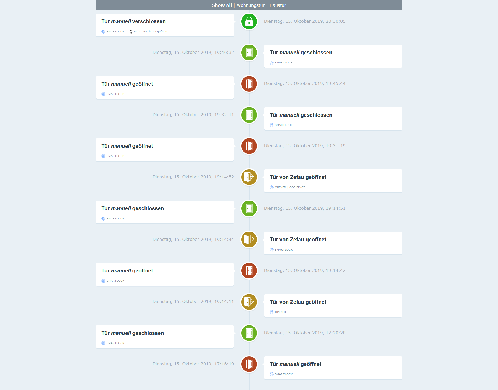

# IoBroker.nuki-extended Dieser ioBroker Adapter (ehemals ioBroker.Nuki2) ermöglicht die Steuerung und Überwachung der [Nuki Smart Lock](https://nuki.io/de/smart-lock/) und/oder dem [Nuki Opener](https://nuki.io/de/opener/) unter Verwendung der [Nuki Bridge API (v1.9.0, 06.05.2019)](https://developer.nuki.io/page/nuki-bridge-http-api-170/4/#heading--introduction) und die [Nuki Web API (v1. 2.0, 31.05.2019)](https://developer.nuki.io/page/nuki-web-api-111/3/).
[](https://travis-ci.com/Zefau/ioBroker.nuki-extended)

**Inhaltsverzeichnis**

1. [Funktionen](#Funktionen)
2. [Installation](#installation)
   1. [Nuki Bridge API](#nuki-bridge-api)
   2. [Nuki Web-API](#nuki-web-api)
3. [Kanäle & Zustände](#channels--states)
4. [Smart Home / Alexa-Integration mit ioBroker.javascript](#smart-home--alexa-integration-using-iobrokerjavascript)
   1. [Tür um 22 Uhr abends abschließen] (#Türschloss um 22 Uhr abends)
   2. [Lassen Sie sich von Alexa über Schlossänderungen informieren](#let-alexa-inform-you-about-lock-changes)
   3. [Lassen Sie sich von Telegram über Schlossänderungen informieren](#let-telegram-inform-you-about-lock-changes)
   4. [Lassen Sie sich von Alexa und Telegram über jemanden informieren, der über Opener klingelt](#let-telegram-and-alexa-inform-you-about-somebody-klinging-via-opener)
5. [Changelog](#changelog)
6. [Credits](#Credits)
7. [Lizenz](#Lizenz)

## Merkmale
- Unterstützung für Nuki Smartlock und Nuki Opener
- Unterstützung für Nuki Bridge API und Nuki Web API
- ~~Unterstützung für Hash-Token auf Hardware-Bridges (siehe https://developer.nuki.io/page/nuki-bridge-http-api-190/4#heading--token)~~
- Fallback auf die Nuki Web API, falls angewendete Aktionen auf der Nuki Bridge API fehlschlagen, z.B. wegen Brückenfehler 503 (siehe https://developer.nuki.io/t/random-http-503-unavailable/909/85?u=zefau)
- Wiederholen, falls angewendete Aktionen auf der Nuki Bridge API fehlschlagen (wenn die Nuki Web API nicht verwendet wird)
- Option zum regelmäßigen Synchronisieren anstelle des Bridge-API-Callbacks (was aufgrund der Hardware-Bridge verzögert werden kann)
- Aktualisieren aller Zustände der Nuki Web API, wenn ein Rückruf über die Nuki Bridge API eingeht
- Berechtigte Benutzer für Nuki Smartlock und Nuki Opener abrufen (siehe unten [Channels & States](#general-information))
- Rufe die Konfiguration für Nuki Smartlock und Nuki Opener ab (siehe unten [Channels & States](#general-config))
- Setup Nuki Notifications abrufen (siehe unten [Channels & States](#users))
- Webinterface, das die letzten Ereignisse von deinem Nuki Smartlock und Nuki Opener anzeigt:

  

## Installation
###Nuki Bridge-API
So erhalten Sie Ihr Hardware-Bridge-Token (funktioniert nicht für Software-Bridges):

1. Rufen Sie ```http://<bridge_ip>:<bridge_port>/auth``` von einem beliebigen Browser in Ihrem Netzwerk auf. Die Bridge schaltet ihre LED ein.
2. Drücken Sie innerhalb von 30 Sekunden den Knopf der Brücke.
3. Ergebnis des Browseraufrufs sollte etwa so aussehen:

```
{
   "token":"token123",
   "success":true
}
```

4. Nutze das generierte Token im nuki-extended Adapter.

###Nuki Web-API
Um die Nuki Web API zu nutzen, gehe wie folgt vor:

1. Token abrufen unter https://web.nuki.io/de/#/admin/web-api
2. Nutze diesen Token im nuki-extended Adapter
3. Stelle sicher, dass deine nuki Geräte in der Nuki Web API veröffentlicht sind (nutze die Smartphone App über die Einstellungen `Nuki Web aktivieren`)

## Kanäle & Staaten
Wenn Sie ioBroker.nuki-extended erfolgreich eingerichtet haben, werden die folgenden Kanäle und Zustände erstellt:

### Bridges (mit Nuki Bridge API)
Es wird eine Bridge als Gerät mit dem Namensmuster ```bridge__<name of bridge>``` angelegt. Die folgenden Kanäle / Zustände werden in jeder Bridge erstellt:

| Kanal | Staat | Beschreibung |
|:------- |:----- |:----------- |
| - | \_verbunden | Flag, ob die Bridge mit dem Nuki Server verbunden ist | server |
| - | Name | Name der Bridge / des Servers |
| - | Brücken-ID | ID der Bridge / des Servers |
| - | BrückeIp | IP-Adresse der Bridge |
| - | bridgePort | Hafen der Brücke |
| - | Brückentyp | Brückentyp |
| - | Hardware-ID | ID der Hardware-Bridge (nur Hardware-Bridge) |
| - | erfrischt | Zeitstempel der letzten Aktualisierung |
| - | Betriebszeit | Betriebszeit der Brücke in Sekunden |
| - | versFirmware | Version der Bridges-Firmware (nur Hardware-Bridge) |
| - | versWifi | Version der Firmware der WLAN-Module (nur Hardware-Bridge) |
| - | versApp | Version der Bridge-App (nur Software Bridge) |
| Rückrufe | - | Rückrufe der Brücke |
| Rückrufe | Liste | Liste der Rückrufe |
| Rückrufe._callbackId_ | \_löschen | Rückruf löschen |
| Rückrufe._callbackId_ | URL | URL des Rückrufs |

### Allgemeine Informationen
| Kanal | Staat | Beschreibung |
|:------- |:----- |:----------- |
| - | Verbindung | Adapterverbindungsstatus |
| - | bridgeApiSync | Zeigt an, ob die Synchronisierung über die Bridge-API aktiviert ist |
| - | bridgeApiLast | Zeitstempel der letzten Bridge-API-Synchronisierung |
| - | webApiSync | Zeigt an, ob die Synchronisierung über die Web-API aktiviert ist |
| - | webApiLast | Zeitstempel der letzten Web-API-Synchronisierung |
| Benachrichtigungen | - | Benachrichtigungen |
| Benachrichtigungen._notificationIndex_ | - | - |
| notifications._notificationIndex_.settings | - | Benachrichtigungseinstellungen |
| notifications._notificationIndex_.settings._settingsIndex_ | - | - |
| notifications._notificationIndex_.settings._settingsIndex_ | authIds | Ein Satz von Authentifizierungs-IDs zum Filtern von Push-Benachrichtigungen an bestimmte Benutzer oder Tastaturen. Wenn kein Eintrag Push-Benachrichtigungen für alle Benutzer und Tastaturen ausgelöst werden |
| notifications._notificationIndex_.settings._settingsIndex_ | smartlockId | Die Smartlock-ID, falls nicht gesetzt, werden alle Smart Locks des Kontos für Push-Benachrichtigungen aktiviert |
| notifications._notificationIndex_.settings._settingsIndex_ | triggerEvents | Ein Set, bei dem Push-Benachrichtigungen ausgelöst werden sollen: verriegeln, entriegeln, entriegeln, verriegeln, öffnen, klingeln, Türsensor, Warnungen, Smartlock |
| Benachrichtigungen._notificationIndex_ | Sprache | Die Sprache der Push-Nachrichten |
| Benachrichtigungen._notificationIndex_ | lastActiveDate | Das letzte aktive Datum |
| Benachrichtigungen._notificationIndex_ | Benachrichtigungs-ID | Die eindeutige NotificationId für die Benachrichtigung |
| Benachrichtigungen._notificationIndex_ | os | Das Betriebssystem<br> `{"0": 'Android', "1": 'iOS', "2": 'Webhook'}` |
| Benachrichtigungen._notificationIndex_ | pushId | Die Push-ID oder die POST-URL für einen Webhook |
| Benachrichtigungen._notificationIndex_ | Referenz-ID | Die Referenz-ID, eine ID zur Identifizierung eines fremden Systems |
| Benachrichtigungen._notificationIndex_ | Status | Aktueller Aktivierungsstatus<br> `{"0": 'INIT', "1": 'ACTIVE', "2": 'FAILED'}` |
| Benachrichtigungen._notificationIndex_ | Status | Aktueller Aktivierungsstatus<br> `{&quot;0&quot;: &#39;INIT&#39;, &quot;1&quot;: &#39;ACTIVE&#39;, &quot;2&quot;: &#39;FAILED&#39;}` |

### Smartlocks und Opener (mit Nuki Bridge API)
Als Gerät wird ein Schloss mit dem Namensmuster ```door__<name of door>``` angelegt. Folgende Kanäle / Zustände werden in jedem Schloss erstellt (bei Verwendung der Nuki Bridge API):

| Kanal | Staat | Beschreibung |
|:------- |:----- |:----------- |
| - | \_AKTION | Aktion am Schloss auslösen |
| - | ID | ID des Nuki |
| - | Name | Name des Nuki |
| - | Typ | Gerätetyp |
| - | Brücken-ID | Brücken-ID der Nuki |
| Status | - | Aktueller Zustand des Schlosses |
| Status | Batteriekritisch** | Gibt den kritischen Batteriestand an |
| Status | lockState** | Aktueller Sperrzustand der Nuki |
| Status | gesperrt** | Anzeige ob Tür verriegelt |
| Status | erfrischt** | Zeitstempel der letzten Aktualisierung |

_** markierte Zustände werden bei einer Nuki Aktion aktualisiert, wenn Callback gesetzt ist_

### Smartlocks und Opener (mit Nuki Web API)
Als Gerät wird ein Schloss mit dem Namensmuster ```door__<name of door>``` angelegt. Folgende Kanäle / Zustände werden in jedem Schloss erstellt (bei Nutzung der Nuki Web API):

| Kanal | Staat | Beschreibung (mögliche Werte) |
|:------- |:----- |:----------------------------- |
| - | \_AKTION | Aktion am Schloss auslösen |
| - | ID | ID des Nuki |
| - | Name | Name des Nuki |
| - | Typ | Gerätetyp |
| - | Protokolle | Logs / Geschichte von Nuki |
| - | Brücken-ID | Brücken-ID der Nuki |

#### Information
| Kanal | Staat | Beschreibung (mögliche Werte) |
|:------- |:----- |:----------------------------- |
| info | - | Zusätzliche Informationen |
| info | Konto-ID | Die Konto-ID |
| info | authId | Die Berechtigungs-ID |
| info | Favorit | Die Lieblingsflagge |
| info | Firmware-Version | Die Firmware-Version |
| info | Hardwareversion | Die Hardwareversion |
| info | operationId | Die Vorgangs-ID - wenn gesetzt, ist das Gerät für einen anderen Vorgang gesperrt |
| info | serverState | Der Serverstatus<br> `{"0": 'OK', "1": 'UNREGISTERED', "2": 'AUTH UUID INVALID', "3": 'AUTH INVALID', "4": 'OFFLINE'}` |
| info | adminPinState | Der Admin-Pin-Status<br> `{&quot;0&quot;: &#39;OK&#39;, &quot;1&quot;: &#39;MISSING&#39;, &quot;2&quot;: &#39;INVALID&#39;}` |
| info | virtuelles Gerät | Das Flag, das ein virtuelles Smart Lock anzeigt |
| info | DatumErstellt | Das Erstellungsdatum |
| info | DatumAktualisiert | Das Aktualisierungsdatum |

#### Zustand
| Kanal | Staat | Beschreibung (mögliche Werte) |
|:------- |:----- |:----------------------------- |
| Zustand | - | Aktueller Zustand des Schlosses |
| Zustand | Batteriekritisch | Gibt den kritischen Batteriestand an |
| Zustand | geschlossen | Anzeige ob Tür geschlossen ist (Boolean von doorState) |
| Zustand | Türzustand | Aktueller Türzustand des Nuki |
| Zustand | letzte Aktion | Letzte ausgelöste Aktion |
| Zustand | lockState | Aktueller Sperrzustand der Nuki |
| Zustand | gesperrt | Anzeige ob Tür verriegelt |
| Zustand | Modus | Der Smartlock-Modus<br> `{"0": 'UNINITIALIZED', "1": 'PAIRING', "2": 'NORMAL', "3": 'UNKNOWN', "4": 'MAINTENANCE'}` |
| Zustand | ringToOpenTimer | Restring bis Öffnungszeit |
| Zustand | auslösen | Der staatliche Auslöser<br> `{"0": 'SYSTEM', "1": 'MANUAL', "2": 'BUTTON', "3": 'AUTOMATIC', "4": 'WEB', "5": 'APP'}` |
| Zustand | auslösen | Der staatliche Auslöser<br> `{&quot;0&quot;: &#39;SYSTEM&#39;, &quot;1&quot;: &#39;MANUAL&#39;, &quot;2&quot;: &#39;BUTTON&#39;, &quot;3&quot;: &#39;AUTOMATIC&#39;, &quot;4&quot;: &#39;WEB&#39;, &quot;5&quot;: &#39;APP&#39;} ` |

#### Allgemeine Konfiguration
| Kanal | Staat | Beschreibung (mögliche Werte) |
|:------- |:----- |:----------------------------- |
| Konfiguration | - | Konfiguration |
| Konfiguration | Werbemodus | Der Werbemodus (Batteriesparmodus)<br> `{"0": 'AUTOMATIC', "1": 'NORMAL', "2": 'SLOW', "3": 'SLOWEST'}` |
| Konfiguration | autoUnlatch | True, wenn die Tür beim Entriegeln entriegelt werden soll (Knopf) |
| Konfiguration | buttonAktiviert | True, wenn die Taste am Smartlock aktiviert ist |
| Konfiguration | Fähigkeiten | Die Fähigkeiten geben an, ob die Türöffnung über App, RTO oder beides möglich ist |
| Konfiguration | fobAction1 | Die Schlüsselanhänger-Aktion, wenn die Taste einmal gedrückt wird<br> `{"0": 'NONE', "1": 'UNLOCK', "2": 'LOCK', "3": 'LOCK_N_GO', "4": 'INTELLIGENT'}` |
| Konfiguration | fobAction2 | Die Schlüsselanhänger-Aktion, wenn die Taste zweimal gedrückt wird<br> `{"0": 'NONE', "1": 'UNLOCK', "2": 'LOCK', "3": 'LOCK_N_GO', "4": 'INTELLIGENT'}` |
| Konfiguration | fobAction3 | Die Fob-Aktion, wenn die Taste dreimal gedrückt wird<br> `{"0": 'NONE', "1": 'UNLOCK', "2": 'LOCK', "3": 'LOCK_N_GO', "4": 'INTELLIGENT'}` |
| Konfiguration | fobAction3 | Die Fob-Aktion, wenn die Taste dreimal gedrückt wird<br> `{&quot;0&quot;: &#39;NONE&#39;, &quot;1&quot;: &#39;UNLOCK&#39;, &quot;2&quot;: &#39;LOCK&#39;, &quot;3&quot;: &#39;LOCK_N_GO&#39;, &quot;4&quot;: &#39;INTELLIGENT&#39;}` |
| Konfiguration | fobGepaart | True, wenn ein Schlüsselanhänger mit dem Smartlock gekoppelt ist |
| Konfiguration | GPSBreitengrad | Breitengrad |
| Konfiguration | homekitState | Der Homekit-Zustand<br> `{"0": 'UNAVAILABLE', "1": 'DISABLED', "2": 'ENABLED', "3": 'ENABLED & PAIRED'}` |
| Konfiguration | homekitState | Der Homekit-Zustand<br> `{&quot;0&quot;: &#39;NICHT VERFÜGBAR&#39;, &quot;1&quot;: &#39;DEAKTIVIERT&#39;, &quot;2&quot;: &#39;AKTIVIERT&#39;, &quot;3&quot;: &#39;AKTIVIERT &amp; GEKOPPELT&#39;}` |
| Konfiguration | TastaturGepaart | True, wenn eine Tastatur mit dem Smartlock gekoppelt ist |
| Konfiguration | ledHelligkeit | Die Helligkeit der LED: 0 (aus) bis 5 (max) |
| Konfiguration | ledEnabled | True, wenn die LED am Smartlock aktiviert ist |
| Konfiguration | Name | Der Name des Smartlocks für neue Benutzer |
| Konfiguration | Betriebsmodus | Die Betriebsart des Öffners |
| Konfiguration | PairingAktiviert | True, wenn das Pairing über die Smartlock-Taste erlaubt ist |
| Konfiguration | SingleLock | True, wenn das Smartlock nur einmal (statt zweimal) sperren soll |
| Konfiguration | Zeitzonen-ID | Die Zeitzonen-ID |
| Konfiguration | ZeitzoneOffset | Der Zeitzonen-Offset (in Minuten) |

#### Erweiterte Konfiguration
| Kanal | Staat | Beschreibung (mögliche Werte) |
|:------- |:----- |:----------------------------- |
| advancedConfig | - | Erweiterte Konfiguration |
| advancedConfig | autoLockTimeout | Sekunden, bis sich das Smart Lock nach dem Entsperren selbst wieder verriegelt. Keine automatische Wiederverriegelung, wenn der Wert 0 ist. |
| advancedConfig | automatischeBatteryTypeDetection | Flag, das anzeigt, ob die automatische Erkennung des Batterietyps aktiviert ist |
| advancedConfig | Batterietyp | Der Typ der im Smart Lock vorhandenen Batterien<br> `{"0": 'ALKALI', "1": 'ACCUMULATOR', "2": 'LITHIUM'}` |
| advancedConfig | doubleButtonPressAction | Die gewünschte Aktion, wenn die Taste zweimal gedrückt wird<br> `{"0": "NO_ACTION", "1": "INTELLIGENT", "2": "UNLOCK", "3": "LOCK", "4": "UNLATCH", "5": "LOCK_N_GO", "6": "SHOW_STATUS"}` |
| advancedConfig | doubleButtonPressAction | Die gewünschte Aktion, wenn die Taste zweimal gedrückt wird<br> `{&quot;0&quot;: &quot;NO_ACTION&quot;, &quot;1&quot;: &quot;INTELLIGENT&quot;, &quot;2&quot;: &quot;UNLOCK&quot;, &quot;3&quot;: &quot;LOCK&quot;, &quot;4&quot;: &quot;UNLATCH&quot;, &quot;5&quot;: &quot;LOCK_N_GO&quot;, &quot;6&quot;: &quot;SHOW_STATUS&quot;}` |
| advancedConfig | lngTimeout | Timeout in Sekunden für Lock’n’Go |
| advancedConfig | singleButtonPressAction | Die gewünschte Aktion, wenn die Taste einmal gedrückt wird<br> `{"0": "NO_ACTION", "1": "INTELLIGENT", "2": "UNLOCK", "3": "LOCK", "4": "UNLATCH", "5": "LOCK_N_GO", "6": "SHOW_STATUS"}` |
| advancedConfig | singleButtonPressAction | Die gewünschte Aktion, wenn die Taste einmal gedrückt wird<br> `{&quot;0&quot;: &quot;NO_ACTION&quot;, &quot;1&quot;: &quot;INTELLIGENT&quot;, &quot;2&quot;: &quot;UNLOCK&quot;, &quot;3&quot;: &quot;LOCK&quot;, &quot;4&quot;: &quot;UNLATCH&quot;, &quot;5&quot;: &quot;LOCK_N_GO&quot;, &quot;6&quot;: &quot;SHOW_STATUS&quot;}` |
| advancedConfig | singleLockedPositionOffsetDegrees | Offset, der die einzelne Sperrposition ändert |
| advancedConfig | GesamtGrad | Die während der Kalibrierung erreichte absolute Gesamtposition in Grad |
| advancedConfig | unlatchDauer | Dauer in Sekunden für das Halten der Falle in entriegelter Position |
| advancedConfig | unlockedPositionOffsetDegrees | Offset, der die entsperrte Position ändert |
| advancedConfig | unlockedToLockedTransitionOffsetDegrees | Offset, der die Position ändert, an der der Übergang von entsperrt zu gesperrt erfolgt |

#### Öffner Erweiterte Konfiguration
| Kanal | Staat | Beschreibung (mögliche Werte) |
|:------- |:----- |:----------------------------- |
| openerAdvancedConfig | - | Öffnerkonfiguration |
| openerAdvancedConfig | Gegensprech-ID | Die Datenbank-ID der angeschlossenen Gegensprechanlage |
| openerAdvancedConfig | busModeSwitch | Methode zum Umschalten zwischen Daten- und Analogmodus<br> `{"0": 'DATA MODE', "1": 'ANALOGUE MODE'}` |
| openerAdvancedConfig | shortCircuitDauer | Dauer des Kurzschlusses bei BUS-Mode-Umschaltung in ms |
| openerAdvancedConfig | electricStrikeDelay | Verzögerung der Türöffnerbetätigung in ms (nach Schließung 3 - Türöffnerbetätigung-) |
| openerAdvancedConfig | zufälligElectricStrikeDelay | Zufällige electricStrikeDelay (Bereich 3000 - 7000 ms) um eine Person im Inneren zu simulieren, die den Türöffner betätigt |
| openerAdvancedConfig | elektrischer SchlagDauer | Dauer in ms der Türöffnerbetätigung (Schloss 3 - Türöffnerbetätigung-) |
| openerAdvancedConfig | deaktivierenRtoAfterRing | Flag zum Deaktivieren von RTO nach dem Klingeln |
| openerAdvancedConfig | Türklingelunterdrückung | Der Türklingel-Unterdrückungsmodus<br> `{"0": 'NEVER', "1": 'ALWAYS', "2": 'RTO', "3": 'CONTINUOUS', "4": 'CONTINUOUS + RTO'}` |
| openerAdvancedConfig | Türklingelunterdrückung | Der Türklingel-Unterdrückungsmodus<br> `{&quot;0&quot;: &#39;NIE&#39;, &quot;1&quot;: &#39;Immer&#39;, &quot;2&quot;: &#39;RTO&#39;, &quot;3&quot;: &#39;CONTINUOUS&#39;, &quot;4&quot;: &#39;CONTINUOUS + RTO&#39;}` |
| openerAdvancedConfig | TürklingelUnterdrückungDauer | Dauer in ms der Klingelunterdrückung (nur in Betriebsart 2 -digitale Gegensprechanlage-) |
| openerAdvancedConfig | soundRing | Der Ton für Klingeln |
| openerAdvancedConfig | soundOpen | Der Sound für offen |
| openerAdvancedConfig | soundRto | Der Sound für RTO |
| openerAdvancedConfig | soundCm | Der Ton für CM |
| openerAdvancedConfig | Tonbestätigung | Die Tonbestätigung |
| openerAdvancedConfig | Schallpegel | Der Schallpegel |
| openerAdvancedConfig | singleButtonPressAction | Die gewünschte Aktion, wenn die Taste einmal gedrückt wird |
| openerAdvancedConfig | Batterietyp | Der Typ der im Smart Lock vorhandenen Batterien<br> `{"0": 'ALKALI', "1": 'ACCUMULATOR', "2": 'LITHIUM'}` |
| openerAdvancedConfig | Batterietyp | Der Typ der im Smart Lock vorhandenen Batterien<br> `{&quot;0&quot;: &#39;ALKALI&#39;, &quot;1&quot;: &#39;AKKUMULATOR&#39;, &quot;2&quot;: &#39;LITHIUM&#39;}` |
| openerAdvancedConfig | automatischeBatteryTypeDetection | Flag, das anzeigt, ob die automatische Erkennung des Batterietyps aktiviert ist |
| openerAdvancedConfig | operationId | Die Vorgangs-ID - wenn das eingestellte Gerät für einen anderen Vorgang gesperrt ist |

#### Benutzer
| Kanal | Staat | Beschreibung (mögliche Werte) |
|:------- |:----- |:----------------------------- |
| Benutzer | - | Benutzer des Schlosses |
| user._userName_ | - | Benutzer _userName_ |
| user._userName_ | erlaubtFromDate | Das erlaubte Ab-Datum |
| user._userName_ | zulässigBis Datum | Das erlaubte bis Datum |
| user._userName_ | erlaubtWocheTage | Die erlaubten Wochentage<br> `{64: 'Monday', 32: 'Tuesday', 16: 'Wednesday', 8: 'Thursday', 4: 'Friday', 2: 'Saturday', 1: 'Sunday'}` |
| user._userName_ | erlaubtFromTime | Die erlaubte Zeit (in Minuten ab Mitternacht) |
| user._userName_ | erlaubtBisZeit | Die erlaubte bis Zeit (in Minuten ab Mitternacht) |
| user._userName_ | authId | Die Smartlock-Autorisierungs-ID |
| user._userName_ | DatumErstellt | Das Erstellungsdatum |
| user._userName_ | DatumAktualisiert | Das Aktualisierungsdatum |
| user._userName_ | DatumLastActive | Das letzte aktive Datum |
| user._userName_ | aktiviert | True, wenn der Benutzer aktiviert ist |
| user._userName_ | ID | Die eindeutige ID des Benutzers |
| user._userName_ | lockCount | Die Sperrenzahl |
| user._userName_ | Name | Name des Benutzers |
| user._userName_ | fernZugelassen | True, wenn die Authentifizierung über Fernzugriff verfügt |
| user._userName_ | Typ | Die Art der Autorisierung<br> `{"0": 'APP', "1": 'BRIDGE', "2": 'FOB', "3": 'KEYPAD', "13": 'KEYPAD CODE', "14": 'Z-KEY', "15": 'VIRTUAL'}` |
| user._userName_ | Typ | Die Art der Autorisierung<br> `{&quot;0&quot;: &#39;APP&#39;, &quot;1&quot;: &#39;BRIDGE&#39;, &quot;2&quot;: &#39;FOB&#39;, &quot;3&quot;: &#39;KEYPAD&#39;, &quot;13&quot;: &#39;KEYPAD CODE&#39;, &quot;14&quot;: &#39;Z- SCHLÜSSEL&#39;, &quot;15&quot;: &#39;VIRTUAL&#39;}` |

## Smart Home / Alexa-Integration mit ioBroker.javascript
Einige Beispiele für eine mögliche Integration in Ihr Smart Home.

### Abends um 22 Uhr Tür abschließen
```javascript
var states = {
    "0": "uncalibrated",
    "1": "locked",
    "2": "unlocking",
    "3": "unlocked",
    "4": "locking",
    "5": "unlatched",
    "6": "unlocked (lock n go)",
    "7": "unlatching",
    "254": "motor blocked",
    "255": "undefined"
};

schedule('0 22 * * *', function()
{
    var status = (getState('nuki-extended.0.smartlocks.home_door.state.lockState').val);
    var msg = 'Main Door door is ' + (states[status]) + '. ';

    if (status == '3')
    {
        setState('nuki-extended.0.smartlocks.home_door._ACTION', 2);
        msg += 'Locking door..'
    }
    else
        msg += 'No action taken.'

    log(msg, {m: 'Nuki', o: ['msg']});
});
```

__Ersetzen Sie `nuki-extended.0.door__home_door.status.lockState` durch den lockState Ihres Schlosses!__ Sie können die Nachricht auch über `msg` anpassen.

### Lass dich von Alexa über Schlossänderungen informieren
Dies erfordert den ioBroker-Adapter ioBroker.alexa2 (https://github.com/Apollon77/ioBroker.alexa2).

Um die Sprachausgabe von Alexa zu nutzen, definieren wir eine Funktion ```say```. Platzieren Sie die folgende Funktion in einem Skript im Ordner "global" von ioBroker.javascript. WICHTIG: Ersetzen Sie #IHRE ALEXA-ID# (auch # ersetzen) durch Ihre Alexa-ID. Du findest die Alexa ID im Objektbaum von ioBroker ```alexa2.0.Echo-Devices```.

```javascript
/**
 * Say something with Alexa.
 *
 * @param       {string}        message         Message to say
 * @param       {string|array}  alexas          Alexa Device to say the voice message
 * @return      void
 *
 */
function say(message, alexas = '#YOUR ALEXA ID#') // use alexas = ['#YOUR ALEXA ID 1#', '#YOUR ALEXA ID 2#'] for default voice output from multiple devices (also replace #)
{
    alexas = typeof alexas === 'string' ? [alexas] : alexas;
    alexas.forEach(function(alexa)
    {
        setState('alexa2.0.Echo-Devices.' + alexa + '.Commands.speak', message);
    });
}
```

Sie können diese Funktion in ioBroker.javascript verwenden, um einen Satz mit Alexa zu sagen ```say('Hello World')``` oder ```say('Hello World', ['#YOUR ALEXA ID 1#', '#YOUR ALEXA ID 2#'])``` für die Sprachausgabe von mehreren Geräten.

Erstellen Sie ein Skript im Ordner "common" von ioBroker.javascript und fügen Sie den folgenden Listener hinzu. WICHTIG: Ersetzen Sie #LOCK STATE ID# (auch # ersetzen) durch den Zustand, der den Sperrstatus hält (z. B. ```nuki-extended.0.door__home_door.status.lockState```):

```javascript
const DOOR_STATES = {
    "0": "uncalibrated",
    "1": "locked",
    "2": "unlocking",
    "3": "unlocked",
    "4": "locking",
    "5": "unlatched",
    "6": "unlocked (lock n go)",
    "7": "unlatching",
    "254": "motor blocked",
    "255": "undefined"
};

/*
 * LISTEN TO CHANGES TO LOCK STATE
 *
 */
on({id: 'nuki-extended.0.smartlocks.home_door.state.lockState', change: 'any'}, function(obj)
{
    if (obj !== undefined && obj.state !== undefined)
      say('Door is ' + DOOR_STATES[obj.state.val] + '!')
});
```

### Lassen Sie sich von Telegram über Schlossänderungen informieren
Dies erfordert den ioBroker-Adapter ioBroker.telegram (https://github.com/iobroker-community-adapters/ioBroker.telegram).

Um die Nachrichtenausgabe von Telegram zu nutzen, definieren wir eine Funktion ```msg``` und ```messenger```. Platzieren Sie die folgende Funktion in einem Skript im Ordner "global" von ioBroker.javascript:

```javascript
/**
 * Send something via telegram.
 *
 * @param       {string}        message         Message to print
 * @param       {string|array}  receiver        Users to send the message to
 * @return      void
 *
 */
function msg(message, receiver = 'ALL')
{
    if (receiver == 'ALL')
        messenger(message);

    else
    {
        receiver = typeof receiver == 'string' ? [receiver] : receiver;
        receiver.forEach(function(user)
        {
            messenger(message, user);
        });
    }
}
```

```javascript
/**
 * Sends a message / text.
 *
 * @param   {string}            content         Message to send
 * @param   {string}            user            (optional) Specific user to send the message to (defaults to all registered users)
 * @return  void
 *
 */
function messenger(content, user = '')
{
    var config = {
        text: content,
        parse_mode: 'HTML',
        reply_markup: {
            resize_keyboard: true,
            one_time_keyboard: false
        }
    };

    sendTo('telegram', user ? Object.assign({user: user}, config) : config);
}
```

Sie können diese Funktion innerhalb von ioBroker.javascript verwenden, um alles über ```msg('Hello World')``` (an alle Benutzer) oder ```msg('Hello World', 'Zefau')``` (an bestimmte Benutzer) an Telegram zu senden.

Erstellen Sie ein Skript im Ordner "common" von ioBroker.javascript und fügen Sie den folgenden Listener hinzu. WICHTIG: Ersetzen Sie #LOCK STATE ID# (auch # ersetzen) durch den Zustand, der den Sperrstatus hält (z. B. ```nuki-extended.0.door__home_door.status.lockState```):

```javascript
const DOOR_STATES = {
    "0": "uncalibrated",
    "1": "locked",
    "2": "unlocking",
    "3": "unlocked",
    "4": "locking",
    "5": "unlatched",
    "6": "unlocked (lock n go)",
    "7": "unlatching",
    "254": "motor blocked",
    "255": "undefined"
};

/*
 * LISTEN TO CHANGES TO LOCK STATE
 *
 */
on({id: 'nuki-extended.0.smartlocks.home_door.state.lockState', change: 'any'}, function(obj)
{
    if (obj !== undefined && obj.state !== undefined)
      msg('Door is ' + DOOR_STATES[obj.state.val] + '!')
});
```

HINWEIS: Wenn Sie sowohl das Alexa- als auch das Telegram-Skript verwenden, können Sie für beide Aktionen nur einen Listener definieren:

```javascript
const DOOR_STATES = {
    "0": "uncalibrated",
    "1": "locked",
    "2": "unlocking",
    "3": "unlocked",
    "4": "locking",
    "5": "unlatched",
    "6": "unlocked (lock n go)",
    "7": "unlatching",
    "254": "motor blocked",
    "255": "undefined"
};

/*
 * LISTEN TO CHANGES TO LOCK STATE
 *
 */
on({id: 'nuki-extended.0.smartlocks.home_door.state.lockState', change: 'any'}, function(obj)
{
    if (obj !== undefined && obj.state !== undefined)
    {
      say('Door is ' + DOOR_STATES[obj.state.val] + '!')
      msg('Door is ' + DOOR_STATES[obj.state.val] + '!')
    }
});
```

### Lass dich von Telegram und Alexa per Opener über jemanden informieren, der klingelt
Dies erfordert den ioBroker-Adapter ioBroker.telegram (https://github.com/iobroker-community-adapters/ioBroker.telegram) und den ioBroker-Adapter ioBroker.alexa2 (https://github.com/Apollon77/ioBroker.alexa2).

```javascript
/*
 * Alexa and Telegram to notify on Opener Ringing state
 *
 */
let phrase = 'Somebody is ringing the doorbell.'; // Es hat an der Tür geklingelt
on({id: 'nuki-extended.0.openers.opener.state.ringStateUpdate', change: "any", ack: true}, function (s) {
  let state= s && s.state;

  if (state.val === true) {
    setState("alexa2.0.Echo-Devices.#YOUR ALEXA ID#.Commands.speak"/*speak*/, phrase);
    sendTo("telegram", "send", { text: phrase });
  }
});
```

## Credits
Danke an [@Mik13](https://github.com/Mik13) für die [Nuki Bridge API-Implementierung](https://github.com/Mik13/nuki-bridge-api#nuki-bridge-api).

Icons made by <a href="https://www.flaticon.com/authors/smashicons" title="Smashicons">Smashicons</a> ([Essential Set](https://www.flaticon.com/packs/essential-set-2)) und <a href="https://www.freepik.com/" title="Freepik">Freepik</a> ([Türen](https://www.flaticon.com/packs/doors)) von <a href="https://www.flaticon.com/" title="Flaticon">www.flaticon.com</a> sind lizenziert von <a href="http://creativecommons.org/licenses/by/3.0/" title="Creative Commons VON 3.0" target="_blank">CC 3.0 BY</a>

## Changelog

Please see [release page](https://github.com/Zefau/ioBroker.nuki-extended/releases) for changelog and detailed information.
### v2.3.1 (2021-07-20)
- (Apollon77) Optimize for js-controller 3.3 and warnings prevented

### v2.3.0 (2020-08-10)
- (Zefau) added support for the door sensor of the Nuki Smartlock ([introduced with Bridge firmware 2.6.0 / 1.16.0](https://developer.nuki.io/t/bridge-beta-fw-2-6-0-1-16-0-with-door-sensor-state/6159))
- (Zefau) added support for the ring bell action of the Nuki Opener ([introduced with Bridge firmware 2.7.0 / 1.17.0](https://developer.nuki.io/t/bridge-beta-fw-2-7-0-1-17-0/6792))

### v2.2.6 (2020-07-14)
- (Zefau) fixed Web API not refreshing correctly (see [#59](https://github.com/Zefau/ioBroker.nuki-extended/issues/59))
- (Zefau) updated dependencies

### v2.2.5 (2020-03-19)
- (Zefau) fixed incorrect versioning

### v2.2.4 (2020-03-18)
- (Zefau) fixed incorrect dates of version history (see [#60](https://github.com/Zefau/ioBroker.nuki-extended/issues/60))

### v2.2.3 (2020-03-04)
- (Zefau) added refresh of configuration (via Nuki Web API) when any config item has been changed in ioBroker

### v2.2.2 (2020-03-04)
- (Zefau) fixed incorrect error message `Error triggering action via Nuki Bridge API: No Nuki Hex ID given!`
- (Zefau) added new error message if too many callbacks are already attached to Nuki Bridge (`Callback not attached because too many Callbacks attached to the Nuki Bridge already! Please delete a callback!`)

### v2.2.1 (2020-03-03)
- (Zefau) fixed incorrect state mapping of state `openerAdvancedConfig.doorbellSuppression`

  **Note:** Please delete the state `openerAdvancedConfig.doorbellSuppression` once manually and restart the adapter to take affect!
  
- (Zefau) updated dependencies

### v2.2.0 (2020-02-16)
- (Zefau) added possibility to change configuration of Nuki Smartlock or Nuki Opener (when using Web API)
- (Zefau) updated dependencies

### v2.1.0 (2020-02-03)
- (Zefau) added (optional) callback IP for Bridge API events (e.g. when ioBroker is run in docker; see [#51](https://github.com/Zefau/ioBroker.nuki-extended/issues/51))
- (Zefau) added dedicated buttons for each lock / opener action
- (Zefau) replaced `state.timestamp` with `state.lastDataUpdate` (indicates last data refresh from the APIs) and `state.lastStateUpdate` (indicates the last actual state change)

### v2.0.3 (2019-10-31)
- (Zefau) reintroduced support for hashed token on hardware bridges (see https://developer.nuki.io/page/nuki-bridge-http-api-190/4#heading--token)

### v2.0.2 (2019-10-31)
- (Zefau) added support for newly introduced nightmode (see https://nuki.io/de/blog/nuki-news-de/nuki-update-2019-der-winter-naht-sei-vorbereitet/)
- (Zefau) fixed incorrect behavior when bridges are defined insufficiently (no name, ip or token provided)

### v2.0.1 (2019-10-26)
- (Zefau) fixed missing `bridge_name`

### v2.0.0 (2019-10-24)
- (Zefau) added support for new Nuki Opener
- (Zefau) added support for hashed token on hardware bridges (see https://developer.nuki.io/page/nuki-bridge-http-api-190/4#heading--token)
- (Zefau) added fallback to Nuki Web API in case applied actions on Nuki Bridge API fail, e.g. due to bridge error 503 (see https://developer.nuki.io/t/random-http-503-unavailable/909/85?u=zefau)
- (Zefau) added retry in case applied actions on Nuki Bridge API fail (when Nuki Web API is not used)
- (Zefau) added option to regularly synchronise instead of using Bridge API callback
- (Zefau) added refreshing all states of Nuki Web API when callback is received via Nuki Bridge API
- (Zefau) added states for Nuki Notifications
- (Zefau) added support for multiple devices (including Nuki Opener) on adapter web interface
- (Zefau) added option to not retrieve all information (by deselecting `config` or `users`) via Nuki Web API

## License
The MIT License (MIT)

Copyright (c) 2019-2020 Zefau <zefau@mailbox.org>

Permission is hereby granted, free of charge, to any person obtaining a copy
of this software and associated documentation files (the "Software"), to deal
in the Software without restriction, including without limitation the rights
to use, copy, modify, merge, publish, distribute, sublicense, and/or sell
copies of the Software, and to permit persons to whom the Software is
furnished to do so, subject to the following conditions:

The above copyright notice and this permission notice shall be included in
all copies or substantial portions of the Software.

THE SOFTWARE IS PROVIDED "AS IS", WITHOUT WARRANTY OF ANY KIND, EXPRESS OR
IMPLIED, INCLUDING BUT NOT LIMITED TO THE WARRANTIES OF MERCHANTABILITY,
FITNESS FOR A PARTICULAR PURPOSE AND NONINFRINGEMENT. IN NO EVENT SHALL THE
AUTHORS OR COPYRIGHT HOLDERS BE LIABLE FOR ANY CLAIM, DAMAGES OR OTHER
LIABILITY, WHETHER IN AN ACTION OF CONTRACT, TORT OR OTHERWISE, ARISING FROM,
OUT OF OR IN CONNECTION WITH THE SOFTWARE OR THE USE OR OTHER DEALINGS IN
THE SOFTWARE.