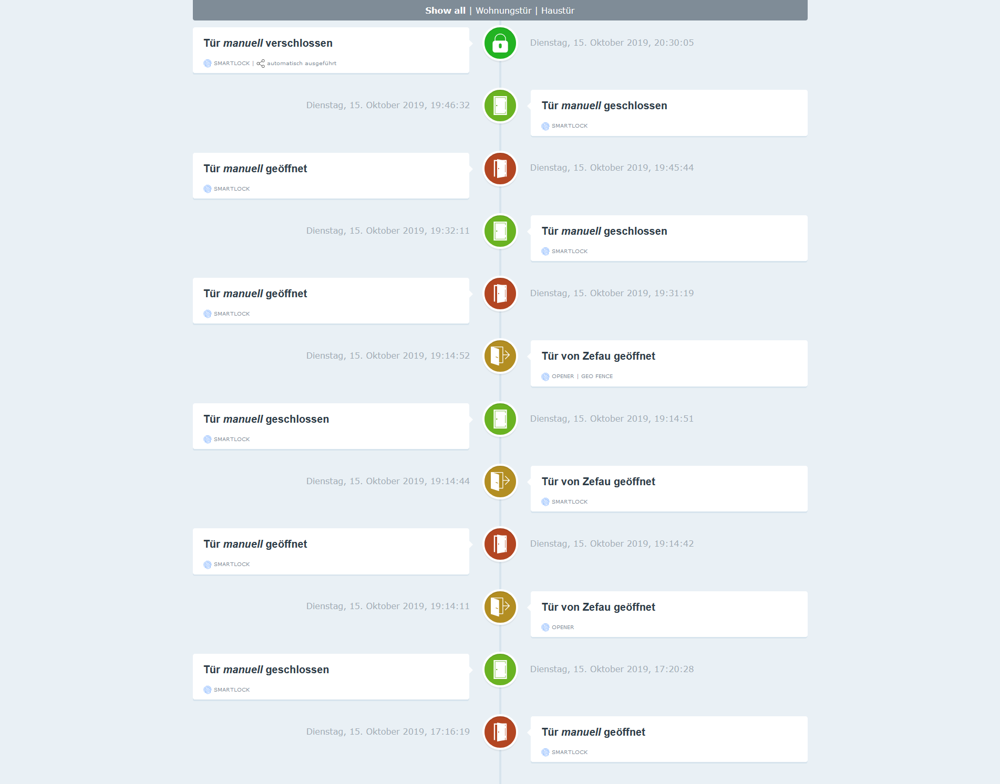

# IoBroker.nuki-extended Dieser ioBroker-Adapter (ehemals ioBroker.Nuki2) ermöglicht die Steuerung und Überwachung des [Nuki Smart Lock](https://nuki.io/de/smart-lock/) und/oder der [Nuki Opener](https://nuki.io/de/opener/) unter Verwendung sowohl der [Nuki Bridge API (v1.9.0, 06.05.2019)](https://developer.nuki.io/page/nuki-bridge-http-api-170/4/#heading--introduction) als auch der [Nuki Web API (v1.2.0, 31.05.2019)](https://developer.nuki.io/page/nuki-bridge-http-api-170/4/#heading--introduction)](https://developer.nuki.io/page/nuki-web-api-111/3/).
 [](https://weblate.iobroker.net/engage/adapters/?utm_source=widget)

**Dieser Adapter verwendet Sentry-Bibliotheken, um Ausnahmen und Codefehler automatisch an die Entwickler zu melden.** Weitere Details und Informationen zum Deaktivieren der Fehlerberichterstattung finden Sie in Abschnitt [Sentry-Plugin-Dokumentation](https://github.com/ioBroker/plugin-sentry#plugin-sentry)! Die Sentry-Berichterstattung wird ab js-controller 3.0 verwendet.

**Inhaltsverzeichnis**

1. [Funktionen](#features)
2. [Installation](#installation)
   1. [Nuki Bridge API](#nuki-bridge-api)
   2. [Nuki Web API](#nuki-web-api)
3. [Kanäle & Zustände](#channels--states)
4. [Smart-Home-/Alexa-Integration mit ioBroker.javascript](#smart-home--alexa-integration-using-iobrokerjavascript)
1. [Tür um 22 Uhr abschließen](#lock-door-at-10pm-in-the-evening)
2. [Lassen Sie sich von Alexa über Schlossänderungen informieren](#let-alexa-inform-you-about-lock-changes)
3. [Lass dich von Telegram über Sperränderungen informieren](#let-telegram-inform-you-about-lock-changes)
4. [Lassen Sie sich von Alexa und Telegram über eingehende Anrufe per Opener informieren](#let-telegram-and-alexa-inform-you-about-somebody-ringing-via-opener)
5. [Änderungsprotokoll](#changelog)
6. [Credits](#credits)
7. [Lizenz](#license)

## Merkmale
- Unterstützung für Nuki Smartlock und Nuki Öffner
- Unterstützung sowohl für die Nuki Bridge API als auch für die Nuki Web API
- ~~Unterstützung für gehashte Token auf Hardware-Bridges (siehe https://developer.nuki.io/page/nuki-bridge-http-api-190/4#heading--token)~~
- Rückgriff auf die Nuki Web API, falls Aktionen, die auf die Nuki Bridge API angewendet werden, fehlschlagen, z. B. aufgrund eines Bridge-Fehlers 503 (siehe https://developer.nuki.io/t/random-http-503-unavailable/909/85?u=zefau)
- Wiederholungsversuche, falls die auf die Nuki Bridge API angewendeten Aktionen fehlschlagen (wenn die Nuki Web API nicht verwendet wird).
- Option zur regelmäßigen Synchronisierung anstelle der Verwendung des Bridge-API-Callbacks (der aufgrund der Hardware-Bridge verzögert werden kann)
- Aktualisierung aller Zustände der Nuki Web API beim Empfang eines Callbacks über die Nuki Bridge API
- Autorisierte Benutzer für Nuki Smartlock und Nuki Opener abrufen (siehe unten [Kanäle & Status](#general-information))
- Die Konfiguration für Nuki Smartlock und Nuki Opener abrufen (siehe unten [Kanäle & Zustände](#general-config))
- Einrichtung von Nuki-Benachrichtigungen abrufen (siehe unten [Kanäle & Status](#Benutzer))
- Webinterface, das die letzten Ereignisse Ihres Nuki Smartlock und Nuki Openers anzeigt:

  

## Installation
### Nuki Bridge API
So erhalten Sie Ihr Hardware-Bridge-Token (funktioniert nicht für Software-Bridges):

1. Rufen Sie ```http://<bridge_ip>:<bridge_port>/auth``` von einem beliebigen Browser in Ihrem Netzwerk auf. Die LED der Bridge schaltet sich ein.
2. Drücken Sie den Knopf der Brücke innerhalb von 30 Sekunden.
3. Das Ergebnis des Browseraufrufs sollte etwa so aussehen:

```
{
   "token":"token123",
   "success":true
}
```

4. Verwenden Sie das generierte Token im nuki-extended Adapter.

### Nuki Web-API
Gehen Sie wie folgt vor, um die Nuki Web API zu verwenden:

1. Rufen Sie ein Token unter https://web.nuki.io/de/#/admin/web-api ab.
2. Verwenden Sie dieses Token im nuki-extended Adapter.
3. Stellen Sie sicher, dass Ihre nuki-Geräte in der Nuki Web API veröffentlicht sind (verwenden Sie dazu die Smartphone-App über Einstellungen > Nuki Web aktivieren).

## Kanäle & Staaten
Wenn Sie ioBroker.nuki-extended erfolgreich eingerichtet haben, werden die folgenden Kanäle und Zustände erstellt:

### Brücken (mit Nuki Bridge API)
Es wird eine Bridge als Gerät mit dem Namensmuster ```bridge__<name of bridge>``` erstellt. In jeder Bridge werden die folgenden Kanäle/Zustände erstellt:

| Kanal | Bundesland | Beschreibung |
|:------- |:----- |:----------- |
| - | \_connected | Flag, das angibt, ob die Bridge mit dem Nuki-Server verbunden ist oder nicht |
| - | Name | Name der Brücke / des Servers |
| - | bridgeId | ID der Brücke / des Servers |
| - | bridgeIp | IP-Adresse der Bridge |
| - | bridgePort | Brückenanschluss |
| - | bridgeType | Brückentyp |
| - | hardwareId | ID der Hardwarebrücke (nur Hardwarebrücke) |
| - | aktualisiert | Zeitstempel der letzten Aktualisierung |
| - | Verfügbarkeit | Verfügbarkeit der Brücke in Sekunden |
| - | versFirmware | Version der Bridge-Firmware (nur Hardware-Bridge) |
| - | versWifi | Version der Firmware des WLAN-Moduls (nur Hardware-Bridge) |
| - | versApp | Version der Brücken-App (nur Softwarebrücke) |
| Rückblenden | - | Rückblenden der Brücke |
| Rückrufe | Liste | Liste der Rückrufe |
| callbacks._callbackId_ | \_delete | Callback löschen |
| callbacks._callbackId_ | url | URL des Rückrufs |

### Allgemeine Informationen
| Kanal | Bundesland | Beschreibung |
|:------- |:----- |:----------- |
| - | Verbindung | Adapterverbindungsstatus |
| - | bridgeApiSync | Zeigt an, ob die Synchronisierung über die Bridge-API aktiviert ist |
| - | bridgeApiLast | Zeitstempel der letzten Bridge-API-Synchronisierung |
| - | webApiSync | Zeigt an, ob die Synchronisierung über die Web-API aktiviert ist |
| - | webApiLast | Zeitstempel der letzten Web-API-Synchronisierung |
| Benachrichtigungen | - | Benachrichtigungen |
| notifications._notificationIndex_ | - | - |
| notifications._notificationIndex_.settings | - | Benachrichtigungseinstellungen |
| notifications._notificationIndex_.settings._settingsIndex_ | - | - |
| notifications._notificationIndex_.settings._settingsIndex_ | authIds | Eine Reihe von Authentifizierungs-IDs zum Filtern von Push-Benachrichtigungen für bestimmte Benutzer oder Tastaturen. Wenn kein Eintrag vorhanden ist, werden Push-Benachrichtigungen für alle Benutzer und Tastaturen ausgelöst. |
| notifications._notificationIndex_.settings._settingsIndex_ | smartlockId | Die Smartlock-ID. Wenn nicht festgelegt, sind alle Smart Locks des Kontos für Push-Benachrichtigungen aktiviert. |
| notifications._notificationIndex_.settings._settingsIndex_ | triggerEvents | Eine Gruppe von Ereignissen, bei denen Push-Benachrichtigungen ausgelöst werden sollen: lock, unlock, unlatch, lockngo, open, ring, doorsensor, warnings, smartlock |
| notifications._notificationIndex_ | language | Die Sprache der Push-Benachrichtigungen |
| notifications._notificationIndex_ | lastActiveDate | Das Datum der letzten Aktivität |
| notifications._notificationIndex_ | notificationId | Die eindeutige notificationId für die Benachrichtigung |
| notifications._notificationIndex_ | os | Das Betriebssystem<br> `{"0": 'Android', "1": 'iOS', "2": 'Webhook'}` |
| notifications._notificationIndex_ | pushId | Die Push-ID oder die POST-URL für einen Webhook |
| notifications._notificationIndex_ | referenceId | Die Referenz-ID, eine ID zur Identifizierung eines fremden Systems |
| notifications._notificationIndex_ | status | Aktueller Aktivierungsstatus<br> `{"0": 'INIT', "1": 'ACTIVE', "2": 'FAILED'}` |
| notifications._notificationIndex_ | status | Aktueller Aktivierungsstatus<br> `{&quot;0&quot;: &#39;INIT&#39;, &quot;1&quot;: &#39;ACTIVE&#39;, &quot;2&quot;: &#39;FAILED&#39;}` |

### Intelligente Türschlösser und Öffner (mit Nuki Bridge API)
Es wird ein Schloss als Gerät mit dem Namensmuster ```door__<name of door>``` erstellt. Die folgenden Kanäle/Zustände werden in jedem Schloss erstellt (bei Verwendung der Nuki Bridge API):

| Kanal | Bundesland | Beschreibung |
|:------- |:----- |:----------- |
| - | \_ACTION | Eine Aktion für das Schloss auslösen |
| - | id | ID des Nuki |
| - | Name | Name des Nuki |
| - | Typ | Gerätetyp |
| - | bridgeId | Brücken-ID der Nuki |
| Status | - | Aktueller Status des Schlosses |
| Status | Batteriekritisch** | Zeigt kritischen Batteriestand an |
| Status | Sperrstatus** | Aktueller Sperrstatus des Nuki |
| Status | Verriegelt** | Anzeige, ob die Tür verriegelt ist |
| Status | Aktualisiert** | Zeitstempel der letzten Aktualisierung |

**Markierte Zustände werden bei einer Nuki-Aktion aktualisiert, wenn ein Callback festgelegt ist.**

### Intelligente Türschlösser und Öffner (mit Nuki Web API)
Es wird ein Schloss als Gerät mit dem Namensmuster ```door__<name of door>``` erstellt. Die folgenden Kanäle/Zustände werden in jedem Schloss erstellt (bei Verwendung der Nuki Web API):

| Kanal | Status | Beschreibung (mögliche Werte) |
|:------- |:----- |:----------------------------- |
| - | \_ACTION | Eine Aktion für das Schloss auslösen |
| - | id | ID des Nuki |
| - | Name | Name des Nuki |
| - | Typ | Gerätetyp |
| - | Protokolle | Protokolle / Verlauf von Nuki |
| - | bridgeId | Brücken-ID der Nuki |

#### Information
| Kanal | Status | Beschreibung (mögliche Werte) |
|:------- |:----- |:----------------------------- |
| Info | - | Zusätzliche Informationen |
| Info | Konto-ID | Die Konto-ID |
| Info | Auth-ID | Die Autorisierungs-ID |
| Info | Favorit | Die Lieblingsflagge |
| Info | Firmware-Version | Die Firmware-Version |
| Info | Hardwareversion | Die Hardwareversion |
| Info | operationId | Die Operations-ID – falls gesetzt, ist das Gerät für eine andere Operation gesperrt. |
| Info | Serverstatus | Der Serverstatus<br> `{"0": 'OK', "1": 'UNREGISTERED', "2": 'AUTH UUID INVALID', "3": 'AUTH INVALID', "4": 'OFFLINE'}` |
| Info | Admin-PIN-Status | Der Admin-PIN-Status<br> `{&quot;0&quot;: &#39;OK&#39;, &quot;1&quot;: &#39;FEHLEND&#39;, &quot;2&quot;: &#39;UNGÜLTIG&#39;}` |
| Info | virtuellesGerät | Das Kennzeichen für ein virtuelles Smart Lock |
| Info | Erstellungsdatum | Das Erstellungsdatum |
| Info | Datum der Aktualisierung | Das Aktualisierungsdatum |

#### Zustand
| Kanal | Status | Beschreibung (mögliche Werte) |
|:------- |:----- |:----------------------------- |
| Status | - | Aktueller Status des Schlosses |
| Status | Batteriekritisch | Gibt kritischen Batteriestand an |
| Status | geschlossen | Anzeige, ob die Tür geschlossen ist (boolescher Wert von doorState) |
| Status | Türstatus | Aktueller Türstatus des Nuki |
| Status | letzte Aktion | Zuletzt ausgelöste Aktion |
| Status | Sperrstatus | Aktueller Sperrstatus des Nuki |
| Status | verriegelt | Anzeige, ob die Tür verriegelt ist |
| Status | Modus | Der Smartlock-Modus<br> `{"0": 'UNINITIALIZED', "1": 'PAIRING', "2": 'NORMAL', "3": 'UNKNOWN', "4": 'MAINTENANCE'}` |
| Status | Ringöffnungstimer | Verbleibende Zeit bis zum Klingeln |
| Zustand | Auslöser | Der Zustandsauslöser<br> `{"0": 'SYSTEM', "1": 'MANUAL', "2": 'BUTTON', "3": 'AUTOMATIC', "4": 'WEB', "5": 'APP'}` |
| Zustand | Auslöser | Der Zustandsauslöser<br> `{&quot;0&quot;: &#39;SYSTEM&#39;, &quot;1&quot;: &#39;MANUAL&#39;, &quot;2&quot;: &#39;BUTTON&#39;, &quot;3&quot;: &#39;AUTOMATIC&#39;, &quot;4&quot;: &#39;WEB&#39;, &quot;5&quot;: &#39;APP&#39;}` |

#### Allgemeine Konfiguration
| Kanal | Status | Beschreibung (mögliche Werte) |
|:------- |:----- |:----------------------------- |
| Konfiguration | - | Konfiguration |
| Konfiguration | Werbemodus | Der Werbemodus (Batteriesparmodus)<br> `{"0": 'AUTOMATIC', "1": 'NORMAL', "2": 'SLOW', "3": 'SLOWEST'}` |
| Konfiguration | automatisches Entriegeln | Wahr, wenn die Tür beim Entriegeln (Knauf) entriegelt werden soll |
| Konfiguration | Schaltfläche aktiviert | Wahr, wenn die Taste am Smartlock aktiviert ist |
| Konfiguration | Funktionen | Die Funktionen geben an, ob das Öffnen der Tür per App, RTO oder beidem möglich ist. |
| Konfiguration | fobAction1 | Die Aktion der Fernbedienung, wenn die Taste einmal gedrückt wird<br> `{"0": 'NONE', "1": 'UNLOCK', "2": 'LOCK', "3": 'LOCK_N_GO', "4": 'INTELLIGENT'}` |
| Konfiguration | fobAction2 | Die Aktion der Fernbedienung, wenn die Taste zweimal gedrückt wird<br> `{"0": 'NONE', "1": 'UNLOCK', "2": 'LOCK', "3": 'LOCK_N_GO', "4": 'INTELLIGENT'}` |
| Konfiguration | fobAction3 | Die Aktion der Fernbedienung, wenn die Taste 3-mal gedrückt wird<br> `{"0": 'NONE', "1": 'UNLOCK', "2": 'LOCK', "3": 'LOCK_N_GO', "4": 'INTELLIGENT'}` |
| Konfiguration | fobAction3 | Die Aktion der Fernbedienung, wenn die Taste 3-mal gedrückt wird<br> `{&quot;0&quot;: &#39;KEINE&#39;, &quot;1&quot;: &#39;ENTSCHLOSSEN&#39;, &quot;2&quot;: &#39;GESPERRT&#39;, &quot;3&quot;: &#39;GESPERRT_N_GO&#39;, &quot;4&quot;: &#39;INTELLIGENT&#39;}` |
| Konfiguration | fobPaired | Wahr, wenn ein Schlüsselanhänger mit dem Smartlock gekoppelt ist |
| Konfiguration | GPS-Breitengrad | Breitengrad |
| Konfiguration | HomeKit-Status | Der HomeKit-Status<br> `{"0": 'UNAVAILABLE', "1": 'DISABLED', "2": 'ENABLED', "3": 'ENABLED & PAIRED'}` |
| Konfiguration | HomeKit-Status | Der HomeKit-Status<br> `{&quot;0&quot;: &#39;NICHT VERFÜGBAR&#39;, &quot;1&quot;: &#39;DEAKTIVIERT&#39;, &quot;2&quot;: &#39;AKTIVIERT&#39;, &quot;3&quot;: &#39;AKTIVIERT &amp; GEPAART&#39;}` |
| Konfiguration | Tastatur gekoppelt | Wahr, wenn eine Tastatur mit dem Smartlock gekoppelt ist |
| Konfiguration | LED-Helligkeit | Die Helligkeit der LED: 0 (aus) bis 5 (maximal) |
| Konfiguration | ledEnabled | Wahr, wenn die LED am Smartlock aktiviert ist |
| Konfiguration | Name | Der Name des Smartlocks für neue Benutzer |
| Konfiguration | Betriebsmodus | Der Betriebsmodus des Öffners |
| Konfiguration | Pairing aktiviert | Wahr, wenn die Kopplung über die Smartlock-Taste erlaubt ist |
| Konfiguration | Einzelverriegelung | Wahr, wenn das Smartlock nur einmal (statt zweimal) verriegeln soll |
| Konfiguration | Zeitzonen-ID | Die Zeitzonen-ID |
| Konfiguration | Zeitzonenverschiebung | Die Zeitzonenverschiebung (in Minuten) |

#### Erweiterte Konfiguration
| Kanal | Status | Beschreibung (mögliche Werte) |
|:------- |:----- |:----------------------------- |
| advancedConfig | - | Erweiterte Konfiguration |
| advancedConfig | autoLockTimeout | Sekunden, bis sich das intelligente Schloss nach dem Entsperren wieder automatisch verriegelt. Keine automatische Wiederverriegelung, wenn der Wert 0 ist. |
| advancedConfig | automaticBatteryTypeDetection | Flag, das angibt, ob die automatische Erkennung des Batterietyps aktiviert ist |
| erweiterte Konfiguration | Batterietyp | Der Typ der im Smart Lock vorhandenen Batterien<br> `{"0": 'ALKALI', "1": 'ACCUMULATOR', "2": 'LITHIUM'}` |
| advancedConfig | doubleButtonPressAction | Die gewünschte Aktion, wenn die Taste zweimal gedrückt wird<br> `{"0": "NO_ACTION", "1": "INTELLIGENT", "2": "UNLOCK", "3": "LOCK", "4": "UNLATCH", "5": "LOCK_N_GO", "6": "SHOW_STATUS"}` |
| advancedConfig | doubleButtonPressAction | Die gewünschte Aktion, wenn die Taste zweimal gedrückt wird<br> `{&quot;0&quot;: &quot;NO_ACTION&quot;, &quot;1&quot;: &quot;INTELLIGENT&quot;, &quot;2&quot;: &quot;UNLOCK&quot;, &quot;3&quot;: &quot;LOCK&quot;, &quot;4&quot;: &quot;UNLATCH&quot;, &quot;5&quot;: &quot;LOCK_N_GO&quot;, &quot;6&quot;: &quot;SHOW_STATUS&quot;}` |
| advancedConfig | lngTimeout | Timeout in Sekunden für lock ‘n’ go |
| advancedConfig | singleButtonPressAction | Die gewünschte Aktion, wenn die Taste einmal gedrückt wird<br> `{"0": "NO_ACTION", "1": "INTELLIGENT", "2": "UNLOCK", "3": "LOCK", "4": "UNLATCH", "5": "LOCK_N_GO", "6": "SHOW_STATUS"}` |
| advancedConfig | singleButtonPressAction | Die gewünschte Aktion, wenn die Taste einmal gedrückt wird<br> `{&quot;0&quot;: &quot;NO_ACTION&quot;, &quot;1&quot;: &quot;INTELLIGENT&quot;, &quot;2&quot;: &quot;UNLOCK&quot;, &quot;3&quot;: &quot;LOCK&quot;, &quot;4&quot;: &quot;UNLATCH&quot;, &quot;5&quot;: &quot;LOCK_N_GO&quot;, &quot;6&quot;: &quot;SHOW_STATUS&quot;}` |
| advancedConfig | singleLockedPositionOffsetDegrees | Offset, der die einzelne gesperrte Position verändert |
| advancedConfig | totalDegrees | Die absolute Gesamtposition in Grad, die während der Kalibrierung erreicht wurde |
| advancedConfig | unlatchDuration | Dauer in Sekunden, für die der Riegel in der entriegelten Position gehalten wird |
| advancedConfig | unlockedPositionOffsetDegrees | Offset, der die entsperrte Position verändert |
| advancedConfig | unlockedToLockedTransitionOffsetDegrees | Offset, der die Position ändert, an der der Übergang von entsperrt zu gesperrt erfolgt |

#### Erweiterte Konfiguration des Öffners
| Kanal | Status | Beschreibung (mögliche Werte) |
|:------- |:----- |:----------------------------- |
| openerAdvancedConfig | - | Öffnerkonfiguration |
| openerAdvancedConfig | intercomId | Die Datenbank-ID der verbundenen Gegensprechanlage |
| openerAdvancedConfig | busModeSwitch | Methode zum Umschalten zwischen Daten- und Analogmodus<br> `{"0": 'DATA MODE', "1": 'ANALOGUE MODE'}` |
| openerAdvancedConfig | shortCircuitDuration | Dauer des Kurzschlusses beim Umschalten in den BUS-Modus in ms |
| openerAdvancedConfig | electricStrikeDelay | Verzögerung der elektrischen Türöffneraktivierung in ms (nach Verriegelungsaktion 3 - Auslösung des elektrischen Türöffners-) |
| openerAdvancedConfig | randomElectricStrikeDelay | Zufällige elektrische Zündverzögerung (Bereich 3000 - 7000 ms), um zu simulieren, dass eine Person im Inneren den elektrischen Zünder auslöst |
| openerAdvancedConfig | electricStrikeDuration | Dauer der elektrischen Türöffnerauslösung in ms (Schlossaktion 3 - elektrische Türöffnerauslösung-) |
| openerAdvancedConfig | disableRtoAfterRing | Flag zum Deaktivieren von RTO nach dem Klingeln |
| ÖffnerErweiterte Konfiguration | Türklingelunterdrückung | Der Türklingelunterdrückungsmodus<br> `{"0": 'NEVER', "1": 'ALWAYS', "2": 'RTO', "3": 'CONTINUOUS', "4": 'CONTINUOUS + RTO'}` |
| ÖffnerErweiterte Konfiguration | Türklingelunterdrückung | Der Türklingelunterdrückungsmodus<br> `{&quot;0&quot;: &#39;NIE&#39;, &quot;1&quot;: &#39;IMMER&#39;, &quot;2&quot;: &#39;RTO&#39;, &quot;3&quot;: &#39;KONTINUIERLICH&#39;, &quot;4&quot;: &#39;KONTINUIERLICH + RTO&#39;}` |
| openerAdvancedConfig | doorbellSuppressionDuration | Dauer der Türklingelunterdrückung in ms (nur im Betriebsmodus 2 -digitale Gegensprechanlage-) |
| openerAdvancedConfig | soundRing | Der Klingelton |
| openerAdvancedConfig | soundOpen | Der Ton für das Öffnen |
| openerAdvancedConfig | soundRto | Der Sound für RTO |
| openerAdvancedConfig | soundCm | Der Sound für CM |
| openerAdvancedConfig | soundConfirmation | Die akustische Bestätigung |
| openerAdvancedConfig | soundLevel | Die Lautstärke |
| openerAdvancedConfig | singleButtonPressAction | Die gewünschte Aktion, wenn die Schaltfläche einmal gedrückt wird |
| openerAdvancedConfig | batteryType | Der Typ der im Smart Lock vorhandenen Batterien<br> `{"0": 'ALKALI', "1": 'ACCUMULATOR', "2": 'LITHIUM'}` |
| openerAdvancedConfig | batteryType | Der Typ der im Smart Lock vorhandenen Batterien<br> `{&quot;0&quot;: &#39;ALKALI&#39;, &quot;1&quot;: &#39;AKKULATUR&#39;, &quot;2&quot;: &#39;LITHIUM&#39;}` |
| openerAdvancedConfig | automaticBatteryTypeDetection | Flag, das angibt, ob die automatische Erkennung des Batterietyps aktiviert ist |
| openerAdvancedConfig | operationId | Die Operations-ID - falls festgelegt, ist das Gerät für eine andere Operation gesperrt |

#### Benutzer
| Kanal | Status | Beschreibung (mögliche Werte) |
|:------- |:----- |:----------------------------- |
| Benutzer | - | Benutzer des Schlosses |
| users._userName_ | - | Benutzer _userName_ |
| users._userName_ | allowedFromDate | Das zulässige Startdatum |
| users._userName_ | allowedUntilDate | Das zulässige Enddatum |
| users._userName_ | allowedWeekDays | Die zulässigen Wochentage<br> `{64: 'Monday', 32: 'Tuesday', 16: 'Wednesday', 8: 'Thursday', 4: 'Friday', 2: 'Saturday', 1: 'Sunday'}` |
| users._userName_ | allowedFromTime | Die zulässige Startzeit (in Minuten ab Mitternacht) |
| users._userName_ | allowedUntilTime | Die zulässige Zeit bis zum Ende (in Minuten ab Mitternacht) |
| users._userName_ | authId | Die Smartlock-Autorisierungs-ID |
| users._userName_ | dateCreated | Das Erstellungsdatum |
| users._userName_ | dateUpdated | Das Aktualisierungsdatum |
| users._userName_ | dateLastActive | Das Datum der letzten Aktivität |
| users._userName_ | enabled | True, wenn der Benutzer aktiviert ist |
| users._userName_ | id | Die eindeutige ID des Benutzers |
| users._userName_ | lockCount | Die Anzahl der Sperren |
| users._userName_ | name | Name des Benutzers |
| users._userName_ | remoteAllowed | True, wenn die Authentifizierung über Fernzugriff verfügt |
| users._userName_ | type | Der Autorisierungstyp<br> `{"0": 'APP', "1": 'BRIDGE', "2": 'FOB', "3": 'KEYPAD', "13": 'KEYPAD CODE', "14": 'Z-KEY', "15": 'VIRTUAL'}` |
| users._userName_ | type | Der Autorisierungstyp<br> `{&quot;0&quot;: &#39;APP&#39;, &quot;1&quot;: &#39;BRIDGE&#39;, &quot;2&quot;: &#39;FOB&#39;, &quot;3&quot;: &#39;KEYPAD&#39;, &quot;13&quot;: &#39;KEYPAD CODE&#39;, &quot;14&quot;: &#39;Z-KEY&#39;, &quot;15&quot;: &#39;VIRTUAL&#39;}` |

## Smart-Home-/Alexa-Integration mit ioBroker.javascript
Einige Beispiele für eine mögliche Integration in Ihr Smart Home.

### Tür um 22 Uhr abschließen
```javascript
var states = {
    "0": "uncalibrated",
    "1": "locked",
    "2": "unlocking",
    "3": "unlocked",
    "4": "locking",
    "5": "unlatched",
    "6": "unlocked (lock n go)",
    "7": "unlatching",
    "254": "motor blocked",
    "255": "undefined"
};

schedule('0 22 * * *', function()
{
    var status = (getState('nuki-extended.0.smartlocks.home_door.state.lockState').val);
    var msg = 'Main Door door is ' + (states[status]) + '. ';

    if (status == '3')
    {
        setState('nuki-extended.0.smartlocks.home_door._ACTION', 2);
        msg += 'Locking door..'
    }
    else
        msg += 'No action taken.'

    log(msg, {m: 'Nuki', o: ['msg']});
});
```

Ersetzen Sie `nuki-extended.0.door__home_door.status.lockState` durch den Sperrstatus Ihres Schlosses! Sie können die Nachricht auch über `msg` anpassen.

### Lassen Sie sich von Alexa über Schlossänderungen informieren
Hierfür wird der ioBroker-Adapter ioBroker.alexa2 (https://github.com/Apollon77/ioBroker.alexa2) benötigt.

Um die Sprachausgabe von Alexa zu nutzen, definieren wir eine Funktion ```say```. Platzieren Sie die folgende Funktion in einem Skript im Ordner „global“ von ioBroker.javascript. WICHTIG: Ersetzen Sie #IHRE ALEXA-ID# (und auch #) durch Ihre Alexa-ID. Sie finden die Alexa-ID im Objektbaum von ioBroker ```alexa2.0.Echo-Devices```.

```javascript
/**
 * Say something with Alexa.
 *
 * @param       {string}        message         Message to say
 * @param       {string|array}  alexas          Alexa Device to say the voice message
 * @return      void
 *
 */
function say(message, alexas = '#YOUR ALEXA ID#') // use alexas = ['#YOUR ALEXA ID 1#', '#YOUR ALEXA ID 2#'] for default voice output from multiple devices (also replace #)
{
    alexas = typeof alexas === 'string' ? [alexas] : alexas;
    alexas.forEach(function(alexa)
    {
        setState('alexa2.0.Echo-Devices.' + alexa + '.Commands.speak', message);
    });
}
```

Sie können diese Funktion innerhalb von ioBroker.javascript verwenden, um einen Satz mit Alexa ```say('Hello World')``` oder ```say('Hello World', ['#YOUR ALEXA ID 1#', '#YOUR ALEXA ID 2#'])``` für die Sprachausgabe von mehreren Geräten zu sagen.

Erstellen Sie ein Skript im Ordner „common“ von ioBroker.javascript und fügen Sie den folgenden Listener hinzu. WICHTIG: Ersetzen Sie #LOCK STATE ID# (und auch #) durch den Status, der den Sperrstatus enthält (z. B. ```nuki-extended.0.door__home_door.status.lockState```):

```javascript
const DOOR_STATES = {
    "0": "uncalibrated",
    "1": "locked",
    "2": "unlocking",
    "3": "unlocked",
    "4": "locking",
    "5": "unlatched",
    "6": "unlocked (lock n go)",
    "7": "unlatching",
    "254": "motor blocked",
    "255": "undefined"
};

/*
 * LISTEN TO CHANGES TO LOCK STATE
 *
 */
on({id: 'nuki-extended.0.smartlocks.home_door.state.lockState', change: 'any'}, function(obj)
{
    if (obj !== undefined && obj.state !== undefined)
      say('Door is ' + DOOR_STATES[obj.state.val] + '!')
});
```

### Lassen Sie sich von Telegram über Sperränderungen informieren
Hierfür wird der ioBroker-Adapter ioBroker.telegram (https://github.com/iobroker-community-adapters/ioBroker.telegram) benötigt.

Um die Nachrichtenausgabe von Telegram zu nutzen, definieren wir die Funktionen ```msg``` und ```messenger```. Platzieren Sie die folgende Funktion in einem Skript im Ordner „global“ von ioBroker.javascript:

```javascript
/**
 * Send something via telegram.
 *
 * @param       {string}        message         Message to print
 * @param       {string|array}  receiver        Users to send the message to
 * @return      void
 *
 */
function msg(message, receiver = 'ALL')
{
    if (receiver == 'ALL')
        messenger(message);

    else
    {
        receiver = typeof receiver == 'string' ? [receiver] : receiver;
        receiver.forEach(function(user)
        {
            messenger(message, user);
        });
    }
}
```

```javascript
/**
 * Sends a message / text.
 *
 * @param   {string}            content         Message to send
 * @param   {string}            user            (optional) Specific user to send the message to (defaults to all registered users)
 * @return  void
 *
 */
function messenger(content, user = '')
{
    var config = {
        text: content,
        parse_mode: 'HTML',
        reply_markup: {
            resize_keyboard: true,
            one_time_keyboard: false
        }
    };

    sendTo('telegram', user ? Object.assign({user: user}, config) : config);
}
```

Sie können diese Funktion innerhalb von ioBroker.javascript verwenden, um beliebige Nachrichten über ```msg('Hello World')``` (an alle Benutzer) oder ```msg('Hello World', 'Zefau')``` (an bestimmte Benutzer) an Telegram zu senden.

Erstellen Sie ein Skript im Ordner „common“ von ioBroker.javascript und fügen Sie den folgenden Listener hinzu. WICHTIG: Ersetzen Sie #LOCK STATE ID# (und auch #) durch den Status, der den Sperrstatus enthält (z. B. ```nuki-extended.0.door__home_door.status.lockState```):

```javascript
const DOOR_STATES = {
    "0": "uncalibrated",
    "1": "locked",
    "2": "unlocking",
    "3": "unlocked",
    "4": "locking",
    "5": "unlatched",
    "6": "unlocked (lock n go)",
    "7": "unlatching",
    "254": "motor blocked",
    "255": "undefined"
};

/*
 * LISTEN TO CHANGES TO LOCK STATE
 *
 */
on({id: 'nuki-extended.0.smartlocks.home_door.state.lockState', change: 'any'}, function(obj)
{
    if (obj !== undefined && obj.state !== undefined)
      msg('Door is ' + DOOR_STATES[obj.state.val] + '!')
});
```

HINWEIS: Wenn Sie sowohl das Alexa- als auch das Telegram-Skript verwenden, dürfen Sie nur einen Listener für beide Aktionen definieren:

```javascript
const DOOR_STATES = {
    "0": "uncalibrated",
    "1": "locked",
    "2": "unlocking",
    "3": "unlocked",
    "4": "locking",
    "5": "unlatched",
    "6": "unlocked (lock n go)",
    "7": "unlatching",
    "254": "motor blocked",
    "255": "undefined"
};

/*
 * LISTEN TO CHANGES TO LOCK STATE
 *
 */
on({id: 'nuki-extended.0.smartlocks.home_door.state.lockState', change: 'any'}, function(obj)
{
    if (obj !== undefined && obj.state !== undefined)
    {
      say('Door is ' + DOOR_STATES[obj.state.val] + '!')
      msg('Door is ' + DOOR_STATES[obj.state.val] + '!')
    }
});
```

### Lassen Sie sich von Telegram und Alexa über Anrufe per Opener benachrichtigen.
Hierfür werden der ioBroker-Adapter ioBroker.telegram (https://github.com/iobroker-community-adapters/ioBroker.telegram) und der ioBroker-Adapter ioBroker.alexa2 (https://github.com/Apollon77/ioBroker.alexa2) benötigt.

```javascript
/*
 * Alexa and Telegram to notify on Opener Ringing state
 *
 */
let phrase = 'Somebody is ringing the doorbell.'; // Es hat an der Tür geklingelt
on({id: 'nuki-extended.0.openers.opener.state.ringStateUpdate', change: "any", ack: true}, function (s) {
  let state= s && s.state;

  if (state.val === true) {
    setState("alexa2.0.Echo-Devices.#YOUR ALEXA ID#.Commands.speak"/*speak*/, phrase);
    sendTo("telegram", "send", { text: phrase });
  }
});
```

## Changelog

Please see [release page](https://github.com/Zefau/ioBroker.nuki-extended/releases) for changelog and detailed information.

<!--
    Placeholder for the next version (at the beginning of the line):
    ### **WORK IN PROGRESS**
-->
### 2.8.2 (2026-05-14)
- (mcm1957) Missing translations have been added.
- (mcm1957) Dependencies have been updated

### 2.8.1 (2026-05-13)
- (copilot) Migrated linting setup to ESLint 9 with the shared `@iobroker/eslint-config`.
- (copilot) Resolved ESLint error findings in adapter core files and aligned linting ignores for legacy frontend scripts.

### 2.8.0 (2026-05-13)
- (copilot) Adapter requires node.js >= 22 now
- (copilot) Adapter requires admin >= 7.7.22 now
- (copilot) Adapter requires js-controller >= 6.0.11 now
- (VierlingMt) Adding Nuki Smartlock 4.X and Pro Support, "toLowerCase" error fixed
- (sbormann) Added deviceType 5 and fixed empty type variable
- (mcm1957) Dependencies have been updated

### 2.7.0 (2024-04-21)
* (mcm1957) Adapter requires node.js 18 and js-controller >= 5 now
* (mcm1957) Dependencies have been updated

### 2.6.5 (2022-06-17)
* (Apollon77) Fix some crash cases reported by Sentry

## License
The MIT License (MIT)

Copyright (c) 2024-2026 iobroker-community-adapters <iobroker-community-adapters@gmx.de>  
Copyright (c) 2019-2022 Zefau <zefau@mailbox.org>

Permission is hereby granted, free of charge, to any person obtaining a copy
of this software and associated documentation files (the "Software"), to deal
in the Software without restriction, including without limitation the rights
to use, copy, modify, merge, publish, distribute, sublicense, and/or sell
copies of the Software, and to permit persons to whom the Software is
furnished to do so, subject to the following conditions:

The above copyright notice and this permission notice shall be included in
all copies or substantial portions of the Software.

THE SOFTWARE IS PROVIDED "AS IS", WITHOUT WARRANTY OF ANY KIND, EXPRESS OR
IMPLIED, INCLUDING BUT NOT LIMITED TO THE WARRANTIES OF MERCHANTABILITY,
FITNESS FOR A PARTICULAR PURPOSE AND NONINFRINGEMENT. IN NO EVENT SHALL THE
AUTHORS OR COPYRIGHT HOLDERS BE LIABLE FOR ANY CLAIM, DAMAGES OR OTHER
LIABILITY, WHETHER IN AN ACTION OF CONTRACT, TORT OR OTHERWISE, ARISING FROM,
OUT OF OR IN CONNECTION WITH THE SOFTWARE OR THE USE OR OTHER DEALINGS IN
THE SOFTWARE.