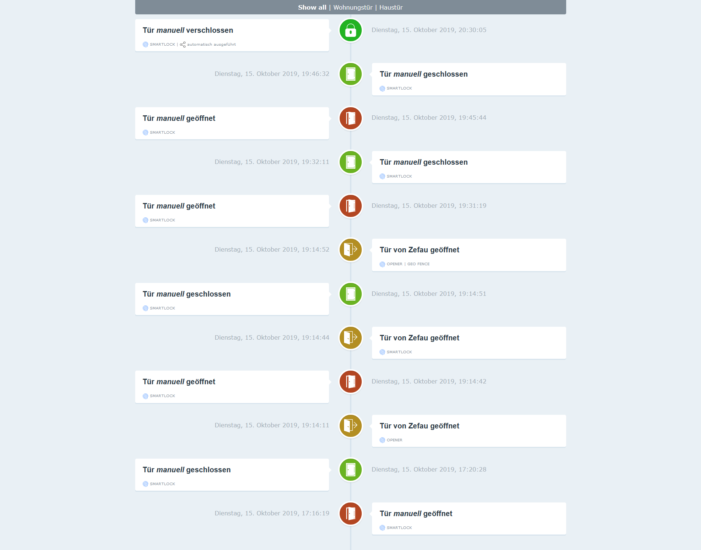

# ioBroker.nuki-extended

Dieser ioBroker-Adapter (ehemals ioBroker.Nuki2) ermöglicht die Steuerung und Überwachung des [Nuki Smart Lock](https://nuki.io/de/smart-lock/) und/oder des [Nuki Opener](https://nuki.io/de/opener/) sowohl über die [Nuki Bridge API (v1.9.0, 06.05.2019)](https://developer.nuki.io/page/nuki-bridge-http-api-170/4/#heading--introduction) als auch über die [Nuki Web API (v1.2.0, 31.05.2019)](https://developer.nuki.io/page/nuki-web-api-111/3/) .

**Dieser Adapter nutzt die Sentry-Bibliotheken, um Ausnahmen und Codefehler automatisch an die Entwickler zu melden.** Weitere Details und Informationen zum Deaktivieren der Fehlerberichterstattung finden Sie in [der Sentry-Plugin-Dokumentation](https://github.com/ioBroker/plugin-sentry#plugin-sentry) ! Die Sentry-Berichterstattung wird ab js-controller 3.0 verwendet.

**Inhaltsverzeichnis**

1. [Merkmale](#features)
2. [Installation](#installation)
   1. [Nuki Bridge API](#nuki-bridge-api)
   2. [Nuki Web-API](#nuki-web-api)
3. [Kanäle und Staaten](#channels--states)
4. [Smart-Home-/Alexa-Integration mit ioBroker.javascript](#smart-home--alexa-integration-using-iobrokerjavascript)
   1. [Schließe die Tür um 22 Uhr ab.](#lock-door-at-10pm-in-the-evening)
   2. [Lassen Sie sich von Alexa über Schlossänderungen informieren.](#let-alexa-inform-you-about-lock-changes)
   3. [Lassen Sie sich von Telegram über Sperränderungen informieren.](#let-telegram-inform-you-about-lock-changes)
   4. [Lassen Sie sich von Alexa und Telegram über Anrufe per Opener benachrichtigen.](#let-telegram-and-alexa-inform-you-about-somebody-ringing-via-opener)
5. [Änderungsprotokoll](#changelog)
6. [Credits](#credits)
7. [Lizenz](#license)

## Merkmale

- Unterstützung für Nuki Smartlock und Nuki Opener
- Unterstützung sowohl für die Nuki Bridge API als auch für die Nuki Web API
- ~~Unterstützung für gehashte Token auf Hardware-Bridges (siehe <https://developer.nuki.io/page/nuki-bridge-http-api-190/4#heading--token> )~~
- Falls Aktionen, die auf der Nuki Bridge API angewendet werden, fehlschlagen, z. B. aufgrund eines Bridge-Fehlers 503 (siehe <https://developer.nuki.io/t/random-http-503-unavailable/909/85?u=zefau> )
- Wiederholungsversuche, falls die auf die Nuki Bridge API angewendeten Aktionen fehlschlagen (wenn die Nuki Web API nicht verwendet wird).
- Option zur regelmäßigen Synchronisierung anstelle der Verwendung des Bridge-API-Callbacks (der sich aufgrund der Hardware-Bridge verzögern kann)
- Aktualisierung aller Zustände der Nuki Web API beim Empfang eines Callbacks über die Nuki Bridge API
- Autorisierte Benutzer für Nuki Smartlock und Nuki Opener abrufen (siehe unten [Kanäle & Status](#general-information) )
- Rufen Sie die Konfiguration für Nuki Smartlock und Nuki Opener ab (siehe unten [Kanäle & Zustände](#general-config) ).
- Nuki-Benachrichtigungen einrichten (siehe unten [Kanäle & Status](#users) )
- Web-Oberfläche, die die letzten Ereignisse Ihres Nuki Smartlock und Nuki Openers anzeigt:

## Installation

### Nuki Bridge API

So erhalten Sie Ihr Hardware-Bridge-Token (funktioniert nicht für Software-Bridges):

1. Anruf`http://<bridge_ip>:<bridge_port>/auth` Von jedem Browser in Ihrem Netzwerk aus. Die LED der Bridge schaltet sich ein.
2. Drücken Sie den Knopf der Brücke innerhalb von 30 Sekunden.
3. Das Ergebnis des Browseraufrufs sollte etwa so aussehen:
   ```
   {
      "token":"token123",
      "success":true
   }
   ```
4. Verwenden Sie das generierte Token im nuki-extended Adapter.

### Nuki Web-API

Gehen Sie wie folgt vor, um die Nuki Web API zu verwenden:

1. Ein Token kann unter <https://web.nuki.io/de/#/admin/web-api> abgerufen werden.
2. Verwenden Sie dieses Token im nuki-extended Adapter
3. Stellen Sie sicher, dass Ihre Nuki-Geräte in der Nuki Web API veröffentlicht sind (verwenden Sie dazu die Smartphone-App über die Einstellungen).`Activate Nuki Web` )

## Kanäle und Staaten

Wenn Sie ioBroker.nuki-extended erfolgreich eingerichtet haben, werden die folgenden Kanäle und Zustände erstellt:

### Brücken (mit Nuki Bridge API)

Es wird eine Brücke als Gerät mit dem Namensmuster erstellt.`bridge__<name of bridge>` In jeder Bridge werden die folgenden Kanäle/Zustände erstellt:

| Kanal                           | Zustand      | Beschreibung                                                                    |
| :------------------------------ | :----------- | :------------------------------------------------------------------------------ |
| -                               | \_verbunden  | Flagge, die angibt, ob die Bridge mit dem Nuki-Server verbunden ist oder nicht. |
| -                               | Name         | Name der Brücke / des Servers                                                   |
| -                               | bridgeId     | ID der Brücke / des Servers                                                     |
| -                               | bridgeIP     | IP-Adresse der Brücke                                                           |
| -                               | bridgePort   | Hafen der Brücke                                                                |
| -                               | Brückentyp   | Brückentyp                                                                      |
| -                               | Hardware-ID  | ID der Hardwarebrücke (nur Hardwarebrücke)                                      |
| -                               | erfrischt    | Zeitstempel der letzten Aktualisierung                                          |
| -                               | Betriebszeit | Verfügbarkeit der Brücke in Sekunden                                            |
| -                               | versFirmware | Version der Bridge-Firmware (nur Hardware-Bridge)                               |
| -                               | versWifi     | Version der Firmware der WLAN-Module (nur Hardware-Bridge)                      |
| -                               | versApp      | Version der Brücken-App (nur Softwarebrücke)                                    |
| Rückrufe                        | -            | Rückblenden auf die Brücke                                                      |
| Rückrufe                        | Liste        | Liste der Rückrufe                                                              |
| Rückruffunktionen. _Rückruf-ID_ | \_löschen    | Lösche die Callback-Funktion.                                                   |
| Rückruffunktionen. _Rückruf-ID_ | URL          | URL des Rückrufs                                                                |

### Allgemeine Informationen

| Kanal                                                                            | Zustand                   | Beschreibung                                                                                                                                                                                                                       |
| :------------------------------------------------------------------------------- | :------------------------ | :--------------------------------------------------------------------------------------------------------------------------------------------------------------------------------------------------------------------------------- |
| -                                                                                | Verbindung                | Adapterverbindungsstatus                                                                                                                                                                                                           |
| -                                                                                | bridgeApiSync             | Zeigt an, ob die Synchronisierung über die Bridge-API aktiviert ist.                                                                                                                                                               |
| -                                                                                | bridgeApiLast             | Zeitstempel der letzten Bridge-API-Synchronisierung                                                                                                                                                                                |
| -                                                                                | webApiSync                | Zeigt an, ob die Synchronisierung über die Web-API aktiviert ist.                                                                                                                                                                  |
| -                                                                                | webApiLast                | Zeitstempel der letzten Web-API-Synchronisierung                                                                                                                                                                                   |
| Benachrichtigungen                                                               | -                         | Benachrichtigungen                                                                                                                                                                                                                 |
| Benachrichtigungen. _Benachrichtigungsindex_                                     | -                         | -                                                                                                                                                                                                                                  |
| Benachrichtigungen. _Benachrichtigungsindex.Einstellungen_                       | -                         | Benachrichtigungseinstellungen                                                                                                                                                                                                     |
| Benachrichtigungen. _Benachrichtigungsindex.Einstellungen_ . _Einstellungsindex_ | -                         | -                                                                                                                                                                                                                                  |
| Benachrichtigungen. _Benachrichtigungsindex.Einstellungen_ . _Einstellungsindex_ | Auth-IDs                  | Eine Reihe von Authentifizierungs-IDs, um Push-Benachrichtigungen an bestimmte Benutzer oder Tastaturen zu filtern. Wenn keine Einträge vorhanden sind, werden Push-Benachrichtigungen für alle Benutzer und Tastaturen ausgelöst. |
| Benachrichtigungen. _Benachrichtigungsindex.Einstellungen_ . _Einstellungsindex_ | smartlockId               | Wenn die Smartlock-ID nicht festgelegt ist, werden alle Smart Locks des Kontos für Push-Benachrichtigungen aktiviert.                                                                                                              |
| Benachrichtigungen. _Benachrichtigungsindex.Einstellungen_ . _Einstellungsindex_ | triggerEvents             | Eine Gruppe, bei der Push-Benachrichtigungen ausgelöst werden sollen: Verriegeln, Entriegeln, Entriegeln, Lockngo, Öffnen, Klingeln, Türsensor, Warnungen, Smartlock                                                               |
| Benachrichtigungen. _Benachrichtigungsindex_                                     | Sprache                   | Die Sprache der Push-Nachrichten                                                                                                                                                                                                   |
| Benachrichtigungen. _Benachrichtigungsindex_                                     | letztes Aktivierungsdatum | Letztes aktives Datum                                                                                                                                                                                                              |
| Benachrichtigungen. _Benachrichtigungsindex_                                     | Benachrichtigungs-ID      | Die eindeutige notificationId für die Benachrichtigung                                                                                                                                                                             |
| Benachrichtigungen. _Benachrichtigungsindex_                                     | os                        | Das Betriebssystem<br>`{"0": 'Android', "1": 'iOS', "2": 'Webhook'}`                                                                                                                                                               |
| Benachrichtigungen. _Benachrichtigungsindex_                                     | Push-ID                   | Die Push-ID oder die POST-URL für einen Webhook                                                                                                                                                                                    |
| Benachrichtigungen. _Benachrichtigungsindex_                                     | Referenz-ID               | Die Referenz-ID, eine ID zur Identifizierung eines fremden Systems                                                                                                                                                                 |
| Benachrichtigungen. _Benachrichtigungsindex_                                     | Geheimnis                 | Die 40 Byte lange Hexadezimalzeichenkette zum Signieren der Prüfsumme der POST-Nutzdaten, wenn es sich bei der Benachrichtigung um einen Webhook handelt (os=2).                                                                   |
| Benachrichtigungen. _Benachrichtigungsindex_                                     | Status                    | Aktueller Aktivierungszustand<br>`{"0": 'INIT', "1": 'ACTIVE', "2": 'FAILED'}`                                                                                                                                                     |

### Smartlocks und Öffner (mit Nuki Bridge API)

Es wird ein Schloss als Gerät mit dem Namensmuster erstellt.`door__<name of door>` Die folgenden Kanäle/Zustände werden in jedem Lock erstellt (bei Verwendung der Nuki Bridge API):

| Kanal  | Zustand              | Beschreibung                           |
| :----- | :------------------- | :------------------------------------- |
| -      | \_AKTION             | Löse eine Aktion am Schloss aus        |
| -      | Ausweis              | ID des Nuki                            |
| -      | Name                 | Name des Nuki                          |
| -      | Typ                  | Gerätetyp                              |
| -      | bridgeId             | Brücken-ID der Nuki                    |
| Status | -                    | Aktueller Status des Schlosses         |
| Status | Batteriekritisch\*\* | Status: Kritischer Batteriestand       |
| Status | Sperrstatus\*\*      | Aktueller Sperrzustand des Nuki        |
| Status | gesperrt\*\*         | Anzeige, ob die Tür verriegelt ist.    |
| Status | aktualisiert\*\*     | Zeitstempel der letzten Aktualisierung |

_\*\* Markierte Zustände werden bei einer Nuki-Aktion aktualisiert, wenn ein Callback festgelegt ist._

### Smartlocks und Öffner (mit Nuki Web API)

Es wird ein Schloss als Gerät mit dem Namensmuster erstellt.`door__<name of door>` Die folgenden Kanäle/Zustände werden in jedem Lock erstellt (bei Verwendung der Nuki Web API):

| Kanal | Zustand    | Beschreibung (mögliche Werte)    |
| :---- | :--------- | :------------------------------- |
| -     | \_AKTION   | Löse eine Aktion am Schloss aus  |
| -     | Ausweis    | ID des Nuki                      |
| -     | Name       | Name des Nuki                    |
| -     | Typ        | Gerätetyp                        |
| -     | Protokolle | Protokolle / Geschichte von Nuki |
| -     | bridgeId   | Brücken-ID der Nuki              |

#### Information

| Kanal | Zustand                  | Beschreibung (mögliche Werte)                                                                                          |
| :---- | :----------------------- | :--------------------------------------------------------------------------------------------------------------------- |
| Info  | -                        | Weitere Informationen                                                                                                  |
| Info  | Konto-ID                 | Die Konto-ID                                                                                                           |
| Info  | Auth-ID                  | Die Autorisierungs-ID                                                                                                  |
| Info  | Favorit                  | Die Lieblingsflagge                                                                                                    |
| Info  | Firmware-Version         | Die Firmware-Version                                                                                                   |
| Info  | Hardwareversion          | Die Hardwareversion                                                                                                    |
| Info  | operationId              | Die Operations-ID – falls festgelegt, ist das Gerät für eine andere Operation gesperrt.                                |
| Info  | Serverstatus             | Der Serverzustand<br>`{"0": 'OK', "1": 'UNREGISTERED', "2": 'AUTH UUID INVALID', "3": 'AUTH INVALID', "4": 'OFFLINE'}` |
| Info  | adminPinState            | Der Admin-PIN-Status<br>`{"0": 'OK', "1": 'MISSING', "2": 'INVALID'}`                                                  |
| Info  | virtuelles Gerät         | Die Flagge, die ein virtuelles Smart Lock anzeigt                                                                      |
| Info  | Erstellungsdatum         | Das Erstellungsdatum                                                                                                   |
| Info  | Datum der Aktualisierung | Das Aktualisierungsdatum                                                                                               |

#### Zustand

| Kanal   | Zustand          | Beschreibung (mögliche Werte)                                                                                      |
| :------ | :--------------- | :----------------------------------------------------------------------------------------------------------------- |
| Zustand | -                | Aktueller Status des Schlosses                                                                                     |
| Zustand | Batteriekritisch | Status: Kritischer Batteriestand                                                                                   |
| Zustand | geschlossen      | Anzeige, ob die Tür geschlossen ist (boolescher Wert von doorState)                                                |
| Zustand | doorState        | Aktueller Türstatus des Nuki                                                                                       |
| Zustand | letzte Aktion    | Letzte ausgelöste Aktion                                                                                           |
| Zustand | Sperrstatus      | Aktueller Sperrzustand des Nuki                                                                                    |
| Zustand | gesperrt         | Anzeige, ob die Tür verriegelt ist.                                                                                |
| Zustand | Modus            | Der Smartlock-Modus<br>`{"0": 'UNINITIALIZED', "1": 'PAIRING', "2": 'NORMAL', "3": 'UNKNOWN', "4": 'MAINTENANCE'}` |
| Zustand | ringToOpenTimer  | Verbleibende Zeit bis zum Öffnen des Rings                                                                         |
| Zustand | erfrischt        | Zeitstempel der letzten Aktualisierung                                                                             |
| Zustand | auslösen         | Der Zustandsauslöser<br>`{"0": 'SYSTEM', "1": 'MANUAL', "2": 'BUTTON', "3": 'AUTOMATIC', "4": 'WEB', "5": 'APP'}`  |

#### Allgemeine Konfiguration

| Kanal         | Zustand                  | Beschreibung (mögliche Werte)                                                                                                                                         |
| :------------ | :----------------------- | :-------------------------------------------------------------------------------------------------------------------------------------------------------------------- |
| Konfiguration | -                        | Konfiguration                                                                                                                                                         |
| Konfiguration | Werbemodus               | Der Werbemodus (Batteriesparmodus)<br>`{"0": 'AUTOMATIC', "1": 'NORMAL', "2": 'SLOW', "3": 'SLOWEST'}`                                                                |
| Konfiguration | automatisches Entriegeln | Trifft zu, wenn die Tür beim Entriegeln (Knauf) entriegelt werden soll.                                                                                               |
| Konfiguration | Schaltfläche aktiviert   | Trifft zu, wenn die Taste am Smartlock aktiviert ist.                                                                                                                 |
| Konfiguration | Fähigkeiten              | Die Funktionen geben an, ob die Türöffnung per App, RTO oder beidem möglich ist.                                                                                      |
| Konfiguration | Sommerzeitmodus          | Der Sommerzeitmodus                                                                                                                                                   |
| Konfiguration | fobAction1               | Die Fernbedienungsaktion, wenn die Taste einmal gedrückt wird<br>`{"0": 'NONE', "1": 'UNLOCK', "2": 'LOCK', "3": 'LOCK_N_GO', "4": 'INTELLIGENT'}`                    |
| Konfiguration | fobAction2               | Die Fernbedienungsfunktion wird ausgelöst, wenn die Taste zweimal gedrückt wird.<br>`{"0": 'NONE', "1": 'UNLOCK', "2": 'LOCK', "3": 'LOCK_N_GO', "4": 'INTELLIGENT'}` |
| Konfiguration | fobAction3               | Die Fernbedienungsfunktion wird aktiviert, wenn die Taste dreimal gedrückt wird.<br>`{"0": 'NONE', "1": 'UNLOCK', "2": 'LOCK', "3": 'LOCK_N_GO', "4": 'INTELLIGENT'}` |
| Konfiguration | fobPaired                | Trifft zu, wenn ein Schlüsselanhänger mit dem Smartlock gekoppelt ist.                                                                                                |
| Konfiguration | GPS-Breitengrad          | Breite                                                                                                                                                                |
| Konfiguration | GPS-Längengrad           | Länge                                                                                                                                                                 |
| Konfiguration | homekitState             | Der Heimkit-Zustand<br>`{"0": 'UNAVAILABLE', "1": 'DISABLED', "2": 'ENABLED', "3": 'ENABLED & PAIRED'}`                                                               |
| Konfiguration | Tastaturpaar             | Trifft zu, wenn ein Tastenfeld mit dem Smartlock gekoppelt ist.                                                                                                       |
| Konfiguration | LED-Helligkeit           | Die Helligkeit der LED: 0 (aus) bis 5 (maximal)                                                                                                                       |
| Konfiguration | LED-Aktiviert            | Trifft zu, wenn die LED am Smartlock aktiviert ist.                                                                                                                   |
| Konfiguration | Name                     | Der Name des Smartlocks für neue Benutzer                                                                                                                             |
| Konfiguration | Betriebsmodus            | Betriebsart des Öffners                                                                                                                                               |
| Konfiguration | Kopplung aktiviert       | Wahr, wenn die Kopplung über die Smartlock-Taste zugelassen wird.                                                                                                     |
| Konfiguration | singleLock               | Trifft zu, wenn das Smartlock nur einmal (statt zweimal) verriegeln soll.                                                                                             |
| Konfiguration | Zeitzonen-ID             | Die Zeitzonen-ID                                                                                                                                                      |
| Konfiguration | Zeitzonenverschiebung    | Die Zeitzonenabweichung (in Minuten)                                                                                                                                  |

#### Erweiterte Konfiguration

| Kanal                    | Zustand                               | Beschreibung (mögliche Werte)                                                                                                                                                             |
| :----------------------- | :------------------------------------ | :---------------------------------------------------------------------------------------------------------------------------------------------------------------------------------------- |
| erweiterte Konfiguration | -                                     | Erweiterte Konfiguration                                                                                                                                                                  |
| erweiterte Konfiguration | automatische Sperrzeitüberschreitung  | Sekunden, bis sich das intelligente Schloss nach dem Entsperren wieder automatisch verriegelt. Keine automatische Wiederverriegelung, wenn der Wert 0 ist.                                |
| erweiterte Konfiguration | automatische Batterietyperkennung     | Kennzeichen, das angibt, ob die automatische Erkennung des Batterietyps aktiviert ist.                                                                                                    |
| erweiterte Konfiguration | Akku-Typ                              | Die Art der im intelligenten Schloss vorhandenen Batterien<br>`{"0": 'ALKALI', "1": 'ACCUMULATOR', "2": 'LITHIUM'}`                                                                       |
| erweiterte Konfiguration | abgetrennter Zylinder                 | Flagge, die anzeigt, dass die Innenseite des gebrauchten Zylinders von der Außenseite getrennt ist                                                                                        |
| erweiterte Konfiguration | Doppeltastendruckaktion               | Die gewünschte Aktion, wenn die Taste zweimal gedrückt wird<br>`{"0": "NO_ACTION", "1": "INTELLIGENT", "2": "UNLOCK", "3": "LOCK", "4": "UNLATCH", "5": "LOCK_N_GO", "6": "SHOW_STATUS"}` |
| erweiterte Konfiguration | lngTimeout                            | Zeitlimit in Sekunden für Lock 'n' Go                                                                                                                                                     |
| erweiterte Konfiguration | gesperrtePositionOffsetGrade          | Versatz, der die gesperrte Position verändert                                                                                                                                             |
| erweiterte Konfiguration | Aktion für einen Tastendruck          | Die gewünschte Aktion, wenn die Taste einmal gedrückt wird<br>`{"0": "NO_ACTION", "1": "INTELLIGENT", "2": "UNLOCK", "3": "LOCK", "4": "UNLATCH", "5": "LOCK_N_GO", "6": "SHOW_STATUS"}`  |
| erweiterte Konfiguration | singleLockedPositionOffsetDegrees     | Offset, der die einzelne gesperrte Position verändert                                                                                                                                     |
| erweiterte Konfiguration | Gesamtgrade                           | Die absolute Gesamtposition in Grad, die während der Kalibrierung erreicht wurde.                                                                                                         |
| erweiterte Konfiguration | Entriegelungsdauer                    | Dauer in Sekunden, in der der Riegel in der entriegelten Position gehalten wird                                                                                                           |
| erweiterte Konfiguration | ungesperrtePositionsversatzgrade      | Offset, der die entriegelte Position verändert                                                                                                                                            |
| erweiterte Konfiguration | UnlockedToLockedTransitionOffsetGrade | Offset, der die Position verändert, an der der Übergang von entriegelt zu verriegelt stattfindet                                                                                          |

#### Opener Erweiterte Konfiguration

| Kanal                | Zustand                                 | Beschreibung (mögliche Werte)                                                                                                             |
| :------------------- | :-------------------------------------- | :---------------------------------------------------------------------------------------------------------------------------------------- |
| openerAdvancedConfig | -                                       | Öffnerkonfiguration                                                                                                                       |
| openerAdvancedConfig | Intercom-ID                             | Die Datenbank-ID der angeschlossenen Gegensprechanlage                                                                                    |
| openerAdvancedConfig | busModeSwitch                           | Methode zum Umschalten zwischen Daten- und Analogmodus<br>`{"0": 'DATA MODE', "1": 'ANALOGUE MODE'}`                                      |
| openerAdvancedConfig | Kurzschlussdauer                        | Dauer des Kurzschlusses beim Umschalten in den BUS-Modus in ms                                                                            |
| openerAdvancedConfig | elektrische Zündverzögerung             | Verzögerung der elektrischen Türöffnerauslösung in ms (nach Verriegelungsvorgang 3 - elektrische Türöffnerauslösung-)                     |
| openerAdvancedConfig | zufällige elektrische Schlagverzögerung | Zufällige elektrische Zündverzögerung (Bereich 3000–7000 ms) zur Simulation einer Person im Inneren, die den elektrischen Zünder auslöst. |
| openerAdvancedConfig | elektrische Schlagdauer                 | Dauer der elektrischen Türöffnerauslösung in ms (Schlossbetätigung 3 - elektrische Türöffnerauslösung-)                                   |
| openerAdvancedConfig | disableRtoAfterRing                     | Flag zum Deaktivieren von RTO nach dem Klingeln                                                                                           |
| openerAdvancedConfig | rtoTimeout                              | Nach Ablauf dieser Zeitspanne in Minuten wird RTO automatisch deaktiviert.                                                                |
| openerAdvancedConfig | Türklingelunterdrückung                 | Der Türklingelunterdrückungsmodus<br>`{"0": 'NEVER', "1": 'ALWAYS', "2": 'RTO', "3": 'CONTINUOUS', "4": 'CONTINUOUS + RTO'}`              |
| openerAdvancedConfig | Dauer der Türklingelunterdrückung       | Dauer der Türklingelunterdrückung in ms (nur im Betriebsmodus 2 -digitale Gegensprechanlage-)                                             |
| openerAdvancedConfig | Klingeln                                | Der Ton für Klingeln                                                                                                                      |
| openerAdvancedConfig | Sound öffnen                            | Der Klang für offen                                                                                                                       |
| openerAdvancedConfig | soundRto                                | Der Ton für RTO                                                                                                                           |
| openerAdvancedConfig | soundCm                                 | Der Sound für CM                                                                                                                          |
| openerAdvancedConfig | Klangbestätigung                        | Die Tonbestätigung                                                                                                                        |
| openerAdvancedConfig | Schallpegel                             | Der Schallpegel                                                                                                                           |
| openerAdvancedConfig | Aktion für einen Tastendruck            | Die gewünschte Aktion, wenn die Taste einmal gedrückt wird                                                                                |
| openerAdvancedConfig | Doppeltastendruckaktion                 | Die gewünschte Aktion, wenn die Taste zweimal gedrückt wird                                                                               |
| openerAdvancedConfig | Akku-Typ                                | Die Art der im intelligenten Schloss vorhandenen Batterien<br>`{"0": 'ALKALI', "1": 'ACCUMULATOR', "2": 'LITHIUM'}`                       |
| openerAdvancedConfig | automatische Batterietyperkennung       | Kennzeichen, das angibt, ob die automatische Erkennung des Batterietyps aktiviert ist.                                                    |
| openerAdvancedConfig | operationId                             | Die Operations-ID – falls festgelegt, ist das Gerät für eine andere Operation gesperrt.                                                   |

#### Benutzer

| Kanal                    | Zustand                     | Beschreibung (mögliche Werte)                                                                                                            |
| :----------------------- | :-------------------------- | :--------------------------------------------------------------------------------------------------------------------------------------- |
| Nutzer                   | -                           | Benutzer des Schlosses                                                                                                                   |
| Benutzer. _Benutzername_ | -                           | _Benutzername_                                                                                                                           |
| Benutzer. _Benutzername_ | erlaubtAbDatum              | Das zulässige Startdatum                                                                                                                 |
| Benutzer. _Benutzername_ | erlaubt bis Datum           | Die zulässige Dauer bis zum Datum                                                                                                        |
| Benutzer. _Benutzername_ | erlaubteWochentage          | Die zulässigen Wochentage<br>`{64: 'Monday', 32: 'Tuesday', 16: 'Wednesday', 8: 'Thursday', 4: 'Friday', 2: 'Saturday', 1: 'Sunday'}`    |
| Benutzer. _Benutzername_ | erlaubtAbZeit               | Die zulässige Startzeit (in Minuten ab Mitternacht)                                                                                      |
| Benutzer. _Benutzername_ | erlaubt bis Zeit            | Die zulässige Frist (in Minuten ab Mitternacht)                                                                                          |
| Benutzer. _Benutzername_ | Auth-ID                     | Die Smartlock-Autorisierungs-ID                                                                                                          |
| Benutzer. _Benutzername_ | Erstellungsdatum            | Das Erstellungsdatum                                                                                                                     |
| Benutzer. _Benutzername_ | Datum der Aktualisierung    | Das Aktualisierungsdatum                                                                                                                 |
| Benutzer. _Benutzername_ | Datum der letzten Aktivität | Letztes aktives Datum                                                                                                                    |
| Benutzer. _Benutzername_ | ermöglicht                  | Wahr, wenn der Benutzer aktiviert ist                                                                                                    |
| Benutzer. _Benutzername_ | Ausweis                     | Die eindeutige ID des Benutzers                                                                                                          |
| Benutzer. _Benutzername_ | Sperrenanzahl               | Die Anzahl der Schlösser                                                                                                                 |
| Benutzer. _Benutzername_ | Name                        | Name des Benutzers                                                                                                                       |
| Benutzer. _Benutzername_ | Fernzugriff erlaubt         | Wahr, wenn die Authentifizierung über Fernzugriff verfügt                                                                                |
| Benutzer. _Benutzername_ | smartlockId                 | Die Nuki-ID                                                                                                                              |
| Benutzer. _Benutzername_ | Typ                         | Die Art der Genehmigung<br>`{"0": 'APP', "1": 'BRIDGE', "2": 'FOB', "3": 'KEYPAD', "13": 'KEYPAD CODE', "14": 'Z-KEY', "15": 'VIRTUAL'}` |

## Smart-Home-/Alexa-Integration mit ioBroker.javascript

Einige Beispiele für eine mögliche Integration in Ihr Smart Home.

### Schließe die Tür um 22 Uhr ab.

```javascript
var states = {
    "0": "uncalibrated",
    "1": "locked",
    "2": "unlocking",
    "3": "unlocked",
    "4": "locking",
    "5": "unlatched",
    "6": "unlocked (lock n go)",
    "7": "unlatching",
    "254": "motor blocked",
    "255": "undefined"
};

schedule('0 22 * * *', function()
{
    var status = (getState('nuki-extended.0.smartlocks.home_door.state.lockState').val);
    var msg = 'Main Door door is ' + (states[status]) + '. ';

    if (status == '3')
    {
        setState('nuki-extended.0.smartlocks.home_door._ACTION', 2);
        msg += 'Locking door..'
    }
    else
        msg += 'No action taken.'

    log(msg, {m: 'Nuki', o: ['msg']});
});
```

**Ersetzen`nuki-extended.0.door__home_door.status.lockState` mit dem Sperrstatus Ihres Schlosses!** Sie können die Nachricht auch anpassen über`msg` Die

### Lassen Sie sich von Alexa über Schlossänderungen informieren.

Hierfür wird der ioBroker-Adapter ioBroker.alexa2 ( <https://github.com/Apollon77/ioBroker.alexa2> ) benötigt.

Um die Sprachausgabe von Alexa zu nutzen, definieren wir eine Funktion`say` Fügen Sie die folgende Funktion in ein Skript im Ordner „global“ von ioBroker.javascript ein. WICHTIG: Ersetzen Sie #IHRE ALEXA-ID# (und auch #) durch Ihre Alexa-ID. Sie finden die Alexa-ID in der Objektstruktur von ioBroker.`alexa2.0.Echo-Devices` Die

```javascript
/**
 * Say something with Alexa.
 * 
 * @param       {string}        message         Message to say
 * @param       {string|array}  alexas          Alexa Device to say the voice message
 * @return      void
 * 
 */
function say(message, alexas = '#YOUR ALEXA ID#') // use alexas = ['#YOUR ALEXA ID 1#', '#YOUR ALEXA ID 2#'] for default voice output from multiple devices (also replace #)
{
    alexas = typeof alexas === 'string' ? [alexas] : alexas;
    alexas.forEach(function(alexa)
    {
        setState('alexa2.0.Echo-Devices.' + alexa + '.Commands.speak', message);
    });
}
```

Sie können diese Funktion in ioBroker.javascript verwenden, um mit Alexa einen Satz zu sagen.`say('Hello World')` oder`say('Hello World', ['#YOUR ALEXA ID 1#', '#YOUR ALEXA ID 2#'])` zur Sprachausgabe von mehreren Geräten.

Erstellen Sie im Ordner „common“ der Datei ioBroker.javascript ein Skript und fügen Sie den folgenden Listener hinzu. WICHTIG: Ersetzen Sie #LOCK STATE ID# (und auch #) durch den Status, der den Sperrstatus enthält (z. B.`nuki-extended.0.door__home_door.status.lockState` ):

```javascript
const DOOR_STATES = {
    "0": "uncalibrated",
    "1": "locked",
    "2": "unlocking",
    "3": "unlocked",
    "4": "locking",
    "5": "unlatched",
    "6": "unlocked (lock n go)",
    "7": "unlatching",
    "254": "motor blocked",
    "255": "undefined"
};

/*
 * LISTEN TO CHANGES TO LOCK STATE
 * 
 */
on({id: 'nuki-extended.0.smartlocks.home_door.state.lockState', change: 'any'}, function(obj)
{
    if (obj !== undefined && obj.state !== undefined)
      say('Door is ' + DOOR_STATES[obj.state.val] + '!')
});
```

### Lassen Sie sich von Telegram über Sperränderungen informieren.

Hierfür wird der ioBroker-Adapter ioBroker.telegram ( <https://github.com/iobroker-community-adapters/ioBroker.telegram> ) benötigt.

Um die Nachrichtenausgabe von Telegram zu nutzen, definieren wir eine Funktion`msg` Und`messenger` Fügen Sie die folgende Funktion in ein Skript im Ordner „global“ von ioBroker.javascript ein:

```javascript
/**
 * Send something via telegram.
 * 
 * @param       {string}        message         Message to print
 * @param       {string|array}  receiver        Users to send the message to
 * @return      void
 * 
 */
function msg(message, receiver = 'ALL')
{
    if (receiver == 'ALL')
        messenger(message);
    
    else
    {
        receiver = typeof receiver == 'string' ? [receiver] : receiver;
        receiver.forEach(function(user)
        {
            messenger(message, user);
        });
    }
}
```

```javascript
/**
 * Sends a message / text.
 * 
 * @param   {string}            content         Message to send
 * @param   {string}            user            (optional) Specific user to send the message to (defaults to all registered users)
 * @return  void
 * 
 */
function messenger(content, user = '')
{
    var config = {
        text: content,
        parse_mode: 'HTML',
        reply_markup: {
            resize_keyboard: true,
            one_time_keyboard: false
        }
    };
    
    sendTo('telegram', user ? Object.assign({user: user}, config) : config);
}
```

Sie können diese Funktion in ioBroker.javascript verwenden, um beliebige Inhalte über Telegram zu senden.`msg('Hello World')` (an alle Benutzer) oder`msg('Hello World', 'Zefau')` (an bestimmte Nutzer).

Erstellen Sie im Ordner „common“ der Datei ioBroker.javascript ein Skript und fügen Sie den folgenden Listener hinzu. WICHTIG: Ersetzen Sie #LOCK STATE ID# (und auch #) durch den Status, der den Sperrstatus enthält (z. B.`nuki-extended.0.door__home_door.status.lockState` ):

```javascript
const DOOR_STATES = {
    "0": "uncalibrated",
    "1": "locked",
    "2": "unlocking",
    "3": "unlocked",
    "4": "locking",
    "5": "unlatched",
    "6": "unlocked (lock n go)",
    "7": "unlatching",
    "254": "motor blocked",
    "255": "undefined"
};

/*
 * LISTEN TO CHANGES TO LOCK STATE
 * 
 */
on({id: 'nuki-extended.0.smartlocks.home_door.state.lockState', change: 'any'}, function(obj)
{
    if (obj !== undefined && obj.state !== undefined)
      msg('Door is ' + DOOR_STATES[obj.state.val] + '!')
});
```

HINWEIS: Wenn Sie sowohl das Alexa- als auch das Telegram-Skript verwenden, dürfen Sie nur einen Listener für beide Aktionen definieren:

```javascript
const DOOR_STATES = {
    "0": "uncalibrated",
    "1": "locked",
    "2": "unlocking",
    "3": "unlocked",
    "4": "locking",
    "5": "unlatched",
    "6": "unlocked (lock n go)",
    "7": "unlatching",
    "254": "motor blocked",
    "255": "undefined"
};

/*
 * LISTEN TO CHANGES TO LOCK STATE
 * 
 */
on({id: 'nuki-extended.0.smartlocks.home_door.state.lockState', change: 'any'}, function(obj)
{
    if (obj !== undefined && obj.state !== undefined)
    {
      say('Door is ' + DOOR_STATES[obj.state.val] + '!')
      msg('Door is ' + DOOR_STATES[obj.state.val] + '!')
    }
});
```

### Lassen Sie sich von Telegram und Alexa über Anrufe per Opener benachrichtigen.

Hierfür werden der ioBroker-Adapter ioBroker.telegram ( <https://github.com/iobroker-community-adapters/ioBroker.telegram> ) und der ioBroker-Adapter ioBroker.alexa2 ( <https://github.com/Apollon77/ioBroker.alexa2> ) benötigt.

```javascript
/*
 * Alexa and Telegram to notify on Opener Ringing state
 *
 */
let phrase = 'Somebody is ringing the doorbell.'; // Es hat an der Tür geklingelt
on({id: 'nuki-extended.0.openers.opener.state.ringStateUpdate', change: "any", ack: true}, function (s) {
  let state= s && s.state;

  if (state.val === true) {
    setState("alexa2.0.Echo-Devices.#YOUR ALEXA ID#.Commands.speak"/*speak*/, phrase);
    sendTo("telegram", "send", { text: phrase });
  }
});
```

## Changelog

Please see [release page](https://github.com/Zefau/ioBroker.nuki-extended/releases) for changelog and detailed information.

<!--
    Placeholder for the next version (at the beginning of the line):
    ### **WORK IN PROGRESS**
-->
### 2.8.2 (2026-05-14)
- (mcm1957) Missing translations have been added.
- (mcm1957) Dependencies have been updated

### 2.8.1 (2026-05-13)
- (copilot) Migrated linting setup to ESLint 9 with the shared `@iobroker/eslint-config`.
- (copilot) Resolved ESLint error findings in adapter core files and aligned linting ignores for legacy frontend scripts.

### 2.8.0 (2026-05-13)
- (copilot) Adapter requires node.js >= 22 now
- (copilot) Adapter requires admin >= 7.7.22 now
- (copilot) Adapter requires js-controller >= 6.0.11 now
- (VierlingMt) Adding Nuki Smartlock 4.X and Pro Support, "toLowerCase" error fixed
- (sbormann) Added deviceType 5 and fixed empty type variable
- (mcm1957) Dependencies have been updated

### 2.7.0 (2024-04-21)
* (mcm1957) Adapter requires node.js 18 and js-controller >= 5 now
* (mcm1957) Dependencies have been updated

### 2.6.5 (2022-06-17)
* (Apollon77) Fix some crash cases reported by Sentry

[Older changelogs can be found there](https://github.com/iobroker-community-adapters/ioBroker.nuki-extended/blob/master/CHANGELOG_OLD.md)

## License
The MIT License (MIT)

Copyright (c) 2024-2026 iobroker-community-adapters <iobroker-community-adapters@gmx.de>  
Copyright (c) 2019-2022 Zefau <zefau@mailbox.org>

Permission is hereby granted, free of charge, to any person obtaining a copy
of this software and associated documentation files (the "Software"), to deal
in the Software without restriction, including without limitation the rights
to use, copy, modify, merge, publish, distribute, sublicense, and/or sell
copies of the Software, and to permit persons to whom the Software is
furnished to do so, subject to the following conditions:

The above copyright notice and this permission notice shall be included in
all copies or substantial portions of the Software.

THE SOFTWARE IS PROVIDED "AS IS", WITHOUT WARRANTY OF ANY KIND, EXPRESS OR
IMPLIED, INCLUDING BUT NOT LIMITED TO THE WARRANTIES OF MERCHANTABILITY,
FITNESS FOR A PARTICULAR PURPOSE AND NONINFRINGEMENT. IN NO EVENT SHALL THE
AUTHORS OR COPYRIGHT HOLDERS BE LIABLE FOR ANY CLAIM, DAMAGES OR OTHER
LIABILITY, WHETHER IN AN ACTION OF CONTRACT, TORT OR OTHERWISE, ARISING FROM,
OUT OF OR IN CONNECTION WITH THE SOFTWARE OR THE USE OR OTHER DEALINGS IN
THE SOFTWARE.