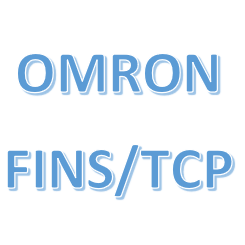

# IoBroker.omron-fins

Verbinden Sie Omron CP-, CV-, CS-, CJ-, NJ- und kompatible NX-SPSen mit ioBroker über das FINS-Protokoll via UDP oder TCP.

Deutsche Dokumentation: [READMEde.md](READMEde.md)

## Konfiguration
Konfigurieren Sie die IP-Adresse der SPS, den FINS-Port (normalerweise `9600`), das Protokoll und das Abfrageintervall auf der Administrationsseite des responsiven Adapters. Die Werte für Ziel-/Quellknoten können für die automatische Adressierung auf `0` belassen werden, es sei denn, das SPS-Netzwerk erfordert explizites FINS-Routing.

Variablen können manuell mit einem eindeutigen Namen, einer FINS-Adresse und einem Datentyp eingegeben werden. Unterstützte Beispiele sind `CIO0.00` (oder das ältere `CB0:00`), `W31.00`, `H0.01`, `A0.00`, `D100`, Timer und Zähler.

Jede Variable wird zu einem beschreibbaren ioBroker-Zustand, sofern die Schreiboption nicht deaktiviert ist. Schreibvorgänge werden erst nach erfolgreicher FINS-Anfrage bestätigt.

## Import der CX-Programmer-Symboltabelle
Exportieren Sie die Symboltabelle aus CX-Programmer als CSV- oder tabulatorgetrennte Textdatei und fügen Sie deren Inhalt in das entsprechende Konfigurationsfeld ein. Der Adapter erkennt englische und deutsche Namens-/Adress-/Datentyp-Header und importiert die Symbole automatisch. Komma, Semikolon und Tabulator werden als Trennzeichen unterstützt. Manuell definierte Variablen überschreiben importierte Symbole mit demselben Namen.

## Fehlerbehebung
- `info.connection` ist nur nach einer erfolgreichen SPS-Antwort wahr.
- `info.lastError` enthält den letzten Kommunikations- oder Konfigurationsfehler.
- Überprüfen Sie den UDP/TCP-Port 9600 und die PLC FINS/ETN-Einstellungen.
- Falls die automatische Knotenadressierung fehlschlägt, konfigurieren Sie DA1 und SA1 explizit.

## Changelog

### 0.1.0

- Updated for Node.js 22/24, js-controller 6 and current adapter-core
- Replaced the legacy administration page with responsive JSON Config
- Added UDP/TCP, timeout and FINS node settings
- Added automatic CX-Programmer CSV/TSV symbol table import
- Prevented overlapping polls and added reliable connection/error handling
- Updated tests, linting, release and Dependabot workflows

### 0.0.2

- Improved cyclic polling

[Older changelogs can be found there](CHANGELOG_OLD.md)

## License

Copyright (c) 2021-2026 TheBam <elektrobam@gmx.de>

MIT License. See [LICENSE](LICENSE).