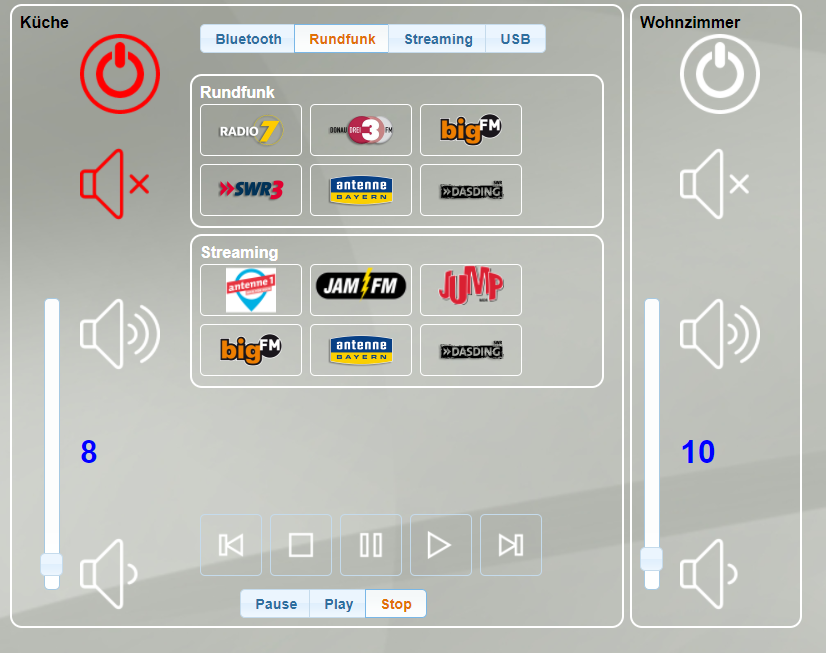

# IoBroker.onkyo
 

**Dieser Adapter verwendet Sentry-Bibliotheken, um den Entwicklern automatisch Ausnahmen und Codefehler zu melden.** Weitere Details und Informationen zum Deaktivieren der Fehlerberichterstattung finden Sie unter [Dokumentation zum Sentry-Plugin](https://github.com/ioBroker/plugin-sentry#plugin-sentry)! Sentry Reporting wird ab js-controller 3.0 verwendet.

### 2.0 Großes Update!
Ab 2.0 gibt es Strukturänderungen! Wenn Sie auf diese Version aktualisieren, müssen Sie die Variablen in jedem anderen Adapter wie VIS oder Javascript ändern! Die neue Version unterstützt Materialien und Cover-Arts. Die Medienobjekte unterstützen Player-Widgets wie Sonos oder Winamp.

Dieser Adapter ermöglicht die Steuerung von Onkyo- und Pioneer-AVRs über das EISCP-Protokoll.

Es verwendet node-eiscp: https://github.com/tillbaks/node-eiscp

Für das Senden von Befehlen gibt es einen Sonderzustand "RAW". Schreibvorgänge in diesen Zustand lösen nur RAW-Befehle wie die bekannten EISCP-Excel-Dateien aus. Als Beispiel für einen EISCP-RAW-Befehl in Form von "PWR01".

Ein weiterer Sonderzustand, der vom Adapter verwaltet wird, ist "verbunden". Es ist ein boolescher Wert, der anzeigt, ob node-eiscp derzeit mit einem Empfänger verbunden ist.

Beispiel einer VIS-Ansicht 

## Getestete Empfänger
###Onkyo
* TX-NR 525
* TX-NR 626
* TX-NR 727

### Pionier
* VXS-S520D
* VSX-1131

<!-- Platzhalter für die nächste Version (am Zeilenanfang):

### __ARBEITEN IN PROGRESS__ -->

## Changelog

### __WORK IN PROGRESS__
* (Apollon77) Add reconnection and device offline detection
* (Apollon77) Add crash reporting using sentry in js.controller 3+

### 2.0.6 (2021-05-28)
* (Diginix) fixed data types

### 2.0.5 (2021-04-27)
* (Diginix) fixed some object properties
* (bluefox) Added the support of compact mode

### 2.0.3   
* (Eisbaeeer) now support zone3   

### 2.0.2
* (Eisbaeeer) fix double .js 

### 2.0.0
* (Eisbaeeer) Major update iobroker.onkyo

### 1.1.5
* (Eisbaeeer) Zones will be powered if tune preset selected   

### 1.1.4  
* (Eisbaeeer) Added direct tuning in zones (issue #2)

### 1.1.3
* (Eisbaeeer) Adding Navigation Items   

### 1.1.2
* (Eisbaeeer) Adding CoverArt

### 1.1.1
* (Eisbaeeer) Update zone 2 volume after power on. Adding Pioneer Receivers with eiscp support.

### 1.1.0
* (Eisbaeeer) Completely new structure (Zone1, Zone2, Device)

### 1.0.5
* (Eisbaeeer) Changed structure
* (Eisbaeeer) Added Object RAW to send own commands

### 1.0.4 (2018.07.24)
* (Eisbaeeer) Cleaned program
* (Eisbaeeer) Fix logging

### 1.0.2 (2018.02.28)
* (Eisbaeeer) Changed name of adapter
* (Eisbaeeer) Added testing of adapter in travis

### 1.0.0 (2017.11.28)
* (Eisbaeeer) Add max volume settings to zone1 and zone2.   
* (Eisbaeeer) changed objects to switch
* (Eisbaeeer) moved adapter to "multimedia"
* (Eisbaeeer) cleaned log outputs

### 0.1.20 (2016.03.29)
* (Eisbaeeer) Add checkbox in settings for VIS objects. Volumes can be set in
  decimal. Power states, mute states, etc. are now usable with VIS buttons.

### 0.1.12 (2016.02.25)
* (installator) Fix power state

### 0.1.11 (2016.01.13)
* (installator) Fix regexp error

### 0.1.10
* (installator) For command CTL sets Center Level -12 - 0 - +12

### 0.1.9
* (installator) change power to system-power

### 0.1.8
* (installator) fix values to control power and enable using of 1 and 0

### 0.1.7
* (bluefox) fix creation of specific states (twice)

### 0.1.6
* (bluefox) fix creation of specific states

### 0.1.5
* (bluefox) fix node-eiscp package

### 0.1.4
* (bluefox) add debug outputs

### 0.1.1
* (bluefox) replace git with tarball

### 0.1.0
* (bluefox) update adapter for new concept

### 0.0.4
* (owagner) use verify_commands=false, to be able to send high-level commands to unknown AVR models

### 0.0.3
* (owagner) allow setting of states other than "command". This will trigger a high level
  command with the state name being set to the new value. Note that this will fail for
  many newer models, as they are not yet properly represented in node-eiscp's
  command table. Use the raw command in that case
* send some initial queries upon connect to get basic state information from the AVR

### 0.0.2
* (owagner) support node-eiscp's Autodiscovery mechanism
* (owagner) updated README, notably removing bogus reference to single instancing

### 0.0.1
* (owagner) initial version

## License
The MIT License (MIT)
Copyright (c) 2014-2021 bluefox <dogafox@gmail.com>,
              2014-2015 Oliver Wagner <owagner@tellerulam.com>