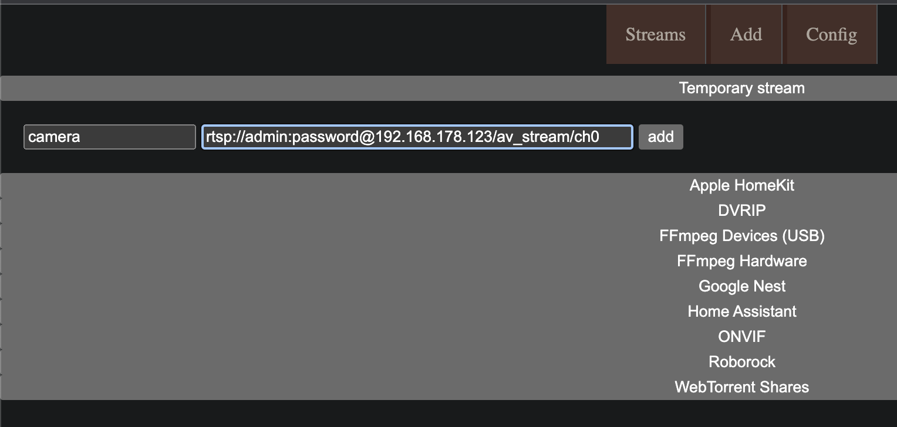
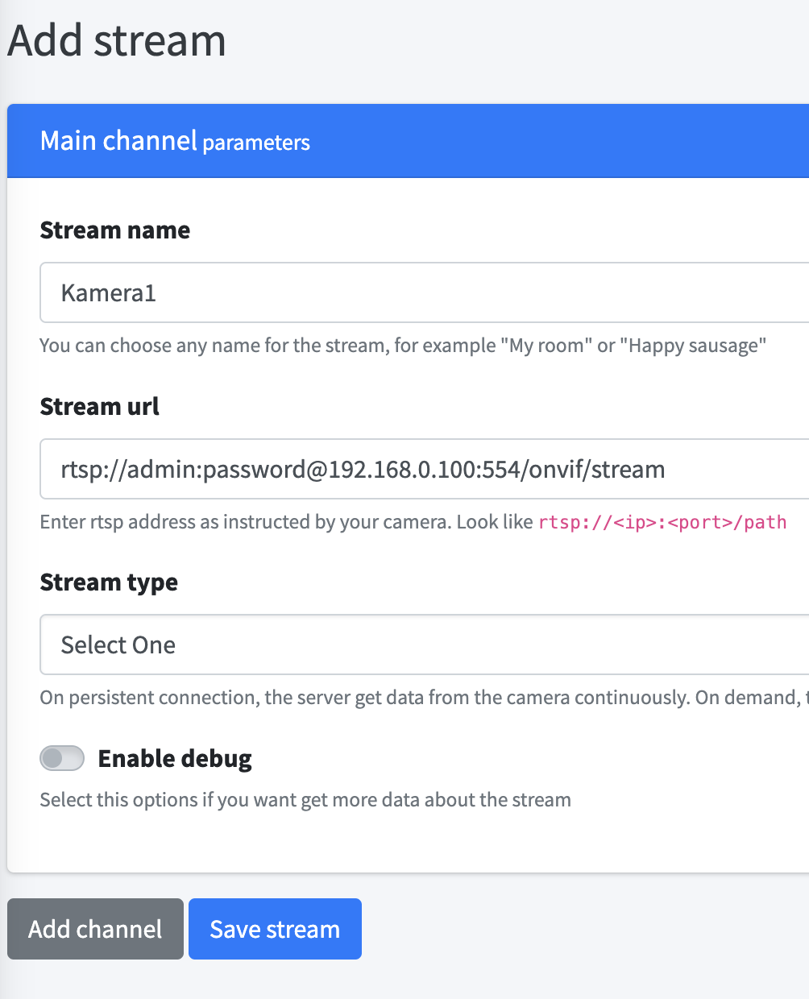
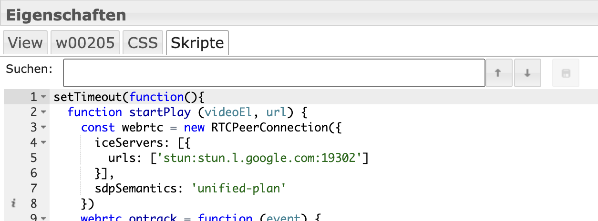

# IoBroker.onvif
**Tests:** 

## ONVIF-Adapter für ioBroker
**Adapter für ONVIF-Kameras**

**Dieser Adapter verwendet Sentry-Bibliotheken, um Ausnahmen und Codefehler automatisch an die Entwickler zu melden.** Weitere Details und Informationen zum Deaktivieren der Fehlerberichterstattung finden Sie unter [Sentry-Plugin-Dokumentation](https://github.com/ioBroker/plugin-sentry#plugin-sentry)! Sentry Reporting wird ab js-controller 3.0 verwendet.

## Kameras hinzufügen
### Entdeckung:
Bei jedem Adapterstart wird mit dem in den Einstellungen eingetragenen Benutzernamen und Passwort eine Discovery durchgeführt und versucht, sich in die Kamera einzuloggen. Falls die Kamera noch nicht unter Objekten hinzugefügt wurde.

In den Einstellungen kann man den Discovery manuell ausführen. Falls die Kameras unterschiedliche Zugangsdaten haben, müssen die jeweils eingegeben und eine Entdeckung durchgeführt werden. Im Log sieht man Details zu dem Prozess.

Damit eine Kamera neu erkannt wird, muss sie einfach unter Objekten gelöscht werden.

### Manuelle Suche
Es können Kameras manuell gesucht werden, falls Discovery nicht funktioniert. Dazu müssen ein IP-Bereich und Ports eingegeben und manuell ausgeführt werden. Im Log sieht man Details zu dem Prozess.

## Datenpunkte
onvif.0.IP_PORT.events Events der Kamera wie z.b. Bewegungserkennung. Manchmal muss ein Ereignis ausgelöst werden, damit es angezeigt wird.

onvif.0.IP_PORT.general Allgemeine Informationen über die Kameras

onvif.0.IP_PORT.infos Informationen über die Kamera werden nur bei Adapterstart aktualisiert oder bei remote.refresh

Video- und Snapshot-URL:

onvif.0.IP_PORT.infos.streamUris.MediaProfile_Channel1_MainStream.snapshotUrl.uri

onvif.0.IP_PORT.remote Steuerung der Kamera

onvif.0.IP_PORT.remote.refresh Aktualisierung der Infodaten

onvif.0.IP_PORT.remote.gotoHomePosition PTZ Kamera in die HomePosition setzen

onvif.0.IP_PORT.remote.gotoPreset PTZ Kamera Preset Nummer auswählen

onvif.0.IP_PORT.remote.snapshot Speichert einen Snapshot unter onvif.0.IP_PORT.snapshot

## Nachricht
Der Adapter nimmt die Nachricht „snapshot“ entgegen und gibt ein Bild zurück

```javascript
sendTo("onvif.0", "snapshot", "192_168_178_100_80", (result) => {
  if (result) {
    sendTo("telegram.0", {
      text: result,
      type: "photo",
      caption: "Kamera 2",
    });
  }
});
```

## Bewegungsmeldung zu Telegram
```javascript
on("onvif.0.192_168_178_100_80.events.RuleEngine/CellMotionDetector/Motion", (obj) => {
  if (obj.state.val === true) {
    sendTo("onvif.0", "snapshot", "192_168_178_100_80", (result) => {
      if (result) {
        sendTo("telegram.0", {
          text: result,
          type: "photo",
          caption: "Camera 2",
        });
      }
    });
  }
});
```

# Stream in vis einbinden
Wenn Stream im Apple Homekit angezeigt wird, soll dann bitte direkt in yahka eine Kamera erzeugt werden. Wenn das nicht funktioniert oder hksv benötigt wird, dann scrypted in einem Docker installieren und die Kamera mit onvif und Homekit Plugin hinzufügen

## Go2rtsp Docker
Ein Stream wird normalerweise per RTSP-Stream bereitgestellt. Eine Umwandlung via Motion Eye ist sehr ressourcenaufwändig und hat eine Verzögerung. Eine Umwandlung in webrtc ist schneller und ressourcenschonender. Meine Empfehlung ist ein [go2rtsp](https://github.com/AlexxIT/go2rtc). Dazu muss ein Docker von alexxit/go2rtc erstellt werden.
https://hub.docker.com/r/alexxit/go2rtc

Es gibt auch eine Version mit Hardware-Unterstützung: https://github.com/AlexxIT/go2rtc/wiki/Hardware-acceleration

Oder go2rtc lokal zu installieren: https://forum.iobroker.net/post/1031526

```
 image: alexxit/go2rtc
    network_mode: host       # important for WebRTC, HomeKit, UDP cameras
    privileged: true         # only for FFmpeg hardware transcoding
    restart: unless-stopped  # autorestart on fail or config change from WebUI
    environment:
      - TZ=Europe/Berlin  # timezone in logs
    volumes:
      - "~/go2rtc:/config"   # folder for go2rtc.yaml file (edit from WebUI)
```

Es muss ein Volume für den Pfad /config und das Netzwerk als Host eingestellt werden.

Dann ist go2rtsp erreichbar über

```
http://IP:1984
```

Dann kann man einen Stream hinzufügen. Die Stream-URL findet man z.B. unter `onvif.0.IP_PORT.infos.streamUris.ProfileName.live_stream_tcp.uri`



### Stream als iFrame einfügen
Das Widget `iFrame` in der Vis hinzufügen und als Quelle den Stream-Link von go2rtsp verwenden

`http://192.168.178.1:1984/stream.html?src=camera&mode=webrtc`

Unter Links kann noch die Art des Players ausgewählt werden (Mikrofon)

## Rtsp2Web Docker
Eine Alternative ist ein [RTSPtoWeb](https://github.com/deepch/RTSPtoWeb) Docker. Dies ist aber von der Richtun komplizierter.
Dazu muss ein Docker von ghcr.io/deepch/rtsptoweb:latest erstellt werden.

<details>

```
docker run --name rtsp-to-web -v /YOURPATHFORCONFIG:/config --network host ghcr.io/deepch/rtsptoweb:latest
```

Es muss ein Volume für den Pfad /config und das Netzwerk als Host eingestellt werden.

Dann ist rtsptoweb erreichbar über

```
http://IP:8083
```

Dann kann man einen Stream hinzufügen. Die Stream-URL findet man z.B. unter `onvif.0.IP_PORT.infos.streamUris.ProfileName.live_stream_tcp.uri`



### Danach benötigen wir die Stream Id. Dafür Stream Edit und in der URL die Id rauskopieren
`http://192.168.178.2:8083/pages/stream/edit/ddbdb583-9f80-4b61-bafa-613aa7a5daa5`

## Einzelnen Stream in das Vis einfügen
Wählen Sie dann in der Ansicht ein HTML-Objekt aus. Dann im Widget unter HTML den rtsp2web server mit stream id eintragen:


## **Wenn mehrere Streams hinzugefügt werden sollen, müssen `webrtc-url` und `webrtc-video` in html und skript durch eine neue id ersetzt werden z.B. `webrtc-url2` und `webrtc-video2`**
```html
<input
  type="hidden"
  name="webrtc-url"
  id="webrtc-url"
  value="http://192.168.0.2:8083/stream/ddbdb583-9f80-4b61-bafa-613aa7a5daa5/channel/0/webrtc"
/>

<video id="webrtc-video" autoplay muted playsinline controls style="max-width: 100%; max-height: 100%;"></video>
```

In dem Widget unter Skripte dieses Skripts hinzufügen:

```javascript
setTimeout(function () {
  function startPlay(videoEl, url) {
    const webrtc = new RTCPeerConnection({
      iceServers: [
        {
          urls: ["stun:stun.l.google.com:19302"],
        },
      ],
      sdpSemantics: "unified-plan",
    });
    webrtc.ontrack = function (event) {
      console.log(event.streams.length + " track is delivered");
      videoEl.srcObject = event.streams[0];
      videoEl.play();
    };
    webrtc.addTransceiver("video", { direction: "sendrecv" });
    webrtc.onnegotiationneeded = async function handleNegotiationNeeded() {
      const offer = await webrtc.createOffer();

      await webrtc.setLocalDescription(offer);

      fetch(url, {
        method: "POST",
        body: new URLSearchParams({ data: btoa(webrtc.localDescription.sdp) }),
      })
        .then((response) => response.text())
        .then((data) => {
          try {
            webrtc.setRemoteDescription(new RTCSessionDescription({ type: "answer", sdp: atob(data) }));
          } catch (e) {
            console.warn(e);
          }
        });
    };

    const webrtcSendChannel = webrtc.createDataChannel("rtsptowebSendChannel");
    webrtcSendChannel.onopen = (event) => {
      console.log(`${webrtcSendChannel.label} has opened`);
      webrtcSendChannel.send("ping");
    };
    webrtcSendChannel.onclose = (_event) => {
      console.log(`${webrtcSendChannel.label} has closed`);
      startPlay(videoEl, url);
    };
    webrtcSendChannel.onmessage = (event) => console.log(event.data);
  }

  const videoEl = document.querySelector("#webrtc-video");
  const webrtcUrl = document.querySelector("#webrtc-url").value;

  startPlay(videoEl, webrtcUrl);
}, 1000);
```



## Alle Streams als iFrame
Alternativ könnte man auch den Kamera Overview als Iframe einfügen: Das Widget `iFrame` hinzufügen und als Quelle den rtsp2web Server eintragen:

`http://192.168.0.2:8083/pages/multiview/full?controls`

</details>

## FFMpeg Unterstützung
Wenn die Kamera keinen Snapshot unterstützt, wird mit ffmpeg ein Snapshot aus dem RTSP-Stream erzeugt.

## Snapshot Server in vis einbinden
Der Adapter bietet einen Snapshot Server ohne Passwort an. Dazu Server aktivieren in den Instanzeinstellungen und dann kann der aktuelle Snapshot http://iobrokerIp:8095/CAMERAIP_PORT z.B. http://192.168.0.1:8095/192_168_0_1_80 abgerufen werden.

In der Vis ein Image Widget einfügen und die URL als Quelle angeben und eine Updatezeit auswählen

## Snapshot in vis einbinden
Wenn möglich die snapshotUri verwenden z.B.
onvif.0.IP_PORT.infos.streamUris.MediaProfile_Channel1_MainStream.snapshotUrl.uri

### _Den Datenpunkt nicht als Stream verwenden, da sonst die Festplatte zu hoch ist._
#### Den Datenpunkt aktualisieren über onvif.0.IP_PORT.remote.snapshot
Den Datenpunkt onvif.0.IP_PORT.snapshot ein `String img src` Element zuordnen

Oder als Alternative fällt `String img src` nicht funktioniert

Den Datenpunkt onvif.0.IP_PORT.snapshot als `HTML` Element in die vis einfügen mit folgendem Inhalt

```javascript

```

Neuen Snapshot erzeugen bei Event:

```javascript
on("onvif.0.192_168_178_100_80.events.RuleEngine/CellMotionDetector/Motion", (obj) => {
  if (obj.state.val === true) {
    setState("onvif.0.192_168_178_100_80.remote.snapshot", true, false);
  }
});
```

# Englisch
## Kameras hinzufügen
### Entdeckung:
Bei jedem Start des Adapters wird eine Erkennung mit dem in den Einstellungen eingegebenen Benutzernamen und Passwort durchgeführt und versucht, sich bei der Kamera anzumelden. Wenn die Kamera noch nicht unter Objekte hinzugefügt wurde.

Sie können die Erkennung manuell in den Einstellungen durchführen. Wenn die Kameras unterschiedliche Zugangsdaten haben, müssen Sie diese eingeben und eine Erkennung durchführen. Im Protokoll können Sie die Details des Vorgangs einsehen.

Damit eine Kamera wieder erkannt wird, muss sie einfach unter Objekte gelöscht werden.

### Manuelle Suche
Kameras können manuell gesucht werden, wenn Discovery nicht funktioniert. Dazu müssen ein IP-Bereich und Ports manuell eingegeben und ausgeführt werden. Im Protokoll können Sie Details zum Vorgang einsehen.

## Datenpunkte
onvif.0.IP_PORT.events Ereignisse der Kamera wie z.B. Bewegungserkennung. Manchmal muss man das Ereignis auslösen, um es zu sehen.

onvif.0.IP_PORT.general Allgemeine Informationen zu den Kameras

onvif.0.IP_PORT.infos Informationen zur Kamera werden nur beim Adapterstart oder bei remote.refresh aktualisiert

Video- und Snapshot-URL:

onvif.0.IP_PORT.infos.streamUris.MediaProfile_Channel1_MainStream.snapshotUrl.uri

onvif.0.IP_PORT.remote Steuerung der Kamera

onvif.0.IP_PORT.remote.refresh Aktualisierung der Infodaten

onvif.0.IP_PORT.remote.gotoHomePosition PTZ-Kamera auf Home-Position setzen

onvif.0.IP_PORT.remote.gotoPreset Wählen Sie die voreingestellte Nummer der PTZ-Kamera aus

onvif.0.IP_PORT.remote.snapshot Snapshot in onvif.0.IP_PORT.snapshot speichern

## Nachricht
Der Adapter empfängt die Nachricht „Schnappschuss“ und gibt ein Bild zurück

```javascript
sendTo("onvif.0", "snapshot", "192_168_178_100_80", (result) => {
  if (result) {
    sendTo("telegram.0", {
      text: result,

      type: "photo",

      caption: "camera2",
    });
  }
});
```

## Bewegungsnachricht an Telegram
```javascript
on("onvif.0.192_168_178_100_80.events.RuleEngine/CellMotionDetector/Motion", (obj) => {
  if (obj.state.val === true) {
    sendTo("onvif.0", "snapshot", "192_168_178_100_80", (result) => {
      if (result) {
        sendTo("telegram.0", {
          text: result,

          type: "photo",

          caption: "Camera 2",
        });
      }
    });
  }
});
```

# Stream in Vis einbinden
Wenn der Stream in Apple Homekit angezeigt werden soll, dann erstellen Sie bitte direkt in Yahka eine Kamera. Wenn das nicht funktioniert oder hksv benötigt wird, installieren Sie Scrypted in einem Docker und fügen Sie die Kamera mit Onvif und Homekit-Plugin hinzu

## Go2rtsp Docker
Ein Stream wird normalerweise über einen RTSP-Stream bereitgestellt. Eine Konvertierung per Motion Eye ist sehr ressourcenintensiv und zeitverzögert. Eine Umstellung auf webrtc ist schneller und spart Ressourcen. Meine Empfehlung ist ein [go2rtsp](https://github.com/AlexxIT/go2rtc). Hierzu muss ein Docker von alexxit/go2rtc erstellt werden.
https://hub.docker.com/r/alexxit/go2rtc

```
 image: alexxit/go2rtc
    network_mode: host # important for WebRTC, HomeKit, UDP cameras
    privileged: true # only for FFmpeg hardware transcoding
    restart: unless-stopped # autorestart on fail or config change from WebUI
    environment:
      - TZ=Europe/Berlin # timezone in logs
    volumes:
      - "~/go2rtc:/config" # folder for go2rtc.yaml file (edit from WebUI)
```

Es muss ein Volume für den Pfad /config und das Netzwerk als Host eingestellt werden.

Dann ist go2rtsp über erreichbar

```
http://IP:1984
```

Dann können Sie einen Stream hinzufügen. Die Stream-URL finden Sie z.B. unter `onvif.0.IP_PORT.infos.streamUris.ProfileName.live_stream_tcp.uri`


### Stream als iFrame einfügen
Fügen Sie das `iFrame`-Widget im Vis hinzu und verwenden Sie den Stream-Link von go2rtsp als Quelle

`http://192.168.178.1:1984/stream.html?src=camera&mode=webrtc`

## Rtsp2Web Docker
Eine Alternative ist ein [RTSPtoWeb](https://github.com/deepch/RTSPtoWeb) Docker. Allerdings ist die Einrichtung komplizierter.
Ein Docker muss unter ghcr.io/deepch/rtsptoweb:latest erstellt werden.

<details>

```
docker run --name rtsp-to-web -v /YOURPATHFORCONFIG:/config --network host ghcr.io/deepch/rtsptoweb:latest
```

Für den Pfad /config muss ein Volume eingestellt sein und das Netzwerk muss als Host eingestellt sein.

Dann ist rtsptoweb erreichbar über

```
http://IP:8083
```

Dann können Sie einen Stream hinzufügen. Die Stream-URL finden Sie z.B. unter `onvif.0.IP_PORT.infos.streamUris.ProfileName.live_stream_tcp.uri`


### Dann benötigen wir die Stream-ID. Führen Sie dazu eine Stream-Bearbeitung durch und kopieren Sie die ID in die URL
`http://192.168.178.2:8083/pages/stream/edit/ddbdb583-9f80-4b61-bafa-613aa7a5daa5`

## Einzelnen Stream in die Vis einfügen
Wählen Sie dann ein HTML-Objekt in der Vis aus. Anschließend tragen Sie im Widget unter HTML den rtsp2web-Server mit Stream-ID ein:


## **Wenn mehrere Streams hinzugefügt werden sollen, müssen `webrtc-url` und `webrtc-video` in HTML und Skript durch eine neue ID ersetzt werden, z. B. `webrtc-url2` und `webrtc-video2`**
```html
<input
  type="hidden"
  name="webrtc-url"
  id="webrtc-url"
  value="http://192.168.0.2:8083/stream/ddbdb583-9f80-4b61-bafa-613aa7a5daa5/channel/0/webrtc"
/>

<video id="webrtc-video" autoplay muted playsinline controls style="max-width: 100%; max-height: 100%;"></video>
```

Fügen Sie dieses Skript im Widget unter Skripte hinzu:

```javascript
setTimeout(function () {
  function startPlay(videoEl, url) {
    const webrtc = new RTCPeerConnection({
      iceServers: [
        {
          urls: ["stun:stun.l.google.com:19302"],
        },
      ],
      sdpSemantics: "unified-plan",
    });
    webrtc.ontrack = function (event) {
      console.log(event.streams.length + " track is delivered");
      videoEl.srcObject = event.streams[0];
      videoEl.play();
    };
    webrtc.addTransceiver("video", { direction: "sendrecv" });
    webrtc.onnegotiationneeded = async function handleNegotiationNeeded() {
      const offer = await webrtc.createOffer();

      await webrtc.setLocalDescription(offer);

      fetch(url, {
        method: "POST",
        body: new URLSearchParams({ data: btoa(webrtc.localDescription.sdp) }),
      })
        .then((response) => response.text())
        .then((data) => {
          try {
            webrtc.setRemoteDescription(new RTCSessionDescription({ type: "answer", sdp: atob(data) }));
          } catch (e) {
            console.warn(e);
          }
        });
    };

    const webrtcSendChannel = webrtc.createDataChannel("rtsptowebSendChannel");
    webrtcSendChannel.onopen = (event) => {
      console.log(`${webrtcSendChannel.label} has opened`);
      webrtcSendChannel.send("ping");
    };
    webrtcSendChannel.onclose = (_event) => {
      console.log(`${webrtcSendChannel.label} has closed`);
      startPlay(videoEl, url);
    };
    webrtcSendChannel.onmessage = (event) => console.log(event.data);
  }

  const videoEl = document.querySelector("#webrtc-video");
  const webrtcUrl = document.querySelector("#webrtc-url").value;

  startPlay(videoEl, webrtcUrl);
}, 1000);
```


## Alle Streams als iFrame
Alternativ können Sie die Kameraübersicht auch als Iframe einfügen: Fügen Sie das Widget `iFrame` hinzu und geben Sie als Quelle den rtsp2web-Server ein:

`http://192.168.0.2:8083/pages/multiview/full?controls`

</details>

## FFMpeg-Unterstützung
Wenn die Kamera keine Snapshot-Unterstützung bietet, erstellt ffmpeg einen Snapshot aus dem RTSP-Stream.

## Snapshot-Server in Vis einbinden
Der Adapter bietet einen Snapshot-Server ohne Passwort. Aktivieren Sie den Server in den Instanzeinstellungen und dann können Sie den aktuellen Snapshot http://iobrokerIp:8095/CAMERAIP_PORT z.B. erhalten. http://192.168.0.1:8095/192_168_0_1_80.

Fügen Sie ein Bild-Widget in die Vis ein, geben Sie die URL als Quelle an und wählen Sie eine Aktualisierungszeit aus

## Schnappschuss in Vis einschließen
Wenn möglich, verwenden Sie die snapshotUri, z.B.

onvif.0.IP_PORT.infos.streamUris.MediaProfile_Channel1_MainStream.snapshotUrl.uri

### _Verwenden Sie den Datenpunkt nicht als Stream, da sonst die Festplattenlast zu hoch wird._
#### Aktualisieren Sie den Datenpunkt über onvif.0.IP_PORT.remote.snapshot
Weisen Sie dem Datenpunkt onvif.0.IP_PORT.snapshot ein `String img src`-Element zu.

Oder alternativ, wenn `String img src` nicht funktioniert

Fügen Sie den Datenpunkt onvif.0.IP_PORT.snapshot als `HTML` Element in die Vis mit folgendem Inhalt ein

```javascript

```

Erstellen Sie einen neuen Snapshot zum Ereignis:

```javascript
on("onvif.0.192_168_178_100_80.events.RuleEngine/CellMotionDetector/Motion", (obj) => {
  if (obj.state.val === true) {
    setState("onvif.0.192_168_178_100_80.remote.snapshot", true, false);
  }
});
```

## Diskussionen / Diskussion und Fragen
<https://forum.iobroker.net/topic/63145/test-adapter-onvif-camera-v1-0-0>

## Changelog

<!--
    Placeholder for the next version (at the beginning of the line):
    ### **WORK IN PROGRESS**
-->

### 1.1.1 (2023-10-18)

- (mcm1957) Standard iobroker release environment has been added.
- (mcm1957) Some dependencies have been updated.

### 1.1.0

- (TA2k) Bugfixes

### 1.0.5

- Improve event handling

### 1.0.4

- (TA2k) Minor bugfixes and readme update for livestream in vis

### 1.0.3

- (TA2k) Minor bugfixes

### 1.0.2

- (TA2k) Fixed a reonnect and empty event bug

### 1.0.1

- (TA2k) initial new release

## License

MIT License

Copyright (c) 2023 TA2k <tombox2020@gmail.com>

Permission is hereby granted, free of charge, to any person obtaining a copy
of this software and associated documentation files (the "Software"), to deal
in the Software without restriction, including without limitation the rights
to use, copy, modify, merge, publish, distribute, sublicense, and/or sell
copies of the Software, and to permit persons to whom the Software is
furnished to do so, subject to the following conditions:

The above copyright notice and this permission notice shall be included in all
copies or substantial portions of the Software.

THE SOFTWARE IS PROVIDED "AS IS", WITHOUT WARRANTY OF ANY KIND, EXPRESS OR
IMPLIED, INCLUDING BUT NOT LIMITED TO THE WARRANTIES OF MERCHANTABILITY,
FITNESS FOR A PARTICULAR PURPOSE AND NONINFRINGEMENT. IN NO EVENT SHALL THE
AUTHORS OR COPYRIGHT HOLDERS BE LIABLE FOR ANY CLAIM, DAMAGES OR OTHER
LIABILITY, WHETHER IN AN ACTION OF CONTRACT, TORT OR OTHERWISE, ARISING FROM,
OUT OF OR IN CONNECTION WITH THE SOFTWARE OR THE USE OR OTHER DEALINGS IN THE
SOFTWARE.

```

```