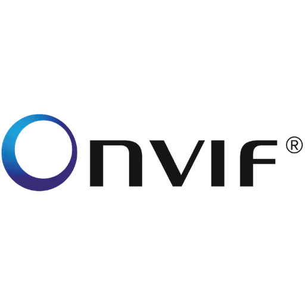
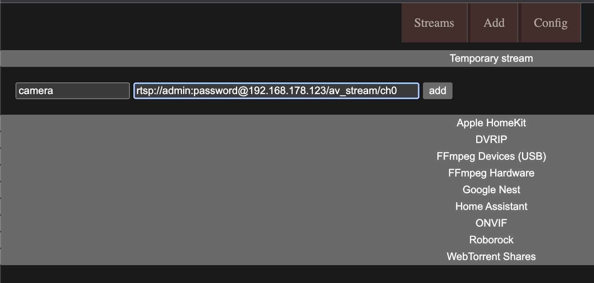
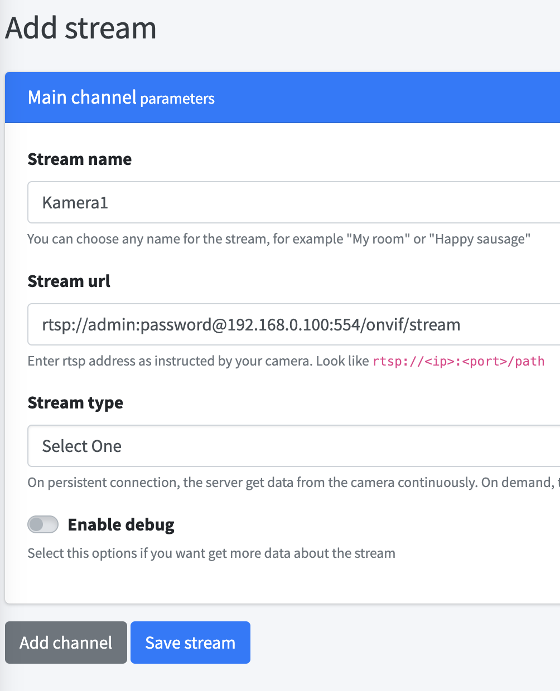
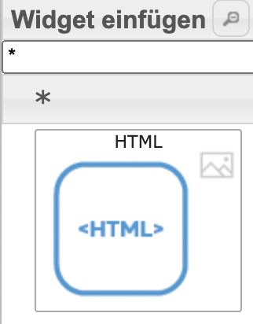

# IoBroker.onvif
**Tests:** 

## ONVIF-Adapter für ioBroker
**Adapter für ONVIF-Kameras**

**Dieser Adapter verwendet Sentry-Bibliotheken, um Ausnahmen und Codefehler automatisch an die Entwickler zu melden.** Weitere Details und Informationen zum Deaktivieren der Fehlerberichterstattung finden Sie in Abschnitt [Sentry-Plugin-Dokumentation](https://github.com/ioBroker/plugin-sentry#plugin-sentry)! Die Sentry-Berichterstattung wird ab js-controller 3.0 verwendet.

[zur deutschen Dokumentation](README-de.md)

## Kameras hinzufügen
### Entdeckung:
Bei jedem Start des Adapters wird eine Erkennung mit dem in den Einstellungen hinterlegten Benutzernamen und Passwort durchgeführt und versucht, sich bei der Kamera anzumelden, sofern die Kamera noch nicht unter „Objekte“ hinzugefügt wurde.

Die Erkennung kann in den Einstellungen manuell durchgeführt werden. Falls die Kameras unterschiedliche Zugangsdaten verwenden, müssen diese eingegeben und die Erkennung erneut durchgeführt werden. Die Details des Vorgangs sind im Protokoll einsehbar.

Damit eine Kamera wieder erkannt wird, muss sie einfach unter Objekte gelöscht werden.

### Manuelle Suche
Falls die automatische Erkennung nicht funktioniert, können Kameras manuell gesucht werden. Dazu müssen ein IP-Bereich und die Ports manuell eingegeben und die Suche ausgeführt werden. Details zum Vorgang finden Sie im Protokoll.

## Staaten
onvif.0.IP_PORT.events Ereignisse der Kamera, z. B. Bewegungserkennung. Manchmal muss das Ereignis ausgelöst werden, um es anzuzeigen.

onvif.0.IP_PORT.general Allgemeine Informationen zu den Kameras

Die Informationen zur Kamera in onvif.0.IP_PORT.infos werden nur beim Start des Adapters oder bei remote.refresh aktualisiert.

Video- und Screenshot-URL:

onvif.0.IP_PORT.infos.streamUris.MediaProfile_Channel1_MainStream.snapshotUrl.uri

onvif.0.IP_PORT.Fernsteuerung der Kamera

onvif.0.IP_PORT.remote.refresh Aktualisiere die Informationsdaten

onvif.0.IP_PORT.remote.gotoHomePosition PTZ-Kamera in die Ausgangsposition bringen

onvif.0.IP_PORT.remote.gotoPreset PTZ-Kamera-Voreinstellungsnummer auswählen

onvif.0.IP_PORT.remote.snapshot Speichert Snapshot unter onvif.0.IP_PORT.snapshot

## Nachricht
Der Adapter empfängt die Nachricht „Snapshot“ und gibt das Bild zurück.

```javascript
sendTo('onvif.0', 'snapshot', '192_168_178_100_80', (result) => {
  if (result) {
    sendTo('telegram.0', {
      text: result,

      type: 'photo',

      caption: 'camera2',
    });
  }
});
```

## Bewegungsnachricht an Telegram
```javascript
on('onvif.0.192_168_178_100_80.events.RuleEngine/CellMotionDetector/Motion', (obj) => {
  if (obj.state.val === true) {
    sendTo('onvif.0', 'snapshot', '192_168_178_100_80', (result) => {
      if (result) {
        sendTo('telegram.0', {
          text: result,

          type: 'photo',

          caption: 'Camera 2',
        });
      }
    });
  }
});
```

## Stream in die Visualisierung einbinden
Soll der Stream in Apple HomeKit angezeigt werden, erstellen Sie bitte eine Kamera direkt in Yahka. Falls das nicht funktioniert oder HKSV benötigt wird, installieren Sie Scrypted in einem Docker-Container und fügen Sie die Kamera mit dem ONVIF- und HomeKit-Plugin hinzu.

## Go2rtsp Docker
Ein Stream wird üblicherweise über RTSP bereitgestellt. Eine Konvertierung mit MotionEye ist sehr ressourcenintensiv und führt zu Verzögerungen. Eine Konvertierung zu WebRTC ist schneller und ressourcenschonender. Ich empfehle daher die Verwendung von [go2rtsp](https://github.com/AlexxIT/go2rtc). Hierfür muss ein Docker-Container von alexxit/go2rtc erstellt werden.

https://hub.docker.com/r/alexxit/go2rtc

```
 image: alexxit/go2rtc
    network_mode: host # important for WebRTC, HomeKit, UDP cameras
    privileged: true # only for FFmpeg hardware transcoding
    restart: unless-stopped # autorestart on fail or config change from WebUI
    environment:
      - TZ=Europe/Berlin # timezone in logs
    volumes:
      - "~/go2rtc:/config" # folder for go2rtc.yaml file (edit from WebUI)
```

Für den Pfad /config und das Netzwerk als Host muss ein Volume festgelegt werden.

Dann ist go2rtsp über

```
http://IP:1984
```

Anschließend können Sie einen Stream hinzufügen. Die Stream-URL finden Sie beispielsweise unter `onvif.0.IP_PORT.infos.streamUris.ProfileName.live_stream_tcp.uri`



### Stream als iFrame einfügen
Fügen Sie das Widget `iFrame` in die Vis-Ansicht ein und verwenden Sie den Stream-Link von go2rtsp als Quelle.

`http://192.168.178.1:1984/stream.html?src=camera&mode=webrtc`

## Rtsp2Web Docker
Alternativ kann ein [RTSPtoWeb](https://github.com/deepch/RTSPtoWeb)-Docker-Container verwendet werden. Dessen Einrichtung ist jedoch komplizierter.
Ein Docker-Container muss von ghcr.io/deepch/rtsptoweb:latest erstellt werden.

<details>

```
docker run --name rtsp-to-web -v /YOURPATHFORCONFIG:/config --network host ghcr.io/deepch/rtsptoweb:latest
```

Für den Pfad /config muss ein Volume festgelegt werden und das Netzwerk muss auf Host eingestellt sein.

Dann kann rtsptoweb über folgendes erreicht werden:

```
http://IP:8083
```

Anschließend können Sie einen Stream hinzufügen. Die Stream-URL finden Sie beispielsweise unter `onvif.0.IP_PORT.infos.streamUris.ProfileName.live_stream_tcp.uri`



Als Nächstes benötigen wir die Stream-ID. Dazu bearbeiten Sie den Stream und kopieren die ID aus der URL.
`http://192.168.178.2:8083/pages/stream/edit/ddbdb583-9f80-4b61-bafa-613aa7a5daa5`

## Einzelnen Stream in die Visualisierung einfügen
Wählen Sie anschließend ein HTML-Objekt in der Ansicht aus. Geben Sie dann im Widget unter HTML den rtsp2web-Server mit der Stream-ID ein:



## **Sollten mehrere Streams hinzugefügt werden, müssen `webrtc-url` und `webrtc-video` im HTML- und Skriptcode durch eine neue ID ersetzt werden, z. B. `webrtc-url2` und `webrtc-video2`.**
```html
<input
  type="hidden"
  name="webrtc-url"
  id="webrtc-url"
  value="http://192.168.0.2:8083/stream/ddbdb583-9f80-4b61-bafa-613aa7a5daa5/channel/0/webrtc"
/>

<video id="webrtc-video" autoplay muted playsinline controls style="max-width: 100%; max-height: 100%;"></video>
```

Fügen Sie dieses Skript im Widget unter „Skripte“ hinzu:

```javascript
setTimeout(function () {
  function startPlay(videoEl, url) {
    const webrtc = new RTCPeerConnection({
      iceServers: [
        {
          urls: ['stun:stun.l.google.com:19302'],
        },
      ],
      sdpSemantics: 'unified-plan',
    });
    webrtc.ontrack = function (event) {
      console.log(event.streams.length + ' track is delivered');
      videoEl.srcObject = event.streams[0];
      videoEl.play();
    };
    webrtc.addTransceiver('video', { direction: 'sendrecv' });
    webrtc.onnegotiationneeded = async function handleNegotiationNeeded() {
      const offer = await webrtc.createOffer();

      await webrtc.setLocalDescription(offer);

      fetch(url, {
        method: 'POST',
        body: new URLSearchParams({ data: btoa(webrtc.localDescription.sdp) }),
      })
        .then((response) => response.text())
        .then((data) => {
          try {
            webrtc.setRemoteDescription(new RTCSessionDescription({ type: 'answer', sdp: atob(data) }));
          } catch (e) {
            console.warn(e);
          }
        });
    };

    const webrtcSendChannel = webrtc.createDataChannel('rtsptowebSendChannel');
    webrtcSendChannel.onopen = (event) => {
      console.log(`${webrtcSendChannel.label} has opened`);
      webrtcSendChannel.send('ping');
    };
    webrtcSendChannel.onclose = (_event) => {
      console.log(`${webrtcSendChannel.label} has closed`);
      startPlay(videoEl, url);
    };
    webrtcSendChannel.onmessage = (event) => console.log(event.data);
  }

  const videoEl = document.querySelector('#webrtc-video');
  const webrtcUrl = document.querySelector('#webrtc-url').value;

  startPlay(videoEl, webrtcUrl);
}, 1000);
```


## Alle Streams als iFrame
Alternativ können Sie die Kameraübersicht auch als iFrame einfügen: Fügen Sie das Widget `iFrame` hinzu und geben Sie den rtsp2web-Server als Quelle an:

`http://192.168.0.2:8083/pages/multiview/full?controls`

</details>

## FFMpeg-Unterstützung
Falls die Kamera keine Snapshot-Funktion besitzt, erstellt ffmpeg einen Snapshot aus dem RTSP-Stream.

## Snapshot-Server in die Visualisierung einbeziehen
Der Adapter bietet einen Snapshot-Server ohne Passwort. Aktivieren Sie den Server in den Instanzeinstellungen, um den aktuellen Snapshot unter http://iobrokerIp:8095/CAMERAIP_PORT abzurufen, z. B. http://192.168.0.1:8095/192_168_0_1_80.

Fügen Sie ein Bild-Widget in die Ansicht ein, geben Sie die URL als Quelle an und wählen Sie eine Aktualisierungszeit aus.

## Snapshot in die Visualisierung einbeziehen
Wenn möglich, verwenden Sie die snapshotUri, z. B.

onvif.0.IP_PORT.infos.streamUris.MediaProfile_Channel1_MainStream.snapshotUrl.uri

### _Verwenden Sie den Zustand nicht als Datenstrom, da sonst die Festplattenlast zu hoch wird._
#### Aktualisiere den Status über onvif.0.IP_PORT.remote.snapshot
Weisen Sie dem Zustand onvif.0.IP_PORT.snapshot ein `String img src`-Element zu.

Oder alternativ, falls `String img src` nicht funktioniert

Fügen Sie den Status onvif.0.IP_PORT.snapshot als `HTML`-Element mit folgendem Inhalt in die vis ein

```javascript

```

Neuen Snapshot bei Ereignis erstellen:

```javascript
on('onvif.0.192_168_178_100_80.events.RuleEngine/CellMotionDetector/Motion', (obj) => {
  if (obj.state.val === true) {
    setState('onvif.0.192_168_178_100_80.remote.snapshot', true, false);
  }
});
```

## Diskussion (deutsch)
<https://forum.iobroker.net/topic/63145/test-adapter-onvif-camera-v1-0-0>

## Changelog

<!--
    Placeholder for the next version (at the beginning of the line):
    ### **WORK IN PROGRESS**
-->
### 1.1.6 (2026-08-08)

- (TA2k) Faster reconnect after a camera reboot (detection in ~30-50s instead of ~4min)
- (TA2k) Connection state now reflects the real reconnect instead of flipping back to true too early
- (TA2k) Throttled the repeated event error log messages during a reboot

### 1.1.5 (2026-08-06)

- (copilot) Adapter requires node.js >= 22 now
- (copilot) Adapter requires admin >= 7.7.22 now
- (copilot) Adapter requires js-controller >= 6.0.11 now

### 1.1.4 (2024-05-27)

- update onvif lib to support newer TAPO cameras
- (mcm1957) Adapter requires nodejs >=18 now.

### 1.1.3 (2024-03-15)

- Allow non number PTZ presets

### 1.1.2 (2023-12-29)

- (TA2k) Catch callback error

[Older changelogs can be found there](CHANGELOG_OLD.md)

## License

MIT License

Copyright (c) 2026 iobroker-community-adapters <iobroker-community-adapters@gmx.de>  
Copyright (c) 2023-2024 TA2k <tombox2020@gmail.com>

Permission is hereby granted, free of charge, to any person obtaining a copy
of this software and associated documentation files (the "Software"), to deal
in the Software without restriction, including without limitation the rights
to use, copy, modify, merge, publish, distribute, sublicense, and/or sell
copies of the Software, and to permit persons to whom the Software is
furnished to do so, subject to the following conditions:

The above copyright notice and this permission notice shall be included in all
copies or substantial portions of the Software.

THE SOFTWARE IS PROVIDED "AS IS", WITHOUT WARRANTY OF ANY KIND, EXPRESS OR
IMPLIED, INCLUDING BUT NOT LIMITED TO THE WARRANTIES OF MERCHANTABILITY,
FITNESS FOR A PARTICULAR PURPOSE AND NONINFRINGEMENT. IN NO EVENT SHALL THE
AUTHORS OR COPYRIGHT HOLDERS BE LIABLE FOR ANY CLAIM, DAMAGES OR OTHER
LIABILITY, WHETHER IN AN ACTION OF CONTRACT, TORT OR OTHERWISE, ARISING FROM,
OUT OF OR IN CONNECTION WITH THE SOFTWARE OR THE USE OR OTHER DEALINGS IN THE
SOFTWARE.

```

```