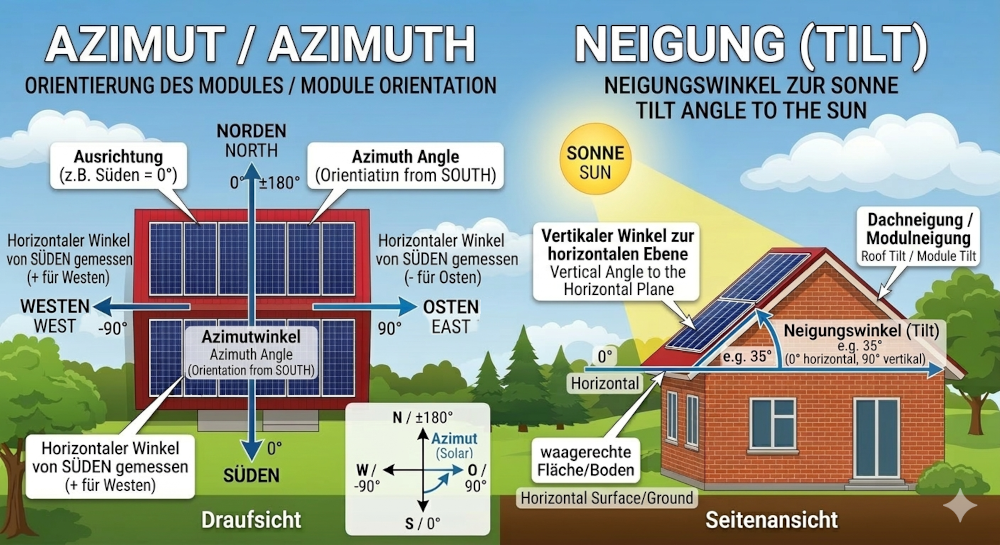

# IoBroker.open-meteo-weather

## Wichtige Informationen:
Open Meteo Weather und Open Meteo PV Forecast wurden in diesen Adapter integriert. Open Meteo PV Forecast wird nicht mehr weiterentwickelt.

---

**Dieser Adapter verwendet Sentry-Bibliotheken, um Ausnahmen und Codefehler automatisch an die Entwickler zu melden.** Weitere Informationen und Anweisungen zum Deaktivieren der Fehlerberichterstattung finden Sie in Abschnitt [Sentry-Plugin-Dokumentation](https://github.com/ioBroker/plugin-sentry#plugin-sentry)! Die Verwendung der Sentry-Berichterstattung beginnt mit js-controller 3.0.

Ich nutze meinen eigenen Sentry-Server, der auf Glitchtip basiert.

**Der Open-Meteo Wetter- und PV-Vorhersagedienst-Adapter für ioBroker.**

Dieser Adapter liefert präzise Wetterdaten, Vorhersagen, Informationen zur Luftqualität sowie Pollen- und Photovoltaik-Vorhersagen (bereitgestellt von [Open-Meteo.com](https://open-meteo.com/)). Er ist für nicht-kommerzielle Zwecke (bis zu 10.000 API-Aufrufe pro Tag) kostenlos und erfordert keine API-Schlüsselregistrierung, wodurch die Einrichtung extrem einfach ist.

---

## Wettermerkmale
* **Aktuelle Wetterdaten:** Echtzeit-Abruf von Temperatur-, Feuchtigkeits-, Luftdruck- und Winddaten.
* **Flexible Prognosen:** Konfigurierbare Anzahl an Prognosetagen und stündliche Auflösung.
* **Luftqualität & Pollen:** Optionale Daten zu Feinstaub (PM2,5, PM10) sowie zu verschiedenen Pollenarten (Erle, Birke, Gras usw.).
* **Automatische Bereinigung:** Der Adapter bereinigt die Objektstruktur automatisch, wenn Prognosezeiträume verkürzt oder in der Konfiguration geändert werden.
* **Mehrsprachige Unterstützung:** Unterstützt 11 Sprachen (darunter Englisch, Deutsch, Polnisch, Russisch, Französisch, Chinesisch usw.).
* **Einheitensystem:** Nahtloses Umschalten zwischen metrischen (°C, km/h) und imperialen (°F, mph) Einheiten.
* **Mehrere Standorte:** Fügen Sie mehrere Standorte hinzu.
* **Nacht-Icons:** Sie können zwischen zwei Nacht-Icon-Sets wählen: „Hell“ und „Dunkel“. Dadurch lässt sich das Icon leichter an Ihren Hintergrund anpassen.

### Windrichtungssymbole
In den Adaptereinstellungen können Sie zwischen zwei verschiedenen Visualisierungsstilen für die Windrichtung wählen:

* Windrichtung (wohin der Wind weht): Dies ist die Standardeinstellung. Der Pfeil zeigt in die Richtung, aus der der Wind kommt. (Beispiel: Bei Nordwind zeigt der Pfeil nach Süden).

* Windursprung (woher der Wind kommt): Dieser Stil verwendet Symbole aus dem Unterordner direct_2. Der Pfeil zeigt die Windquelle an. (Beispiel: Ein Nordwind wird durch einen nach Norden zeigenden Pfeil oder ein spezifisches „Ursprungs“-Symbol dargestellt).

|Einstellungen | Symbolpfad | Verhalten |
|:---|:---|:---|
|Windrichtung (wohin der Wind weht) | /icons/wind_direction_icons/*.png | Zeigt zum Ziel |
|Windursprung (woher der Wind kommt) |/icons/wind_direction_icons/direct_2/*.png | Zeigt zum Ursprung |

### Luftqualitätsdaten
Der Adapter liefert aktuelle Luftqualitätsdaten und eine tägliche Vorhersage für die kommenden Tage (konfigurierbar für 1, 3 oder 6 Tage).

Effiziente Datenverarbeitung: Während die Open-Meteo-API lediglich stündliche Rohdaten liefert, aggregiert dieser Adapter diese Werte intelligent. Er berechnet automatisch die Tageshöchstwerte für alle Schadstoffe und Pollenkonzentrationen. So erhalten Sie die relevantesten Daten (Spitzenwerte der Belastung), ohne Ihre Datenbank mit Hunderten von stündlichen Datenpunkten zu überladen.

Merkmale:

* Tägliche Spitzenwerte: Erhalten Sie den höchsten erwarteten Wert für PM2,5, PM10, Ozon und verschiedene Pollenarten.

* Für Menschen lesbar: Die Pollenkonzentrationen werden automatisch beschreibenden Kategorien zugeordnet (z. B. „Keine“, „Niedrig“, „Mittel“, „Hoch“).

* Intelligente Bereinigung: Objekte für Vorhersagetage werden automatisch anhand Ihrer Einstellungen erstellt oder entfernt, um Ihre Objektstruktur übersichtlich zu halten.

---

## Konfiguration
Konfigurieren Sie nach der Installation die folgenden Felder in den Instanzeinstellungen:

1. **Ort:** Geben Sie hier Ihren Standort oder einen gewünschten Namen ein.
2. **Koordinaten (Breitengrad & Längengrad):** Geben Sie Ihre Koordinaten ein. Sie finden diese, indem Sie auf die Schaltfläche „Koordinaten mit OpenStreetMap finden“ klicken, oder lassen Sie die Felder leer, um die Systemkoordinaten zu verwenden.
3. **Zeitzone:** Stellen Sie die Zeitzone im Dropdown-Menü ein. Standardmäßig ist die Option „Auto“ ausgewählt, die sich automatisch an Ihre Koordinaten anpasst.
4. **Aktualisierungsintervall:** Zeitintervall in Minuten (Standard: 30 min).
5. **Vorhersagetage:** Anzahl der Tage für die tägliche Übersicht (0–16 Tage).
6. **Stündliche Vorhersage:** Aktivieren oder deaktivieren Sie diese Option und legen Sie die Anzahl der Stunden fest (z. B. die nächsten 24 Stunden). Beispielsweise ist Stunde 0 die aktuelle Stunde, Stunde 1 die nächste Stunde usw.
7. **Optionale Daten:** Kontrollkästchen für Pollen- und Luftqualitätsdaten.
8. **Einheiten:** Wählen Sie zwischen metrischen und imperialen Einheiten.

---

## Wetter-Widget
Dieser Adapter bietet zwei Möglichkeiten zur Darstellung von Wetterdaten in Ihrer Visualisierung:

### 1. Integriertes Widget (Standard)
Seit Version **3.1.0** kann der Adapter automatisch ein vorkonfiguriertes HTML-Widget für jeden Standort generieren.

**Anwendungshinweise:**

1. **Aktivieren:** Aktivieren Sie das Kontrollkästchen "Widget erstellen" in den Instanzeinstellungen für Ihren Standort.
2. **Status finden:** Der Adapter erstellt einen Status namens `htmlWidget` (unter `open-meteo-weather.0.yourLocation.htmlWidget`).
3. **In VIS/VIS2:** * Ziehen Sie ein Standard-**"HTML"-Widget** in Ihre Ansicht.
* Setzen Sie die "HTML"-Eigenschaft dieses Widgets auf die Bindung Ihres Zustands: `{open-meteo-weather.0.yourLocation.htmlWidget}`.
* Passen Sie die Breite und Höhe des Widget-Containers an den Inhalt an.

**Anpassung:** In der Adapterkonfiguration können Sie nur grundlegende Einstellungen wie Schriftgrößen, Vorhersagestunden und -tage direkt anpassen.

**Ideal für:** Anwender, die ein schnelles, ansprechendes und wartungsfreies Display wünschen.

**Hinweis:** Für eine optimale Darstellung in Desktop-Browsern sollten Sie in den VIS-Editor-Einstellungen keine zusätzlichen CSS-Rahmen oder Schatten verwenden. Das Widget verfügt über ein eigenes, optimiertes Styling.

### 2. Erweitertes Widget-Skript (Vollständige Anpassungsmöglichkeiten)
Wenn Sie tiefgreifende Änderungen am Design vornehmen möchten, fügen Sie Ihr eigenes CSS hinzu oder erweitern Sie die Logik:

* **Link:** Verwenden Sie das [VIS2-widget-script-om-weather](https://github.com/H5N1v2/VIS2-widget-script-om-weather).
* **Ideal für:** Fortgeschrittene Benutzer, die die volle Kontrolle über jedes HTML-Tag und jede CSS-Eigenschaft wünschen.

---

## Symbole & Visualisierung
Der Adapter stellt dynamische Symbolpfade bereit, die direkt in Visualisierungen wie **vis, iQontrol oder Jarvis** verwendet werden können.

* **Wettersymbole:** Zu finden unter `weather.current.icon_url`. Der Adapter unterscheidet automatisch zwischen Tag und Nacht (z. B. Sonne vs. Mond).
* **Windrichtung:** Statische Pfade unter `wind_direction_icon` zeigen einen Kompasspfeil entsprechend dem Gradwert an (Anzeigerichtung wählbar).
* **Warnung vor Windböen:** Bei Windgeschwindigkeiten über ca. 39 km/h (Bft 6) wird unter `wind_gust_icon` ein Warnsymbol angezeigt, das in Stufen von 0 bis 4 unterteilt ist.
* **Mondphasen-Symbole:** Unter `moon_phase_icon` finden Sie Mond-Symbole, die die Mondphasen anzeigen.
* **Mehrere Symbole:** Sie können zwischen statischen und animierten Symbolen (von [basmilius](https://github.com/basmilius/meteocons)) wählen.

---

## Datenpunkte (Auszug)
| Ordner | Beschreibung |
|:---|:---|
| `air.current` | Luftqualität und Pollenbelastung als Text und Wert |
| `weather.current` | Aktuelle Messwerte (Temperatur, Taupunkt, Wind usw.) |
| `weather.forecast.dayX` | Tagesvorhersage für Tag X |
| `weather.forecast.hourly.hourX` | Stündliche Details pro voller Stunde |
| `info.lastUpdate_weather` | Zeigt Datum und Uhrzeit der letzten Wetteraktualisierung an |
| `info.lastUpdate_weather` | Zeigt Datum und Uhrzeit der letzten Wetteraktualisierung an |

---

#### Wenn Sie keine Wettervorhersagen benötigen, lassen Sie das Feld „Ort“ leer. Es werden dann keine Bundesländer eingetragen.

--- ---
## Funktionen PV-Prognose (falls aktiviert)
* **Mehrere Standorte:** Unterstützung für mehrere PV-Systeme/Standorte, z. B. für Ost-/West-Ausrichtung.
* **Stündliche Vorhersage:** Detaillierte Vorhersage von Stromerzeugung, Temperatur, Bewölkung und Sonnenscheindauer.
* **Tagesprognose:** Zusammenfassung des erwarteten Energieverbrauchs (Wh) für bis zu 14 Tage.
* **15-Minuten-Vorhersage:** 15-Minuten-Vorhersage für den aktuellen Tag, 24 Stunden.
* **Physikalische Simulation:**
* **Neigung & Azimut:** Berechnung der Bestrahlungsstärke basierend auf der Paneelausrichtung.
* **PV-Modultemperatur:** Schätzung der Zelltemperatur unter Berücksichtigung der Umgebungstemperatur, der Strahlungsintensität und der Windgeschwindigkeit (Faiman-Modell).
* **Sonnenscheindauer:** Umrechnung der Sonnenscheindauer in Minuten pro Stunde.
* **Aggregation:** Automatische Summierung aller Standorte (Gesamtprognose) auf täglicher, stündlicher und 15-Minuten-Basis.
* **Systemintegration:** Automatische Erfassung der Standortkoordinaten aus der ioBroker-Systemkonfiguration, sofern diese nicht manuell festgelegt wurden.
* **PV-Modultemperatur:** Geschätzte PV-Modultemperatur basierend auf dem Faiman-Modell.

---

## Datenpunkte (Objekte)
Für jeden konfigurierten Standort wird ein Kanal mit den folgenden Datenpunkten erstellt:

| Ordner | Beschreibung |
| `pv-forecast` | Ordner für PV-Prognosedaten |
| `pv-forecast` | Ordner für PV-Vorhersagedaten |

### 15-Minuten-Vorhersage (`15-min-forecast.0 - 95`), (24 Stunden des aktuellen Tages), falls aktiviert
| Datenpunkt | Einheit | Beschreibung |
| `global_tilted_irradiance` | Wh | Erwartete Energie basierend auf der installierten Leistung (kWp). |
| `pv_temperature` | °C | Geschätzte PV-Modultemperatur (Faiman-Berechnung). |
| `temperature_2m` | °C | Lufttemperatur in 2 Metern Höhe. |
| `time` | - | Vorhersagezeit (HH:mm). |
| `wind_speed_10m` | km/h | Windgeschwindigkeit in 10 Metern Höhe. |
| `wind_speed_10m` | km/h | Windgeschwindigkeit in 10 Metern Höhe. |

Hinweis: Zur Berechnung der PV-Modultemperatur werden temperature_2m und wind_spread_10m benötigt.

Bei Bedarf optional auswählbar, ansonsten sind die DP in den Wetterdaten enthalten.

| Datenpunkt | Einheit | Beschreibung |
| `cloud_cover` | % | Gesamtbewölkung in Prozent. |
| `sunshine_duration` | min | Tatsächliche Sonnenscheindauer in Minuten innerhalb dieser Stunde. |
| `sunshine_duration` | min | Tatsächliche Sonnenscheindauer in Minuten innerhalb dieser Stunde. |

### Tagesvorhersage (`daily-forecast.dayX`)
| Datenpunkt | Einheit | Beschreibung |
| `Date` | - | Vorhersagedatum (TT.MM.JJJJ). |
| `Peak_day` | Wh | Erwarteter Gesamttagesertrag. |
| `Peak_day` | Wh | Erwarteter Tagesgesamtertrag. |

### Prognose-JSON (`location_folder`), falls aktiviert
| Datenpunkt | Einheit | Beschreibung |
| `15-min-json_chart` | - | JSON 15-min |
| `hourly-json_chart` | - | JSON stündlich |
| `hourly-json_chart` | - | JSON stündlich |

### Stündliche Vorhersage (`hourly-forecast.hourX`)
| Datenpunkt | Einheit | Beschreibung |
| `time` | - | Vorhersagezeit (HH:mm). |
| `global_tilted_irradiance` | Wh | Erwartete Energie basierend auf der installierten Leistung (kWp). |
| `pv_temperature` | °C | Geschätzte PV-Modultemperatur (Faiman-Berechnung). |
| `temperature_2m` | °C | Lufttemperatur in 2 Metern Höhe. |
| `wind_speed_10m` | km/h | Windgeschwindigkeit in 10 Metern Höhe. |
| `wind_speed_10m` | km/h | Windgeschwindigkeit in 10 Metern Höhe. |

Hinweis: Zur Berechnung der PV-Modultemperatur werden temperature_2m und wind_spread_10m benötigt.

Bei Bedarf optional auswählbar, ansonsten sind die DP in den Wetterdaten enthalten.

| Datenpunkt | Einheit | Beschreibung |
| `cloud_cover` | % | Gesamtbewölkung in Prozent. |
| `sunshine_duration` | min | Tatsächliche Sonnenscheindauer in Minuten innerhalb dieser Stunde. |
| `sunshine_duration` | min | Tatsächliche Sonnenscheindauer in Minuten innerhalb dieser Stunde. |

### Sum_peak_locations_15_Minutly (`0-95`) if enabled
| Datenpunkt | Einheit | Beschreibung |
| `sum_locations` | Wh | Summe der Standorte alle 15 Minuten |
| `time` | - | Vorhersagezeit (HH:mm). |
| `time` | - | Vorhersagezeit (HH:mm). |

### Sum_peak_locations_Daily (`dayX`) falls aktiviert
| Datenpunkt | Einheit | Beschreibung |
| `sum_locations` | Wh | Summe der Standorte täglich |
| `sum_locations` | Wh | Summe der Standorte täglich |

### Sum_peak_locations_Hourly (`HourX`) falls aktiviert
| Datenpunkt | Einheit | Beschreibung |
| `sum_locations` | Wh | Summe der Standorte stündlich |
| `time` | - | Vorhersagezeit (HH:mm). |
| `time` | - | Vorhersagezeit (HH:mm). |

### JSON-Datenpunkte, falls aktiviert
| Datenpunkt | Einheit | Beschreibung |
|:---|:---|:---|
| `sum_peak_15-min-json_chart` | - | Summe der Standorte 15 min in JSON |
| `sum_peak_hourly-json_chart` | - | Summe der Standorte stündlich in JSON |

---

## Konfiguration
### Grundeinstellungen
* **Vorhersagezeitraum:** Zeitraum für die stündliche Ansicht (3 bis 48 Stunden).
* **Vorhersagetage:** Dauer der täglichen Vorhersage (3 bis 14 Tage).
* **Aktualisierungsintervall:** Häufigkeit der Datenaktualisierungen (15, 30, 60 Minuten oder einmal vor Sonnenaufgang).

### Datenpunkteinstellungen
* **Gleitende oder feste Stunden:** Bei Auswahl von „Gleitende Stunden“ zeigt die stündliche Vorhersage immer die nächsten Stunden ab der aktuellen Stunde an. Bei Auswahl von „Feste Stunden“ zeigt die stündliche Vorhersage feste Zeitintervalle (z. B. 00:00–23:00 Uhr) unabhängig von der aktuellen Uhrzeit an.
* **15-Minuten-Vorhersage:** Falls aktiviert, werden zusätzliche Bundesstaaten für eine 15-Minuten-Vorhersage erstellt (bis zu 24 Stunden für den aktuellen Tag). Bitte beachten Sie, dass die Verfügbarkeit der 15-Minuten-Daten von der Open-Meteo-API abhängt und je nach Standort und Uhrzeit variieren kann.

### Standorte (Tabelle)
Für jeden Standort müssen folgende Werte definiert werden:

1. **Name:** Eindeutiger Bezeichner (bereinigt um die Objekt-ID).
2. **Breitengrad/Längengrad:** GPS-Position (optional; andernfalls werden die Systemwerte verwendet).
3. **Neigung:** Winkel der Module (0° = flach, 90° = vertikal).
4. **Azimut:** Ausrichtung (-180° bis 180°, 0° = Süd, -90° = Ost, 90° = West).
5. **Leistung (kWp):** Installierte Spitzenleistung des Systems.
6. **Zeitzone:** Auswahl der lokalen Zeitzone (Standard: Auto).

### Globale Optionen, nur anpassbar, wenn Sie mehrere Standorte haben!
* **Gesamtsumme (täglich):** Erstellt den Kanal `sum_peak_locations_Daily`, der die Erträge aller Systeme summiert.
* **Gesamtsumme (stündlich):** Erstellt den Kanal `sum_peak_locations_Hourly` für die stündliche Gesamtleistung.
* **Gesamtsumme (15-Minuten-Takt):** Erstellt den Kanal `sum_peak_locations_15_Minutely` für die Gesamtvorhersage über 15 Minuten.

---

## Technische Details & Berechnung
### PV-Temperaturmodell
Der Adapter verwendet das **Faiman-Modell** zur Schätzung der Modultemperatur. Dieses Modell berücksichtigt die Windkühlung, die sich direkt auf den Wirkungsgrad auswirkt: `pvTemp = Ambient Temperature + Irradiance / (25 + 6.84 * Wind Speed)`.

---

## Aktualisierungshinweis
Nach einem neuen Adapter-Update wird empfohlen, den gesamten Verzeichnisbaum zu löschen und ihn neu erstellen zu lassen.

## Älteres Änderungsprotokoll
[ÄLTERES ÄNDERUNGSPROTOKOLL](CHANGELOG_OLD.md)

## Rechtliches & Urheberrecht
### Symbole & Bilder
Animierte Wettersymbole von [Bas Milius](https://github.com/basmilius/meteocons)

Die in diesem Adapter enthaltenen statischen Wetter- und Windrichtungssymbole unterliegen dem Urheberrecht des Urhebers.

* **Nutzung:** Diese Icons sind für die Verwendung innerhalb von ioBroker lizenziert. Kommerzielle Weiterverbreitung oder Verwendung außerhalb dieses Adapters bedarf der ausdrücklichen Zustimmung des Autors: h5n1@iknox.de.
* **Wetterdaten:** Alle Wetterdaten werden von [Open-Meteo.com](https://open-meteo.com/) bereitgestellt. Bitte beachten Sie deren Nutzungsbedingungen für kommerzielle Zwecke.

## Changelog
### **WORK IN PROGRESS**
* (@GermanBluefox) upscaled the logo
* (@GermanBluefox) Updated TS to 6
* (@GermanBluefox) Corrected image in JsonConfig

### 3.1.3 (2026-06-20)
* (H5N1v2) Fixed an issue with object creation caused by an accidental change.

### 3.1.2 (2026-06-20)
* (mcuiobroker) fix: after adapter update, automatically adjust type and role if they have been changed in new versions.
* (H5N1v2) Update dependencies

### 3.1.1 (2026-06-10)
* (pk68) fix: `info.lastUpdate_weather`, `info.lastUpdate_PV_Forecast` and `hourly.next_hours.hour*.date` now store a Unix timestamp (`value.time`) instead of a formatted string, preventing incorrect date parsing by ioBroker.
* (H5N1v2) Update dependencies
* (H5N1v2) fix: [W5612] Remove unused custom actions configuration from jsonConfig
* (H5N1v2) fix: [W5063] JSON formatting in "admin/jsonConfig.json" is hard to read (mixed indentation).
* (H5N1v2) fix type assertion for channel name
* (H5N1v2) fix some things in README.md

### 3.1.0 (2026-05-03)
* (H5N1v2) Changed update routine for weather and PV forecast to fixed fetch times.
* (H5N1v2) Added a customizable HTML weather widget in the admin area.
* (H5N1v2) Adaptation for version jumps from older configurations.
* (H5N1v2) Description added to the admin area.
* (H5N1v2) Readme updated in widget section.
* (H5N1v2) Adapter internal widget adapted, hazards are highlighted in color (currently only in the internal adapter widget).
* (copilot) Adapter requires node.js >= 22 now.
* (H5N1v2) Update axios to v.1.16.0.

### 3.0.1 (2026-04-25)
* (H5N1) update dependencies
* (H5N1) improve error handling in API calls with detailed messages
* (H5N1) fix: attribute in jsonConfig.
* (Negalein) fix: yellow help text in admin for pv-forecast extra dp's, poor recognition on white background
* (H5N1v2) fix: update interval for pv-forecast "once before sunrise" time incorrectly calculated

## License
This project is licensed under the **MIT License** - see the `LICENSE` file for details.

Copyright (c) 2026 H5N1v2 <h5n1@iknox.de>