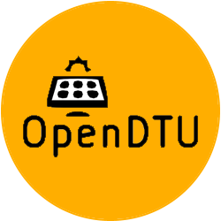

# ioBroker.opendtu

## OpenDTU-Adapter für ioBroker

Dieser Adapter empfängt die Datenpunkte aus dem Projekt [OpenDTU](https://github.com/tbnobody/OpenDTU) in Echtzeit.\
&#x20;Darüber hinaus können über den Adapter die folgenden Datenpunkte genutzt werden, um die Leistungsbegrenzung von OpenDTU zu steuern.

```
- opendtu.0.xxxxxx.power_control.limit_nonpersistent_absolute
- opendtu.0.xxxxxx.power_control.limit_nonpersistent_relative
- opendtu.0.xxxxxx.power_control.limit_persistent_absolute
- opendtu.0.xxxxxx.power_control.limit_persistent_relative  
```

Weitere Informationen zu den Datenpunkten finden Sie in deren Beschreibung oder [hier](https://github.com/tbnobody/OpenDTU/blob/master/docs/MQTT_Topics.md#inverter-limit-specific-topics) .

## Credits

Dieser Adapter wäre ohne die großartige Arbeit von @o0Shojo0o ( <https://github.com/o0Shojo0o> ) nicht möglich gewesen, der frühere Versionen dieses Adapters entwickelt hat.

## Wie man Probleme und Funktionswünsche meldet

Idealerweise verwenden Sie hierfür GitHub-Issues. Die beste Methode hierfür ist, den Adapter in den Debug-Log-Modus zu versetzen (Instanzen → Expertenmodus → Spaltenprotokollierungsstufe). Laden Sie anschließend die Logdatei von der Festplatte über das ioBroker-Unterverzeichnis „log“ herunter, **nicht** über die Administrationsoberfläche, da dort Zeilen abgeschnitten werden.

## Konfiguration

1. Erstellen Sie eine neue Instanz des Adapters.
2. Geben Sie die Sicherheitseinstellungen _(Standard: http)_ , die IP-Adresse und den Port _(Standard: 80)_ der [OpenDTU](https://github.com/tbnobody/OpenDTU) -Hardware ein.
3. Legen Sie das WebUI-Passwort fest **(dies ist obligatorisch, wenn es falsch ist, kann kein Limit festgelegt werden!).**
4. Einstellungen speichern

## Changelog
<!--
	Placeholder for the next version (at the beginning of the line):
	### **WORK IN PROGRESS**
-->

### **WORK IN PROGRESS**
- (copilot) Adapter requires admin >= 7.7.22 now
- (copilot) Adapter requires js-controller >= 6.0.11 now
- (copilot) Adapter requires admin >= 7.6.17 now

### 3.1.0 (2024-12-02)
- (mattreim) Variable polling interval has been removed and polling intervals hev been increased.
- (mattreim) Description has been translated into supported languages.
- (mattreim) Admin-UI has been adapted for some display sizes.
- (mcm1957) Dependencies have been updated.

### 3.0.1 (2024-10-26)
- (simatec) Admin-UI has been adapted for small displays.
- (mcm1957) Dependencies have been updated.

### 3.0.0 (2024-10-19)
- (mcm1957) Adapter has been moved to iobroker-community-adapter organisation.
- (mcm1957) Adapter requires js-controller 5, admin 6 and node.js 20 now.
- (mcm1957) Dependencies have been updated.

### 2.1.0 (2024-10-11)

- (o0shojo0o) update dependencies
- (mattreim) support small screens
- (mattreim) update translations
- (mattreim) update object names
- (mattreim) add variable polling intervall [1-59s]

### 2.0.0 (2024-08-13)

- (o0shojo0o) changes for new websocket structure ([#129](https://github.com/o0shojo0o/ioBroker.opendtu/issues/129))
- (o0shojo0o) `Efficiency`, `YieldTotal`, `YieldDay` and `DC Power` moved from the AC section to the INV (old data points must be removed manually)
- (mattreim) update to current OpenDTU logo ([#156](https://github.com/o0shojo0o/ioBroker.opendtu/issues/156))
- (mattreim) update dependencies ([#162](https://github.com/o0shojo0o/ioBroker.opendtu/issues/162)), ([#179](https://github.com/o0shojo0o/ioBroker.opendtu/issues/179))
- (mattreim) fix GUI translation ([#163](https://github.com/o0shojo0o/ioBroker.opendtu/issues/163))

[Older changelogs can be found there](https://github.com/iobroker-community-adapters/ioBroker.opendtu/blob/main/CHANGELOG_OLD.md)

## License
MIT License


Copyright (c) 2026 iobroker-community-adapters <iobroker-community-adapters@gmx.de>  
Copyright (c) 2024 ioBroker Community Developers <iobroker-community-adapters@gmx.de>  
Copyright (c) 2024 Dennis Rathjen <dennis.rathjen@outlook.de>

Permission is hereby granted, free of charge, to any person obtaining a copy
of this software and associated documentation files (the "Software"), to deal
in the Software without restriction, including without limitation the rights
to use, copy, modify, merge, publish, distribute, sublicense, and/or sell
copies of the Software, and to permit persons to whom the Software is
furnished to do so, subject to the following conditions:

The above copyright notice and this permission notice shall be included in all
copies or substantial portions of the Software.

THE SOFTWARE IS PROVIDED "AS IS", WITHOUT WARRANTY OF ANY KIND, EXPRESS OR
IMPLIED, INCLUDING BUT NOT LIMITED TO THE WARRANTIES OF MERCHANTABILITY,
FITNESS FOR A PARTICULAR PURPOSE AND NONINFRINGEMENT. IN NO EVENT SHALL THE
AUTHORS OR COPYRIGHT HOLDERS BE LIABLE FOR ANY CLAIM, DAMAGES OR OTHER
LIABILITY, WHETHER IN AN ACTION OF CONTRACT, TORT OR OTHERWISE, ARISING FROM,
OUT OF OR IN CONNECTION WITH THE SOFTWARE OR THE USE OR OTHER DEALINGS IN THE
SOFTWARE.