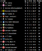
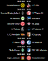
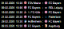
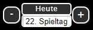
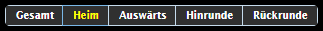

# IoBroker-Adapter zum Abrufen von Fußballspielergebnissen aus OpenLigaDB
## Übersicht
Adapter zum Anfordern von Spieldaten für Fußball oder andere Spiele vom Typ `openligadb.de`

## Konfiguration
Fügen Sie eine Instanz des Adapters hinzu und klicken Sie auf das Schraubenschlüssel-Symbol. Im Formular können Sie die Verknüpfung zu einer Liga und einer Saison hinzufügen.
Eine Liste der verfügbaren Ligen, Saisons und Verknüpfungen finden Sie unter `openligadb.de`. Falls sich eine Saison über zwei Jahre erstreckt, geben Sie bitte nur das Startjahr an.

Beispieldaten für 1. Deutsche Bundliga sind `shortcut = bl1 season = 2023`

Wenn Sie die Konfiguration gespeichert und geschlossen haben, sollten kurze Zeit später neue Datenpunkte für Ihre Liga und Saison verfügbar sein.

## Widgets
Es stehen 5 Widgets zur Verfügung. Bitte geben Sie „openligadb“ im Widget-Filter ein.

### Tabelle 4


Dies ist die klassische Tabellenansicht. Die Tabelle enthält mehrere Spalten.

- MP = Anzahl der gespielten Spiele
- W = Siege
- D = Zeichnen
- L = Verluste
- Tore = Tordifferenz
- Punkte = Aktuelle Punktzahl
- T = Trend

#### Attributtabelle
| Attribute | Gruppe | Beschreibung |
| ----------------------------------- | --------------------- | ------------------------------------------------------------------------------------------------------------------------------------------------------------------------------------------------------------------------------------------------------------------------------------------------------------------------------------------ |
| alle Spiele | | Wählen Sie den Datenpunkt `allmatches` aus. (Hinweis: Im alten Widget wurde stattdessen `table` verwendet.) Dieser Datenpunkt wird während der Konfiguration erstellt, nachdem eine Liga/Saison erfolgreich eingerichtet wurde. Er enthält alle Spieldaten der ausgewählten Liga/Saison im JSON-Format. Alle Tabellenansichten (Modi) werden aus diesem Datensatz abgeleitet. |
| Modus | | Definiert den Tabellenansichtsmodus. Verfügbare Optionen: Gesamt (`1total`), Heim (`2home`), Auswärts (`3away`), Erste Halbzeit (`4round1`), Zweite Halbzeit (`5round2`). |
| mode_binding | | Alternative zu `mode`, vorgesehen für die dynamische Steuerung über Bindung. Akzeptiert die gleichen Werte wie `mode`. Wenn ein gültiger Wert angegeben wird, überschreibt dieser das Attribut `mode`. Normalerweise kann dieses Feld leer bleiben. |
| mode_binding | | Alternative zu `mode`, vorgesehen für die dynamische Steuerung über Bindung. Akzeptiert die gleichen Werte wie `mode`. Wenn ein gültiger Wert angegeben wird, überschreibt dieser das Attribut `mode`. Normalerweise kann dieses Feld leer bleiben. |
| maxicon | | Maximale Größe des Team-Icons (gilt für Breite und Höhe). |
| Kurzname | | Zeigt den Kurznamen des Teams anstelle des vollständigen Teamnamens an, sofern dieser im Datensatz verfügbar ist. |
| highlight | | Hebt Teams hervor, deren Namen mit den angegebenen Begriffen übereinstimmen. Mehrere Begriffe können durch Semikolons getrennt werden (`;`). Treffer werden in `<b>`-Tags eingeschlossen. Zusätzliche Formatierungen können über die CSS-Klasse `favorite` oder durch die Definition benutzerdefinierter Klassen pro Hervorhebung angewendet werden (siehe entsprechenden Dokumentationsabschnitt). |
| Filter | | Filtert die Tabelle nach Teamnamen. Mehrere Filterbegriffe können durch Semikolons getrennt werden (`;`). |
| Filter | | Filtert die Tabelle nach Teamnamen. Mehrere Filterbegriffe können durch Semikolons (`;`) getrennt werden. |
| iconup,icondn,iconst | Attributgruppensymbole | Definiert benutzerdefinierte Symbole für Trendindikatoren (aufwärts, abwärts, stabil). |
| lastgamecount in der Attributgruppe | Erweiterte Einstellungen | Beschränkt die Tabellenberechnung auf eine bestimmte Anzahl der letzten Spieltage relativ zum angezeigten Spieltag (`currgameday` oder `showgameday`). Beispiel: `showgameday` = 10 und `lastgamecount` = 5 → nur die Spieltage 6–10 werden berücksichtigt. |
| lastgamecount in der Attributgruppe | Erweiterte Einstellungen | Beschränkt die Tabellenberechnung auf eine bestimmte Anzahl der letzten Spieltage relativ zum angezeigten Spieltag (`currgameday` oder `showgameday`). Beispiel: `showgameday` = 10 und `lastgamecount` = 5 → nur die Spieltage 6–10 werden berücksichtigt. |

### Spiele des Spieltags v2


Dieses Widget zeigt den Spieltag an. Je nach Einstellungen kann es entweder immer den aktuellen Spieltag, den Spieltag relativ zum aktuellen Spieltag oder einen bestimmten Spieltag anzeigen.

Des Weiteren lässt sich die Anzahl der angezeigten Spieltage festlegen.
Bestimmte Darstellungselemente sind mit **CSS-Klassen** versehen, für die anschließend ein gewünschtes Format definiert werden kann.

| CSS-Klasse | Betrifft welches Element | Hinweise |
| --------------- | --------------------------- | ------------------------------------------------------------------------------------------------------------------------------------------------------- |
| Favorit | Spieltagsüberschrift (Datum/Uhrzeit) | Ermöglicht die Formatierung von Datum und Uhrzeit, wenn die Lieblingsmannschaft an diesem Spieltag spielt. Kann optional mit der CSS-Klasse `todaygameheader` kombiniert werden. |
| Favorit | Teamname | Ermöglicht die benutzerdefinierte Formatierung des Teamnamens. |
| heutiges Spiel | Gesamte Spielzeile | Wird angewendet, wenn das Spiel am aktuellen Tag stattfindet. |
| todaygameheader | Spieltagsüberschrift (Datum/Uhrzeit) | Wird angewendet, wenn das Spieltagsdatum dem aktuellen Tag entspricht. |

#### Beispiele für CSS-Klassen
##### Beispiel: Anzeigekopfzeile für einen Spieltag (Allgemeines Datum)
```css
.oldb-tt tr.favorite {
    color: yellow;
}
```

##### Beispiel-Teamname
```css
.oldb-tt b.favorite {
    color: blue;
}
```

##### Beispiel einer Spielzeile
```css
.oldb-tt .todaygame {
    color: red;
}
```

##### Beispiel für eine Anzeigeüberschrift an einem Spieltag (heutiges Datum)
```css
.oldb-tt .todaygameheader {
    color: lightgreen;
}
```

#### Attribut Spiel der Spieltage
| Attribut | Gruppe | Beschreibung |
| ---------------- | ----------------- | ------------------------------------------------------------------------------------------------------------------------------------------------------------------------------------------------------------------------------------------------------------------------------------------------------------------------------------------------------------------------ |
| allmatches | | Hier muss ein Datenpunkt mit dem Namen **allmatches** ausgewählt werden. Dieser Datenpunkt wird nach der Konfiguration der Liga/Saison erstellt, sofern die Konfiguration gültig ist. Er enthält alle Spiele und Ergebnisse einer Liga/Saison im JSON-Format. Findet ein Spieltag heute statt, werden dem Datum (**todaygameheader**) und dem entsprechenden Spiel (**todaygame**) CSS-Klassen zugewiesen. |
| currgameday | | Hier muss ein Datenpunkt mit dem Namen **currgameday** ausgewählt werden. Dieser Datenpunkt wird nach der Konfiguration der Liga/Saison erstellt, sofern die Konfiguration gültig ist. Sein Wert wird vom Adapter anhand des aktuellen Datums berechnet. Der aktuelle Spieltag wechselt genau in der Mitte zwischen dem letzten Spiel des vorherigen Spieltags und dem ersten Spiel des nächsten Spieltags. |
| maxicon | | Maximale Größe des Team-Icons in x- oder y-Richtung. |
| Kurzname | | Zeigt den Kurznamen anstelle des Teamnamens an, sofern dieser in den bereitgestellten Daten verfügbar ist. |
| showgoals | | Zeigt Informationen über Torschützen an. |
| hervorheben | | Hier können ein oder mehrere durch Semikolons (;) getrennte Begriffe eingegeben werden, die hervorgehoben werden sollen. Die Suche beschränkt sich auf Teamnamen. Treffer werden in HTML-Tags `<b>` eingeschlossen. Eine detailliertere Formatierung ist über die CSS-Klasse **"favorite"** möglich. Zusätzlich kann für jede Hervorhebung eine benutzerdefinierte CSS-Klasse definiert werden. Siehe Kapitel „todo“. |
| Spieltag anzeigen | Erweiterte Einstellungen | Wenn dieses Feld leer ist, wird immer der aktuelle Spieltag angezeigt. Bei Eingabe einer positiven Zahl wird der angegebene Spieltag angezeigt (sofern verfügbar). Bei Eingabe einer negativen Zahl wird der Spieltag relativ zum aktuellen angezeigt (z. B. entspricht -1 dem vorherigen Spieltag). |
| showgamedaycount | Erweiterte Einstellungen | Normalerweise bleibt dieses Feld leer oder enthält 1, was bedeutet, dass genau ein Spieltag angezeigt wird. Wenn eine andere Zahl eingegeben wird, wird diese Anzahl an Spieltagen angezeigt, beginnend mit der in **showgameday** definierten Einstellung. |
| Wochentag anzeigen | Erweiterte Einstellungen | Zeigt optional den Wochentag vor dem Datum an. |

##### Beispiele
###### Beispiele für die Bindung im Attribut showgameday
Dieses Feld kann bei Bedarf auch mithilfe von Vis-Binding berechnet und befüllt werden.
Beispiele für einen relativ berechneten Spieltag: |

```text
    Previous matchday
    {a:openligadb.0.bl1.2019.currgameday;a-1} or
    Next matchday
    {a:openligadb.0.bl1.2019.currgameday;a+1}
```

Da die Bindung im vis-Bearbeitungsmodus nicht berechnet wird,

Bei Verwendung der Bindung im Bearbeitungsmodus wird immer der aktuelle Spieltag angezeigt.

### Spiele der Lieblingsvereine 2
 Dieses Widget zeigt die anstehenden Spiele Ihrer Lieblingsmannschaften aus einer oder mehreren Ligen an. Durch Auswahl der Anzahl der anzuzeigenden Ligen wird für jede Liga eine separate Konfigurationsgruppe angezeigt, in der die folgenden Einstellungen vorgenommen werden können.

Wenn das Spiel heute stattfindet, wird das entsprechende Spiel (todaygame) mit CSS-Klassen gekennzeichnet.

#### Beispiel
```css
.todaygame {
    color: red;
}

.todaygameheader {
    color: yellow;
}
```

#### Attribut
| Attribut | Gruppe | Beschreibung |
| ---------------- | ------- | -------------------------------------------------------------------------------------------------------------------------------------------------------------------------------------------------------------------------------------------------------------------------------------------------------------------------------------------------------------- |
| Ligaanzahl | Allgemein | Gibt die Anzahl der abzufragenden Ligen an. Für jede Liga wird eine separate Konfigurationsgruppe angezeigt. |
| maxicon | Allgemein | Maximale Größe des Team-Icons in x- oder y-Richtung. |
| showresult | Allgemein | Legt fest, ob die Spielergebnisse angezeigt werden sollen, sofern verfügbar. |
| Abkürzung anzeigen | Allgemein | Um Spiele aus verschiedenen Ligen zu unterscheiden, kann pro Konfiguration eine benutzerdefinierte Abkürzung definiert werden. Diese Option steuert, ob diese Abkürzung angezeigt wird. |
| showweekday | Allgemein | Zeigt optional den Wochentag vor dem Datum an. Die folgenden Attribute in der Gruppe **Liga** können je nach Wert von **leaguecount** wiederholt werden. |
| alle Spiele | Liga | Hier muss ein Datenpunkt mit dem Namen **alle Spiele** ausgewählt werden. Dieser Datenpunkt wird nach der Konfiguration der Liga/Saison erstellt, sofern die Konfiguration gültig ist. Er enthält alle Spiele und Ergebnisse einer Liga/Saison im JSON-Format. |
| currgameday | Liga | Hier muss ein Datenpunkt mit dem Namen **currgameday** ausgewählt werden. Dieser Datenpunkt wird nach der Konfiguration der Liga/Saison erstellt, sofern die Konfiguration gültig ist. Sein Wert wird vom Adapter anhand des aktuellen Datums berechnet. Der aktuelle Spieltag wechselt genau in der Mitte zwischen dem letzten Spiel des vorherigen Spieltags und dem ersten Spiel des nächsten Spieltags. |
| showgameday | Liga | Wenn dieses Feld leer ist, wird der aktuelle Spieltag verwendet. Bei Eingabe einer positiven Zahl wird der angegebene Spieltag verwendet (sofern verfügbar). Bei Eingabe einer negativen Zahl wird der Spieltag relativ zum aktuellen bestimmt (z. B. entspricht -1 dem vorherigen Spieltag). |
| showgamedaycount | Liga | Legt fest, wie viele Spieltage angezeigt werden sollen. Wenn das Feld leer bleibt, werden alle verbleibenden Spieltage angezeigt (max. 9999 Spieltage). Wird eine Zahl eingegeben, werden die Spiele für diese Anzahl an Spieltagen angezeigt, beginnend mit der in **showgameday** festgelegten Einstellung. |
| Kurzname | Liga | Zeigt den Kurznamen anstelle des Teamnamens an, sofern dieser in den bereitgestellten Daten verfügbar ist. |
| Abkürzung | Liga | Die für diese Liga anzuzeigende Abkürzung, falls **showabbreviation** aktiviert ist. |
| Hervorhebung | Liga | Hier können ein oder mehrere durch Semikolons (;) getrennte Begriffe eingegeben werden, um Lieblingsmannschaften zu identifizieren. Die Suche beschränkt sich auf die Teamnamen. Im Gegensatz zu anderen Widgets wird hier keine spezielle visuelle Hervorhebung angewendet. |

#### Beispiele für das Lieblingsclubspiel
##### Beispiele für Bindungen im Attribut `showgameday` für das Spiel der Lieblingsclubs
Dieses Feld kann auch mithilfe von `vis-binding` berechnet und befüllt werden.

Beispiele für einen relativ kalkulierten Spieltag:

```css
Previous matchday
{a:openligadb.0.bl1.2019.currgameday;a-1} or
Next matchday
{a:openligadb.0.bl1.2019.currgameday;a+1}
```

Da die Bindung im vis-Bearbeitungsmodus nicht berechnet wird, wird bei Verwendung der Bindung im Bearbeitungsmodus immer der aktuelle Spieltag angezeigt.

### Pivot-Tabelle 2
Dieses Widget zeigt alle Treffer und Ergebnisse als Pivot-Tabelle an.

| CSS-Klasse | Betrifft welches Element | Beispiel |
| --------- | ------------------------------------- | ------- |
| Favoriten | Teamnamen, die durch **Hervorhebung** ausgewählt wurden | |

#### Beispiele für Pivot-Tabellen
##### Beispiel: Teamname über Hervorhebung ausgewählt
```css
.oldb-tt .favorite {
    color: yellow;
}
```

#### Attribut-Pivot-Tabelle
| Attribut | Gruppe | Beschreibung |
| ------------------ | ------- | -------------------------------------------------------------------------------------------------------------------------------------------------------------------------------------------------------------------------------------------------------------------------------------------------------------------------------------------------------------- |
| alle Spiele | Allgemein | Hier muss ein Datenpunkt mit dem Namen **alle Spiele** ausgewählt werden. Dieser Datenpunkt wird nach der Konfiguration der Liga/Saison erstellt, sofern die Konfiguration gültig ist. Er enthält alle Spiele und Ergebnisse einer Liga/Saison im JSON-Format. |
| currgameday | Allgemein | Hier muss ein Datenpunkt mit dem Namen **currgameday** ausgewählt werden. Dieser Datenpunkt wird nach der Konfiguration der Liga/Saison erstellt, sofern die Konfiguration gültig ist. Sein Wert wird vom Adapter anhand des aktuellen Datums berechnet. Der aktuelle Spieltag wechselt genau in der Mitte zwischen dem letzten Spiel des vorherigen Spieltags und dem ersten Spiel des nächsten Spieltags. |
| maxicon | | Maximale Größe des Team-Icons in x- oder y-Richtung. |
| sort4e | | Definiert die anzuwendenden Sortierkriterien. |
| Kurzname | | Zeigt den Kurznamen anstelle des Teamnamens an, sofern dieser in den bereitgestellten Daten verfügbar ist. |
| Hervorhebung am Anfang | | Zeigt die hervorgehobenen Teams am Anfang der Tabelle an. |
| hervorheben | | Hier können ein oder mehrere durch Semikolons (;) getrennte Begriffe eingegeben werden, die hervorgehoben werden sollen. Die Suche beschränkt sich auf Teamnamen. Übereinstimmende Namen werden in HTML-Tags `<b>` eingeschlossen. Eine detailliertere Formatierung kann über die CSS-Klasse **"favorite"** angewendet werden. |

### Torjäger 2
Dieses Widget zeigt alle Top-Scorer an.

#### Attributzielgeber
| Attribut | Gruppe | Beschreibung |
| ------------- | ------- | ------------------------------------------------------------------------------------------------------------------------------------------------------------------------------------------------------------------------------------------------------------------- |
| Torschützen | Allgemein | Hier muss ein Datenpunkt mit dem Namen **Torschützen** ausgewählt werden. Dieser Datenpunkt wird nach der Konfiguration der Liga/Saison erstellt, sofern die Konfiguration gültig ist. Er enthält alle Top-Torschützen der aktuellen Saison. |
| maxcount | | Begrenzt die Anzahl der anzuzeigenden Torschützen. |
| sortorder | | Legt die Sortierreihenfolge fest. |
| onlyhighlight | | Zeigt nur Einträge an, die dem Hervorhebungsfilter entsprechen. |
| hervorheben | | Hier können ein oder mehrere durch Semikolons (;) getrennte Begriffe eingegeben werden, die hervorgehoben werden sollen. Die Suche beschränkt sich auf Spielernamen. Übereinstimmende Namen werden in HTML-Tags `<b>` eingeschlossen. Eine detailliertere Formatierung kann über die CSS-Klasse **"favorite"** angewendet werden. |

## Rezepte zum Wiederverwenden
### Steuerung des Tischmodus über Tasten
1. Erstellen Sie ein **table v2**-Widget und konfigurieren Sie es wie in dieser Dokumentation beschrieben.
2. Weisen Sie in den Widget-Einstellungen unter der Gruppe **Sichtbarkeit** Ihren erstellten Datenpunkt zu.
3. Duplizieren Sie dieses Widget und platzieren Sie die Kopien nebeneinander, so dass ein

In der Ansicht sind insgesamt **drei Instanzen** vorhanden.

4. Legen Sie in den **Sichtbarkeitseinstellungen** jedes Widgets den **„Bedingungswert“** fest.

auf einen der folgenden Werte (einer pro Widget): `total`, `home`, `away`

5. Erstellen Sie ein neues Widget: **Radiobuttons ValueList**

(in der Standardinstallation von vis enthalten).

6. Wählen Sie in diesem Widget unter der Gruppe **Allgemein** Ihre erstellte Objekt-ID aus.
7. Geben Sie im Feld **Werte** Folgendes ein:

`total;home;away` (Dies muss mit den Werten in den Sichtbarkeitseinstellungen der Widgets übereinstimmen)

8. Geben Sie im Feld **Texte** Folgendes ein:

`Total;Home;Away`

9. Öffnen Sie die vis-Laufzeitumgebung und testen Sie die Einrichtung.
10. Sobald alles funktioniert, platzieren Sie die Widgets exakt übereinander.

sodass sie als ein einzelnes Widget erscheinen.

### Scroll-Effekt (Laufschrift) für eine Widget-Zeile
Dies sieht am besten aus, wenn nur eine oder wenige Zeilen angezeigt werden, z. B. im **FavGame-Widget**.

`#w00000` ist die ID des Widgets, das animiert werden soll.

Expandieren

```css
#w00000 .oldb-tt {
    max-width: 100vw; /* iOS needs this */
    overflow: hidden;
}

#w00000 .oldb-tt tbody {
    display: inline-block;
    padding-left: 100%;
    animation: marquee 10s linear infinite;
}

/* Make it move */
@keyframes marquee {
    0% {
        transform: translateX(0);
    }
    100% {
        transform: translateX(-100%);
    }
}
```

### Spieltag über +/- Buttons steuern, sowie direkte Auswahl per Listbox


Für dieses Steuerelement muss ein zusätzlicher Datenpunkt vom Typ Zahl erstellt werden.
In diesem Beispiel wurde er javascript.0.bl1.spieltag genannt.

Dank bommel_030 finden Sie die 4 Steuerelemente für den Import hier:

Expandieren

```text
    [{"tpl":"_tplGroup","data":{"members":["w00065","w00066","g00001"],"visibility-cond":"==","visibility-val":1,"visibility-groups-action":"hide","attrCount":"1","signals-cond-0":"==","signals-val-0":true,"signals-icon-0":"/vis/signals/lowbattery.png","signals-icon-size-0":0,"signals-blink-0":false,"signals-horz-0":0,"signals-vert-0":0,"signals-hide-edit-0":false,"signals-cond-1":"==","signals-val-1":true,"signals-icon-1":"/vis/signals/lowbattery.png","signals-icon-size-1":0,"signals-blink-1":false,"signals-horz-1":0,"signals-vert-1":0,"signals-hide-edit-1":false,"signals-cond-2":"==","signals-val-2":true,"signals-icon-2":"/vis/signals/lowbattery.png","signals-icon-size-2":0,"signals-blink-2":false,"signals-horz-2":0,"signals-vert-2":0,"signals-hide-edit-2":false,"lc-type":"last-change","lc-is-interval":true,"lc-is-moment":false,"lc-format":"","lc-position-vert":"top","lc-position-horz":"right","lc-offset-vert":0,"lc-offset-horz":0,"lc-font-size":"12px","lc-font-family":"","lc-font-style":"","lc-bkg-color":"","lc-color":"","lc-border-width":"0","lc-border-style":"","lc-border-color":"","lc-border-radius":10,"lc-zindex":0},"widgetSet":null,"style":{"top":38.28125,"left":"663px","width":"141px","height":"37px"}},{"tpl":"tplIconInc","data":{"oid":"javascript.0.bl1.spieltag","repeat_delay":"800","repeat_interval":"800","src":"","step":"-1","minmax":"1","text":"-","g_last_change":false,"lc-type":"last-change","lc-is-interval":true,"lc-is-moment":false,"lc-format":"","lc-position-vert":"top","lc-position-horz":"right","lc-offset-vert":0,"lc-offset-horz":0,"lc-font-size":"12px","lc-font-family":"","lc-font-style":"","lc-bkg-color":"","lc-color":"","lc-border-width":"0","lc-border-style":"","lc-border-color":"","lc-border-radius":10,"lc-zindex":0,"name":"spieltag_minus","g_visibility":false,"visibility-cond":"==","visibility-val":1,"visibility-groups-action":"hide","g_gestures":false,"g_signals":false,"signals-cond-0":"==","signals-val-0":true,"signals-icon-0":"/vis/signals/lowbattery.png","signals-icon-size-0":0,"signals-blink-0":false,"signals-horz-0":0,"signals-vert-0":0,"signals-hide-edit-0":false,"signals-cond-1":"==","signals-val-1":true,"signals-icon-1":"/vis/signals/lowbattery.png","signals-icon-size-1":0,"signals-blink-1":false,"signals-horz-1":0,"signals-vert-1":0,"signals-hide-edit-1":false,"signals-cond-2":"==","signals-val-2":true,"signals-icon-2":"/vis/signals/lowbattery.png","signals-icon-size-2":0,"signals-blink-2":false,"signals-horz-2":0,"signals-vert-2":0,"signals-hide-edit-2":false},"style":{"left":"0%","top":"16.22%","background":"#303030","width":"17.73%","height":"67.57%","z-index":"50","font-family":"","background-color":"#303030","font-weight":"bolder","border-width":"2px","border-radius":"10px","box-shadow":"2px 2px 3px rgba(20, 20, 20, 50)","color":"white","border-style":"solid","border-color":"white","font-size":""},"widgetSet":"jqui","grouped":true,"groupName":"w00065"},{"tpl":"tplIconInc","data":{"oid":"javascript.0.bl1.spieltag","repeat_delay":"800","repeat_interval":"800","src":"","step":"+1","minmax":"34","text":"+","gestures-offsetX":0,"gestures-offsetY":"-1","signals-cond-0":"==","signals-val-0":true,"signals-icon-0":"/vis.0/VIS/lowbattery.png","signals-icon-size-0":0,"signals-blink-0":false,"signals-horz-0":0,"signals-vert-0":0,"signals-hide-edit-0":false,"signals-cond-1":"==","signals-val-1":true,"signals-icon-1":"/vis.0/VIS/lowbattery.png","signals-icon-size-1":0,"signals-blink-1":false,"signals-horz-1":0,"signals-vert-1":0,"signals-hide-edit-1":false,"signals-cond-2":"==","signals-val-2":true,"signals-icon-2":"/vis.0/VIS/lowbattery.png","signals-icon-size-2":0,"signals-blink-2":false,"signals-horz-2":0,"signals-vert-2":0,"signals-hide-edit-2":false,"g_last_change":false,"lc-type":"last-change","lc-is-interval":true,"lc-is-moment":false,"lc-format":"","lc-position-vert":"top","lc-position-horz":"right","lc-offset-vert":0,"lc-offset-horz":0,"lc-font-size":"12px","lc-font-family":"","lc-font-style":"","lc-bkg-color":"","lc-color":"","lc-border-width":"0","lc-border-style":"","lc-border-color":"","lc-border-radius":10,"lc-zindex":0,"name":"spieltag_plus","g_visibility":false,"visibility-cond":"==","visibility-val":1,"visibility-groups-action":"hide"},"style":{"left":"82.27%","top":"16.22%","background":"#303030","width":"17.73%","height":"67.57%","z-index":"50","font-family":"","background-color":"#303030","font-weight":"bolder","border-width":"2px","border-radius":"10px","box-shadow":"2px 2px 3px rgba(20, 20, 20, 50)","color":"white","border-style":"solid","border-color":"white"},"widgetSet":"jqui","grouped":true,"groupName":"w00066"},{"tpl":"_tplGroup","data":{"members":["w00064","w00059"],"visibility-cond":"==","visibility-val":1,"visibility-groups-action":"hide","attrCount":"1","signals-cond-0":"==","signals-val-0":true,"signals-icon-0":"/vis/signals/lowbattery.png","signals-icon-size-0":0,"signals-blink-0":false,"signals-horz-0":0,"signals-vert-0":0,"signals-hide-edit-0":false,"signals-cond-1":"==","signals-val-1":true,"signals-icon-1":"/vis/signals/lowbattery.png","signals-icon-size-1":0,"signals-blink-1":false,"signals-horz-1":0,"signals-vert-1":0,"signals-hide-edit-1":false,"signals-cond-2":"==","signals-val-2":true,"signals-icon-2":"/vis/signals/lowbattery.png","signals-icon-size-2":0,"signals-blink-2":false,"signals-horz-2":0,"signals-vert-2":0,"signals-hide-edit-2":false,"lc-type":"last-change","lc-is-interval":true,"lc-is-moment":false,"lc-format":"","lc-position-vert":"top","lc-position-horz":"right","lc-offset-vert":0,"lc-offset-horz":0,"lc-font-size":"12px","lc-font-family":"","lc-font-style":"","lc-bkg-color":"","lc-color":"","lc-border-width":"0","lc-border-style":"","lc-border-color":"","lc-border-radius":10,"lc-zindex":0},"widgetSet":null,"style":{"top":"0%","left":"21.99%","width":"56.74%","height":"100%"},"grouped":true,"groupName":"g00001"},{"tpl":"tplJquiSelectList","data":{"oid":"javascript.0.bl1.spieltag","g_fixed":true,"g_visibility":false,"g_css_font_text":true,"g_css_background":true,"g_css_shadow_padding":true,"g_css_border":true,"g_gestures":false,"g_signals":false,"values":"1;2;3;4;5;6;7;8;9;10;11;12;13;14;15;16;17;18;19;20;21;22;23;24;25;26;27;28;29;30;31;32;33;34","texts":"1. Spieltag;2. Spieltag;3. Spieltag;4. Spieltag;5. Spieltag;6. Spieltag;7. Spieltag;8. Spieltag;9. Spieltag;10. Spieltag;11. Spieltag;12. Spieltag;13. Spieltag;14. Spieltag;15. Spieltag;16. Spieltag;17. Spieltag;18. Spieltag;19. Spieltag;20. Spieltag;21. Spieltag;22. Spieltag;23. Spieltag;24. Spieltag;25. Spieltag;26. Spieltag;27. Spieltag;28. Spieltag;29. Spieltag;30. Spieltag;31. Spieltag;32. Spieltag;33. Spieltag;34. Spieltag","height":"150","signals-cond-0":"==","signals-val-0":true,"signals-icon-0":"/vis/signals/lowbattery.png","signals-icon-size-0":0,"signals-blink-0":false,"signals-horz-0":0,"signals-vert-0":0,"signals-hide-edit-0":false,"signals-cond-1":"==","signals-val-1":true,"signals-icon-1":"/vis/signals/lowbattery.png","signals-icon-size-1":0,"signals-blink-1":false,"signals-horz-1":0,"signals-vert-1":0,"signals-hide-edit-1":false,"signals-cond-2":"==","signals-val-2":true,"signals-icon-2":"/vis/signals/lowbattery.png","signals-icon-size-2":0,"signals-blink-2":false,"signals-horz-2":0,"signals-vert-2":0,"signals-hide-edit-2":false,"no_style":true,"class":"","lc-type":"last-change","lc-is-interval":true,"lc-is-moment":false,"lc-format":"","lc-position-vert":"top","lc-position-horz":"right","lc-offset-vert":0,"lc-offset-horz":0,"lc-font-size":"12px","lc-font-family":"","lc-font-style":"","lc-bkg-color":"","lc-color":"","lc-border-width":"0","lc-border-style":"","lc-border-color":"","lc-border-radius":10,"lc-zindex":0,"open":false,"name":"spieltag_liste","visibility-cond":"==","visibility-val":1,"visibility-groups-action":"hide"},"style":{"left":"0%","top":"54.77%","height":"45.95%","width":"100%","background":"","box-shadow":"","border-radius":"5px","padding-left":"","padding-right":"","margin-right":"","color":"","font-weight":"bolder","border-width":"2px","border-style":"solid","border-color":"white","background-color":""},"widgetSet":"jqui","grouped":true,"groupName":"w00064"},{"tpl":"tplIconState","data":{"oid":"javascript.0.bl1.spieltag","g_fixed":true,"g_visibility":false,"g_css_font_text":true,"g_css_background":true,"g_css_shadow_padding":false,"g_css_border":true,"g_gestures":false,"g_signals":false,"g_last_change":false,"visibility-cond":"==","visibility-val":1,"visibility-groups-action":"hide","signals-cond-0":"==","signals-val-0":true,"signals-icon-0":"/vis/signals/lowbattery.png","signals-icon-size-0":0,"signals-blink-0":false,"signals-horz-0":0,"signals-vert-0":0,"signals-hide-edit-0":false,"signals-cond-1":"==","signals-val-1":true,"signals-icon-1":"/vis/signals/lowbattery.png","signals-icon-size-1":0,"signals-blink-1":false,"signals-horz-1":0,"signals-vert-1":0,"signals-hide-edit-1":false,"signals-cond-2":"==","signals-val-2":true,"signals-icon-2":"/vis/signals/lowbattery.png","signals-icon-size-2":0,"signals-blink-2":false,"signals-horz-2":0,"signals-vert-2":0,"signals-hide-edit-2":false,"lc-type":"last-change","lc-is-interval":true,"lc-is-moment":false,"lc-format":"","lc-position-vert":"top","lc-position-horz":"right","lc-offset-vert":0,"lc-offset-horz":0,"lc-font-size":"12px","lc-font-family":"","lc-font-style":"","lc-bkg-color":"","lc-color":"","lc-border-width":"0","lc-border-style":"","lc-border-color":"","lc-border-radius":10,"lc-zindex":0,"text":"Heute","invert_icon":false,"value":"{openligadb.0.bl1.2019.currgameday}"},"style":{"left":"0%","top":"0%","color":"white","background":"#303030","font-size":"small","font-weight":"normal","height":"45.95%","border-width":"2px","border-style":"solid","border-color":"white","width":"100%"},"widgetSet":"jqui","grouped":true,"groupName":"w00059"}]
```

### Anzeige bestimmter Eigenschaften, wenn eines Ihrer Lieblingsteams heute spielt
**Beispiel 1** Das HTML-Widget erhält einen grünen Hintergrund, wenn Bayern heute spielt.

Der Bindungsausdruck wird hier im Feld „Hintergrundfarbe“ auf der Registerkarte „CSS-Hintergrund“ eingefügt.

```text
    {a:openligadb.0.bl1.2019.currgameday;vis.binds["openligadb"].checkTodayFavorite('openligadb.0.bl1.2019.allmatches','bayern')?'red':'green'}
```

Expandieren

```text
    [{"tpl":"tplHtml","data":{"g_fixed":false,"g_visibility":false,"g_css_font_text":false,"g_css_background":true,"g_css_shadow_padding":false,"g_css_border":true,"g_gestures":false,"g_signals":false,"g_last_change":false,"visibility-cond":"==","visibility-val":1,"visibility-groups-action":"hide","refreshInterval":"0","signals-cond-0":"==","signals-val-0":true,"signals-icon-0":"/vis/signals/lowbattery.png","signals-icon-size-0":0,"signals-blink-0":false,"signals-horz-0":0,"signals-vert-0":0,"signals-hide-edit-0":false,"signals-cond-1":"==","signals-val-1":true,"signals-icon-1":"/vis/signals/lowbattery.png","signals-icon-size-1":0,"signals-blink-1":false,"signals-horz-1":0,"signals-vert-1":0,"signals-hide-edit-1":false,"signals-cond-2":"==","signals-val-2":true,"signals-icon-2":"/vis/signals/lowbattery.png","signals-icon-size-2":0,"signals-blink-2":false,"signals-horz-2":0,"signals-vert-2":0,"signals-hide-edit-2":false,"lc-type":"last-change","lc-is-interval":true,"lc-is-moment":false,"lc-format":"","lc-position-vert":"top","lc-position-horz":"right","lc-offset-vert":0,"lc-offset-horz":0,"lc-font-size":"12px","lc-font-family":"","lc-font-style":"","lc-bkg-color":"","lc-color":"","lc-border-width":"0","lc-border-style":"","lc-border-color":"","lc-border-radius":10,"lc-zindex":0},"style":{"left":"445px","top":"589px","background":"{a:openligadb.0.bl1.2019.currgameday;vis.binds[\"openligadb\"].checkTodayFavorite('openligadb.0.bl1.2019.allmatches','bayer')?'red':'green'}","width":"70px","height":"70px","border-radius":"10px"},"widgetSet":"basic"}]
```

### Auswählen des Tabellenmodus für das Tabellen-Widget
 Dieses HTML-Widget steuert den Modus des Tabellen-Widgets.

Der im folgenden Widget verwendete Datenpunkt ist:

`javascript.0.tablemode`

Dies muss wie folgt an das Attribut `mode_binding` im Tabellen-Widget gebunden werden:

```text
    {javascript.0.tabellemodus}
```

Hier ist der Widget-Code zum Importieren.

Expandieren

```text
    [{"tpl":"tplJquiRadioList","data":{"oid":"javascript.0.tabellemodus","g_fixed":true,"g_visibility":false,"g_css_font_text":true,"g_css_background":true,"g_css_shadow_padding":false,"g_css_border":false,"g_gestures":false,"g_signals":false,"g_last_change":false,"visibility-cond":"==","visibility-val":1,"visibility-groups-action":"hide","values":"1total;2home;3away;4round1;5round2","texts":"Gesamt;Heim;Auswärts;Hinrunde;Rückrunde","signals-cond-0":"==","signals-val-0":true,"signals-icon-0":"/vis/signals/lowbattery.png","signals-icon-size-0":0,"signals-blink-0":false,"signals-horz-0":0,"signals-vert-0":0,"signals-hide-edit-0":false,"signals-cond-1":"==","signals-val-1":true,"signals-icon-1":"/vis/signals/lowbattery.png","signals-icon-size-1":0,"signals-blink-1":false,"signals-horz-1":0,"signals-vert-1":0,"signals-hide-edit-1":false,"signals-cond-2":"==","signals-val-2":true,"signals-icon-2":"/vis/signals/lowbattery.png","signals-icon-size-2":0,"signals-blink-2":false,"signals-horz-2":0,"signals-vert-2":0,"signals-hide-edit-2":false,"lc-type":"last-change","lc-is-interval":true,"lc-is-moment":false,"lc-format":"","lc-position-vert":"top","lc-position-horz":"right","lc-offset-vert":0,"lc-offset-horz":0,"lc-font-size":"12px","lc-font-family":"","lc-font-style":"","lc-bkg-color":"","lc-color":"","lc-border-width":"0","lc-border-style":"","lc-border-color":"","lc-border-radius":10,"lc-zindex":0,"class":""},"style":{"left":"54px","top":"356px","background":"black","font-size":"xx-small"},"widgetSet":"jqui"}]
```

## Spezielle Funktionen
### Vis.binds\["openligadb"\].checkTodayFavorite(ObjectID,Favorites)
JavaScript-Funktion zur Überprüfung, ob heute ein Spiel für eine oder mehrere Mannschaften stattfindet. Diese Funktion kann über die Vis-Bindung verwendet werden.
Aufgrund der Bindungsanforderungen sind einige Punkte zu beachten.

Diese Funktion kann in der Bindung verwendet werden, zum Beispiel wie folgt.

Zu Testzwecken kann folgender Code in ein HTML-Widget eingegeben werden.
Das Ergebnis lautet dann entweder „Ja“ oder „Nein“, je nachdem, ob der Suchbegriff heute in den Teamnamen gefunden wurde.

Alle Anführungszeichen (einfache und doppelte) müssen exakt so eingegeben werden, wie sie angezeigt werden.

#### Schema
```text
    {a:oid;vis.binds["openligadb"].checkTodayFavorite('oid_allmatches','clubsuche1,clubsuche2')?'ja':'nein'}
```

#### Beispiel aus dem wirklichen Leben
```text
    {a:openligadb.0.bl1.2024.currgameday;vis.binds["openligadb"].checkTodayFavorite('openligadb.0.bl1.2024.allmatches','bayern')?'ja':'nein'}
```

#### Bedeutung der Parameter
```text
<table><tbody><tr><td>oid</td><td>An arbitrary data point that triggers the update. It is recommended to choose, for example, currgameday,<br>as this is updated simultaneously with allmatches.</td></tr><tr><td>oid_allmatches</td><td>Name of an allmatches data point for the respective league/season.</td></tr><tr><td>clubsuche</td><td>One or more names (can also be partial names), separated by commas (,). Please note:<br>This field corresponds to the highlight field in the widgets. Multiple search terms only need to be separated by commas here, not by semicolons as in the widgets.</td></tr></tbody></table>
```

Die Dokumentation für die Vis-Widgets finden Sie in Vis oder unter [Widget-Dokumentation/deutsch](https://htmlpreview.github.io/?https://github.com/oweitman/ioBroker.openligadb/blob/master/widgets/openligadb/doc.html).

## `sendTo` Befehle
### `getMatchData`
Fordern Sie die Daten von OpenLigaDB nach Liga, Saison und Zeitraum an.

#### Obligatorische Parameter
| `Parameter` | `Example` | `Type` | `Description` |
| `league` | `bl1` | `string` | `identifier of the league, see openlogadb` |
| `season` | `2024` | `string` | `name of the season, see openlogadb` |
| `datefrom` | `2024-09-01T00:00` | `string` | `date in ISO notation` |
| `datetill` | `2024-09-10T00:00` | `string` | `date in ISO notation` |
| `datetill` | `2024-09-10T00:00` | `string` | `Datum in ISO-Notation` |

#### Beispiel sendTo
```javascript
sendTo(
    'openligadb.0',
    'getMatchData',
    {
        league: 'bl1',
        season: '2024',
        datefrom: '2024-09-01T00:00',
        datetill: '2024-09-10T00:00',
    },
    function (matches) {
        console.log(matches);
    },
);
```

## Todo
- Validierung im Widget, falls der Benutzer nicht den richtigen Datenpunkt ausgewählt hat
- ~~Übersetzung~~
- ~~Dokumentation für die neuen Widgets PivotTable und Goalgetter~~
- ~~Erweitert die Tabellenmodi mit 1. Runde, 2. Runde~~
- ~~Neue Pivot-Tabelle für gespielte Spiele~~
- ~~Neues Widget: Ziel-Rangliste mit Sortierfunktion~~
- ~~Tabelle mit Trendsymbol erweitern (Pfeil nach oben/unten, Punkt für keine Veränderung)~~
- ~~Tabelle erweitern, um mit x letzten Spielen zu berechnen~~
- ~~Tabelle erweitern, um die Rangliste für einen definierten Spieltag zu berechnen~~
- ~~Dokumentationsadapter / Widget~~
- ~~Problem mit dynamischer Darstellung der Clubspalte behoben~~
- ~~Neues Widget: Nächste x Clubspiele~~
- ~~Widget-Spieltagseinstellung für Start des Spieltags und Länge (-1,3 = vorherige anzeigen

Spieltag und 3 Spieltage danach)~~

- ~~Ersatzwert für den Bearbeitungsmodus, wenn showgameday mit einer Bindung festgelegt ist~~
- ~~Lieblingsverein hervorheben~~
- ~~steuerbarer Spieltag im Spieltag-Widget~~

## Changelog

<!--
  Placeholder for the next version (at the beginning of the line):
   ### **WORK IN PROGRESS**
-->
### 1.9.3 (2026-03-29)

- translate widgets
- translate readme
- move widgetscript to dist folder
- remove unused scripts
- release
- fix workflow

### 1.9.1 (2025-08-26)

- test remove node 18,extend to node 24
- fix calcCurrentGameDay if games array is empty

### 1.9.0 (2025-08-04)

- revert to node 18
- move to axios
- use ioUtils
- move to class
- improve currgameday calc if the season didnt start

### 1.8.1 (2025-01-23)

- adjust breakpoints in jsonConfig as a workaround for the new table/card-elements

### 1.8.0 (2024-10-27)

- move widget documentation from html file to readme
- adjust and prove responsive design for jsonconfig
- implement individual color settings for highlite and filters for each widget

### 1.7.0 (2024-09-16)

- fix quotes

### 1.6.0 (2024-09-16)

- reimplement checkTodayFavorite

### 1.5.0 (2024-09-15)

- Addition of a CSS example for the Pivot Table widget
- add `sendTo` command to getMatchData
- remove deprecated widgets
- addition widget option "only logo" to supress the teamname

### 1.4.11 (2024-08-09)

- fix issues from adapter checker

### 1.4.10 (2024-08-02)

- switch to eslint 9
- adjust markdownlint settings to be compatible with prettier

### 1.4.9 (2024-06-13)

- fix if no game exist for team1/team2
- somme prettier changes
- launch config for vscode

### 1.4.8 (2024-06-06)

- release

### 1.4.7 (2024-06-04)

- update dependencies

### 1.4.6 (2024-06-01)

- fix yml structure

### 1.4.5 (2024-06-01)

- fix yml structure

### 1.4.4 (2024-06-01)

- Enable NPM Publish
- Enable dependabot
- fix checks from adapter checker

### 1.4.3 (2024-06-01)

- remove files from eslint check

### 1.4.2 (2024-06-01)

- fix double qoutes
- remove files from eslint check

### 1.4.1 (2024-06-01)

- update package and io-broker files
- fix problems with vis2
- remove vis as a

### 1.2.4

- fix problems reported by adapter-checker

### 1.2.3

- add connectiontype and datasource to io-package.json

### 1.2.2

- fix result calculation

### 1.2.1

- fix object type

### 1.2.0

- fix display of goals if goals are without minutes and playername saved by openligadb

- fixed that sometimed request of states failed

### 1.1.0

- prepare v1.1.0

### 1.0.3

- change setstate/createobject logic

### 1.0.2

- remove deprecated widgets / change widget beta flag

- improve debug messages

### 1.0.1

- improve error message for requests

### 1.0.0

- prepare for stable repository

### 0.11.5

- pivottable: show only results for selected gameday
- table3: icon attributes, add image selection dialog
- table3: add an extra attribute for mode to use with binding
- all widgets: update documentation

### 0.11.4

- fixed build/test problem

### 0.11.3

- pivottable: fix problem with rank number

### 0.11.2

- pivottable: fix problem with sort and highlightontop
- fix problem with goalgetters

### 0.11.1

- change some template settings, goalgetter table get headers,
  add object change sensing
- widget goalgetters: add parameter highlight and showonlyhighlight
- widget pivottable: add sort option and choice to place favorite teams on top
- remove year from date for several widgets

### 0.11.0

- extend table to calculate with x last games and extend table to calculate
  ranking for a defined gameday, to ensure backward compatibility i have to
  create a new table v3 widget
- extend table with trend sign (arrow up/down, point for no change)
- new widget goal getter ranking with sort function
- new widget pivot table of played games
- extend table modes with 1st round,2nd round

### 0.10.3

- change computing and output logic of gameday widget to mark gameday
  header with favorite class
- improve documentation with css-klasses for table widget
- bugfix for calculate gameday.

### 0.10.2

- Add data column goaldiff to table widget, improve more documentation
  (systax highlighting,copy code function), add example to
  control gameday with buttons,

### 0.10.1

- Improve documentation with more recipes and syntax highlighting,
  improve code to get and subscribe states

### 0.10.0

- New widget Table 2 that includes the calculation of the total, home and
  away results. the previous widget is now deprecated, due to the
  different datapoint (allmatches) to be selected.

### 0.9.3

- Remove ES6 features due to compatibility with older browsers

### 0.9.2

- next try to fix the experimental javascript binding function

### 0.9.1

- fix bugs in calculation matchresults and highlight clubs in favgames

### 0.9.0

- new Function for vis Binding to search for games at the actual day for
  favorite clubs, css-classes für games at actual day, fix bug to show
  the right match results,

### 0.8.0

- push version for latest repository. fix some typos. fix a problem with
  date handling on different OS

### 0.0.11

- widget gameday: fix issue with not working gamedaycount

### 0.0.10

- widget gameday: optional you can show informations about the goalgetters

### 0.0.9

- optional weekday for widgets: gameday and gamesoffavclub,highlight the
  clubname in gamesoffavclub

### 0.0.8

- new widget games of favorite clubs with multi league support as
  replacement for the old one

### 0.0.7

- close connections and remove observers (timeouts/intervals)

### 0.0.6

- NPM deployment and preperation for the latest repository

### 0.0.5

- highlight favorite club,
- Replacement value for edit mode if showgameday is set with binding,
- widget gameday setting for start gameday an length (-1,3 = show previous
  gameday and 3 gamedays after that)
- some documentation
- remove unused code
- new widget: next x games of club
- fix issue for dynamic with of club column

### 0.0.4

- fixed more oids in vis runtime

### 0.0.3

- fixed getting oids in vis runtime

### 0.0.2

- add controlable gameday logic to gameday widget and adapter

### 0.0.1

- initial release

## License

MIT License

Copyright (c) 2025-2026 oweitman

Permission is hereby granted, free of charge, to any person obtaining a copy
of this software and associated documentation files (the "Software"), to deal
in the Software without restriction, including without limitation the rights
to use, copy, modify, merge, publish, distribute, sublicense, and/or sell
copies of the Software, and to permit persons to whom the Software is
furnished to do so, subject to the following conditions:

The above copyright notice and this permission notice shall be included in all
copies or substantial portions of the Software.

THE SOFTWARE IS PROVIDED "AS IS", WITHOUT WARRANTY OF ANY KIND, EXPRESS OR
IMPLIED, INCLUDING BUT NOT LIMITED TO THE WARRANTIES OF MERCHANTABILITY,
FITNESS FOR A PARTICULAR PURPOSE AND NONINFRINGEMENT. IN NO EVENT SHALL THE
AUTHORS OR COPYRIGHT HOLDERS BE LIABLE FOR ANY CLAIM, DAMAGES OR OTHER
LIABILITY, WHETHER IN AN ACTION OF CONTRACT, TORT OR OTHERWISE, ARISING FROM,
OUT OF OR IN CONNECTION WITH THE SOFTWARE OR THE USE OR OTHER DEALINGS IN THE
SOFTWARE.