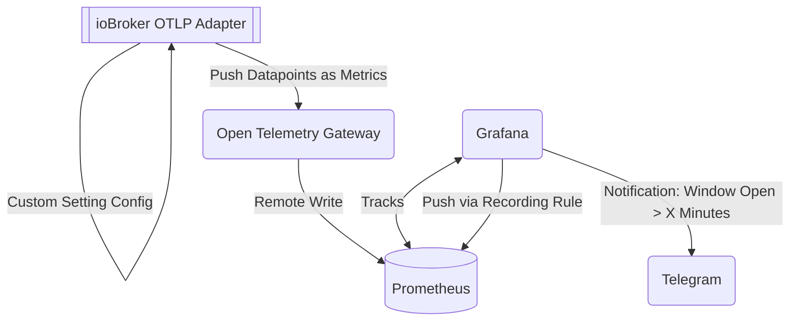

Dieses Dokument beschreibt eine Konfiguration, bei der`ioBroker.otlp` Der Adapter dient dazu, Daten von Fenstersensoren weiterzuleiten und Benachrichtigungen zu versenden, wenn erkannt wird, dass ein Fenster länger als \[Anzahl der Tage] geöffnet ist.`X` Minuten.

## Überblick auf hoher Ebene

Ich habe einige Matter-kompatible Fenstersensoren, die mit ioBroker verbunden sind. Jeder Datenpunkt/Zustand generiert eine Zeitreihe für denselben Metriknamen (`contact-sensor-open` ):

Dies führt zu Folgendem:`ioBroker.otlp` Adapter, der diese Metriken veröffentlicht über`OTLP` zum konfigurierten offenen Telemetrie-Gateway/Collector. Der Collector ist so konfiguriert, dass er Metriken (remote-write) in (zustandslos) überträgt.`Prometheus` , das mir als kurzfristiger Speicher für historische Daten dient.

**Anmerkung:** Selbstverständlich _könnte_ ich die Daten auch in einer Zeitreihendatenbank wie Influx speichern, aber für diesen Anwendungsfall benötige ich im Allgemeinen keine Langzeitspeicherung. Es interessiert mich nicht, ob mein Fenster _heute_ geöffnet war, wenn es in drei Monaten geschlossen ist; die Daten sind dann praktisch wertlos.

Sobald die Daten in Prometheus gespeichert sind, werden sie von Grafana abgefragt und mit einer Aufzeichnungsregel überschrieben:

Das erleichtert die Arbeit mit den Daten etwas; denn Promql ist ziemlich umständlich, wenn es um relative Zeitstempel, Resets und fehlende Datenpunkte geht. Die resultierende Metrik sieht folgendermaßen aus – man kann erkennen, wo Datenpunkte fehlen, weil das Fenster längere Zeit geschlossen war:

Im obigen Screenshot sind die (stetig) zunehmenden Öffnungszeiten der jeweiligen Räume zu erkennen. Damit lässt sich problemlos eine Benachrichtigung einrichten, die versendet wird, sobald eine Zeitreihe einen bestimmten Schwellenwert überschreitet:

Die Benachrichtigung wird über Telegram zugestellt, was am einfachsten erschien.`Contact-Point` um dies zu erreichen und nativ mit Grafana zu versenden:

