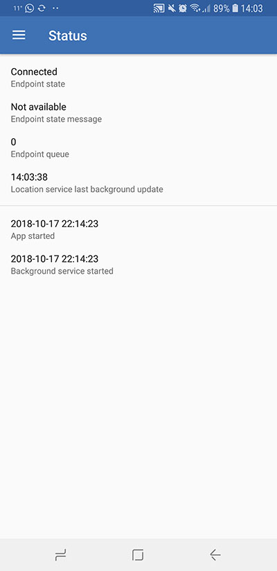
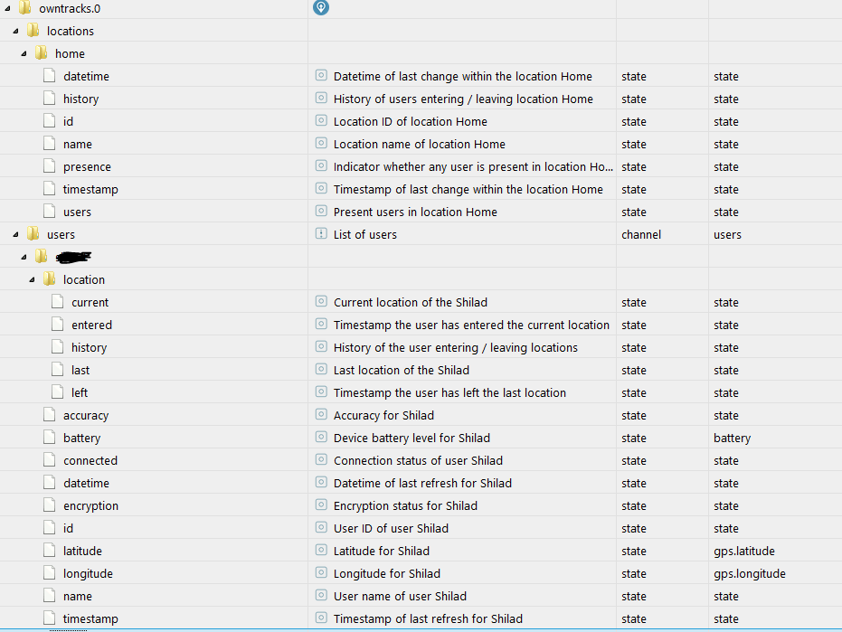
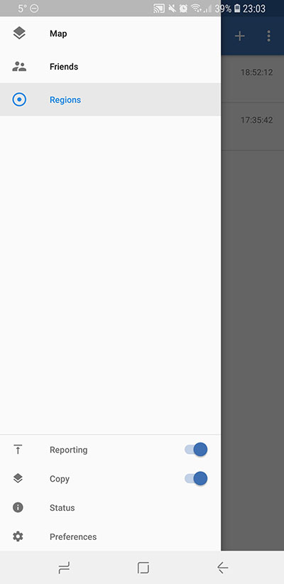
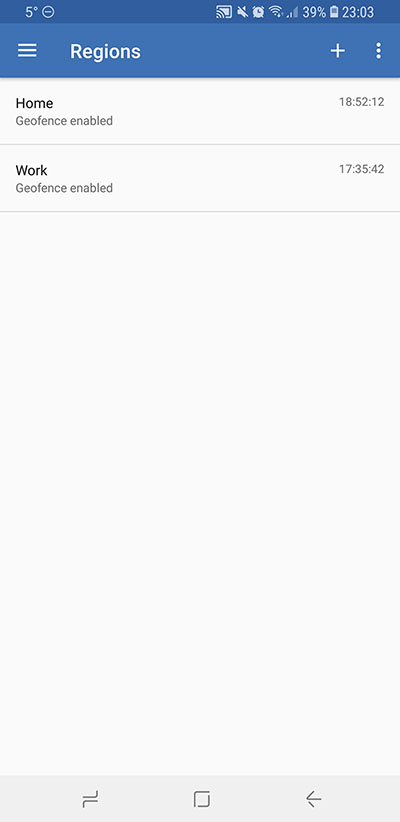
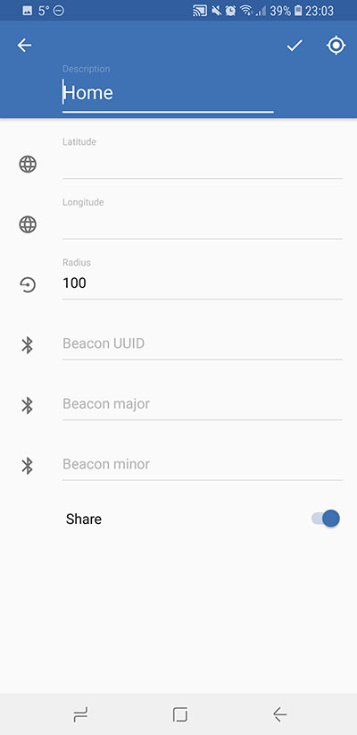
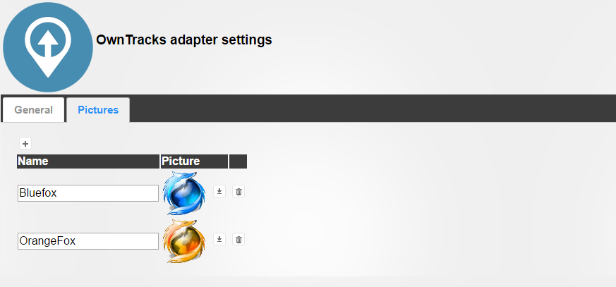

# IoBroker.owntracks
 

**Dieser Adapter verwendet Sentry-Bibliotheken, um Ausnahmen und Codefehler automatisch an die Entwickler zu melden.** Weitere Details und Informationen zum Deaktivieren der Fehlerberichterstattung finden Sie unter [Sentry-Plugin-Dokumentation](https://github.com/ioBroker/plugin-sentry#plugin-sentry)! Sentry Reporting wird ab js-controller 3.0 verwendet.

[Eigene Spuren](http://owntracks.org/) ist eine App für Android und iOS.

App sendet Ihre Position (Position des Geräts) kontinuierlich an einen bestimmten Server. In unserem Fall wird es der ioBroker-Server sein. Zur Kommunikation wird entweder das MQTT-Protokoll verwendet oder der Adapter ioBroker.cloud / ioBroker.iot.

Verbindung für:

- Android: [https://play.google.com/store/apps/details?id=org.owntracks.android](https://play.google.com/store/apps/details?id=org.owntracks .Android)
- iOS: [https://itunes.apple.com/de/app/owntracks/id692424691?mt=8](https://itunes.apple.com/de/app/owntracks/id692424691?mt=8)

## Einrichtungsanweisungen
### Verbindungskonfiguration (mit MQTT-Server)
OwnTracks Adapter startet auf Port 1883 (konfigurierbar) einen MQTT-Server, um die Nachrichten von Geräten mit Koordinaten zu empfangen.
Das Problem ist, dass dieser Server über das Internet erreichbar sein muss.
Normalerweise gibt es einen Router oder eine Firewall, die konfiguriert werden muss, um den Datenverkehr weiterzuleiten.

### App- und Adapterkonfiguration
Folgende Einstellungen müssen in der Android / iOS App bzw. im ioBroker Adapter gesetzt werden:

- Verbindung/Modus - MQTT privat
- Verbindung/Host/Host - IP-Adresse Ihres Systems oder DynDNS-Domain. Z.B. http://www.noip.com/ lässt den Domänennamen anstelle der IP-Adresse verwenden.
- Connection/Host/Port - 1883 oder Ihr Port auf Ihrem Router
- Verbindung/Host/WebSockets - falsch
- Verbindung/Identifikation/Benutzername - iobroker
- Verbindung/Identifikation/Passwort - aus den Adaptereinstellungen
- Verbindung/Identifikation/Geräte-ID - Name des Geräts oder der Person. Für dieses Gerät werden die Zustände erstellt. Z.B. wenn die Geräte-ID "Mark" ist, werden nach dem ersten Kontakt folgende Zustände erstellt:

    - owntracks.0.users.Mark.longitude
    - owntracks.0.users.Mark.latitude

- Verbindung/Identifikation/TrackerID - Kurzname des Benutzers (bis zu 2 Buchstaben), um ihn auf die Karte zu schreiben.
- Verbindung/Sicherheit/TLS - aus
- Erweitert/Verschlüsselungsschlüssel - optional, aber empfohlen: Fügen Sie eine Passphrase für die Verschlüsselung hinzu

Bitte vergewissern Sie sich, dass owntracks mit der iobroker-Instanz über den „Status“-Eintrag in der Schublade verbunden ist:

### WICHTIGER HINWEIS!
**Die Zustände in ioBroker werden generiert, wenn die spezifische Nutzlast empfangen wird!! Das bedeutet, dass die Standorte in ioBroker generiert werden, wenn der Benutzer den Standort zum ersten Mal verlässt oder betritt.** Unten sehen Sie die Zielstruktur

### Konfiguration der Regionen
Um Standorte innerhalb des owntracks Adapters einzurichten, müssen Sie Regionen in der owntracks Android / iOS App erstellen.
Gehen Sie dazu in der Schublade auf „Regionen“.

Erstellen Sie eine neue Region, indem Sie auf das Pluszeichen (+) in der oberen rechten Ecke klicken

Verwenden Sie die Standortschaltfläche in der oberen rechten Ecke, um den aktuellen Standort abzurufen, oder geben Sie ihn selbst in Breiten- und Längengrad ein. Geben Sie außerdem einen Umkreis für den Standort an. Wenn Sie den Standort teilen, erhalten Ihre Freunde (siehe in der Schublade der Android-/iOS-App) eine Benachrichtigung, wenn Sie einen Standort betreten/verlassen.

### Symboleinstellungen (innerhalb des ioBroker.owntracks-Adapters)
Sie können für jeden Benutzer ein Symbol definieren. Laden Sie einfach per Drag&Drop oder per Mausklick Ihr Bild hoch. Es wird automatisch auf 64x64 skaliert.

Der Name muss gleich der Geräte-ID in der OwnTracks-App sein.

## Changelog
### 1.0.1 (2022-03-12)
* (Garfonso) fix roles for type detection
* (Apollon77) Add Sentry for crash reporting

### 1.0.0 (2020-12-06)
* (Apollon77) respect "bind" configuration, also for IPv6

### 0.6.3 (2020-05-12)
* (Apollon77) updated dependencies
* (bluefox) fixes some issues

### 0.6.2 (2019-02-14)
* (zefau) Added support for [ioBroker compact mode](https://forum.iobroker.net/viewtopic.php?f=24&t=20387#p213466)
* (zefau) Added support for Gulp translations

### 0.6.0 (2019-01-27)
* (zefau) Added Admin v3 / materialized support
* (zefau) Added option for websockets in the adapter settings

### 0.5.1 (2019-01-25)
* (zefau) fixed an error when connection got closed

### 0.5.0 (2018-10-14)
* (zefau) Added support for locations

### 0.4.0 (2018-10-14)
* (zefau) Added support for encryption key

### 0.3.0 (2018-06-05)
* (matspi) Fix handling of publish messages

### 0.2.0 (2017-01-03)
* (jp112sdl) added two properties timestamp and datetime

### 0.1.1 (2016-09-05)
* (bluefox) add pictures

### 0.1.0 (2016-09-04)
* (bluefox) initial release

## License
The MIT License (MIT)

Copyright (c) 2016-2022 bluefox<dogafox@gmail.com>

Permission is hereby granted, free of charge, to any person obtaining a copy
of this software and associated documentation files (the "Software"), to deal
in the Software without restriction, including without limitation the rights
to use, copy, modify, merge, publish, distribute, sublicense, and/or sell
copies of the Software, and to permit persons to whom the Software is
furnished to do so, subject to the following conditions:

The above copyright notice and this permission notice shall be included in
all copies or substantial portions of the Software.

THE SOFTWARE IS PROVIDED "AS IS", WITHOUT WARRANTY OF ANY KIND, EXPRESS OR
IMPLIED, INCLUDING BUT NOT LIMITED TO THE WARRANTIES OF MERCHANTABILITY,
FITNESS FOR A PARTICULAR PURPOSE AND NONINFRINGEMENT. IN NO EVENT SHALL THE
AUTHORS OR COPYRIGHT HOLDERS BE LIABLE FOR ANY CLAIM, DAMAGES OR OTHER
LIABILITY, WHETHER IN AN ACTION OF CONTRACT, TORT OR OTHERWISE, ARISING FROM,
OUT OF OR IN CONNECTION WITH THE SOFTWARE OR THE USE OR OTHER DEALINGS IN
THE SOFTWARE.