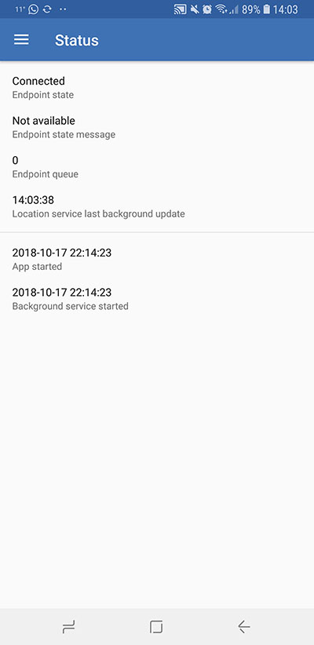
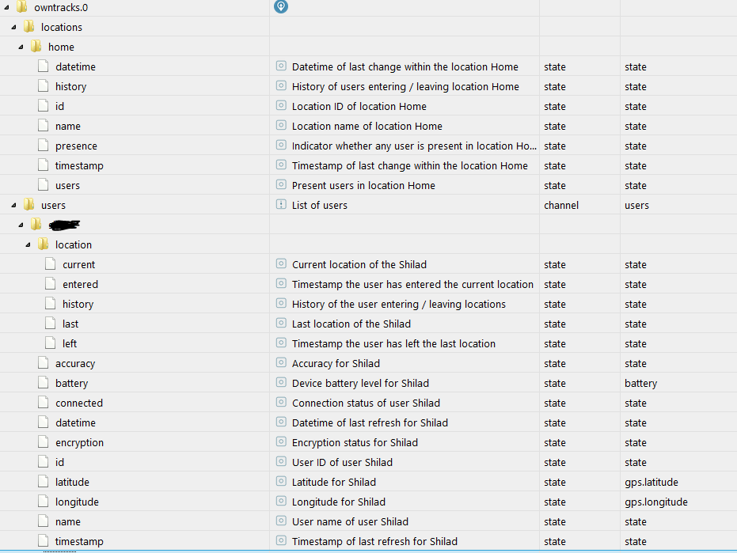
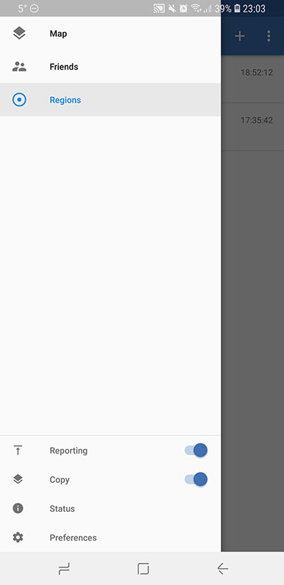
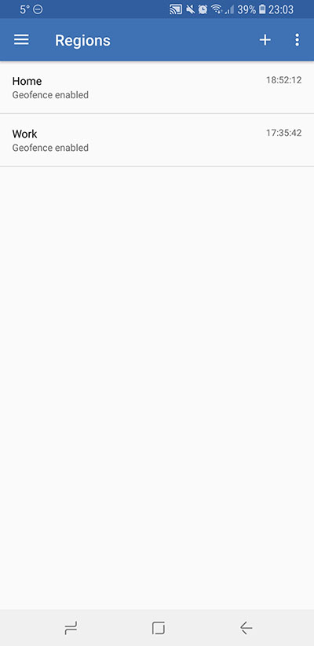
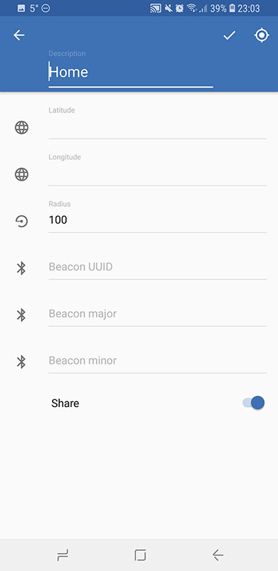
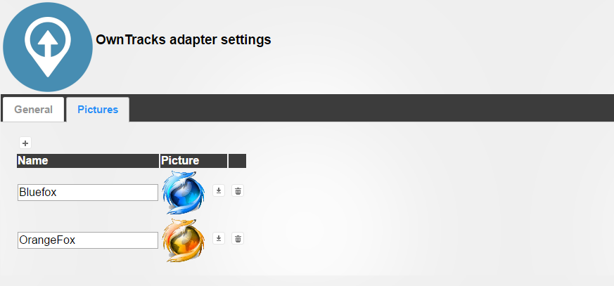

# ioBroker.owntracks

**Dieser Adapter nutzt die Sentry-Bibliotheken, um Ausnahmen und Codefehler automatisch an die Entwickler zu melden.** Weitere Details und Informationen zum Deaktivieren der Fehlerberichterstattung finden Sie in [der Sentry-Plugin-Dokumentation](https://github.com/ioBroker/plugin-sentry#plugin-sentry) ! Die Sentry-Berichterstattung wird ab js-controller 3.0 verwendet.

[OwnTracks](http://owntracks.org/) ist eine App für Android und iOS.

Die App sendet Ihre Position (Geräteposition) kontinuierlich an einen bestimmten Server. In unserem Fall ist dies der ioBroker-Server. Die Kommunikation erfolgt entweder über das MQTT-Protokoll oder über den ioBroker.cloud- bzw. ioBroker.iot-Adapter.

Link für:

- Android: <https://play.google.com/store/apps/details?id=org.owntracks.android>
- iOS: <https://itunes.apple.com/de/app/owntracks/id692424691?mt=8>

## Einrichtungsanleitung

### Verbindungskonfiguration (über einen MQTT-Server)

Der OwnTracks-Adapter startet auf Port 1883 (konfigurierbar) einen MQTT-Server, um Nachrichten von Geräten mit Koordinaten zu empfangen. Das Problem besteht darin, dass dieser Server aus dem Internet erreichbar sein muss. Normalerweise ist ein Router oder eine Firewall vorhanden, die so konfiguriert sein muss, dass sie den Datenverkehr weiterleitet.

### App- und Adapterkonfiguration

Folgende Einstellungen müssen in der Android- bzw. iOS-App im ioBroker-Adapter vorgenommen werden:

- Verbindung/Modus – MQTT privat

- Verbindung/Host/Host – IP-Adresse Ihres Systems oder DynDNS-Domain. Beispiel: <http://www.noip.com/> – verwenden wir den Domainnamen anstelle der IP-Adresse.

- Verbindung/Host/Port – 1883 oder der Port an Ihrem Router

- Verbindung/Host/WebSockets - false

- Verbindung/Identifikation/Benutzername - iobroker

- Verbindung/Identifikation/Passwort – aus den Adaptereinstellungen

- Verbindung/Identifizierung/Geräte-ID – Name des Geräts oder der Person. Für dieses Gerät werden die Zustände erstellt. Beispiel: Wenn die Geräte-ID „Mark“ lautet, werden nach dem ersten Kontakt die folgenden Zustände erstellt:

  - owntracks.0.users.Mark.longitude
  - owntracks.0.users.Mark.latitude

- Verbindungs-/Identifikations-/TrackerID - Kurzer Name des Benutzers (bis zu 2 Buchstaben), der auf der Karte angezeigt werden soll.

- Verbindung/Sicherheit/TLS - deaktiviert

- Erweiterter/Verschlüsselungsschlüssel – optional, aber empfohlen: Passphrase für die Verschlüsselung hinzufügen

Bitte überprüfen Sie, ob owntracks über den Eintrag „Status“ im Menü mit der iobroker-Instanz verbunden ist:

### WICHTIGER HINWEIS!

**Die Zustände in ioBroker werden generiert, sobald die spezifische Nutzlast empfangen wird. Das bedeutet, dass die Standorte in ioBroker beim ersten Verlassen oder Betreten des Standorts durch den Benutzer generiert werden.** Die Zielstruktur ist unten dargestellt.

### Regionskonfiguration

Um Standorte im owntracks-Adapter einzurichten, müssen Sie Regionen in der owntracks-App für Android/iOS erstellen. Gehen Sie dazu im Menü auf „Regionen“.

Erstellen Sie eine neue Region, indem Sie auf das Pluszeichen (+) in der oberen rechten Ecke klicken.

Über die Standort-Schaltfläche oben rechts können Sie Ihren aktuellen Standort abrufen oder Längen- und Breitengrad selbst eingeben. Legen Sie außerdem einen Radius für den Standort fest. Wenn Sie Ihren Standort teilen, erhalten Ihre Freunde (siehe Menüleiste der Android-/iOS-App) eine Benachrichtigung, sobald Sie den Ort betreten oder verlassen.

### Symboleinstellungen (innerhalb des ioBroker.owntracks-Adapters)

Sie können für jeden Benutzer ein Symbol festlegen. Laden Sie Ihr Bild einfach per Drag & Drop oder Mausklick hoch. Es wird automatisch auf 64x64 Pixel skaliert.

Der Name muss mit der Geräte-ID in der OwnTracks-App übereinstimmen.

## Changelog
<!--
    Placeholder for the next version (at the beginning of the line):
    ### **WORK IN PROGRESS**
-->

### **WORK IN PROGRESS**
- (copilot) Adapter requires admin >= 7.7.22 now
- (copilot) Adapter requires js-controller >= 6.0.11 now
- (copilot) Adapter requires admin >= 7.6.17 now

### 1.1.0 (2024-04-22)
* (mcm1957) Adapter requires node.js >= 18 and js-controller >= 5 now
* (mcm1957) Dependencies have been updated

### 1.0.5 (2022-10-08)
* (Apollon77) Prepare for future js-controller versions

### 1.0.4 (2022-09-15)
* (Apollon77) Fix crash case reported by Sentry

### 1.0.3 (2022-06-17)
* (Apollon77) Fix several crash cases reported by Sentry

### 1.0.2 (2022-04-19)
* (Apollon77) Optimize handling for cases with invalid history state values

### 1.0.1 (2022-03-12)
* (Garfonso) fix roles for type detection
* (Apollon77) Add Sentry for crash reporting

### 1.0.0 (2020-12-06)
* (Apollon77) respect "bind" configuration, also for IPv6

### 0.6.3 (2020-05-12)
* (Apollon77) updated dependencies
* (bluefox) fixes some issues

### 0.6.2 (2019-02-14)
* (zefau) Added support for [ioBroker compact mode](https://forum.iobroker.net/viewtopic.php?f=24&t=20387#p213466)
* (zefau) Added support for Gulp translations

### 0.6.0 (2019-01-27)
* (zefau) Added Admin v3 / materialized support
* (zefau) Added option for websockets in the adapter settings

### 0.5.1 (2019-01-25)
* (zefau) fixed an error when connection got closed

### 0.5.0 (2018-10-14)
* (zefau) Added support for locations

### 0.4.0 (2018-10-14)
* (zefau) Added support for encryption key

### 0.3.0 (2018-06-05)
* (matspi) Fix handling of publish messages

### 0.2.0 (2017-01-03)
* (jp112sdl) added two properties timestamp and datetime

### 0.1.1 (2016-09-05)
* (bluefox) add pictures

### 0.1.0 (2016-09-04)
* (bluefox) initial release

[Older changelogs can be found there](https://github.com/iobroker-community-adapters/ioBroker.owntracks/blob/master/CHANGELOG_OLD.md)

## License
The MIT License (MIT)

Copyright (c) 2023-2026 iobroker-community-adapters <iobroker-community-adapters@gmx.de>  
Copyright (c) 2016-2022 bluefox<dogafox@gmail.com>

Permission is hereby granted, free of charge, to any person obtaining a copy
of this software and associated documentation files (the "Software"), to deal
in the Software without restriction, including without limitation the rights
to use, copy, modify, merge, publish, distribute, sublicense, and/or sell
copies of the Software, and to permit persons to whom the Software is
furnished to do so, subject to the following conditions:

The above copyright notice and this permission notice shall be included in
all copies or substantial portions of the Software.

THE SOFTWARE IS PROVIDED "AS IS", WITHOUT WARRANTY OF ANY KIND, EXPRESS OR
IMPLIED, INCLUDING BUT NOT LIMITED TO THE WARRANTIES OF MERCHANTABILITY,
FITNESS FOR A PARTICULAR PURPOSE AND NONINFRINGEMENT. IN NO EVENT SHALL THE
AUTHORS OR COPYRIGHT HOLDERS BE LIABLE FOR ANY CLAIM, DAMAGES OR OTHER
LIABILITY, WHETHER IN AN ACTION OF CONTRACT, TORT OR OTHERWISE, ARISING FROM,
OUT OF OR IN CONNECTION WITH THE SOFTWARE OR THE USE OR OTHER DEALINGS IN
THE SOFTWARE.