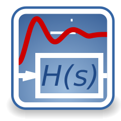

# ioBroker.pid

**Allgemeine Informationen:**   **Version:**   **Tests:**   **Spende:** 

---

## Posten

**Dieser Adapter nutzt die Sentry-Bibliotheken, um Ausnahmen und Codefehler automatisch an die Entwickler zu melden.** Weitere Details und Informationen zum Deaktivieren der Fehlerberichterstattung finden Sie in [der Sentry-Plugin-Dokumentation](https://github.com/ioBroker/plugin-sentry#plugin-sentry) ! Die Sentry-Berichterstattung wird ab js-controller 3.0 verwendet.

---

## PID-Adapter für ioBroker

Dieser Adapter stellt einen konfigurierbaren PID-Regler bereit.

---

## Haftungsausschluss

**Alle Produkt- und Firmennamen sowie Logos sind Marken™ oder eingetragene® Marken ihrer jeweiligen Inhaber. Ihre Verwendung impliziert weder eine Zugehörigkeit zu noch eine Unterstützung durch diese oder verbundene Tochtergesellschaften! Dieses private Projekt wird in der Freizeit betrieben und verfolgt keine geschäftlichen Ziele.**

---

## Allgemeine Informationen

Dieser Adapter bietet die Funktionalität eines PID-Reglers.

In der Praxis berechnet ein PID-Regler automatisch einen Korrekturwert für ein System auf Basis eines Istwerts und eines Sollwerts. Das Verhalten wird also parametergesteuert. Ein alltägliches Beispiel ist der Tempomat eines Autos: Bei konstanter Motorleistung würde die Geschwindigkeit beim Bergauffahren sinken. Der PID-Algorithmus des Reglers stellt die gemessene Geschwindigkeit mit minimaler Verzögerung und minimalem Überschwingen wieder auf den Sollwert her, indem er die Motorleistung kontrolliert erhöht. \[(c) Wikipedia]

Innerhalb einer Adapterinstanz können mehrere Regler konfiguriert sein. Der Adapter unterstützt die Konfiguration der Parameter (P-, I- und D-Komponenten) und der Berechnungszykluszeit. Darüber hinaus kann die Berechnung angehalten und fortgesetzt sowie der Regler zurückgesetzt werden. Für eine komfortable Bedienung kann ein manueller Modus aktiviert werden, um die Ausgabe direkt einzustellen. Die Ausgabe kann auf einen Minimal-/Maximalwert begrenzt und mit einem festen Offset versehen werden.

Alle relevanten Werte, einschließlich interner Daten, stehen als Zustände zu Diagnosezwecken zur Verfügung.

## Dokumentation

[englische Dokumentation](/#/docs/adapterref/iobroker.pid/docs/en/pid_en.md)  [deutsche Dokumentation](https://github.com/iobroker-community-adapters/ioBroker.pid/blob/master/docs/de/pid_de.md)

## Credits

Die Bereitstellung dieses Adapters wäre ohne die großartige Arbeit von @Philmod ( <https://github.com/Philmod> ) nicht möglich gewesen, der node-pid-controller ( <https://github.com/Philmod/node-pid-controller> ) entwickelt hat.

## Wie man Probleme und Funktionswünsche meldet

Bitte nutzen Sie hierfür die GitHub-Issues.

Am besten stellen Sie den Adapter auf Debug-Log-Modus ein (Instanzen -> Expertenmodus -> Spaltenprotokollierungsstufe). Laden Sie anschließend die Logdatei von Ihrer Festplatte herunter (Unterverzeichnis „log“ im ioBroker-Installationsverzeichnis, nicht aus dem Admin-Bereich, da dieser die Zeilen abschneidet). Falls Sie die Datei nicht in einem GitHub-Issue bereitstellen möchten, können Sie sie mir auch per E-Mail senden ( <mcm57@gmx.at> ). Bitte fügen Sie einen Verweis auf das entsprechende GitHub-Issue hinzu und beschreiben Sie, was in der Logdatei zu welchem Zeitpunkt steht.

---

**Wenn Ihnen dieser Adapter gefällt, erwägen Sie bitte eine Spende:**

---

## Changelog

<!--
    Placeholder for the next version (at the beginning of the line):
    ### **WORK IN PROGRESS**
-->
### 1.1.3 (2024-03-22)

-   (mcm1957) Adapter uses sentry to report errors now.

### 1.0.0 (2024-03-11)

-   (mcm1957) BREAKING: Adapter requires node.js 18 or newer now
-   (mcm1957) BREAKING: Adapter requires js-controller 5.x.x and admin 6.x.x or newer now
-   (mcm1957) BREAKING: Adapter requires node.js 18 or newer now
-   (mcm1957) Incorrect error message whenever no controllers have been defied has been removed. [#68]
-   (mcm1957) State roles have been reviewed and adapted. [#88]
-   (mcm1957) Dependencies have been updated.

### 0.0.8 (2023-07-13)

-   (mcm1957) changed: Overall stability during state updates has been increased
-   (mcm1957) changed: Dependencies have been updated

### 0.0.7 (2023-04-24)

-   (mcm1957) changed: Cycle time is now required to be at least 100ms
-   (mcm1957) changed: Recalculations are now controlled by cycle timer only, no extra updates are performed (#62)
-   (mcm1957) changed: Several dependencies have been updated

### 0.0.6 (2023-04-14)

-   (mcm1957) solved: Calculation of sumerr in case of hitting max/min Limits has been corrected

### 0.0.5 (2023-04-14)

-   (mcm1957) new: npm/npmjs support has been added

### 0.0.4 (2023-04-14)

-   (mcm1957) changed: State last_upd_str has been removed
-   (mcm1957) changed: Some roles have been updated
-   (mcm1957) changed: Translations have been updated

### 0.0.3-alpha.1 (2023-04-13)

-   (mcm1957) changed: Setting rst state does no longer trigger a recalculation
-   (mcm1957) changed: State diff now displays error value even if sup is active
-   (mcm1957) changed: Calculation of I-part has been changed, changing Tn effects future calculations only now

### 0.0.3-alpha.0 (2023-04-12)

-   (mcm1957) new: optionally use folder structure for states
-   (mcm1957) changed: reset timer at restart after pausing calculation
-   (mcm1957) changed: use values stored for ack and set when starting adapter
-   (mcm1957) changed: log state changes with unexpected ack=true
-   (mcm1957) changed: fix incorrect updates occuring whenever act is written
-   (mcm1957) changed: fix invert flag not working at all
-   (mcm1957) changed: remove error display whenever adapter is hitting the limits
-   (mcm1957) changed: fix q flag handling
-   (mcm1957) changed: fix unexpected bahavior of sup parameter
-   (mcm1957) changed: rename run state to hold

### 0.0.2-alpha.2 (2023-04-06)

-   (mcm1957) changed: values of 'kp', 'xp' and 'sup' are now verified if set using states
-   (mcm1957) changed: values of 'min' and 'max' are now verified if set using states
-   (mcm1957) changed: activation of 'man' updates output 'y' with current value of 'man_inp' now
-   (mcm1957) changed: 'min' value is now conserved when restarting the instance
-   (mcm1957) changed: conversion between and xp has been fixed at several places
-   (mcm1957) changed: 'kp' or 'xp' are writepotected now depending on 'useXp' parameter

### 0.0.2-alpha.1 (2023-04-04)

-   (mcm1957) changed: some small fixes

### 0.0.2-alpha.0 (2023-04-04)

-   (mcm1957) THIS IS AN ALPHA RELEASE ONLY
-   (mcm1957) major changes after discussion in forum
-   (mcm1957) new initial release

## License

MIT License

Copyright (c) 2023-2024 mcm1957 <mcm57@gmx.at>

Permission is hereby granted, free of charge, to any person obtaining a copy
of this software and associated documentation files (the "Software"), to deal
in the Software without restriction, including without limitation the rights
to use, copy, modify, merge, publish, distribute, sublicense, and/or sell
copies of the Software, and to permit persons to whom the Software is
furnished to do so, subject to the following conditions:

The above copyright notice and this permission notice shall be included in all
copies or substantial portions of the Software.

THE SOFTWARE IS PROVIDED "AS IS", WITHOUT WARRANTY OF ANY KIND, EXPRESS OR
IMPLIED, INCLUDING BUT NOT LIMITED TO THE WARRANTIES OF MERCHANTABILITY,
FITNESS FOR A PARTICULAR PURPOSE AND NONINFRINGEMENT. IN NO EVENT SHALL THE
AUTHORS OR COPYRIGHT HOLDERS BE LIABLE FOR ANY CLAIM, DAMAGES OR OTHER
LIABILITY, WHETHER IN AN ACTION OF CONTRACT, TORT OR OTHERWISE, ARISING FROM,
OUT OF OR IN CONNECTION WITH THE SOFTWARE OR THE USE OR OTHER DEALINGS IN THE
SOFTWARE.