# ioBroker.playstation

[Zurück zur README](/README.md)

# Zusammenfassung

- [Instanz Einstellungen](#instanz-einstellungen)
    - [Einstellungen TAB Geräte](#instanz-konfiguration-tab-geräte-erstellen)
    - [Einstellungen TAB Token](#instanz-konfiguration-tab-token-erstellen)
- [Login](#login)
    - [Schritt 1 > Login PSN](#login-psn-playsatation-network)
    - [Schritt 2 > Login Lokal](#login-playstation-gerät)
- [Objekte](#objekte)
    - [Übersicht Objekte](#übersicht-alle-objekte)
    - [Profil](#übersicht-objekte-profil)
    - [Gerät](#übersicht-objekte-gerät)
    - [Remote Lokal](#objekte-remote)
    - [Remote PSN Profil](#objekte-remote_profile)
    - [Remote PSN Trophäen](#objekte-remote_trophies)
    - [Remote PSN Gruppen](#objekte-remote_groups)
    - [Remote PSN Stars](#objekte-remote_stars)
    - [Remote PSN Store](#objekte-remote_store)
- [Beispiele](#arrayjson-beispiele)
- [Status Beschränkungen als JSON](#status-json)

# Instanz Einstellungen

### Instanz Konfiguration TAB Geräte erstellen

[Zusammenfassung](#zusammenfassung)

- `Aktiv` Lokale Steuerung aktivieren/deaktivieren
- `Name` Name vom Gerät
- `IP` Die feste IP vom Gerät
- `Intervall` Interval in Sekunden (5/3600) um den Status abzufragen
- `Symbol` Icon für das Bojekt Device als base64 Image
- `Anmeldeinformation` Wird automatisch mit den Anmeldedaten für playactor-iobroker gesetzt
- `Welche PS4/5 soll gekoppelt werden?` IP auswählen welches Geräte gekoppelt werden soll
- `Überprüfung der Playstation-Verfügbarkeit` Es wird die Playstation gesucht. Es folgt ein Popup mit OK oder einer Fehlermeldung
- `UDP-Server starten` UDP Server starten um die Zugangsdaten der PS4 Second Screen APP zu erhalten
- `PIN-Code` Pin-Code vom Geräte eingeben
- `PIN-Code senden` Pin-Code senden

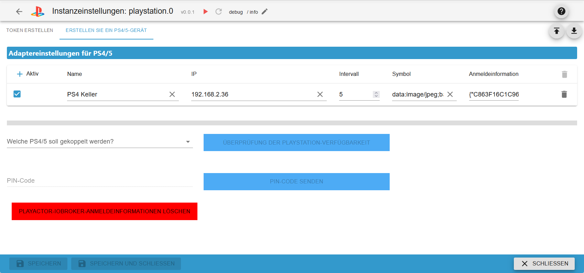

### Instanz Konfiguration TAB Token erstellen

[Zusammenfassung](#zusammenfassung)

- `1. Bitte melden Sie sich hier bei PSN an` Anklicken und einloggen
- `2. Link zu NPSSO (muss alle 2 Monate erneuert werden)` Nach dem Einloggen diesen Link anklicken und den NPSSO Cookie kopieren
- `NPSSO-Cookie` NPSSO Cookie hier einfügen
- `Sitzungsdaten löschen` Bei Login Probleme die aktuelle Session löschen
- `Sprache` Die Sprache aus dem PSN-Konto
- `PlayStation Stars aktivieren` Remote Control Objekte für Playstation Stars anlegen (Muss im PS Profil aktiviert werden)

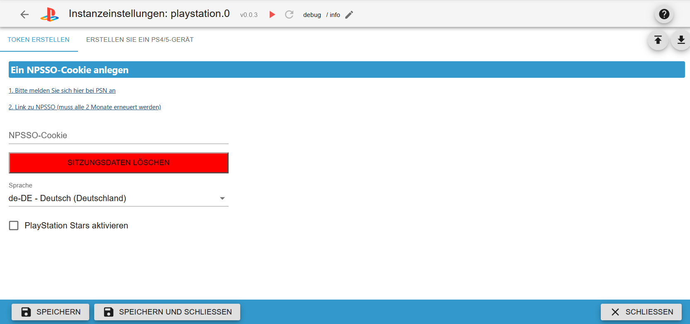

# Login

### Login PSN (Playsatation Network)

[Zusammenfassung](#zusammenfassung)

1. Link anklicken und sich bei Playstation Network anmelden
2. Jetzt diesen Link anklicken und den NPSSO kopieren</br>
   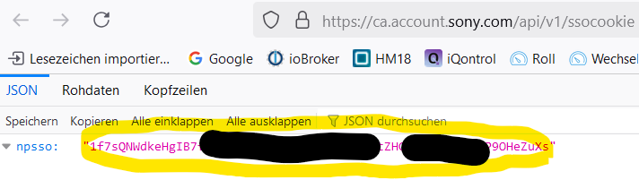</br>
3. Diesen Cookie in `NPSSO-Cookie` einfügen und die Instanz Einstellungen speichern. Dieses Cookie soll nur 2 Monate gültig sein.</br>
   </br>
   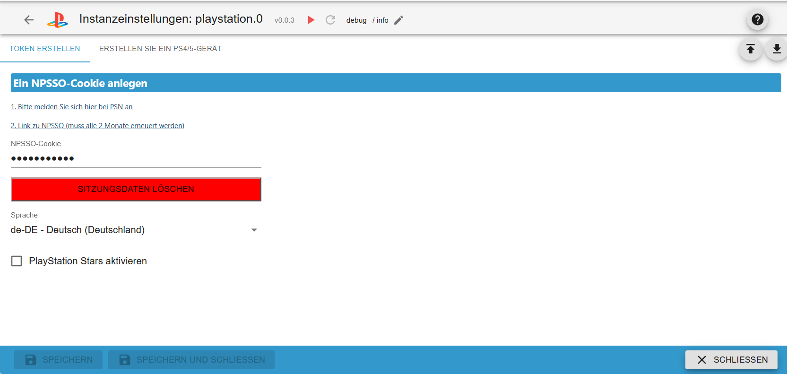

### Login Playstation Gerät

[Zusammenfassung](#zusammenfassung)

[Erst Schritt 1 durchführen](#login-psn-playsatation-network)</br>
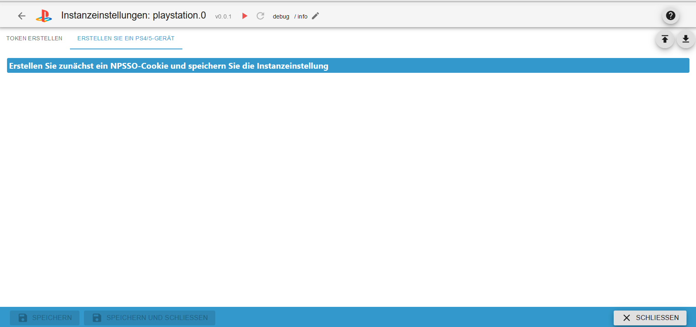

1. (Router) Weise der Playstation eine feste IP zu (bitte Google verwenden)
2. (PS) Playstation einschalten und das Profil wählen</br>
   </br>
3. (PS) Einstellungen öffnen</br>
   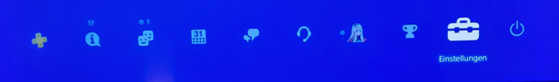</br>
4. (PS) Einstellung `mobile APP` öffnen</br>
   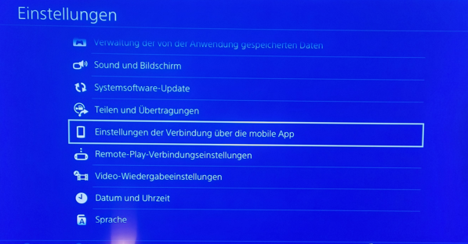</br>
5. (ioBroker) Instanz Einstellung vom playstation Adapter öffnen</br>
   </br>
6. (ioBroker) Ein Gerät anlegen und unter "IP" die IP der Playstation eintragen
7. (ioBroker) In `Welche PS4/5 soll gekoppelt werden?` dann die IP auswählen</br>
   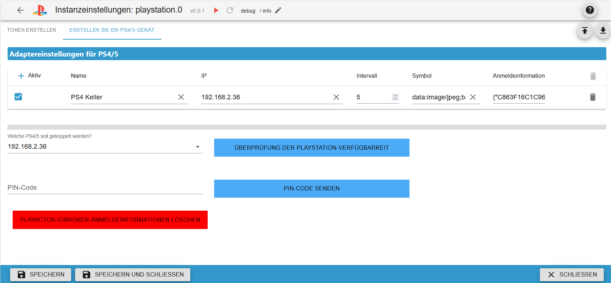</br>
8. (ioBroker) Nun den Button `Überprüfung der Playstation-Verfügbarkeit` drücken. Es erscheint eine Nachricht und ein Popup mit ok oder eine Fehlermeldung</br>
   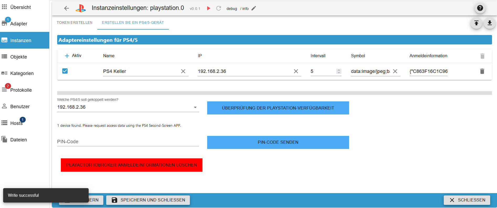</br>
9. (PS) Neues Gerät auswählen (es erscheint ein PIN)</br>
   </br>
   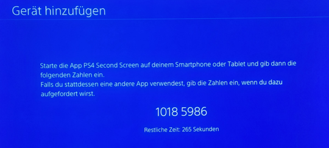</br>
10. (ioBroker) In `PIN-Code` den PIN eintragen
11. (ioBroker) Button `PIN-Code senden` drücken. Es erscheint ein Popup mit ok oder eine Fehlermeldung</br>
    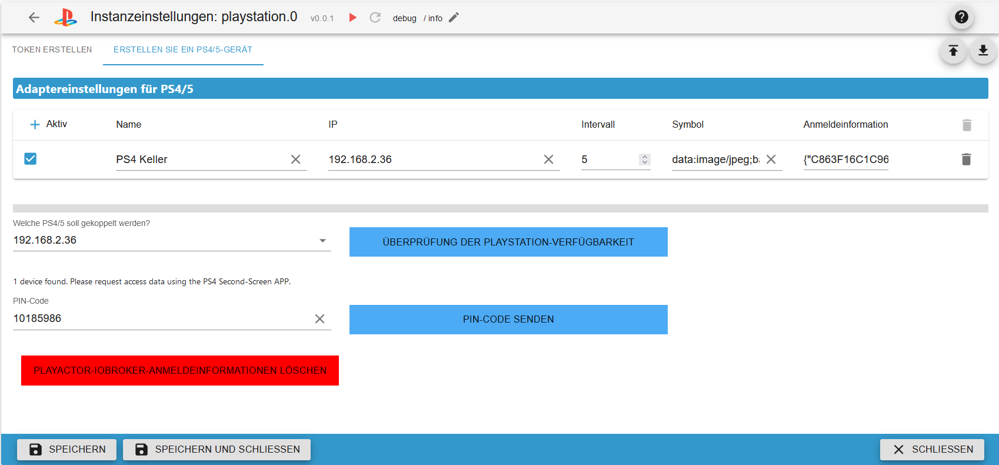</br>
12. (PS) PIN sollte nun nicht mehr sichtbar sein und der Name playactor-iob ist zu sehen</br>
    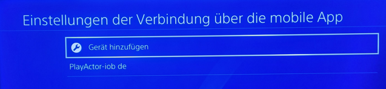</br>
13. (ioBroker) Instanz Einstellung speichern
14. (ioBroker) Bei einer Fehlermeldung bitte Vorgang ab Schritt 9 wiederholen

# Objekte

### Objekte remote

[Zusammenfassung](#zusammenfassung)

Um Tasten zu verwenden muss erst die Taste ps gedrückt werden. In Spielen funktionieren die Tasten nicht!

- `playstation.0.192_168_2_36.remote.back` Taste zurück
- `playstation.0.192_168_2_36.remote.down` Taste runter
- `playstation.0.192_168_2_36.remote.enter` Taste enter
- `playstation.0.192_168_2_36.remote.left` Taste links
- `playstation.0.192_168_2_36.remote.option` Taste option
- `playstation.0.192_168_2_36.remote.osk` Sende on-screen Tastatur
- `playstation.0.192_168_2_36.remote.ownCommand` Eigende commands (back down etc) oder mehrere mit Verzögerung (back:200 down:200)
- `playstation.0.192_168_2_36.remote.ps` Taste PS um remote control der anderen Tasten zu aktivieren
- `playstation.0.192_168_2_36.remote.right` Taste rechts
- `playstation.0.192_168_2_36.remote.standby` Geräte in standby versetzen
- `playstation.0.192_168_2_36.remote.startGame` Game starten (z. Bsp. Fortnite) Groß-Kleinschreibung beachten
- `playstation.0.192_168_2_36.remote.up` Taste hoch
- `playstation.0.192_168_2_36.remote.wakeup` Geräte aufwecken

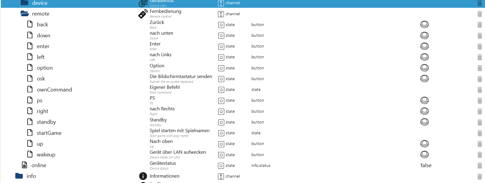

### Objekte remote_profile

[Zusammenfassung](#zusammenfassung)

Account-ID: Nummer des Benutzer
Online-ID: Nickname

| Objekt                                                              | Beschreibung                                                                                                                                                     | Link Beispiel                                                                         |
| ------------------------------------------------------------------- | ---------------------------------------------------------------------------------------------------------------------------------------------------------------- | ------------------------------------------------------------------------------------- |
| playstation.0.profile_remote_profile.account_id                     | Infos eines Benutzer ausgeben mit der Account ID (Ergebnis in result)                                                                                            | [Beispiel](#request-mit-accountid-playstation0profile_remote_profileaccount_id)       |
| playstation.0.profile_remote_profile.blocked_with_name              | Geblockte Benutzer mit Name als Array-JSON (account id und online id)                                                                                            | Result unknown                                                                        |
| playstation.0.profile_remote_profile.blocked_without_name           | Geblockte Benutzer als Array (account id)                                                                                                                        | Result unknown                                                                        |
| playstation.0.profile_remote_profile.friends_with_name              | Liste der Freunde als Array-JSON (account id und online id)                                                                                                      | [Beispiel](#request-playstation0profile_remote_profilefriends_with_name)              |
| playstation.0.profile_remote_profile.friends_with_name_status       | Liste der Freunde mit Status als Array-JSON (account id und online id)                                                                                           | [Beispiel](#request-playstation0profile_remote_profilefriends_with_name_status)       |
| playstation.0.profile_remote_profile.friends_without_name           | Liste der Freunde als Array (account id)                                                                                                                         | [Beispiel](#request-playstation0profile_remote_profilefriends_without_name)           |
| playstation.0.profile_remote_profile.gameList                       | Spieleliste eines Benutzer mit der Account-ID als JSON                                                                                                           | [Beispiel](#request-playstation0profile_remote_profilegamelist)                       |
| playstation.0.profile_remote_profile.gameTitle                      | Spielinfos mit der Titel-ID als JSON                                                                                                                             | [Beispiel](#request-playstation0profile_remote_profilegametitle)                      |
| playstation.0.profile_remote_profile.limit                          | Limit für das Laden der Freunde.                                                                                                                                 |                                                                                       |
| playstation.0.profile_remote_profile.offset                         | Offset für das Laden von Mitglieder und Infos                                                                                                                    |                                                                                       |
| playstation.0.profile_remote_profile.online_id                      | Infos eines Benutzer ausgeben mit der Online ID (Ergebnis in result)                                                                                             | [Beispiel](#request-mit-online-id-playstation0profile_remote_profileonline_id)        |
| playstation.0.profile_remote_profile.online_with_name               | Abonnementliste „Benachrichtigen, wenn verfügbar“ als Array-JSON (account id und online id)                                                                      | Result unknown                                                                        |
| playstation.0.profile_remote_profile.online_without_name            | Abonnementliste „Benachrichtigen, wenn verfügbar“ als Array (account id)                                                                                         | Result unknown                                                                        |
| playstation.0.profile_remote_profile.presencesUser                  | Status eines Users abfragen mit der Account-ID (Wenn der User PRIVAT eingestellt hat)                                                                            | [Beispiel](#request-playstation0profile_remote_profilepresencesuser)                  |
| playstation.0.profile_remote_profile.received_requests_accept       | Freundschaftsanfrage akzeptieren (mit Konto-ID)                                                                                                                  |                                                                                       |
| playstation.0.profile_remote_profile.received_requests_reject       | Freundschaftsanfrage ablehnen oder Freund löschen (mit Konto-ID)                                                                                                 |                                                                                       |
| playstation.0.profile_remote_profile.received_requests_with_name    | Freundschaftsanfragen mit Online-ID als JSON                                                                                                                     | [Beispiel](#request-playstation0profile_remote_profilereceived_requests_with_name)    |
| playstation.0.profile_remote_profile.received_requests_without_name | Freundschaftsanfragen ohne Online-ID als JSON                                                                                                                    | [Beispiel](#request-playstation0profile_remote_profilereceived_requests_without_name) |
| playstation.0.profile_remote.result                                 | Ergebnis aller Anfragen                                                                                                                                          |                                                                                       |
| playstation.0.profile_remote_profile.search_game                    | Spiel suchen. Maximal 15 Spiele als JSON. Für weitere Anzeigen dann die Auswahl vom State `playstation.0.profile_remote_profile.search_result_pagination` nutzen | [Beispiel](#request-playstation0profile_remote_profilesearch_game)                    |
| playstation.0.profile_remote_profile.search_result                  | Ergebnis aller Suchanfragen                                                                                                                                      |                                                                                       |
| playstation.0.profile_remote_profile.search_result_pagination       | Weitere 15 Spiele/User anzeigen                                                                                                                                  |                                                                                       |
| playstation.0.profile_remote_profile.search_user                    | User suchen. Maximal 15 User als JSON. Für weitere Anzeigen dann die Auswahl vom State `playstation.0.profile_remote_profile.search_result_pagination` nutzen    | [Beispiel](#request-playstation0profile_remote_profilesearch_user)                    |
| playstation.0.profile_remote_profile.shareProfile                   | Profil mit einem Freund teilen (Account ID). Es wird ein Link zu einem QRcode erstellt.                                                                          |                                                                                       |
| playstation.0.profile_remote_profile.storeWishlist                  | Wunschliste                                                                                                                                                      | [Beispiel](#request-playstation0profile_remote_profilestorewishlist)                  |
| playstation.0.profile_remote_profile.total                          | Total der aktuellen Abfrage                                                                                                                                      |                                                                                       |
| playstation.0.profile_remote_profile.update_profile                 | Update von deinem Profil (wird automatisch nur jede Stunde aktualisiert)                                                                                         |                                                                                       |

### Beispiel limit und offset</br>

Freundeliste laden (es gibt 59 Freunde - limit max. 800)</br>

- limit 20 // Es werden 20 Freunde geladen
- offset 0 // Startet bei 0
- Ergebnis: Es werden die Freunde 1-20 geladen

- limit 20 // Es werden 20 Freunde geladen
- offset 20 // Startet bei 21
- Ergebnis: Es werden die Freunde 21-30 geladen

- limit 20 // Es werden 20 Freunde geladen
- offset 50 // Startet bei 51
- Ergebnis: Es werden die Freunde 51-59 geladen

- limit 20 // Es werden 20 Freunde geladen
- offset 59 // Startet bei 59
- Ergebnis: Die Liste ist dann leer

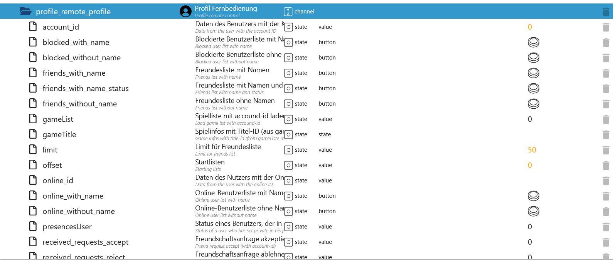</br>
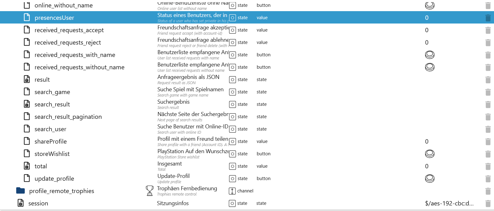

### Objekte remote_trophies

[Zusammenfassung](#zusammenfassung)

Account-ID: Nummer des Benutzer
Online-ID: Nickname

| Objekt                                                                       | Beschreibung                                                                                | Link Beispiel                                                                                  |
| ---------------------------------------------------------------------------- | ------------------------------------------------------------------------------------------- | ---------------------------------------------------------------------------------------------- |
| playstation.0.profile_remote_trophies.trophies_earned_for_title              | Für den Titel verdiente Trophäen mit Account-ID                                             | [Beispiel](#request-playstation0profile_remote_trophiestrophies_earned_for_title)              |
| playstation.0.profile_remote_trophies.trophies_for_title                     | Trophäen für Titel mit npCommunication-id                                                   | [Beispiel](#request-playstation0profile_remote_trophiestrophies_for_title)                     |
| playstation.0.profile_remote_trophies.trophies_game_help_available_for_title | Verfügbare Spielehilfe von Trophäen mit npCommunication-id                                  | [Beispiel](#request-playstation0profile_remote_trophiestrophies_game_help_available_for_title) |
| playstation.0.profile_remote_trophies.trophies_game_help_for_title           | Verfügbare Spielehilfe von Titel mit npCommunication-id, trophyId, udsObjectId und helpType | [Beispiel](#request-playstation0profile_remote_trophiestrophies_game_help_for_title)           |
| playstation.0.profile_remote_trophies.trophy_all                             | Trohäen von einem Benutzer mit der Online-ID als Array-JSON                                 | [Beispiel](#request-playstation0profile_remote_trophiestrophy_all)                             |
| playstation.0.profile_remote_trophies.trophy_title                           | Trophäen Titel mit Account-ID                                                               | [Beispiel](#request-playstation0profile_remote_trophiestrophy_title)                           |
| playstation.0.profile_remote_trophies.trophy_title_group                     | Trophäen Titelgruppe mit npCommunication-id und Plattform                                   | [Beispiel](#request-playstation0profile_remote_trophiestrophy_title_group)                     |
| playstation.0.profile_remote_trophies.trophy_title_group_user                | Trophäen Titel Benutzergruppe mit Account-ID, npCommunication-id und Plattform              | [Beispiel](#request-playstation0profile_remote_trophiestrophy_title_group_user)                |

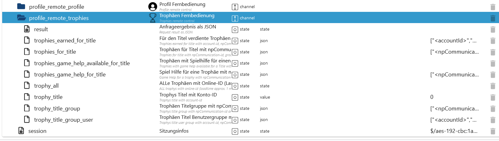

### Objekte remote_groups

[Zusammenfassung](#zusammenfassung)

Account-ID: Nummer des Benutzer
Online-ID: Nickname

| Objekt                                                      | Beschreibung                                                                                                                            | Link Beispiel                                                                 |
| ----------------------------------------------------------- | --------------------------------------------------------------------------------------------------------------------------------------- | ----------------------------------------------------------------------------- |
| playstation.0.profile_remote_groups.createGroup             | Eine Guppe mit Mitglieder erstellen (Account-ID der Mitglieder als Array)                                                               | [Beispiel](#request-playstation0profile_remote_groupscreategroup)             |
| playstation.0.profile_remote_groups.favorite                | Laden der Gruppen Favoriten/Keine Favoriten (alle)                                                                                      |                                                                               |
| playstation.0.profile_remote_groups.fields                  | Welche Felder sollen geladen werden                                                                                                     |                                                                               |
| playstation.0.profile_remote_groups.groupSettings           | Einstellung der Gruppe (Es muss eine Gruppe unter `selectGroup` ausgewählt werden und 3 Mitglieder erforderlich)                        | Result unknown                                                                |
| playstation.0.profile_remote_groups.inviteMembers           | Mitglieder in einer Gruppe hinzufügen (Account-ID der Mitglieder als Array - Es muss eine Gruppe unter `selectGroup` ausgewählt werden) | Result unknown                                                                |
| playstation.0.profile_remote_groups.kickMember              | Ein Mitglied aus einer Gruppe mit der Account-ID entfernen (Es muss eine Gruppe unter `selectGroup` ausgewählt werden)                  | Result unknown                                                                |
| playstation.0.profile_remote_groups.leaveGroup              | Eine Gruppe verlassen (Es muss eine Gruppe unter `selectGroup` ausgewählt werden)                                                       | Result unknown                                                                |
| playstation.0.profile_remote_groups.limit                   | Limit für Gruppen oder Nachrichten die geladen werden sollen (siehe Beispiel unter Profil)                                              |                                                                               |
| playstation.0.profile_remote_groups.loadFileData            | Aus Nachrichten die Anhänge laden                                                                                                       | [Beispiel](#request-playstation0profile_remote_groupsloadfiledata)            |
| playstation.0.profile_remote_groups.loadGroups              | Gruppen laden                                                                                                                           | [Beispiel](#request-playstation0profile_remote_groupsloadgroups)              |
| playstation.0.profile_remote_groups.loadGroups_with_message | Gruppen mit Nachrichten laden (siehe Beispiel unter Profil)                                                                             | [Beispiel](#request-playstation0profile_remote_groupsloadgroups_with_message) |
| playstation.0.profile_remote_groups.offset                  | Offset für das Laden von Gruppen                                                                                                        |                                                                               |
| playstation.0.profile_remote_groups.result                  | Ergebnis von Gruppen oder Gruppen mit Nachrichten laden als JSON                                                                        |                                                                               |
| playstation.0.profile_remote_groups.selectGroup             | Gruppen ID vom Ergebnis Gruppen oder Gruppen mit Nachrichten laden. Bei Auswahl einer Gruppe werden die Nachrichten geladen             | [Beispiel](#request-playstation0profile_remote_groupsselectgroup)             |
| playstation.0.profile_remote_groups.sendGroupMessage        | Nachricht an eine ausgewählte Gruppe senden (Es muss eine Gruppe unter `selectGroup` ausgewählt werden)                                 | [Beispiel](#request-playstation0profile_remote_groupssendgroupmessage)        |
| playstation.0.profile_remote_groups.total                   | Anzahl aller möglichen Gruppen oder Nachrichten (wichtig für limit und offset)                                                          |                                                                               |

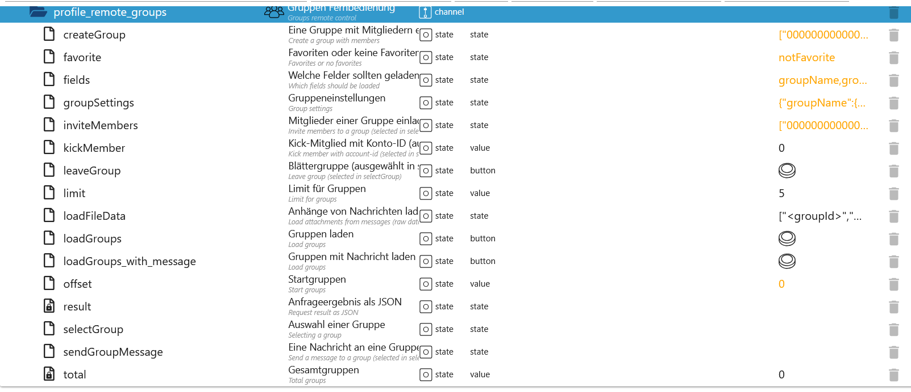

### Objekte remote_stars

[Zusammenfassung](#zusammenfassung)

campaign-ID: Von `profile_remote_stars.campaigns`
collectible-ID: Von `profile_remote_stars.campaigns`
reward-ID: Von `profile_remote_stars.rewards`

| Objekt                                                      | Beschreibung                                               | Link Beispiel |
| ----------------------------------------------------------- | ---------------------------------------------------------- | ------------- |
| playstation.0.profile_remote_stars.campaigns                | Verfügbare Kampagnen                                       |               |
| playstation.0.profile_remote_stars.campaigns_detail         | Details einer bestimmten Kampagne                          |               |
| playstation.0.profile_remote_stars.collectible_detail       | Details zu einem bestimmten Sammlerstück                   |               |
| playstation.0.profile_remote_stars.display_cases            | Verfügbare Vitrinen (oder Szenen)                          |               |
| playstation.0.profile_remote_stars.result                   | Ergebnis aller Abfragen                                    |               |
| playstation.0.profile_remote_stars.rewards                  | Prämien für den Umtausch gegen gesammelte Punkte           |               |
| playstation.0.profile_remote_stars.rewards_detail           | Details zu einer bestimmten Belohnung reward               |               |
| playstation.0.profile_remote_stars.rewards_tiers            | Prämienstufen, die innerhalb des Dienstes vorhanden sind   |               |
| playstation.0.profile_remote_stars.user_display_case        | Vitrine eines Benutzers mit Sammlerstücken                 |               |
| playstation.0.profile_remote_stars.user_earned_collectibles | Sammlerstücke, die ein Benutzer verdient hat               |               |
| playstation.0.profile_remote_stars.user_history             | Eine Zusammenfassung der Prämienpunkte                     |               |
| playstation.0.profile_remote_stars.user_summary             | Eine Zusammenfassung der PlayStation Stars eines Benutzers |               |


### Objekte remote_store

[Zusammenfassung](#zusammenfassung)

conncept-ID: Von `profile_remote_store.products`
product-ID: Von `profile_remote_store.products`
title-ID (npTitleId): Von `profile_remote_store.products`

| Objekt                                                    | Beschreibung                                           | Link Beispiel                                                         |
| --------------------------------------------------------- | ------------------------------------------------------ | --------------------------------------------------------------------- |
| playstation.0.profile_remote_store.addons_with_titleId    | Addons mit der title-id                                |                                                                       |
| playstation.0.profile_remote_store.concept_with_conceptId | Konzept mit der conncept-id                            |                                                                       |
| playstation.0.profile_remote_store.concept_with_productId | Konzept mit der product-id                             |                                                                       |
| playstation.0.profile_remote_store.featuresRetrieve       | PSPlus Abos                                            | [Beispiel](#request-playstation0profile_remote_storefeaturesretrieve) |
| playstation.0.profile_remote_store.param                  | Parameter für alle Produkte                            | [Beispiel](#parameter)                                                |
| playstation.0.profile_remote_store.pricing_with_conceptId | Preisgestaltung mit der conncept-id                    |                                                                       |
| playstation.0.profile_remote_store.product_with_productId | Produkt mit der product-id                             |                                                                       |
| playstation.0.profile_remote_store.products               | Alle Produkte (param und selectCategory wird benötigt) |                                                                       |
| playstation.0.profile_remote_store.rating_with_conceptId  | Bewertung mit der conncept-id                          |                                                                       |
| playstation.0.profile_remote_store.rating_with_productId  | Bewertung mit der produkt-id                           |                                                                       |
| playstation.0.profile_remote_store.result                 | Ergebnis aller Anfragen                                |                                                                       |
| playstation.0.profile_remote_store.selectCategory         | Parameter für alle Produkte                            |                                                                       |
| playstation.0.profile_remote_store.total                  | Seitenanzahl aller Produkte                            |                                                                       |


### Übersicht alle Objekte

[Zusammenfassung](#zusammenfassung)

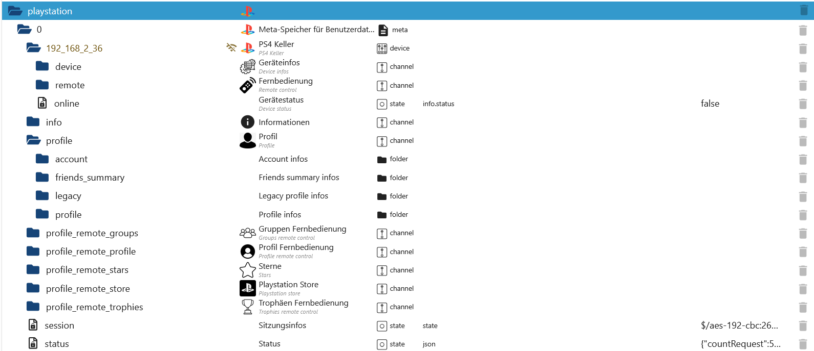

### Übersicht Objekte Profil

[Zusammenfassung](#zusammenfassung)

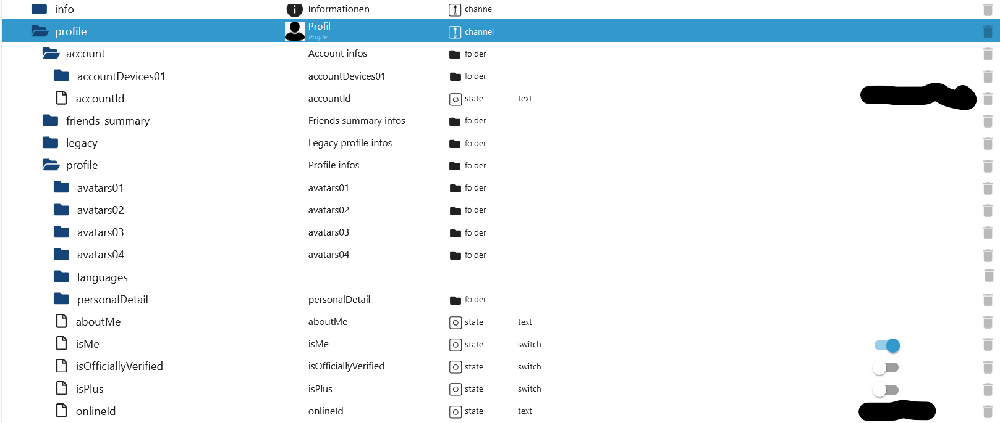

### Übersicht Objekte Gerät

[Zusammenfassung](#zusammenfassung)

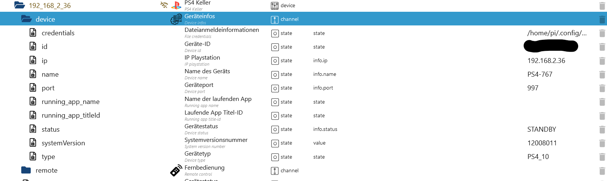

# Status JSON

[Zusammenfassung](#zusammenfassung)

```json
{
    "countRequest": 5, // Counter Abfragen der letzten 15 Minuten
    "maxRequest": 600, // Max. Anfragen pro 15 Minuten
    "periode": 900000, // 15 Minuten timestamp
    "timestamp": 1739475826546, // Start 15 Minuten Counter als timestamp
    "timeISO": "2025-02-13T19:43:46.546Z", // Start 15 Minuten Counter als ISO
    "request": "https://us-prof.np.community.playstation.net/userProfile/v1/users/Luna2008Lara/profile2", // Letzte GET/POST/PUT Request
    "lastRequest": "2025-02-13T19:43:47.501Z", // Letzte Request als ISO
    "npssoExired": 0, // NPSSO Token Ablaufdatum - Derzeit unbekannt
    "npssoNew": 0, // Start NPSSO Token Erstellung. Dieser soll nur einige Monate gültig sein und muss manuell erneuert werden
    "error": "NoError", // Letzte Fehlermeldung
    "lastError": "2025-02-10T18:51:32.930Z" // Datum letzte Fehlermeldung als ISO
}
```

# Array/JSON Beispiele

[Zusammenfassung](#zusammenfassung)

### Request mit AccountID `playstation.0.profile_remote_profile.account_id`

[Zusammenfassung](#zusammenfassung)</br>
[Remote PSN Profil](#objekte-remote_profile)

```json
{
    "onlineId": "Nickname",
    "personalDetail": {
        "firstName": "Name",
        "lastName": "Lastname"
    },
    "aboutMe": "",
    "avatars": [
        {
            "size": "s",
            "url": "http://static-resource.np.community.playstation.net/avatar_s/3RD/.png"
        },
        {
            "size": "xl",
            "url": "http://static-resource.np.community.playstation.net/avatar_xl/3RD/.png"
        },
        {
            "size": "l",
            "url": "http://static-resource.np.community.playstation.net/avatar/3RD/.png"
        },
        {
            "size": "m",
            "url": "http://static-resource.np.community.playstation.net/avatar_m/3RD/.png"
        }
    ],
    "languages": ["de-DE"],
    "isPlus": false,
    "isOfficiallyVerified": false,
    "isMe": true
}
```

### Request mit Online-ID `playstation.0.profile_remote_profile.online_id`

[Zusammenfassung](#zusammenfassung)</br>
[Remote PSN Profil](#objekte-remote_profile)

```json
{
    "profile": {
        "onlineId": "Nickname",
        "accountId": "111111111111111111",
        "npId": "THVuYTIwMDhdgfhfzhQRghzdmRl",
        "avatarUrls": [
            {
                "size": "l",
                "avatarUrl": "http://static-resource.np.community.playstation.net/avatar/3RD/.png"
            }
        ],
        "plus": 0,
        "aboutMe": "",
        "languagesUsed": ["de"],
        "trophySummary": {
            "level": 37,
            "progress": 75,
            "earnedTrophies": {
                "platinum": 0,
                "gold": 8,
                "silver": 15,
                "bronze": 69
            }
        },
        "isOfficiallyVerified": false,
        "personalDetail": {
            "firstName": "Name",
            "lastName": "Name"
        },
        "personalDetailSharing": "no",
        "personalDetailSharingRequestMessageFlag": false,
        "primaryOnlineStatus": "offline",
        "presences": [
            {
                "onlineStatus": "offline",
                "hasBroadcastData": false,
                "lastOnlineDate": "2025-01-11T00:30:22Z"
            }
        ],
        "friendRelation": "no",
        "requestMessageFlag": false,
        "blocking": false,
        "following": false,
        "consoleAvailability": {
            "availabilityStatus": "offline"
        }
    }
}
```

### Parameter

[Zusammenfassung](#zusammenfassung)</br>
[Remote PSN Profil](#objekte-remote_store)

Erst `playstation.0.profile_remote_store.products` aufrufen und aus dem JSON diesen Filter füllen. Danach erneut den Button `playstation.0.profile_remote_store.products` drücken

```json
{
    "pageArgs": {
        "size": 24, // Anzahl - Wie limit und offset
        "offset": 0 // Start - Wie limit und offset
    },
    "sortBy": null,
    "filterBy": ["storeDisplayClassification:PREMIUM_EDITION"],
    "facetOptions": []
}
```

### Request `playstation.0.profile_remote_store.featuresRetrieve`

[Zusammenfassung](#zusammenfassung)</br>
[Remote PSN Profil](#objekte-remote_store)

```json
{
    "tierSelectorOffersRetrieve": {
        "__typename": "SubscriptionOffers",
        "offers": [
            {
                "__typename": "SubscriptionOffer",
                "ctaLabel": "In den Einkaufswagen",
                "description": "Du zahlst monatlich. Das Abonnement läuft unbefristet, bis es gekündigt wird.",
                "hasPromotionOffer": false,
                "isActiveSubscription": false,
                "isTrial": false,
                "legalText": "Näheres zu Preisänderungen und zur Kündigung findest du in den <a href=\"https://www.playstation.com/legal/ps-plus-usage-terms/\" data-label=\"usageTerms\" target=\"_blank\">Nutzungsbedingungen</a>.",
                "nextRenewalDate": "17.3.2025",
                "price": {
                    "__typename": "SubscriptionPrice",
                    "basePrice": "€8,99",
                    "basePriceValue": 899,
                    "currencyCode": "EUR",
                    "discountText": "",
                    "discountType": "DISCOUNT_TYPE_DEFAULT",
                    "discountedPrice": "€8,99",
                    "discountedValue": 899,
                    "isFree": false,
                    "promotionEndDate": null,
                    "promotionStartDate": null
                },
                "skuId": "IP9102-PPSA06902_00-PLUS1T01M0000000-E002",
                "subscriptionDuration": "Monatsabonnement",
                "title": "1-Monats-Abonnement",
                "type": "SUBSCRIBE"
            },
            {
                "__typename": "SubscriptionOffer",
                "ctaLabel": "In den Einkaufswagen",
                "description": "Du zahlst alle 3 Monate. Das Abonnement läuft unbefristet, bis es gekündigt wird.",
                "hasPromotionOffer": false,
                "isActiveSubscription": false,
                "isTrial": false,
                "legalText": "Näheres zu Preisänderungen und zur Kündigung findest du in den <a href=\"https://www.playstation.com/legal/ps-plus-usage-terms/\" data-label=\"usageTerms\" target=\"_blank\">Nutzungsbedingungen</a>.",
                "nextRenewalDate": "17.5.2025",
                "price": {
                    "__typename": "SubscriptionPrice",
                    "basePrice": "€24,99",
                    "basePriceValue": 2499,
                    "currencyCode": "EUR",
                    "discountText": "",
                    "discountType": "DISCOUNT_TYPE_DEFAULT",
                    "discountedPrice": "€24,99",
                    "discountedValue": 2499,
                    "isFree": false,
                    "promotionEndDate": null,
                    "promotionStartDate": null
                },
                "skuId": "IP9102-PPSA06902_00-PLUS1T03M0000000-E002",
                "subscriptionDuration": "3-Monats-Abonnement",
                "title": "3-Monats-Abonnement",
                "type": "SUBSCRIBE"
            },
            {
                "__typename": "SubscriptionOffer",
                "ctaLabel": "In den Einkaufswagen",
                "description": "Du zahlst alle 12 Monate. Das Abonnement läuft unbefristet, bis es gekündigt wird.",
                "hasPromotionOffer": false,
                "isActiveSubscription": false,
                "isTrial": false,
                "legalText": "Näheres zu Preisänderungen und zur Kündigung findest du in den <a href=\"https://www.playstation.com/legal/ps-plus-usage-terms/\" data-label=\"usageTerms\" target=\"_blank\">Nutzungsbedingungen</a>.",
                "nextRenewalDate": "17.2.2026",
                "price": {
                    "__typename": "SubscriptionPrice",
                    "basePrice": "€71,99",
                    "basePriceValue": 7199,
                    "currencyCode": "EUR",
                    "discountText": "",
                    "discountType": "DISCOUNT_TYPE_DEFAULT",
                    "discountedPrice": "€71,99",
                    "discountedValue": 7199,
                    "isFree": false,
                    "promotionEndDate": null,
                    "promotionStartDate": null
                },
                "skuId": "IP9102-PPSA06902_00-PLUS1T12M0000000-E002",
                "subscriptionDuration": "12-Monats-Abonnement",
                "title": "12-Monats-Abonnement",
                "type": "SUBSCRIBE"
            }
        ]
    }
}
```

### Request `playstation.0.profile_remote_groups.loadFileData`

[Zusammenfassung](#zusammenfassung)</br>
[Remote PSN Gruppen](#objekte-remote_groups)

- Messages

```JSON
{
	"messageUid": "1#3981xxx8575",
	"messageType": 1011,
	"alternativeMessageType": 1,
	"body": "",
	"createdTimestamp": "1555180703000",
	"sender": {
		"accountId": "1126100000346479",
		"onlineId": "username"
	},
	"messageDetail": {
		"voiceMessageDetail": {
			"resourceId": "3210FxxxBD2F.5B0B4xxx55913_message_3981xxx8575_1555180703978",
			"playbackTime": 6
		}
	}
}
```

```JSON
{
    "MessageType": {
        "3": "Image",
        "210": "Video",
        "1011": "Audio",
    }
}
```

```JSON
["<groupId>", "<resourceId>", "<messageType>", "<saveInMeta>"]</br>
["~0FA0BD0F264CBD2F.5B0B4EA11A655913", "3210FxxxBD2F.5B0B4xxx55913_message_3981xxx8575_1555180703978", 1011, true] // true = Speichern in meta object (playstation.0)
```

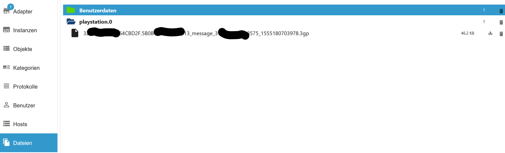

### Request `playstation.0.profile_remote_groups.loadGroups`

[Zusammenfassung](#zusammenfassung)</br>
[Remote PSN Gruppen](#objekte-remote_groups)

```json
{
    "groups": [
        {
            "groupId": "~0FA0xxxxxBD2F.5B0B4EA11A655913",
            "groupType": 0,
            "modifiedTimestamp": "1719100599882",
            "groupName": {
                "value": "",
                "status": 0
            },
            "groupIcon": {
                "status": 0
            },
            "joinedTimestamp": "1555154736000",
            "isFavorite": false,
            "existsNewArrival": false,
            "mainThread": {
                "threadId": "~0FA0xxxxxBD2F.5B0B4EA11A655913",
                "modifiedTimestamp": "1719100599882",
                "latestMessage": {
                    "messageUid": "1#44xxxxxx69930",
                    "messageType": 1,
                    "alternativeMessageType": 1,
                    "body": "G",
                    "createdTimestamp": "1719100599882",
                    "sender": {
                        "accountId": "112610000046479",
                        "onlineId": "Nickname"
                    }
                },
                "existsUnreadMessage": false
            },
            "members": [
                {
                    "accountId": "1719100599882",
                    "onlineId": "Nickname"
                },
                {
                    "accountId": "6560400000010131",
                    "onlineId": "Nickname"
                }
            ]
        },
        {
            "groupId": "e38d154e00000e1491b1bd82bb9c1aba4857-539",
            "groupType": 1,
            "modifiedTimestamp": "1703481177046",
            "groupName": {
                "value": "Discord.gg/x22 | modz.link",
                "status": 1,
                "modifier": {
                    "accountId": "7199080000864",
                    "onlineId": "mZN0000005wQ"
                },
                "modifiedTimestamp": "1644041589000"
            },
            "groupIcon": {
                "status": 0
            },
            "joinedTimestamp": "1644041585000",
            "isFavorite": false,
            "existsNewArrival": false,
            "mainThread": {
                "threadId": "e38d154e00000e1491b1bd82bb9c1aba4857-539",
                "modifiedTimestamp": "1703481177046",
                "latestMessage": {
                    "messageUid": "1#43000903",
                    "messageType": 1,
                    "alternativeMessageType": 1,
                    "body": "FELIZ Navidad PT",
                    "createdTimestamp": "1703481177046",
                    "sender": {
                        "accountId": "6560xxxxx451978",
                        "onlineId": "Nickname"
                    }
                },
                "existsUnreadMessage": true
            },
            "members": [
                {
                    "accountId": "656000010821014",
                    "onlineId": "Nickname"
                },
                {
                    "accountId": "65600000451978",
                    "onlineId": "Nickname"
                }
            ]
        },
        {
            "groupId": "a36f70000de9ed6dee629d33dcb4601ae379f-71",
            "groupType": 1,
            "modifiedTimestamp": "1702588783522",
            "groupName": {
                "value": "Free PSN Gift Cards",
                "status": 1,
                "modifier": {
                    "accountId": "595000005350695",
                    "onlineId": "Nickname"
                },
                "modifiedTimestamp": "1547344802000"
            },
            "groupIcon": {
                "status": 0
            },
            "joinedTimestamp": "1547344802000",
            "isFavorite": false,
            "existsNewArrival": false,
            "mainThread": {
                "threadId": "a36f70000de9ed6dee629d33dcb4601ae379f-71",
                "modifiedTimestamp": "1702588783522",
                "latestMessage": {
                    "messageUid": "1#435000008581820",
                    "messageType": 2002,
                    "alternativeMessageType": 2001,
                    "body": "xx.",
                    "createdTimestamp": "1702588783522",
                    "sender": {
                        "accountId": "8551000233923",
                        "onlineId": "Nickname"
                    }
                },
                "existsUnreadMessage": false
            },
            "members": [
                {
                    "accountId": "159500035000520",
                    "onlineId": "Nickname"
                },
                {
                    "accountId": "283600005100992",
                    "onlineId": "Nickname"
                }
            ]
        }
    ],
    "previousOffset": 0,
    "nextOffset": 5,
    "totalGroupCount": 59
}
```

### Request `playstation.0.profile_remote_groups.loadGroups_with_message`

[Zusammenfassung](#zusammenfassung)</br>
[Remote PSN Gruppen](#objekte-remote_groups)

```json
{
    "groups": [
        {
            "groupId": "~0FA0xxxxxBD2F.5B0B4EA11A655913",
            "groupType": 0,
            "modifiedTimestamp": "1719100599882",
            "groupName": {
                "value": "",
                "status": 0
            },
            "groupIcon": {
                "status": 0
            },
            "joinedTimestamp": "1555154736000",
            "isFavorite": false,
            "existsNewArrival": false,
            "mainThread": {
                "threadId": "~0FA0xxxxxBD2F.5B0B4EA11A655913",
                "modifiedTimestamp": "1719100599882",
                "latestMessage": {
                    "messageUid": "1#44xxxxxx69930",
                    "messageType": 1,
                    "alternativeMessageType": 1,
                    "body": "G",
                    "createdTimestamp": "1719100599882",
                    "sender": {
                        "accountId": "112610000046479",
                        "onlineId": "Nickname"
                    }
                },
                "existsUnreadMessage": false
            },
            "members": [
                {
                    "accountId": "1719100599882",
                    "onlineId": "Nickname"
                },
                {
                    "accountId": "6560400000010131",
                    "onlineId": "Nickname"
                }
            ]
        },
        {
            "groupId": "e38d154e00000e1491b1bd82bb9c1aba4857-539",
            "groupType": 1,
            "modifiedTimestamp": "1703481177046",
            "groupName": {
                "value": "Discord.gg/x22 | modz.link",
                "status": 1,
                "modifier": {
                    "accountId": "7199080000864",
                    "onlineId": "mZN0000005wQ"
                },
                "modifiedTimestamp": "1644041589000"
            },
            "groupIcon": {
                "status": 0
            },
            "joinedTimestamp": "1644041585000",
            "isFavorite": false,
            "existsNewArrival": false,
            "mainThread": {
                "threadId": "e38d154e00000e1491b1bd82bb9c1aba4857-539",
                "modifiedTimestamp": "1703481177046",
                "latestMessage": {
                    "messageUid": "1#43000903",
                    "messageType": 1,
                    "alternativeMessageType": 1,
                    "body": "FELIZ Navidad PT",
                    "createdTimestamp": "1703481177046",
                    "sender": {
                        "accountId": "6560xxxxx451978",
                        "onlineId": "Nickname"
                    }
                },
                "existsUnreadMessage": true
            },
            "members": [
                {
                    "accountId": "656000010821014",
                    "onlineId": "Nickname"
                },
                {
                    "accountId": "65600000451978",
                    "onlineId": "Nickname"
                }
            ]
        },
        {
            "groupId": "a36f70000de9ed6dee629d33dcb4601ae379f-71",
            "groupType": 1,
            "modifiedTimestamp": "1702588783522",
            "groupName": {
                "value": "Free PSN Gift Cards",
                "status": 1,
                "modifier": {
                    "accountId": "595000005350695",
                    "onlineId": "Nickname"
                },
                "modifiedTimestamp": "1547344802000"
            },
            "groupIcon": {
                "status": 0
            },
            "joinedTimestamp": "1547344802000",
            "isFavorite": false,
            "existsNewArrival": false,
            "mainThread": {
                "threadId": "a36f70000de9ed6dee629d33dcb4601ae379f-71",
                "modifiedTimestamp": "1702588783522",
                "latestMessage": {
                    "messageUid": "1#435000008581820",
                    "messageType": 2002,
                    "alternativeMessageType": 2001,
                    "body": "xx.",
                    "createdTimestamp": "1702588783522",
                    "sender": {
                        "accountId": "8551000233923",
                        "onlineId": "Nickname"
                    }
                },
                "existsUnreadMessage": false
            },
            "members": [
                {
                    "accountId": "159500035000520",
                    "onlineId": "Nickname"
                },
                {
                    "accountId": "283600005100992",
                    "onlineId": "Nickname"
                }
            ]
        }
    ],
    "previousOffset": 0,
    "nextOffset": 5,
    "totalGroupCount": 59,
    "message": {
        "messages": [
            {
                "messageUid": "1#440089753569930",
                "messageType": 1,
                "alternativeMessageType": 1,
                "body": "G",
                "createdTimestamp": "1719100599882",
                "sender": {
                    "accountId": "1126107779607346479",
                    "onlineId": "user"
                }
            },
            {
                "messageUid": "1#398100000018575",
                "messageType": 1011,
                "alternativeMessageType": 1,
                "body": "",
                "createdTimestamp": "1555180703000",
                "sender": {
                    "accountId": "112600000346479",
                    "onlineId": "user"
                },
                "messageDetail": {
                    "voiceMessageDetail": {
                        "resourceId": "3210FA0BD0F264CBD2F.00000_message_398126260218575_1555180703978",
                        "playbackTime": 6
                    }
                }
            },
            {
                "messageUid": "1#39000001974",
                "messageType": 1011,
                "alternativeMessageType": 1,
                "body": "",
                "createdTimestamp": "1555180620000",
                "sender": {
                    "accountId": "11260000346479",
                    "onlineId": "user"
                },
                "messageDetail": {
                    "voiceMessageDetail": {
                        "resourceId": "3210FA0BD0F264CBD2F.0000_message_398126238901974_1555180620710",
                        "playbackTime": 3
                    }
                }
            },
            {
                "messageUid": "1#39810000456442",
                "messageType": 1,
                "alternativeMessageType": 1,
                "body": "Bin in party",
                "createdTimestamp": "1555180611000",
                "sender": {
                    "accountId": "6560400010131",
                    "onlineId": "user"
                }
            }
        ],
        "previous": "1#398119612670854",
        "next": "1#440089753569930",
        "reachedEndOfPage": true,
        "messageCount": 16
    }
}
```

### Request `playstation.0.profile_remote_groups.sendGroupMessage`

[Zusammenfassung](#zusammenfassung)</br>
[Remote PSN Gruppen](#objekte-remote_groups)

```json
{
    "messageUid": "1#445148311714496",
    "createdTimestamp": "1738860592634"
}
```

### Request `playstation.0.profile_remote_groups.createGroup`

[Zusammenfassung](#zusammenfassung)</br>
[Remote PSN Gruppen](#objekte-remote_groups)

```json
{
    "groupId": "~335xxxxx.5B0B4EA11A655913",
    "mainThread": {
        "threadId": "~3357B7xxxxx.5B0B4EA11A655913"
    },
    "hasAllAccountInvited": true
}
```

### Request `playstation.0.profile_remote_groups.selectGroup`

[Zusammenfassung](#zusammenfassung)</br>
[Remote PSN Gruppen](#objekte-remote_groups)

```json
{
    "messages": [
        {
            "messageUid": "1#440089753569930",
            "messageType": 1,
            "alternativeMessageType": 1,
            "body": "G",
            "createdTimestamp": "1719100599882",
            "sender": {
                "accountId": "1126107779607346479",
                "onlineId": "user"
            }
        },
        {
            "messageUid": "1#398100000018575",
            "messageType": 1011,
            "alternativeMessageType": 1,
            "body": "",
            "createdTimestamp": "1555180703000",
            "sender": {
                "accountId": "112600000346479",
                "onlineId": "user"
            },
            "messageDetail": {
                "voiceMessageDetail": {
                    "resourceId": "3210FA0BD0F264CBD2F.00000_message_398126260218575_1555180703978",
                    "playbackTime": 6
                }
            }
        },
        {
            "messageUid": "1#39000001974",
            "messageType": 1011,
            "alternativeMessageType": 1,
            "body": "",
            "createdTimestamp": "1555180620000",
            "sender": {
                "accountId": "11260000346479",
                "onlineId": "user"
            },
            "messageDetail": {
                "voiceMessageDetail": {
                    "resourceId": "3210FA0BD0F264CBD2F.0000_message_398126238901974_1555180620710",
                    "playbackTime": 3
                }
            }
        },
        {
            "messageUid": "1#39810000456442",
            "messageType": 1,
            "alternativeMessageType": 1,
            "body": "Bin in party",
            "createdTimestamp": "1555180611000",
            "sender": {
                "accountId": "6560400010131",
                "onlineId": "user"
            }
        }
    ],
    "previous": "1#398119612670854",
    "next": "1#440089753569930",
    "reachedEndOfPage": true,
    "messageCount": 16
}
```

### Request `playstation.0.profile_remote_profile.received_requests_with_name`

[Zusammenfassung](#zusammenfassung)</br>
[Remote PSN Profil](#objekte-remote_profile)

```json
[
    {
        "accountId": "00000000000000000000",
        "onlineId": "Nickname",
        "relation": "requested",
        "personalDetailSharing": "none",
        "acceptSharingPersonalDetailFlag": false,
        "requestedDate": "2024-08-08T17:49:09.702Z"
    },
    {
        "accountId": "00000000000000000000",
        "onlineId": "Nickname",
        "relation": "requested",
        "personalDetailSharing": "requested",
        "personalDetail": {
            "firstName": "Peter",
            "middleName": "Pan",
            "lastName": "Pan"
        },
        "acceptSharingPersonalDetailFlag": true,
        "requestedDate": "2023-12-28T17:06:33.882Z"
    }
]
```

### Request `playstation.0.profile_remote_profile.presencesUser`

[Zusammenfassung](#zusammenfassung)</br>
[Remote PSN Gruppen](#objekte-remote_groups)

```json
{
    "basicPresence": {
        "availability": "unavailable",
        "lastAvailableDate": "2025-01-31T05:55:36.666Z",
        "primaryPlatformInfo": {
            "onlineStatus": "offline",
            "platform": "PS5",
            "lastOnlineDate": "2025-01-31T05:55:36.666Z"
        }
    }
}
```

### Request `playstation.0.profile_remote_profile.received_requests_without_name`

[Zusammenfassung](#zusammenfassung)</br>
[Remote PSN Profil](#objekte-remote_profile)

```json
[
    {
        "accountId": "00000000000000000000",
        "relation": "requested",
        "personalDetailSharing": "none",
        "acceptSharingPersonalDetailFlag": false,
        "requestedDate": "2024-08-08T17:49:09.702Z"
    },
    {
        "accountId": "00000000000000000000",
        "relation": "requested",
        "personalDetailSharing": "requested",
        "personalDetail": {
            "firstName": "Peter",
            "middleName": "Pan",
            "lastName": "Pan"
        },
        "acceptSharingPersonalDetailFlag": true,
        "requestedDate": "2023-12-28T17:06:33.882Z"
    }
]
```

### Request `playstation.0.profile_remote_profile.friends_without_name`

[Zusammenfassung](#zusammenfassung)</br>
[Remote PSN Profil](#objekte-remote_profile)

```json
["xxxx4105713269xxxx"]
```

### Request `playstation.0.profile_remote_profile.search_game`

[Zusammenfassung](#zusammenfassung)</br>
[Remote PSN Profil](#objekte-remote_profile)

```json
{
  "data": {
    "universalContextSearch": {
      "__typename": "UniversalContextSearchResponse",
      "queryFrequency": {
        "__typename": "QueryFrequency",
        "filterDebounceMs": 1000,
        "searchDebounceMs": 500
      },
      "results": [
        {
          "__typename": "UniversalDomainSearchResponse",
          "domain": "MobileGames",
          "domainTitle": "Full Games",
          "next": "CA8abQo6YWIzYjAzZDctZTZjZi00YjU3LWI2MzEtYzVjY2Y4MGYyMDIwLThOVG1SeWRKLTItMTcyNDY5NTIwMBIvc2VhcmNoLXJlbGV2YW5jeS1jb25jZXB0LWdhbWUtbWwtbW9kZWwtYmxhY2tleWUiHnNlYXJjaC5ub19leHBlcmltZW50Lm5vbi4wLm5vbioELTk0NA",
          "searchResults": [
            {
              "__typename": "SearchResultItem",
              "highlight": {
                "__typename": "ItemHighlight",
                "name": [
                  "",
                  "BATMAN",
                  "™: ARKHAM KNIGHT"
                ]
              },
              "id": "200472",
              "result": {
                "__typename": "Concept",
                "defaultProduct": {
                  "__typename": "Product",
                  "id": "UP1018-CUSA00133_00-BATMANARKHAMKNHT",
                  "invariantName": "Batman™: Arkham Knight",
                  "itemType": "CONCEPTPRODUCT",
                  "localizedStoreDisplayClassification": "Full Game",
                }
              }
            }
          ]
            <#-- truncated --#>
          "totalResultCount": 83,
          "zeroState": false
        }
      ]
    }
  }
}
```

### Request `playstation.0.profile_remote_profile.search_user`

[Zusammenfassung](#zusammenfassung)</br>
[Remote PSN Profil](#objekte-remote_profile)

Suche: username

```json
{
  "data": {
    "universalContextSearch": {
      "__typename": "UniversalContextSearchResponse",
      "queryFrequency": {
        "__typename": "QueryFrequency",
        "filterDebounceMs": 1000,
        "searchDebounceMs": 500
      },
      "results": [
        {
          "__typename": "UniversalDomainSearchResponse",
          "domain": "SocialAllAccounts",
          "domainTitle": "Players",
          "next": "eyJTTyI6MTV9",
          "searchResults": [
            {
              "__typename": "SearchResultItem",
              "highlight": {
                "__typename": "PlayerHighlight",
                "firstName": null,
                "lastName": null,
                "middleName": null,
                "onlineId": [
                  "",
                  "Username"
                ],
                "verifiedUserName": null
              },
              "id": "ABCxyz==",
              "result": {
                "__typename": "Player",
                "accountId": "0000000000000000000",
                "avatarUrl": "http://psn-rsc.prod.dl.playstation.net/psn-rsc/avatar/UT0016/CUSA06833_00-AV00000000000001_72E7CFC37BB24D706E60_l.png",
                "displayName": "Username",
                "displayNameHighlighted": [],
                "firstName": null,
                "id": "ABCxyz==",
                "isPsPlus": false,
                "itemType": "SOCIAL",
                "lastName": null,
                "middleName": null,
                "onlineId": "Username",
                "onlineIdHighlighted": [
                  "",
                  "Username"
                ],
                "profilePicUrl": null,
                "relationshipState": null
              },
              "resultOriginFlag": null
            },
          ]
            <#-- truncated --#>
          "totalResultCount": 128,
          "zeroState": false
        }
      ]
    }
  }
}
```

### Request `playstation.0.profile_remote_profile.storeWishlist`

[Zusammenfassung](#zusammenfassung)</br>
[Remote PSN Profil](#objekte-remote_profile)

```json
{
    "storeWishlist": []
}
```

### Request `playstation.0.profile_remote_profile.friends_with_name`

[Zusammenfassung](#zusammenfassung)</br>
[Remote PSN Profil](#objekte-remote_profile)

```json
[
    {
        "account_id": "xxxx4105713269xxxx",
        "online_id": "-xX_NICKNAME_Xx-"
    }
]
```

### Request `playstation.0.profile_remote_profile.friends_with_name_status`

[Zusammenfassung](#zusammenfassung)</br>
[Remote PSN Profil](#objekte-remote_profile)

```json
[
    {
        "account_id": "000000000000000000",
        "online_id": "USERNAME",
        "primaryOnlineStatus": "offline",
        "onlineStatus": "offline",
        "lastOnlineDate": "2023-05-13T13:03:26Z",
        "gameTitle": "",
        "availabilityStatus": "offline",
        "avatarUrl": "http://psn-rsc.prod.dl.playstation.net/psn-rsc/avatar/EP9000/CUSA00000_00-AV00000xxxx.png",
        "friendRelation": "friend"
    },
    {
        "account_id": "000000000000000000",
        "online_id": "USERNAME",
        "primaryOnlineStatus": "online",
        "onlineStatus": "online",
        "lastOnlineDate": "2025-01-20T16:44:16.215Z",
        "gameTitle": "Grand Theft Auto V",
        "availabilityStatus": "online",
        "avatarUrl": "http://psn-rsc.prod.dl.playstation.net/psn-rsc/avatar/EP9000/CUSA00000_00-AV00000xxxx.png",
        "friendRelation": "friend"
    }
]
```

### Request `playstation.0.profile_remote_trophies.trophy_title_group_user`

[Zusammenfassung](#zusammenfassung)</br>
[Remote PSN Trophäen](#objekte-remote_trophies)

Bekannte paltform: PS5, PS4, PS3, PSVita

```json
["<accountId>", "<npCommunicationId>", "<platform>"]

["01234567890123456", "NPWR13511_00", "PS4"]
```

```json
{
    "trophySetVersion": "01.04",
    "hiddenFlag": false,
    "progress": 12,
    "earnedTrophies": {
        "bronze": 9,
        "silver": 0,
        "gold": 0,
        "platinum": 0
    },
    "lastUpdatedDateTime": "2020-06-28T15:17:30Z",
    "trophyGroups": [
        {
            "trophyGroupId": "default",
            "progress": 12,
            "earnedTrophies": {
                "bronze": 9,
                "silver": 0,
                "gold": 0,
                "platinum": 0
            },
            "lastUpdatedDateTime": "2020-06-28T15:17:27Z"
        }
    ]
}
```

### Request `playstation.0.profile_remote_trophies.trophy_title_group`

[Zusammenfassung](#zusammenfassung)</br>
[Remote PSN Trophäen](#objekte-remote_trophies)

Bekannte paltform: PS5, PS4, PS3, PSVita

```json
["<npCommunicationId>", "<platform>"]

["NPWR13511_00", "PS4"]
```

```json
{
    "npServiceName": "trophy",
    "npCommunicationId": "NPWR13412_00",
    "trophySetVersion": "01.04",
    "trophyTitleName": "Fortnite",
    "trophyTitleDetail": "Trophies for Fortnite",
    "trophyTitleIconUrl": "https://image.api.playstation.com/trophy/np/NPWR13111_00_00F44396xxxxxxx.PNG",
    "trophyTitlePlatform": "PS4",
    "definedTrophies": {
        "bronze": 32,
        "silver": 10,
        "gold": 3,
        "platinum": 1
    },
    "trophyGroups": [
        {
            "trophyGroupId": "default",
            "trophyGroupName": "Fortnite",
            "trophyGroupDetail": "Trophies for Fortnite",
            "trophyGroupIconUrl": "https://image.api.playstation.com/trophy/np/NPWR13111_00_xxxxx.PNG",
            "definedTrophies": {
                "bronze": 32,
                "silver": 10,
                "gold": 3,
                "platinum": 1
            }
        }
    ]
}
```

### Request `playstation.0.profile_remote_trophies.trophies_game_help_for_title`

[Zusammenfassung](#zusammenfassung)</br>
[Remote PSN Trophäen](#objekte-remote_trophies)

```json
{
    "data": {
        "tipsRetrieve": {
            "__typename": "Tips",
            "hasAccess": true,
            "trophies": [
                {
                    "__typename": "TrophyTip",
                    "groups": [
                        {
                            "__typename": "TipGroup",
                            "groupId": null,
                            "groupName": null,
                            "tipContents": [
                                {
                                    "__typename": "TipContent",
                                    "description": "The gatcha prize you seek is inside a silver ball, but which one? You just have to keep playing to find out. ",
                                    "displayName": "Since 1995",
                                    "mediaId": "psn534f6d378d6841939cd709202c46a220",
                                    "mediaType": "VIDEO",
                                    "mediaUrl": "https://gms-ght.playstation-cloud.com/2/417ff4e103ec31d38e559f87ff12e53e131e1d2c/psn534f6d378d6841939cd709202c46a220/private/video/master_playlist.m3u8?token=redacted",
                                    "tipId": "NPWR20188_00__GATCHA_SECRET_H1"
                                }
                            ]
                        }
                    ],
                    "id": "NPWR20188_00::18",
                    "totalGroupCount": 1,
                    "trophyId": "18"
                }
            ]
        }
    }
}
```

### Request `playstation.0.profile_remote_trophies.trophies_game_help_available_for_title`

[Zusammenfassung](#zusammenfassung)</br>
[Remote PSN Trophäen](#objekte-remote_trophies)

```json
{
    "data": {
        "hintAvailabilityRetrieve": {
            "__typename": "HintAvailability",
            "trophies": [
                {
                    "__typename": "TrophyInfoWithHintAvailable",
                    "helpType": "HINT",
                    "id": "NPWR20188_00::18",
                    "trophyId": "18",
                    "udsObjectId": "GATCHA_SECRET"
                },
                {
                    "__typename": "TrophyInfoWithHintAvailable",
                    "helpType": "HINT",
                    "id": "NPWR20188_00::21",
                    "trophyId": "21",
                    "udsObjectId": "PLAZA_SEND_BOT_FLYING"
                },
                {
                    "__typename": "TrophyInfoWithHintAvailable",
                    "helpType": "HINT",
                    "id": "NPWR20188_00::22",
                    "trophyId": "22",
                    "udsObjectId": "PLAZA_WALK_AROUND_BOT"
                },
                {
                    "__typename": "TrophyInfoWithHintAvailable",
                    "helpType": "HINT",
                    "id": "NPWR20188_00::23",
                    "trophyId": "23",
                    "udsObjectId": "LABO_PUNCH_AND_SPIN_PS2LOGO"
                },
                {
                    "__typename": "TrophyInfoWithHintAvailable",
                    "helpType": "HINT",
                    "id": "NPWR20188_00::25",
                    "trophyId": "25",
                    "udsObjectId": "LABO_LOOK_INTO_PSVR"
                },
                {
                    "__typename": "TrophyInfoWithHintAvailable",
                    "helpType": "HINT",
                    "id": "NPWR20188_00::26",
                    "trophyId": "26",
                    "udsObjectId": "LABO_RIDE_AIM_CONTROLLER"
                },
                {
                    "__typename": "TrophyInfoWithHintAvailable",
                    "helpType": "HINT",
                    "id": "NPWR20188_00::27",
                    "trophyId": "27",
                    "udsObjectId": "LABO_WALK_HOME_ICON"
                },
                {
                    "__typename": "TrophyInfoWithHintAvailable",
                    "helpType": "HINT",
                    "id": "NPWR20188_00::28",
                    "trophyId": "28",
                    "udsObjectId": "LABO_OPEN_PS1"
                },
                {
                    "__typename": "TrophyInfoWithHintAvailable",
                    "helpType": "HINT",
                    "id": "NPWR20188_00::29",
                    "trophyId": "29",
                    "udsObjectId": "COOLING_JUGGLE_BALL_WITH_FROG"
                },
                {
                    "__typename": "TrophyInfoWithHintAvailable",
                    "helpType": "HINT",
                    "id": "NPWR20188_00::30",
                    "trophyId": "30",
                    "udsObjectId": "COOLING_DIVED_FROM_DIVING_BOARD"
                },
                {
                    "__typename": "TrophyInfoWithHintAvailable",
                    "helpType": "HINT",
                    "id": "NPWR20188_00::31",
                    "trophyId": "31",
                    "udsObjectId": "COOLING_JUMP_IN_FOUNTAIN"
                },
                {
                    "__typename": "TrophyInfoWithHintAvailable",
                    "helpType": "HINT",
                    "id": "NPWR20188_00::32",
                    "trophyId": "32",
                    "udsObjectId": "COOLING_JUMP_ATTACK"
                },
                {
                    "__typename": "TrophyInfoWithHintAvailable",
                    "helpType": "HINT",
                    "id": "NPWR20188_00::33",
                    "trophyId": "33",
                    "udsObjectId": "MEMORY_AWAY_FROM_RAIN"
                },
                {
                    "__typename": "TrophyInfoWithHintAvailable",
                    "helpType": "HINT",
                    "id": "NPWR20188_00::34",
                    "trophyId": "34",
                    "udsObjectId": "MEMORY_HIT_FLYING_CAN"
                },
                {
                    "__typename": "TrophyInfoWithHintAvailable",
                    "helpType": "HINT",
                    "id": "NPWR20188_00::35",
                    "trophyId": "35",
                    "udsObjectId": "MEMORY_GOT_STRIKE"
                },
                {
                    "__typename": "TrophyInfoWithHintAvailable",
                    "helpType": "HINT",
                    "id": "NPWR20188_00::36",
                    "trophyId": "36",
                    "udsObjectId": "GPU_DEFLECT_SPTR_BLT_WITH_ARROW"
                },
                {
                    "__typename": "TrophyInfoWithHintAvailable",
                    "helpType": "HINT",
                    "id": "NPWR20188_00::37",
                    "trophyId": "37",
                    "udsObjectId": "GPU_MADE_HUGE_SNOWBALL"
                },
                {
                    "__typename": "TrophyInfoWithHintAvailable",
                    "helpType": "HINT",
                    "id": "NPWR20188_00::38",
                    "trophyId": "38",
                    "udsObjectId": "GPU_CATCH_THE_CLIFF_AFTER_FALL"
                },
                {
                    "__typename": "TrophyInfoWithHintAvailable",
                    "helpType": "HINT",
                    "id": "NPWR20188_00::39",
                    "trophyId": "39",
                    "udsObjectId": "GPU_HIT_RABBIT_WITH_ARROW"
                },
                {
                    "__typename": "TrophyInfoWithHintAvailable",
                    "helpType": "HINT",
                    "id": "NPWR20188_00::40",
                    "trophyId": "40",
                    "udsObjectId": "SSD_SPIN_WHILE_SHOOT_MACHINE_GUN"
                },
                {
                    "__typename": "TrophyInfoWithHintAvailable",
                    "helpType": "HINT",
                    "id": "NPWR20188_00::42",
                    "trophyId": "42",
                    "udsObjectId": "LABO_PUNCH_COMPANY_LOGO"
                },
                {
                    "__typename": "TrophyInfoWithHintAvailable",
                    "helpType": "HINT",
                    "id": "NPWR20188_00::45",
                    "trophyId": "45",
                    "udsObjectId": "DAY1__GRAVITY_DAZE"
                }
            ]
        }
    }
}
```

### Request `playstation.0.profile_remote_trophies.trophy_title`

[Zusammenfassung](#zusammenfassung)</br>
[Remote PSN Trophäen](#objekte-remote_trophies)

```json
{
    "trophyTitles": [
        {
            "npServiceName": "trophy",
            "npCommunicationId": "NPWR13511_00", // npCommunicationId
            "trophySetVersion": "01.00",
            "trophyTitleName": "Nidhogg 2",
            "trophyTitleDetail": "Trophies for Nidhogg 2",
            "trophyTitleIconUrl": "https://image.api.playstation.com/trophy/np/NPWR13511_00_00FFFxxxxx.PNG",
            "trophyTitlePlatform": "PS4",
            "hasTrophyGroups": false,
            "trophyGroupCount": 1,
            "definedTrophies": {
                "bronze": 7,
                "silver": 6,
                "gold": 0,
                "platinum": 0
            },
            "progress": 5,
            "earnedTrophies": {
                "bronze": 1,
                "silver": 0,
                "gold": 0,
                "platinum": 0
            },
            "hiddenFlag": false,
            "lastUpdatedDateTime": "2022-08-17T17:19:07Z"
        }
    ],
    "nextOffset": 100,
    "totalItemCount": 127
}
```

### Request `playstation.0.profile_remote_trophies.trophy_all`

[Zusammenfassung](#zusammenfassung)</br>
[Remote PSN Trophäen](#objekte-remote_trophies)

```json
[
    {
        "gameName": "Nidhogg 2",
        "platform": "PS4",
        "trophyTypeCounts": {
            "bronze": 7,
            "silver": 6,
            "gold": 0,
            "platinum": 0
        },
        "earnedCounts": {
            "bronze": 1,
            "silver": 0,
            "gold": 0,
            "platinum": 0
        },
        "trophyList": [
            {
                "isEarned": false,
                "earnedOn": "unearned",
                "type": "silver",
                "rarity": "Common",
                "earnedRate": 51.3,
                "trophyName": "Bloodlust",
                "groupId": "default"
            },
            {
                "isEarned": false,
                "earnedOn": "unearned",
                "type": "bronze",
                "rarity": "Common",
                "earnedRate": 51.7,
                "trophyName": "Comeback Kid",
                "groupId": "default"
            },
            {
                "isEarned": false,
                "earnedOn": "unearned",
                "type": "silver",
                "rarity": "Very Rare",
                "earnedRate": 9.9,
                "trophyName": "Flesh and Blood",
                "groupId": "default"
            },
            {
                "isEarned": false,
                "earnedOn": "unearned",
                "type": "silver",
                "rarity": "Very Rare",
                "earnedRate": 6.1,
                "trophyName": "Domination",
                "groupId": "default"
            },
            {
                "isEarned": false,
                "earnedOn": "unearned",
                "type": "silver",
                "rarity": "Ultra Rare",
                "earnedRate": 0.1,
                "trophyName": "Hogglike",
                "groupId": "default"
            },
            {
                "isEarned": false,
                "earnedOn": "unearned",
                "type": "bronze",
                "rarity": "Ultra Rare",
                "earnedRate": 3.2,
                "trophyName": "Slow Played",
                "groupId": "default"
            },
            {
                "isEarned": false,
                "earnedOn": "unearned",
                "type": "bronze",
                "rarity": "Very Rare",
                "earnedRate": 14.7,
                "trophyName": "Trapped in Donkeyspace",
                "groupId": "default"
            },
            {
                "isEarned": false,
                "earnedOn": "unearned",
                "type": "silver",
                "rarity": "Ultra Rare",
                "earnedRate": 0.9,
                "trophyName": "Algorithms",
                "groupId": "default"
            },
            {
                "isEarned": false,
                "earnedOn": "unearned",
                "type": "bronze",
                "rarity": "Ultra Rare",
                "earnedRate": 0.8,
                "trophyName": "Old School",
                "groupId": "default"
            },
            {
                "isEarned": false,
                "earnedOn": "unearned",
                "type": "bronze",
                "rarity": "Rare",
                "earnedRate": 40.6,
                "trophyName": "Memories",
                "groupId": "default"
            },
            {
                "isEarned": true,
                "earnedOn": "2022-08-17T17:19:04Z",
                "type": "bronze",
                "rarity": "Common",
                "earnedRate": 83.7,
                "trophyName": "Self Sacrifice",
                "groupId": "default"
            },
            {
                "isEarned": false,
                "earnedOn": "unearned",
                "type": "bronze",
                "rarity": "Ultra Rare",
                "earnedRate": 1,
                "trophyName": "GTD",
                "groupId": "default"
            },
            {
                "isEarned": false,
                "earnedOn": "unearned",
                "type": "silver",
                "rarity": "Ultra Rare",
                "earnedRate": 0.1,
                "trophyName": "Valkyrie",
                "groupId": "default"
            }
        ]
    }
]
```

### Request `playstation.0.profile_remote_trophies.trophies_for_title`

[Zusammenfassung](#zusammenfassung)</br>
[Remote PSN Trophäen](#objekte-remote_trophies)

Bekannte groupid: VeryRare, UltraRare, Rare, Common, all</br>
Bekannte paltform: PS5, PS4, PS3, PSVita

```json
["<npCommunicationId>", "<groupId>", "<platform>"]

["NPWR13511_00", "all", "PS4"]
```

```json
{
    "trophySetVersion": "01.04",
    "hasTrophyGroups": false,
    "trophies": [
        {
            "trophyId": 0,
            "trophyHidden": false,
            "trophyType": "platinum",
            "trophyName": "Hero of the Storm",
            "trophyDetail": "Earn all other Fortnite trophies to collect this trophy",
            "trophyIconUrl": "https://image.api.playstation.com/trophy/np/NPWR13111_00_00Fxxxx.PNG",
            "trophyGroupId": "default"
        }
    ],
    "totalItemCount": 46
}
```

### Request `playstation.0.profile_remote_trophies.trophies_earned_for_title`

[Zusammenfassung](#zusammenfassung)</br>
[Remote PSN Trophäen](#objekte-remote_trophies)

Bekannte groupid: VeryRare, UltraRare, Rare, Common, all</br>
Bekannte paltform: PS5, PS4, PS3, PSVita

```json
["<accountId>", "<npCommunicationId>", "<groupId>", "<platform>"]

["0123456789", "NPWR13511_00", "all", "PS4"]
```

```json
{
    "trophySetVersion": "01.04",
    "hasTrophyGroups": false,
    "lastUpdatedDateTime": "2020-06-28T15:17:30Z",
    "trophies": [
        {
            "trophyId": 0,
            "trophyHidden": false,
            "earned": false,
            "trophyType": "platinum",
            "trophyRare": 0,
            "trophyEarnedRate": "0.1"
        }
    ],
    "totalItemCount": 46
}
```

### Request `playstation.0.profile_remote_profile.gameList`

[Zusammenfassung](#zusammenfassung)</br>
[Remote PSN Profil](#objekte-remote_profile)

```json
{
    "titles": [
        {
            "titleId": "CUSA07669_00", // title-id
            "name": "Fortnite",
            "localizedName": "Fortnite",
            "imageUrl": "https://image.api.playstation.com/vulcan/ap/rnd/202412/2017/2bb1f425090006f8c5c3c3cab094809ccce8fa6f2531a8d6.png",
            "localizedImageUrl": "https://image.api.playstation.com/vulcan/ap/rnd/202412/2017/2bb1f425090006f8c5c3c3cab094809ccce8fa6f2531a8d6.png",
            "category": "ps4_game",
            "service": "none_purchased",
            "playCount": 421,
            "concept": {
                "id": 228748,
                "titleIds": [
                    "PPSA01923_00", // title-id
                    "CUSA14351_00", // title-id
                    "PPSA01922_00", // title-id
                    "CUSA07022_00", // title-id
                    "CUSA07669_00", // title-id
                    "CUSA17471_00" // title-id
                ],
                "name": "Fortnite",
                "media": {
                    "audios": [],
                    "videos": [],
                    "images": [
                        {
                            "url": "https://image.api.playstation.com/vulcan/ap/rnd/202412/2018/f1178b86ec7a160d53a8226c98f0cfdef57c3314375e0608.jpg",
                            "format": "UNKNOWN",
                            "type": "BACKGROUND_LAYER_ART"
                        },
                        {
                            "url": "https://image.api.playstation.com/vulcan/ap/rnd/202412/2017/b0ff7200df4e0da75eeb8a1d25897f5933c9da42e138d356.jpg",
                            "format": "UNKNOWN",
                            "type": "FOUR_BY_THREE_BANNER"
                        },
                        {
                            "url": "https://image.api.playstation.com/vulcan/ap/rnd/202412/2017/f455931bc78a248240cedaaf0dfdbdd0f5b78a92d6a24a10.jpg",
                            "format": "UNKNOWN",
                            "type": "GAMEHUB_COVER_ART"
                        },
                        {
                            "url": "https://image.api.playstation.com/vulcan/ap/rnd/202412/2018/a9074e77f33fc6e2130c4aa3495463b806fcca15bdbcef5d.png",
                            "format": "UNKNOWN",
                            "type": "HERO_CHARACTER"
                        },
                        {
                            "url": "https://image.api.playstation.com/vulcan/ap/rnd/202311/2801/1f75cdb78298222e0822afe62305e1889e137bb61bcf4409.png",
                            "format": "UNKNOWN",
                            "type": "LOGO"
                        },
                        {
                            "url": "https://image.api.playstation.com/vulcan/ap/rnd/202412/2017/1c71e79131e33c9662739b378f4729cd22c64087a842612d.jpg",
                            "format": "UNKNOWN",
                            "type": "PORTRAIT_BANNER"
                        },
                        {
                            "url": "https://image.api.playstation.com/vulcan/ap/rnd/202412/2017/1e0268a07a45394bb37237252ee774e40833a63e2ab34179.jpg",
                            "format": "UNKNOWN",
                            "type": "SCREENSHOT"
                        },
                        {
                            "url": "https://image.api.playstation.com/vulcan/ap/rnd/202412/2017/19acc843fc64e9f4dc942267beb50fdea7588de96aaf4502.jpg",
                            "format": "UNKNOWN",
                            "type": "SCREENSHOT"
                        },
                        {
                            "url": "https://image.api.playstation.com/vulcan/ap/rnd/202412/1117/47e75b10615f1a1b84119a92bf9894d0a6825f0851ce704f.jpg",
                            "format": "UNKNOWN",
                            "type": "SCREENSHOT"
                        },
                        {
                            "url": "https://image.api.playstation.com/vulcan/ap/rnd/202412/2017/ee543a7a838dd0d848b48bbb3687a10665f536ba307ee592.jpg",
                            "format": "UNKNOWN",
                            "type": "SCREENSHOT"
                        },
                        {
                            "url": "https://image.api.playstation.com/vulcan/ap/rnd/202411/2922/4e9abc99205ed83c3ebf320f6a4ff9f45e5fe612b7301134.jpg",
                            "format": "UNKNOWN",
                            "type": "SCREENSHOT"
                        },
                        {
                            "url": "https://image.api.playstation.com/vulcan/ap/rnd/202410/3013/e263b2b313e4a7c2f8e15254bf0b8587f406a1470e2b6cf9.jpg",
                            "format": "UNKNOWN",
                            "type": "SCREENSHOT"
                        },
                        {
                            "url": "https://image.api.playstation.com/vulcan/ap/rnd/202410/3013/b81746f16582e6b80c941f558b5ed15dbf8955fc5adce907.jpg",
                            "format": "UNKNOWN",
                            "type": "SCREENSHOT"
                        },
                        {
                            "url": "https://image.api.playstation.com/vulcan/ap/rnd/202412/2017/2bb1f425090006f8c5c3c3cab094809ccce8fa6f2531a8d6.png",
                            "format": "UNKNOWN",
                            "type": "MASTER"
                        }
                    ]
                },
                "genres": ["ACTION", "ADVENTURE"],
                "localizedName": {
                    "defaultLanguage": "en-US",
                    "metadata": {
                        "fi-FI": "Fortnite",
                        "uk-UA": "Fortnite",
                        "de-DE": "Fortnite",
                        "en-US": "Fortnite",
                        "ko-KR": "Fortnite",
                        "pt-BR": "Fortnite",
                        "es-ES": "Fortnite",
                        "ar-AE": "Fortnite",
                        "no-NO": "Fortnite",
                        "fr-CA": "Fortnite",
                        "it-IT": "Fortnite",
                        "pl-PL": "Fortnite",
                        "ru-RU": "Fortnite",
                        "nl-NL": "Fortnite",
                        "pt-PT": "Fortnite",
                        "sv-SE": "Fortnite",
                        "da-DK": "Fortnite",
                        "tr-TR": "Fortnite",
                        "fr-FR": "Fortnite",
                        "en-GB": "Fortnite",
                        "es-419": "Fortnite",
                        "ja-JP": "Fortnite"
                    }
                },
                "country": "DE",
                "language": "de"
            },
            "media": {
                "audios": [],
                "videos": [],
                "images": [
                    {
                        "url": "https://image.api.playstation.com/vulcan/ap/rnd/202412/2018/f1178b86ec7a160d53a8226c98f0cfdef57c3314375e0608.jpg",
                        "format": "UNKNOWN",
                        "type": "BACKGROUND_LAYER_ART"
                    },
                    {
                        "url": "https://image.api.playstation.com/vulcan/ap/rnd/202412/2017/b0ff7200df4e0da75eeb8a1d25897f5933c9da42e138d356.jpg",
                        "format": "UNKNOWN",
                        "type": "FOUR_BY_THREE_BANNER"
                    },
                    {
                        "url": "https://image.api.playstation.com/vulcan/ap/rnd/202412/2017/f455931bc78a248240cedaaf0dfdbdd0f5b78a92d6a24a10.jpg",
                        "format": "UNKNOWN",
                        "type": "GAMEHUB_COVER_ART"
                    },
                    {
                        "url": "https://image.api.playstation.com/vulcan/ap/rnd/202412/2018/a9074e77f33fc6e2130c4aa3495463b806fcca15bdbcef5d.png",
                        "format": "UNKNOWN",
                        "type": "HERO_CHARACTER"
                    },
                    {
                        "url": "https://image.api.playstation.com/vulcan/ap/rnd/202311/2801/1f75cdb78298222e0822afe62305e1889e137bb61bcf4409.png",
                        "format": "UNKNOWN",
                        "type": "LOGO"
                    },
                    {
                        "url": "https://image.api.playstation.com/vulcan/ap/rnd/202412/2017/1c71e79131e33c9662739b378f4729cd22c64087a842612d.jpg",
                        "format": "UNKNOWN",
                        "type": "PORTRAIT_BANNER"
                    },
                    {
                        "url": "https://image.api.playstation.com/vulcan/ap/rnd/202412/2017/1e0268a07a45394bb37237252ee774e40833a63e2ab34179.jpg",
                        "format": "UNKNOWN",
                        "type": "SCREENSHOT"
                    },
                    {
                        "url": "https://image.api.playstation.com/vulcan/ap/rnd/202412/2017/19acc843fc64e9f4dc942267beb50fdea7588de96aaf4502.jpg",
                        "format": "UNKNOWN",
                        "type": "SCREENSHOT"
                    },
                    {
                        "url": "https://image.api.playstation.com/vulcan/ap/rnd/202412/1117/47e75b10615f1a1b84119a92bf9894d0a6825f0851ce704f.jpg",
                        "format": "UNKNOWN",
                        "type": "SCREENSHOT"
                    },
                    {
                        "url": "https://image.api.playstation.com/vulcan/ap/rnd/202412/2017/ee543a7a838dd0d848b48bbb3687a10665f536ba307ee592.jpg",
                        "format": "UNKNOWN",
                        "type": "SCREENSHOT"
                    },
                    {
                        "url": "https://image.api.playstation.com/vulcan/ap/rnd/202411/2922/4e9abc99205ed83c3ebf320f6a4ff9f45e5fe612b7301134.jpg",
                        "format": "UNKNOWN",
                        "type": "SCREENSHOT"
                    },
                    {
                        "url": "https://image.api.playstation.com/vulcan/ap/rnd/202410/3013/e263b2b313e4a7c2f8e15254bf0b8587f406a1470e2b6cf9.jpg",
                        "format": "UNKNOWN",
                        "type": "SCREENSHOT"
                    },
                    {
                        "url": "https://image.api.playstation.com/vulcan/ap/rnd/202410/3013/b81746f16582e6b80c941f558b5ed15dbf8955fc5adce907.jpg",
                        "format": "UNKNOWN",
                        "type": "SCREENSHOT"
                    },
                    {
                        "url": "https://image.api.playstation.com/vulcan/ap/rnd/202412/2017/2bb1f425090006f8c5c3c3cab094809ccce8fa6f2531a8d6.png",
                        "format": "UNKNOWN",
                        "type": "MASTER"
                    }
                ]
            },
            "firstPlayedDateTime": "2017-10-18T16:11:01.810000Z",
            "lastPlayedDateTime": "2022-06-04T20:38:59.690000Z",
            "playDuration": "PT276H1M8S"
        }
    ],
    "nextOffset": 10,
    "previousOffset": 0,
    "totalItemCount": 154
}
```

### Request `playstation.0.profile_remote_profile.gameTitle`

[Zusammenfassung](#zusammenfassung)</br>
[Remote PSN Profil](#objekte-remote_profile)

```json
[
    {
        "id": 228748,
        "nameEn": "Fortnite",
        "media": {},
        "descriptions": [
            {
                "type": "COMPATIBILITY_NOTICE",
                "desc": "In-game purchases optional<br/>Online play required<br/>Vibration function and trigger effect required (DualSense wireless controller)<br/>99 network players<br/>PS5 Pro Enhanced<br/>PS4 Pro Enhanced<br/>DUALSHOCK 4 vibration"
            }
        ],
        "categorizedProducts": [],
        "titleIds": ["PPSA01923_00", "CUSA14351_00", "PPSA01922_00", "CUSA07022_00", "CUSA07669_00", "CUSA17471_00"],
        "country": "",
        "language": "",
        "type": "GAME",
        "localizedName": {
            "defaultLanguage": "en-US",
            "metadata": {
                "fi-FI": "Fortnite",
                "uk-UA": "Fortnite",
                "de-DE": "Fortnite",
                "en-US": "Fortnite",
                "ko-KR": "Fortnite",
                "pt-BR": "Fortnite",
                "es-ES": "Fortnite",
                "ar-AE": "Fortnite",
                "no-NO": "Fortnite",
                "fr-CA": "Fortnite",
                "it-IT": "Fortnite",
                "pl-PL": "Fortnite",
                "ru-RU": "Fortnite",
                "nl-NL": "Fortnite",
                "pt-PT": "Fortnite",
                "sv-SE": "Fortnite",
                "da-DK": "Fortnite",
                "tr-TR": "Fortnite",
                "fr-FR": "Fortnite",
                "en-GB": "Fortnite",
                "es-419": "Fortnite",
                "ja-JP": "Fortnite"
            }
        },
        "localizedSearchAndSortName": {
            "defaultLanguage": "en-US",
            "metadata": {
                "ko-KR": "Fortnite",
                "ja-JP": "ふぉーとないとFortnite"
            }
        },
        "localizedDescriptions": {
            "defaultLanguage": "en-US",
            "metadata": {
                "fi-FI": [
                    {
                        "desc": "Pelaa Fortnitea omalla tavallasi. <br/><br/>Yritä selvitä viimeiseksi eloonjääneeksi Battle Royalessa, Zero Buildissa, Reloadissa ja Fortnite OG:ssä, tutustu LEGO Fortnite -kokemuksiin, kiidä maaliin Rocket Racingissa tai esiinny keikalla Fortnite Festivalissa. Voit pelata kavereidesi kanssa tuhansilla ilmaisilla, sisällönluojien tekemillä saarilla. Tarjolla on death runeja, tycooneja, kilpa-ajoja, zombiselviytymistä ja paljon muuta! Voit myös liittyä sisällönluojien yhteisöön ja rakentaa oman saaresi Unreal Editor for Fortnitella (UEFN) tai Fortnite Creativen työkaluilla.<br/><br/>Jokaisella Fortniten saarella on oma ikäluokituksensa, joten löydät aina itsellesi ja kavereillesi sopivan. Kaiken tämän löydät Fortnitesta!",
                        "type": "LONG"
                    },
                    {
                        "desc": "© 2024 Epic Games, Inc. Kaikki oikeudet pidätetään. Epic, Epic Games, Epic Games -tunnus, Unreal, Unreal Engine, UE5, Unreal Engine -tunnus, Fortnite, Fortnite-tunnus, Fortnite Festival ja Rocket Racing ovat Epic Games, Inc:n tavaramerkkejä tai rekisteröityjä tavaramerkkejä Yhdysvalloissa ja muualla. Rocket League © 2024 Psyonix LLC. LEGO ja LEGO-tunnus ovat LEGO Groupin tavaramerkkejä. © 2024 LEGO Group. Kaikki muut tavaramerkit ovat omistajiensa omaisuutta.",
                        "type": "LEGAL"
                    }
                ],
                "uk-UA": [
                    {
                        "desc": "Грайте у Fortnite по-своєму. <br/><br/>Станьте останнім гравцем, що вижив, у Battle Royale, Zero Build, Reload та Fortnite OG, досліджуйте світ LEGO Fortnite, проривайтеся до фінішу у Rocket Racing або станьте хедлайнером концерту у Fortnite Festival. Грайте разом із друзями на тисячах авторських безкоштовних островів у режимах Deathrun, Tycoon, Racing, Zombie Survival та інших! Приєднуйтеся до спільноти авторів і створіть власний острів разом із Unreal Editor for Fortnite (UEFN) або інструментами Fortnite Creative.<br/><br/>Кожен острів у Fortnite має власний віковий рейтинг, і тому завжди можна знайти саме той, який підійде вам і вашим друзям. Знайдіть це все у Fortnite!",
                        "type": "LONG"
                    },
                    {
                        "desc": "©2024 Epic Games, Inc. Усі права збережені. Epic, Epic Games, логотип Epic Games, Unreal, Unreal Engine, UE5, логотип Unreal Engine, Fortnite, логотип Fortnite, Fortnite Festival і Rocket Racing є торговими знаками або зареєстрованими торговими знаками Epic Games, Inc. у США і усьому іншому світі. Rocket League ©2024 Psyonix LLC. LEGO і логотип LEGO є торговими знаками LEGO Group. ©2024 LEGO Group. Усі інші торгові знаки є власністю їх відповідних власників.",
                        "type": "LEGAL"
                    }
                ],
                "de-DE": [
                    {
                        "desc": "Spiele Fortnite auf deine Weise. <br/><br/>Überlebe bis zuletzt in Battle Royale, Null Bauen, Reload und Fortnite OG, erkunde LEGO Fortnite-Erlebnisse, rase in Rocket Racing bis zur Ziellinie oder gib in Fortnite Festival ein Konzert. Spiele Tausende kostenlose, von Creators erstellte Inseln mit Freunden, darunter Deathruns, Tycoon-Spiele, Rennspiele, Zombie-Survival-Spiele und mehr! Werde Teil der Creator-Community und erstelle deine eigene Insel mit Unreal Editor für Fortnite (UEFN) oder den Werkzeugen des Fortnite-Kreativmodus.<br/><br/>Jede Fortnite-Insel verfügt über eine eigene Alterseinstufung, sodass du genau die finden kannst, die zu dir und deinen Freunden passt. All das erwartet dich in Fortnite!",
                        "type": "LONG"
                    },
                    {
                        "desc": "©2024 Epic Games, Inc. Alle Rechte vorbehalten. Epic, Epic Games, das Logo von Epic Games, Unreal, Unreal Engine, UE5, das Logo von Unreal Engine, Fortnite, das Logo von Fortnite, Fortnite Festival und Rocket Racing sind Handelsmarken oder eingetragene Handelsmarken von Epic Games, Inc. in den USA wie anderenorts. Rocket League ©2024 Psyonix LLC. LEGO und das Logo von LEGO sind Handelsmarken von The LEGO Group. ©2024 The LEGO Group. Alle anderen Handelsmarken sind Eigentum ihrer jeweiligen Rechteinhaber.",
                        "type": "LEGAL"
                    }
                ],
                "en-US": [
                    {
                        "desc": "Play Fortnite your way. <br/><br/>Be the last player standing in Battle Royale, Zero Build, Reload, and Fortnite OG, explore LEGO Fortnite experiences, blast to the finish with Rocket Racing or headline a concert with Fortnite Festival. Play thousands of free creator made islands with friends including deathruns, tycoons, racing, zombie survival and more! Join the creator community and build your own island with Unreal Editor for Fortnite (UEFN) or Fortnite Creative tools.<br/><br/>Each Fortnite island has an individual age rating so you can find the one that's right for you and your friends. Find it all in Fortnite!",
                        "type": "LONG"
                    },
                    {
                        "desc": "©2024 Epic Games, Inc. All rights reserved. Epic, Epic Games, the Epic Games logo, Unreal, Unreal Engine, UE5, the Unreal Engine logo, Fortnite, the Fortnite logo, Fortnite Festival, and Rocket Racing are trademarks or registered trademarks of Epic Games, Inc. in the USA and elsewhere. Rocket League ©2024 Psyonix LLC. LEGO and the LEGO logo are trademarks of the LEGO Group. ©2024 The LEGO Group. All other trademarks are the property of their respective owners.",
                        "type": "LEGAL"
                    }
                ],
                "ko-KR": [
                    {
                        "desc": "원하는 방식으로 포트나이트를 플레이하세요. <br/><br/>배틀로얄, 빌드 제로, 리로드, 포트나이트 OG에서 최후의 생존자가 되고, 레고 포트나이트의 세계를 탐험하고, 로켓 레이싱에서 폭발적인 질주로 결승선을 통과하고, 포트나이트 페스티벌에서 콘서트의 주인공이 되세요. 데스런, 타이쿤, 레이싱, 좀비 서바이벌 등 크리에이터가 창작한 수천 개의 섬을 친구들과 함께 무료로 플레이하세요! 크리에이터 커뮤니티에 합류하여 포트나이트 언리얼 에디터(UEFN)나 포크리 도구로 나만의 섬을 만들어 보세요.<br/><br/>각각의 포트나이트 섬에 개별 이용등급이 부여되어, 누구나 친구들과 함께 즐기기에 적합한 섬을 찾을 수 있습니다. 포트나이트에서 모두 찾아보세요!",
                        "type": "LONG"
                    },
                    {
                        "desc": "©2024 Epic Games, Inc. All rights reserved. Epic, Epic Games, Epic Games 로고, Unreal, Unreal Engine, UE5, Unreal Engine 로고, Fortnite, Fortnite 로고, Fortnite Festival, Rocket Racing은 미국 및 기타 국가에서 Epic Games, Inc.의 상표 또는 등록 상표입니다. Rocket League ©2024 Psyonix LLC. LEGO and the LEGO logo are trademarks of the LEGO Group. ©2024 The LEGO Group. 이 외 모든 저작권은 해당 소유주의 자산입니다.",
                        "type": "LEGAL"
                    }
                ],
                "pt-BR": [
                    {
                        "desc": "Jogue Fortnite do seu jeito. <br/><br/>Seja a última pessoa de pé no Battle Royale, na Trocação, no Reload e no Fortnite: Raiz. Explore e sobreviva em experiências LEGO Fortnite, chegue voando à linha de chegada no Rocket Racing ou arranque aplausos num show no Fortnite Festival. Jogue de graça milhares de Ilhas feitas por outras pessoas, incluindo jogos no estilo corrida mortal, magnata, sobrevivência zumbi e mais! Junte-se à comunidade de criação e construa sua própria Ilha com o Unreal Editor para Fortnite (UEFN) ou as Ferramentas do Modo Criativo do Fortnite.<br/><br/>Cada Ilha do Fortnite recebe uma classificação etária, basta achar a Ilha ideal para você e suas amizades. Tudo isso no Fortnite!",
                        "type": "LONG"
                    },
                    {
                        "desc": "©2024 Epic Games, Inc. Todos os direitos reservados. Epic, Epic Games, o logotipo da Epic Games, Unreal, Unreal Engine, UE5, o logotipo do Unreal Engine, Fortnite, o logotipo do Fortnite, Fortnite Festival e o Rocket Racing são marcas comerciais ou registradas da Epic Games, Inc. nos Estados Unidos da América e em outros lugares. Rocket League ©2024 Psyonix LLC. LEGO® e o logotipo do LEGO® são marcas comerciais do LEGO® Group. ©2024 O LEGO Group. Todas as outras marcas comerciais pertencem aos seus respectivos proprietários.",
                        "type": "LEGAL"
                    }
                ],
                "es-ES": [
                    {
                        "desc": "Juega a Fortnite a tu manera. <br/><br/>Consigue ser el último jugador en pie en Battle Royale, Cero construcción, Recarga y Fortnite: Orígenes; explora las experiencias de LEGO Fortnite; corre hasta la línea de meta con Rocket Racing o encabeza un concierto con Fortnite Festival. Juega a miles de islas de creadores gratuitas, como deathruns, juegos de gestión, carreras, supervivencia zombi y mucho más. Únete a la comunidad de creadores y construye tu propia isla con Unreal Editor para Fortnite (UEFN) o las herramientas del modo Creativo de Fortnite.<br/><br/>Cada isla de Fortnite tiene una clasificación por edad individual para que encuentres la más adecuada para ti y tus amigos. ¡Tienes todo un mundo de posibilidades en Fortnite!",
                        "type": "LONG"
                    },
                    {
                        "desc": "©2024 Epic Games, Inc. Todos los derechos reservados. Epic, Epic Games, el logotipo de Epic Games, Unreal, Unreal Engine, UE5, el logotipo de Unreal Engine, Fortnite, el logotipo de Fortnite, Fortnite Festival y Rocket Racing son marcas comerciales o marcas registradas de Epic Games, Inc. tanto en Estados Unidos de América como en el resto del mundo. Rocket League ©2024 Psyonix LLC. LEGO y el logo de LEGO son marcas comerciales de The LEGO Group. ©2024 The LEGO Group. El resto de marcas comerciales pertenecen a sus respectivos propietarios.",
                        "type": "LEGAL"
                    }
                ],
                "ar-AE": [
                    {
                        "desc": "العب Fortnite بطريقتك. <br/><br/>كُن آخر لاعب صامد في باتل رويال وبلا بناء والإعادة والعودة في Fortnite أو استكشف تجارب LEGO Fortnite أو انطلق إلى خط النهاية مع Rocket Racing أو الفت الانتباه بحفل مع Fortnite Festival. العب آلافًا من الجزر المجانية التي ابتكرها المبدعون مع الأصدقاء، بما فيها deathruns ورجال الأعمال والسباقات والنجاة من الزومبي وأكثر! انضم إلى مجتمع المبدعين وشيّد جزيرتك باستخدام Unreal Editor لـFortnite (UEFN) أو أدوات وضع Fortnite الإبداعي.<br/><br/>تتمتع كل جزيرة من جزر Fortnite بتصنيف عمري منفرد حتى تتمكن من العثور على اللعبة المناسبة لك ولأصدقائك. اكتشف كل هذا في Fortnite!",
                        "type": "LONG"
                    },
                    {
                        "desc": "©2024 Epic Games, Inc. جميع الحقوق محفوظة. Epic وEpic Games وشعار Epic Games وUnreal وUnreal Engine وUE5 وشعار Unreal Engine وFortnite وشعار Fortnite وFortnite Festival وRocket Racing هي علامات تجارية أو علامات تجارية مسجلة لصالح شركة Epic Games, Inc. في الولايات المتحدة الأمريكية وأي أماكن أخرى. Rocket League ©2024 Psyonix LLC. إن LEGO وشعار LEGO علامتان تجاريتان لصالح شركة LEGO Group ©2024 The LEGO Group. جميع العلامات التجارية الأخرى ملك لأصحابها المعنيين.",
                        "type": "LEGAL"
                    }
                ],
                "no-NO": [
                    {
                        "desc": "Spill Fortnite på din måte. <br/><br/>Vær den siste gjenværende spilleren i Battle Royale, Zero Build, Reload og Fortnite OG, utforsk LEGO Fortnite-opplevelser, fyk rett i mål med Rocket Racing eller spill en konsert i Fortnite Festival. Spill tusenvis av spillerlagde øyer med venner, inkludert hinderløyper, manageropplevelser, racing, zombieoverlevelse og mye mer! Bli en del av fellesskapet og lag din egen øy med Unreal Editor for Fortnite (UEFN) eller verktøyene i Fortnite Creative.<br/><br/>Hver eneste øy i Fortnite har en individuell aldersmerking, sånn at du kan finne den som passer for deg og vennene dine. Alt finner du i Fortnite!",
                        "type": "LONG"
                    },
                    {
                        "desc": "©2024 Epic Games, Inc. Alle rettigheter forbeholdt. Epic, Epic Games, Epic Games-logoen, Unreal, Unreal Engine, UE5, Unreal Engine-logoen, Fortnite, Fortnite-logoen, Fortnite Festival og Rocket Racing er varemerker eller registrerte varemerker tilhørende Epic Games, Inc. i USA og andre steder. Rocket League ©2024 Psyonix LLC. LEGO og LEGO-logoen er varemerker tilhørende The LEGO Group. ©2024 The LEGO Group. Alle andre varemerker tilhører sine respektive eiere.",
                        "type": "LEGAL"
                    }
                ],
                "fr-CA": [
                    {
                        "desc": "Jouez à Fortnite à votre façon.<br/><br/>Soyez le dernier survivant dans Battle Royale, Zéro construction, Recharge et Fortnite OG, explorez les expériences LEGO Fortnite, foncez vers l'arrivée dans Rocket Racing ou organisez votre concert dans Fortnite Festival. Découvrez avec vos amis des milliers d'îles conçues par des créateurs dans une multitude de genres : deathrun, gestion, course, survie et plus encore ! Rejoignez la communauté de créateurs et créez votre propre île avec l'Unreal Editor pour Fortnite (UEFN) ou les outils du mode Créatif. Fortnite, c'est tout ça à la fois !<br/><br/>Chaque île de Fortnite dispose de sa propre classification d'âge permettant à vous et vos amis de trouver le jeu qui vous correspond le mieux.",
                        "type": "LONG"
                    },
                    {
                        "desc": "© 2024 Epic Games, Inc. Tous droits réservés. Epic, Epic Games, le logo Epic Games, Unreal, Unreal Engine, UE5, le logo Unreal Engine, Fortnite, le logo Fortnite, Fortnite Festival et Rocket Racing sont des marques ou des marques déposées d'Epic Games, Inc. aux États-Unis d'Amérique et ailleurs. Rocket League ©2024 Psyonix LLC. LEGO and the LEGO logo are trademarks of the LEGO Group. ©2024 The LEGO Group. Toutes les autres marques appartiennent à leurs propriétaires respectifs.",
                        "type": "LEGAL"
                    }
                ],
                "it-IT": [
                    {
                        "desc": "Gioca a Fortnite a modo tuo. <br/><br/>Sopravvivi fino alla fine nelle modalità Battaglia reale, Zero costruzioni, Rientro e Fortnite OG, esplora le esperienze di LEGO Fortnite, taglia il traguardo con Rocket Racing o suona in concerto con Fortnite Festival. Gioca migliaia di isole create dai giocatori insieme ai tuoi amici, con giochi deathrun, strategici, corse, sopravvivenza zombi e altro! Unisciti alla community dei creatori e crea la tua isola con Unreal Editor per Fortnite (UEFN) o con gli strumenti della modalità Creativa.<br/><br/>Ciascuna isola di Fortnite ha una sua classificazione per età, consentendoti così di trovare quelle più adatte per te. Trova tutto su Fortnite!",
                        "type": "LONG"
                    },
                    {
                        "desc": "© 2024 Epic Games, Inc. Tutti i diritti riservati. Epic, Epic Games, il logo Epic Games, Unreal, Unreal Engine, UE5, il logo Unreal Engine, Fortnite, il logo Fortnite, Fortnite Festival e Rocket Racing sono marchi o marchi registrati di Epic Games, Inc. negli Stati Uniti e in altri paesi. Rocket League ©2024 Psyonix LLC. LEGO e il logo LEGO sono marchi di LEGO Group. ©2024 The LEGO Group. Tutti gli altri marchi appartengono ai rispettivi proprietari.",
                        "type": "LEGAL"
                    }
                ],
                "pl-PL": [
                    {
                        "desc": "Graj w Fortnite po swojemu. <br/><br/>Przetrwaj do końca w Battle Royale, Zero Budowania, Reaktywacji i Fortnite OG, odkrywaj przygody w LEGO Fortnite, pędź do mety w Rocket Racing lub graj koncerty w Fortnite Festival. Razem ze znajomymi wypróbuj tysiące darmowych wysp stworzonych przez innych graczy, w tym skillruny, tycoony, wyścigi, survivale z zombie i nie tylko! Dołącz do społeczności twórców i stwórz własną wyspę przy użyciu Unreal Editora dla Fortnite (UEFN) lub narzędzi trybu kreatywnego Fortnite.<br/><br/>Każda wyspa Fortnite ma indywidualnie przypisaną klasyfikację wiekową, dzięki czemu znajdziesz taką, która będzie w sam raz dla ciebie i znajomych. Znajdź to wszystko w Fortnite!",
                        "type": "LONG"
                    },
                    {
                        "desc": "©2024 Epic Games, Inc. Wszelkie prawa zastrzeżone. Epic, Epic Games, logo Epic Games, Unreal, Unreal Engine, UE5, logo Unreal Engine, Fortnite, logo Fortnite, Fortnite Festival oraz Rocket Racing to znaki towarowe lub zastrzeżone znaki towarowe Epic Games, Inc. w Stanach Zjednoczonych i innych krajach. Rocket League ©2024 Psyonix LLC. LEGO and the LEGO logo are trademarks of the LEGO Group. ©2024 The LEGO Group. Wszystkie pozostałe znaki towarowe i nazwy handlowe należą do ich prawnych właścicieli.",
                        "type": "LEGAL"
                    }
                ],
                "ru-RU": [
                    {
                        "desc": "Играйте в Fortnite так, как вам нравится.<br/><br/>Переживите всех соперников в «Королевской битве», «Нулевой высоте», «Перезарядке» и «Fortnite: как раньше», исследуйте и выживайте в LEGO Fortnite, жмите на газ в Rocket Racing или возглавьте хит-парад в Fortnite Festival. Играйте с друзьями на тысячах бесплатных островов от наших авторов: вас ждут полосы препятствий, экономические игры, гонки, соревнования на выживание с зомби и многое другое! Присоединяйтесь к сообществу авторов и создайте собственный остров с помощью Unreal Editor для Fortnite (UEFN) или инструментов творчества Fortnite.<br/><br/>Каждый остров в Fortnite имеет собственный возрастной рейтинг, поэтому вы всегда сможете легко найти то, что подойдёт вам и вашим друзьям. Всё это ждёт вас в Fortnite!",
                        "type": "LONG"
                    },
                    {
                        "desc": "© Epic Games, Inc., 2024. Все права сохранены. Epic, Epic Games, логотип Epic Games, Unreal, Unreal Engine, UE5, логотип Unreal Engine, Fortnite, логотип Fortnite, Fortnite Festival и Rocket Racing являются товарными знаками или зарегистрированными товарными знаками Epic Games, Inc. в США и за их пределами. Rocket League © Psyonix LLC, 2024. LEGO и логотип LEGO являются товарными знаками LEGO Group. © The LEGO Group, 2024. Все другие товарные знаки являются собственностью соответствующих владельцев.",
                        "type": "LEGAL"
                    }
                ],
                "nl-NL": [
                    {
                        "desc": "Speel Fortnite op jouw manier. <br/><br/>Wees de laatste speler in Battle Royale, Zero Build, Reload en Fortnite OG, verken LEGO Fortnite-ervaringen, scheur naar de finish met Rocket Racing of treed op als de hoofdact in een concert in Fortnite Festival. Speel duizenden gratis door creators gemaakte eilanden met vrienden en vriendinnen, waaronder deathruns, tycoons, racen, zombie-overleving en meer! Sluit je aan bij de creatorcommunity en bouw je eigen eiland met Unreal Editor voor Fortnite (UEFN) of Fortnite Creative-tools.<br/><br/>Elk Fortnite-eiland heeft een individuele leeftijdsclassificatie, zodat je er altijd eentje kunt vinden dat bij jou en je vriend(inn)en past. Je vindt het allemaal in Fortnite!",
                        "type": "LONG"
                    },
                    {
                        "desc": "© 2024 Epic Games, Inc. Alle rechten voorbehouden. Epic, Epic Games, het Epic Games-logo, Unreal, Unreal Engine, UE5, het Unreal Engine-logo, Fortnite, het Fortnite-logo, Fortnite Festival en Rocket Racing zijn handelsmerken of gedeponeerde handelsmerken van Epic Games, Inc. in de VS en elders. Rocket League ©2024 Psyonix LLC. LEGO en het LEGO-logo zijn handelsmerken van The LEGO Group. ©2024 The LEGO Group. Alle andere handelsmerken zijn het eigendom van hun respectievelijke eigenaars.",
                        "type": "LEGAL"
                    }
                ],
                "pt-PT": [
                    {
                        "desc": "Jogue Fortnite do seu jeito. <br/><br/>Seja a última pessoa de pé no Battle Royale, na Trocação, no Reload e no Fortnite: Raiz. Explore e sobreviva em experiências LEGO Fortnite, chegue voando à linha de chegada no Rocket Racing ou arranque aplausos num show no Fortnite Festival. Jogue de graça milhares de Ilhas feitas por outras pessoas, incluindo jogos no estilo corrida mortal, magnata, sobrevivência zumbi e mais! Junte-se à comunidade de criação e construa sua própria Ilha com o Unreal Editor para Fortnite (UEFN) ou as Ferramentas do Modo Criativo do Fortnite.<br/><br/>Cada Ilha do Fortnite recebe uma classificação etária, basta achar a Ilha ideal para você e suas amizades. Tudo isso no Fortnite!",
                        "type": "LONG"
                    },
                    {
                        "desc": "©2024 Epic Games, Inc. Todos os direitos reservados. Epic, Epic Games, o logotipo da Epic Games, Unreal, Unreal Engine, UE5, o logotipo do Unreal Engine, Fortnite, o logotipo do Fortnite, Fortnite Festival e o Rocket Racing são marcas comerciais ou registradas da Epic Games, Inc. nos Estados Unidos da América e em outros lugares. Rocket League ©2024 Psyonix LLC. LEGO® e o logotipo do LEGO® são marcas comerciais do LEGO® Group. ©2024 O LEGO Group. Todas as outras marcas comerciais pertencem aos seus respectivos proprietários.",
                        "type": "LEGAL"
                    }
                ],
                "sv-SE": [
                    {
                        "desc": "Spela Fortnite på ditt sätt.<br/><br/>Var den sista spelaren kvar i Battle Royale, Zero Build, Reload eller Fortnite OG, utforska LEGO Fortnite-upplevelser, tävla till mållinjen med Rocket Racing eller håll konsert i Fortnite Festival. Spela tusentals spelarskapade öar med dina kompisar, däribland dödskamper, magnatspel, racingspel, zombieöverlevnad och mer därtill! Bli en av skaparna och bygg en egen ö med Unreal Editor for Fortnite (UEFN) eller Fortnite Creative-verktygen.<br/><br/>Varje Fortnite-ö har en egen åldersmärkning så att du kan hitta en som passar dig och dina vänner. Hitta allt i Fortnite!",
                        "type": "LONG"
                    },
                    {
                        "desc": "©2024 Epic Games, Inc. Med ensamrätt. Epic, Epic Games, Epic Games-logotypen, Unreal, Unreal Engine, UE5, Unreal Engine-logotypen, Fortnite, Fortnite-logotypen, Fortnite Festival och Rocket Racing är varumärken eller registrerade varumärken som tillhör Epic Games, Inc. i USA och på andra platser. Rocket League ©2024 Psyonix LLC. LEGO och LEGO-logotypen är varumärken som tillhör LEGO Group. ©2024 The LEGO Group. Alla andra varumärken är egendom som tillhör respektive ägare.",
                        "type": "LEGAL"
                    }
                ],
                "da-DK": [
                    {
                        "desc": "Spil Fortnite på din måde. <br/><br/>Vær den sidste overlevende spiller i Battle Royale, Zero Build, Reload og Fortnite OG, udforsk LEGO Fortnite-oplevelser, drøn mod mållinjen i Rocket Racing, eller spil en koncert med Fortnite Festival. Spil tusindvis af gratis spillerskabte øer med venner, inklusive deathruns, tycoons, racerløb, zombie-overlevelse og meget mere! Bliv en del af skaberfællesskabet, og byg din egen ø med Unreal Editor til Fortnite (UEFN) eller Fortnite Creative-værktøjer.<br/><br/>Hver Fortnite-ø har sin egen individuelle aldersvurdering, så du kan finde det spil, der passer bedst til dig og dine venner. Find det hele i Fortnite!",
                        "type": "LONG"
                    },
                    {
                        "desc": "©2024 Epic Games, Inc. Alle rettigheder forbeholdes. Epic, Epic Games, Epic Games-logoet, Unreal, Unreal Engine, UE5, Unreal Engine-logoet, Fortnite, Fortnite-logoet, Fortnite Festival og Rocket Racing er varemærker eller registrerede varemærker tilhørende Epic Games, Inc. i USA og andre steder. Rocket League ©2024 Psyonix LLC. LEGO og LEGO-logoet er varemærker, der tilhører LEGO Group. ©2024 The LEGO Group. Alle andre varemærker tilhører deres respektive ejere.",
                        "type": "LEGAL"
                    }
                ],
                "tr-TR": [
                    {
                        "desc": "Fortnite'ı istediğin gibi oyna. <br/><br/>Battle Royale, Sıfır İnşa ve Yeniden ve Fortnite Mazi'de hayatta kalan son oyuncu ol, LEGO Fortnite deneyimlerinde keşfe çık, Rocket Racing'de bitiş çizgisi için yarış veya Fortnite Festival'de kendi konserini ver. Arkadaşlarınla birlikte ölüm koşusu, tycoon, yarış, zombili hayatta kalma ve çok daha fazla türü içeren binlerce ücretsiz içerik üreticisi eseri adada oyna! İçerik üreticisi topluluğuna katıl ve Fortnite İçin Unreal Editor (UEFN) veya Fortnite Kreatif araçlarıyla kendi adanı oluştur.<br/><br/>Her bir Fortnite adasının ayrı yaş derecelendirmesi vardır. Böylece hem kendin hem de arkadaşların için en uygun oyunları bulabilirsin. Hepsi Fortnite'ta!",
                        "type": "LONG"
                    },
                    {
                        "desc": "©2024 Epic Games, Inc. Tüm hakları saklıdır. Epic, Epic Games, Epic Games logosu, Unreal, Unreal Engine, UE5, Unreal Engine logosu, Fortnite, Fortnite logosu, Fortnite Festival ve Rocket Racing, Amerika Birleşik Devletleri'nde ve başka yerlerde Epic Games, Inc.'in ticari markaları veya tescilli ticari markalarıdır. Rocket League ©2024 Psyonix LLC. LEGO ve LEGO logosu, LEGO Group'un ticari markalarıdır. ©2024 The LEGO Group. Tüm diğer ticari markalar ilgili sahiplerine aittir.",
                        "type": "LEGAL"
                    }
                ],
                "fr-FR": [
                    {
                        "desc": "Jouez à Fortnite à votre façon.<br/><br/>Soyez le dernier survivant dans Battle Royale, Zéro construction, Recharge et Fortnite OG, explorez les expériences LEGO Fortnite, foncez vers l'arrivée dans Rocket Racing ou organisez votre concert dans Fortnite Festival. Découvrez avec vos amis des milliers d'îles conçues par des créateurs dans une multitude de genres : deathrun, gestion, course, survie et plus encore ! Rejoignez la communauté de créateurs et créez votre propre île avec l'Unreal Editor pour Fortnite (UEFN) ou les outils du mode Créatif. Fortnite, c'est tout ça à la fois !<br/><br/>Chaque île de Fortnite dispose de sa propre classification d'âge permettant à vous et vos amis de trouver le jeu qui vous correspond le mieux.",
                        "type": "LONG"
                    },
                    {
                        "desc": "© 2024 Epic Games, Inc. Tous droits réservés. Epic, Epic Games, le logo Epic Games, Unreal, Unreal Engine, UE5, le logo Unreal Engine, Fortnite, le logo Fortnite, Fortnite Festival et Rocket Racing sont des marques ou des marques déposées d'Epic Games, Inc. aux États-Unis d'Amérique et ailleurs. Rocket League ©2024 Psyonix LLC. LEGO and the LEGO logo are trademarks of the LEGO Group. ©2024 The LEGO Group. Toutes les autres marques appartiennent à leurs propriétaires respectifs.",
                        "type": "LEGAL"
                    }
                ],
                "en-GB": [
                    {
                        "desc": "Play Fortnite your way. <br/><br/>Be the last player standing in Battle Royale, Zero Build, Reload, and Fortnite OG, explore LEGO Fortnite experiences, blast to the finish with Rocket Racing or headline a concert with Fortnite Festival. Play thousands of free creator made islands with friends including deathruns, tycoons, racing, zombie survival and more! Join the creator community and build your own island with Unreal Editor for Fortnite (UEFN) or Fortnite Creative tools.<br/><br/>Each Fortnite island has an individual age rating so you can find the one that's right for you and your friends. Find it all in Fortnite!",
                        "type": "LONG"
                    },
                    {
                        "desc": "©2024 Epic Games, Inc. All rights reserved. Epic, Epic Games, the Epic Games logo, Unreal, Unreal Engine, UE5, the Unreal Engine logo, Fortnite, the Fortnite logo, Fortnite Festival, and Rocket Racing are trademarks or registered trademarks of Epic Games, Inc. in the USA and elsewhere. Rocket League ©2024 Psyonix LLC. LEGO and the LEGO logo are trademarks of the LEGO Group. ©2024 The LEGO Group. All other trademarks are the property of their respective owners.",
                        "type": "LEGAL"
                    }
                ],
                "es-419": [
                    {
                        "desc": "Juega Fortnite a tu manera.<br/><br/>Sé la última persona en pie en Batalla campal, Cero construcción, Fortnite: Recarga y Fortnite: Orígenes; explora las experiencias de LEGO Fortnite; deja atrás a tus rivales en Rocket Racing o sé la estrella de Fortnite Festival. ¡Juega gratis miles de islas de creadores con tus amigos, como carreras mortales, juegos de gestión, carreras, supervivencia zombi y mucho más! Únete a la comunidad de creadores y crea tu propia isla con Unreal Editor para Fortnite (UEFN) o el modo Creativo de Fortnite.<br/><br/>Cada isla de Fortnite tiene una clasificación de edad individual para que puedas encontrar la más adecuada para ti y tus amigos. ¡Encuéntralo todo en Fortnite!",
                        "type": "LONG"
                    },
                    {
                        "desc": "© 2024 Epic Games, Inc. Todos los derechos reservados. Epic, Epic Games, el logotipo de Epic Games, Unreal, Unreal Engine, UE5, el logotipo de Unreal Engine, Fortnite, el logotipo de Fortnite, Fortnite Festival y Rocket Racing son marcas comerciales o marcas registradas de Epic Games, Inc. tanto en Estados Unidos de América como en el resto del mundo. Rocket League ©2024 Psyonix LLC. LEGO and the LEGO logo are trademarks of the LEGO Group. © 2024 The LEGO Group. El resto de las marcas comerciales pertenecen a sus respectivos propietarios.",
                        "type": "LEGAL"
                    }
                ],
                "ja-JP": [
                    {
                        "desc": "フォートナイトを好きにプレイしよう。<br/><br/>バトルロイヤル、ゼロビルド、リロード、フォートナイト ORIGINで最後まで生き残り、レゴ フォートナイトの体験を探索し、Rocket Racingでゴールまで爆走し、Fortnite Festivalでコンサートの主役となろう。デスラン、タイクーン、レース、ゾンビサバイバル、その他の数千もの無料のクリエイター制作の島でフレンドと一緒にプレイしよう！クリエイターコミュニティに参加し、Unreal Editor for Fortnite(UEFN)またはフォートナイト クリエイティブツールで自分の島を制作しよう。フォートナイトの島にはそれぞれに独自の年齢評価が指定されているので、自分とフレンドに合ったゲームを探すことができるぞ。全てがフォートナイトの中に！",
                        "type": "LONG"
                    },
                    {
                        "desc": "©2024 Epic Games, Inc. 無断複写・転載を禁じます。Epic、Epic Games、Epic Gamesのロゴ、Unreal、Unreal Engine、UE5、Unreal Engineのロゴ、Fortnite/フォートナイト、Fortnite/フォートナイトのロゴ、Fortnite Festival、Rocket Racingは、米国およびその他の国々におけるEpic Games, Inc.の商標/登録商標です。Rocket League ©2024 Psyonix LLC. LEGO and the LEGO logo are trademarks of the LEGO Group. ©2024 The LEGO Group. その他全ての商標は、各所有者に帰属します。",
                        "type": "LEGAL"
                    }
                ]
            }
        },
        "localizedPublisherNames": {
            "defaultLanguage": "en-US",
            "metadata": {
                "fi-FI": {
                    "EP1464": "EPIC GAMES",
                    "UP1477": "EPIC GAMES"
                },
                "uk-UA": {
                    "EP1464": "Epic Games Inc.",
                    "UP1477": "Epic Games"
                },
                "de-DE": {
                    "EP1464": "EPIC GAMES",
                    "UP1477": "EPIC GAMES"
                },
                "en-US": {
                    "EP1464": "Epic Games Inc.",
                    "UP1477": "Epic Games"
                },
                "ko-KR": {
                    "EP1464": "EPIC GAMES",
                    "UP1477": "EPIC GAMES"
                },
                "pt-BR": {
                    "EP1464": "EPIC GAMES",
                    "UP1477": "EPIC GAMES"
                },
                "es-ES": {
                    "EP1464": "EPIC GAMES",
                    "UP1477": "EPIC GAMES"
                },
                "ar-AE": {
                    "EP1464": "EPIC GAMES",
                    "UP1477": "EPIC GAMES"
                },
                "no-NO": {
                    "EP1464": "EPIC GAMES",
                    "UP1477": "EPIC GAMES"
                },
                "fr-CA": {
                    "EP1464": "EPIC GAMES",
                    "UP1477": "EPIC GAMES"
                },
                "it-IT": {
                    "EP1464": "EPIC GAMES",
                    "UP1477": "EPIC GAMES"
                },
                "pl-PL": {
                    "EP1464": "EPIC GAMES",
                    "UP1477": "EPIC GAMES"
                },
                "ru-RU": {
                    "EP1464": "EPIC GAMES",
                    "UP1477": "EPIC GAMES"
                },
                "zh-Hans": {
                    "EP1464": "EPIC GAMES",
                    "UP1477": "EPIC GAMES"
                },
                "nl-NL": {
                    "EP1464": "EPIC GAMES",
                    "UP1477": "EPIC GAMES"
                },
                "pt-PT": {
                    "EP1464": "EPIC GAMES",
                    "UP1477": "EPIC GAMES"
                },
                "zh-Hant": {
                    "EP1464": "EPIC GAMES",
                    "UP1477": "EPIC GAMES"
                },
                "sv-SE": {
                    "EP1464": "EPIC GAMES",
                    "UP1477": "EPIC GAMES"
                },
                "da-DK": {
                    "EP1464": "EPIC GAMES",
                    "UP1477": "EPIC GAMES"
                },
                "tr-TR": {
                    "EP1464": "EPIC GAMES",
                    "UP1477": "EPIC GAMES"
                },
                "fr-FR": {
                    "EP1464": "EPIC GAMES",
                    "UP1477": "EPIC GAMES"
                },
                "en-GB": {
                    "EP1464": "Epic Games Inc.",
                    "UP1477": "Epic Games"
                },
                "es-419": {
                    "EP1464": "EPIC GAMES",
                    "UP1477": "EPIC GAMES"
                },
                "ja-JP": {
                    "EP1464": "EPIC GAMES",
                    "UP1477": "EPIC GAMES"
                }
            }
        },
        "localizedServiceProviderId": {
            "metadata": {
                "DE": "EP1464",
                "PT": "EP1464",
                "HN": "UP1477",
                "DK": "EP1464",
                "LU": "EP1464",
                "PY": "UP1477",
                "HR": "EP1464",
                "UA": "EP1464",
                "HU": "EP1464",
                "QA": "EP1464",
                "ID": "UP1477",
                "IE": "EP1464",
                "EC": "UP1477",
                "US": "UP1477",
                "IL": "EP1464",
                "AE": "EP1464",
                "UY": "UP1477",
                "IN": "EP1464",
                "MT": "EP1464",
                "ZA": "EP1464",
                "IS": "EP1464",
                "IT": "EP1464",
                "MX": "UP1477",
                "MY": "UP1477",
                "ES": "EP1464",
                "AR": "UP1477",
                "AT": "EP1464",
                "AU": "EP1464",
                "NI": "UP1477",
                "RO": "EP1464",
                "NL": "EP1464",
                "NO": "EP1464",
                "BE": "EP1464",
                "FI": "EP1464",
                "RU": "EP1464",
                "BG": "EP1464",
                "BH": "EP1464",
                "JP": "UP1477",
                "FR": "EP1464",
                "NZ": "EP1464",
                "BO": "UP1477",
                "SA": "EP1464",
                "BR": "UP1477",
                "SE": "EP1464",
                "SG": "UP1477",
                "SI": "EP1464",
                "SK": "EP1464",
                "GB": "EP1464",
                "CA": "UP1477",
                "OM": "EP1464",
                "SV": "UP1477",
                "CH": "EP1464",
                "KR": "UP1477",
                "CL": "UP1477",
                "GR": "EP1464",
                "CO": "UP1477",
                "KW": "EP1464",
                "GT": "UP1477",
                "CR": "UP1477",
                "PA": "UP1477",
                "TH": "UP1477",
                "PE": "UP1477",
                "CY": "EP1464",
                "LB": "EP1464",
                "CZ": "EP1464",
                "PL": "EP1464",
                "TR": "EP1464"
            }
        },
        "genres": ["ACTION", "ADVENTURE"],
        "localizedGenres": [
            {
                "value": "Action",
                "type": "ACTION"
            },
            {
                "value": "Adventure",
                "type": "ADVENTURE"
            }
        ],
        "subGenres": ["THIRD_PERSON_SHOOTER", "EPIC"],
        "localizedSubGenres": [
            {
                "value": "Third Person Shooter",
                "type": "THIRD_PERSON_SHOOTER"
            },
            {
                "value": "Epic",
                "type": "EPIC"
            }
        ],
        "localizedMinimumAge": {
            "metadata": {
                "DE": 0,
                "PT": 0,
                "HN": 0,
                "DK": 0,
                "LU": 0,
                "PY": 0,
                "HR": 0,
                "UA": 0,
                "HU": 0,
                "QA": 0,
                "ID": 0,
                "IE": 0,
                "EC": 0,
                "US": 0,
                "IL": 0,
                "AE": 0,
                "UY": 0,
                "IN": 0,
                "MT": 0,
                "ZA": 0,
                "IS": 0,
                "IT": 0,
                "MX": 0,
                "MY": 0,
                "ES": 0,
                "AR": 0,
                "AT": 0,
                "AU": 0,
                "NI": 0,
                "RO": 0,
                "NL": 0,
                "NO": 0,
                "BE": 0,
                "FI": 0,
                "RU": 0,
                "BG": 0,
                "BH": 0,
                "JP": 15,
                "FR": 0,
                "NZ": 0,
                "BO": 0,
                "SA": 0,
                "BR": 0,
                "SE": 0,
                "SG": 0,
                "SI": 0,
                "SK": 0,
                "GB": 0,
                "CA": 0,
                "OM": 0,
                "SV": 0,
                "CH": 0,
                "KR": 12,
                "CL": 0,
                "GR": 0,
                "CO": 0,
                "KW": 0,
                "GT": 0,
                "CR": 0,
                "PA": 0,
                "TH": 0,
                "PE": 0,
                "CY": 0,
                "LB": 0,
                "CZ": 0,
                "PL": 0,
                "TR": 0
            }
        },
        "localizedReleaseDate": {
            "metadata": {
                "DE": {
                    "date": "2017-07-20T00:00:00Z",
                    "type": "DAY_MONTH_YEAR"
                },
                "PT": {
                    "date": "2017-07-20T00:00:00Z",
                    "type": "DAY_MONTH_YEAR"
                },
                "HN": {
                    "date": "2017-07-20T00:00:00Z",
                    "type": "DAY_MONTH_YEAR"
                },
                "DK": {
                    "date": "2017-07-20T00:00:00Z",
                    "type": "DAY_MONTH_YEAR"
                },
                "LU": {
                    "date": "2017-07-20T00:00:00Z",
                    "type": "DAY_MONTH_YEAR"
                },
                "PY": {
                    "date": "2017-07-20T00:00:00Z",
                    "type": "DAY_MONTH_YEAR"
                },
                "HR": {
                    "date": "2017-07-20T00:00:00Z",
                    "type": "DAY_MONTH_YEAR"
                },
                "UA": {
                    "date": "2017-07-20T00:00:00Z",
                    "type": "DAY_MONTH_YEAR"
                },
                "HU": {
                    "date": "2017-07-20T00:00:00Z",
                    "type": "DAY_MONTH_YEAR"
                },
                "QA": {
                    "date": "2017-07-20T00:00:00Z",
                    "type": "DAY_MONTH_YEAR"
                },
                "ID": {
                    "date": "2018-07-12T00:00:00Z",
                    "type": "DAY_MONTH_YEAR"
                },
                "IE": {
                    "date": "2017-07-20T00:00:00Z",
                    "type": "DAY_MONTH_YEAR"
                },
                "EC": {
                    "date": "2017-07-20T00:00:00Z",
                    "type": "DAY_MONTH_YEAR"
                },
                "US": {
                    "date": "2017-07-20T00:00:00Z",
                    "type": "DAY_MONTH_YEAR"
                },
                "IL": {
                    "date": "2017-07-20T00:00:00Z",
                    "type": "DAY_MONTH_YEAR"
                },
                "AE": {
                    "date": "2017-07-20T00:00:00Z",
                    "type": "DAY_MONTH_YEAR"
                },
                "UY": {
                    "date": "2017-07-20T00:00:00Z",
                    "type": "DAY_MONTH_YEAR"
                },
                "IN": {
                    "date": "2017-07-20T00:00:00Z",
                    "type": "DAY_MONTH_YEAR"
                },
                "MT": {
                    "date": "2017-07-20T00:00:00Z",
                    "type": "DAY_MONTH_YEAR"
                },
                "ZA": {
                    "date": "2017-07-20T00:00:00Z",
                    "type": "DAY_MONTH_YEAR"
                },
                "IS": {
                    "date": "2017-07-20T00:00:00Z",
                    "type": "DAY_MONTH_YEAR"
                },
                "IT": {
                    "date": "2017-07-20T00:00:00Z",
                    "type": "DAY_MONTH_YEAR"
                },
                "MX": {
                    "date": "2017-07-20T00:00:00Z",
                    "type": "DAY_MONTH_YEAR"
                },
                "MY": {
                    "date": "2018-07-12T00:00:00Z",
                    "type": "DAY_MONTH_YEAR"
                },
                "ES": {
                    "date": "2017-07-20T00:00:00Z",
                    "type": "DAY_MONTH_YEAR"
                },
                "AR": {
                    "date": "2017-07-20T00:00:00Z",
                    "type": "DAY_MONTH_YEAR"
                },
                "AT": {
                    "date": "2017-07-20T00:00:00Z",
                    "type": "DAY_MONTH_YEAR"
                },
                "AU": {
                    "date": "2017-07-20T00:00:00Z",
                    "type": "DAY_MONTH_YEAR"
                },
                "NI": {
                    "date": "2017-07-20T00:00:00Z",
                    "type": "DAY_MONTH_YEAR"
                },
                "RO": {
                    "date": "2017-07-20T00:00:00Z",
                    "type": "DAY_MONTH_YEAR"
                },
                "NL": {
                    "date": "2017-07-20T00:00:00Z",
                    "type": "DAY_MONTH_YEAR"
                },
                "NO": {
                    "date": "2017-07-20T00:00:00Z",
                    "type": "DAY_MONTH_YEAR"
                },
                "BE": {
                    "date": "2017-07-20T00:00:00Z",
                    "type": "DAY_MONTH_YEAR"
                },
                "FI": {
                    "date": "2017-07-20T00:00:00Z",
                    "type": "DAY_MONTH_YEAR"
                },
                "RU": {
                    "date": "2017-07-20T00:00:00Z",
                    "type": "DAY_MONTH_YEAR"
                },
                "BG": {
                    "date": "2017-07-20T00:00:00Z",
                    "type": "DAY_MONTH_YEAR"
                },
                "BH": {
                    "date": "2017-07-20T00:00:00Z",
                    "type": "DAY_MONTH_YEAR"
                },
                "JP": {
                    "date": "2018-03-08T00:00:00Z",
                    "type": "DAY_MONTH_YEAR"
                },
                "FR": {
                    "date": "2017-07-20T00:00:00Z",
                    "type": "DAY_MONTH_YEAR"
                },
                "NZ": {
                    "date": "2017-07-20T00:00:00Z",
                    "type": "DAY_MONTH_YEAR"
                },
                "BO": {
                    "date": "2017-07-20T00:00:00Z",
                    "type": "DAY_MONTH_YEAR"
                },
                "SA": {
                    "date": "2017-07-20T00:00:00Z",
                    "type": "DAY_MONTH_YEAR"
                },
                "BR": {
                    "date": "2017-07-20T00:00:00Z",
                    "type": "DAY_MONTH_YEAR"
                },
                "SE": {
                    "date": "2017-07-20T00:00:00Z",
                    "type": "DAY_MONTH_YEAR"
                },
                "SG": {
                    "date": "2018-07-12T00:00:00Z",
                    "type": "DAY_MONTH_YEAR"
                },
                "SI": {
                    "date": "2017-07-20T00:00:00Z",
                    "type": "DAY_MONTH_YEAR"
                },
                "SK": {
                    "date": "2017-07-20T00:00:00Z",
                    "type": "DAY_MONTH_YEAR"
                },
                "GB": {
                    "date": "2017-07-20T00:00:00Z",
                    "type": "DAY_MONTH_YEAR"
                },
                "CA": {
                    "date": "2017-07-20T00:00:00Z",
                    "type": "DAY_MONTH_YEAR"
                },
                "OM": {
                    "date": "2017-07-20T00:00:00Z",
                    "type": "DAY_MONTH_YEAR"
                },
                "SV": {
                    "date": "2017-07-20T00:00:00Z",
                    "type": "DAY_MONTH_YEAR"
                },
                "CH": {
                    "date": "2017-07-20T00:00:00Z",
                    "type": "DAY_MONTH_YEAR"
                },
                "KR": {
                    "date": "2018-08-09T00:00:00Z",
                    "type": "DAY_MONTH_YEAR"
                },
                "CL": {
                    "date": "2017-07-20T00:00:00Z",
                    "type": "DAY_MONTH_YEAR"
                },
                "GR": {
                    "date": "2017-07-20T00:00:00Z",
                    "type": "DAY_MONTH_YEAR"
                },
                "CO": {
                    "date": "2017-07-20T00:00:00Z",
                    "type": "DAY_MONTH_YEAR"
                },
                "KW": {
                    "date": "2017-07-20T00:00:00Z",
                    "type": "DAY_MONTH_YEAR"
                },
                "GT": {
                    "date": "2017-07-20T00:00:00Z",
                    "type": "DAY_MONTH_YEAR"
                },
                "CR": {
                    "date": "2017-07-20T00:00:00Z",
                    "type": "DAY_MONTH_YEAR"
                },
                "PA": {
                    "date": "2017-07-20T00:00:00Z",
                    "type": "DAY_MONTH_YEAR"
                },
                "TH": {
                    "date": "2018-07-12T00:00:00Z",
                    "type": "DAY_MONTH_YEAR"
                },
                "PE": {
                    "date": "2017-07-20T00:00:00Z",
                    "type": "DAY_MONTH_YEAR"
                },
                "CY": {
                    "date": "2017-07-20T00:00:00Z",
                    "type": "DAY_MONTH_YEAR"
                },
                "LB": {
                    "date": "2017-07-20T00:00:00Z",
                    "type": "DAY_MONTH_YEAR"
                },
                "CZ": {
                    "date": "2017-07-20T00:00:00Z",
                    "type": "DAY_MONTH_YEAR"
                },
                "PL": {
                    "date": "2017-07-20T00:00:00Z",
                    "type": "DAY_MONTH_YEAR"
                },
                "TR": {
                    "date": "2017-07-20T00:00:00Z",
                    "type": "DAY_MONTH_YEAR"
                }
            }
        },
        "isRecommendableOnStore": true,
        "isSearchableOnStore": true,
        "storeFronts": ["WEB_STORE", "PS5", "PS4"],
        "supportedStoreFronts": ["WEB_STORE", "PS5", "PS4"],
        "compatibilityNotices": [
            {
                "type": "NO_OF_NETWORK_PLAYERS",
                "value": 99
            },
            {
                "type": "DUALSHOCK4_VIBRATION",
                "value": true,
                "targetPlatforms": ["PS4"]
            },
            {
                "type": "PS4_ENHANCED",
                "value": true,
                "targetPlatforms": ["PS4"]
            },
            {
                "type": "PS5_VIBRATION",
                "value": "REQUIRED",
                "targetPlatforms": ["PS5"]
            },
            {
                "type": "PS5_TRIGGER_EFFECT",
                "value": "REQUIRED",
                "targetPlatforms": ["PS5"]
            },
            {
                "type": "ONLINE_PLAY_MODE",
                "value": "REQUIRED"
            },
            {
                "type": "IN_GAME_PURCHASES",
                "value": "OPTIONAL"
            },
            {
                "type": "GRAPHICS_ENHANCED",
                "value": true,
                "targetPlatforms": ["PS5"]
            }
        ],
        "localizedMedia": {
            "defaultLanguage": "en-US",
            "metadata": {
                "fi-FI": {
                    "videos": [],
                    "images": [
                        {
                            "url": "https://image.api.playstation.com/vulcan/ap/rnd/202412/2018/f1178b86ec7a160d53a8226c98f0cfdef57c3314375e0608.jpg",
                            "type": "BACKGROUND_LAYER_ART"
                        },
                        {
                            "url": "https://image.api.playstation.com/vulcan/ap/rnd/202412/2017/b0ff7200df4e0da75eeb8a1d25897f5933c9da42e138d356.jpg",
                            "type": "FOUR_BY_THREE_BANNER"
                        },
                        {
                            "url": "https://image.api.playstation.com/vulcan/ap/rnd/202412/2017/f455931bc78a248240cedaaf0dfdbdd0f5b78a92d6a24a10.jpg",
                            "type": "GAMEHUB_COVER_ART"
                        },
                        {
                            "url": "https://image.api.playstation.com/vulcan/ap/rnd/202412/2018/a9074e77f33fc6e2130c4aa3495463b806fcca15bdbcef5d.png",
                            "type": "HERO_CHARACTER"
                        },
                        {
                            "url": "https://image.api.playstation.com/vulcan/ap/rnd/202311/2801/1f75cdb78298222e0822afe62305e1889e137bb61bcf4409.png",
                            "type": "LOGO"
                        },
                        {
                            "url": "https://image.api.playstation.com/vulcan/ap/rnd/202412/2017/1c71e79131e33c9662739b378f4729cd22c64087a842612d.jpg",
                            "type": "PORTRAIT_BANNER"
                        },
                        {
                            "url": "https://image.api.playstation.com/vulcan/ap/rnd/202501/1410/e81674bffe03b0a008059604783f43c0eb98072fc04fc9d6.jpg",
                            "type": "SCREENSHOT"
                        },
                        {
                            "url": "https://image.api.playstation.com/vulcan/ap/rnd/202412/2017/1e0268a07a45394bb37237252ee774e40833a63e2ab34179.jpg",
                            "type": "SCREENSHOT"
                        },
                        {
                            "url": "https://image.api.playstation.com/vulcan/ap/rnd/202412/1117/9045568beeb04f4fa1285ccab3191d296c0bb0522e68b040.jpg",
                            "type": "SCREENSHOT"
                        },
                        {
                            "url": "https://image.api.playstation.com/vulcan/ap/rnd/202412/1117/47e75b10615f1a1b84119a92bf9894d0a6825f0851ce704f.jpg",
                            "type": "SCREENSHOT"
                        },
                        {
                            "url": "https://image.api.playstation.com/vulcan/ap/rnd/202412/1117/1cb96005c64d32a94e04a74eb9579c136878f8f567fd67fb.jpg",
                            "type": "SCREENSHOT"
                        },
                        {
                            "url": "https://image.api.playstation.com/vulcan/ap/rnd/202411/2922/4e9abc99205ed83c3ebf320f6a4ff9f45e5fe612b7301134.jpg",
                            "type": "SCREENSHOT"
                        },
                        {
                            "url": "https://image.api.playstation.com/vulcan/ap/rnd/202410/3013/b81746f16582e6b80c941f558b5ed15dbf8955fc5adce907.jpg",
                            "type": "SCREENSHOT"
                        },
                        {
                            "url": "https://image.api.playstation.com/vulcan/ap/rnd/202412/2017/2bb1f425090006f8c5c3c3cab094809ccce8fa6f2531a8d6.png",
                            "type": "MASTER"
                        }
                    ]
                },
                "uk-UA": {
                    "videos": [],
                    "images": [
                        {
                            "url": "https://image.api.playstation.com/vulcan/ap/rnd/202412/2018/f1178b86ec7a160d53a8226c98f0cfdef57c3314375e0608.jpg",
                            "type": "BACKGROUND_LAYER_ART"
                        },
                        {
                            "url": "https://image.api.playstation.com/vulcan/ap/rnd/202412/2017/b0ff7200df4e0da75eeb8a1d25897f5933c9da42e138d356.jpg",
                            "type": "FOUR_BY_THREE_BANNER"
                        },
                        {
                            "url": "https://image.api.playstation.com/vulcan/ap/rnd/202412/2017/f455931bc78a248240cedaaf0dfdbdd0f5b78a92d6a24a10.jpg",
                            "type": "GAMEHUB_COVER_ART"
                        },
                        {
                            "url": "https://image.api.playstation.com/vulcan/ap/rnd/202412/2018/a9074e77f33fc6e2130c4aa3495463b806fcca15bdbcef5d.png",
                            "type": "HERO_CHARACTER"
                        },
                        {
                            "url": "https://image.api.playstation.com/vulcan/ap/rnd/202311/2801/1f75cdb78298222e0822afe62305e1889e137bb61bcf4409.png",
                            "type": "LOGO"
                        },
                        {
                            "url": "https://image.api.playstation.com/vulcan/ap/rnd/202412/2017/1c71e79131e33c9662739b378f4729cd22c64087a842612d.jpg",
                            "type": "PORTRAIT_BANNER"
                        },
                        {
                            "url": "https://image.api.playstation.com/vulcan/ap/rnd/202501/1410/e81674bffe03b0a008059604783f43c0eb98072fc04fc9d6.jpg",
                            "type": "SCREENSHOT"
                        },
                        {
                            "url": "https://image.api.playstation.com/vulcan/ap/rnd/202412/2017/1e0268a07a45394bb37237252ee774e40833a63e2ab34179.jpg",
                            "type": "SCREENSHOT"
                        },
                        {
                            "url": "https://image.api.playstation.com/vulcan/ap/rnd/202412/1117/9045568beeb04f4fa1285ccab3191d296c0bb0522e68b040.jpg",
                            "type": "SCREENSHOT"
                        },
                        {
                            "url": "https://image.api.playstation.com/vulcan/ap/rnd/202412/1117/47e75b10615f1a1b84119a92bf9894d0a6825f0851ce704f.jpg",
                            "type": "SCREENSHOT"
                        },
                        {
                            "url": "https://image.api.playstation.com/vulcan/ap/rnd/202412/1117/1cb96005c64d32a94e04a74eb9579c136878f8f567fd67fb.jpg",
                            "type": "SCREENSHOT"
                        },
                        {
                            "url": "https://image.api.playstation.com/vulcan/ap/rnd/202411/2922/4e9abc99205ed83c3ebf320f6a4ff9f45e5fe612b7301134.jpg",
                            "type": "SCREENSHOT"
                        },
                        {
                            "url": "https://image.api.playstation.com/vulcan/ap/rnd/202410/3013/b81746f16582e6b80c941f558b5ed15dbf8955fc5adce907.jpg",
                            "type": "SCREENSHOT"
                        },
                        {
                            "url": "https://image.api.playstation.com/vulcan/ap/rnd/202412/2017/2bb1f425090006f8c5c3c3cab094809ccce8fa6f2531a8d6.png",
                            "type": "MASTER"
                        }
                    ]
                },
                "de-DE": {
                    "videos": [],
                    "images": [
                        {
                            "url": "https://image.api.playstation.com/vulcan/ap/rnd/202412/2018/f1178b86ec7a160d53a8226c98f0cfdef57c3314375e0608.jpg",
                            "type": "BACKGROUND_LAYER_ART"
                        },
                        {
                            "url": "https://image.api.playstation.com/vulcan/ap/rnd/202412/2017/b0ff7200df4e0da75eeb8a1d25897f5933c9da42e138d356.jpg",
                            "type": "FOUR_BY_THREE_BANNER"
                        },
                        {
                            "url": "https://image.api.playstation.com/vulcan/ap/rnd/202412/2017/f455931bc78a248240cedaaf0dfdbdd0f5b78a92d6a24a10.jpg",
                            "type": "GAMEHUB_COVER_ART"
                        },
                        {
                            "url": "https://image.api.playstation.com/vulcan/ap/rnd/202412/2018/a9074e77f33fc6e2130c4aa3495463b806fcca15bdbcef5d.png",
                            "type": "HERO_CHARACTER"
                        },
                        {
                            "url": "https://image.api.playstation.com/vulcan/ap/rnd/202311/2801/1f75cdb78298222e0822afe62305e1889e137bb61bcf4409.png",
                            "type": "LOGO"
                        },
                        {
                            "url": "https://image.api.playstation.com/vulcan/ap/rnd/202412/2017/1c71e79131e33c9662739b378f4729cd22c64087a842612d.jpg",
                            "type": "PORTRAIT_BANNER"
                        },
                        {
                            "url": "https://image.api.playstation.com/vulcan/ap/rnd/202501/1410/e81674bffe03b0a008059604783f43c0eb98072fc04fc9d6.jpg",
                            "type": "SCREENSHOT"
                        },
                        {
                            "url": "https://image.api.playstation.com/vulcan/ap/rnd/202412/2017/1e0268a07a45394bb37237252ee774e40833a63e2ab34179.jpg",
                            "type": "SCREENSHOT"
                        },
                        {
                            "url": "https://image.api.playstation.com/vulcan/ap/rnd/202412/2017/19acc843fc64e9f4dc942267beb50fdea7588de96aaf4502.jpg",
                            "type": "SCREENSHOT"
                        },
                        {
                            "url": "https://image.api.playstation.com/vulcan/ap/rnd/202412/1117/47e75b10615f1a1b84119a92bf9894d0a6825f0851ce704f.jpg",
                            "type": "SCREENSHOT"
                        },
                        {
                            "url": "https://image.api.playstation.com/vulcan/ap/rnd/202412/2017/ee543a7a838dd0d848b48bbb3687a10665f536ba307ee592.jpg",
                            "type": "SCREENSHOT"
                        },
                        {
                            "url": "https://image.api.playstation.com/vulcan/ap/rnd/202411/2922/4e9abc99205ed83c3ebf320f6a4ff9f45e5fe612b7301134.jpg",
                            "type": "SCREENSHOT"
                        },
                        {
                            "url": "https://image.api.playstation.com/vulcan/ap/rnd/202410/3013/b81746f16582e6b80c941f558b5ed15dbf8955fc5adce907.jpg",
                            "type": "SCREENSHOT"
                        },
                        {
                            "url": "https://image.api.playstation.com/vulcan/ap/rnd/202412/2017/2bb1f425090006f8c5c3c3cab094809ccce8fa6f2531a8d6.png",
                            "type": "MASTER"
                        }
                    ]
                },
                "en-US": {
                    "videos": [],
                    "images": [
                        {
                            "url": "https://image.api.playstation.com/vulcan/ap/rnd/202412/2018/f1178b86ec7a160d53a8226c98f0cfdef57c3314375e0608.jpg",
                            "type": "BACKGROUND_LAYER_ART"
                        },
                        {
                            "url": "https://image.api.playstation.com/vulcan/ap/rnd/202412/2017/b0ff7200df4e0da75eeb8a1d25897f5933c9da42e138d356.jpg",
                            "type": "FOUR_BY_THREE_BANNER"
                        },
                        {
                            "url": "https://image.api.playstation.com/vulcan/ap/rnd/202412/2017/f455931bc78a248240cedaaf0dfdbdd0f5b78a92d6a24a10.jpg",
                            "type": "GAMEHUB_COVER_ART"
                        },
                        {
                            "url": "https://image.api.playstation.com/vulcan/ap/rnd/202412/2018/a9074e77f33fc6e2130c4aa3495463b806fcca15bdbcef5d.png",
                            "type": "HERO_CHARACTER"
                        },
                        {
                            "url": "https://image.api.playstation.com/vulcan/ap/rnd/202311/2801/1f75cdb78298222e0822afe62305e1889e137bb61bcf4409.png",
                            "type": "LOGO"
                        },
                        {
                            "url": "https://image.api.playstation.com/vulcan/ap/rnd/202412/2017/1c71e79131e33c9662739b378f4729cd22c64087a842612d.jpg",
                            "type": "PORTRAIT_BANNER"
                        },
                        {
                            "url": "https://image.api.playstation.com/vulcan/ap/rnd/202501/1410/e81674bffe03b0a008059604783f43c0eb98072fc04fc9d6.jpg",
                            "type": "SCREENSHOT"
                        },
                        {
                            "url": "https://image.api.playstation.com/vulcan/ap/rnd/202412/2017/1e0268a07a45394bb37237252ee774e40833a63e2ab34179.jpg",
                            "type": "SCREENSHOT"
                        },
                        {
                            "url": "https://image.api.playstation.com/vulcan/ap/rnd/202412/1117/9045568beeb04f4fa1285ccab3191d296c0bb0522e68b040.jpg",
                            "type": "SCREENSHOT"
                        },
                        {
                            "url": "https://image.api.playstation.com/vulcan/ap/rnd/202412/1117/47e75b10615f1a1b84119a92bf9894d0a6825f0851ce704f.jpg",
                            "type": "SCREENSHOT"
                        },
                        {
                            "url": "https://image.api.playstation.com/vulcan/ap/rnd/202412/1117/1cb96005c64d32a94e04a74eb9579c136878f8f567fd67fb.jpg",
                            "type": "SCREENSHOT"
                        },
                        {
                            "url": "https://image.api.playstation.com/vulcan/ap/rnd/202411/2922/4e9abc99205ed83c3ebf320f6a4ff9f45e5fe612b7301134.jpg",
                            "type": "SCREENSHOT"
                        },
                        {
                            "url": "https://image.api.playstation.com/vulcan/ap/rnd/202410/3013/b81746f16582e6b80c941f558b5ed15dbf8955fc5adce907.jpg",
                            "type": "SCREENSHOT"
                        },
                        {
                            "url": "https://image.api.playstation.com/vulcan/ap/rnd/202412/2017/2bb1f425090006f8c5c3c3cab094809ccce8fa6f2531a8d6.png",
                            "type": "MASTER"
                        }
                    ]
                },
                "ko-KR": {
                    "videos": [],
                    "images": [
                        {
                            "url": "https://image.api.playstation.com/vulcan/ap/rnd/202412/2018/f1178b86ec7a160d53a8226c98f0cfdef57c3314375e0608.jpg",
                            "type": "BACKGROUND_LAYER_ART"
                        },
                        {
                            "url": "https://image.api.playstation.com/vulcan/ap/rnd/202412/2017/b0ff7200df4e0da75eeb8a1d25897f5933c9da42e138d356.jpg",
                            "type": "FOUR_BY_THREE_BANNER"
                        },
                        {
                            "url": "https://image.api.playstation.com/vulcan/ap/rnd/202412/2017/f455931bc78a248240cedaaf0dfdbdd0f5b78a92d6a24a10.jpg",
                            "type": "GAMEHUB_COVER_ART"
                        },
                        {
                            "url": "https://image.api.playstation.com/vulcan/ap/rnd/202412/2018/a9074e77f33fc6e2130c4aa3495463b806fcca15bdbcef5d.png",
                            "type": "HERO_CHARACTER"
                        },
                        {
                            "url": "https://image.api.playstation.com/vulcan/ap/rnd/202311/2801/1f75cdb78298222e0822afe62305e1889e137bb61bcf4409.png",
                            "type": "LOGO"
                        },
                        {
                            "url": "https://image.api.playstation.com/vulcan/ap/rnd/202412/2017/1c71e79131e33c9662739b378f4729cd22c64087a842612d.jpg",
                            "type": "PORTRAIT_BANNER"
                        },
                        {
                            "url": "https://image.api.playstation.com/vulcan/ap/rnd/202501/1410/e81674bffe03b0a008059604783f43c0eb98072fc04fc9d6.jpg",
                            "type": "SCREENSHOT"
                        },
                        {
                            "url": "https://image.api.playstation.com/vulcan/ap/rnd/202412/2017/1e0268a07a45394bb37237252ee774e40833a63e2ab34179.jpg",
                            "type": "SCREENSHOT"
                        },
                        {
                            "url": "https://image.api.playstation.com/vulcan/ap/rnd/202412/2017/7705f411bb201450ceb5c024069ff6a39218d981e056b89f.jpg",
                            "type": "SCREENSHOT"
                        },
                        {
                            "url": "https://image.api.playstation.com/vulcan/ap/rnd/202412/1117/47e75b10615f1a1b84119a92bf9894d0a6825f0851ce704f.jpg",
                            "type": "SCREENSHOT"
                        },
                        {
                            "url": "https://image.api.playstation.com/vulcan/ap/rnd/202412/2017/e6c332c63cb873c46a30a6700e599a5b087f3dc18d286658.jpg",
                            "type": "SCREENSHOT"
                        },
                        {
                            "url": "https://image.api.playstation.com/vulcan/ap/rnd/202411/2922/4e9abc99205ed83c3ebf320f6a4ff9f45e5fe612b7301134.jpg",
                            "type": "SCREENSHOT"
                        },
                        {
                            "url": "https://image.api.playstation.com/vulcan/ap/rnd/202410/3013/b81746f16582e6b80c941f558b5ed15dbf8955fc5adce907.jpg",
                            "type": "SCREENSHOT"
                        },
                        {
                            "url": "https://image.api.playstation.com/vulcan/ap/rnd/202412/2017/2bb1f425090006f8c5c3c3cab094809ccce8fa6f2531a8d6.png",
                            "type": "MASTER"
                        }
                    ]
                },
                "pt-BR": {
                    "videos": [],
                    "images": [
                        {
                            "url": "https://image.api.playstation.com/vulcan/ap/rnd/202412/2018/f1178b86ec7a160d53a8226c98f0cfdef57c3314375e0608.jpg",
                            "type": "BACKGROUND_LAYER_ART"
                        },
                        {
                            "url": "https://image.api.playstation.com/vulcan/ap/rnd/202412/2017/b0ff7200df4e0da75eeb8a1d25897f5933c9da42e138d356.jpg",
                            "type": "FOUR_BY_THREE_BANNER"
                        },
                        {
                            "url": "https://image.api.playstation.com/vulcan/ap/rnd/202412/2017/f455931bc78a248240cedaaf0dfdbdd0f5b78a92d6a24a10.jpg",
                            "type": "GAMEHUB_COVER_ART"
                        },
                        {
                            "url": "https://image.api.playstation.com/vulcan/ap/rnd/202412/2018/a9074e77f33fc6e2130c4aa3495463b806fcca15bdbcef5d.png",
                            "type": "HERO_CHARACTER"
                        },
                        {
                            "url": "https://image.api.playstation.com/vulcan/ap/rnd/202311/2801/1f75cdb78298222e0822afe62305e1889e137bb61bcf4409.png",
                            "type": "LOGO"
                        },
                        {
                            "url": "https://image.api.playstation.com/vulcan/ap/rnd/202412/2017/1c71e79131e33c9662739b378f4729cd22c64087a842612d.jpg",
                            "type": "PORTRAIT_BANNER"
                        },
                        {
                            "url": "https://image.api.playstation.com/vulcan/ap/rnd/202501/1410/e81674bffe03b0a008059604783f43c0eb98072fc04fc9d6.jpg",
                            "type": "SCREENSHOT"
                        },
                        {
                            "url": "https://image.api.playstation.com/vulcan/ap/rnd/202412/2017/1e0268a07a45394bb37237252ee774e40833a63e2ab34179.jpg",
                            "type": "SCREENSHOT"
                        },
                        {
                            "url": "https://image.api.playstation.com/vulcan/ap/rnd/202412/2017/e25186fed50a7e715babe36657fc5e55ab2ffbc8b47574ff.jpg",
                            "type": "SCREENSHOT"
                        },
                        {
                            "url": "https://image.api.playstation.com/vulcan/ap/rnd/202412/1117/47e75b10615f1a1b84119a92bf9894d0a6825f0851ce704f.jpg",
                            "type": "SCREENSHOT"
                        },
                        {
                            "url": "https://image.api.playstation.com/vulcan/ap/rnd/202412/2017/2eafabe12ddbe54e6a3df521c4c1b04277e7ab9564244b97.jpg",
                            "type": "SCREENSHOT"
                        },
                        {
                            "url": "https://image.api.playstation.com/vulcan/ap/rnd/202411/2922/4e9abc99205ed83c3ebf320f6a4ff9f45e5fe612b7301134.jpg",
                            "type": "SCREENSHOT"
                        },
                        {
                            "url": "https://image.api.playstation.com/vulcan/ap/rnd/202410/3013/b81746f16582e6b80c941f558b5ed15dbf8955fc5adce907.jpg",
                            "type": "SCREENSHOT"
                        },
                        {
                            "url": "https://image.api.playstation.com/vulcan/ap/rnd/202412/2017/2bb1f425090006f8c5c3c3cab094809ccce8fa6f2531a8d6.png",
                            "type": "MASTER"
                        }
                    ]
                },
                "es-ES": {
                    "videos": [],
                    "images": [
                        {
                            "url": "https://image.api.playstation.com/vulcan/ap/rnd/202412/2018/f1178b86ec7a160d53a8226c98f0cfdef57c3314375e0608.jpg",
                            "type": "BACKGROUND_LAYER_ART"
                        },
                        {
                            "url": "https://image.api.playstation.com/vulcan/ap/rnd/202412/2017/b0ff7200df4e0da75eeb8a1d25897f5933c9da42e138d356.jpg",
                            "type": "FOUR_BY_THREE_BANNER"
                        },
                        {
                            "url": "https://image.api.playstation.com/vulcan/ap/rnd/202412/2017/f455931bc78a248240cedaaf0dfdbdd0f5b78a92d6a24a10.jpg",
                            "type": "GAMEHUB_COVER_ART"
                        },
                        {
                            "url": "https://image.api.playstation.com/vulcan/ap/rnd/202412/2018/a9074e77f33fc6e2130c4aa3495463b806fcca15bdbcef5d.png",
                            "type": "HERO_CHARACTER"
                        },
                        {
                            "url": "https://image.api.playstation.com/vulcan/ap/rnd/202311/2801/1f75cdb78298222e0822afe62305e1889e137bb61bcf4409.png",
                            "type": "LOGO"
                        },
                        {
                            "url": "https://image.api.playstation.com/vulcan/ap/rnd/202412/2017/1c71e79131e33c9662739b378f4729cd22c64087a842612d.jpg",
                            "type": "PORTRAIT_BANNER"
                        },
                        {
                            "url": "https://image.api.playstation.com/vulcan/ap/rnd/202501/1410/e81674bffe03b0a008059604783f43c0eb98072fc04fc9d6.jpg",
                            "type": "SCREENSHOT"
                        },
                        {
                            "url": "https://image.api.playstation.com/vulcan/ap/rnd/202412/2017/1e0268a07a45394bb37237252ee774e40833a63e2ab34179.jpg",
                            "type": "SCREENSHOT"
                        },
                        {
                            "url": "https://image.api.playstation.com/vulcan/ap/rnd/202412/2017/f889995dff094b07e79e25ad68978385fc72eea2f0ded256.jpg",
                            "type": "SCREENSHOT"
                        },
                        {
                            "url": "https://image.api.playstation.com/vulcan/ap/rnd/202412/1117/47e75b10615f1a1b84119a92bf9894d0a6825f0851ce704f.jpg",
                            "type": "SCREENSHOT"
                        },
                        {
                            "url": "https://image.api.playstation.com/vulcan/ap/rnd/202412/2017/788a5b486608fd7d460b88912373f13f284dbf3b2040d0b5.jpg",
                            "type": "SCREENSHOT"
                        },
                        {
                            "url": "https://image.api.playstation.com/vulcan/ap/rnd/202411/2922/4e9abc99205ed83c3ebf320f6a4ff9f45e5fe612b7301134.jpg",
                            "type": "SCREENSHOT"
                        },
                        {
                            "url": "https://image.api.playstation.com/vulcan/ap/rnd/202410/3013/b81746f16582e6b80c941f558b5ed15dbf8955fc5adce907.jpg",
                            "type": "SCREENSHOT"
                        },
                        {
                            "url": "https://image.api.playstation.com/vulcan/ap/rnd/202412/2017/2bb1f425090006f8c5c3c3cab094809ccce8fa6f2531a8d6.png",
                            "type": "MASTER"
                        }
                    ]
                },
                "ar-AE": {
                    "videos": [],
                    "images": [
                        {
                            "url": "https://image.api.playstation.com/vulcan/ap/rnd/202412/2018/f1178b86ec7a160d53a8226c98f0cfdef57c3314375e0608.jpg",
                            "type": "BACKGROUND_LAYER_ART"
                        },
                        {
                            "url": "https://image.api.playstation.com/vulcan/ap/rnd/202412/2017/b0ff7200df4e0da75eeb8a1d25897f5933c9da42e138d356.jpg",
                            "type": "FOUR_BY_THREE_BANNER"
                        },
                        {
                            "url": "https://image.api.playstation.com/vulcan/ap/rnd/202412/2017/f455931bc78a248240cedaaf0dfdbdd0f5b78a92d6a24a10.jpg",
                            "type": "GAMEHUB_COVER_ART"
                        },
                        {
                            "url": "https://image.api.playstation.com/vulcan/ap/rnd/202412/2018/a9074e77f33fc6e2130c4aa3495463b806fcca15bdbcef5d.png",
                            "type": "HERO_CHARACTER"
                        },
                        {
                            "url": "https://image.api.playstation.com/vulcan/ap/rnd/202311/2801/1f75cdb78298222e0822afe62305e1889e137bb61bcf4409.png",
                            "type": "LOGO"
                        },
                        {
                            "url": "https://image.api.playstation.com/vulcan/ap/rnd/202412/2017/1c71e79131e33c9662739b378f4729cd22c64087a842612d.jpg",
                            "type": "PORTRAIT_BANNER"
                        },
                        {
                            "url": "https://image.api.playstation.com/vulcan/ap/rnd/202501/1410/e81674bffe03b0a008059604783f43c0eb98072fc04fc9d6.jpg",
                            "type": "SCREENSHOT"
                        },
                        {
                            "url": "https://image.api.playstation.com/vulcan/ap/rnd/202412/2017/1e0268a07a45394bb37237252ee774e40833a63e2ab34179.jpg",
                            "type": "SCREENSHOT"
                        },
                        {
                            "url": "https://image.api.playstation.com/vulcan/ap/rnd/202412/2017/cd0c212328a5acffe8d1e51e5a6c591bc5122ccc71726181.jpg",
                            "type": "SCREENSHOT"
                        },
                        {
                            "url": "https://image.api.playstation.com/vulcan/ap/rnd/202412/1117/47e75b10615f1a1b84119a92bf9894d0a6825f0851ce704f.jpg",
                            "type": "SCREENSHOT"
                        },
                        {
                            "url": "https://image.api.playstation.com/vulcan/ap/rnd/202412/2017/10d3bb27d39bc67544256ae3e87bcc26b1d7332f6b4781d4.jpg",
                            "type": "SCREENSHOT"
                        },
                        {
                            "url": "https://image.api.playstation.com/vulcan/ap/rnd/202411/2922/4e9abc99205ed83c3ebf320f6a4ff9f45e5fe612b7301134.jpg",
                            "type": "SCREENSHOT"
                        },
                        {
                            "url": "https://image.api.playstation.com/vulcan/ap/rnd/202410/3013/b81746f16582e6b80c941f558b5ed15dbf8955fc5adce907.jpg",
                            "type": "SCREENSHOT"
                        },
                        {
                            "url": "https://image.api.playstation.com/vulcan/ap/rnd/202412/2017/2bb1f425090006f8c5c3c3cab094809ccce8fa6f2531a8d6.png",
                            "type": "MASTER"
                        }
                    ]
                },
                "no-NO": {
                    "videos": [],
                    "images": [
                        {
                            "url": "https://image.api.playstation.com/vulcan/ap/rnd/202412/2018/f1178b86ec7a160d53a8226c98f0cfdef57c3314375e0608.jpg",
                            "type": "BACKGROUND_LAYER_ART"
                        },
                        {
                            "url": "https://image.api.playstation.com/vulcan/ap/rnd/202412/2017/b0ff7200df4e0da75eeb8a1d25897f5933c9da42e138d356.jpg",
                            "type": "FOUR_BY_THREE_BANNER"
                        },
                        {
                            "url": "https://image.api.playstation.com/vulcan/ap/rnd/202412/2017/f455931bc78a248240cedaaf0dfdbdd0f5b78a92d6a24a10.jpg",
                            "type": "GAMEHUB_COVER_ART"
                        },
                        {
                            "url": "https://image.api.playstation.com/vulcan/ap/rnd/202412/2018/a9074e77f33fc6e2130c4aa3495463b806fcca15bdbcef5d.png",
                            "type": "HERO_CHARACTER"
                        },
                        {
                            "url": "https://image.api.playstation.com/vulcan/ap/rnd/202311/2801/1f75cdb78298222e0822afe62305e1889e137bb61bcf4409.png",
                            "type": "LOGO"
                        },
                        {
                            "url": "https://image.api.playstation.com/vulcan/ap/rnd/202412/2017/1c71e79131e33c9662739b378f4729cd22c64087a842612d.jpg",
                            "type": "PORTRAIT_BANNER"
                        },
                        {
                            "url": "https://image.api.playstation.com/vulcan/ap/rnd/202501/1410/e81674bffe03b0a008059604783f43c0eb98072fc04fc9d6.jpg",
                            "type": "SCREENSHOT"
                        },
                        {
                            "url": "https://image.api.playstation.com/vulcan/ap/rnd/202412/2020/e1b843ce03493e8021dec23d6d768e1d373b954a4d6a8b36.jpg",
                            "type": "SCREENSHOT"
                        },
                        {
                            "url": "https://image.api.playstation.com/vulcan/ap/rnd/202412/2017/1e0268a07a45394bb37237252ee774e40833a63e2ab34179.jpg",
                            "type": "SCREENSHOT"
                        },
                        {
                            "url": "https://image.api.playstation.com/vulcan/ap/rnd/202412/1117/9045568beeb04f4fa1285ccab3191d296c0bb0522e68b040.jpg",
                            "type": "SCREENSHOT"
                        },
                        {
                            "url": "https://image.api.playstation.com/vulcan/ap/rnd/202412/1117/47e75b10615f1a1b84119a92bf9894d0a6825f0851ce704f.jpg",
                            "type": "SCREENSHOT"
                        },
                        {
                            "url": "https://image.api.playstation.com/vulcan/ap/rnd/202412/1117/1cb96005c64d32a94e04a74eb9579c136878f8f567fd67fb.jpg",
                            "type": "SCREENSHOT"
                        },
                        {
                            "url": "https://image.api.playstation.com/vulcan/ap/rnd/202411/2922/4e9abc99205ed83c3ebf320f6a4ff9f45e5fe612b7301134.jpg",
                            "type": "SCREENSHOT"
                        },
                        {
                            "url": "https://image.api.playstation.com/vulcan/ap/rnd/202410/3013/b81746f16582e6b80c941f558b5ed15dbf8955fc5adce907.jpg",
                            "type": "SCREENSHOT"
                        },
                        {
                            "url": "https://image.api.playstation.com/vulcan/ap/rnd/202412/2017/2bb1f425090006f8c5c3c3cab094809ccce8fa6f2531a8d6.png",
                            "type": "MASTER"
                        }
                    ]
                },
                "fr-CA": {
                    "videos": [],
                    "images": [
                        {
                            "url": "https://image.api.playstation.com/vulcan/ap/rnd/202412/2018/f1178b86ec7a160d53a8226c98f0cfdef57c3314375e0608.jpg",
                            "type": "BACKGROUND_LAYER_ART"
                        },
                        {
                            "url": "https://image.api.playstation.com/vulcan/ap/rnd/202412/2017/b0ff7200df4e0da75eeb8a1d25897f5933c9da42e138d356.jpg",
                            "type": "FOUR_BY_THREE_BANNER"
                        },
                        {
                            "url": "https://image.api.playstation.com/vulcan/ap/rnd/202412/2017/f455931bc78a248240cedaaf0dfdbdd0f5b78a92d6a24a10.jpg",
                            "type": "GAMEHUB_COVER_ART"
                        },
                        {
                            "url": "https://image.api.playstation.com/vulcan/ap/rnd/202412/2018/a9074e77f33fc6e2130c4aa3495463b806fcca15bdbcef5d.png",
                            "type": "HERO_CHARACTER"
                        },
                        {
                            "url": "https://image.api.playstation.com/vulcan/ap/rnd/202311/2801/1f75cdb78298222e0822afe62305e1889e137bb61bcf4409.png",
                            "type": "LOGO"
                        },
                        {
                            "url": "https://image.api.playstation.com/vulcan/ap/rnd/202412/2017/1c71e79131e33c9662739b378f4729cd22c64087a842612d.jpg",
                            "type": "PORTRAIT_BANNER"
                        },
                        {
                            "url": "https://image.api.playstation.com/vulcan/ap/rnd/202501/1410/e81674bffe03b0a008059604783f43c0eb98072fc04fc9d6.jpg",
                            "type": "SCREENSHOT"
                        },
                        {
                            "url": "https://image.api.playstation.com/vulcan/ap/rnd/202412/2017/1e0268a07a45394bb37237252ee774e40833a63e2ab34179.jpg",
                            "type": "SCREENSHOT"
                        },
                        {
                            "url": "https://image.api.playstation.com/vulcan/ap/rnd/202412/2017/84b759191356a6da0dcb77690c04fda68b42f7bedee62a7e.jpg",
                            "type": "SCREENSHOT"
                        },
                        {
                            "url": "https://image.api.playstation.com/vulcan/ap/rnd/202412/1117/47e75b10615f1a1b84119a92bf9894d0a6825f0851ce704f.jpg",
                            "type": "SCREENSHOT"
                        },
                        {
                            "url": "https://image.api.playstation.com/vulcan/ap/rnd/202412/2017/c51b446bdf56dd069dc629839f49fe2356e3762e7dbd83c2.jpg",
                            "type": "SCREENSHOT"
                        },
                        {
                            "url": "https://image.api.playstation.com/vulcan/ap/rnd/202411/2922/4e9abc99205ed83c3ebf320f6a4ff9f45e5fe612b7301134.jpg",
                            "type": "SCREENSHOT"
                        },
                        {
                            "url": "https://image.api.playstation.com/vulcan/ap/rnd/202410/3013/b81746f16582e6b80c941f558b5ed15dbf8955fc5adce907.jpg",
                            "type": "SCREENSHOT"
                        },
                        {
                            "url": "https://image.api.playstation.com/vulcan/ap/rnd/202412/2017/2bb1f425090006f8c5c3c3cab094809ccce8fa6f2531a8d6.png",
                            "type": "MASTER"
                        }
                    ]
                },
                "it-IT": {
                    "videos": [],
                    "images": [
                        {
                            "url": "https://image.api.playstation.com/vulcan/ap/rnd/202412/2018/f1178b86ec7a160d53a8226c98f0cfdef57c3314375e0608.jpg",
                            "type": "BACKGROUND_LAYER_ART"
                        },
                        {
                            "url": "https://image.api.playstation.com/vulcan/ap/rnd/202412/2017/b0ff7200df4e0da75eeb8a1d25897f5933c9da42e138d356.jpg",
                            "type": "FOUR_BY_THREE_BANNER"
                        },
                        {
                            "url": "https://image.api.playstation.com/vulcan/ap/rnd/202412/2017/f455931bc78a248240cedaaf0dfdbdd0f5b78a92d6a24a10.jpg",
                            "type": "GAMEHUB_COVER_ART"
                        },
                        {
                            "url": "https://image.api.playstation.com/vulcan/ap/rnd/202412/2018/a9074e77f33fc6e2130c4aa3495463b806fcca15bdbcef5d.png",
                            "type": "HERO_CHARACTER"
                        },
                        {
                            "url": "https://image.api.playstation.com/vulcan/ap/rnd/202311/2801/1f75cdb78298222e0822afe62305e1889e137bb61bcf4409.png",
                            "type": "LOGO"
                        },
                        {
                            "url": "https://image.api.playstation.com/vulcan/ap/rnd/202412/2017/1c71e79131e33c9662739b378f4729cd22c64087a842612d.jpg",
                            "type": "PORTRAIT_BANNER"
                        },
                        {
                            "url": "https://image.api.playstation.com/vulcan/ap/rnd/202501/1410/e81674bffe03b0a008059604783f43c0eb98072fc04fc9d6.jpg",
                            "type": "SCREENSHOT"
                        },
                        {
                            "url": "https://image.api.playstation.com/vulcan/ap/rnd/202412/2017/1e0268a07a45394bb37237252ee774e40833a63e2ab34179.jpg",
                            "type": "SCREENSHOT"
                        },
                        {
                            "url": "https://image.api.playstation.com/vulcan/ap/rnd/202412/2017/36c6b02bce5e9a910f9e887acde21e781ad8ae9501727c1e.jpg",
                            "type": "SCREENSHOT"
                        },
                        {
                            "url": "https://image.api.playstation.com/vulcan/ap/rnd/202412/1117/47e75b10615f1a1b84119a92bf9894d0a6825f0851ce704f.jpg",
                            "type": "SCREENSHOT"
                        },
                        {
                            "url": "https://image.api.playstation.com/vulcan/ap/rnd/202412/2017/9573052b3f2467c726761b6b746473c65cb698d26a82dbe5.jpg",
                            "type": "SCREENSHOT"
                        },
                        {
                            "url": "https://image.api.playstation.com/vulcan/ap/rnd/202411/2922/4e9abc99205ed83c3ebf320f6a4ff9f45e5fe612b7301134.jpg",
                            "type": "SCREENSHOT"
                        },
                        {
                            "url": "https://image.api.playstation.com/vulcan/ap/rnd/202410/3013/b81746f16582e6b80c941f558b5ed15dbf8955fc5adce907.jpg",
                            "type": "SCREENSHOT"
                        },
                        {
                            "url": "https://image.api.playstation.com/vulcan/ap/rnd/202412/2017/2bb1f425090006f8c5c3c3cab094809ccce8fa6f2531a8d6.png",
                            "type": "MASTER"
                        }
                    ]
                },
                "pl-PL": {
                    "videos": [],
                    "images": [
                        {
                            "url": "https://image.api.playstation.com/vulcan/ap/rnd/202412/2018/f1178b86ec7a160d53a8226c98f0cfdef57c3314375e0608.jpg",
                            "type": "BACKGROUND_LAYER_ART"
                        },
                        {
                            "url": "https://image.api.playstation.com/vulcan/ap/rnd/202412/2017/b0ff7200df4e0da75eeb8a1d25897f5933c9da42e138d356.jpg",
                            "type": "FOUR_BY_THREE_BANNER"
                        },
                        {
                            "url": "https://image.api.playstation.com/vulcan/ap/rnd/202412/2017/f455931bc78a248240cedaaf0dfdbdd0f5b78a92d6a24a10.jpg",
                            "type": "GAMEHUB_COVER_ART"
                        },
                        {
                            "url": "https://image.api.playstation.com/vulcan/ap/rnd/202412/2018/a9074e77f33fc6e2130c4aa3495463b806fcca15bdbcef5d.png",
                            "type": "HERO_CHARACTER"
                        },
                        {
                            "url": "https://image.api.playstation.com/vulcan/ap/rnd/202311/2801/1f75cdb78298222e0822afe62305e1889e137bb61bcf4409.png",
                            "type": "LOGO"
                        },
                        {
                            "url": "https://image.api.playstation.com/vulcan/ap/rnd/202412/2017/1c71e79131e33c9662739b378f4729cd22c64087a842612d.jpg",
                            "type": "PORTRAIT_BANNER"
                        },
                        {
                            "url": "https://image.api.playstation.com/vulcan/ap/rnd/202501/1410/e81674bffe03b0a008059604783f43c0eb98072fc04fc9d6.jpg",
                            "type": "SCREENSHOT"
                        },
                        {
                            "url": "https://image.api.playstation.com/vulcan/ap/rnd/202412/2017/1e0268a07a45394bb37237252ee774e40833a63e2ab34179.jpg",
                            "type": "SCREENSHOT"
                        },
                        {
                            "url": "https://image.api.playstation.com/vulcan/ap/rnd/202412/2017/e06d7d0bb4757ae83f5fd95c0ab5ddbb833381ba99613d4d.jpg",
                            "type": "SCREENSHOT"
                        },
                        {
                            "url": "https://image.api.playstation.com/vulcan/ap/rnd/202412/1117/47e75b10615f1a1b84119a92bf9894d0a6825f0851ce704f.jpg",
                            "type": "SCREENSHOT"
                        },
                        {
                            "url": "https://image.api.playstation.com/vulcan/ap/rnd/202412/2017/ae94c4d06f4ca09ff017c835f74f3daf3c8f06b206663699.jpg",
                            "type": "SCREENSHOT"
                        },
                        {
                            "url": "https://image.api.playstation.com/vulcan/ap/rnd/202411/2922/4e9abc99205ed83c3ebf320f6a4ff9f45e5fe612b7301134.jpg",
                            "type": "SCREENSHOT"
                        },
                        {
                            "url": "https://image.api.playstation.com/vulcan/ap/rnd/202410/3013/b81746f16582e6b80c941f558b5ed15dbf8955fc5adce907.jpg",
                            "type": "SCREENSHOT"
                        },
                        {
                            "url": "https://image.api.playstation.com/vulcan/ap/rnd/202412/2017/2bb1f425090006f8c5c3c3cab094809ccce8fa6f2531a8d6.png",
                            "type": "MASTER"
                        }
                    ]
                },
                "ru-RU": {
                    "videos": [],
                    "images": [
                        {
                            "url": "https://image.api.playstation.com/vulcan/ap/rnd/202412/2018/f1178b86ec7a160d53a8226c98f0cfdef57c3314375e0608.jpg",
                            "type": "BACKGROUND_LAYER_ART"
                        },
                        {
                            "url": "https://image.api.playstation.com/vulcan/ap/rnd/202412/2017/b0ff7200df4e0da75eeb8a1d25897f5933c9da42e138d356.jpg",
                            "type": "FOUR_BY_THREE_BANNER"
                        },
                        {
                            "url": "https://image.api.playstation.com/vulcan/ap/rnd/202412/2017/f455931bc78a248240cedaaf0dfdbdd0f5b78a92d6a24a10.jpg",
                            "type": "GAMEHUB_COVER_ART"
                        },
                        {
                            "url": "https://image.api.playstation.com/vulcan/ap/rnd/202412/2018/a9074e77f33fc6e2130c4aa3495463b806fcca15bdbcef5d.png",
                            "type": "HERO_CHARACTER"
                        },
                        {
                            "url": "https://image.api.playstation.com/vulcan/ap/rnd/202311/2801/1f75cdb78298222e0822afe62305e1889e137bb61bcf4409.png",
                            "type": "LOGO"
                        },
                        {
                            "url": "https://image.api.playstation.com/vulcan/ap/rnd/202412/2017/1c71e79131e33c9662739b378f4729cd22c64087a842612d.jpg",
                            "type": "PORTRAIT_BANNER"
                        },
                        {
                            "url": "https://image.api.playstation.com/vulcan/ap/rnd/202501/1410/e81674bffe03b0a008059604783f43c0eb98072fc04fc9d6.jpg",
                            "type": "SCREENSHOT"
                        },
                        {
                            "url": "https://image.api.playstation.com/vulcan/ap/rnd/202412/2017/1e0268a07a45394bb37237252ee774e40833a63e2ab34179.jpg",
                            "type": "SCREENSHOT"
                        },
                        {
                            "url": "https://image.api.playstation.com/vulcan/ap/rnd/202412/2017/282db2277d6f5c8e654e0d984b90fe97249b4ca740be6547.jpg",
                            "type": "SCREENSHOT"
                        },
                        {
                            "url": "https://image.api.playstation.com/vulcan/ap/rnd/202412/1117/47e75b10615f1a1b84119a92bf9894d0a6825f0851ce704f.jpg",
                            "type": "SCREENSHOT"
                        },
                        {
                            "url": "https://image.api.playstation.com/vulcan/ap/rnd/202412/2017/1b87b0a7d2608ddf93a5b6e7cd3bd7fc5ad3117821049d7a.jpg",
                            "type": "SCREENSHOT"
                        },
                        {
                            "url": "https://image.api.playstation.com/vulcan/ap/rnd/202411/2922/4e9abc99205ed83c3ebf320f6a4ff9f45e5fe612b7301134.jpg",
                            "type": "SCREENSHOT"
                        },
                        {
                            "url": "https://image.api.playstation.com/vulcan/ap/rnd/202410/3013/b81746f16582e6b80c941f558b5ed15dbf8955fc5adce907.jpg",
                            "type": "SCREENSHOT"
                        },
                        {
                            "url": "https://image.api.playstation.com/vulcan/ap/rnd/202412/2017/2bb1f425090006f8c5c3c3cab094809ccce8fa6f2531a8d6.png",
                            "type": "MASTER"
                        }
                    ]
                },
                "nl-NL": {
                    "videos": [],
                    "images": [
                        {
                            "url": "https://image.api.playstation.com/vulcan/ap/rnd/202412/2018/f1178b86ec7a160d53a8226c98f0cfdef57c3314375e0608.jpg",
                            "type": "BACKGROUND_LAYER_ART"
                        },
                        {
                            "url": "https://image.api.playstation.com/vulcan/ap/rnd/202412/2017/b0ff7200df4e0da75eeb8a1d25897f5933c9da42e138d356.jpg",
                            "type": "FOUR_BY_THREE_BANNER"
                        },
                        {
                            "url": "https://image.api.playstation.com/vulcan/ap/rnd/202412/2017/f455931bc78a248240cedaaf0dfdbdd0f5b78a92d6a24a10.jpg",
                            "type": "GAMEHUB_COVER_ART"
                        },
                        {
                            "url": "https://image.api.playstation.com/vulcan/ap/rnd/202412/2018/a9074e77f33fc6e2130c4aa3495463b806fcca15bdbcef5d.png",
                            "type": "HERO_CHARACTER"
                        },
                        {
                            "url": "https://image.api.playstation.com/vulcan/ap/rnd/202311/2801/1f75cdb78298222e0822afe62305e1889e137bb61bcf4409.png",
                            "type": "LOGO"
                        },
                        {
                            "url": "https://image.api.playstation.com/vulcan/ap/rnd/202412/2017/1c71e79131e33c9662739b378f4729cd22c64087a842612d.jpg",
                            "type": "PORTRAIT_BANNER"
                        },
                        {
                            "url": "https://image.api.playstation.com/vulcan/ap/rnd/202501/1410/e81674bffe03b0a008059604783f43c0eb98072fc04fc9d6.jpg",
                            "type": "SCREENSHOT"
                        },
                        {
                            "url": "https://image.api.playstation.com/vulcan/ap/rnd/202412/2017/1e0268a07a45394bb37237252ee774e40833a63e2ab34179.jpg",
                            "type": "SCREENSHOT"
                        },
                        {
                            "url": "https://image.api.playstation.com/vulcan/ap/rnd/202412/1117/9045568beeb04f4fa1285ccab3191d296c0bb0522e68b040.jpg",
                            "type": "SCREENSHOT"
                        },
                        {
                            "url": "https://image.api.playstation.com/vulcan/ap/rnd/202412/1117/47e75b10615f1a1b84119a92bf9894d0a6825f0851ce704f.jpg",
                            "type": "SCREENSHOT"
                        },
                        {
                            "url": "https://image.api.playstation.com/vulcan/ap/rnd/202412/1117/1cb96005c64d32a94e04a74eb9579c136878f8f567fd67fb.jpg",
                            "type": "SCREENSHOT"
                        },
                        {
                            "url": "https://image.api.playstation.com/vulcan/ap/rnd/202411/2922/4e9abc99205ed83c3ebf320f6a4ff9f45e5fe612b7301134.jpg",
                            "type": "SCREENSHOT"
                        },
                        {
                            "url": "https://image.api.playstation.com/vulcan/ap/rnd/202410/3013/b81746f16582e6b80c941f558b5ed15dbf8955fc5adce907.jpg",
                            "type": "SCREENSHOT"
                        },
                        {
                            "url": "https://image.api.playstation.com/vulcan/ap/rnd/202412/2017/2bb1f425090006f8c5c3c3cab094809ccce8fa6f2531a8d6.png",
                            "type": "MASTER"
                        }
                    ]
                },
                "pt-PT": {
                    "videos": [],
                    "images": [
                        {
                            "url": "https://image.api.playstation.com/vulcan/ap/rnd/202412/2018/f1178b86ec7a160d53a8226c98f0cfdef57c3314375e0608.jpg",
                            "type": "BACKGROUND_LAYER_ART"
                        },
                        {
                            "url": "https://image.api.playstation.com/vulcan/ap/rnd/202412/2017/b0ff7200df4e0da75eeb8a1d25897f5933c9da42e138d356.jpg",
                            "type": "FOUR_BY_THREE_BANNER"
                        },
                        {
                            "url": "https://image.api.playstation.com/vulcan/ap/rnd/202412/2017/f455931bc78a248240cedaaf0dfdbdd0f5b78a92d6a24a10.jpg",
                            "type": "GAMEHUB_COVER_ART"
                        },
                        {
                            "url": "https://image.api.playstation.com/vulcan/ap/rnd/202412/2018/a9074e77f33fc6e2130c4aa3495463b806fcca15bdbcef5d.png",
                            "type": "HERO_CHARACTER"
                        },
                        {
                            "url": "https://image.api.playstation.com/vulcan/ap/rnd/202311/2801/1f75cdb78298222e0822afe62305e1889e137bb61bcf4409.png",
                            "type": "LOGO"
                        },
                        {
                            "url": "https://image.api.playstation.com/vulcan/ap/rnd/202412/2017/1c71e79131e33c9662739b378f4729cd22c64087a842612d.jpg",
                            "type": "PORTRAIT_BANNER"
                        },
                        {
                            "url": "https://image.api.playstation.com/vulcan/ap/rnd/202501/1410/e81674bffe03b0a008059604783f43c0eb98072fc04fc9d6.jpg",
                            "type": "SCREENSHOT"
                        },
                        {
                            "url": "https://image.api.playstation.com/vulcan/ap/rnd/202412/2017/1e0268a07a45394bb37237252ee774e40833a63e2ab34179.jpg",
                            "type": "SCREENSHOT"
                        },
                        {
                            "url": "https://image.api.playstation.com/vulcan/ap/rnd/202412/2017/e25186fed50a7e715babe36657fc5e55ab2ffbc8b47574ff.jpg",
                            "type": "SCREENSHOT"
                        },
                        {
                            "url": "https://image.api.playstation.com/vulcan/ap/rnd/202412/1117/47e75b10615f1a1b84119a92bf9894d0a6825f0851ce704f.jpg",
                            "type": "SCREENSHOT"
                        },
                        {
                            "url": "https://image.api.playstation.com/vulcan/ap/rnd/202412/2017/2eafabe12ddbe54e6a3df521c4c1b04277e7ab9564244b97.jpg",
                            "type": "SCREENSHOT"
                        },
                        {
                            "url": "https://image.api.playstation.com/vulcan/ap/rnd/202411/2922/4e9abc99205ed83c3ebf320f6a4ff9f45e5fe612b7301134.jpg",
                            "type": "SCREENSHOT"
                        },
                        {
                            "url": "https://image.api.playstation.com/vulcan/ap/rnd/202410/3013/b81746f16582e6b80c941f558b5ed15dbf8955fc5adce907.jpg",
                            "type": "SCREENSHOT"
                        },
                        {
                            "url": "https://image.api.playstation.com/vulcan/ap/rnd/202412/2017/2bb1f425090006f8c5c3c3cab094809ccce8fa6f2531a8d6.png",
                            "type": "MASTER"
                        }
                    ]
                },
                "sv-SE": {
                    "videos": [],
                    "images": [
                        {
                            "url": "https://image.api.playstation.com/vulcan/ap/rnd/202412/2018/f1178b86ec7a160d53a8226c98f0cfdef57c3314375e0608.jpg",
                            "type": "BACKGROUND_LAYER_ART"
                        },
                        {
                            "url": "https://image.api.playstation.com/vulcan/ap/rnd/202412/2017/b0ff7200df4e0da75eeb8a1d25897f5933c9da42e138d356.jpg",
                            "type": "FOUR_BY_THREE_BANNER"
                        },
                        {
                            "url": "https://image.api.playstation.com/vulcan/ap/rnd/202412/2017/f455931bc78a248240cedaaf0dfdbdd0f5b78a92d6a24a10.jpg",
                            "type": "GAMEHUB_COVER_ART"
                        },
                        {
                            "url": "https://image.api.playstation.com/vulcan/ap/rnd/202412/2018/a9074e77f33fc6e2130c4aa3495463b806fcca15bdbcef5d.png",
                            "type": "HERO_CHARACTER"
                        },
                        {
                            "url": "https://image.api.playstation.com/vulcan/ap/rnd/202311/2801/1f75cdb78298222e0822afe62305e1889e137bb61bcf4409.png",
                            "type": "LOGO"
                        },
                        {
                            "url": "https://image.api.playstation.com/vulcan/ap/rnd/202412/2017/1c71e79131e33c9662739b378f4729cd22c64087a842612d.jpg",
                            "type": "PORTRAIT_BANNER"
                        },
                        {
                            "url": "https://image.api.playstation.com/vulcan/ap/rnd/202501/1410/e81674bffe03b0a008059604783f43c0eb98072fc04fc9d6.jpg",
                            "type": "SCREENSHOT"
                        },
                        {
                            "url": "https://image.api.playstation.com/vulcan/ap/rnd/202412/2017/1e0268a07a45394bb37237252ee774e40833a63e2ab34179.jpg",
                            "type": "SCREENSHOT"
                        },
                        {
                            "url": "https://image.api.playstation.com/vulcan/ap/rnd/202412/1117/9045568beeb04f4fa1285ccab3191d296c0bb0522e68b040.jpg",
                            "type": "SCREENSHOT"
                        },
                        {
                            "url": "https://image.api.playstation.com/vulcan/ap/rnd/202412/1117/47e75b10615f1a1b84119a92bf9894d0a6825f0851ce704f.jpg",
                            "type": "SCREENSHOT"
                        },
                        {
                            "url": "https://image.api.playstation.com/vulcan/ap/rnd/202412/1117/1cb96005c64d32a94e04a74eb9579c136878f8f567fd67fb.jpg",
                            "type": "SCREENSHOT"
                        },
                        {
                            "url": "https://image.api.playstation.com/vulcan/ap/rnd/202411/2922/4e9abc99205ed83c3ebf320f6a4ff9f45e5fe612b7301134.jpg",
                            "type": "SCREENSHOT"
                        },
                        {
                            "url": "https://image.api.playstation.com/vulcan/ap/rnd/202410/3013/b81746f16582e6b80c941f558b5ed15dbf8955fc5adce907.jpg",
                            "type": "SCREENSHOT"
                        },
                        {
                            "url": "https://image.api.playstation.com/vulcan/ap/rnd/202412/2017/2bb1f425090006f8c5c3c3cab094809ccce8fa6f2531a8d6.png",
                            "type": "MASTER"
                        }
                    ]
                },
                "da-DK": {
                    "videos": [],
                    "images": [
                        {
                            "url": "https://image.api.playstation.com/vulcan/ap/rnd/202412/2018/f1178b86ec7a160d53a8226c98f0cfdef57c3314375e0608.jpg",
                            "type": "BACKGROUND_LAYER_ART"
                        },
                        {
                            "url": "https://image.api.playstation.com/vulcan/ap/rnd/202412/2017/b0ff7200df4e0da75eeb8a1d25897f5933c9da42e138d356.jpg",
                            "type": "FOUR_BY_THREE_BANNER"
                        },
                        {
                            "url": "https://image.api.playstation.com/vulcan/ap/rnd/202412/2017/f455931bc78a248240cedaaf0dfdbdd0f5b78a92d6a24a10.jpg",
                            "type": "GAMEHUB_COVER_ART"
                        },
                        {
                            "url": "https://image.api.playstation.com/vulcan/ap/rnd/202412/2018/a9074e77f33fc6e2130c4aa3495463b806fcca15bdbcef5d.png",
                            "type": "HERO_CHARACTER"
                        },
                        {
                            "url": "https://image.api.playstation.com/vulcan/ap/rnd/202311/2801/1f75cdb78298222e0822afe62305e1889e137bb61bcf4409.png",
                            "type": "LOGO"
                        },
                        {
                            "url": "https://image.api.playstation.com/vulcan/ap/rnd/202412/2017/1c71e79131e33c9662739b378f4729cd22c64087a842612d.jpg",
                            "type": "PORTRAIT_BANNER"
                        },
                        {
                            "url": "https://image.api.playstation.com/vulcan/ap/rnd/202501/1410/e81674bffe03b0a008059604783f43c0eb98072fc04fc9d6.jpg",
                            "type": "SCREENSHOT"
                        },
                        {
                            "url": "https://image.api.playstation.com/vulcan/ap/rnd/202412/2017/1e0268a07a45394bb37237252ee774e40833a63e2ab34179.jpg",
                            "type": "SCREENSHOT"
                        },
                        {
                            "url": "https://image.api.playstation.com/vulcan/ap/rnd/202412/1117/9045568beeb04f4fa1285ccab3191d296c0bb0522e68b040.jpg",
                            "type": "SCREENSHOT"
                        },
                        {
                            "url": "https://image.api.playstation.com/vulcan/ap/rnd/202412/1117/47e75b10615f1a1b84119a92bf9894d0a6825f0851ce704f.jpg",
                            "type": "SCREENSHOT"
                        },
                        {
                            "url": "https://image.api.playstation.com/vulcan/ap/rnd/202412/1117/1cb96005c64d32a94e04a74eb9579c136878f8f567fd67fb.jpg",
                            "type": "SCREENSHOT"
                        },
                        {
                            "url": "https://image.api.playstation.com/vulcan/ap/rnd/202411/2922/4e9abc99205ed83c3ebf320f6a4ff9f45e5fe612b7301134.jpg",
                            "type": "SCREENSHOT"
                        },
                        {
                            "url": "https://image.api.playstation.com/vulcan/ap/rnd/202410/3013/b81746f16582e6b80c941f558b5ed15dbf8955fc5adce907.jpg",
                            "type": "SCREENSHOT"
                        },
                        {
                            "url": "https://image.api.playstation.com/vulcan/ap/rnd/202412/2017/2bb1f425090006f8c5c3c3cab094809ccce8fa6f2531a8d6.png",
                            "type": "MASTER"
                        }
                    ]
                },
                "tr-TR": {
                    "videos": [],
                    "images": [
                        {
                            "url": "https://image.api.playstation.com/vulcan/ap/rnd/202412/2018/f1178b86ec7a160d53a8226c98f0cfdef57c3314375e0608.jpg",
                            "type": "BACKGROUND_LAYER_ART"
                        },
                        {
                            "url": "https://image.api.playstation.com/vulcan/ap/rnd/202412/2017/b0ff7200df4e0da75eeb8a1d25897f5933c9da42e138d356.jpg",
                            "type": "FOUR_BY_THREE_BANNER"
                        },
                        {
                            "url": "https://image.api.playstation.com/vulcan/ap/rnd/202412/2017/f455931bc78a248240cedaaf0dfdbdd0f5b78a92d6a24a10.jpg",
                            "type": "GAMEHUB_COVER_ART"
                        },
                        {
                            "url": "https://image.api.playstation.com/vulcan/ap/rnd/202412/2018/a9074e77f33fc6e2130c4aa3495463b806fcca15bdbcef5d.png",
                            "type": "HERO_CHARACTER"
                        },
                        {
                            "url": "https://image.api.playstation.com/vulcan/ap/rnd/202311/2801/1f75cdb78298222e0822afe62305e1889e137bb61bcf4409.png",
                            "type": "LOGO"
                        },
                        {
                            "url": "https://image.api.playstation.com/vulcan/ap/rnd/202412/2017/1c71e79131e33c9662739b378f4729cd22c64087a842612d.jpg",
                            "type": "PORTRAIT_BANNER"
                        },
                        {
                            "url": "https://image.api.playstation.com/vulcan/ap/rnd/202501/1410/e81674bffe03b0a008059604783f43c0eb98072fc04fc9d6.jpg",
                            "type": "SCREENSHOT"
                        },
                        {
                            "url": "https://image.api.playstation.com/vulcan/ap/rnd/202412/2017/1e0268a07a45394bb37237252ee774e40833a63e2ab34179.jpg",
                            "type": "SCREENSHOT"
                        },
                        {
                            "url": "https://image.api.playstation.com/vulcan/ap/rnd/202412/2017/e25b73dcb1437573dc50b9b114304071fe119a2844dcc90d.jpg",
                            "type": "SCREENSHOT"
                        },
                        {
                            "url": "https://image.api.playstation.com/vulcan/ap/rnd/202412/1117/47e75b10615f1a1b84119a92bf9894d0a6825f0851ce704f.jpg",
                            "type": "SCREENSHOT"
                        },
                        {
                            "url": "https://image.api.playstation.com/vulcan/ap/rnd/202412/2017/b5e08d61f9d0cd4515503c793daf7c00117b3c29dd211271.jpg",
                            "type": "SCREENSHOT"
                        },
                        {
                            "url": "https://image.api.playstation.com/vulcan/ap/rnd/202411/2922/4e9abc99205ed83c3ebf320f6a4ff9f45e5fe612b7301134.jpg",
                            "type": "SCREENSHOT"
                        },
                        {
                            "url": "https://image.api.playstation.com/vulcan/ap/rnd/202410/3013/b81746f16582e6b80c941f558b5ed15dbf8955fc5adce907.jpg",
                            "type": "SCREENSHOT"
                        },
                        {
                            "url": "https://image.api.playstation.com/vulcan/ap/rnd/202412/2017/2bb1f425090006f8c5c3c3cab094809ccce8fa6f2531a8d6.png",
                            "type": "MASTER"
                        }
                    ]
                },
                "fr-FR": {
                    "videos": [],
                    "images": [
                        {
                            "url": "https://image.api.playstation.com/vulcan/ap/rnd/202412/2018/f1178b86ec7a160d53a8226c98f0cfdef57c3314375e0608.jpg",
                            "type": "BACKGROUND_LAYER_ART"
                        },
                        {
                            "url": "https://image.api.playstation.com/vulcan/ap/rnd/202412/2017/b0ff7200df4e0da75eeb8a1d25897f5933c9da42e138d356.jpg",
                            "type": "FOUR_BY_THREE_BANNER"
                        },
                        {
                            "url": "https://image.api.playstation.com/vulcan/ap/rnd/202412/2017/f455931bc78a248240cedaaf0dfdbdd0f5b78a92d6a24a10.jpg",
                            "type": "GAMEHUB_COVER_ART"
                        },
                        {
                            "url": "https://image.api.playstation.com/vulcan/ap/rnd/202412/2018/a9074e77f33fc6e2130c4aa3495463b806fcca15bdbcef5d.png",
                            "type": "HERO_CHARACTER"
                        },
                        {
                            "url": "https://image.api.playstation.com/vulcan/ap/rnd/202311/2801/1f75cdb78298222e0822afe62305e1889e137bb61bcf4409.png",
                            "type": "LOGO"
                        },
                        {
                            "url": "https://image.api.playstation.com/vulcan/ap/rnd/202412/2017/1c71e79131e33c9662739b378f4729cd22c64087a842612d.jpg",
                            "type": "PORTRAIT_BANNER"
                        },
                        {
                            "url": "https://image.api.playstation.com/vulcan/ap/rnd/202501/1410/e81674bffe03b0a008059604783f43c0eb98072fc04fc9d6.jpg",
                            "type": "SCREENSHOT"
                        },
                        {
                            "url": "https://image.api.playstation.com/vulcan/ap/rnd/202412/2017/1e0268a07a45394bb37237252ee774e40833a63e2ab34179.jpg",
                            "type": "SCREENSHOT"
                        },
                        {
                            "url": "https://image.api.playstation.com/vulcan/ap/rnd/202412/2017/84b759191356a6da0dcb77690c04fda68b42f7bedee62a7e.jpg",
                            "type": "SCREENSHOT"
                        },
                        {
                            "url": "https://image.api.playstation.com/vulcan/ap/rnd/202412/1117/47e75b10615f1a1b84119a92bf9894d0a6825f0851ce704f.jpg",
                            "type": "SCREENSHOT"
                        },
                        {
                            "url": "https://image.api.playstation.com/vulcan/ap/rnd/202412/2017/c51b446bdf56dd069dc629839f49fe2356e3762e7dbd83c2.jpg",
                            "type": "SCREENSHOT"
                        },
                        {
                            "url": "https://image.api.playstation.com/vulcan/ap/rnd/202411/2922/4e9abc99205ed83c3ebf320f6a4ff9f45e5fe612b7301134.jpg",
                            "type": "SCREENSHOT"
                        },
                        {
                            "url": "https://image.api.playstation.com/vulcan/ap/rnd/202410/3013/b81746f16582e6b80c941f558b5ed15dbf8955fc5adce907.jpg",
                            "type": "SCREENSHOT"
                        },
                        {
                            "url": "https://image.api.playstation.com/vulcan/ap/rnd/202412/2017/2bb1f425090006f8c5c3c3cab094809ccce8fa6f2531a8d6.png",
                            "type": "MASTER"
                        }
                    ]
                },
                "en-GB": {
                    "videos": [],
                    "images": [
                        {
                            "url": "https://image.api.playstation.com/vulcan/ap/rnd/202412/2018/f1178b86ec7a160d53a8226c98f0cfdef57c3314375e0608.jpg",
                            "type": "BACKGROUND_LAYER_ART"
                        },
                        {
                            "url": "https://image.api.playstation.com/vulcan/ap/rnd/202412/2017/b0ff7200df4e0da75eeb8a1d25897f5933c9da42e138d356.jpg",
                            "type": "FOUR_BY_THREE_BANNER"
                        },
                        {
                            "url": "https://image.api.playstation.com/vulcan/ap/rnd/202412/2017/f455931bc78a248240cedaaf0dfdbdd0f5b78a92d6a24a10.jpg",
                            "type": "GAMEHUB_COVER_ART"
                        },
                        {
                            "url": "https://image.api.playstation.com/vulcan/ap/rnd/202412/2018/a9074e77f33fc6e2130c4aa3495463b806fcca15bdbcef5d.png",
                            "type": "HERO_CHARACTER"
                        },
                        {
                            "url": "https://image.api.playstation.com/vulcan/ap/rnd/202311/2801/1f75cdb78298222e0822afe62305e1889e137bb61bcf4409.png",
                            "type": "LOGO"
                        },
                        {
                            "url": "https://image.api.playstation.com/vulcan/ap/rnd/202412/2017/1c71e79131e33c9662739b378f4729cd22c64087a842612d.jpg",
                            "type": "PORTRAIT_BANNER"
                        },
                        {
                            "url": "https://image.api.playstation.com/vulcan/ap/rnd/202501/1410/e81674bffe03b0a008059604783f43c0eb98072fc04fc9d6.jpg",
                            "type": "SCREENSHOT"
                        },
                        {
                            "url": "https://image.api.playstation.com/vulcan/ap/rnd/202412/2017/1e0268a07a45394bb37237252ee774e40833a63e2ab34179.jpg",
                            "type": "SCREENSHOT"
                        },
                        {
                            "url": "https://image.api.playstation.com/vulcan/ap/rnd/202412/1117/9045568beeb04f4fa1285ccab3191d296c0bb0522e68b040.jpg",
                            "type": "SCREENSHOT"
                        },
                        {
                            "url": "https://image.api.playstation.com/vulcan/ap/rnd/202412/1117/47e75b10615f1a1b84119a92bf9894d0a6825f0851ce704f.jpg",
                            "type": "SCREENSHOT"
                        },
                        {
                            "url": "https://image.api.playstation.com/vulcan/ap/rnd/202412/1117/1cb96005c64d32a94e04a74eb9579c136878f8f567fd67fb.jpg",
                            "type": "SCREENSHOT"
                        },
                        {
                            "url": "https://image.api.playstation.com/vulcan/ap/rnd/202411/2922/4e9abc99205ed83c3ebf320f6a4ff9f45e5fe612b7301134.jpg",
                            "type": "SCREENSHOT"
                        },
                        {
                            "url": "https://image.api.playstation.com/vulcan/ap/rnd/202410/3013/b81746f16582e6b80c941f558b5ed15dbf8955fc5adce907.jpg",
                            "type": "SCREENSHOT"
                        },
                        {
                            "url": "https://image.api.playstation.com/vulcan/ap/rnd/202412/2017/2bb1f425090006f8c5c3c3cab094809ccce8fa6f2531a8d6.png",
                            "type": "MASTER"
                        }
                    ]
                },
                "es-419": {
                    "videos": [],
                    "images": [
                        {
                            "url": "https://image.api.playstation.com/vulcan/ap/rnd/202412/2018/f1178b86ec7a160d53a8226c98f0cfdef57c3314375e0608.jpg",
                            "type": "BACKGROUND_LAYER_ART"
                        },
                        {
                            "url": "https://image.api.playstation.com/vulcan/ap/rnd/202412/2017/b0ff7200df4e0da75eeb8a1d25897f5933c9da42e138d356.jpg",
                            "type": "FOUR_BY_THREE_BANNER"
                        },
                        {
                            "url": "https://image.api.playstation.com/vulcan/ap/rnd/202412/2017/f455931bc78a248240cedaaf0dfdbdd0f5b78a92d6a24a10.jpg",
                            "type": "GAMEHUB_COVER_ART"
                        },
                        {
                            "url": "https://image.api.playstation.com/vulcan/ap/rnd/202412/2018/a9074e77f33fc6e2130c4aa3495463b806fcca15bdbcef5d.png",
                            "type": "HERO_CHARACTER"
                        },
                        {
                            "url": "https://image.api.playstation.com/vulcan/ap/rnd/202311/2801/1f75cdb78298222e0822afe62305e1889e137bb61bcf4409.png",
                            "type": "LOGO"
                        },
                        {
                            "url": "https://image.api.playstation.com/vulcan/ap/rnd/202412/2017/1c71e79131e33c9662739b378f4729cd22c64087a842612d.jpg",
                            "type": "PORTRAIT_BANNER"
                        },
                        {
                            "url": "https://image.api.playstation.com/vulcan/ap/rnd/202501/1410/e81674bffe03b0a008059604783f43c0eb98072fc04fc9d6.jpg",
                            "type": "SCREENSHOT"
                        },
                        {
                            "url": "https://image.api.playstation.com/vulcan/ap/rnd/202412/2017/1e0268a07a45394bb37237252ee774e40833a63e2ab34179.jpg",
                            "type": "SCREENSHOT"
                        },
                        {
                            "url": "https://image.api.playstation.com/vulcan/ap/rnd/202412/2017/ee157e2b3292ebe1c8563984145916138c2a95daef5c6c03.jpg",
                            "type": "SCREENSHOT"
                        },
                        {
                            "url": "https://image.api.playstation.com/vulcan/ap/rnd/202412/1117/47e75b10615f1a1b84119a92bf9894d0a6825f0851ce704f.jpg",
                            "type": "SCREENSHOT"
                        },
                        {
                            "url": "https://image.api.playstation.com/vulcan/ap/rnd/202412/2017/cca754545ad5c80ec8a5bcd0fc242cf1ce56501e79f99266.jpg",
                            "type": "SCREENSHOT"
                        },
                        {
                            "url": "https://image.api.playstation.com/vulcan/ap/rnd/202411/2922/4e9abc99205ed83c3ebf320f6a4ff9f45e5fe612b7301134.jpg",
                            "type": "SCREENSHOT"
                        },
                        {
                            "url": "https://image.api.playstation.com/vulcan/ap/rnd/202410/3013/b81746f16582e6b80c941f558b5ed15dbf8955fc5adce907.jpg",
                            "type": "SCREENSHOT"
                        },
                        {
                            "url": "https://image.api.playstation.com/vulcan/ap/rnd/202412/2017/2bb1f425090006f8c5c3c3cab094809ccce8fa6f2531a8d6.png",
                            "type": "MASTER"
                        }
                    ]
                },
                "ja-JP": {
                    "videos": [],
                    "images": [
                        {
                            "url": "https://image.api.playstation.com/vulcan/ap/rnd/202412/2018/f1178b86ec7a160d53a8226c98f0cfdef57c3314375e0608.jpg",
                            "type": "BACKGROUND_LAYER_ART"
                        },
                        {
                            "url": "https://image.api.playstation.com/vulcan/ap/rnd/202412/2017/b0ff7200df4e0da75eeb8a1d25897f5933c9da42e138d356.jpg",
                            "type": "FOUR_BY_THREE_BANNER"
                        },
                        {
                            "url": "https://image.api.playstation.com/vulcan/ap/rnd/202412/2017/f455931bc78a248240cedaaf0dfdbdd0f5b78a92d6a24a10.jpg",
                            "type": "GAMEHUB_COVER_ART"
                        },
                        {
                            "url": "https://image.api.playstation.com/vulcan/ap/rnd/202412/2018/a9074e77f33fc6e2130c4aa3495463b806fcca15bdbcef5d.png",
                            "type": "HERO_CHARACTER"
                        },
                        {
                            "url": "https://image.api.playstation.com/vulcan/ap/rnd/202311/2801/1f75cdb78298222e0822afe62305e1889e137bb61bcf4409.png",
                            "type": "LOGO"
                        },
                        {
                            "url": "https://image.api.playstation.com/vulcan/ap/rnd/202412/2017/1c71e79131e33c9662739b378f4729cd22c64087a842612d.jpg",
                            "type": "PORTRAIT_BANNER"
                        },
                        {
                            "url": "https://image.api.playstation.com/vulcan/ap/rnd/202501/1410/e81674bffe03b0a008059604783f43c0eb98072fc04fc9d6.jpg",
                            "type": "SCREENSHOT"
                        },
                        {
                            "url": "https://image.api.playstation.com/vulcan/ap/rnd/202412/2017/1e0268a07a45394bb37237252ee774e40833a63e2ab34179.jpg",
                            "type": "SCREENSHOT"
                        },
                        {
                            "url": "https://image.api.playstation.com/vulcan/ap/rnd/202412/2017/420683df4dcdf1b919403a06d6cee876c0c1222a720fc91e.jpg",
                            "type": "SCREENSHOT"
                        },
                        {
                            "url": "https://image.api.playstation.com/vulcan/ap/rnd/202412/1117/47e75b10615f1a1b84119a92bf9894d0a6825f0851ce704f.jpg",
                            "type": "SCREENSHOT"
                        },
                        {
                            "url": "https://image.api.playstation.com/vulcan/ap/rnd/202412/2017/4fd300fdd6a3935b840ce51242b7c5accd959c8aca2243ec.jpg",
                            "type": "SCREENSHOT"
                        },
                        {
                            "url": "https://image.api.playstation.com/vulcan/ap/rnd/202411/2922/4e9abc99205ed83c3ebf320f6a4ff9f45e5fe612b7301134.jpg",
                            "type": "SCREENSHOT"
                        },
                        {
                            "url": "https://image.api.playstation.com/vulcan/ap/rnd/202410/3013/b81746f16582e6b80c941f558b5ed15dbf8955fc5adce907.jpg",
                            "type": "SCREENSHOT"
                        },
                        {
                            "url": "https://image.api.playstation.com/vulcan/ap/rnd/202412/2017/2bb1f425090006f8c5c3c3cab094809ccce8fa6f2531a8d6.png",
                            "type": "MASTER"
                        }
                    ]
                }
            }
        },
        "revisionIds": {
            "all": 1736849632251,
            "self": 1736849632251
        },
        "starRating": {
            "total": "7318024",
            "score": "4.32",
            "count": [
                {
                    "score": 1,
                    "count": 705703
                },
                {
                    "score": 2,
                    "count": 85551
                },
                {
                    "score": 3,
                    "count": 604393
                },
                {
                    "score": 4,
                    "count": 711518
                },
                {
                    "score": 5,
                    "count": 5210859
                }
            ]
        }
    }
]
```

[Zusammenfassung](#zusammenfassung)

## Changelog

<!--
    Placeholder for the next version (at the beginning of the line):
    ### **WORK IN PROGRESS**
-->

### **WORK IN PROGRESS**

- (Lucky-ESA) Added Playstation Stars
- (Lucky-ESA) Added Playstation Store
- (Lucky-ESA) Fixed create folder
- (Lucky-ESA) Admin 7.6.17 required

### 0.0.3 (2025-02-14)

- (Lucky-ESA) Fixed bug when creating a group
- (Lucky-ESA) Friendship request accept added
- (Lucky-ESA) Friendship request reject added
- (Lucky-ESA) Added loading voice data from a message
- (Lucky-ESA) Added status restrictions as JSON
- (Lucky-ESA) Added meta object for attachments from message

### 0.0.2 (2025-02-05)

- (Lucky-ESA) Added groups and messages
- (Lucky-ESA) Added: Share Profile
- (Lucky-ESA) Load attachments from messages (raw data)

### 0.0.1 (2025-01-23)

- (Lucky-ESA) initial release

## License

MIT License

Copyright (c) 2025 Lucky-ESA <github@luckyskills.de>

Permission is hereby granted, free of charge, to any person obtaining a copy
of this software and associated documentation files (the "Software"), to deal
in the Software without restriction, including without limitation the rights
to use, copy, modify, merge, publish, distribute, sublicense, and/or sell
copies of the Software, and to permit persons to whom the Software is
furnished to do so, subject to the following conditions:

The above copyright notice and this permission notice shall be included in all
copies or substantial portions of the Software.

THE SOFTWARE IS PROVIDED "AS IS", WITHOUT WARRANTY OF ANY KIND, EXPRESS OR
IMPLIED, INCLUDING BUT NOT LIMITED TO THE WARRANTIES OF MERCHANTABILITY,
FITNESS FOR A PARTICULAR PURPOSE AND NONINFRINGEMENT. IN NO EVENT SHALL THE
AUTHORS OR COPYRIGHT HOLDERS BE LIABLE FOR ANY CLAIM, DAMAGES OR OTHER
LIABILITY, WHETHER IN AN ACTION OF CONTRACT, TORT OR OTHERWISE, ARISING FROM,
OUT OF OR IN CONNECTION WITH THE SOFTWARE OR THE USE OR OTHER DEALINGS IN THE
SOFTWARE.