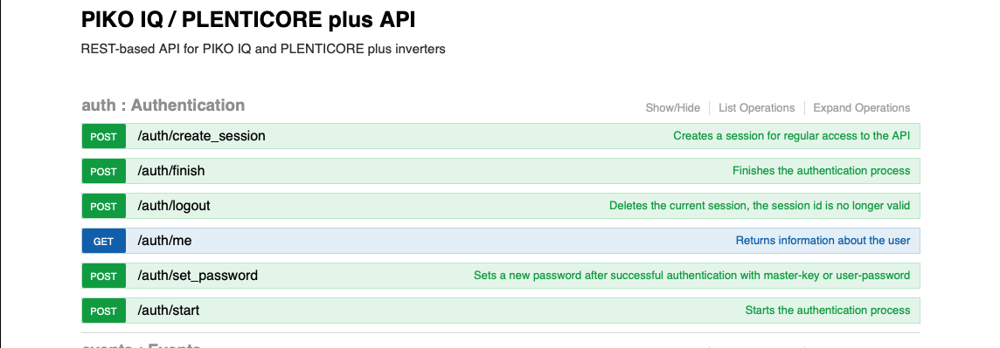

  

# IoBroker.plenticore-g3
**Tests:** 

## Plenticore-g3-Adapter für ioBroker
Adapter zur Kommunikation mit einem KOSTAL Plenticore plus über die REST-API. Diese API ist deutlich leistungsfähiger als Modbus. Sie ermöglicht den Zugriff auf ca. 200 schreibgeschützte Datenpunkte (Prozessdaten) und ca. 250 schreibbare Einstellungen. Die API ist unter folgender URL dokumentiert:

http://\<plenticore host>/api/v1

   

Dieser Adapter verwendet die 'Prozessdaten' und 'Einstellungen' der REST-API. Da kein Benutzer alle verfügbaren Daten benötigt, verfügt der Adapter nur über eine sehr kleine Anzahl voreingestellter Prozessdaten und Einstellungen, bietet dem Benutzer jedoch die Möglichkeit, zusätzliche Datenpunkte aus einer Liste aller verfügbaren Prozessdaten bzw. Einstellungen auszuwählen.

  

Sie können optionalen Datenpunkten auch eigene Beschreibungen hinzufügen, die dann im Objektbaum von iobroker angezeigt werden. Der Zweck eines Datenpunkts lässt sich meist anhand seines Namens ableiten. Beispielsweise steht „devices:local/HomeBat_P“ für den Stromverbrauch des Hauses aus der Batterie.

### Benennung
Native Objekte bestehen aus einer Modul-ID und einer Daten-ID, zum Beispiel „scb:statistic:EnergyFlow/Statistic:Yield:Day“. Der Teil vor dem Schrägstrich ist die Modul-ID. In diesem Fall also „scb:statistic:EnergyFlow“. Im Objektbaum von iobroker wird für die Modul-ID eine Ordnerstruktur angelegt:  scb  Statistiken  Energiefluss 

Doppelpunkte in der Daten-ID werden durch einen Unterstrich ersetzt:  „Statistik:Ertrag:Tag“ wird zu „Statistik_Ertrag_Tag“

## Changelog
### 0.1.1 (2025-04-07)

- fix object hierarchy
- fix missing translations, adjust translations based on system language
- fix state roles

### 0.1.0 (2025-03-29)

- add notification on available updates
- make sure init completes without errors

### 0.0.8 (2025-03-28)

- fix writing of settings after 0.0.7
- fix crash after failed API requests

### 0.0.7 (2025-03-26)

- replace ':' by '_' in object IDs
- delete unused objects and channels

### 0.0.6 (2025-03-14)

-   fix repo url in package.json

### 0.0.5 (2025-03-14)

-   avoid potential issues: js-controller >= 7.0.6

### 0.0.4 (2025-03-14) 0.0.4

-   prepare for iobroker repo

### 0.0.4-beta.1 (2025-03-14) beta 1 with translations

-   update translations

### 0.0.4-beta.0 (2025-03-13) beta 1

-   exclude react from test:js
-   terminate on authentication issue (fix)
-   add read and write for settings

### 0.0.3-alpha.1 (2025-03-10)

-   eslint
-   remove node 18.x from github workflow

### 0.0.3-alpha.0 (2025-03-10)

-   Did some changes
-   Did some more changes

### v0.0.1 (2025-03-10)

Initial release

## License
MIT License

Copyright (c) 2025 fernetmenta <fernetmenta@online.de>

Permission is hereby granted, free of charge, to any person obtaining a copy
of this software and associated documentation files (the "Software"), to deal
in the Software without restriction, including without limitation the rights
to use, copy, modify, merge, publish, distribute, sublicense, and/or sell
copies of the Software, and to permit persons to whom the Software is
furnished to do so, subject to the following conditions:

The above copyright notice and this permission notice shall be included in all
copies or substantial portions of the Software.

THE SOFTWARE IS PROVIDED "AS IS", WITHOUT WARRANTY OF ANY KIND, EXPRESS OR
IMPLIED, INCLUDING BUT NOT LIMITED TO THE WARRANTIES OF MERCHANTABILITY,
FITNESS FOR A PARTICULAR PURPOSE AND NONINFRINGEMENT. IN NO EVENT SHALL THE
AUTHORS OR COPYRIGHT HOLDERS BE LIABLE FOR ANY CLAIM, DAMAGES OR OTHER
LIABILITY, WHETHER IN AN ACTION OF CONTRACT, TORT OR OTHERWISE, ARISING FROM,
OUT OF OR IN CONNECTION WITH THE SOFTWARE OR THE USE OR OTHER DEALINGS IN THE
SOFTWARE.