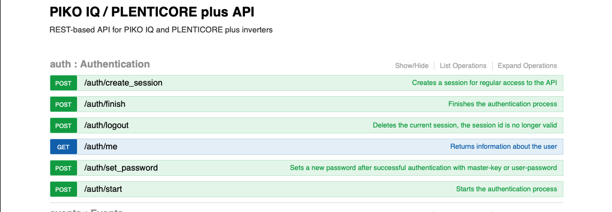

    

# ioBroker.plenticore-g3

## plenticore-g3 Adapter für ioBroker

Adapter zur Kommunikation mit einem KOSTAL Plenticore (verschiedene Modelle, siehe unten) über eine REST-API. Diese API ist deutlich leistungsfähiger als Modbus. Sie ermöglicht den Zugriff auf ca. 200 schreibgeschützte Datenpunkte, die als „Prozessdaten“ bezeichnet werden, und ca. 250 beschreibbare Einstellungen. Die API ist unter folgender URL dokumentiert:

http\://\<plenticore host>/api/v1

    
    

Dieser Adapter nutzt die REST-API-Funktionen „Prozessdaten“ und „Einstellungen“. Da kein Benutzer alle verfügbaren Daten benötigt, verfügt der Adapter nur über eine sehr geringe Anzahl voreingestellter Prozessdaten und Einstellungen. Der Benutzer hat jedoch die Möglichkeit, zusätzliche Datenpunkte aus einer Liste aller verfügbaren Prozessdaten bzw. Einstellungen auszuwählen.

    

Sie können optionalen Datenpunkten eigene Beschreibungen hinzufügen, die dann im Objektbaum von iobroker angezeigt werden. In den meisten Fällen lässt sich der Zweck eines Datenpunkts aus seinem Namen ableiten. Beispielsweise repräsentiert „devices:local/HomeBat\_P“ die vom Haus aus der Batterie verbrauchte Leistung.

### Benennung

Native Objekte bestehen aus einer Modul-ID und einer Daten-ID, beispielsweise „scb:statistic:EnergyFlow/Statistic:Yield:Day“. Der Teil vor dem Schrägstrich ist die Modul-ID, in diesem Fall „scb:statistic:EnergyFlow“. Im Objektbaum von iobroker wird für die Modul-ID eine Ordnerstruktur erstellt.  scb  Statistiken  EnergyFlow 

Doppelpunkte in der Daten-ID werden durch einen Unterstrich ersetzt:  'Statistic:Yield:Day' wird zu 'Statistic\_Yield\_Day'

## Unterstützte/getestete Plenticore-Modelle

Entgegen der Annahme, dass nur G3-Modelle unterstützt werden, werden auch andere Modelle unterstützt, wie der Name des Adapters vermuten lässt. Die API scheint identisch zu sein; lediglich die verfügbaren Datenpunkte können sich unterscheiden. Nachfolgend finden Sie eine Liste der Modelle, die von Nutzern erfolgreich getestet wurden.

- Plenticore G3
- Plenticore plus 10 (G1) - FW Version 01.30.12092
- Plenticore BI 10/26 (G2) - FW Version 02.15.19562

## Changelog
### 1.0.2 (2026-09-01)
- update dependencies

### 1.0.1 (2026-06-29)
- update dependencies

### 1.0.0 (2026-05-12)
- (copilot) Adapter requires node.js >= 22 now
- update dependencies
- reduce number of retries on init

### 0.5.3 (2026-04-02)
- update dependencies
- fix notification, only send notification about firmware updates every 14 days

### 0.5.2 (2026-01-04)
- fix skipping optionals that have become preselected
- fix not showing settings for battery when present
- update dependencies

[Older changelogs can be found there](https://github.com/FernetMenta/ioBroker.plenticore-g3/blob/main/CHANGELOG_OLD.md)

## License
MIT License

Copyright (c) 2025-2026 fernetmenta <fernetmenta@online.de>

Permission is hereby granted, free of charge, to any person obtaining a copy
of this software and associated documentation files (the "Software"), to deal
in the Software without restriction, including without limitation the rights
to use, copy, modify, merge, publish, distribute, sublicense, and/or sell
copies of the Software, and to permit persons to whom the Software is
furnished to do so, subject to the following conditions:

The above copyright notice and this permission notice shall be included in all
copies or substantial portions of the Software.

THE SOFTWARE IS PROVIDED "AS IS", WITHOUT WARRANTY OF ANY KIND, EXPRESS OR
IMPLIED, INCLUDING BUT NOT LIMITED TO THE WARRANTIES OF MERCHANTABILITY,
FITNESS FOR A PARTICULAR PURPOSE AND NONINFRINGEMENT. IN NO EVENT SHALL THE
AUTHORS OR COPYRIGHT HOLDERS BE LIABLE FOR ANY CLAIM, DAMAGES OR OTHER
LIABILITY, WHETHER IN AN ACTION OF CONTRACT, TORT OR OTHERWISE, ARISING FROM,
OUT OF OR IN CONNECTION WITH THE SOFTWARE OR THE USE OR OTHER DEALINGS IN THE
SOFTWARE.