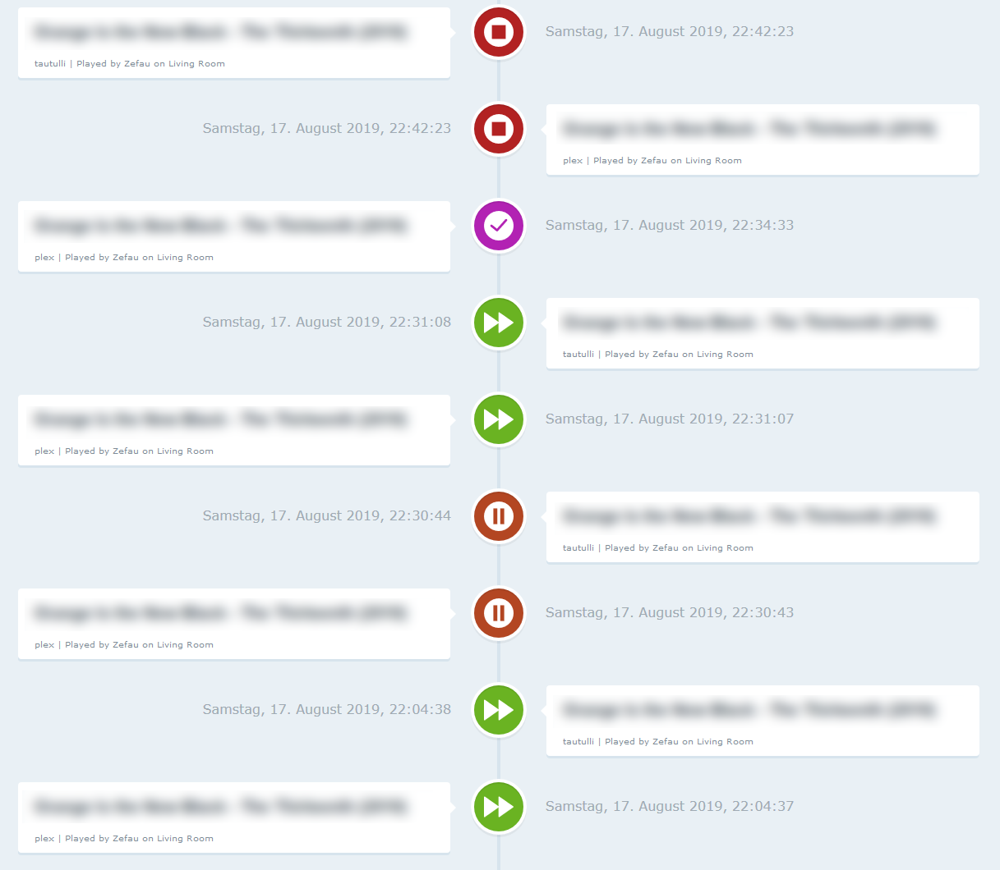
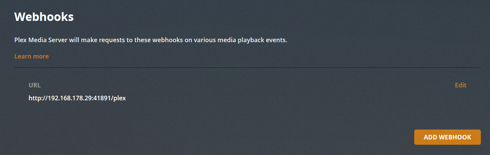
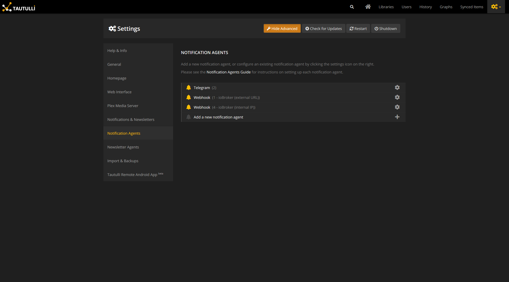
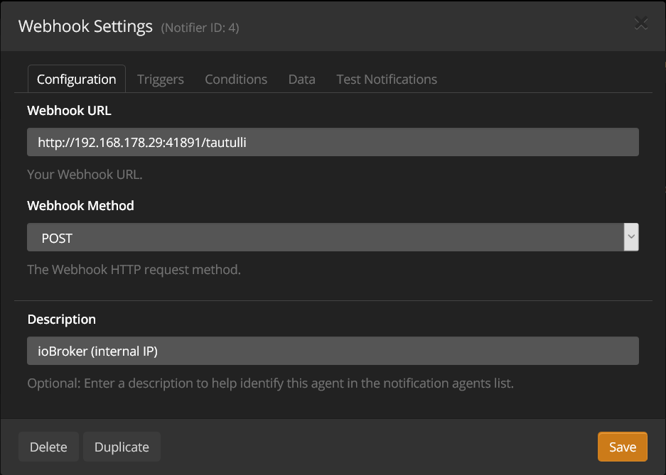
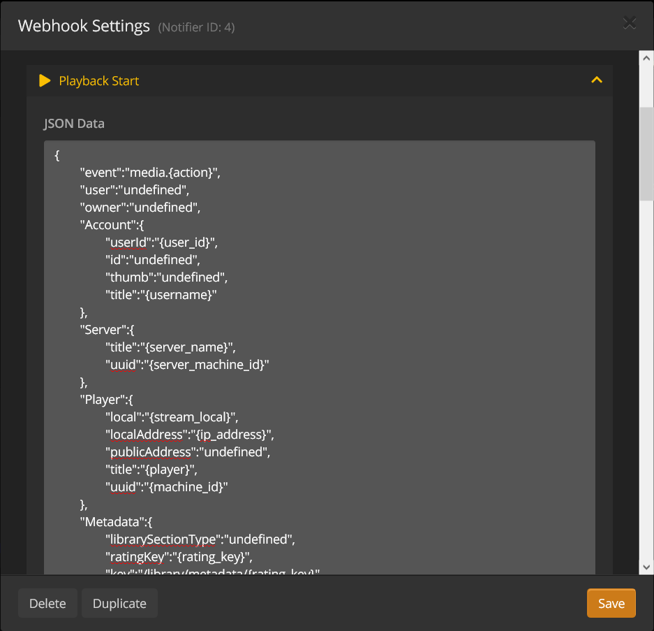
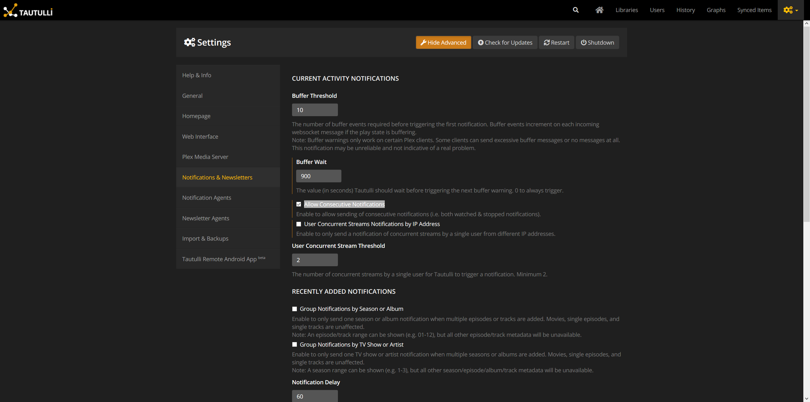
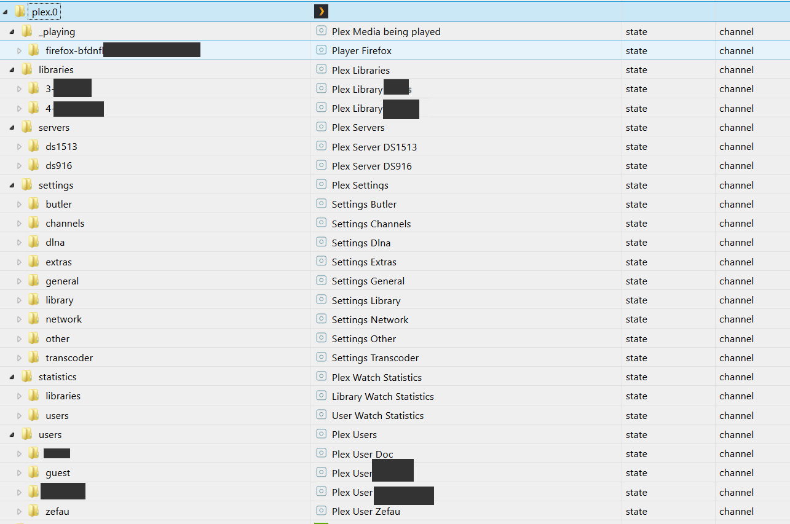

# IoBroker.plex Integration des Plex Media Servers in ioBroker (mit oder ohne Plex Pass). Außerdem Tautulli-Integration.
[](https://weblate.iobroker.net/engage/adapters/?utm_source=widget)

**Inhaltsverzeichnis**

1. [Funktionen](#1-Funktionen)
2. [Einrichtungsanweisungen](#2-setup-instructions)
1. [Grundkonfiguration](#21-basic-setup)
2. [Erweiterte Einrichtung](#22-advanced-setup-plex-pass-or-tautulli)
3. [Kanäle und Zustände](#3-channels--states)
1. [mit Basis-Setup](#31-mit-Basis-Setup)
2. [mit erweitertem Setup](#32-mit-erweitertem-Setup)
4. [Änderungsprotokoll](#changelog)
5. [Lizenz](#Lizenz)

## 1. Funktionen
- Erhalten Sie detaillierte Medieninformationen zum aktuell wiedergegebenen Medienelement (z. B. Video-Bitrate, Codec, Untertitelinformationen, Audio; eine vollständige Liste finden Sie unter [Erweiterte Einrichtung](https://github.com/iobroker-community-adapters/ioBroker.plex/blob/master/README-states.md#with-advanced-setup)).
- Empfangen Sie „Ereignisse“ von Plex (über [Plex Webhook](https://support.plex.tv/articles/115002267687-webhooks/#toc-0) und [Plex-Benachrichtigungen](https://support.plex.tv/articles/push-notifications/#toc-0) mit Plex Pass oder über Tautulli, [__siehe Setup!__](#22-advanced-setup-plex-pass-or-tautulli))
- Wiedergabesteuerung für Player
- `Server` abrufen
- `Bibliotheken` abrufen
- Alle Elemente innerhalb einer Bibliothek abrufen
- `Benutzer` abrufen (nur mit Tautulli)
- „Statistiken“ abrufen (nur mit Tautulli)
- „Wiedergabelisten“ abrufen
- `Einstellungen` abrufen
- Abrufen aller Daten von steuerbaren Clients
- Weboberfläche, die die letzten Ereignisse von Plex anzeigt:

  

## 2. Einrichtungsanweisungen
### 2.1. Grundeinrichtung
Für die Grundeinrichtung ist es erforderlich, die IP-Adresse (und den Port) Ihrer Plex-Installation anzugeben. Darüber hinaus müssen Sie einen dedizierten Token für den Adapter abrufen, um Daten von Plex abzurufen.

Sobald dies angegeben ist, ruft ioBroker.plex alle Basisdaten ab (inkl. Server, Bibliotheken). Die vollständige Liste der Basisdaten finden Sie unter [Kanäle und Zustände](#21-with-basis-setup).

### 2.2. Erweiterte Einrichtung (Plex Pass oder Tautulli)
#### 2.2.1. Plex-Pass
__Webhook__

Wenn Sie ein Plex Pass-Benutzer sind, können Sie in den Plex-Einstellungen [Einen Webhook einrichten](https://support.plex.tv/articles/115002267687-webhooks/#toc-0) das aktuelle Ereignis/die aktuelle Aktion von Ihrem Plex Media Server abrufen (Wiedergabe, Pause, Fortsetzung, Stopp, Anzeige und Bewertung).

Navigieren Sie zu Ihrem Plex Media Server und gehen Sie zu ```Settings``` und ```Webhook```. Erstellen Sie einen neuen Webhook, indem Sie auf ```Add Webhook``` klicken und Ihre ioBroker-IP-Adresse mit dem benutzerdefinierten Port eingeben, der in den ioBroker.plex-Einstellungen angegeben ist, und dem nachfolgenden ```/plex```-Pfad, z. B. ```http://192.168.178.29:41891/plex```:



__Veranstaltungen__

Informationen zu den Plex-Benachrichtigungen finden Sie unter [siehe offizielle Dokumentation](https://support.plex.tv/articles/push-notifications/#toc-0). Um Benachrichtigungen auf Ihrem Plex Media Server zu aktivieren, gehen Sie zu `Settings` > `Server` > `General` und aktivieren Sie dann die Einstellung `Push Notifications`.

#### 2.2.2.Tautulli
[Tautulli ist eine Drittanbieteranwendung](https://tautulli.com/#about), die Sie neben Ihrem Plex Media Server ausführen können, um Aktivitäten zu überwachen und verschiedene Statistiken zu verfolgen. Am wichtigsten ist, dass diese Statistiken beinhalten, was angesehen wurde, wer es angesehen hat, wann und wo es angesehen wurde und wie es angesehen wurde. Alle Statistiken werden in einer schönen und übersichtlichen Oberfläche mit vielen Tabellen und Diagrammen dargestellt, sodass Sie leicht vor allen anderen mit Ihrem Server angeben können. Sehen Sie sich [Tautulli Preview](https://tautulli.com/#preview) an und [installieren Sie es auf Ihrem bevorzugten System](https://github.com/Tautulli/Tautulli-Wiki/wiki/Installation), falls Sie interessiert sind.

Dieser Adapter stellt eine Verbindung zu [Tautulli-API](https://github.com/Tautulli/Tautulli/blob/master/API.md) her und empfängt auch Webhook-Ereignisse von Tautulli.

##### 2.2.2.1. API
Sobald Tautulli installiert ist, öffnen Sie die Seite _Einstellungen_ vom Tautulli-Dashboard und navigieren Sie zur _Weboberfläche_. Scrollen Sie nach unten zum Abschnitt _API_ und stellen Sie sicher, dass ```Enable API``` aktiviert ist. Kopieren Sie ```API key``` und geben Sie es in die ioBroker.plex-Einstellungen ein. Fügen Sie außerdem die Tautulli-IP-Adresse und den Port hinzu, um die API-Kommunikation zu ermöglichen.

##### 2.2.2.2. Webhook
###### Übersicht
Um ein Webook mit Tautulli einzurichten, befolgen Sie die nachstehenden Anweisungen und stellen Sie sicher, dass Sie alle 4 Schritte ausgeführt haben:

1. Benachrichtigungsagenten hinzufügen
2. Webhook im Benachrichtigungsagenten konfigurieren
3. Trigger im Benachrichtigungsagenten konfigurieren
4. Daten im Benachrichtigungsagenten konfigurieren
5. Benachrichtigungsoptionen konfigurieren

###### Beschreibung
Öffnen Sie nach der Installation die Einstellungsseite im Tautulli-Dashboard und navigieren Sie zu „Benachrichtigungsagenten“, wie unten gezeigt:



1. Klicken Sie auf _Neuen Benachrichtigungsagenten hinzufügen_ und _Webhook_.
2. Geben Sie Ihre ioBroker-IP-Adresse mit dem benutzerdefinierten Port ein, der in den ioBroker.plex-Einstellungen angegeben ist, und dem abschließenden Pfad „/tautulli“, z. B. „http://192.168.178.29:41891/tautulli“:

 Wählen Sie außerdem bei _Webhook-Methode_ ```POST``` aus und geben Sie bei _Beschreibung_ eine beliebige Beschreibung ein.

3. Wechseln Sie als nächstes zur Registerkarte _Trigger_ und wählen Sie die gewünschten (oder einfach alle) Benachrichtigungsagenten aus. Ein aktivierter Benachrichtigungsagent löst ein Ereignis aus, das dann an ioBroker gesendet wird. __Stellen Sie sicher__, dass Sie im nächsten Schritt die erforderlichen Daten für jeden aktivierten Benachrichtigungsagenten angeben!
4. Und nun, __das Wichtigste__, füllen Sie die jeweiligen Datennutzlasten auf der Registerkarte _Daten_ entsprechend der __[hier zu findenden Benachrichtigungskonfiguration](README-tautulli.md#notification-configuration)__ aus.

Kopieren Sie die Benachrichtigungskonfiguration der relevanten Benachrichtigungsagenten aus dem vorherigen Schritt (z. B. ```Playback Start```, ```Playback Stop```, ```Playback Pause``` und ```Playback Resume```) in jedes der Textfelder, wie unten für ```Playback Start``` gezeigt:

   

5. Aktivieren Sie abschließend die Option „Aufeinanderfolgende Benachrichtigungen zulassen“, um das Senden aufeinanderfolgender Benachrichtigungen zu ermöglichen (z. B. sowohl beobachtete als auch gestoppte Benachrichtigungen):

   

## 3. Kanäle und Zustände
Wenn sowohl die Basis- als auch die erweiterte Konfiguration konfiguriert sind, werden die folgenden Kanäle angezeigt (Bibliotheken, Server und Benutzer sind natürlich nur Beispiele). Siehe weiter unten für [vollständige Liste der Kanäle und Staaten](#21-with-basis-setup).



### 3.1. Mit Basis-Setup
Nach erfolgreicher Grundeinrichtung werden die Kanäle gemäß der folgenden Tabelle erstellt. Eine Liste aller Zustände, die erstellt werden, finden Sie unter [siehe spezielle Liste der Staaten](README-states.md#with-basis-setup).

| Kanal/Ordner | Beschreibung |
| ------- | ----------- |
| __Bibliotheken__ | Plex-Bibliotheken |
| __Server__ | Plex-Server |
| __Einstellungen__ | Plex-Einstellungen |

### 3.2. Mit erweitertem Setup
Nach erfolgreicher erweiterter Einrichtung werden die folgenden Kanäle _zusätzlich_ erstellt. Eine Liste aller erstellten Zustände finden Sie unter [siehe spezielle Liste der Staaten](README-states.md#with-advanced-setup).

| Kanal / Ordner | Beschreibung | Bemerkung |
| ---------------- | ----------- | ------ |
| __\_playing__ | Plex Media wird abgespielt | mit Plex Pass oder Tautulli |
| __Statistiken__ | Plex Watch Statistiken | nur mit Tautulli |
| __Benutzer__ | Plex-Benutzer | nur mit Tautulli |

## Credits
Dieser Adapter wäre ohne die großartige Arbeit von @Zefau (https://github.com/Zefau) nicht möglich gewesen, der ihn erstellt und bis 2021 gepflegt hat.

## Changelog
<!--
    Placeholder for the next version (at the beginning of the line):
    ### **WORK IN PROGRESS**
-->
### **WORK IN PROGRESS**
- (ticaki) Dependencies updated
- (mcm1957) Adapter requires nodejs >= 18 now

### 1.1.4 (2023-11-06)
- (ticaki) move logmessage into debug

### 1.1.3 (2023-10-05)
- (ticaki) fixed: bug in readable offset

### 1.1.2 (2023-09-16)
- (ticaki) prevent Plex from crashing due to incorrect tautulli configuration

### 1.1.1 (2023-09-16)
- (ticaki) Fixed: State common.name english/german
- (ticaki) some minor improvements

### 1.1.0 (2023-09-11)
- (ticaki) Added: Lyrics are written as link and text in _playing.device.Metadata.Music.Lyric
- (ticaki) Added: Connection to players with refresh of playerdetail
- (ticaki) Added: New states with player data.
- (ticaki) Added: Refresh of player can be activate by set _Controls.timeline.refreshDetails to true

### 1.0.5 (2023-08-31)
- (ticaki) Fixed: Control did not work with Plexamp.
- (ticaki) some minor improvements.

### 1.0.4 (2023-08-27)
- (ticaki) Fixed: [#184](https://github.com/iobroker-community-adapters/ioBroker.plex/issues/184)

### 1.0.3 (2023-08-25)
- (ticaki) Fixed: Don't add empty notifications to history [#183](https://github.com/iobroker-community-adapters/ioBroker.plex/issues/183)
- (ticaki) Fixed: prevent the creation of duplicate history entries in most cases

### 1.0.2 (2023-08-23)
- (ticaki) Added: a play/pause switch for mediaplayer
- (ticaki) Added: links to artworks (ready to use)
- (ticaki) Added: state viewOffsetSeconds refresh every second while playing media(internal counter)

### 1.0.1 (2023-08-21)
- (ticaki) Xmlparser call fixed

### 1.0.0 (2023-08-20)
- (ticaki) fixed: several minor issues have been fixed

### 1.0.0-alpha.3 (2023-08-16)
- (ticaki) fixed: common.type warnings have been fixed and missing state definitions have been added #114 #101 #100
- (ticaki) fixed: player controls  
- (ticaki) fixed: history page has been fixed 
- (ticaki) fixed: translation error has been fixed #108

### 0.9.0 (2020-05-23)
- (Zefau) added option for webhook IP address in case Plex is running in a Docker environment (see [#53](https://github.com/iobroker-community-adapters/ioBroker.plex/issues/53))
- (Zefau) updated dependencies

### 0.8.11 (2020-02-26)
- (Zefau) fixed error with state retrieval on startup when no states are given
- (Zefau) updated dependencies

### 0.8.10 (2020-02-16)
- (Zefau) fixed error with state retrieval on startup when no states are given
- (Zfeau) fixed incorrect handling of certificates when using secure connection
- (Zefau) updated dependencies

### 0.8.9 (2019-12-14)
- (Zefau) updated dependencies
- (Zefau) fixed missing spaces in events (and thus Adapter Web View)
- (Zefau) fixed using username instead of email for statistics (see [#17](https://github.com/iobroker-community-adapters/ioBroker.plex/issues/17))

### 0.8.8 (2019-12-05)
- (Zefau) fixed player controls

### 0.8.7 (2019-12-02)
- (Zefau) fixed error with http / https settings

### 0.8.6 (2019-12-02)
- (Zefau) added further states to Tautulli Notification (see [README-tautulli.md](https://github.com/iobroker-community-adapters/ioBroker.plex/blob/master/README-tautulli.md))
- (Zefau) fixed design issue with select-box in the adapter settings
- (Zefau) fixed not showing thumbnails in adapter web view (when not using a secure connection)

### 0.8.5 (2019-12-01)
- (Zefau) fixed missing user / library statistics
- (Zefau) fixed using username instead of email for statistics (see [#17](https://github.com/iobroker-community-adapters/ioBroker.plex/issues/17))

### 0.8.4 (2019-11-07)
- (Zefau) added support for remote player control via cloud / iot adapter
- (Zefau) added thumbnail to notifications as well as web interface of adapter
- (Zefau) fixed icons within the web interface of adapter

### 0.8.3 (2019-11-06)
- (Zefau) fixed player controls (error when triggering `start`, `stop`, etc.)
- (Zefau) added additional states to `event` channel

### 0.8.1 (2019-11-02)
- (Zefau) fixed error `Cannot read property 'forEach' of undefined`

### 0.8.0 (2019-10-28)
- (Zefau) added support for Plex Notifications including customization in adapter settings
- (Zefau) added count of streams (see [#14](https://github.com/iobroker-community-adapters/ioBroker.plex/issues/14))
- (Zefau) reworked cleaning up states when new webhook is received (see [#11](https://github.com/iobroker-community-adapters/ioBroker.plex/issues/11))

### 0.7.0 (2019-10-17)
- (Zefau) reworked duty cycle (clean up of outdated / old states)
- (Zefau) fixed incorrect states (see [#15](https://github.com/iobroker-community-adapters/ioBroker.plex/issues/15))

### 0.6.0 (2019-08-19)
- (Zefau) replaced password with token authentication

### 0.5.0 (2019-08-18)
- (Zefau) added support for Plex Notifications (see [#9](https://github.com/iobroker-community-adapters/ioBroker.plex/issues/9))
- (Zefau) added support for all Tautulli triggers
- (Zefau) added Adapter Web Interface that shows the recent events

### 0.4.3 (2019-08-11)
- (Zefau) Performance improvements (dutyCycleRun and state comparison)
- (Zefau) added refresh button (to scan library files) to libraries

### 0.4.1 / 0.4.2 (2019-08-03)
- (Zefau) fixed newly introduced playback control not working for certain players
- (Zefau) removed unnecessary dependencies

### 0.4.0 (2019-08-01)
- (Zefau) added playback control for players
- (Zefau) added configuration options to only retrieve specific objects from Plex

### 0.3.2 / 0.3.3 (2019-07-25)
- (Zefau) added file, streaming and transcoding information to Tautulli event
- (Zefau) fixed bug when no playlists exist
- (Zefau) fixed missing `EVENTS.json`

### 0.3.1 (2019-07-20)
- (Zefau) updated dependencies to fix security vulnerabilities in depending packages

### 0.3.0 (2019-05-16)
- ([@Apollon77](https://github.com/Apollon77)) updated testing for Node.js v12 (see [#6](https://github.com/iobroker-community-adapters/ioBroker.plex/pull/6))
- (Zefau) added support / discovery in [iobroker.discovery](https://github.com/ioBroker/ioBroker.discovery) (see [#62](https://github.com/ioBroker/ioBroker.discovery/pull/62))
- (Zefau) added playlists to states
- (Zefau) added state description for object tree ```_playing```
- (Zefau) updated German translation (instead of generating it from English)

### 0.2.0 (2019-05-14)
- (Zefau) added authentication method (using Plex user and Plex password)
- (Zefau) fixed @iobroker/adapter-core dependency

### 0.1.0 (2019-04-26)
- (Zefau) get initial data from Plex API
- (Zefau) receive events from Plex Webhook (Plex Pass only)
- (Zefau) receive events from Tatulli (if used)

## License
The MIT License (MIT)

Copyright (c) 2023-2024 iobroker-community-adapters
Copyright (c) 2019-2020 Zefau <zefau@mailbox.org>


Permission is hereby granted, free of charge, to any person obtaining a copy
of this software and associated documentation files (the "Software"), to deal
in the Software without restriction, including without limitation the rights
to use, copy, modify, merge, publish, distribute, sublicense, and/or sell
copies of the Software, and to permit persons to whom the Software is
furnished to do so, subject to the following conditions:

The above copyright notice and this permission notice shall be included in
all copies or substantial portions of the Software.

THE SOFTWARE IS PROVIDED "AS IS", WITHOUT WARRANTY OF ANY KIND, EXPRESS OR
IMPLIED, INCLUDING BUT NOT LIMITED TO THE WARRANTIES OF MERCHANTABILITY,
FITNESS FOR A PARTICULAR PURPOSE AND NONINFRINGEMENT. IN NO EVENT SHALL THE
AUTHORS OR COPYRIGHT HOLDERS BE LIABLE FOR ANY CLAIM, DAMAGES OR OTHER
LIABILITY, WHETHER IN AN ACTION OF CONTRACT, TORT OR OTHERWISE, ARISING FROM,
OUT OF OR IN CONNECTION WITH THE SOFTWARE OR THE USE OR OTHER DEALINGS IN
THE SOFTWARE.