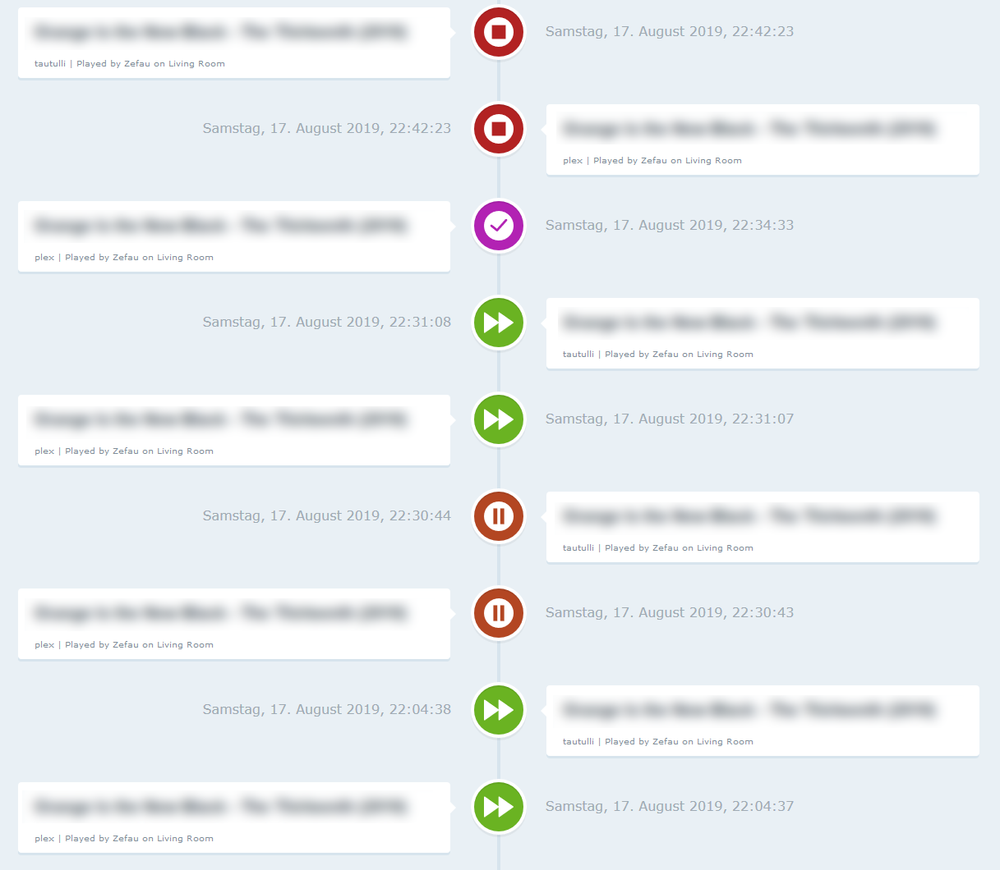
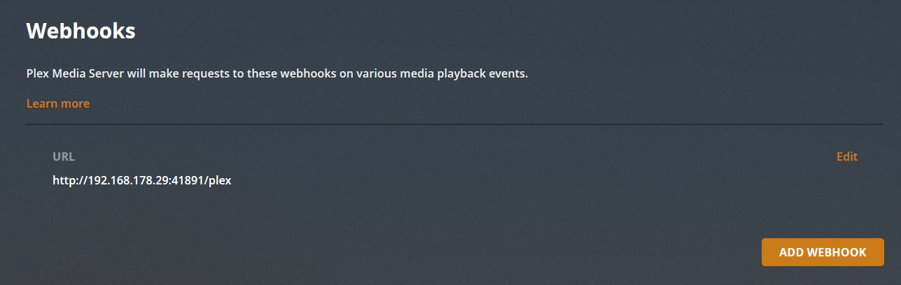
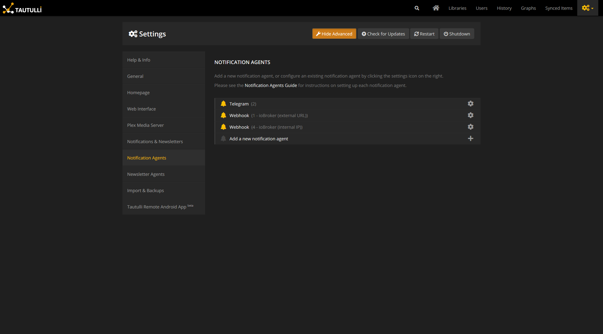
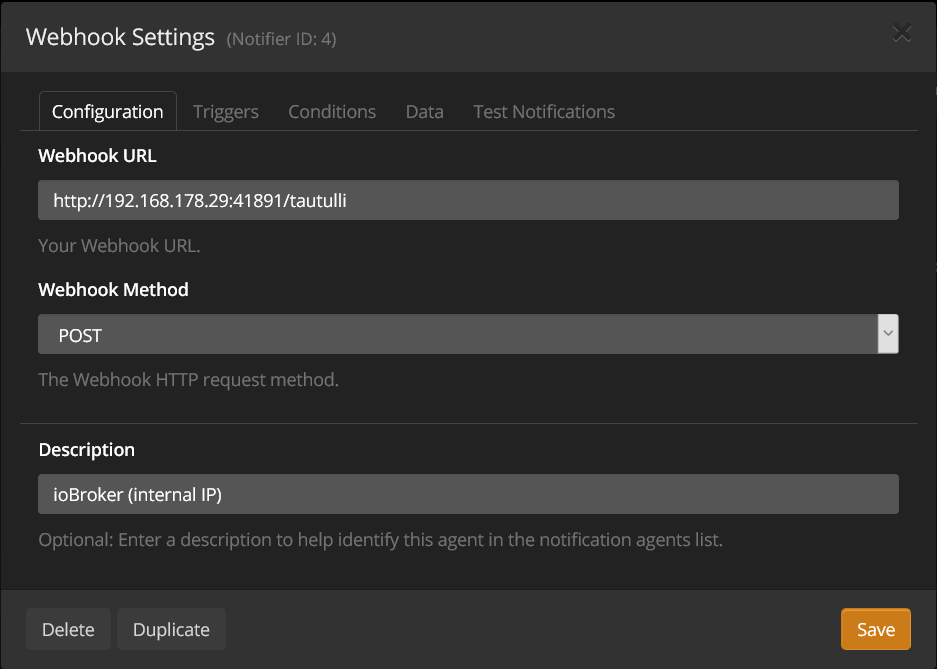
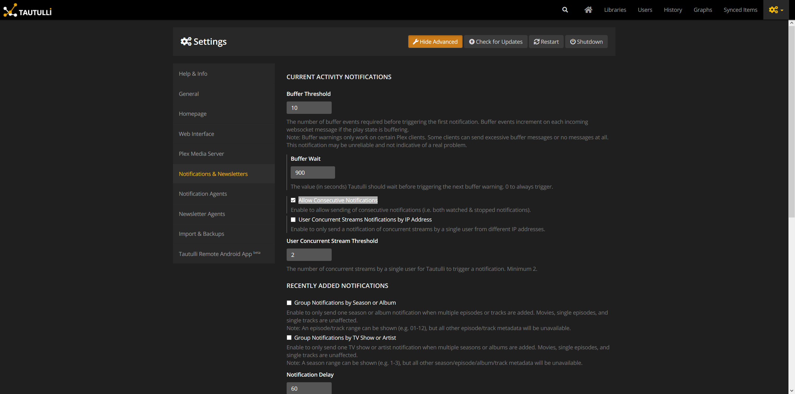
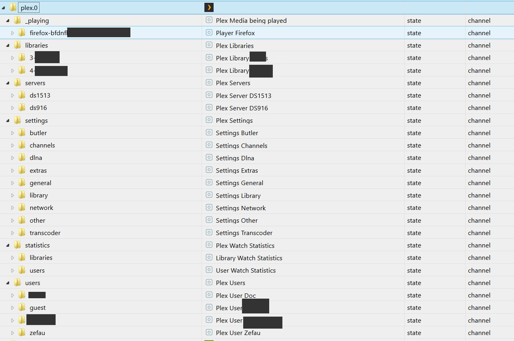

# ioBroker.plex

Integration des Plex Media Servers in ioBroker (mit oder ohne Plex Pass). Außerdem: Tautulli-Integration.

**Inhaltsverzeichnis**

1. [Merkmale](#1-features)
2. [Einrichtungsanleitung](#2-setup-instructions)
   1. [Grundlegende Einrichtung](#21-basic-setup)
   2. [Erweiterte Einstellungen](#22-advanced-setup-plex-pass-or-tautulli)
3. [Kanäle und Staaten](#3-channels--states)
   1. [mit Basiskonfiguration](#31-with-basis-setup)
   2. [mit erweiterter Einrichtung](#32-with-advanced-setup)
4. [Änderungsprotokoll](#changelog)
5. [Lizenz](#license)

## 1. Merkmale

- Erhalten Sie detaillierte Medieninformationen zum aktuell wiedergegebenen Medienelement (z. B. Videobitrate, Codec, Untertitelinformationen, Audio; eine vollständige Liste finden Sie unter [Erweiterte Einstellungen](/#/docs/adapterref/iobroker.plex/README-states.md#with-advanced-setup) ).
- Erhalten`events` von Plex (über [Plex Webhook](https://support.plex.tv/articles/115002267687-webhooks/#toc-0) und [Plex Notifications](https://support.plex.tv/articles/push-notifications/#toc-0) mit Plex Pass oder über Tautulli, [**siehe Einrichtung!**](#22-advanced-setup-plex-pass-or-tautulli) )
- Wiedergabesteuerung für Spieler
- Abrufen`servers`
- Abrufen`libraries`
- Alle Elemente einer Bibliothek abrufen
- Abrufen`users` (nur mit Tautulli)
- Abrufen`statistics` (nur mit Tautulli)
- Abrufen`playlists`
- Abrufen`settings`
- Alle Daten von steuerbaren Clients abrufen
- Weboberfläche, die die letzten Ereignisse von Plex anzeigt:

## 2. Installationsanleitung

### 2.1. Grundlegende Einrichtung

Für die grundlegende Einrichtung benötigen Sie die IP-Adresse (und den Port) Ihrer Plex-Installation. Außerdem müssen Sie ein spezielles Token für den Adapter abrufen, um Daten von Plex zu erhalten.

Sobald diese Angaben gemacht wurden, ruft ioBroker.plex alle Basisdaten (einschließlich Server und Bibliotheken) ab. Eine vollständige Liste der Basisdaten finden Sie unter [Kanäle & Zustände](#21-with-basis-setup) .

### 2.2. Erweiterte Einrichtung (Plex Pass oder Tautulli)

#### 2.2.1. Plex Pass

**Webhook**

Wenn Sie ein Plex Pass-Nutzer sind, können Sie in den Plex-Einstellungen [einen Webhook einrichten](https://support.plex.tv/articles/115002267687-webhooks/#toc-0) , um das aktuelle Ereignis/die aktuelle Aktion von Ihrem Plex Media Server abzurufen (Wiedergabe, Pause, Fortsetzung, Stopp, angesehen und bewertet).

Navigieren Sie zu Ihrem Plex Media Server und gehen Sie zu`Settings` Und`Webhook` . Durch Klicken wurde ein neuer Webhook erstellt.`Add Webhook` und geben Sie Ihre ioBroker-IP-Adresse mit dem in den ioBroker.plex-Einstellungen angegebenen benutzerdefinierten Port und dem nachfolgenden ein.`/plex` Pfad, z.B.`http://192.168.178.29:41891/plex` :

**Veranstaltungen**

Weitere Informationen zu den Plex-Benachrichtigungen [finden Sie in der offiziellen Dokumentation](https://support.plex.tv/articles/push-notifications/#toc-0) . Um Benachrichtigungen auf Ihrem Plex Media Server zu aktivieren, gehen Sie zu`Settings` >`Server` >`General` und dann aktivieren`Push Notifications` Präferenz.

#### 2.2.2.Tautulli

[Tautulli ist eine Drittanbieter-Anwendung](https://tautulli.com/#about) , die Sie parallel zu Ihrem Plex Media Server nutzen können, um Aktivitäten zu überwachen und verschiedene Statistiken zu erfassen. Zu diesen Statistiken gehören insbesondere Informationen darüber, was, wer, wann, wo und wie angesehen wurde. Alle Statistiken werden in einer übersichtlichen Benutzeroberfläche mit zahlreichen Tabellen und Diagrammen dargestellt, sodass Sie Ihren Server gerne präsentieren können. Testen Sie [Tautulli Preview](https://tautulli.com/#preview) und [installieren Sie es bei Interesse auf Ihrem System](https://github.com/Tautulli/Tautulli-Wiki/wiki/Installation) .

Dieser Adapter stellt eine Verbindung zur [Tautulli-API](https://github.com/Tautulli/Tautulli/blob/master/API.md) her und empfängt außerdem Webhook-Ereignisse von Tautulli.

##### 2.2.2.1. API

Nach der Installation von Tautulli öffnen Sie die _Einstellungsseite_ im Tautulli-Dashboard und navigieren Sie zur _Weboberfläche_ . Scrollen Sie nach unten zum Abschnitt _„API“_ und stellen Sie sicher, dass …`Enable API` ist geprüft. Kopieren Sie die`API key` Tragen Sie diese Daten in den ioBroker.plex-Einstellungen ein. Fügen Sie außerdem die Tautulli-IP-Adresse und den Port hinzu, um die API-Kommunikation zu ermöglichen.

##### 2.2.2.2. Webhook

###### Überblick

Um ein Webook mit Tautulli einzurichten, folgen Sie bitte den unten stehenden Anweisungen und stellen Sie sicher, dass Sie alle 4 Schritte abgeschlossen haben:

1. Benachrichtigungsagenten hinzufügen
2. Webhook im Benachrichtigungsagenten konfigurieren
3. Trigger im Benachrichtigungsagenten konfigurieren
4. Daten im Benachrichtigungsagenten konfigurieren
5. Benachrichtigungsoptionen konfigurieren

###### Beschreibung

Nach der Installation öffnen Sie die Einstellungsseite im Tautulli-Dashboard und navigieren zu „Benachrichtigungsagenten“, wie unten dargestellt:

1. Klicken Sie auf _„Neuen Benachrichtigungsagenten_ und _Webhook_ hinzufügen“.

2. Geben Sie Ihre ioBroker-IP-Adresse mit dem in den ioBroker.plex-Einstellungen angegebenen benutzerdefinierten Port und dem nachfolgenden Suffix ein.`/tautulli` Pfad, z.B.`http://192.168.178.29:41891/tautulli` :

    Wählen Sie außerdem`POST` für die _Webhook-Methode_ und geben Sie eine beliebige Beschreibung im _Feld „Beschreibung“_ ein.

3. Wechseln Sie anschließend zum Tab _„Trigger“_ und wählen Sie die gewünschten (oder alle) Benachrichtigungsagenten aus. Ein aktivierter Benachrichtigungsagent löst ein Ereignis aus, das dann an ioBroker gesendet wird. **Stellen Sie sicher,** dass Sie im nächsten Schritt die erforderlichen Daten für jeden aktivierten Benachrichtigungsagenten angeben!

4. Nun **ist es am wichtigsten** , die entsprechenden Nutzdaten im _Daten-_ Tab gemäß der **[hier zu findenden Benachrichtigungskonfiguration](/#/docs/adapterref/iobroker.plex/README-tautulli.md#notification-configuration)** einzugeben. Kopieren Sie die Benachrichtigungskonfiguration der relevanten Benachrichtigungsagenten aus dem vorherigen Schritt (z. B.`Playback Start` ,`Playback Stop` ,`Playback Pause` Und`Playback Resume` ) in jedem der unten gezeigten Textfelder für`Playback Start` :

   

5. Abschließend die Option aktivieren`Allow Consecutive Notifications` um das Senden aufeinanderfolgender Benachrichtigungen zu ermöglichen (z. B. sowohl Benachrichtigungen über angesehene als auch gestoppte Benachrichtigungen):

   

## 3. Kanäle & Staaten

Nachdem sowohl die Basis- als auch die erweiterte Konfiguration eingerichtet wurden, werden die folgenden Kanäle angezeigt (Bibliotheken, Server und Benutzer sind selbstverständlich nur Beispiele). Eine [vollständige Liste der Kanäle und Zustände](#21-with-basis-setup) finden Sie weiter unten.

### 3.1. Mit Basiseinrichtung

Nach erfolgreicher Basiseinrichtung werden die Kanäle gemäß der folgenden Tabelle erstellt. Eine Liste aller zu erstellenden Zustände [finden Sie in der entsprechenden Zustandsliste](/#/docs/adapterref/iobroker.plex/README-states.md#with-basis-setup) .

| Kanal / Ordner    | Beschreibung       |
| ----------------- | ------------------ |
| **Bibliotheken**  | Plex-Bibliotheken  |
| **Server**        | Plex-Server        |
| **Einstellungen** | Plex-Einstellungen |

### 3.2. Mit erweiterter Einrichtung

Nach erfolgreicher erweiterter Einrichtung werden _zusätzlich_ die folgenden Kanäle erstellt. Eine Liste aller zu erstellenden Zustände [finden Sie in der entsprechenden Zustandsliste](/#/docs/adapterref/iobroker.plex/README-states.md#with-advanced-setup) .

| Kanal / Ordner  | Beschreibung               | Bemerkung                   |
| --------------- | -------------------------- | --------------------------- |
| **\_playing**   | Plex Media wird abgespielt | mit Plex Pass oder Tautulli |
| **Statistiken** | Plex Watch-Statistiken     | nur mit Tautulli            |
| **Nutzer**      | Plex-Nutzer                | nur mit Tautulli            |

## Credits

Dieser Adapter wäre ohne die großartige Arbeit von @Zefau ( <https://github.com/Zefau> ) nicht möglich gewesen, der ihn bis 2021 entwickelt und gepflegt hat.

## Changelog
<!--
    Placeholder for the next version (at the beginning of the line):
    ### **WORK IN PROGRESS**
-->
### 3.0.0 (2026-08-16)
- (bluefox) Breaking: Admin 8 or newer is now required — the configuration UI no longer runs under Admin 7.
- (bluefox) Dependencies have been updated.

### 2.1.1 (2026-06-21)
- (mcm1957) some issues reported by repository checker have been fixed
- (mcm1957) dependencies have been updated

### 2.1.0 (2026-05-13)
- (ticaki) New: server management commands — library scan, force-refresh, empty trash, analyze streams (`libraries.{id}._commands.*`).
- (ticaki) New: global maintenance buttons — refresh all libraries, clean bundles, optimize database (`maintenance.*`).
- (ticaki) New: Butler task buttons — trigger any of Plex's scheduled background tasks on demand (`butler.*`).
- (ticaki) New: per-media commands when playback starts — mark watched/unwatched, rate, refresh metadata (`_playing.*._Commands.*`).
- (ticaki) New: Plex server settings are now writable — changes are sent to the server immediately (`settings.*`).
- (ticaki) Fix: library `_refresh` button was created as non-writable channel; now correctly a writable boolean button.

### 2.0.0 (2026-05-10)
- (ticaki) **Breaking:** Data points under `_playing.*` have been restructured — existing scripts and Vis widgets need to be updated.
- (ticaki) Data retrieval from Plex Media Server reworked; which fields are populated depends on the interface used (local / Plex.tv cloud).
- (ticaki) Adapter configuration fully migrated to the modern jsonConfig format.
- (ticaki) Built-in web interface redesigned: timeline of recent events, Now Playing display, and customizable layout.
- (ticaki) Player detection improved: Plexamp, Plex iOS/Android, PlexHTPC, and newer TV apps now reliably detected.
- (ticaki) Reconnect after connection errors accelerated: progressive backoff instead of fixed wait time.
- (ticaki) Fixed: Plex iOS, Android, and Web devices no longer generate "State has no existing object" log warnings after an upgrade.
- (ticaki) Fixed: deleting a device via adapter settings now correctly clears all internal state entries.
- (ticaki) New privacy option: media link states can store a placeholder instead of the real Plex token in plain text (configurable in adapter settings, enabled by default).
- (ticaki) Adapter rewritten in TypeScript. Requires Node.js >= 22.

### 1.1.5 (2024-12-11)
- (ticaki) State _playing.*.Metadata.viewOffset is created.
- (ticaki) Dependencies updated
- (mcm1957) Adapter requires nodejs >= 18 now

[Older changelogs can be found there](https://github.com/iobroker-community-adapters/ioBroker.plex/blob/master/CHANGELOG_OLD.md)

## License
The MIT License (MIT)

Copyright (c) 2023-2026 iobroker-community-adapters  
Copyright (c) 2019-2020 Zefau <zefau@mailbox.org>  

Permission is hereby granted, free of charge, to any person obtaining a copy
of this software and associated documentation files (the "Software"), to deal
in the Software without restriction, including without limitation the rights
to use, copy, modify, merge, publish, distribute, sublicense, and/or sell
copies of the Software, and to permit persons to whom the Software is
furnished to do so, subject to the following conditions:

The above copyright notice and this permission notice shall be included in
all copies or substantial portions of the Software.

THE SOFTWARE IS PROVIDED "AS IS", WITHOUT WARRANTY OF ANY KIND, EXPRESS OR
IMPLIED, INCLUDING BUT NOT LIMITED TO THE WARRANTIES OF MERCHANTABILITY,
FITNESS FOR A PARTICULAR PURPOSE AND NONINFRINGEMENT. IN NO EVENT SHALL THE
AUTHORS OR COPYRIGHT HOLDERS BE LIABLE FOR ANY CLAIM, DAMAGES OR OTHER
LIABILITY, WHETHER IN AN ACTION OF CONTRACT, TORT OR OTHERWISE, ARISING FROM,
OUT OF OR IN CONNECTION WITH THE SOFTWARE OR THE USE OR OTHER DEALINGS IN
THE SOFTWARE.