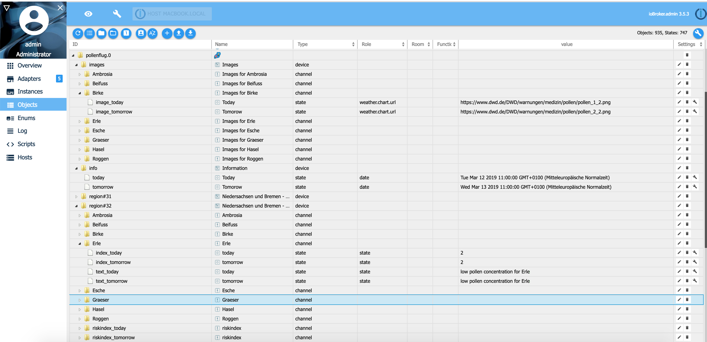

# Pollenrisikoindex


Der Deutsche Wetterdienst DWD erstellt täglich Prognosen des Pollenrisikoindex.
Vorhergesagt werden die Pollenarten: Hasel, Erle, Esche, Birke, Gras, Roggen, Beifuß und Ambrosia für heute und morgen, am Freitag auch für übermorgen (Sonntag).
Täglich vormittags aktualisiert.
Informationen zu den Pollenflugkreisen finden Sie unter: https://www.dwd.de/pollenflug Copyright der verwendeten Pollendaten: © Deutscher Wetterdienst (Quelle: Deutscher Wetterdienst)

## Installation und Konfiguration
Wählen Sie in der ioBroker-Adapterkonfiguration den Landkreis aus. Sie erhalten den Pollenrisikoindex für diesen Landkreis. Der Index wird einmal täglich um ca. 11 Uhr aktualisiert.
In den Objekten info.today, info.tomorrow und info.dayaftertomorrow wird der Gültigkeitszeitraum angezeigt.
Es kann beispielsweise vorkommen, dass heute Freitag ist, im Objekt info.today aber Donnerstag ist.
Das ist richtig, denn die DWD-Daten sind noch von Donnerstag und wurden bisher nicht aktualisiert. Die Aktualisierung erfolgt normalerweise um 11 Uhr.

Vorausgesetzte deutsche Landkreise:

* Schleswig-Holstein und Hamburg (Region 11 und 12)
    * Inseln und Marschen (Region 11)
    * Geest, Schleswig-Holstein und Hamburg (Region 12)
* Mecklenburg-Vorpommern (Region 20)
* Niedersachsen und Bremen (Region 31 und 32)
    * Westl. Niedersachsen/Bremen (Region 31)
    * Östl. Niedersachsen (Region 32)
* Nordrhein-Westfalen (Region 41, 42 und 43)
    * Rhein.-Westfäl. Tiefland (Region 41)
    * Ostwestfalen (Region 42)
    * Mittelgebirge NRW (Region 43)
* Brandenburg und Berlin (Region 50)
* Sachsen-Anhalt (Region 61 und 62)
    * Tiefland Sachsen-Anhalt (Region 61)
* Harz (Region 62)
* Thüringen (Region 71 und 72)
    * Tiefland Thüringen (Region 71)
    * Mittelgebirge Thüringen (Region 72)
* Sachsen (Region 81 und 82)
    * Tiefland Sachsen (Region 81)
    * Mittelgebirge Sachsen (Region 82)
* Hessen (Region 91 und 92)
    * Nordhessen und Hess. Mittelgebirge (Region 91)
* Rhein-Main (Region 92)
* Rheinland-Pfalz und Saarland (Region 101, 102 und 103)
    * Rhein, Pfalz, Nahe und Mosel (Region 101)
    * Mittelgebirgsbereich Rheinland-Pfalz (Region 102)
* Saarland (Region 103)
* Baden-Württemberg (Region 111, 112 und 113)
    * Oberrhein und unteres Neckartal (Region 111)
    * Hohenlohe/mittlerer Neckar/Oberschwaben (Region 112)
    * Mittelgebirge Baden-Württemberg (Region 113)
* Bayern (Region 121, 122, 123 und 124)
    * Allgäu/Oberbayern/Bay. Wald (Bezirk 121)
    * Donauniederungen (Region 122)
    * Bayern Nördl. der Donau, o. Bayr. Wald, o. Mainfranken (Bezirk 123)
    * Mainfranken (Bezirk 124)


Der ursprüngliche DWD-Risikoindex 0, 0-1, 1, 1-2, 2, 2-3 und 3 wird in 0, 1, 2, 3, 4, 5 und 6 geändert.
Dieses Format kann in ioBroker einfacher verwendet werden.

| Index | DWD Index | Beschreibung |
|-----	|---------- |------------------------------------ |
| -1 | -1 | keine Daten verfügbar |
| 0 | 0 | keine Pollenkonzentration |
| 1 | 0-1 | keine bis geringe Pollenkonzentration |
| 2 | 1 | geringe Pollenkonzentration |
| 3 | 1-2 | geringe bis mittlere Pollenkonzentration |
| 4 | 2 | durchschnittliche Pollenkonzentration |
| 5 | 2-3 | mittlere bis hohe Pollenkonzentration |
| 6 | 3 | hohe Pollenkonzentration |

**Beispiel Pollenflug:** 



URL-Adresse der Pollenbilder des DWD


## Beispiel
Wenn neue Daten vom DWD vorliegen (das heutige Datum ändert sich), zeigt das Skript den Pollenrisikoindex für Hasel und Erle an.

```
on({id: "pollenflug.0.info.today"/*Today*/, change: "ne"}, (obj) => {
    let hasel = getState("pollenflug.0.region#12.Hasel.text_today"/*today*/).val;
    let erle  = getState("pollenflug.0.region#12.Erle.text_today"/*today*/).val;
    console.log("Haselnuss Belastung " + hasel);
    console.log("Erle Belastung " + erle);
});
```

## Credits
Dieser Adapter wäre ohne die großartige Arbeit von schmupu (https://github.com/schmupu) nicht möglich gewesen, der V1.x.x dieses Adapters erstellt hat.

## Changelog
<!--
	Placeholder for the next version (at the beginning of the line):
    ### **WORK IN PROGRESS**
-->
### 2.0.0 (2024-07-24)
* (mcm1957) This adapter hase been moved to iobroker-community-adapters organization
* (mcm1957) Adapter requires node.js >= 18 and js-controller >= 5 now.
* (mcm1957) Dependencies have been updated

### 1.0.6 (03.05.2019)
* (Stübi) User can enable/disable sentry logging

### 1.0.5 (29.04.2019)
* (Stübi) Add Sentry to adapter

### 1.0.4 (19.10.2019)
* (Stübi) Bugfixing

### 1.0.3 (12.04.2019)
* (Stübi) Bugfixing, changing logo size

### 1.0.2 (12.03.2019)
* (Stübi) Bugfixing, of changing sepaation of entries in riskindex_x from ',' to ', '
* (Stübi) unnecessary states will be deleted

### 1.0.1 (11.03.2019)
* (Stübi) Delete all states for day after tommorrow 
* (Stübi) Changed type of object riskindex_x from number to string
* (Stübi) Changed sepaation of entries in riskindex_x from ',' to ', '
* (Stübi) Deleted in summary (json) alle -1 entries

### 1.0.0 (10.03.2019)
* (Stübi) Changed the pollen index for better use in VIS. Now you you values -1, 0, 1, 2, 3, 4, 5 ,6
* (Stübi) Add summary for today, tomorrow and the day after tomorrow in json format for every region

### 0.1.9 (25.02.2019)
* (Stübi) Link to DWD Image of pollen flight added

### 0.1.8 (24.02.2019)
* (Stübi) Bugfixing deleting object

### 0.1.6 (20.02.2019)
* (Stübi) First Version of pollen index adapter

## License
The MIT License (MIT)

Copyright (c) 2024 iobroker-community <iobroker-community-adapters@gmx.de>
Copyright (c) 2020 Thorsten Stueben <thorsten@stueben.de> / <https://github.com/schmupu>

Permission is hereby granted, free of charge, to any person obtaining a copy
of this software and associated documentation files (the "Software"), to deal
in the Software without restriction, including without limitation the rights
to use, copy, modify, merge, publish, distribute, sublicense, and/or sell
copies of the Software, and to permit persons to whom the Software is
furnished to do so, subject to the following conditions:

The above copyright notice and this permission notice shall be included in
all copies or substantial portions of the Software.

THE SOFTWARE IS PROVIDED "AS IS", WITHOUT WARRANTY OF ANY KIND, EXPRESS OR
IMPLIED, INCLUDING BUT NOT LIMITED TO THE WARRANTIES OF MERCHANTABILITY,
FITNESS FOR A PARTICULAR PURPOSE AND NONINFRINGEMENT. IN NO EVENT SHALL THE
AUTHORS OR COPYRIGHT HOLDERS BE LIABLE FOR ANY CLAIM, DAMAGES OR OTHER
LIABILITY, WHETHER IN AN ACTION OF CONTRACT, TORT OR OTHERWISE, ARISING FROM,
OUT OF OR IN CONNECTION WITH THE SOFTWARE OR THE USE OR OTHER DEALINGS IN
THE SOFTWARE.