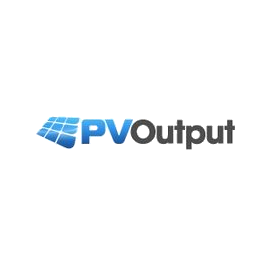

# IoBroker.pvoutputorg

**Dieser Adapter verwendet Sentry-Bibliotheken, um Ausnahmen und Codefehler automatisch an die Entwickler zu melden.** Weitere Details und Informationen zum Deaktivieren der Fehlerberichterstattung finden Sie in Abschnitt [Sentry-Plugin-Dokumentation](https://github.com/ioBroker/plugin-sentry#plugin-sentry)! Die Sentry-Berichterstattung wird ab js-controller 3.0 verwendet.

**Wenn es Ihnen gefällt, erwägen Sie bitte eine Spende:**

Der Adapter verbindet sich mit [PvOutput.org](https://pvoutput.org). System-ID und API-Schlüssel werden zur Verbindungsherstellung verwendet. Beide müssen auf der Administrationsseite konfiguriert werden.
Die System-, Status- und Statistikdaten aller konfigurierten Systeme werden aktuell ausgelesen und als Datenpunkte angezeigt.
Die erzeugte Energie kann dauerhaft auf PvOutput.org hochgeladen werden.

Für detaillierte Informationen siehe [pvoutput.org Hilfe](https://pvoutput.org/help/overview.html)

Wenn Sie pvoutput.org mit einer Spende unterstützen, werden Ihnen zusätzliche Funktionen zur Verfügung gestellt. Diese werden derzeit vom Adapter noch nicht unterstützt.

## Herunterladen
Der Adapter lädt drei Datentypen herunter.

* Systemdaten
* Statusdaten
* Statistische Daten

Zum Herunterladen der Daten führt der Adapter einen anpassbaren Cronjob aus. Die Downloadfrequenz kann auf der Administrationsseite unter „Intervall zum Lesen der Daten [min]“ eingestellt werden.
Der übliche Wert für die Downloadfrequenz beträgt 15 Minuten, jedoch maximal 59 Minuten.

### Systemdaten
Der Adapter ruft Systemstatusinformationen und Live-Ausgabedaten ab.

mehr zu [API-Dokumentation](https://pvoutput.org/help/api_specification.html#id25)

### Statusdaten
Statusdaten (oder Live-Daten) umfassen alle möglichen Systemdaten, die für Ihr System verfügbar sind.

mehr zu [API-Dokumentation](https://pvoutput.org/help/api_specification.html#id16)

### Statistische Daten
Der Adapter ruft Systemstatistikinformationen ab.

mehr zu [API-Dokumentation](https://pvoutput.org/help/api_specification.html#id21)

## Hochladen
Der Daten-Upload ist nur eine Option. Wenn Sie Daten mit einer anderen Anwendung wie sbfspot hochladen, deaktivieren Sie den Upload hier im Adapter.

### Live-Daten hochladen
Zum Hochladen von Live-Daten/Statusdaten führt der Adapter einen anpassbaren Cronjob aus. Die Upload-Frequenz kann auf der Administrationsseite unter „Intervall zum Schreiben von Daten [min]“ eingestellt werden.
Der übliche Wert für die Upload-Frequenz liegt zwischen 5 und 15 Minuten, jedoch maximal bei 59 Minuten.

Der Adapter stellt für jedes System zahlreiche Datenpunkte im Ordner „Upload“ bereit. Lediglich der Datenpunkt „Stromversorgung“ bzw. „Energie“ muss verwendet werden. Alle anderen sind optional.

mehr zu [API-Dokumentation](https://pvoutput.org/help/api_specification.html#add-status-service)

### Leistungs- und Energieberechnung
Leistungs- und Energiewerte lassen sich voneinander ableiten. Sendet ein System nur Leistungswerte, werden die entsprechenden Energiewerte automatisch berechnet. Ebenso berechnet PVOutput die durchschnittliche Leistung, wenn nur Energiewerte gesendet werden.

mehr zu [API-Dokumentation](https://pvoutput.org/help/api_specification.html#power-and-energy-calculation)

### Kumulative Energie - CumulativeFlag in der Systemkonfiguration
Für das kumulative Flag gelten folgende Werte:

1 = Energieerzeugung und Energieverbrauch sind Lebenszeitwerte. Energieerzeugung und -verbrauch werden zu Beginn des Tages auf 0 zurückgesetzt.

2 = Nur die Energieerzeugung ist ein Lebenszeitwert.

3 = Nur der Energieverbrauch ist ein Lebenszeitwert.

Standardwert: 1

mehr zu [API-Dokumentation](https://pvoutput.org/help/api_specification.html#cumulative-energy)

### Net Data – NetDataFlag in der Systemkonfiguration
Wenn dieser Parameter auf 1 gesetzt ist, werden die übergebenen Leistungswerte als Nettoexport/Nettoimport und nicht als Bruttoerzeugung/-verbrauch angegeben.
Diese Option wird für Geräte verwendet, die keine Bruttoverbrauchsdaten melden können. Die bereitgestellten Import-/Exportdaten werden mit den vorhandenen Erzeugungsdaten zusammengeführt, um den Verbrauch zu ermitteln.

Standardwert: nicht ausgewählt

mehr zu [API-Dokumentation](https://pvoutput.org/help/api_specification.html#net-data)

## Daten zum Tagesende hochladen
Am Ende des Tages wird ein separater Upload-Befehl ausgeführt. Es können viele verschiedene Daten hochgeladen werden. Diese Daten stehen auf jedem System als Datenpunkt im Upload-Ordner zur Verfügung. Der Upload ist in allen Fällen optional.

mehr zu [API-Dokumentation](https://pvoutput.org/help/api_specification.html#add-output-service)

## Bekannte Probleme
Bitte erstellen Sie Issues auf [github](https://github.com/rg-engineering/ioBroker.pvoutputorg/issues), falls Sie Fehler finden oder neue Funktionen wünschen.

## Changelog

<!--
  Placeholder for the next version (at the beginning of the line):
  ### **WORK IN PROGRESS**
-->
### 2.0.0 (2026-06-30)
* (René) rewritten in typescript
* (René) support of new version of DasWetter adapter
* (copilot) Adapter requires node.js >= 22 now
* (René) update dependencies

### 1.9.7 (2026-03-15)
* (René) update dependencies + changes based on adapter checker

### 1.9.6 (2025-10-26)
* (René) bug fix sentry

### 1.9.5 (2025-10-21)
* (René) update dependencies + changes based on adapter checker

### 1.9.4 (2025-10-04)
* (René) update dependencies + changes based on adapter checker

[Older changelogs can be found there](CHANGELOG_OLD.md)

## License
MIT License

Copyright (c) 2022-2026 René G. <info@rg-engineering.eu>

Permission is hereby granted, free of charge, to any person obtaining a copy
of this software and associated documentation files (the "Software"), to deal
in the Software without restriction, including without limitation the rights
to use, copy, modify, merge, publish, distribute, sublicense, and/or sell
copies of the Software, and to permit persons to whom the Software is
furnished to do so, subject to the following conditions:

The above copyright notice and this permission notice shall be included in all
copies or substantial portions of the Software.

THE SOFTWARE IS PROVIDED "AS IS", WITHOUT WARRANTY OF ANY KIND, EXPRESS OR
IMPLIED, INCLUDING BUT NOT LIMITED TO THE WARRANTIES OF MERCHANTABILITY,
FITNESS FOR A PARTICULAR PURPOSE AND NONINFRINGEMENT. IN NO EVENT SHALL THE
AUTHORS OR COPYRIGHT HOLDERS BE LIABLE FOR ANY CLAIM, DAMAGES OR OTHER
LIABILITY, WHETHER IN AN ACTION OF CONTRACT, TORT OR OTHERWISE, ARISING FROM,
OUT OF OR IN CONNECTION WITH THE SOFTWARE OR THE USE OR OTHER DEALINGS IN THE
SOFTWARE.