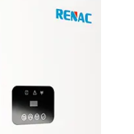

# ioBroker.renacidc

## renacidc-Adapter für ioBroker

Auslesen der Daten vom Solarwechselrichter

## Benutzerhandbuch

Für die Inbetriebnahme werden lediglich der Benutzername und das Passwort des Renacpower-Onlineportals benötigt.

### HAFTUNGSAUSSCHLUSS

Alle Produkt- und Firmennamen sowie Logos sind Marken™ oder eingetragene® Marken ihrer jeweiligen Inhaber. Ihre Verwendung impliziert weder eine Zugehörigkeit zu noch eine Unterstützung durch diese oder verbundene Tochtergesellschaften! Bitte senden Sie daher keine Anfragen an dieses Unternehmen. Dieses private Projekt wird in der Freizeit betrieben und verfolgt keine geschäftlichen Ziele. RENAC ist eine Marke mit Copyright © 2010–2022 China Headquarters Renacpower, Adresse: Block C-12-1, Comprehensive Bonded Zone, Nr. 1 der Zone 5, Datong Road 20, Suzhou Hi-Tech District, Suzhou. Weitere Informationen zum Produktsortiment finden Sie auf der offiziellen Website: <https://www.renacpower.com/>

## Changelog
<!--
	Placeholder for the next version (at the beginning of the line):
	### **WORK IN PROGRESS**
-->
### 0.2.0 (2026-06-03)
- (copilot) Adapter requires node.js >= 22 now
* (raschy) Base-url changed
* (raschy) Special API signature extended

### 0.1.4 (2024-11-08)
* (raschy) Deploy reactivated in the workflow

### 0.1.3 (2024-11-08)
* (raschy) updated to adapter-core 3.2.2
* (raschy) responsive-design customized
* (raschy) Translations revised

### 0.1.2 (2024-08-30)
* (raschy) Inverter details addet

### 0.1.1 (2024-08-28)
* (raschy) Fixing repository checker issues
* (raschy) some refaktoring

[Older changelogs can be found there](https://github.com/raschy/ioBroker.renacidc/blob/main/CHANGELOG_OLD.md)

## License
MIT License

Copyright (c) 2023-2026 raschy <raschy@gmx.de>

Permission is hereby granted, free of charge, to any person obtaining a copy
of this software and associated documentation files (the "Software"), to deal
in the Software without restriction, including without limitation the rights
to use, copy, modify, merge, publish, distribute, sublicense, and/or sell
copies of the Software, and to permit persons to whom the Software is
furnished to do so, subject to the following conditions:

The above copyright notice and this permission notice shall be included in all
copies or substantial portions of the Software.

THE SOFTWARE IS PROVIDED "AS IS", WITHOUT WARRANTY OF ANY KIND, EXPRESS OR
IMPLIED, INCLUDING BUT NOT LIMITED TO THE WARRANTIES OF MERCHANTABILITY,
FITNESS FOR A PARTICULAR PURPOSE AND NONINFRINGEMENT. IN NO EVENT SHALL THE
AUTHORS OR COPYRIGHT HOLDERS BE LIABLE FOR ANY CLAIM, DAMAGES OR OTHER
LIABILITY, WHETHER IN AN ACTION OF CONTRACT, TORT OR OTHERWISE, ARISING FROM,
OUT OF OR IN CONNECTION WITH THE SOFTWARE OR THE USE OR OTHER DEALINGS IN THE
SOFTWARE.