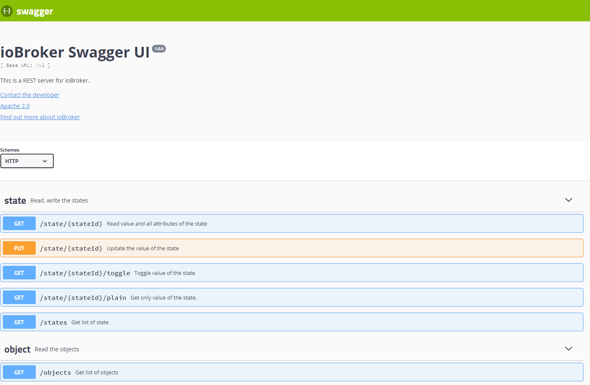

# REST-API-Adapter

**Dieser Adapter nutzt die Sentry-Bibliotheken, um Ausnahmen und Codefehler automatisch an die Entwickler zu melden.** Weitere Details und Informationen zum Deaktivieren der Fehlerberichterstattung finden Sie in [der Sentry-Plugin-Dokumentation](https://github.com/ioBroker/plugin-sentry#plugin-sentry) . Die Sentry-Berichterstattung wird ab js-controller 3.0 verwendet.

Dies ist eine RESTful-Schnittstelle zum Lesen der Objekte und Zustände von ioBroker und zum Schreiben/Steuern der Zustände über HTTP-Get/Post-Anfragen.

Der Zweck dieses Adapters ist ähnlich wie bei simple-api. Dieser Adapter unterstützt jedoch Long-Polling und URL-Hooks zum Abonnieren.

Es verfügt über eine nützliche Weboberfläche zum Bearbeiten der Anfragen:



## Verwendung

Aufruf im Browser`http://ipaddress:8093/` und verwenden Sie Swagger UI, um Zustände und Objekte anzufordern und zu ändern.

Einige Beispiele für Anfragen:

- `http://ipaddress:8093/v1/state/system.adapter.rest-api.0.memHeapTotal` - Zustand als JSON lesen
- `http://ipaddress:8093/v1/state/system.adapter.rest-api.0.memHeapTotal/plain` - Zustand als Zeichenkette lesen (nur Wert)
- `http://ipaddress:8093/v1/state/system.adapter.rest-api.0.memHeapTotal?value=5` - Status mit GET schreiben (nur zur Abwärtskompatibilität mit simple-api)
- `http://ipaddress:8093/v1/sendto/javascript.0?message=toScript&data={"message":"MESSAGE","data":"FROM REST-API"}` - eine Nachricht senden an`javascript.0` im Skript`scriptName`

### Authentifizierung

Um die Authentifizierung zu aktivieren, müssen Sie die folgende Einstellung vornehmen:`Authentication` Option im Konfigurationsdialog.

Es werden drei Authentifizierungsarten unterstützt:

- Anmeldeinformationen in einer Abfrage
- Basisauthentifizierung
- OAuth2 (Bearer)

Zur Authentifizierung bei einer Abfrage müssen Sie Folgendes festlegen:`user` Und`pass` in einer Abfrage wie:

```http
http://ipaddress:8093/v1/state/system.adapter.rest-api.0.memHeapTotal?user=admin&pass=admin
```

Für die Basisauthentifizierung müssen Sie die`Authorization` Kopfzeile mit dem Wert`Basic base64(user:pass)` Die

Für die OAuth2-Authentifizierung müssen Sie die`Authorization` Kopfzeile mit dem Wert`Bearer <AccessToken>` Die

Das Zugriffstoken kann mit einer HTTP-Anfrage wie der folgenden abgerufen werden:

```http
http://ipaddress:8093/oauth/token?grant_type=password&username=<user>&password=<password>&client_id=ioBroker
```

Die Antwort lautet etwa so:

```json
{
    "access_token": "21f89e3eee32d3af08a71c1cc44ec72e0e3014a9",
    "expires_in": "2025-02-23T11:39:32.208Z",
    "refresh_token": "66d35faa5d53ca8242cfe57367210e76b7ffded7",
    "refresh_token_expires_in": "2025-03-25T10:39:32.208Z",
    "token_type": "Bearer"
}
```

## Abonnieren Sie die Änderungen des Staates oder Objekts.

Ihre Anwendung könnte bei jeder Änderung des Zustands oder eines Objekts Benachrichtigungen erhalten.

Dafür muss Ihre Anwendung einen HTTP(S)-Endpunkt bereitstellen, um die Aktualisierungen zu empfangen.

Beispiel in Node.js siehe hier [demoNodeClient.js](https://github.com/ioBroker/ioBroker.rest-api/blob/master/examples/demoNodeClient.js)

## Langfristige Umfragen

Dieser Adapter unterstützt das Abonnieren von Datenänderungen mittels Long Polling.

Ein Beispiel für den Browser finden Sie hier: [demoNodeClient.js](https://github.com/ioBroker/ioBroker.rest-api/blob/master/examples/demoBrowserClient.html)

## Weberweiterung

Dieser Adapter kann als Web-Erweiterung ausgeführt werden. In diesem Fall ist der Pfad unter folgender Adresse verfügbar:`http://ipaddress:8082/rest-api/`

## Beachten

- `POST` Dient immer der Erstellung einer Ressource (unabhängig davon, ob sie dupliziert wurde).
- `PUT` Dient dazu, zu prüfen, ob eine Ressource existiert, und sie gegebenenfalls zu aktualisieren, andernfalls eine neue Ressource zu erstellen.
- `PATCH` dient immer der Aktualisierung einer Ressource

## Befehle

Darüber hinaus können Sie viele Socket-Befehle über eine spezielle Schnittstelle ausführen:

`http://ipaddress:8093/v1/command/<commandName>?arg1=Value2&arg2=Value2`

Z.B

- `http://ipaddress:8093/v1/command/getState?id=system.adapter.admin.0.alive` - den Zustand lesen`system.adapter.admin.0.alive`
- `http://ipaddress:8093/v1/command/readFile?adapter=admin.admin&fileName=admin.png` - um die Datei zu lesen`admin.admin/admin.png` als JSON-Ergebnis
- `http://ipaddress:8093/v1/command/readFile?adapter=admin.admin&fileName=admin.png?binary` - um die Datei zu lesen`admin.admin/admin.png` als Datei
- `http://ipaddress:8093/v1/command/extendObject?id=system.adapter.admin.0?obj={"common":{"enabled":true}}` - zum Neustart des Administrators

Sie können alle Befehle auch mit der POST-Methode anfordern. Der Body muss ein Objekt mit Parametern sein. Beispiel:

```bash
curl --location --request POST 'http://ipaddress:8093/v1/command/sendTo' \
--header 'Content-Type: application/json' \
--data-raw '{
"adapterInstance": "history.0",
"command": "getHistory",
"message": {"id": "system.adapter.admin.0.memRss","options": {"aggregate": "onchange", "addId": true}}
}'
```

Über die grafische Benutzeroberfläche (GUI) können keine POST-Anfragen an Befehle gesendet werden.

<!-- START -->

### Staaten

- `getStates(pattern)` - Ruft die Liste der Zustände für ein Muster ab (z. B. für system.adapter.admin.0.\*). Die grafische Benutzeroberfläche kann Probleme bei der Visualisierung des Ergebnisses haben.
- `getForeignStates(pattern)` - dasselbe wie getStates
- `getState(id)` - Statuswert anhand der ID abrufen
- `setState(id, state)` - Zustandswert mit JSON-Objekt festlegen (z. B.`{"val": 1, "ack": true}` )
- `getBinaryState(id)` - Binärzustand anhand der ID abrufen
- `setBinaryState(id, base64)` - Binärzustand anhand der ID festlegen

### Objekte

- `getObject(id)` - Objekt anhand der ID abrufen
- `getObjects(list)` Alle Zustände und Räume abrufen. Die grafische Benutzeroberfläche kann Probleme bei der Visualisierung des Ergebnisses haben.
- `getObjectView(design, search, params)` - bestimmte Objekte abrufen, z. B. design=system, search=state, params=`{"startkey": "system.adapter.admin.", "endkey": "system.adapter.admin.\u9999"}`
- `setObject(id, obj)` - Objekt mit JSON-Objekt festlegen (z. B.`{"common": {"type": "boolean"}, "native": {}, "type": "state"}` )
- `delObject(id, options)` - ein Objekt anhand seiner ID löschen

### Dateien

- `readFile(adapter, fileName)` - Datei lesen, z. B. adapter=vis.0, fileName=main/vis-views.json. Zusätzlich können Sie in der Abfrage die Option binary=true setzen, um die Antwort als Datei und nicht als JSON zu erhalten.
- `readFile64(adapter, fileName)` Die Datei wird als Base64-String gelesen, z. B. adapter=vis.0, fileName=main/vis-views.json. Alternativ kann die Option binary=true in der Abfrage gesetzt werden, um die Antwort als Datei und nicht als JSON zu erhalten.
- `writeFile64(adapter, fileName, data64, options)` - Datei schreiben, z. B. adapter=vis.0, fileName=main/vis-test.json, data64=eyJhIjogMX0=
- `unlink(adapter, name)` - Datei oder Ordner löschen
- `deleteFile(adapter, name)` - Datei löschen
- `deleteFolder(adapter, name)` - Ordner löschen
- `renameFile(adapter, oldName, newName)` - Datei umbenennen
- `rename(adapter, oldName, newName)` - Datei oder Ordner umbenennen
- `mkdir(adapter, dirName)` - Ordner erstellen
- `readDir(adapter, dirName, options)` - Inhalt des Ordners lesen
- `chmodFile(adapter, fileName, options)` - Dateimodus ändern. Z. B. adapter=vis.0, fileName=main/\*, options =`{"mode": 0x644}`
- `chownFile(adapter, fileName, options)` - Dateibesitzer ändern. Z. B. adapter=vis.0, fileName=main/\*, options =`{"owner": "newOwner", "ownerGroup": "newgroup"}`
- `fileExists(adapter, fileName)` - Prüfen, ob eine Datei existiert

### Administratoren

- `getHostByIp(ip)`- Hostinformationen anhand der IP-Adresse lesen. Z. B. über localhost
- `readLogs(host)` - Dateinamen und Größe der Protokolldateien lesen. Sie können diese mit <http://ipaddress:8093/> abrufen.<fileName>
- `delState(id)` - Zustand und Objekt löschen. Entspricht delObject.
- `getRatings(update)` - Lesen Sie die Adapterbewertungen (wie im Adminbereich)
- `getCurrentInstance()` - Adapter-Namespace lesen (immer rest-api.0)
- `decrypt(encryptedText)` - Entschlüsselung der Zeichenkette mit Systemgeheimnis
- `encrypt(plainText)` - Zeichenkette mit Systemgeheimnis verschlüsseln
- `getAdapters(adapterName)` - Objekte vom Typ "Adapter" abrufen. Optional kann ein Adaptername definiert werden.
- `updateLicenses(login, password)` - Lizenzen vom ioBroker.net-Portal lesen
- `getCompactInstances()` - Liste der Instanzen mit Kurzinformationen lesen
- `getCompactAdapters()` - Liste der installierten Adapter mit Kurzinformationen lesen
- `getCompactInstalled(host)` - Lesen Sie die Kurzinformationen zu den installierten Adaptern.
- `getCompactSystemConfig()` - Lesen Sie die kurze Systemkonfiguration
- `getCompactSystemRepositories()`
- `getCompactRepository(host)` - Kurzarchiv lesen
- `getCompactHosts()` - Kurzinformationen über die Gastgeber erhalten
- `addUser(user, pass)` - Neuen Benutzer hinzufügen
- `delUser(user)` - Benutzer löschen
- `addGroup(group, desc, acl)` - eine neue Gruppe erstellen
- `delGroup(group)` - Gruppe löschen
- `changePassword(user, pass)` - Benutzerpasswort ändern
- `getAllObjects()` - Alle Objekte werden als Liste gelesen. Die grafische Benutzeroberfläche kann Probleme bei der Visualisierung des Ergebnisses haben.
- `extendObject(id, obj)` - Ein Objekt anhand seiner ID mit JSON modifizieren. (z. B.`{"common":{"enabled": true}}` )
- `getForeignObjects(pattern, type)` - dasselbe wie getObjects
- `delObjects(id, options)` - Objekte anhand eines Musters löschen

### Andere

- `updateTokenExpiration(accessToken)`
- `log(text, level[info])` - Keine Antwort - Logeintrag im ioBroker-Log hinzufügen
- `checkFeatureSupported(feature)` - Prüfen, ob die Funktion vom js-Controller unterstützt wird.
- `getHistory(id, options)` - Verlauf lesen. Optionen finden Sie hier: <https://github.com/ioBroker/ioBroker.history/blob/master/docs/en/README.md#access-values-from-javascript-adapter>
- `httpGet(url)` - URL vom Server lesen. Sie können binary=true setzen, um die Antwort als Datei zu erhalten.
- `sendTo(adapterInstance, command, message)` - Sende einen Befehl an die Instanz. Z. B. adapterInstance=history.0, command=getHistory, message=`{"id": "system.adapter.admin.0.memRss","options": {"aggregate": "onchange", "addId": true}}`
- `listPermissions()` - Statische Informationen mit Funktionsberechtigungen lesen
- `getUserPermissions()` - Objekt mit Benutzerberechtigungen lesen
- `getVersion()` - Adapternamen und -version lesen
- `getAdapterName()` - Adapternamen lesen (immer rest-api)
- `clientSubscribe(targetInstance, messageType, data)`
- `getAdapterInstances(adapterName)` - Objekte vom Typ "instance" abrufen. Optional kann adapterName definiert werden.

<!-- END -->

<!--
	Placeholder for the next version (at the beginning of the line):
	### **WORK IN PROGRESS**
-->

## Changelog
### 4.0.2 (2026-06-14)
* (@GermanBluefox) Packages were updated
* (@GermanBluefox) Allowed to define the response content type by sendTo queries
* (@GermanBluefox) Corrected some minor issues

### 4.0.1 (2026-02-17)
* (@GermanBluefox) Corrected some minor issues

### 4.0.0 (2026-02-17)
* (@GermanBluefox) Packages were updated
* (@GermanBluefox) Drop Node.js 18 support

### 3.1.3 (2026-01-19)
* (@GermanBluefox) Caught a seldom race condition on the connection close

### 3.1.1 (2025-10-09)
* (@GermanBluefox) corrected a web extension path

### 3.1.0 (2025-10-05)
* (@copilot, @SimonFischer04) Fix running as web extension, own implementation of unmaintained swagger-node-runner-fork, 
* (@SimonFischer04) remove 18 and add node 24 to tests
* (@SimonFischer04) multiple null error fixes and wrong swagger schema #151
* (@GermanBluefox) updated packages

### 3.0.1 (2025-05-21)
* (@GermanBluefox) Corrected the web extension

### 3.0.0 (2025-04-27)
* (@GermanBluefox) Rewritten in TypeScript
* (@GermanBluefox) Removed binary states

### 2.1.0 (2025-02-27)
* (@GermanBluefox) Added OAuth2 support
* (@GermanBluefox) Updated packages
* (@GermanBluefox) Replaced icons with SVG

### 2.0.3 (2024-07-13)
* (jkuenemund) Changed response for the endpoint get states to the dictionary in swagger

### 2.0.1 (2024-05-23)
* (foxriver76) ported to `@iobroker/webserver`
* (theshengfui) Fixed history requests
* (bluefox) Minimum required node.js version is 16

### 1.1.0 (2023-05-03)
* (bluefox) Converting of the setState values to the according type
* (bluefox) Implemented file operations

### 1.0.5 (2023-03-27)
* (Apollon77) Prepare for future js-controller versions

### 1.0.4 (2022-08-31)
* (bluefox) Check if the port is occupied only on defined interface

### 1.0.2 (2022-07-27)
* (bluefox) Implemented binary read/write operations

### 1.0.1 (2022-07-27)
* (bluefox) Increased the max size of body to 100Mb

### 1.0.0 (2022-05-19)
* (bluefox) Final release

### 0.6.0 (2022-05-18)
* (bluefox) Added sendTo path

### 0.5.0 (2022-05-17)
* (bluefox) Some access errors were corrected

### 0.4.0 (2022-04-26)
* (bluefox) Added socket commands

### 0.3.6 (2022-04-22)
* (bluefox) Added object creation and enumeration reading

### 0.3.5 (2022-04-22)
* (bluefox) Allowed the reading of current subscriptions

### 0.3.4 (2022-04-20)
* (bluefox) Corrected subscription

### 0.3.1 (2022-04-15)
* (bluefox) First release

### 0.1.0 (2017-09-14)
* (bluefox) initial commit

## License
Apache 2.0

Copyright (c) 2017-2026 bluefox <dogafox@gmail.com>