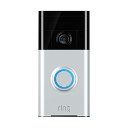

# Ringadapter
Der Ring-Adapter funktioniert mit Ring-Geräten wie der Ring Video Doorbell und der Ring Cam und zeigt an, ob jemand klingelt oder eine Bewegung erkannt wird.
Die Ring Video Doorbell oder Cam sendet einen Videostream, wenn eine Bewegung oder eine Türklingel erkannt wird.

## Installation und Konfiguration
Nach der Installation des Adapters müssen Sie Ihr Token eingeben.
Ring erfordert jetzt die Verwendung der Zwei-Faktor-Authentifizierung (2fa) für alle Konten.
Um das Token zu erhalten, führen Sie bitte die folgenden Schritte auf Ihrer Shell aus.

```shell
npx -p ring-client-api ring-auth-cli
```

oder

```
# Unix
cd /opt/iobroker/node_modules/iobroker.ring/
npm i ring-client-api

cd /opt/iobroker/node_modules/iobroker.ring/node_modules/ring-client-api
node ring-auth-cli
```

Sie können spezielle Variablen für den Pfad und Dateinamen Ihres Livestreams und Schnappschusses verwenden. Diese Variablen werden durch einen Zähler, einen Zeitstempel, eine Ring-ID oder eine Ringart ersetzt.

* `%d`: Unix-Zeitstempel. Beispiel: `test_%d -> test_1588331430061`
* `%g`: Formatiert mit Datum JJJJMMTT. Beispiel: `test_%g -> test_20240614`
* `%t`: Formatierte Zeit HHiiss. Beispiel: `test_%t -> test_235901`
* `%i`: ID Ihres Ringgeräts: Beispiel: `test_%i -> test_234567890`
* `%n`: Zähler seit Start der Ringinstanz. Beispiel: `test_%n -> test_1`
* `%k`: Art Ihres Ring-Geräts: Beispiel: `test_%k -> test_doorbell`

### FAQ
#### Ich erhalte keine Ereignisse, Schnappschüsse und Videos bei Bewegung oder erkannter Person
Glückwunsch, es ist sehr wahrscheinlich, dass Ihr aktuelles Token von Ring auf eine schwarze Liste gesetzt wurde, sodass Sie die Push-Benachrichtigungen, die Sie benötigen, nicht erhalten.
Die beste Möglichkeit, dieses Problem zu beheben, besteht darin, alle vorherigen Browser-/Adapter-Token auf der Ring-Website zu entfernen und ein neues Token für den Adapter zu generieren.

Damit dieser Adapter richtig auf Ereignisse reagieren kann, muss Ring die Push-Benachrichtigung an den verwendeten [Ring-API-Client](https://github.com/dgreif/ring) senden, damit dieser Adapter darauf reagieren kann. Die Logik in diesem Adapter wurde mehrfach überprüft und funktioniert bei vielen Benutzern. Wenn Sie also Probleme mit fehlenden Ereignissen haben, liegt dies wahrscheinlich nicht an diesem Adapter.

### V5 Wichtige Änderungen
1. Einige Datenpunkte wurden umbenannt, um einheitlicher zu sein (z. B. wurde `livestream_request` auf `request` reduziert, da es bereits

befindet sich im Kanal `livestream`).

2. Sie können nun konfigurieren, ob Sie auf Ereignisse (mit Aufzeichnung, Schnappschuss, ...) reagieren möchten oder nicht.
3. Binäre Zustände wurden entfernt.

### V3 Neufassung - Wichtige Änderungen
1. Die Gerätenamen wurden um die Beschreibung erweitert (z.B. von `Gerät 1234567`

zu `Device 1234567 ("Floodlight Garden")`)

2. Snapshot-/Livestream-Daten befinden sich jetzt in einem entsprechenden Kanal, der die anderen Datenpunkte enthält.
3. Das Snapshot-/Livestream-Objekt wurde vom Typ „Meta“ in „State“ mit dem Typ „File“ geändert.
4. Ereignisse (Bewegung, Ding usw.) liegen nun im jeweiligen Kanal vor.
5. Da „Ring-API“ die Unterstützung für Node vor „v16.x“ einstellt, benötigt dieser Adapter „Node v16.x“ oder „Node v18.x“.
6. Aktive Aktualisierungen werden auf einmal alle 2 Stunden reduziert, da wir auf Ereignisse hören/darauf reagieren.

### SIP (vor Version 3.x)
Sie können die SIP-Informationen für eine SIP-Videokonferenz mit Ihrem SIP-Client verwenden.
Der Adapter stellt nicht alle Ringgeräte bereit, da die verwendete API nicht alle Ringgeräte einschließt.

Sie können beispielsweise den Blink SIP-Client auf [http://icanblink.com/](http://icanblink.com/) verwenden.
Um Video zum Laufen zu bringen, gehen Sie in die Einstellungen von Blink und wechseln Sie unter „Konten“ zur Registerkarte „Medien“ und deaktivieren Sie „Audio und Video verschlüsseln“ unter „RTP-Optionen“.
Seien Sie vorsichtig, die SIP-Informationen verfallen nach einigen Sekunden! Hoffentlich kann ich bald einen Videostream unterstützen.
Leider hat [ring.com](https://ring.com) keine offizielle API, die diese Funktion unterstützt.
Wenn Sie die Schaltfläche `livestream request` drücken, erhalten Sie neue SIP-Informationen zum Aufbau einer SIP-Videoanrufsitzung.
Wenn Sie die [ring.com](https://ring.com)-Cloud verwenden, finden Sie unter Verlauf einen HTTP-Link zu Ihrem zuletzt aufgezeichneten Bewegungs-/Türklingelvideo.

## Changelog

<!--
	Placeholder for the next version (at the beginning of the line):
	### **WORK IN PROGRESS**
-->
### 5.1.0 (2024-06-22)

* (SFGJK) #710 Enhancement of filename placeholder feature
* (theimo1221) Updated Packages

### 5.0.10 (2023-11-06)

* (theimo1221) #614 Enforce @homebridge/camera-utils version 2.2.4

### 5.0.8 (2023-11-05)

* (crocri) Code cleanup
* (theimo1221) #614 Add @homebridge/camera-utils as direct depency to mitigate import issue

### 5.0.7 (2023-11-02)

* (theimo1221) Updated Packages
* (theimo1221) Include missing build artifacts

### 5.0.6 (2023-10-29)

* (theimo1221) Updated Packages
* (crocri) Make event debouncing configurable

### 5.0.5 (2023-10-28)

* (theimo1221) #602 Debounce Motion Events by 25 seconds. This prevents multiple events within a short time.

### 5.0.4 (2023-10-27)

* (theimo1221) #603 Add rxjs to normal dependencies instead of dev-dependencies

### 5.0.3 (2023-10-26)

* (theimo1221) #603 Change rxjs import to resolve awkward js build result.

### 5.0.2 (2023-10-25)

* (theimo1221) Remove mixup of callback and async within same function
* (theimo1221) #603 Harden usage of "firstValueFrom"

### 5.0.1 (2023-10-20)

* (theimo1221) Updated Packages
* (theimo1221) Remove legacy states
* (theimo1221) Add stickup_cam_mini_v2

### 5.0.0 (2023-10-10)

* (bluefox) migrated the configuration to JSON
* (crocri) many changes for livestream and high-definition screenshots
* (theimo1221) Refactoring and cleanup
* (crocri) Ding event is now working again for Ring-Intercom
* (crocri) auto livestream creation takes now value from config, before fix
* (crocri) snapshot now async, because snapshot and livestream in parallel do not work
* (crocri) livestream duration now settable via tree entry will be auto reset via livestream request.
* (crocri) two new config entries auto_livestream and auto_snapshot to disable auto creation of livestream and snapshot.
* (crocri) some minor corrections to code
* (crocri) Removed binary States
* (crocri) Improvements for vis compatibility done
* (theimo1221) Refactoring and cleanup

### 4.0.0 (2023-08-22)

* (theimo1221) !!Breaking Change!! From now on Node 18 or 20 is required, Node 16 is not supported anymore
* (theimo1221) Updated Ring-Api to v12 which needs Node 18 or 20
* (theimo1221) Updated Packages

### 3.4.1 (2023-08-06)

* (theimo1221) Compliance to adapter-checker
* (theimo1221) Updated Packages
* (theimo1221) Debounce Doorbell Presses
* (theimo1221) Added Support for cocoa_doorbell_v2
* (theimo1221) Added Support for stickup_cam_longfin
* (theimo1221) Fixed compatibility and recompile

### 3.4.0 (2023-06-09)

* (theimo1221) Updated Packages (which allows node 20 now)

### 3.3.1 (2023-05-18)

* (theimo1221) Updated Packages

### 3.3.0 (2023-04-02)

* (theimo1221) Updated Packages
* (theimo1221) Device with Type stickup_cam_longfin didn't yet support #483

### 3.2.7 (2023-03-22)

* (foxriver76) prepared js-controller v5

### 3.2.6 (2023-02-18)

* (theimo1221) Improve behavior on initial Location load fail
* (theimo1221) Updated Packages

### 3.2.5 (2023-01-28)

* (theimo1221) Updated Packages

### 3.2.4 (2022-12-15)

* (theimo1221) #385 Fix for Unlock Request on intercoms

### 3.2.3 (2022-12-15)

* (theimo1221) Updated Packages
* (theimo1221) #385 Experimental Ring Intercom support

### 3.2.2 (2022-12-02)

* (theimo1221) #373 Fix event receiving for iobroker instances without a unique hostname

### 3.2.1 (2022-12-02)

* (theimo1221) Redeploy

### 3.2.0 (2022-12-02)

* (theimo1221) Updated Packages
* (theimo1221) #373 Increase logging and change recording order on Doorbell Event

### 3.1.9 (2022-11-20)

* (theimo1221) #395 Resolve Package-lock.json issues

### 3.1.8 (2022-11-20)

* (theimo1221) Updated Packages
* (theimo1221) Compliance to the newest ring api version

### 3.1.7 (2022-10-28)

* (theimo1221) Updated Packages

### 3.1.6 (2022-10-28)

* (theimo1221) Inline subscription instead of properties for Event observer

### 3.1.5 (2022-10-16)

* (theimo1221) Updated Packages

### 3.1.4 (2022-10-16)

* (theimo1221) #376 Handling when reconnect fails

### 3.1.3 (2022-10-04)

* (theimo1221) Updated Packages

### 3.1.2 (2022-09-22)

* (theimo1221) Updated Packages
* (theimo1221) Fixed an issue with floodlight control

### 3.1.1 (2022-08-11)

* (theimo1221) Improved Doorbell Event Logging

### 3.1.0 (2022-08-04)

* (bluefox) Allowed to be used with node.js 18

### 3.0.5 (2022-07-05)

* (theimo1221) Improved Log Message on failed Snapshots during event handling
* (theimo1221) Added Support for doorbell oyster

### 3.0.4 (2022-06-17)

* (theimo1221) Fixed Edge Case resulting in lamps being permanently on

### 3.0.3 (2022-06-16)

* (theimo1221) Implemented location mode

### 3.0.1 (2022-06-08)

* (bluefox) Changed the russian translations

### 3.0.0-beta.13 (2022-05-30)

* (theimo1221) Prevented missing of events, due to a socket drop within ring-api-client
* (theimo1221) Improved device logging readability

### 3.0.0-beta.12 (2022-05-28)

* (theimo1221) Fixed error in beta.11 in regard to new installations
* (theimo1221) Harden Event Handling to prevent rare permanent busy occasions
* (theimo1221) Added support for doorbell device `doorbell_graham_cracker`

### 3.0.0-beta.11 (2022-05-24)

* (theimo1221) Added processing of new token provided by ring.

### 3.0.0-beta.10 (2022-05-24)

* (theimo1221) Added `lpd_v4` Doorbell

### 3.0.0-beta.9 (2022-05-21)

* (theimo1221) For stability reasons, perform an active refresh every 2 hours.

### 3.0.0-beta.8 (2022-05-17)

* (theimo1221) Fixed writing to iobroker-data/files folder (thx to Apollon)

### 3.0.0-beta.7 (2022-05-16)

* (theimo1221) Prevent Crashes on unsupported devices

### 3.0.0-beta.6 (2022-05-16)

* (theimo1221) Record more events (without recording twice)
* (theimo1221) Improved snapshot deleting for initial snapshot after restart

### 3.0.0-beta.5 (2022-05-14)

* (theimo1221) Prevented crashes during installation by clearer enforcing of node 16

### 3.0.0-beta.4 (2022-05-14)

* (theimo1221) Changes in io-package.json for release workflow

### 3.0.0-beta.3 (2022-05-14)

* (theimo1221) Rewrote V3 (Breaking Changes listed below)
* (theimo1221) Updated packages
* (theimo1221) Fixed in GitHub release workflow

### 2.0.0-beta.3 (2022-02-08)

* (theimo1221) Fixed adapter checker issues

### 2.0.0-beta.0 (2022-02-05)

* (theimo1221) Updated packages
* (theimo1221) Added JS-Controller 4.0 dependency
* (theimo1221) On ding --> First take snapshot then livestream

### 1.2.8 (2021-10-14)

* (theimo1221) Updated packages

### 1.2.6 (2021-09-05)

* (theimo1221) Updated packages
* (theimo1221) Stopped adapter on unhandled Error
* (theimo1221) Terminated adapter on invalid ring credentials

### 1.2.4-1 (2021-08-12)

* (theimo1221) Updated packages

### 1.2.4-0 (2021-08-07)

* (theimo1221) Refactoring
* (theimo1221) Updated packages

### 1.2.3 (2021-07-30)

* (theimo1221) Updated packages
* (theimo1221) Fixed compatibility issues with new ring api

### 1.2.2 (2021-05-05)

* (theimo1221) Updated packages due to security patches

### 1.2.1 (2021-04-09)

* (theimo1221) Bumped version

### 1.2.0 (2021-04-08)

* (theimo1221) Added new device type spotlightw as doorbell
* (theimo1221) Updated dependencies (ringapi, node-schedule, etc.)

### 1.1.6-3 (2021-03-29)

* (theimo1221) Fixed typo preventing Livestream recordings after motion detection
* (theimo1221) Reduced Levels of Log Messages, to not spam iobroker Log

### 1.1.6-2 (2021-03-29)

* (theimo1221) Fixing some Issues while saving snapshots and place Snapshots within 'iobroker-data' Folder.

### 1.1.6-1 (2021-03-26)

* (theimo1221) Support for Floodlight V2
* (theimo1221) Control Floodlight by Switch

### 1.1.5 (04.11.2020)

* (Stübi) Added floodlight

### 1.1.4 (23.05.2020)

* (Stübi) Added new libraries

### 1.1.3 (06.05.2020)

* (Stübi) Fixed error of missing objects

### 1.1.2 (02.05.2020)

* (Stübi) Fixed health info like missing battery status (Issue #22, Issue #25)
* (Stübi) Change error handling
* (Stübi) Providing Stick Up Cam (BETA)
* (Stübi) Using variables in the filename of the livestream or snapshot

### 1.1.1 (02.05.2020)

* (Stübi) Bugfixing
* (Stübi) User can enable/disable external sentry logging

### 1.1.0 (01.05.2020)

* (Stübi) Node 10 is now required, Node 12 recommended. If you use Node 8 or less, the adapter will stop immediately.
* (Stübi) Tested with js-controller 3. I recommend using js-controller 3 or higher because of sentry logging and more
  features in the future
* (Stübi) Snapshot link will be shown as https or http in state (Issue #18)
* (Stübi) Livestream link added and a request button added to get new livestream
* (Stübi) Old snapshots and livestreams can be deleted on the filesystem
* (Stübi) Sentry logging added
* (Stübi) Small improvements and bugfixing
* (Stübi) Added a Two-Factor Auth (2fa) description (Issue #14, Issue #13, Issue #19)

### 1.0.7 (24.12.2019)

* (Stübi) Bugfixing

### 1.0.6 (20.12.2019)

* (Stübi) Bugfixing: Login with username and password changed
* (Stübi) New feature (BETA): Now you can make snapshots in jpg and a livestream in mp4 format. Unfortunately, the
  snapshot / livestream does not always work!

### 1.0.5 (18.04.2019)

* (Stübi) Bugfixing
* (Stübi) Using new API. With this API livestreaming and snapshots are possible (work still in progress and not
  supported in this version)
* (Stübi) Fixed an error with js-controller 2.0. You need at least this version with js-controller 2.0
* (Stübi) Added two factory authentications

### 1.0.4 (17.04.2019)

* (Stübi) Bugfixing for Ring Pro

### 1.0.3 (09.03.2019)

* (Stübi) Major change! I had to change the used ring.com API to another API. The old one did not work anymore. For this
  reason, a lot has to be redesigned.

### 1.0.2 (01.02.2019)

* (Stübi) More debug information

### 1.0.1 (05.01.2019)

* (Stübi) Support js-controller compact mode

### 1.0.0 (04.01.2018)

* (Stübi) Added a camera device. For this reason, the device name changed from doorbot to doorbell.

### 0.1.3 (20.12.2018)

* (Stübi) Update error handling

### 0.1.2 (17.12.2018)

* (Stübi) Update error handling

### 0.1.1 (15.12.2018)

* (Stübi) Improvements

### 0.1.0 (14.12.2018)

* (Stübi) First Version

## License

MIT License

Copyright (c) 2018-2024 Thorsten <thorsten@stueben.de> / <https://github.com/schmupu>

Permission is hereby granted, free of charge, to any person obtaining a copy
of this software and associated documentation files (the "Software"), to deal
in the Software without restriction, including without limitation the rights
to use, copy, modify, merge, publish, distribute, sublicense, and/or sell
copies of the Software, and to permit persons to whom the Software is
furnished to do so, subject to the following conditions:

The above copyright notice and this permission notice shall be included in all
copies or substantial portions of the Software.

THE SOFTWARE IS PROVIDED "AS IS", WITHOUT WARRANTY OF ANY KIND, EXPRESS OR
IMPLIED, INCLUDING BUT NOT LIMITED TO THE WARRANTIES OF MERCHANTABILITY,
FITNESS FOR A PARTICULAR PURPOSE AND NONINFRINGEMENT. IN NO EVENT SHALL THE
AUTHORS OR COPYRIGHT HOLDERS BE LIABLE FOR ANY CLAIM, DAMAGES OR OTHER
LIABILITY, WHETHER IN AN ACTION OF CONTRACT, TORT OR OTHERWISE, ARISING FROM,
OUT OF OR IN CONNECTION WITH THE SOFTWARE OR THE USE OR OTHER DEALINGS IN THE
SOFTWARE.