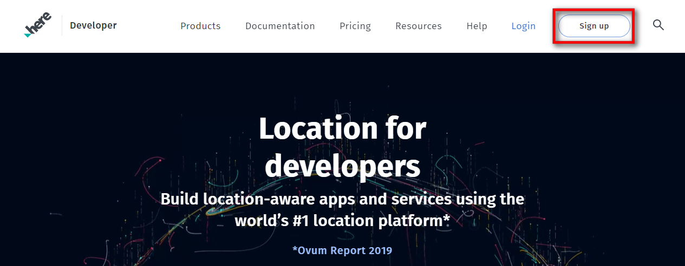
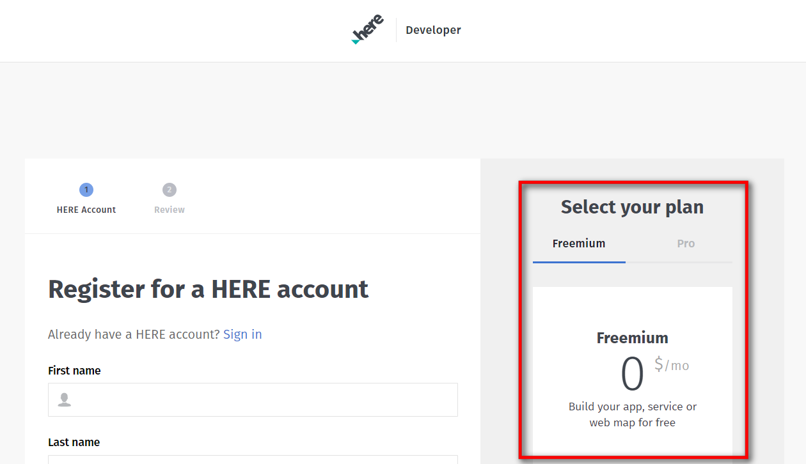
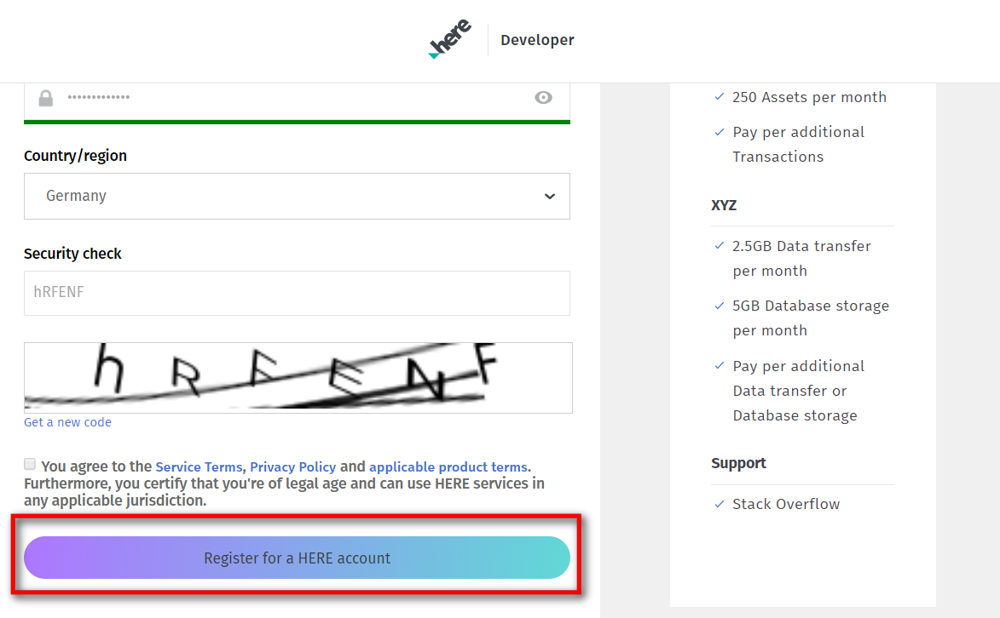
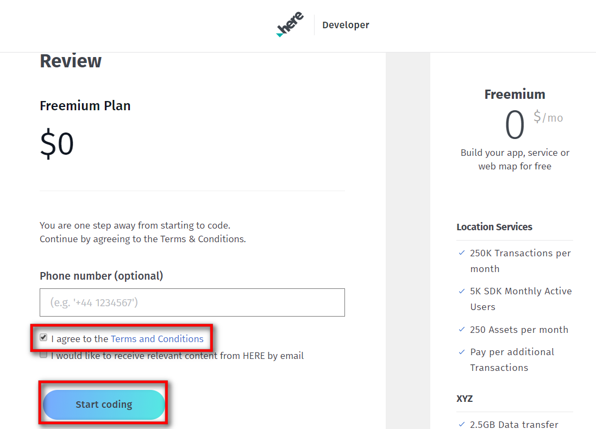
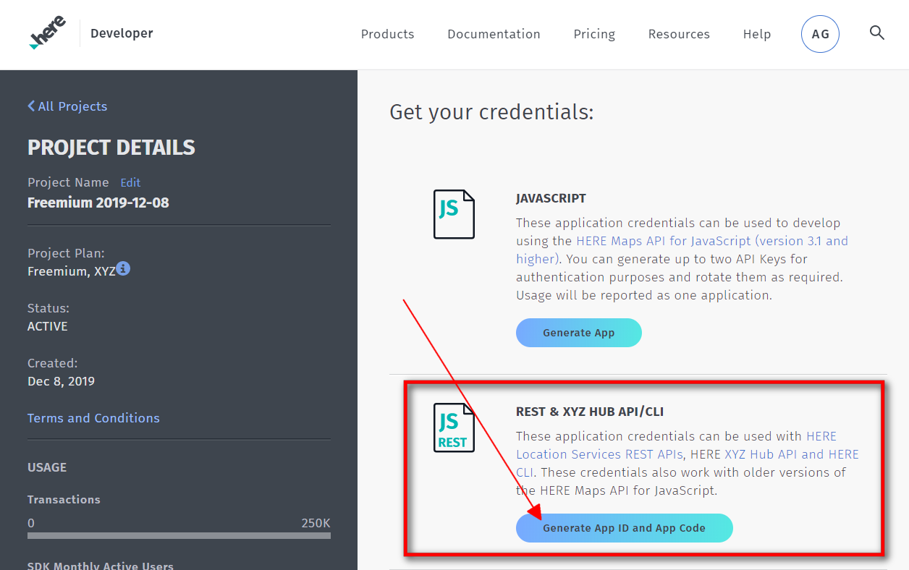
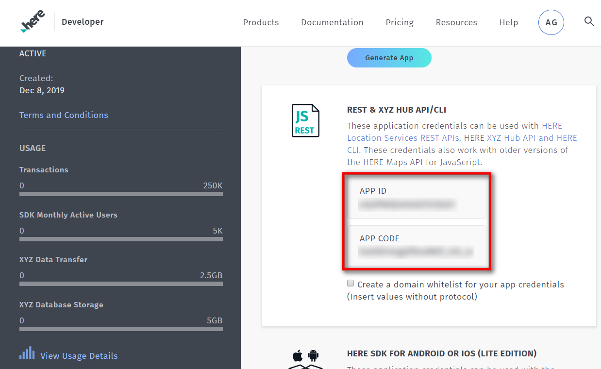

# ioBroker.roadtraffic

 
**Version:**  
 
**Tests:**  

<!--
## Sentry
**This adapter uses Sentry libraries to automatically report exceptions and code errors to the developers.**
For more details and for information how to disable the error reporting see [Sentry-Plugin Documentation](https://github.com/ioBroker/plugin-sentry#plugin-sentry)! Sentry reporting is used starting with js-controller 3.0.
-->

## Über diesen Adapter

Dieser Adapter nutzt die HERE.com-API, um die Verkehrslage auf Ihren Routen zu prüfen. Sie können mehrere Routen konfigurieren. Der Adapter prüft die aktuelle Verkehrslage und zeigt Ihnen die voraussichtliche Fahrzeit an. Der Adapter verfügt über einen Wecker – Sie können ihm also mitteilen, wann Sie zur Arbeit müssen. Daraufhin startet der Adapter die Radiowiedergabe und gibt eine Ansage über Alexa aus (Alexa2-Adapter erforderlich). Alternativ können Sie auch ein eigenes Skript verwenden, um auf den Wecker des Adapters zu reagieren.

## Erste Schritte

Na dann los:

1. Gehen Sie zu <https://developer.here.com/sign-up?create=Freemium-Basic&keepState=true&step=account> und erstellen Sie ein kostenloses Entwicklerkonto (Freemium) bei HERE.com.

2. Stellen Sie sicher, dass „Freemium“ ausgewählt ist, und füllen Sie das Formular auf der linken Seite aus. (Vorname, Nachname, E-Mail-Adresse, …)

3. Klicken Sie auf „Für ein HERE-Konto registrieren“ ... und vergessen Sie nicht, das Kontrollkästchen zu aktivieren (Zustimmung zu den Nutzungsbedingungen usw.).

4. Noch einmal: Stimmen Sie den Allgemeinen Geschäftsbedingungen zu und klicken Sie auf den Button „Mit dem Codieren beginnen“.

5. Auf der nächsten Seite befinden Sie sich bereits auf Ihrem HERE.com-Dashboard. Suchen Sie den REST-Bereich und klicken Sie auf „App generieren“.

6. Klicken Sie auf „API-Schlüssel erstellen“ – Sie erhalten einen API-Schlüssel. Öffnen Sie die Instanzeinstellungen des Roadtraffic-Adapters in ioBroker und fügen Sie den API-Schlüssel in das Konfigurationsfeld ein.

7. Klicken Sie in den Instanzeinstellungen auf das Plus-Symbol und erstellen Sie Ihre erste Route.

Nachdem Sie alle Informationen im Konfigurationsdialog eingegeben haben, klicken Sie auf „Speichern & Schließen“. Der Adapter sollte nun neu starten und Sie können loslegen!

## Wecker

In den Instanzeinstellungen können Sie den Wecker aktivieren, indem Sie die Option „Wecker aktivieren“ auswählen. Der Alexa2-Adapter muss installiert und in den Alexa2-Instanzeinstellungen für die Push-Verbindung konfiguriert sein. Wählen Sie das Alexa-Gerät aus, das vom Adapter gesteuert werden soll, und geben Sie die TuneIn-Sender-ID ein, die beim Auslösen des Weckers abgespielt werden soll. Die Wecklautstärke ist von 0 bis 100 einstellbar. Mit der Sprachausgabe können Sie die Alexa-Ansage festlegen. Standardmäßig lautet sie: „Guten Morgen %name. Bei aktueller Verkehrslage benötigst du %dur zur Arbeit.“

15 Sekunden nachdem Alexa begonnen hat, die angegebene TuneIn-Station abzuspielen, wird die Zeichenfolge angesagt. Wenn Sie beispielsweise eine Route mit dem Namen „Daniel“ haben und der Alarm ausgelöst wird, sagt Alexa: Guten Morgen Daniel. Bei aktueller Verkehrslage benötigen Sie 29 Minuten zur Arbeit.

Lassen Sie das Feld „Speak“ leer, wenn der Adapter lediglich die Wiedergabe des TuneIn-Senders starten und keine Ansage erfolgen soll.

Jede Route verfügt über 7 Alarmkanäle (Montag bis Sonntag). In jedem Kanal gibt es folgende Zustände:

- Ankunftszeit: Geben Sie die Uhrzeit ein, zu der Sie an Ihrem Zielort sein möchten (Beispiel: 07:30 ist halb acht Uhr morgens).
- Badezeit: Geben Sie die Zeit ein, die zur Reisedauer addiert werden soll. (Beispiel: 45 steht für 45 Minuten. Angenommen, Sie haben die Ankunftszeit auf 10:00 Uhr, die Badezeit auf 30 Minuten und die aktuelle Reisedauer auf 1 Stunde eingestellt. Dann wird der Adapter um 08:30 Uhr ausgelöst (Ankunftszeit - Badezeit - Reisedauer).
- aktiviert: Auf „true“ setzen, wenn der Alarm für diesen Tag aktiviert werden soll.
- Ausgelöst: Der Adapter setzt diesen Status auf „true“, sobald der Alarm ausgelöst wird. (Sie können ihn beispielsweise in eigenen Skripten verwenden.) Der Status „ausgelöst“ wird am entsprechenden Tag um 00:00 Uhr wieder auf „false“ zurückgesetzt. (Der Alarm für Samstag wird beispielsweise am Samstag um 00:00 Uhr auf „false“ gesetzt.)

## Credits

Codeanpassungen zur Verwendung von HERE v8 pi wurden von @icastillo15 <starwarsmalu@gmail.com> bereitgestellt.

## Changelog
<!--
    Placeholder for the next version (at the beginning of the line):
    ### **WORK IN PROGRESS**
-->

### **WORK IN PROGRESS**
- (copilot) Adapter requires node.js >= 22 now
- (iobroker-bot) Adapter requires node.js >= 20 now.
- (copilot) Adapter requires admin >= 7.7.22 now
- (copilot) Adapter requires js-controller >= 6.0.11 now
- (copilot) Adapter requires admin >= 7.6.17 now

### 1.2.0 (2024-04-25)
* (mcm1957) Adapter requires node.js >= 18 and js-controller >= 5 now
* (mcm1957) Dependencies have been updated

### 1.1.1 (2023-11-28)
* (mcm1957) Role definitions have been corrected.

### 1.1.0 (2023-11-27)
* (icastillo15) Support for HERE v8 api protocoll has been added.
* (mcm1957) Dependencies have been updated.

### 1.0.2 (2023-10-27)
* (mcm1957) Error logging has been corrected.

### 1.0.1 (2023-10-26)
* (mcm1957) Issues reported by ioBroker adapter checker and lint have been fixed.

### 1.0.0 (2023-10-26)
* (mcm1957) This adapter has been moved into iobroker-community-organization.
* (mcm1957) Adapter requires nodejs 18.x or newer now.
* (mcm1957) Dependencies have been updated.

### 0.2.0 (2019-12-21)
* (BuZZy1337) Alarm-Clock implemented. (See Readme "Alarm-Clock" section for details)

### 0.1.1 (2019-12-13)
* (BuZZy1337) HERE.com changed the Authentication.
* (BuZZy1337) Prepare for Alarm.. (NOT WORKING YET!!! - But needed to push this version because of authentication changes)

### 0.1.0 (2019-12-08)
* (BuZZy1337) Using HERE.com instead of Google API (READ THE UPDATED README!!)

### 0.0.2 (2019-02-27)
* (BuZZy1337) Release to latest repository

### 0.0.1
* (BuZZy1337) initial release

[Older changelogs can be found there](https://github.com/iobroker-community-adapters/ioBroker.roadtraffic/blob/master/CHANGELOG_OLD.md)

## License
The MIT License (MIT)

Copyright (c) 2023-2026 iobroker-community-adapters <iobroker-community-adapters@gmx.de>  
Copyright (c) 2019 BuZZy1337 <buzzy1337@outlook.de>

Permission is hereby granted, free of charge, to any person obtaining a copy
of this software and associated documentation files (the "Software"), to deal
in the Software without restriction, including without limitation the rights
to use, copy, modify, merge, publish, distribute, sublicense, and/or sell
copies of the Software, and to permit persons to whom the Software is
furnished to do so, subject to the following conditions:

The above copyright notice and this permission notice shall be included in
all copies or substantial portions of the Software.

THE SOFTWARE IS PROVIDED "AS IS", WITHOUT WARRANTY OF ANY KIND, EXPRESS OR
IMPLIED, INCLUDING BUT NOT LIMITED TO THE WARRANTIES OF MERCHANTABILITY,
FITNESS FOR A PARTICULAR PURPOSE AND NONINFRINGEMENT. IN NO EVENT SHALL THE
AUTHORS OR COPYRIGHT HOLDERS BE LIABLE FOR ANY CLAIM, DAMAGES OR OTHER
LIABILITY, WHETHER IN AN ACTION OF CONTRACT, TORT OR OTHERWISE, ARISING FROM,
OUT OF OR IN CONNECTION WITH THE SOFTWARE OR THE USE OR OTHER DEALINGS IN
THE SOFTWARE.