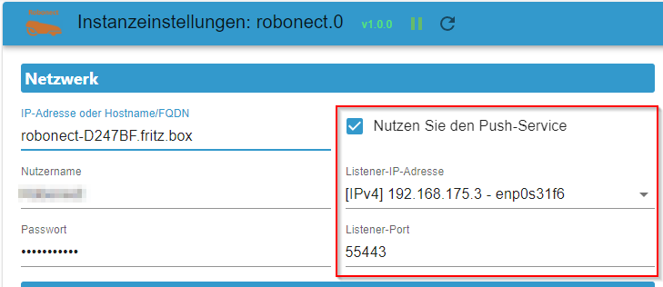
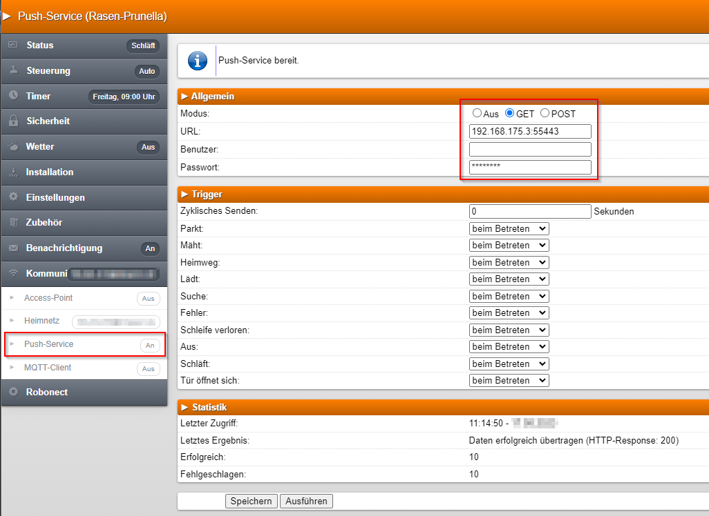

# ioBroker.robonect

Dies ist ein ioBroker-Adapter für Ihren Robonect HX-fähigen Rasenmäher.

- Es wurde mit Robonect v1.1b (mit ZeroConf v1.4) und einem Gardena R70Li getestet.
- Es wurde außerdem mit Robonect v1.3b (mit ZeroConf v1.9) und einem Gardena R40Li getestet.

**Dieser Adapter nutzt die Sentry-Bibliotheken, um Ausnahmen und Codefehler automatisch an die Entwickler zu melden.** Weitere Details und Informationen zum Deaktivieren der Fehlerberichterstattung finden Sie in [der Sentry-Plugin-Dokumentation](https://github.com/ioBroker/plugin-sentry#plugin-sentry) ! Die Sentry-Berichterstattung wird ab js-controller 3.0 verwendet.

## Einstellungen

- Sie müssen die IP-Adresse (z. B. 192.168.xx), den Hostnamen (z. B. robonect-D247BF) oder den vollqualifizierten Domänennamen (z. B. robonect-D247BF.fritz.box) des Robonect-Moduls eingeben. Falls Benutzername und Passwort festgelegt sind, müssen diese ebenfalls angegeben werden.
- ioBroker.robonect fragt Daten in unterschiedlichen Intervallen ab: Standardmäßig werden Statusinformationen alle 60 Sekunden (1 Minute) und andere Informationen alle 900 Sekunden (15 Minuten) abgefragt.
- Es können zwei Ruhezeiten konfiguriert werden, um Abfragen zu verhindern, z. B. mittags und nachts. Informationen, die abgefragt werden können, ohne den Rasenmäher zu aktivieren (und ihn piepen zu lassen), werden weiterhin abgefragt.
- Für jede API-Anfrage kann das Abfrageintervall (Status oder Info) ausgewählt oder die Abfrage ganz eingestellt werden.
- Push-Dienst: Bei Aktivierung wählen Sie die IP-Adresse und den Port aus, an dem der Adapter lauschen soll.

### Passwort für Robonect

Versionen vor v1.3.0 erforderten ein einfaches Passwort, das nur Klein- und Großbuchstaben sowie Zahlen enthielt. Ab Version 1.3.0 sind sichere Passwörter durch die Implementierung der HTTP-Basisauthentifizierung möglich.

### Push-Dienst

Das Robonect-Modul verfügt über eine Konfigurationsoption namens „Push-Dienst“. Dieser sendet Statusinformationen abhängig von bestimmten konfigurierbaren Ereignissen. Ist die Option aktiviert, empfängt der Adapter Push-Benachrichtigungen, sobald eines dieser Ereignisse eintritt. Mit aktivierter Option können Sie deutlich längere Abfrageintervalle als die Standardeinstellungen verwenden (z. B. 6–12 Stunden für Status und 24 Stunden für Informationen). Diese Daten müssen ebenfalls im Robonect-Modul konfiguriert werden. Selbst wenn Sie alle IP-Adressen (0.0.0.0) abhören, müssen Sie die tatsächliche IP-Adresse in Robonect konfigurieren. Das zu verwendende IP-Format ist beispielsweise 192.168.xx:Port.

- Sie können in Robonect GET oder POST auswählen – beides funktioniert und führt zu genau demselben Ergebnis.
- Es werden weder Benutzername noch Passwort benötigt.

Da nur eine Teilmenge der Statusinformationen übertragen wird (WLAN-Signal, Status, Stoppt, Modus, Dauer, Stunden, Entfernung und Akku), ist weiterhin ein Pulling erforderlich, z. B. um den Blade-Status zu erhalten.

### Die Push-Service-Konfiguration sollte wie folgt aussehen

#### Administratorkonfiguration

#### Robonect-Konfiguration

## Kontrolle

### Modus

Der Betriebsmodus des Rasenmähers kann durch Ändern von robonect.0.status.mode gesteuert werden. Mögliche Modi sind „Auto“, „Home“, „Manual“, „End of day“ und „Job“ (derzeit noch nicht vollständig implementiert).

### Erweiterungen

Die Erweiterungen GPIO 1, GPIO 2, OUT 1 und OUT 2 des Robonect-Moduls lassen sich steuern. Voraussetzung dafür ist, dass der Modus der Erweiterung über die Robonect-Weboberfläche auf „API“ konfiguriert ist. Sind beispielsweise LEDs an OUT1 angeschlossen, können diese nachts ein- und morgens ausgeschaltet werden, indem Robonect.0.extension.out1.status auf „true“ oder „false“ gesetzt wird.

## Bekannte Probleme:

- Um sicherzustellen, dass RoboConnect erreichbar ist, pingt der Adapter das Gerät an, bevor er Anfragen sendet. Dieser Ping kann insbesondere dann fehlschlagen, wenn ioBroker in einem Container installiert ist. Das Problem liegt nicht am Adapter selbst, aber da es auftreten kann und die Lösungsfindung recht schwierig ist, versuchen Sie Folgendes:`sudo chmod 4755 /bin/ping` in einer Shell innerhalb des ioBroker-Containers. Diese Lösung setzt voraus, dass ein Berechtigungsproblem zwischen dem ioBroker-Benutzer und dem Ping-Dienstprogramm besteht.

## Changelog
### 1.4.2 (2024-10-01)
- (grizzelbee) Fix: Minor fix in readme.md for release script

### 1.4.1 (2024-09-30)
- (grizzelbee) New: Added ioBroker adapter release script
- (grizzelbee) Fix  [#18](https://github.com/Grizzelbee/ioBroker.robonect/issues/48): Fixed some issues mentioned by adapter-checker

### 1.4.0 (2024-09-11)

- (grizzelbee) Upd: Dependencies got updated
- (grizzelbee) Fix: minor fixes for adapter checker the require a minor release

### 1.3.6 (2024-06-21)

- (grizzelbee) Upd: Dependencies got updated
- (grizzelbee) Fix: minor fixes for AdapterChecker

### 1.3.5 (2024-06-04)

- (grizzelbee) Upd: Dependencies got updated
- (grizzelbee) Upd: Requires at least admin  v6.13.16
- (grizzelbee) Upd: Requires at least nodeJs v18.0.2
- (grizzelbee) Upd: Updated translations
- (grizzelbee) Upd: Reorganized Admin-UI
- (grizzelbee) New: Added Ping-Option to admin

### 1.3.4 (2023-10-10)

- (grizzelbee) Chg: massive code refactoring 
- (grizzelbee) Fix: Fixed false error message when PushService is listening to all IPv4 or IPv6 addresses
- (grizzelbee) Chg: Forcing pollType info for pushService when enabled it's enabled in config

### 1.3.2 (2023-10-04)

* (grizzelbee) Fix: Switching of extensions works now
* (grizzelbee) Fix: Fixed false error message when switching extensions

### 1.3.1 (2023-10-02)

* (grizzelbee) Chg: removed unnecessary Info log entries

### 1.3.0 (2023-10-02)

* (grizzelbee) Chg: [#28](https://github.com/Grizzelbee/ioBroker.robonect/issues/28) Changed authentication method from URL-Encoding to basic authentication
* (grizzelbee) Chg: [#27](https://github.com/Grizzelbee/ioBroker.robonect/issues/27) Improved error handling
* (grizzelbee) Upd: Dependencies got updated

### 1.2.0 (2023-09-22)

* (mcm1957) Fix: Adapter requires NodeJs >= 16.0.0  
* (crocri)  New: Introduced code to clear errors 
* (crocri)  Upd: Highlighted issues in functions getValueAsync() and testPushServerConfig()
* (grizzelbee) Fix: Fixed functions getValueAsync() and testPushServerConfig()

### 1.1.5 (2023-09-08)

* (grizzelbee) Fix: Command-URL was invalid when Robonect UI wasn't protected by username and password
* (grizzelbee) Upd: minor code refactoring

### 1.1.4 (2023-09-04)

* (grizzelbee) Fix: Attempting to fix the error: Cannot read properties of null (reading 'val')

### 1.1.3 (2023-09-01)

* (grizzelbee) New: Added release script for easier publishing to stable repo

### 1.1.1 (2023-08-24)

* (grizzelbee) Fix: Fixed status.stopped for push messages.

### 1.1.0 (2023-08-23)

* (grizzelbee) Fix: [#18](https://github.com/Grizzelbee/ioBroker.robonect/issues/18) Showing values for battery with fractions (again)
* (grizzelbee) New: Added START button
* (grizzelbee) New: Added STOP button
* (grizzelbee) New: Added SERVICE button to reboot, shutdown or sleep Robonect module
* (grizzelbee) New: Push states and interval can be set
* (grizzelbee) New: Nickname of the mower can be set
* (grizzelbee) New: Timers of the mower can be set

### 1.0.5 (2023-08-22)

* (grizzelbee) Upd: Added new state #18 - Garage door is opening
* (grizzelbee) Fix: Status.stopped gets correctly updated

### 1.0.4 (2023-08-22)

* (grizzelbee) Upd: Improved error handling

### 1.0.3 (2023-08-21)

* (grizzelbee) Upd: Improved error handling
* (grizzelbee) Fix: some bug fixes
* (grizzelbee) Upd: Renamed jsonConfig.json5 to jsonConfig.json to get better compatibility

### 1.0.2 (2023-08-18)

* (grizzelbee) Fix: Updated package.json to deliver jasonConfig.json5

### 1.0.1 (2023-08-18)

* (grizzelbee) Upd: Documentation got updated

### 1.0.0 (2023-08-17)

* (grizzelbee) Upd: Dependencies got updated
* (grizzelbee) Upd: Some fixes to make adapter-checker happy
* (grizzelbee) Upd: Updated git workflows
* (grizzelbee) New: Dropped request.js since it's deprecated
* (grizzelbee) New: Replaced request.js by axios.js for http requests
* (grizzelbee) New: Add Webserver for Push-Service API
* (grizzelbee) New: Add adapter-dev support
* (grizzelbee) New: Added snyk plugin
* (grizzelbee) New: Swapped Admin UI to V5

### 0.1.4

* (braindead1) changed polling log level from info to debug
* (braindead1) implemented polling of garage door status

### 0.1.3

* (braindead1) implemented JsonLogic & refactoring

### 0.1.2

* (braindead1) fixed GPS

### 0.1.1

* (braindead1) fixed typo

### 0.1.0

* (braindead1) implemented rest times

### 0.0.12

* (braindead1) improved polling

### 0.0.11

* (braindead1) implemented weather and GPS polls

### 0.0.10

* (braindead1) first stable version

### 0.0.9

* (braindead1) adapter improvements

### 0.0.8

* (braindead1) fixed some issues caused by different configurations

### 0.0.7

* (braindead1) prepared adapter for latest repository

### 0.0.6

* (braindead1) fixed minor issues

### 0.0.5

* (braindead1) updated to work with Robonect HX version 1.1b

### 0.0.4

* (braindead1) updated to work with Robonect HX version 1.0 Beta5

### 0.0.3

* (braindead1) support of Admin3

### 0.0.2

* (braindead1) updated to work with Robonect HX version 1.0 Beta2

### 0.0.1

* (StefSign) initial commit

## License

The MIT License (MIT)

Copyright (c) 2024 grizzelbee

Permission is hereby granted, free of charge, to any person obtaining a copy
of this software and associated documentation files (the "Software"), to deal
in the Software without restriction, including without limitation the rights
to use, copy, modify, merge, publish, distribute, sublicense, and/or sell
copies of the Software, and to permit persons to whom the Software is
furnished to do so, subject to the following conditions:

The above copyright notice and this permission notice shall be included in
all copies or substantial portions of the Software.

THE SOFTWARE IS PROVIDED "AS IS", WITHOUT WARRANTY OF ANY KIND, EXPRESS OR
IMPLIED, INCLUDING BUT NOT LIMITED TO THE WARRANTIES OF MERCHANTABILITY,
FITNESS FOR A PARTICULAR PURPOSE AND NONINFRINGEMENT. IN NO EVENT SHALL THE
AUTHORS OR COPYRIGHT HOLDERS BE LIABLE FOR ANY CLAIM, DAMAGES OR OTHER
LIABILITY, WHETHER IN AN ACTION OF CONTRACT, TORT OR OTHERWISE, ARISING FROM,
OUT OF OR IN CONNECTION WITH THE SOFTWARE OR THE USE OR OTHER DEALINGS IN
THE SOFTWARE.