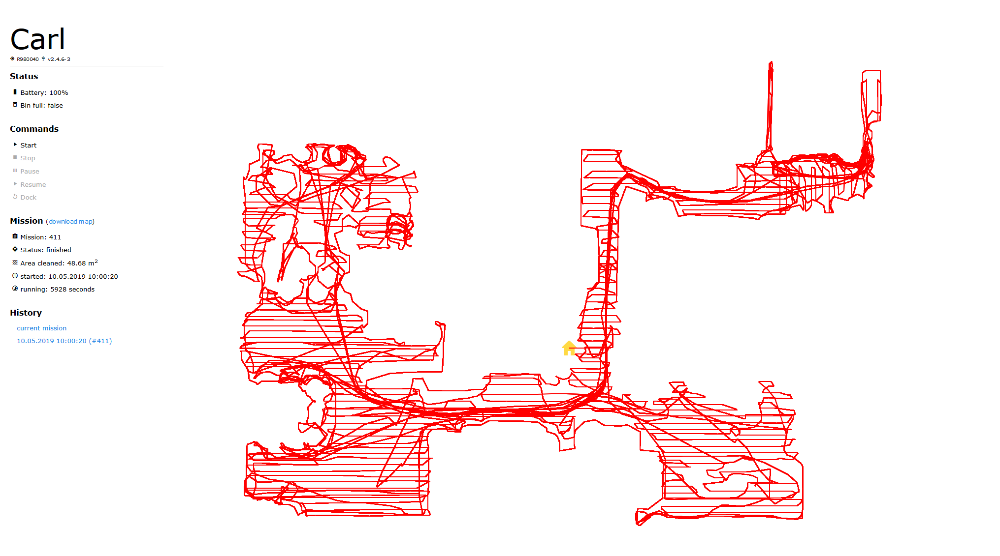

# IoBroker.roomba Verbinden Sie Ihren iRobot Roomba mit ioBroker.
Basierend auf der dorita980-Bibliothek https://github.com/koalazak/dorita980#readme

[](https://travis-ci.com/iobroker-community-adapters/ioBroker.roomba)

**Inhaltsverzeichnis**

1. [Funktionen](#Funktionen)
2. [Installation](#installation)
3. [Setup-Anweisungen](#setup-Anweisungen)
4. [Unterstützte Roomba- / Firmware-Versionen](#supported-roombas--firmware-versions)
5. [Kanäle & Zustände](#channels--states)
6. [Beschreibung der Einstellungen (unvollständig)](#Beschreibung-der-Einstellungen-unvollständig)
7. [Smart Home / Alexa-Integration mit ioBroker.javascript](#smart-home--alexa-integration-using-iobrokerjavascript)
8. [Änderungsprotokoll](#Änderungsprotokoll)
9. [Credits](#Credits)
10. [Lizenz](#Lizenz)

## Eigenschaften
Die folgenden Funktionen sind mit diesem Adapter ausgestattet:

- __Befehle__ (`start`, `stop`, `resume`, `pause`, `dock`) an deinen Roomba senden
- Rufen Sie __Gerätestatus__ ab, z. B. Batterie, angedockt, voll / eingesetzter Behälter (siehe [Kanäle & Zustände](#channels--states) für eine vollständige Liste)
- Rufen Sie __Gerätekonfiguration__ ab, z. B. Einstellungen, Netzwerk- oder Zeitplaneinstellungen (siehe [Channels & States](#channels--states) für eine vollständige Liste)
- Rufen Sie __Gerätestatistiken__ ab, wie z. B. Gesamtmissionen, Stunden auf der Dockingstation usw. (siehe [Channels & States](#channels--states) für eine vollständige Liste)
- Abrufen von Informationen über __aktuelle Mission__ (wenn Ihr Roomba reinigt), wie Start- und Endzeit, Gesamtlaufzeit, gereinigte Quadratmeter usw. (nur bei unterstützten Roomba's siehe [Unterstützte Roomba's / Firmware-Versionen](#supported-roombas --firmware-versionen))
- __Karte basierend auf den empfangenen Missionsdaten zeichnen__ (nur auf unterstützten Roomba's)
- __Webinterface__, das den Status und die Karte der aktuellen sowie vorherigen / archivierten Missionen anzeigt:

  

## Installation
ioBroker.roomba benötigt [Segeltuch](https://www.npmjs.com/package/canvas), um Karten der Roomba-Missionen zu zeichnen. ioBroker wird versuchen, diese Abhängigkeit mit der Installation von ioBroker.roomba zu installieren.

Allerdings müssen Sie wahrscheinlich Paketabhängigkeiten von Canvas (und Canvas selbst) mit dem folgenden Befehl installieren:

###Linux
```
sudo apt-get install build-essential libcairo2-dev libpango1.0-dev libjpeg-dev libgif-dev librsvg2-dev
```

Führen Sie außerdem den folgenden Befehl __im Verzeichnis ioBroker.roomba__ aus (`/opt/iobroker/node_modules/iobroker.roomba`):

```
sudo npm install canvas --unsafe-perm=true
```

### Fenster
1. Stellen Sie sicher, dass Sie `node-gyp` installiert haben über

```
npm install -g node-gyp
```

2. Stellen Sie sicher, dass Sie Build Essentials installiert haben über

```
npm install --global --production windows-build-tools
```

3. Laden Sie GTK 2 (für [Win32](http://ftp.gnome.org/pub/GNOME/binaries/win32/gtk+/2.24/gtk+-bundle_2.24.10-20120208_win32.zip) oder [Win64](http://ftp.gnome.org/pub/GNOME/binaries/win64/gtk+/2.22/gtk+-bundle_2.22.1-20101229_win64.zip)) und entpacken (zB nach `C:\path\to\GTK2`)
4. Laufen

```
node-gyp rebuild --GTK_Root=C:\path\to\GTK2
```

5. Installieren Sie Canvas aus dem Ordner iobroker.roomba

```
cd C:\path\to\iobroker\node_modules\iobroker.roomba
npm install canvas
```

Weitere Informationen finden Sie unter https://github.com/Automattic/node-canvas/wiki/Installation:-Windows.

## Setup-Anweisungen
### Automatisierte Einrichtung
Um ioBroker.roomba automatisch einzurichten, folgen Sie den Anweisungen im Admin-Panel von ioBroker.roomba.

**ACHTUNG**: Die Authentifizierungsdaten sind nicht die gleichen, die Sie in der Smartphone-App verwenden!

1. Stellen Sie sicher, dass der ioBroker.roomba-Adapter gestartet ist.
2. Stellen Sie sicher, dass sich Ihr Roboter auf der Home Base befindet und eingeschaltet ist (grüne Lichter leuchten).
3. Halten Sie dann die HOME-Taste Ihres Roboters gedrückt, bis eine Reihe von Tönen abgespielt wird (ca. 2 Sekunden).
4. Lassen Sie die Taste los und Ihr Roboter blinkt das WIFI-Licht.
5. Dann kommen Sie hierher zurück und drücken Sie die Taste, um IP und Anmeldeinformationen abzurufen.

Wenn der automatisierte Prozess beim Abrufen Ihrer Anmeldeinformationen fehlschlägt, verwenden Sie bitte die manuelle Einrichtung.

### Manuelle Einrichtung
Für die manuelle Einrichtung siehe https://github.com/koalazak/dorita980#how-to-get-your-usernameblid-and-password.

## Unterstützte Roomba- / Firmware-Versionen
### Unterstützte Firmware-Versionen
| Software-Version | Firmware-Info | Unterstützt |
| ---------------- | ------------- | --------- |
| v1.4 | [Versionshinweise](https://homesupport.irobot.com/app/answers/detail/a_id/19549#rn_PageTitle) |  **unterstützt ( inkl. gesetzl. Karte)** |
| v3.2.xx | [Versionshinweise](https://homesupport.irobot.com/app/answers/detail/a_id/541#rn_PageTitle) |  **unterstützt** ( KEINE Karte) |
| v3.2.xx | [Versionshinweise](https://homesupport.irobot.com/app/answers/detail/a_id/541#rn_PageTitle) |  **unterstützt** ( KEINE Karte) |

### Unterstützte Roomba's
| Serie | Modelle _(unvollständig)_ | Software-Version | Firmware-Info | Unterstützt |
| ----- | --------------------- | ---------------- | ------------- | --------- |
| Roomba® 6xx | 605, 606, 612, 616, 671, 676, 680, 696 | v3.2.40 | [Versionshinweise](https://homesupport.irobot.com/app/answers/detail/a_id/541#rn_PageTitle) | (höchstwahrscheinlich) |
| Roomba® 6xx | [692](https://github.com/iobroker-community-adapters/ioBroker.roomba/issues/28) | v3.5.62 | [Versionshinweise](https://homesupport.irobot.com/app/answers/detail/a_id/541#rn_PageTitle) |  **unterstützt** ( KEINE Karte) |
| Roomba® 7xx | 774, 785, | - | |  _Modell bietet keine WLAN-Konnektivität, daher keine Unterstützung_ |
| Roomba® 8xx | 880, 886, 891, 896 | - | [Versionshinweise](https://homesupport.irobot.com/app/answers/detail/a_id/541#rn_PageTitle) | (höchstwahrscheinlich) |
| Roomba® 8xx | [895]((https://forum.iobroker.net/post/245274)) | v3.2.10 / 40 / 69 | [Versionshinweise](https://homesupport.irobot.com/app/answers/detail/a_id/541#rn_PageTitle) |  **unterstützt** ( KEINE Karte) |
| Roomba® 9xx | 965, 981 | - | [Versionshinweise](https://homesupport.irobot.com/app/answers/detail/a_id/529#rn_PageTitle) | (höchstwahrscheinlich) |
| Roomba® 9xx | [960](https://forum.iobroker.net/user/jb_sullivan), [966](https://forum.iobroker.net/user/thomaslpz), 980 | v2.4.6-3 | [Versionshinweise](https://homesupport.irobot.com/app/answers/detail/a_id/529#rn_PageTitle) |  **unterstützt (inkl. Karte)** |
| Roomba® i | [i7 (7150)](https://forum.iobroker.net/post/240589), i7+ (7550) | v1.4 | [Versionshinweise](https://homesupport.irobot.com/app/answers/detail/a_id/19549#rn_PageTitle) |  **unterstützt (inkl. Karte)** |
| Roomba® e5 | [e5](https://forum.iobroker.net/topic/7657/irobot-roomba-adapter/158) | v3.4.42 | [Versionshinweise](https://homesupport.irobot.com/app/answers/detail/a_id/6345#rn_PageTitle) |  **unterstützt** ( KEINE Karte) |
| Roomba® s | [S9+](https://github.com/Zefau/ioBroker.roomba/issues/34) | v3.2.4 | [Versionshinweise](https://homesupport.irobot.com/app/answers/detail/a_id/26887/kw/s9%2B#rn_PageTitle) |  **unterstützt (inkl. Karte)** |
| Roomba® s | [S9+](https://github.com/Zefau/ioBroker.roomba/issues/34) | v3.2.4 | [Versionshinweise](https://homesupport.irobot.com/app/answers/detail/a_id/26887/kw/s9%2B#rn_PageTitle) |  **unterstützt (inkl. Karte)** |

Bitte helfen Sie uns bezüglich der unterstützten Geräte und lassen Sie mich [über ein Problem wissen](https://github.com/iobroker-community-adapters/ioBroker.roomba/issues), ob Ihr Roomba-Modell unterstützt wird!

## Kanäle & Staaten
Nach erfolgreicher Einrichtung werden folgende Kanäle und Zustände angelegt:

| Kanal | Ordner | Staat | Beschreibung |
| ------- | ------ | ----- | ----------- |
| Reinigung | - | - | Befehle und Informationen zum Reinigungsprozess |
| Reinigung | letzte | - | Letzte Befehle an Roboter gesendet |
| Reinigung | letzte | Befehl | Letzter an Roboter gesendeter Befehl |
| Reinigung | letzte | Zeitstempel | Zeitstempel letzter Befehl wurde gesendet |
| Reinigung | letzte | Datum/Uhrzeit | DateTime letzter Befehl wurde gesendet |
| Reinigung | letzte | Initiator | Initiator des letzten Befehls |
| Reinigung | letzte | Zyklus | Zyklus |
| Reinigung | letzte | Phase | Phase |
| Reinigung | letzte | Fehler | Zeigt einen Fehler während der letzten Mission an |
| Reinigung | Zeitplan | - | Fahrplaninformationen |
| Reinigung | Zeitplan | Zyklus | Zeitplanzyklus (Sonntag bis Samstag) |
| Reinigung | Zeitplan | Stunden | Stunde bis Zyklusbeginn (Sonntag bis Samstag) |
| Reinigung | Zeitplan | Minuten | Minute bis Zyklusstart (Sonntag bis Samstag) |
| Reinigung | - | Dock | Senden Sie den Roboter an die Dockingstation |
| Reinigung | - | Pause | Aktuellen Reinigungsprozess anhalten |
| Reinigung | - | Lebenslauf | Fortsetzen des aktuellen Reinigungsprozesses |
| Reinigung | - | starten | Reinigungsprozess starten |
| Reinigung | - | halt | Stoppen Sie den aktuellen Reinigungsprozess |
| Gerät | - | - | Geräteinformationen |
| Gerät | Netzwerk | - | Netzwerkinformationen |
| Gerät | Netzwerk | dhcp | Geben Sie an, ob DHCP aktiviert ist |
| Gerät | Netzwerk | Router | Mac-Adresse des Routers |
| Gerät | Netzwerk | ip | IP-Adresse |
| Gerät | Netzwerk | Subnetz | Subnetzadresse |
| Gerät | Netzwerk | Gateway | Gateway-Adresse |
| Gerät | Netzwerk | dns1 | Primäre DNS-Adresse |
| Gerät | Netzwerk | DNS2 | Sekundäre DNS-Adresse |
| Gerät | Vorlieben | - | Einstellungen festlegen |
| Gerät | Vorlieben | binPause | **UNBEKANNT** |
| Gerät | Vorlieben | TeppichBoostAuto | Automatisch: Roomba erhöht automatisch seine Saugleistung, um Teppiche gründlich zu reinigen. |
| Gerät | Vorlieben | TeppichBoostHigh |Performance-Modus: Roomba erhöht immer sein Vakuum, um die Reinigungsleistung auf allen Bodenoberflächen zu maximieren. |
| Gerät | Vorlieben | ecoCharge | **UNBEKANNT** |
| Gerät | Vorlieben | noAutoPässe | One Pass: Roomba deckt alle Bereiche mit einem einzigen Reinigungspass ab. |
| Gerät | Vorlieben | noPP | **UNBEKANNT** |
| Gerät | Vorlieben | nur öffnen | **UNBEKANNT** |
| Gerät | Vorlieben | schedHold | **UNBEKANNT** |
| Gerät | Vorlieben | zweiPass | Roomba wird alle Bereiche ein zweites Mal abdecken. Dies kann in Haushalten mit Haustieren oder für eine gelegentliche Tiefenreinigung hilfreich sein. |
| Gerät | Versionen | - | Versionsinformationen |
| Gerät | Versionen | hardwareRev | Hardware-Revision |
| Gerät | Versionen | Batterietyp | Batterietyp |
| Gerät | Versionen | soundVer | **UNBEKANNT** |
| Gerät | Versionen | uiSwVer | **UNBEKANNT** |
| Gerät | Versionen | navSwVer | **UNBEKANNT** |
| Gerät | Versionen | wifiSwVer | **UNBEKANNT** |
| Gerät | Versionen | MobilitätVer | **UNBEKANNT** |
| Gerät | Versionen | bootloaderVer | Bootloader-Version |
| Gerät | Versionen | umiVer | **UNBEKANNT** |
| Gerät | Versionen | softwareVer | Softwareversion |
| Gerät | - | \_rawData | Rohdaten der Präferenzen als json |
| Gerät | - | mac | Mac-Adresse des Roboters |
| Gerät | - | Name | Name des Roboters |
| Gerät | - | Typ | Robotertyp |
| Staaten | - | - | Statusinformationen |
| Staaten | - | \_verbunden | Verbindungsstatus |
| Staaten | - | Batterie | Akkustand des Roboters |
| Staaten | - | binFull | Geben Sie an, ob der Behälterstatus voll ist |
| Staaten | - | binEingefügt | Geben Sie an, ob der Behälter eingefügt ist |
| Staaten | - | angedockt | Geben Sie an, ob der Roboter angedockt ist |
| Staaten | - | Signal | Signalstärke |
| Staaten | - | Status | Aktueller Status des Roboters |
| Statistik | - | - | Statistische Informationen |
| Statistik | Missionen | - | Missionsstatistiken |
| Statistik | Missionen | gescheitert | Anzahl fehlgeschlagener Reinigungsjobs |
| Statistik | Missionen | erfolgreich sein | Anzahl erfolgreicher Reinigungsaufträge |
| Statistik | Missionen | insgesamt | Anzahl Reinigungsjobs |
| Statistik | Zeit | - | Zeitstatistik |
| Statistik | Zeit | durchschn.Min | **UNBEKANNT** |
| Statistik | Zeit | hOnDock | **UNBEKANNT** |
| Statistik | Zeit | nVerfügbar | **UNBEKANNT** |
| Statistik | Zeit | estCap | **UNBEKANNT** |
| Statistik | Zeit | nLithChrg | **UNBEKANNT** |
| Statistik | Zeit | nNimhChrg | **UNBEKANNT** |
| Statistik | Zeit | nDocks | **UNBEKANNT** |
| - | - | refreshedDateTime | DatumUhrzeit der letzten Aktualisierung |
| - | - | RefreshedTimestamp | Zeitstempel der letzten Aktualisierung |

## Beschreibung der Einstellungen _(unvollständig)_
Folgende Payload wird beim Aufruf von ```getPreferences()``` empfangen (siehe https://github.com/koalazak/dorita980#getpreferences):

| Objekt | Inhaltsverzeichnis | Typ | Beschreibung | ioBroker-Zustand |
| ------ | ----- | ---- | ----------- | -------------- |
| netinfo | - | Objekt | Netzwerkinformationen der Roomba-Verbindung | - |
| netinfo | .dhcp | boolesch | Geben Sie an, ob DHCP aktiviert ist | device.network.dhcp |
| netinfo | .adr | ip | IP-Adresse | device.network.ip |
| netinfo | .Maske | ip | Subnetzadresse | device.network.subnet |
| netinfo | .gw | ip | Gateway-Adresse | device.network.gateway |
| netinfo | .dns1 | ip | Primäre DNS-Adresse | device.network.dns1 |
| netinfo | .dns2 | ip | Sekundäre DNS-Adresse | device.network.dns2 |
| netinfo | .bssid | mac | Mac-Adresse des Routers | device.network.router |
| netinfo | .sek | ganze Zahl | Unbekannt | _(nicht zugeordnet)_ |
| wifistat | - | Objekt | Unbekannt | - |
| wifistat | .wifi | ganze Zahl | Unbekannt | _(nicht zugeordnet)_ |
| wifistat | .uap | boolesch | Unbekannt | _(nicht zugeordnet)_ |
| wifistat | .wolke | ganze Zahl | Unbekannt | _(nicht zugeordnet)_ |
| wlcfg | - | Objekt | Unbekannt | - |
| wlcfg | .sek | ganze Zahl | Unbekannt | _(nicht zugeordnet)_ |
| wlcfg | .ssid | Zeichenfolge | Unbekannt | _(nicht zugeordnet)_ |
| mac | - | mac | Mac-Adresse von Roomba | - |
| Land | - | Zeichenfolge | Unbekannt | - |
| cloudEnv | - | Zeichenfolge | Unbekannt | - |
| svcEndpoints | .svcDeplId | Zeichenfolge | Unbekannt | - |
| mapUploadAllowed | - | boolesch | Unbekannt | - |
| localtimeoffset | - | ganze Zahl | Unbekannt | - |
| ... | - | ... | ... | - |

Bitte helfen Sie uns bezüglich der Beschreibung der Präferenzen. Wenn Sie wissen, was die in der Tabelle als unbekannt angegebenen Präferenzen bedeuten, lassen Sie mich [kennen ihre Bedeutung durch ein Problem](https://github.com/iobroker-community-adapters/ioBroker.roomba/issues)!

## Smart Home / Alexa-Integration mit ioBroker.javascript
### Karte per Telegramm senden, wenn die Mission beendet ist
Dazu muss der ioBroker-Adapter ioBroker.telegram installiert sein (https://github.com/ioBroker/ioBroker.telegram).

Erstellen Sie ein Skript im Ordner "common" von ioBroker.javascript und fügen Sie den folgenden Listener hinzu:

```javascript
var _fs = require('fs');

/*
 * MISSION END: Send map
 *
 */
var message = "%device.name% finished at %missions.current.endedDateTime% cleaning %missions.current.sqm% sqm in %missions.current.runtime% seconds (%missions.current.error% errors).";
var ns = 'roomba.0';
var imagePath = 'tmp/';

on({id: ns + '.missions.current.ended', change: 'any'}, function(obj)
{
    if (!obj.state || !obj.state.val) return;

    // replace variables with state values
    var pos, variable, state, value;
    while (message.indexOf('%') > -1)
    {
        pos = message.indexOf('%');
        variable = message.substring(pos, message.indexOf('%', pos+1)+1);
        state = getState(ns + '.' + variable.replace(/%/g, ''));

        if (state !== null && state.val !== null)
            value = state.val
        else
        {
            log('State ' + variable.replace(/%/g, '') + ' not found!', 'warn');
            value =  '';
        }

        if (typeof value === "boolean") value = value === true ? 'with' : 'no';
        message = message.replace(RegExp(variable, 'gi'), value);
    }

    // console
    log(message);

    // get image
    var img = getState(ns + '.missions.current.mapImage').val;

    if (img !== null && img.indexOf('data:image/png;base64,') > -1)
    {
        _fs.writeFile(imagePath + 'image.png', img.replace(/^data:image\/png;base64,/, ''), 'base64', function(err)
        {
            if (err !== null)
                log(err.message, 'warn');
            else
                sendTo('telegram', {text: imagePath + 'image.png', message: message});
        });
    }
});
```

_2019-05-04 Fehler behoben, der das Senden der Karte verhinderte_

Sie können die Variable ```message``` zu jeder Benachrichtigung bearbeiten, die Sie mit der Karte erhalten möchten. Sie können ```%name-of-state%``` verwenden, um den Wert eines Zustands innerhalb des ioBroker.roomba-Objektbaums abzurufen.

## Credits
### Inoffizielle API
Danke an [@koalazak](https://github.com/koalazak) für die [inoffizielle iRobot Roomba 980 node.js Bibliothek (SDK)](https://github.com/koalazak/dorita980#readme).

###Symbole
Icons von <a href="https://www.flaticon.com/authors/iconnice" title="Ikonnice">Iconnice</a> von <a href="https://www.flaticon.com/" title="Flaticon">www.flaticon.com</a> sind lizenziert von <a href="http://creativecommons.org/licenses/by/3.0/" title="Creative Commons VON 3.0" target="_blank">CC 3.0 BY</a></div>

## Changelog

### ___WORK IN PROGRESS__
* (Apollon77) Adjust some types to prevent js-controller 3.3 warnings
* (thost96) fix hanging state loading in frontend

### 1.1.1 (2020-02-16)
- (Zefau) moved development to Community Repository

### 1.1.0 (2020-02-06)
- (Zefau) added support to change schedule (see [#36](https://github.com/Zefau/ioBroker.roomba/issues/36))
- (Zefau) fixed bug with state `commands.last.dateTime` having incorrect value `NaN`
- (Zefau) fixed error message shown when robot is on a mission but map is not given

### 1.1.0 (2020-02-06)
- (Zefau) acknowledged support for S9+ (see [#34](https://github.com/Zefau/ioBroker.roomba/issues/34))

### 1.0.7 (2019-09-03)
- (Zefau) fixed bugs occurring when Roomba is on a mission
- (Zefau) added additional debug logging

### 1.0.6 (2019-08-19)
- (Zefau) added loading screen to web interface

### 1.0.5 (2019-08-18)
- (Zefau) fixed failing secure connection
- (Zefau) fixed broken credential retrieval
- (Zefau) fixed broken refresh

### 1.0.4 (2019-08-15)
- (Zefau) fixed password retrieval
- (Zefau) fixed German translations
- (Zefau) added donations button
- (Zefau) updated `dorita980` dependency to v3.1.3
- (Zefau) updated `canvas` dependency to v2.6.0

### 1.0.3 (2019-07-23)
- (Zefau) fixed bug _uncaught exception: Cannot read property 'x' of undefined_

### 1.0.2 (2019-07-20)
- (Zefau) reworked placing home icon ([#23](https://github.com/Zefau/ioBroker.roomba/issues/23))
- (Zefau) updated dependencies to fix security vulnerabilities in depending packages

### 1.0.1 (2019-05-15)
- (Zefau) fixed display error in Chrome ([#19](https://github.com/Zefau/ioBroker.roomba/issues/19#issuecomment-492963244))
- ([@Apollon77](https://github.com/Apollon77)) updated testing for Node.js v12 ([#18](https://github.com/Zefau/ioBroker.roomba/pull/18))
- (Zefau) updated dependencies

### 1.0.0 (2019-05-04)
- (zefau) No changes, only bump to stable release

### 0.5.0 (2019-04-21)
- (zefau) Added command buttons to map page / web interface ([#17](https://github.com/Zefau/ioBroker.roomba/issues/17))
- (zefau) Removed button to end mission manually ```missions.current._endMission```
- (zefau) Run ```stop``` command in the background when ```dock``` command is received ([#14](https://github.com/Zefau/ioBroker.roomba/issues/14))
- (zefau) Added Web Adapter as dependency

### 0.4.5 (2019-03-20)
- Zefau) Refactored retrieval of preferences and added debug mode

### 0.4.4 (2019-03-15)
- ([@Apollon77](https://github.com/Apollon77)) Core Files/Testing Update and introduce adapter-core ([#8](https://github.com/Zefau/ioBroker.roomba/pull/8))

### 0.4.3 (2019-02-10)
- (zefau) Improved compatibility for series 600

### 0.4.2 (2019-02-09)
- (zefau) Bug fixing

### 0.4.1 (2019-02-03)
- (zefau) Support for Compact Mode
- (zefau) Bug fixing

### 0.4.0 (2019-01-08)
- (zefau) Support for e5 and 600 series (due to support by [dorita980](https://github.com/koalazak/dorita980#readme))

### 0.3.x (2019-01-06)
- (zefau) Bug fixed (```Mission saved``` loop)

### 0.3.0 (2019-01-06)
- (zefau) Image / Map of the current cleaning mission will be created
- (zefau) Removed encryption of password

### 0.2.3 (2018-12-03)
- (zefau) Fixed an issue encrypting the password when entered by user (no automated retrieval)

### 0.2.2 (2018-12-02)
- (zefau) Password will now be stored encrypted

Note: If you are coming from an earlier version, you have to (1) empty your settings, (2) save, (3) restart the adapter and (4) enter / fetch credentials again (duo to the fact that password will be stored encrypted now)

### 0.2.1 (2018-11-25)
- (zefau) Fixed / improved automatically retrieving of authentication credentials

### 0.2.0 (2018-11-18)
- (zefau) improved admin interface to automatically retrieve authentication credentials

### 0.1.0 (2018-11-04)
- (zefau) initial version

## License
The MIT License (MIT)

Copyright (c) 2018-2020 Zefau <zefau@mailbox.org>

Permission is hereby granted, free of charge, to any person obtaining a copy
of this software and associated documentation files (the "Software"), to deal
in the Software without restriction, including without limitation the rights
to use, copy, modify, merge, publish, distribute, sublicense, and/or sell
copies of the Software, and to permit persons to whom the Software is
furnished to do so, subject to the following conditions:

The above copyright notice and this permission notice shall be included in
all copies or substantial portions of the Software.

THE SOFTWARE IS PROVIDED "AS IS", WITHOUT WARRANTY OF ANY KIND, EXPRESS OR
IMPLIED, INCLUDING BUT NOT LIMITED TO THE WARRANTIES OF MERCHANTABILITY,
FITNESS FOR A PARTICULAR PURPOSE AND NONINFRINGEMENT. IN NO EVENT SHALL THE
AUTHORS OR COPYRIGHT HOLDERS BE LIABLE FOR ANY CLAIM, DAMAGES OR OTHER
LIABILITY, WHETHER IN AN ACTION OF CONTRACT, TORT OR OTHERWISE, ARISING FROM,
OUT OF OR IN CONNECTION WITH THE SOFTWARE OR THE USE OR OTHER DEALINGS IN
THE SOFTWARE.