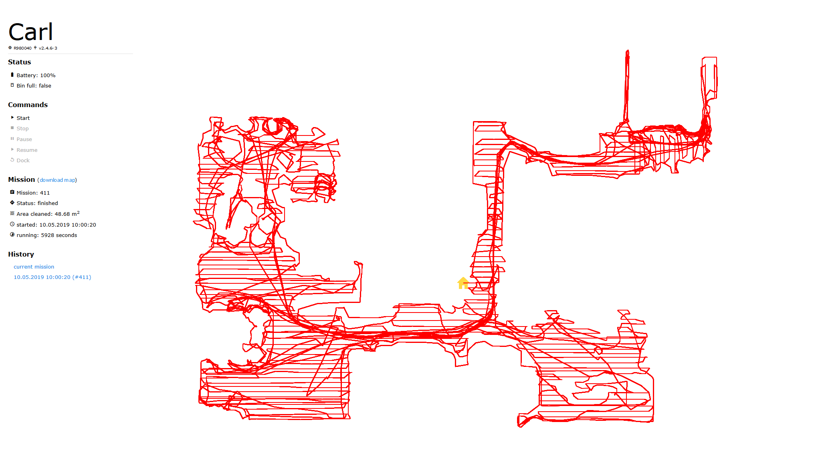

# ioBroker.roomba

Verbinde deinen iRobot Roomba mit ioBroker.

Basierend auf der dorita980-Bibliothek <https://github.com/karlvr/dorita980#readme>

[](https://travis-ci.com/iobroker-community-adapters/ioBroker.roomba)

**Inhaltsverzeichnis**

1. [Merkmale](#features)
2. [Installation](#installation)
3. [Einrichtungsanleitung](#setup-instructions)
4. [Unterstützte Roomba-Modelle / Firmware-Versionen](#supported-roombas--firmware-versions)
5. [Kanäle und Staaten](#channels--states)
6. [Beschreibung der Präferenzen (unvollständig)](#description-of-preferences-incomplete)
7. [Smart-Home-/Alexa-Integration mit ioBroker.javascript](#smart-home--alexa-integration-using-iobrokerjavascript)
8. [Änderungsprotokoll](#changelog)
9. [Credits](#credits)
10. [Lizenz](#license)

## Merkmale

Folgende Funktionen sind in diesem Adapter enthalten:

- **Befehle senden** (`start` ,`stop` ,`resume` ,`pause` ,`dock` ) zu Ihrem Roomba
- **Gerätezustände** abrufen, z. B. Akku, angedockt, voller/eingesetzter Behälter (vollständige Liste unter [Kanäle & Zustände](#channels--states) )
- **Gerätekonfiguration** abrufen, z. B. Voreinstellungen, Netzwerk- oder Zeitplaneinstellungen (vollständige Liste unter [Kanäle & Status](#channels--states) ).
- **Gerätestatistiken** abrufen, z. B. Gesamtmissionen, Betriebsstunden an der Dockingstation usw. (vollständige Liste unter [Kanäle & Status](#channels--states) )
- Rufen Sie Informationen über **den aktuellen Reinigungsvorgang** ab (während Ihr Roomba reinigt), z. B. Start- und Endzeit, Gesamtlaufzeit, gereinigte Fläche usw. (nur bei unterstützten Roomba-Modellen, siehe [Unterstützte Roomba-Modelle / Firmware-Versionen](#supported-roombas--firmware-versions) ).
- **Karte anhand der empfangenen Missionsdaten erstellen** (nur bei unterstützten Roomba-Room ...
- **Webinterface** , das den Status und die Karte der aktuellen sowie der vorherigen/archivierten Missionen anzeigt:

## Installation

ioBroker.roomba benötigt [Canvas](https://www.npmjs.com/package/canvas) , um Karten der Roomba-Missionen zu zeichnen. ioBroker versucht, diese Abhängigkeit bei der Installation von ioBroker.roomba zu installieren.

Wahrscheinlich müssen Sie jedoch die Paketabhängigkeiten von Canvas (und Canvas selbst) mit folgendem Befehl installieren:

### Linux

```
sudo apt-get install build-essential libcairo2-dev libpango1.0-dev libjpeg-dev libgif-dev librsvg2-dev
```

Führen Sie außerdem den folgenden Befehl **im Verzeichnis ioBroker.roomba** aus (`/opt/iobroker/node_modules/iobroker.roomba` ):

```
sudo npm install canvas --unsafe-perm=true
```

### Windows

1. Stellen Sie sicher, dass Sie Folgendes haben`node-gyp` installiert über
   ```
   npm install -g node-gyp
   ```

2. Stellen Sie sicher, dass Sie Build Essentials installiert haben über
   ```
   npm install --global --production windows-build-tools
   ```

3. Laden Sie GTK 2 (für [Win32](http://ftp.gnome.org/pub/GNOME/binaries/win32/gtk+/2.24/gtk+-bundle_2.24.10-20120208_win32.zip) oder [Win64](http://ftp.gnome.org/pub/GNOME/binaries/win64/gtk+/2.22/gtk+-bundle_2.22.1-20101229_win64.zip) ) herunter und entpacken Sie es (z. B. nach …).`C:\path\to\GTK2` )

4. Laufen
   ```
   node-gyp rebuild --GTK_Root=C:\path\to\GTK2
   ```

5. Installieren Sie Canvas aus dem Ordner iobroker.roomba.
   ```
   cd C:\path\to\iobroker\node_modules\iobroker.roomba
   npm install canvas
   ```

Weitere Details finden Sie unter <https://github.com/Automattic/node-canvas/wiki/Installation:-Windows> .

## Einrichtungsanleitung

### Automatisierte Einrichtung

Um ioBroker.roomba automatisch einzurichten, folgen Sie den Anweisungen im Admin-Panel von ioBroker.roomba.

**ACHTUNG** : Die Anmeldeinformationen sind nicht dieselben wie die, die Sie in der Smartphone-App verwenden!

1. Stellen Sie sicher, dass der ioBroker.roomba-Adapter gestartet ist.
2. Stellen Sie sicher, dass sich Ihr Roboter auf der Basisstation befindet und eingeschaltet ist (grüne Lichter leuchten).
3. Halten Sie anschließend die HOME-Taste an Ihrem Roboter gedrückt, bis eine Reihe von Tönen ertönen (ca. 2 Sekunden).
4. Lassen Sie den Knopf los, und Ihr Roboter blinkt mit der WLAN-Leuchte.
5. Kehren Sie dann hierher zurück und drücken Sie die Schaltfläche, um IP-Adresse und Zugangsdaten abzurufen.

Falls der automatische Prozess zum Abrufen Ihrer Zugangsdaten fehlschlägt, verwenden Sie bitte die manuelle Einrichtung.

### Manuelle Einrichtung

Für die manuelle Einrichtung siehe <https://github.com/karlvr/dorita980#how-to-get-your-usernameblid-and-password> .

## Unterstützte Roomba-Modelle / Firmware-Versionen

### Unterstützte Firmware-Versionen

| Softwareversion | Firmware-Informationen                                                                        | Unterstützt                                                                                                                                      |
| --------------- | --------------------------------------------------------------------------------------------- | ------------------------------------------------------------------------------------------------------------------------------------------------ |
| Version 1.4     | [Versionshinweise](https://homesupport.irobot.com/app/answers/detail/a_id/19549#rn_PageTitle) |  **unterstützt ( inkl. Karte)**  |
| v2.4.6-x        | [Versionshinweise](https://homesupport.irobot.com/app/answers/detail/a_id/529#rn_PageTitle)   |  **unterstützt ( inkl. Karte)**  |
| v3.2.xx         | [Versionshinweise](https://homesupport.irobot.com/app/answers/detail/a_id/541#rn_PageTitle)   |  **unterstützt** ( (KEINE Karte) |

### Unterstützte Roomba-Geräte

| Serie       | Modelle _(unvollständig)_                                                                                                   | Softwareversion          | Firmware-Informationen                                                                                 | Unterstützt                                                                                                                                      |
| ----------- | --------------------------------------------------------------------------------------------------------------------------- | ------------------------ | ------------------------------------------------------------------------------------------------------ | ------------------------------------------------------------------------------------------------------------------------------------------------ |
| Roomba® 6xx | 605, 606, 612, 616, 671, 676, 680, 696                                                                                      | Version 3.2.40           | [Versionshinweise](https://homesupport.irobot.com/app/answers/detail/a_id/541#rn_PageTitle)            | (höchstwahrscheinlich)                                                                                                                           |
| Roomba® 6xx | 675, [690](https://github.com/koalazak/dorita980/issues/71#issuecomment-513043465)                                          | Version 3.2.40           | [Versionshinweise](https://homesupport.irobot.com/app/answers/detail/a_id/541#rn_PageTitle)            |  **unterstützt** ( (KEINE Karte) |
| Roomba® 6xx | [692](https://github.com/iobroker-community-adapters/ioBroker.roomba/issues/28)                                             | Version 3.5.62           | [Versionshinweise](https://homesupport.irobot.com/app/answers/detail/a_id/541#rn_PageTitle)            |  **unterstützt** ( (KEINE Karte) |
| Roomba® 7xx | 774, 785,                                                                                                                   | -                        |                                                                                                        |  _Das Modell bietet keine WLAN-Konnektivität und daher keine Unterstützung._             |
| Roomba® 8xx | 880, 886, 891, 896                                                                                                          | -                        | [Versionshinweise](https://homesupport.irobot.com/app/answers/detail/a_id/541#rn_PageTitle)            | (höchstwahrscheinlich)                                                                                                                           |
| Roomba® 8xx | [895](https://github.com/iobroker-community-adapters/ioBroker.roomba/blob/master/\(https:/forum.iobroker.net/post/245274\)) | Version 3.2.10 / 40 / 69 | [Versionshinweise](https://homesupport.irobot.com/app/answers/detail/a_id/541#rn_PageTitle)            |  **unterstützt** ( (KEINE Karte) |
| Roomba® 9xx | 965, 981                                                                                                                    | -                        | [Versionshinweise](https://homesupport.irobot.com/app/answers/detail/a_id/529#rn_PageTitle)            | (höchstwahrscheinlich)                                                                                                                           |
| Roomba® 9xx | [960](https://forum.iobroker.net/user/jb_sullivan) , [966](https://forum.iobroker.net/user/thomaslpz) , 980                 | v2.4.6-3                 | [Versionshinweise](https://homesupport.irobot.com/app/answers/detail/a_id/529#rn_PageTitle)            |  **unterstützt (inkl. Karte)**                                                           |
| Roomba® i   | [i7 (7150)](https://forum.iobroker.net/post/240589) , i7+ (7550)                                                            | Version 1.4              | [Versionshinweise](https://homesupport.irobot.com/app/answers/detail/a_id/19549#rn_PageTitle)          |  **unterstützt (inkl. Karte)**                                                           |
| Roomba® e5  | [e5](https://forum.iobroker.net/topic/7657/irobot-roomba-adapter/158)                                                       | Version 3.4.42           | [Versionshinweise](https://homesupport.irobot.com/app/answers/detail/a_id/6345#rn_PageTitle)           |  **unterstützt** ( (KEINE Karte) |
| Roomba® s   | [S9+](https://github.com/Zefau/ioBroker.roomba/issues/34)                                                                   | Version 3.2.4            | [Versionshinweise](https://homesupport.irobot.com/app/answers/detail/a_id/26887/kw/s9%2B#rn_PageTitle) |  **unterstützt (inkl. Karte)**                                                           |

Bitte helfen Sie uns bezüglich der unterstützten Geräte und teilen Sie mir [über ein Ticket mit](https://github.com/iobroker-community-adapters/ioBroker.roomba/issues) , ob Ihr Roomba-Modell unterstützt wird!

## Kanäle und Staaten

Nach erfolgreicher Einrichtung werden die folgenden Kanäle und Zustände erstellt:

| Kanal       | Ordner      | Zustand                    | Beschreibung                                                                                                                                             |
| ----------- | ----------- | -------------------------- | -------------------------------------------------------------------------------------------------------------------------------------------------------- |
| Reinigung   | -           | -                          | Anweisungen und Informationen zum Reinigungsprozess                                                                                                      |
| Reinigung   | zuletzt     | -                          | Letzte Befehle an den Roboter gesendet                                                                                                                   |
| Reinigung   | zuletzt     | Befehl                     | Letzter Befehl an den Roboter gesendet                                                                                                                   |
| Reinigung   | zuletzt     | Zeitstempel                | Zeitstempel des letzten gesendeten Befehls                                                                                                               |
| Reinigung   | zuletzt     | Datum/Uhrzeit              | Der letzte DateTime-Befehl wurde gesendet.                                                                                                               |
| Reinigung   | zuletzt     | Initiator                  | Initiator des letzten Befehls                                                                                                                            |
| Reinigung   | zuletzt     | Zyklus                     | Zyklus                                                                                                                                                   |
| Reinigung   | zuletzt     | Phase                      | Phase                                                                                                                                                    |
| Reinigung   | zuletzt     | Fehler                     | Weist auf einen Fehler während der letzten Mission hin.                                                                                                  |
| Reinigung   | Zeitplan    | -                          | Informationen zum Fahrplan                                                                                                                               |
| Reinigung   | Zeitplan    | Zyklus                     | Zeitplanzyklus (Sonntag bis Samstag)                                                                                                                     |
| Reinigung   | Zeitplan    | Std.                       | Stunde bis zum Beginn des Zyklus (Sonntag bis Samstag)                                                                                                   |
| Reinigung   | Zeitplan    | Minuten                    | Minute bis zum Start des Zyklus (Sonntag bis Samstag)                                                                                                    |
| Reinigung   | -           | Dock                       | Schick den Roboter zur Dockingstation                                                                                                                    |
| Reinigung   | -           | Pause                      | Den aktuellen Reinigungsprozess unterbrechen                                                                                                             |
| Reinigung   | -           | wieder aufnehmen           | Setzen Sie den aktuellen Reinigungsprozess fort.                                                                                                         |
| Reinigung   | -           | Start                      | Beginnen Sie einen Reinigungsprozess                                                                                                                     |
| Reinigung   | -           | stoppen                    | Den aktuellen Reinigungsprozess stoppen.                                                                                                                 |
| Gerät       | -           | -                          | Geräteinformationen                                                                                                                                      |
| Gerät       | Netzwerk    | -                          | Netzwerkinformationen                                                                                                                                    |
| Gerät       | Netzwerk    | DHCP                       | Geben Sie an, ob DHCP aktiviert ist.                                                                                                                     |
| Gerät       | Netzwerk    | Router                     | MAC-Adresse des Routers                                                                                                                                  |
| Gerät       | Netzwerk    | IP-Adresse                 | IP-Adresse                                                                                                                                               |
| Gerät       | Netzwerk    | Subnetz                    | Subnetzadresse                                                                                                                                           |
| Gerät       | Netzwerk    | Tor                        | Gateway-Adresse                                                                                                                                          |
| Gerät       | Netzwerk    | dns1                       | Primäre DNS-Adresse                                                                                                                                      |
| Gerät       | Netzwerk    | dns2                       | Sekundäre DNS-Adresse                                                                                                                                    |
| Gerät       | Präferenzen | -                          | Einstellungen festlegen                                                                                                                                  |
| Gerät       | Präferenzen | binPause                   | **UNBEKANNT**                                                                                                                                            |
| Gerät       | Präferenzen | CarpetBoostAuto            | Automatisch: Roomba erhöht automatisch seine Saugleistung, um Teppiche gründlich zu reinigen.                                                            |
| Gerät       | Präferenzen | carpetBoostHigh            | Leistungsmodus: Roomba erhöht stets seine Saugkraft, um die Reinigungsleistung auf allen Bodenoberflächen zu maximieren.                                 |
| Gerät       | Präferenzen | ecoCharge                  | **UNBEKANNT**                                                                                                                                            |
| Gerät       | Präferenzen | noAutoPasses               | Ein Durchgang: Roomba reinigt alle Bereiche mit nur einem Durchgang.                                                                                     |
| Gerät       | Präferenzen | noPP                       | **UNBEKANNT**                                                                                                                                            |
| Gerät       | Präferenzen | Nur öffnen                 | **UNBEKANNT**                                                                                                                                            |
| Gerät       | Präferenzen | schedHold                  | **UNBEKANNT**                                                                                                                                            |
| Gerät       | Präferenzen | zweiPass                   | Der Roomba fährt alle Bereiche ein zweites Mal ab. Das kann in Haushalten mit Haustieren oder für die gelegentliche gründliche Reinigung hilfreich sein. |
| Gerät       | Versionen   | -                          | Versionsinformationen                                                                                                                                    |
| Gerät       | Versionen   | hardwareRev                | Hardware-Revision                                                                                                                                        |
| Gerät       | Versionen   | Akku-Typ                   | Akku-Typ                                                                                                                                                 |
| Gerät       | Versionen   | soundVer                   | **UNBEKANNT**                                                                                                                                            |
| Gerät       | Versionen   | uiSwVer                    | **UNBEKANNT**                                                                                                                                            |
| Gerät       | Versionen   | navSwVer                   | **UNBEKANNT**                                                                                                                                            |
| Gerät       | Versionen   | wifiSwVer                  | **UNBEKANNT**                                                                                                                                            |
| Gerät       | Versionen   | mobilityVer                | **UNBEKANNT**                                                                                                                                            |
| Gerät       | Versionen   | Bootloader-Version         | Bootloader-Version                                                                                                                                       |
| Gerät       | Versionen   | umiVer                     | **UNBEKANNT**                                                                                                                                            |
| Gerät       | Versionen   | softwareVersion            | Softwareversion                                                                                                                                          |
| Gerät       | -           | \_rawData                  | Rohdaten der Präferenzen im JSON-Format                                                                                                                  |
| Gerät       | -           | Mac                        | MAC-Adresse des Roboters                                                                                                                                 |
| Gerät       | -           | Name                       | Name des Roboters                                                                                                                                        |
| Gerät       | -           | Typ                        | Robotertyp                                                                                                                                               |
| Staaten     | -           | -                          | Statusinformationen                                                                                                                                      |
| Staaten     | -           | \_verbunden                | Verbindungsstatus                                                                                                                                        |
| Staaten     | -           | Batterie                   | Akkustand des Roboters                                                                                                                                   |
| Staaten     | -           | binFull                    | Geben Sie an, ob der Behälter voll ist.                                                                                                                  |
| Staaten     | -           | binInserted                | Geben Sie an, ob ein Behälter eingefügt wurde.                                                                                                           |
| Staaten     | -           | angedockt                  | Geben Sie an, ob der Roboter angedockt ist.                                                                                                              |
| Staaten     | -           | Signal                     | Signalstärke                                                                                                                                             |
| Staaten     | -           | Status                     | Aktueller Status des Roboters                                                                                                                            |
| Statistiken | -           | -                          | Statistische Informationen                                                                                                                               |
| Statistiken | Missionen   | -                          | Missionsstatistik                                                                                                                                        |
| Statistiken | Missionen   | fehlgeschlagen             | Anzahl fehlgeschlagener Reinigungsaufträge                                                                                                               |
| Statistiken | Missionen   | gelingen                   | Anzahl erfolgreicher Reinigungsaufträge                                                                                                                  |
| Statistiken | Missionen   | gesamt                     | Anzahl der Reinigungsaufträge                                                                                                                            |
| Statistiken | Zeit        | -                          | Zeitstatistik                                                                                                                                            |
| Statistiken | Zeit        | avgMin                     | **UNBEKANNT**                                                                                                                                            |
| Statistiken | Zeit        | hOnDock                    | **UNBEKANNT**                                                                                                                                            |
| Statistiken | Zeit        | nAvail                     | **UNBEKANNT**                                                                                                                                            |
| Statistiken | Zeit        | estCap                     | **UNBEKANNT**                                                                                                                                            |
| Statistiken | Zeit        | nLithChrg                  | **UNBEKANNT**                                                                                                                                            |
| Statistiken | Zeit        | nNimhChrg                  | **UNBEKANNT**                                                                                                                                            |
| Statistiken | Zeit        | nDocks                     | **UNBEKANNT**                                                                                                                                            |
| -           | -           | aktualisiertDatumUhrzeit   | Datum und Uhrzeit der letzten Aktualisierung                                                                                                             |
| -           | -           | aktualisierter Zeitstempel | Zeitstempel der letzten Aktualisierung                                                                                                                   |

## Beschreibung der Präferenzen _(unvollständig)_

Beim Aufruf wird die folgende Nutzlast empfangen.`getPreferences()` (siehe <https://github.com/karlvr/dorita980#getpreferences> ):

| Objekt                | Index      | Typ             | Beschreibung                                | ioBroker-Status        |
| --------------------- | ---------- | --------------- | ------------------------------------------- | ---------------------- |
| netinfo               | -          | Objekt          | Netzwerkinformationen der Roomba-Verbindung | -                      |
| netinfo               | .dhcp      | boolescher Wert | Geben Sie an, ob DHCP aktiviert ist.        | Gerät.Netzwerk-DHCP    |
| netinfo               | .addr      | IP-Adresse      | IP-Adresse                                  | Geräte-Netzwerk-IP     |
| netinfo               | .Maske     | IP-Adresse      | Subnetzadresse                              | Gerät.Netzwerk.Subnetz |
| netinfo               | .gw        | IP-Adresse      | Gateway-Adresse                             | Gerät.Netzwerk.Gateway |
| netinfo               | .dns1      | IP-Adresse      | Primäre DNS-Adresse                         | device.network.dns1    |
| netinfo               | .dns2      | IP-Adresse      | Sekundäre DNS-Adresse                       | device.network.dns2    |
| netinfo               | .bssid     | Mac             | MAC-Adresse des Routers                     | Gerät.Netzwerk.Router  |
| netinfo               | .sec       | ganze Zahl      | Unbekannt                                   | _(nicht kartiert)_     |
| wifistat              | -          | Objekt          | Unbekannt                                   | -                      |
| wifistat              | .W-lan     | ganze Zahl      | Unbekannt                                   | _(nicht kartiert)_     |
| wifistat              | .uap       | boolescher Wert | Unbekannt                                   | _(nicht kartiert)_     |
| wifistat              | .Wolke     | ganze Zahl      | Unbekannt                                   | _(nicht kartiert)_     |
| wlcfg                 | -          | Objekt          | Unbekannt                                   | -                      |
| wlcfg                 | .sec       | ganze Zahl      | Unbekannt                                   | _(nicht kartiert)_     |
| wlcfg                 | .ssid      | Zeichenkette    | Unbekannt                                   | _(nicht kartiert)_     |
| Mac                   | -          | Mac             | MAC-Adresse des Roomba                      | -                      |
| Land                  | -          | Zeichenkette    | Unbekannt                                   | -                      |
| Cloud-Umgebung        | -          | Zeichenkette    | Unbekannt                                   | -                      |
| svcEndpunkte          | .svcDeplId | Zeichenkette    | Unbekannt                                   | -                      |
| Karten-Upload erlaubt | -          | boolescher Wert | Unbekannt                                   | -                      |
| lokaler Zeitversatz   | -          | ganze Zahl      | Unbekannt                                   | -                      |
| ...                   | -          | ...             | ...                                         | -                      |

Bitte helfen Sie uns bei der Beschreibung der Präferenzen. Falls Sie die Bedeutung der in der Tabelle als unbekannt gekennzeichneten Präferenzen kennen, teilen Sie mir [diese bitte über ein Issue mit](https://github.com/iobroker-community-adapters/ioBroker.roomba/issues) !

## Smart-Home-/Alexa-Integration mit ioBroker.javascript

### Sende die Karte nach Abschluss der Mission per Telegram.

Hierfür muss der ioBroker-Adapter ioBroker.telegram installiert sein ( <https://github.com/ioBroker/ioBroker.telegram> ).

Erstellen Sie ein Skript im Ordner „common“ der Datei ioBroker.javascript und fügen Sie den folgenden Listener hinzu:

```javascript
var _fs = require('fs');

/*
 * MISSION END: Send map
 * 
 */
var message = "%device.name% finished at %missions.current.endedDateTime% cleaning %missions.current.sqm% sqm in %missions.current.runtime% seconds (%missions.current.error% errors).";
var ns = 'roomba.0';
var imagePath = 'tmp/';

on({id: ns + '.missions.current.ended', change: 'any'}, function(obj)
{
    if (!obj.state || !obj.state.val) return;
    
    // replace variables with state values
    var pos, variable, state, value;
    while (message.indexOf('%') > -1)
    {
        pos = message.indexOf('%');
        variable = message.substring(pos, message.indexOf('%', pos+1)+1);
        state = getState(ns + '.' + variable.replace(/%/g, ''));
        
        if (state !== null && state.val !== null)
            value = state.val
        else
        {
            log('State ' + variable.replace(/%/g, '') + ' not found!', 'warn');
            value =  '';
        }

        if (typeof value === "boolean") value = value === true ? 'with' : 'no';
        message = message.replace(RegExp(variable, 'gi'), value);
    }
    
    // console
    log(message);
    
    // get image
    var img = getState(ns + '.missions.current.mapImage').val;

    if (img !== null && img.indexOf('data:image/png;base64,') > -1)
    {
        _fs.writeFile(imagePath + 'image.png', img.replace(/^data:image\/png;base64,/, ''), 'base64', function(err)
        {
            if (err !== null)
                log(err.message, 'warn');
            else
                sendTo('telegram', {text: imagePath + 'image.png', message: message});
        });
    }
});
```

_04.05.2019: Fehler behoben, der das Senden der Karte verhinderte_

Sie können die Variable bearbeiten.`message` Sie können alle Benachrichtigungen, die Sie zusammen mit der Karte erhalten möchten, hier eingeben.`%name-of-state%` um den Wert eines Zustands innerhalb des ioBroker.roomba-Objektbaums abzurufen.

## Credits

### inoffizielle API

Vielen Dank an [@koalazak](https://github.com/koalazak) für die [inoffizielle iRobot Roomba 980 Node.js-Bibliothek (SDK)](https://github.com/koalazak/dorita980#readme) .

### Symbole

Icons erstellt von<a href="https://www.flaticon.com/authors/iconnice" title="Iconnice"> Iconnice</a> aus<a href="https://www.flaticon.com/" title="Flaticon"> [www.flaticon.com](http://www.flaticon.com)</a> ist lizenziert von<a href="http://creativecommons.org/licenses/by/3.0/" title="Creative Commons BY 3.0" target="_blank"> CC 3.0 BY</a></div>

## Changelog
<!--
    Placeholder for the next version (at the beginning of the line):
    ### **WORK IN PROGRESS**
-->

### **WORK IN PROGRESS**
- (copilot) Adapter requires node.js >= 22 now
- (iobroker-bot) Adapter requires node.js >= 20 now.
- (copilot) Adapter requires admin >= 7.7.22 now
- (copilot) Adapter requires js-controller >= 6.0.11 now
- (copilot) Adapter requires admin >= 7.6.17 now

### 1.3.0 (2024-04-26)
* (mcm1957) Adapter requires node.js >= 18 and js-controller >= 5 now
* (mcm1957) Dependencies have been updated

### 1.2.2 (2023-09-03)
* (mcm1957) some dependencies have been upgraded
* (TheRealArthurDent) Background color of the adapter settings page has been removed to make it useable in dark mode.

### 1.2.1 (2023-08-09)

* (mcm1957) dorita980 dependency has been upgraded
* (mcm1957) some other dependencies have been upgraded
* (mcm1957) Adapter now requires node 16 or newer and js-controller 4.0.24 or newer

### 1.2.0 (2023-08-09)

* (TheRealArthurDent) dorita980 has been updated (see PR #144)
* (mcm1957) Release script has been updated
* (mcm1957) Several issues reported by adapter checker have been fixed

### 1.1.4 (2021-07-19)
* (Apollon77) Adjust some types to prevent js-controller 3.3 warnings
* (thost96) fix hanging state loading in frontend
* (thost96) fixed link in canvas warning

### 1.1.1 (2020-02-16)
- (Zefau) moved development to Community Repository

### 1.1.0 (2020-02-06)
- (Zefau) added support to change schedule (see [#36](https://github.com/Zefau/ioBroker.roomba/issues/36))
- (Zefau) fixed bug with state `commands.last.dateTime` having incorrect value `NaN`
- (Zefau) fixed error message shown when robot is on a mission but map is not given

### 1.1.0 (2020-02-06)
- (Zefau) acknowledged support for S9+ (see [#34](https://github.com/Zefau/ioBroker.roomba/issues/34))

### 1.0.7 (2019-09-03)
- (Zefau) fixed bugs occurring when Roomba is on a mission
- (Zefau) added additional debug logging

### 1.0.6 (2019-08-19)
- (Zefau) added loading screen to web interface

### 1.0.5 (2019-08-18)
- (Zefau) fixed failing secure connection
- (Zefau) fixed broken credential retrieval
- (Zefau) fixed broken refresh

### 1.0.4 (2019-08-15)
- (Zefau) fixed password retrieval
- (Zefau) fixed German translations
- (Zefau) added donations button
- (Zefau) updated `dorita980` dependency to v3.1.3
- (Zefau) updated `canvas` dependency to v2.6.0

### 1.0.3 (2019-07-23)
- (Zefau) fixed bug _uncaught exception: Cannot read property 'x' of undefined_

### 1.0.2 (2019-07-20)
- (Zefau) reworked placing home icon ([#23](https://github.com/Zefau/ioBroker.roomba/issues/23))
- (Zefau) updated dependencies to fix security vulnerabilities in depending packages

### 1.0.1 (2019-05-15)
- (Zefau) fixed display error in Chrome ([#19](https://github.com/Zefau/ioBroker.roomba/issues/19#issuecomment-492963244))
- ([@Apollon77](https://github.com/Apollon77)) updated testing for Node.js v12 ([#18](https://github.com/Zefau/ioBroker.roomba/pull/18))
- (Zefau) updated dependencies

### 1.0.0 (2019-05-04)
- (zefau) No changes, only bump to stable release

### 0.5.0 (2019-04-21)
- (zefau) Added command buttons to map page / web interface ([#17](https://github.com/Zefau/ioBroker.roomba/issues/17))
- (zefau) Removed button to end mission manually ```missions.current._endMission```
- (zefau) Run ```stop``` command in the background when ```dock``` command is received ([#14](https://github.com/Zefau/ioBroker.roomba/issues/14))
- (zefau) Added Web Adapter as dependency

### 0.4.5 (2019-03-20)
- Zefau) Refactored retrieval of preferences and added debug mode

### 0.4.4 (2019-03-15)
- ([@Apollon77](https://github.com/Apollon77)) Core Files/Testing Update and introduce adapter-core ([#8](https://github.com/Zefau/ioBroker.roomba/pull/8))

### 0.4.3 (2019-02-10)
- (zefau) Improved compatibility for series 600

### 0.4.2 (2019-02-09)
- (zefau) Bug fixing

### 0.4.1 (2019-02-03)
- (zefau) Support for Compact Mode
- (zefau) Bug fixing

### 0.4.0 (2019-01-08)
- (zefau) Support for e5 and 600 series (due to support by [dorita980](https://github.com/koalazak/dorita980#readme))

### 0.3.0 (2019-01-06)
- (zefau) Image / Map of the current cleaning mission will be created
- (zefau) Removed encryption of password

### 0.2.3 (2018-12-03)
- (zefau) Fixed an issue encrypting the password when entered by user (no automated retrieval)

### 0.2.2 (2018-12-02)
- (zefau) Password will now be stored encrypted

Note: If you are coming from an earlier version, you have to (1) empty your settings, (2) save, (3) restart the adapter and (4) enter / fetch credentials again (duo to the fact that password will be stored encrypted now)

### 0.2.1 (2018-11-25)
- (zefau) Fixed / improved automatically retrieving of authentication credentials

### 0.2.0 (2018-11-18)
- (zefau) improved admin interface to automatically retrieve authentication credentials

### 0.1.0 (2018-11-04)
- (zefau) initial version

[Older changelogs can be found there](https://github.com/iobroker-community-adapters/ioBroker.roomba/blob/master/CHANGELOG_OLD.md)

## License
The MIT License (MIT)

Copyright (c) 2023-2026 iobroker-community-adapters <iobroker-community-adapters@gmx.de>  
Copyright (c) 2018-2020 Zefau <zefau@mailbox.org>

Permission is hereby granted, free of charge, to any person obtaining a copy
of this software and associated documentation files (the "Software"), to deal
in the Software without restriction, including without limitation the rights
to use, copy, modify, merge, publish, distribute, sublicense, and/or sell
copies of the Software, and to permit persons to whom the Software is
furnished to do so, subject to the following conditions:

The above copyright notice and this permission notice shall be included in
all copies or substantial portions of the Software.

THE SOFTWARE IS PROVIDED "AS IS", WITHOUT WARRANTY OF ANY KIND, EXPRESS OR
IMPLIED, INCLUDING BUT NOT LIMITED TO THE WARRANTIES OF MERCHANTABILITY,
FITNESS FOR A PARTICULAR PURPOSE AND NONINFRINGEMENT. IN NO EVENT SHALL THE
AUTHORS OR COPYRIGHT HOLDERS BE LIABLE FOR ANY CLAIM, DAMAGES OR OTHER
LIABILITY, WHETHER IN AN ACTION OF CONTRACT, TORT OR OTHERWISE, ARISING FROM,
OUT OF OR IN CONNECTION WITH THE SOFTWARE OR THE USE OR OTHER DEALINGS IN
THE SOFTWARE.