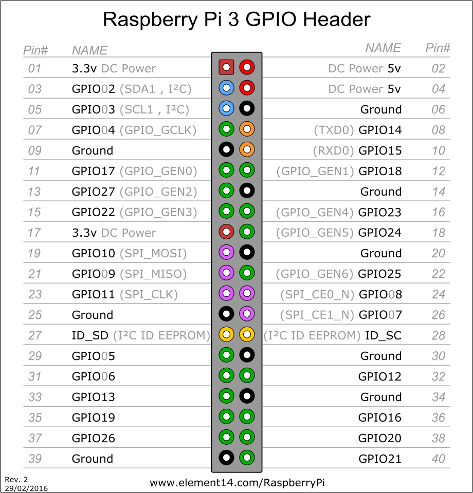

# ioBroker.rpi2


## Versionen

RPI-Monitor-Adapter für ioBroker

RPI-Monitor-Implementierung zur Integration in ioBroker. Es handelt sich um die gleiche Implementierung wie für iobroker.rpi, jedoch mit GPIOs.

## Wichtige Informationen

**ioBroker benötigt spezielle Berechtigungen zur Steuerung von GPIOs.** Auf den meisten Linux-Distributionen kann dies durch Hinzufügen des Benutzers ioBroker zur Benutzerverwaltung erreicht werden.`gpio` Gruppe.

Damit GPIO funktioniert, müssen Sie Folgendes installieren:`libgpiod` in Version`2.x` , **bevor** Sie den Adapter installieren (siehe unten)!

> \[!VORSICHT] Version 3.xx dieses Adapters unterstützt und erfordert Debian 13 / Trixie (Linux-Kernel 5.10 oder neuer). Führen Sie kein Update durch, wenn Sie ein älteres Betriebssystem verwenden.

## Installation

Nach der Installation müssen Sie alle erforderlichen Module über die Administrationsseite konfigurieren.

Nach dem Start von`iobroker.rpi` Alle ausgewählten Module erzeugen einen Objektbaum in ioBroker innerhalb von rpi.<instance> Die<modulename> z.B`rpi.0.cpu`

Stellen Sie sicher, dass Python und build-essential installiert sind:

```bash
sudo apt update
sudo apt install -y build-essential python
sudo apt install -y libgpiod-dev
```

(Die letzte Option ist nur erforderlich, wenn Sie mit GPIOs arbeiten möchten.)

Nach der Auswahl stehen folgende Objekte zur Verfügung:

#### **CPU**

- CPU-Frequenz
- Last1
- Last5
- Last15

#### **Raspberry Pi (vcgencmd wird benötigt)**

- CPU-Spannung
- mem\_arm
- mem\_gpu

#### **Erinnerung**

- verfügbarer Speicher
- speicherfrei
- Gesamtspeicher

#### **Netzwerk (eth0)**

- net\_received
- net\_send

#### **SD-Karte**

- sdcard\_boot\_total
- sdcard\_boot\_used
- sdcard\_root\_total
- sdcard\_root\_used

#### **Tauschen**

- Tausch\_gesamt
- Swap\_benutzt

#### **Temperatur**

- soc\_temp

#### **Betriebszeit**

- Betriebszeit

#### **WLAN**

- WLAN empfangen
- wifi\_send

## Konfiguration

Auf der Konfigurationsseite können Sie folgende Module auswählen:

- CPU
- Himbeere
- Erinnerung
- Netzwerk
- SD-Karte
- Tauschen
- Temperatur
- Betriebszeit
- WLAN

### NVME-Temperatur

Ab Adapterversion 2.3.2 kann die NVMe-Temperatur ausgelesen werden. Dazu ist die Installation erforderlich.`nvme-cli` Das Paket muss auf Ihrem System installiert werden. Dies können Sie mit folgendem Befehl tun:`sudo apt-get install nvme-cli` Sie müssen den Befehl außerdem zur ioBroker-sudoers-Datei hinzufügen.`/etc/sudoers.d/iobroker` Öffnen Sie es mit einem Editor, zum Beispiel nano:`sudo nano /etc/sudoers.d/iobroker` und fügen Sie die folgende Zeile am Ende hinzu:

`iobroker ALL=(ALL) NOPASSWD: /usr/sbin/nvme smart-log /dev/nvme0`

## GPIOs

Sie können auch GPIOs auslesen und steuern. Dazu müssen Sie lediglich die GPIO-Optionen in den Einstellungen (Registerkarte „Zusätzliche Informationen“) konfigurieren.



Nachdem einige Ports aktiviert wurden, erscheinen im Objektbaum die folgenden Zustände:

- rpi.0.gpio.PORT.state

Die Portnummerierung erfolgt über BCM (BroadComm Pins on Chip). Die vollständige Nummerierung erhalten Sie mit`gpio readall` Zum Beispiel PI2:

```
+-----+-----+---------+------+---+---Pi 2---+---+------+---------+-----+-----+
| BCM | wPi |   Name  | Mode | V | Physical | V | Mode | Name    | wPi | BCM |
+-----+-----+---------+------+---+----++----+---+------+---------+-----+-----+
|     |     |    3.3v |      |   |  1 || 2  |   |      | 5v      |     |     |
|   2 |   8 |   SDA.1 | ALT0 | 1 |  3 || 4  |   |      | 5V      |     |     |
|   3 |   9 |   SCL.1 | ALT0 | 1 |  5 || 6  |   |      | 0v      |     |     |
|   4 |   7 | GPIO. 7 |   IN | 1 |  7 || 8  | 0 | IN   | TxD     | 15  | 14  |
|     |     |      0v |      |   |  9 || 10 | 1 | IN   | RxD     | 16  | 15  |
|  17 |   0 | GPIO. 0 |   IN | 0 | 11 || 12 | 0 | IN   | GPIO. 1 | 1   | 18  |
|  27 |   2 | GPIO. 2 |   IN | 0 | 13 || 14 |   |      | 0v      |     |     |
|  22 |   3 | GPIO. 3 |   IN | 0 | 15 || 16 | 0 | IN   | GPIO. 4 | 4   | 23  |
|     |     |    3.3v |      |   | 17 || 18 | 0 | IN   | GPIO. 5 | 5   | 24  |
|  10 |  12 |    MOSI |   IN | 0 | 19 || 20 |   |      | 0v      |     |     |
|   9 |  13 |    MISO |   IN | 0 | 21 || 22 | 1 | IN   | GPIO. 6 | 6   | 25  |
|  11 |  14 |    SCLK |   IN | 0 | 23 || 24 | 1 | IN   | CE0     | 10  | 8   |
|     |     |      0v |      |   | 25 || 26 | 1 | IN   | CE1     | 11  | 7   |
|   0 |  30 |   SDA.0 |   IN | 1 | 27 || 28 | 1 | IN   | SCL.0   | 31  | 1   |
|   5 |  21 | GPIO.21 |   IN | 1 | 29 || 30 |   |      | 0v      |     |     |
|   6 |  22 | GPIO.22 |   IN | 1 | 31 || 32 | 0 | IN   | GPIO.26 | 26  | 12  |
|  13 |  23 | GPIO.23 |   IN | 0 | 33 || 34 |   |      | 0v      |     |     |
|  19 |  24 | GPIO.24 |   IN | 0 | 35 || 36 | 0 | IN   | GPIO.27 | 27  | 16  |
|  26 |  25 | GPIO.25 |  OUT | 1 | 37 || 38 | 0 | IN   | GPIO.28 | 28  | 20  |
|     |     |      0v |      |   | 39 || 40 | 0 | IN   | GPIO.29 | 29  | 21  |
+-----+-----+---------+------+---+----++----+---+------+---------+-----+-----+
| BCM | wPi |   Name  | Mode | V | Physical | V | Mode | Name    | wPi | BCM |
+-----+-----+---------+------+---+---Pi 2---+---+------+---------+-----+-----+
```

## DHTxx/AM23xx-Sensoren

Sie können Daten von den Temperatur-/Feuchtigkeitssensoren DHT11, DHT22 und AM2302 auslesen.

Schließen Sie einen solchen Sensor an einen GPIO-Pin an, wie auf der Seite des [node-dht-sensor](https://www.npmjs.com/package/node-dht-sensor) -Pakets beschrieben. Wie bereits erläutert, können mehrere Sensoren an _mehrere_ Pins angeschlossen werden (es handelt sich _nicht um_ ein Bussystem).

## Changelog

<!--
	PLACEHOLDER for the next version:
	### **WORK IN PROGRESS**
-->

### **WORK IN PROGRESS**
- (copilot) Adapter requires node.js >= 22 now
- (copilot) Adapter requires admin >= 7.7.22 now
- (mcm1957) Dependencies have been updated.
- (copilot) **ENHANCED**: Added `temperature.fan_activity` object to monitor fan RPM via `/sys/devices/platform/cooling_fan/...`; falls back to `0` when unavailable.

### 3.0.2 (2025-12-01)
* (@klein0r) Check for required libgpiod-dev package version

### 3.0.1 (2025-11-28)
* (@klein0r) Updated logo, workflows and documentation
* (@klein0r) admin 7.6.17 and js-controller 6.0.11 (or later) are required

### 3.0.0 (2025-11-28)
* (@klein0r) NodeJS 20.x (or newer) is required
* (@klein0r) Updated opengpio to v2 (works on Debian trixie)

### 2.4.0 (2025-03-06)
* (Garfonso) read the current state of GPIO outputs during adapter startup.
* (Garfonso) re-read GPIO input, if set by the user (with ack=false).
* (Garfonso) add an option to invert true/false mapping to 1/0.
* (Garfonso) Allow multiple instances of this adapter per host.
* (Garfonso) tried to improve initialization of GPIO inputs.

### 2.3.2 (2025-02-06)
* (asgothian) added support for NVMe temperature (needs additional configuration, see README)
* (Garfonso) fixed inital values for outputs.

[Older changelogs can be found there](CHANGELOG_OLD.md)

## License
MIT License


Copyright (c) 2026 iobroker-community-adapters <iobroker-community-adapters@gmx.de>  
Copyright (c) 2024-2025 Garfonso <garfonso@mobo.info>

Permission is hereby granted, free of charge, to any person obtaining a copy
of this software and associated documentation files (the "Software"), to deal
in the Software without restriction, including without limitation the rights
to use, copy, modify, merge, publish, distribute, sublicense, and/or sell
copies of the Software, and to permit persons to whom the Software is
furnished to do so, subject to the following conditions:

The above copyright notice and this permission notice shall be included in all
copies or substantial portions of the Software.

THE SOFTWARE IS PROVIDED "AS IS", WITHOUT WARRANTY OF ANY KIND, EXPRESS OR
IMPLIED, INCLUDING BUT NOT LIMITED TO THE WARRANTIES OF MERCHANTABILITY,
FITNESS FOR A PARTICULAR PURPOSE AND NONINFRINGEMENT. IN NO EVENT SHALL THE
AUTHORS OR COPYRIGHT HOLDERS BE LIABLE FOR ANY CLAIM, DAMAGES OR OTHER
LIABILITY, WHETHER IN AN ACTION OF CONTRACT, TORT OR OTHERWISE, ARISING FROM,
OUT OF OR IN CONNECTION WITH THE SOFTWARE OR THE USE OR OTHER DEALINGS IN THE
SOFTWARE.