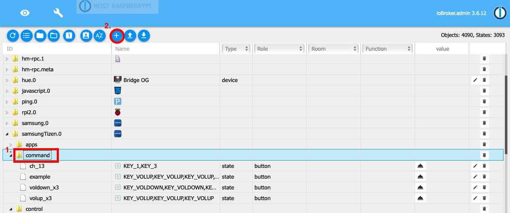
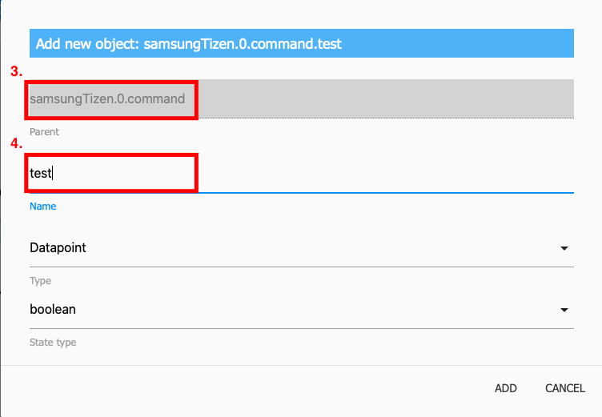
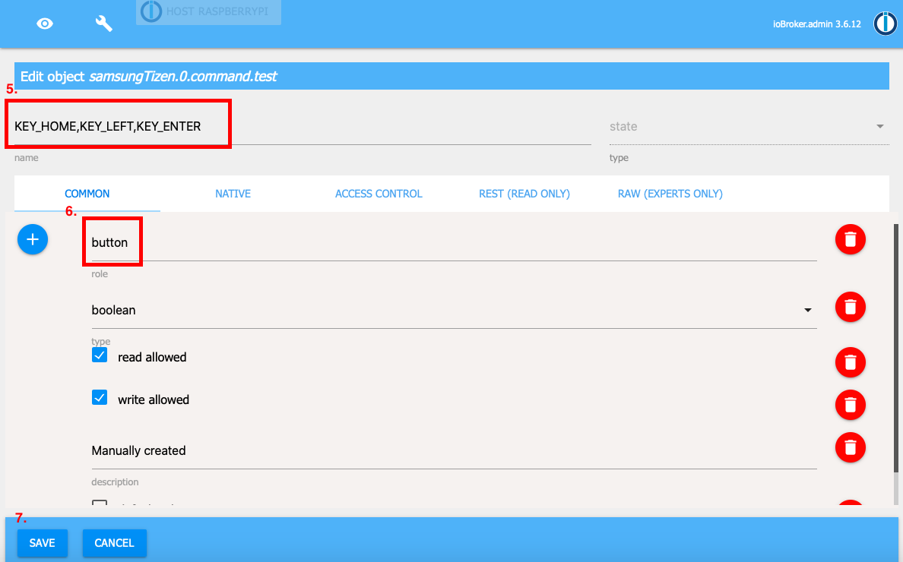
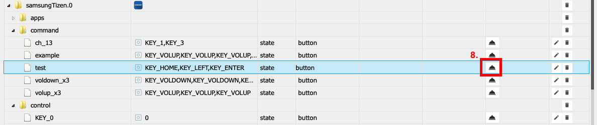

# iobroker.samsung\_tizen

Dieser Adapter dient zur Steuerung von Samsung-Fernsehern mit TizenOS (>=2016).

1. [Installation](#1-installation)
2. [Konfiguration](#2-Configuration)\
   2.1. [Protokoll](#21-protocol)\
   2.2. [IP-Adresse](#22-ip-address)\
   2.3. [Hafen](#23-port)\
   2.4. [Token](#24-token)\
   2.5. [MAC-Adresse](#25-mac-adress)\
   2.6. [Fernsehumfragen in den Bundesstaaten](#26-tv-state-polling)\
   2.7. [Befehlsverzögerung](#27-command-delay)
3. [Verwendung](#3-usage)\
   3.1. [Kontrolle](#31-control)\
   3.2. [Apps](#32-apps)\
   3.3. [Befehle](#33-commands)
4. [Lizenz](#4-License)

## 1. Konfiguration

So konfigurieren Sie diesen Adapter: Überprüfen Sie zunächst die Einstellungen Ihres Fernsehers. Schalten Sie den Fernseher ein und gehen Sie zu Einstellungen / Allgemein / Externer Geräte-Manager / Geräteverbindungs-Manager. Dort sollte die Zugriffsbenachrichtigung auf „Nur beim ersten Mal“ eingestellt sein.

### 1.1. Protokoll

Protokoll für die WebSocket-Verbindung zu Ihrem Fernseher. Mögliche Werte sind http oder wss; bei neueren Geräten verwenden Sie wss.

### 1.2. IP-Adresse

IP-Adresse Ihres Samsung-Fernsehers

### 1.3. Hafen

Anschluss für die WebSocket-Verbindung zu Ihrem Fernseher. 8001 ungesicherter Port 8002 gesicherter Port

### 1.4. Token

Token für eine sichere Verbindung zu Ihrem Fernseher. Speichern Sie den Adapter mit dem Tokenwert 0 und wechseln Sie zum Tab „iobroker-Adminobjekte“. Gehen Sie dann zum Objekt „iobroker.samsung\_tizen.0.config.getToken“ und klicken Sie auf die Schaltfläche. Bei erfolgreicher Funktion erscheint ein neues Objekt „iobroker.samsung\_tizen.0.config.token“ mit der ID „iobroker.samsung\_tizen.0.config.token“. Der Name entspricht Ihrem Token. Kopieren Sie den Namen (z. B. 123456789) und fügen Sie ihn in der Adapterkonfiguration in das Token-Feld ein. Der Token kann mit dem Wert „0“ deaktiviert werden.

<details><summary>How to get a token manually</summary>
<p>
Install "wscat" on the device where ioBroker is running with following command:

```sh
npm install wscat
```

Schalten Sie den Fernseher ein und fragen Sie das Token über eine WebSocket-Verbindung ab.

```sh
wscat -n -c wss://tvIp:8002/api/v2/channels/samsung.remote.control?name=aW9Ccm9rZXI=
```

Auf Ihrem Fernseher erscheint ein Pop-up-Fenster, das Sie bestätigen müssen. Entnehmen Sie das Token aus der zurückgegebenen JSON-Antwort.

```json
{"name":"aW9Ccm9rZXI="},"connectTime":1575818900205,"deviceName":"aW9Ccm9rZXI=","id":"12345678-797c-45b0-b0f1-233535918548","isHost":false}],"id":"12345678-797c-45b0-b0f1-233535918548","token":"10916644"},"event":"ms.channel.connect"}
```

</p>
</details>

### 1.5. MAC-Adresse

Die MAC-Adresse Ihres Samsung-Fernsehers wird für Wake-on-LAN verwendet. Dies funktioniert nur, wenn Ihr Fernseher per Kabel und nicht drahtlos verbunden ist. Bei drahtloser Verbindung kann der Fernseher nur aus dem Standby-Modus eingeschaltet werden. Wake-on-LAN kann mit dem Wert „0“ deaktiviert werden.

### 1.6. Fernseh-Umfragen auf Landesebene

#### Wahllokal

Port zum Abrufen des Energiestatus (Standard: 9110; bekannte verfügbare Ports: 9110, 9119, 9197)

#### Abstimmungsintervall

Häufigkeit der Abfrageanfrage (Standard: 60 Sekunden; kann mit dem Wert „0“ deaktiviert werden).

### 1.7. Befehlsverzögerung

Verzögerung in Millisekunden zwischen den über das iobroker.samsung\_tizen.0.control.sendCmd-Objekt gesendeten Befehlen.

## 2. Verwendung

### 2.1. Kontrolle

#### Senden Sie einen einzelnen Schlüssel

Um eine einzelne Taste zu drücken, klicken Sie auf die Schaltfläche unter z. B. iobroker.samsung\_tizen.0.control.KEY\_MUTE.

#### Senden Sie eine Taste für eine nicht definierte Schaltfläche

Sie können einen benutzerdefinierten (nicht definierten) Schlüssel mit dem Objekt iobroker.samsung\_tizen.0.control.sendCmd senden. Geben Sie den zu sendenden Schlüssel ein, z. B. KEY\_POWER.

#### Senden Sie mehrere Tasten in einem einzigen Befehl

Um mehrere Tasten in einem einzigen Befehl zu senden, verwenden Sie das Objekt \`iobroker.samsung\_tizen.0.control.sendCmd\`. Geben Sie die Tasten durch Kommas getrennt ein, z. B. \`KEY\_POWER,KEY\_HDMI,KEY\_VOLUP\`.

#### Makros für Befehle erstellen

Gehen Sie zu iobroker.samsung\_tizen.0.command. Hier finden Sie Beispielmakros und können Ihre eigenen Makros erstellen. <a name="use_cmd">Wie man ein neues Makro erstellt</a>

### 2.2. Apps

#### Installierte Apps laden

Um die installierten Apps zu laden, klicken Sie auf die Schaltfläche iobroker.samsung\_tizen.0.apps.getInstalledApps. Anschließend wird für jede installierte App ein separates Objekt mit dem Namen start\_app\_name erstellt.

#### App starten

Sie können eine App mit einem Klick auf das Objekt iobroker.samsung\_tizen.0.apps.start\_app\_name starten.

### Energiezustand

Wenn Sie die Abfrage des Energiestatus wie oben beschrieben konfiguriert haben, erhalten Sie unter iobroker.samsung\_tizen.0.powerOn den Status „true“, wenn Ihr Fernseher eingeschaltet ist, oder „false“, wenn er ausgeschaltet ist.

### 2.3. Befehle

Befehle können manuell über das Objekt iobroker.samsung\_tizen.0.control.sendCmd gesendet werden, wie in \[Referenz einfügen] erwähnt. <a name="use_ctrl">Kontrolle</a> oder über benutzerdefinierte Objekte unter iobroker.samsung\_tizen.0.command. Es gibt einige Beispielbefehle, aber Sie können auch Ihre eigenen Makros erstellen.

<details><summary>How to create a command macro </summary>
<p>

1. Gehen Sie zu Adapter und öffnen Sie iobroker.samsung\_tizen.0.command
2. Klicken Sie auf das Plus-Symbol, um ein neues Objekt zu erstellen.
   
3. Prüfen Sie, ob das übergeordnete Objekt iobroker.samsung\_tizen.0.command ist.
4. Geben Sie einen neuen Namen für Ihren Befehl ein und überprüfen Sie, ob der Typ „datapoint“ und „stateType = boolean“ ist.
   
5. Geben Sie unter „Name“ die Schlüssel ein, die Sie senden möchten.
6. Die Rolle muss ein Button sein.
7. und sparen
   
8. Dann können Sie Ihren Befehl mit dem neu erstellten Objekt senden.
   

</p>
</details>

## Installation

Installieren Sie diesen Adapter mithilfe der ioBroker-Repositories.

> \[!NOTE] Dieser Adapter unterstützt keine Installation von GitHub.

## Credits

Die erste Generation dieses Adapters wurde von Stefan0875 entwickelt (<https://github.com/Stefan0875>) das durch Hochdruck angepasst und aufrechterhalten wurde (<https://github.com/Highpressure>) und schließlich Dahuby (<https://github.com/dahuby>Vielen Dank für ihre Arbeit und die Erteilung einer öffentlichen Lizenz.

## Changelog

<!--
    Placeholder for the next version (at the beginning of the line):
    ### **WORK IN PROGRESS**
-->
### 2.0.2 (2026-09-04)
- (mcm1957) **BREAKING:** enhanced security (added encryption) requires that you enter the access token one more time 
- (copilot) Adapter requires node.js >= 22 now
- (copilot) Adapter requires admin >= 7.7.22 now
- (copilot) Adapter requires js-controller >= 6.0.11 now
- (AlanSRU) Fixed the installed-app message handlers, which stayed attached to the shared websocket: they piled up with every call and made the adapter crash with "Cannot read properties of undefined (reading 'length')" as soon as another message arrived (#302)
- (AlanSRU) Synced `engines.node` in package-lock.json with package.json (#301)
- (GermanBluefox) The adapter was refactored to TypeScript. 
- (GermanBluefox) The configuration dialog was migrated from the old HTML admin page to JsonConfig
- (GermanBluefox) The states created by the adapter now carry explicit `common.read` / `common.write` flags
- (GermanBluefox) The adapter can only be installed from npm now, no longer directly from GitHub (`common.nogit`)

### 1.1.0 (2024-04-26)
* (mcm1957) Adapter requires node.js >= 18 and js-controller >= 5 now
* (mcm1957) Dependencies have been updated

### 1.0.0 (2023-09-30)
- (mcm1957) An official release has been created

### 1.0.0-alpha.2 (2023-09-24)
- (mcm1957) Dependencies have been updated

### 1.0.0-alpha.1 (2023-09-24)
- (mcm1957) Adapter requires node 16 or newer now.
- (mcm1957) Adapter has been moved to iobroker-community-adapters organization.


[Older changelogs can be found there](CHANGELOG_OLD.md)

## License

MIT License 


Copyright (c) 2023-2026 iobroker-community-adapters <iobroker-community-adapters@gmx.de>  
Copyright (c) 2020 dahuby

Permission is hereby granted, free of charge, to any person obtaining a copy
of this software and associated documentation files (the "Software"), to deal
in the Software without restriction, including without limitation the rights
to use, copy, modify, merge, publish, distribute, sublicense, and/or sell
copies of the Software, and to permit persons to whom the Software is
furnished to do so, subject to the following conditions:

The above copyright notice and this permission notice shall be included in all
copies or substantial portions of the Software.

THE SOFTWARE IS PROVIDED "AS IS", WITHOUT WARRANTY OF ANY KIND, EXPRESS OR
IMPLIED, INCLUDING BUT NOT LIMITED TO THE WARRANTIES OF MERCHANTABILITY,
FITNESS FOR A PARTICULAR PURPOSE AND NONINFRINGEMENT. IN NO EVENT SHALL THE
AUTHORS OR COPYRIGHT HOLDERS BE LIABLE FOR ANY CLAIM, DAMAGES OR OTHER
LIABILITY, WHETHER IN AN ACTION OF CONTRACT, TORT OR OTHERWISE, ARISING FROM,
OUT OF OR IN CONNECTION WITH THE SOFTWARE OR THE USE OR OTHER DEALINGS IN THE
SOFTWARE.