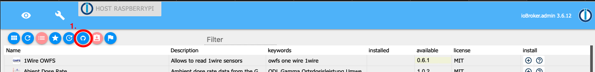
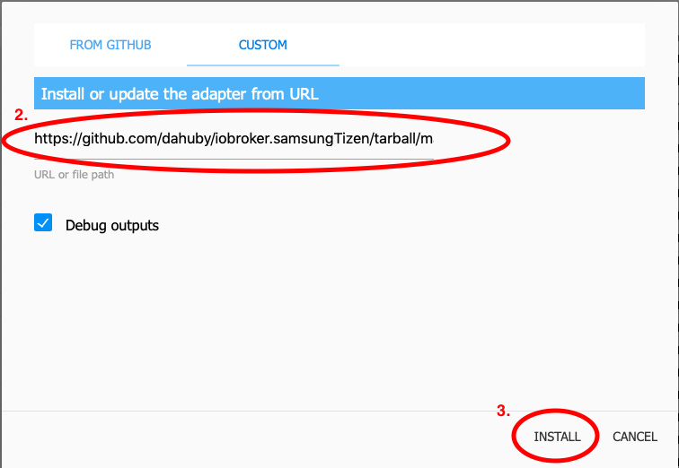
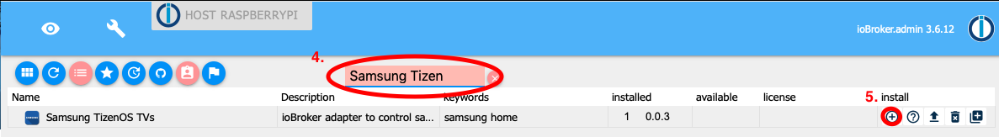
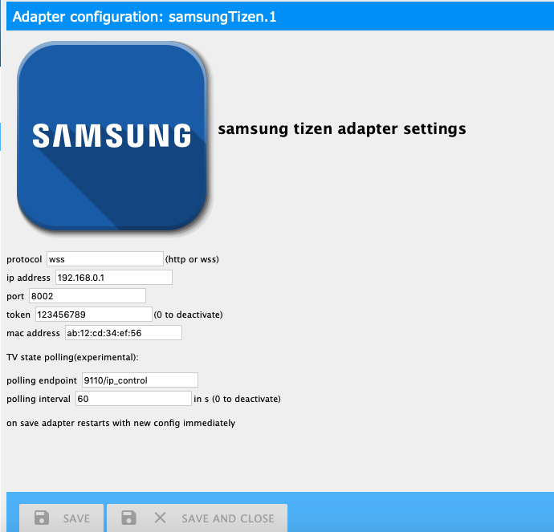
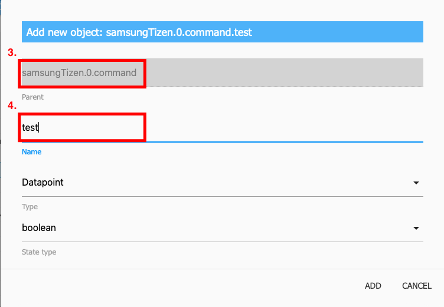

# Iobroker.samsung_tizen
=====================

Dieser Adapter dient zur Steuerung von Samsung-Fernsehern mit TizenOS (>=2016).

1. [Installation](#1-Installation)
2. [Konfiguration](#2-Konfiguration)

2.1. [Protokoll](#21-protocol) 2.2. [IP Adresse](#22-ip-address) 2.3. [Hafen](#23-port) 2.4. [Zeichen](#24-token) 2.5. [Mac-Adresse](#25-mac-adress) 2.6. [TV-Staatsumfrage](#26-tv-state-polling) 2.7. [Befehlsverzögerung](#27-command-delay)

3. [Nutzung](#3-Nutzung)

3.1. [Kontrolle](#31-control) 3.2. [Apps](#32-apps) 3.3. [Befehle](#33-commands)

4. [Lizenz](#4-Lizenz)

## 1. Installation
Öffnen Sie den iobroker-Administrator, gehen Sie zur Registerkarte „Adapter“ und installieren Sie den Adapter von einer benutzerdefinierten Quelle.

<details><summary>detaillierte Installation</summary><p>

1. Klicken Sie auf das Github-Symbol (Installation über benutzerdefinierte URL).



2. Geben Sie diese Github-URL ein: https://github.com/dahuby/iobroker.samsung_tizen/tarball/master
3. Klicken Sie auf Installieren



4. Gehen Sie zurück zur Registerkarte „Adapter“ und suchen Sie nach „Samsung Tizen“.
5. Klicken Sie auf „+“, um eine neue Instanz hinzuzufügen



6. Konfigurieren Sie den Adapter



</p> </details>

## 2. Konfiguration
So konfigurieren Sie diesen Adapter.
Überprüfen Sie zunächst Ihre TV-Einstellungen, schalten Sie den Fernseher ein und gehen Sie zu Einstellungen / Allgemein / Externer Geräte-Manager / Geräteverbindungs-Manager. Dort sollte die Zugriffsbenachrichtigung auf „Nur beim ersten Mal“ aktiviert sein.

### 2.1. Protokoll
Protokoll für die WebSocket-Verbindung zu Ihrem Fernseher.
Mögliche Werte sind http oder wss, auf neueren Geräten verwenden Sie wss

### 2.2. IP Adresse
IP-Adresse Ihres Samsung-Fernsehers

### 2.3. Hafen
Port für die WebSocket-Verbindung zu Ihrem Fernseher.
8001 unsicherer Port 8002 sicherer Port

### 2.4. Zeichen
Token für eine sichere Verbindung zu Ihrem Fernseher.
Speichern Sie den Adapter mit Token = 0 und wechseln Sie zur Registerkarte „IObroker-Administratorobjekt“.
Gehen Sie dann zum Objekt iobroker.samsung_tizen.0.config.getToken und klicken Sie auf die Schaltfläche.
Wenn alles einwandfrei funktioniert, sollte ein neues Objekt iobroker.samsung_tizen.0.config.token mit der ID iobroker.samsung_tizen.0.config.token erscheinen und der Name ist Ihr Token – kopieren Sie den Namen (z. B. 123456789) und kehren Sie zur Adapterkonfiguration zurück und fügen Sie es in das Token-Feld ein.
kann mit Wert „0“ deaktiviert werden

<details><summary>So erhalten Sie manuell einen Token</summary><p> Installieren Sie „wscat“ mit dem folgenden Befehl auf dem Gerät, auf dem ioBroker ausgeführt wird:

```sh
npm install wscat
```

Schalten Sie den Fernseher ein und fragen Sie den Token über eine WebSocket-Verbindung ab

```sh
wscat -n -c wss://tvIp:8002/api/v2/channels/samsung.remote.control?name=aW9Ccm9rZXI=
```

Auf Ihrem Fernseher erscheint ein Popup, das akzeptiert werden muss.
Nehmen Sie das Token aus der zurückgegebenen JSON-Antwort

```json
{"name":"aW9Ccm9rZXI="},"connectTime":1575818900205,"deviceName":"aW9Ccm9rZXI=","id":"12345678-797c-45b0-b0f1-233535918548","isHost":false}],"id":"12345678-797c-45b0-b0f1-233535918548","token":"10916644"},"event":"ms.channel.connect"}
```

</p> </details>

### 2.5. MAC-Adresse
Die MAC-Adresse Ihres Samsung-Fernsehers wird für WakeOnLAN verwendet.
Funktioniert nur, wenn Ihr Fernseher per Kabel und nicht drahtlos angeschlossen ist.
Wenn Ihr Fernseher drahtlos verbunden ist, kann er nur im kurzen Standby-Modus eingeschaltet werden.
wakeOnLan kann mit dem Wert „0“ deaktiviert werden

### 2.6. TV-Landesumfrage
#### Abrufport
Ein Port zum Abrufen des Energiestatus. Standard: 9110. Bekannte verfügbare Ports: 9110, 9119, 9197

#### Polling-Intervall, wie oft die Poll-Anfrage gesendet werden soll Standard: 60 Sekunden kann mit dem Wert „0“ deaktiviert werden
### 2.7. Befehlsverzögerung
Verzögerung in Millisekunden zwischen den über das iobroker.samsung_tizen.0.control.sendCmd-Objekt gesendeten Befehlen.

## 3. Verwendung
### 3.1. Kontrolle
#### Senden Sie einen einzelnen Schlüssel
Um einen einzelnen Schlüssel zu senden, klicken Sie auf die Schaltfläche unter z.B. iobroker.samsung_tizen.0.control.KEY_MUTE

#### Senden Sie einen Schlüssel für eine nicht definierte Schaltfläche
Sie können einen benutzerdefinierten (nicht definierten) Schlüssel mit dem Objekt iobroker.samsung_tizen.0.control.sendCmd senden.
Geben Sie den Schlüssel ein, was Sie senden möchten, z.B. KEY_POWER.

#### Senden Sie mehrere Schlüssel in einem einzigen Befehl
Um mehrere Schlüssel in einem einzigen Befehl zu senden, verwenden Sie das Objekt iobroker.samsung_tizen.0.control.sendCmd.
Geben Sie die Tasten mit "," getrennt ein, z.B. KEY_POWER,KEY_HDMI,KEY_VOLUP.

#### Erstellen Sie Makros für Befehle
Gehen Sie zu iobroker.samsung_tizen.0.command. Hier finden Sie Beispielmakros und können Ihre eigenen Makros erstellen. <a name="use_cmd">So erstellen Sie ein neues Makro</a>

### 3.2. APPS
#### Installierte Apps laden
Um die installierten Apps zu laden, klicken Sie auf die Schaltfläche iobroker.samsung_tizen.0.apps.getInstalledApps.
Danach wird für jede installierte App ein eigenes Objekt mit dem Namen start_app_name erstellt.

#### App starten
Sie können eine App mit einem Klick auf das Objekt iobroker.samsung_tizen.0.apps.start_app_name starten.

### Energiestatus
Wenn Sie die Abfrage des Energiestatus wie oben beschrieben konfiguriert haben, erhalten Sie unter iobroker.samsung_tizen.0.powerOn den Status „true“, wenn Ihr Fernseher eingeschaltet ist, oder „false“, wenn er ausgeschaltet ist.

### 3.3. Befehle
Befehle können manuell über das Objekt iobroker.samsung_tizen.0.control.sendCmd gesendet werden, wie unter <a name="use_ctrl">„Steuerung“</a> erwähnt, oder über benutzerdefinierte Objekte, die unter iobroker.samsung_tizen.0.command erstellt wurden. Es gibt einige Beispielbefehle, Sie können aber auch eigene Makros erstellen.<details><summary> So erstellen Sie ein Befehlsmakro</summary><p>

1. Gehen Sie zu Adaptern und öffnen Sie iobroker.samsung_tizen.0.command
2. Klicken Sie auf das +-Symbol, um ein neues Objekt zu erstellen


3. Überprüfen Sie, ob das übergeordnete Objekt iobroker.samsung_tizen.0.command ist
4. Geben Sie einen neuen Namen für Ihren Befehl ein und überprüfen Sie, ob der Typ „datapoint“ und „stateType“ = boolean ist.



5. Geben Sie unter Name die Schlüssel ein, die Sie senden möchten.
6. Rolle muss Knopf sein
7. und speichern


8. Anschließend können Sie Ihren Befehl mit dem neu erstellten Objekt senden

 </p> </details>

## Credits
Die erste Generation dieses Adapters wurde von Stefan0875 (https://github.com/Stefan0875) entwickelt, die von highPressure (https://github.com/HighPressure) und schließlich Dahuby (https://github.com) angepasst und gewartet wurde .com/dahuby). Vielen Dank für ihre Arbeit und die Erteilung einer öffentlichen Lizenz.

## Changelog

<!--
    Placeholder for the next version (at the beginning of the line):
    ### **WORK IN PROGRESS**
-->
### 1.0.0 (2023-09-30)
- (mcm1957) An official release has been created

### 1.0.0-alpha.2 (2023-09-24)
- (mcm1957) Dependencies have been updated

### 1.0.0-alpha.1 (2023-09-24)
- (mcm1957) Adapter requires node 16 or newer now.
- (mcm1957) Adapter has been moved to iobroker-community-adapters organization.

## License

MIT License 

Copyright (c) 2023 iobroker-community-adapters <mcm57@gmx.at>
Copyright (c) 2020 dahuby

Permission is hereby granted, free of charge, to any person obtaining a copy
of this software and associated documentation files (the "Software"), to deal
in the Software without restriction, including without limitation the rights
to use, copy, modify, merge, publish, distribute, sublicense, and/or sell
copies of the Software, and to permit persons to whom the Software is
furnished to do so, subject to the following conditions:

The above copyright notice and this permission notice shall be included in all
copies or substantial portions of the Software.

THE SOFTWARE IS PROVIDED "AS IS", WITHOUT WARRANTY OF ANY KIND, EXPRESS OR
IMPLIED, INCLUDING BUT NOT LIMITED TO THE WARRANTIES OF MERCHANTABILITY,
FITNESS FOR A PARTICULAR PURPOSE AND NONINFRINGEMENT. IN NO EVENT SHALL THE
AUTHORS OR COPYRIGHT HOLDERS BE LIABLE FOR ANY CLAIM, DAMAGES OR OTHER
LIABILITY, WHETHER IN AN ACTION OF CONTRACT, TORT OR OTHERWISE, ARISING FROM,
OUT OF OR IN CONNECTION WITH THE SOFTWARE OR THE USE OR OTHER DEALINGS IN THE
SOFTWARE.