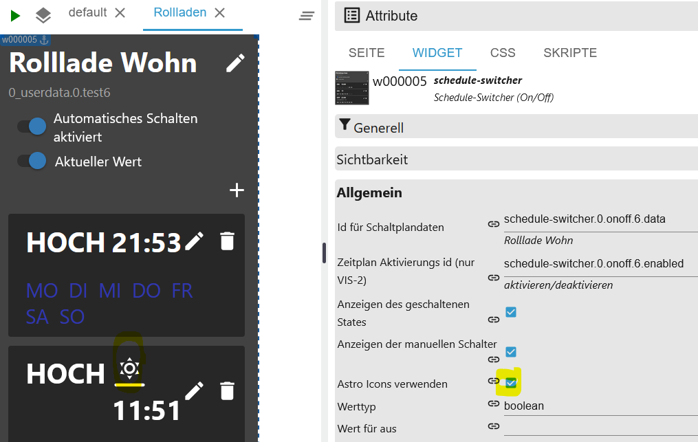
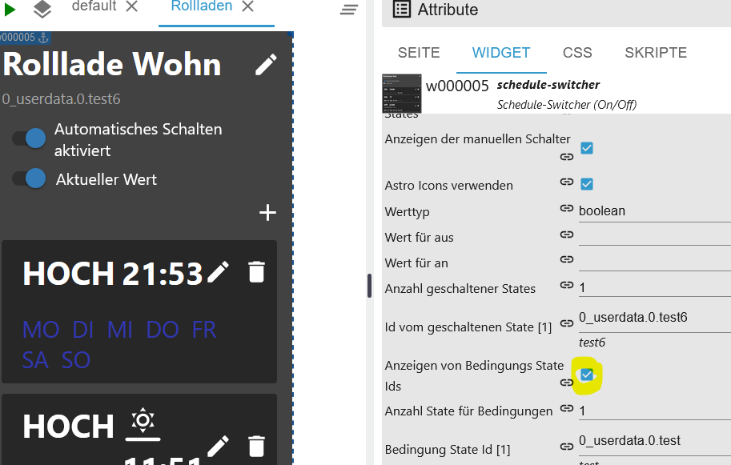

# ioBroker.schedule-switcher

[Zurück zur README](/README.md)

# Einleitung

Dieser Adapter ermöglicht es dem Benutzer, Geräte mithilfe von Zeitplänen ein-/auszuschalten oder 100/0.
Die Zeitpläne können vollständig über ein Vis- oder Vis-2-Widget konfiguriert werden.
Ein Zeitplan wechselt einen oder mehrere ioBroker-Zustände und besteht aus einem oder mehreren Auslösern, die definieren, wann und wie der Zustand gewechselt werden soll.
Es kann konfiguriert werden, zu welcher Uhrzeit und an welchen Wochentagen der Trigger ausgelöst werden soll. Es können auch Astro-Trigger oder Countdowns erstellt werden.

# Zusammenfassung

- [Instanz Einstellungen](#instanz-einstellung-schedule-switcher)
- [Objekte](#states)
- [Beispiel Trigger Events als JSON](#beispiel-triggerevents-json)
- [Beispiel Trigger als JSON](#beispiel-auslöser-json)
- [Beispiel sendTo Trigger nur Experten](#beispiel-auslöser-mit-sendto-anlegen-oder-editieren-experten)
- [Beispiel Widget als JSON](#beispiel-widgets-json)
- [Beispiel Historie als JSON](#beispiel-historie-json)
- [Widget anlegen](#widget-anlegen)
- [Namen ändern](#namen-ändern)
- [Bedingungen hinzufügen](#bedingung-hinzufügen)
- [Text ersetzen](#text-ersetzen)
- [CSS Einstellungen](#css-anwenden-beschreibung-siehe-css)
- [Trigger anlegen](#trigger)
- [Astrotrigger anlegen](#astro-trigger)
- [Einmaltrigger anlegen](#one-time-trigger)
- [HTML Einstellung](#html-für-vis-und-vis-2)
- [HTML Funktion NUR VIS-2](#function-nur-für-vis-2)
- [CSS](#css)

### Instanz Einstellung schedule-switcher

[Zusammenfassung](#zusammenfassung)

- `+ Zeichen`: Neuen Zeitplan hinzufügen
- `Schaltplandaten Id`: Erstellte Objekte
- `Name`: Name vom Widget
- `Anzahl Auslöser`: Anzahl der Auslöser
- `Aktiv`: Aktiv
- `Löschen`: Zeitplan löschen
- `Verzögerung zwischen 2 Schaltvorgängen in ms`: Verhindert zeitgleiches setzen von States
- `Historie Umschaltung als JSON (max. 100/0 für Aus)` Max. Speicherung der Historie
- `HTML für VIS und VIS-2 erstellen (VIS-2 siehe Beschreibung)` Aktivierung HTML Übersicht

    </br>
    

### States

[Zusammenfassung](#zusammenfassung)

- onoff
- `schedule-switcher.0.onoff.6.data` Alle Auslöser als JSON
- `schedule-switcher.0.onoff.6.enabled` Aktiv oder Inaktiv
- `schedule-switcher.0.onoff.6.views` Wo wurden Widgets für die Objekte angelegt
- Status
- `schedule-switcher.0.counterTrigger` Anzahl Trigger (aktive und inaktive)
- `schedule-switcher.0.history` Histerie der Schaltungen
- `schedule-switcher.0.nextEvents` Nächste Schaltvorgänge als JSON Table
- `schedule-switcher.0.sendto` Bei VIS-2 werden Änderungen über dieses Objekt an den Adapter übergeben


# Beispiel Triggerevents JSON

[Zusammenfassung](#zusammenfassung)

```json
[
    {
        "type": "TimeTrigger", // TimeTrigger, AstroTrigger oder OneTimeTrigger
        "name": "Rollloade Wohn", // Name
        "triggerid": 0, // Trigger ID
        "action": "OnOffStateAction", // OnOffStateAction oder Condition
        "states": ["0_userdata.0.test", "0_userdata.0.test5"], // States
        "active": true, // enabled true oder false
        "hour": 16, // Stunde
        "minute": 22, // Minute
        "day": 6, // Tag
        "valueCheck": false, // States vergleichen
        "dateISO": "2024-11-09T15:22:00.000Z", // Zeit ohne Zeitzone
        "timestamp": 1731165720000, // Timestamp ohne Zeitzone
        "objectId": 1 // ObejektId schedule-switcher.0.onoff.<objectid>.data
    }
]
```

# Beispiel Auslöser JSON

[Zusammenfassung](#zusammenfassung)

```json
{
    "type": "OnOffSchedule",
    "name": "Rolllade Wohn", // Name vom letzten erstellte Widget
    "active": false, // Alle 24h wird geprüft, ob es ein Widget gibt. Wird keins gefunden wird der Zeitplan deaktiviert. Mit TRUE wird nicht deaktiviert.
    "onAction": {
        // Action für On
        "type": "OnOffStateAction",
        "valueType": "number",
        "onValue": 0,
        "offValue": 100,
        "booleanValue": true,
        "idsOfStatesToSet": ["0_userdata.0.test4"] // States max. 10
    },
    "offAction": {
        // Action für Off
        "type": "OnOffStateAction",
        "valueType": "number",
        "onValue": 0,
        "offValue": 100,
        "booleanValue": false,
        "idsOfStatesToSet": ["0_userdata.0.test4"] // States max. 10
    },
    "triggers": [
        {
            "type": "AstroTrigger", // Trigger - AstroTrigger - OneTimeTrigger
            "astroTime": "sunrise",
            "shiftInMinutes": 0,
            "weekdays": [1, 2, 3, 4, 5, 6],
            "valueCheck": false,
            "id": "0",
            "action": {
                "type": "ConditionAction",
                "condition": {
                    "type": "StringStateAndConstantCondition",
                    "constant": "true",
                    "stateId": "0_userdata.0.test",
                    "sign": "=="
                },
                "action": {
                    "type": "OnOffStateAction",
                    "name": "On"
                }
            }
        }
    ]
}
```

# Beispiel Widgets JSON

[Zusammenfassung](#zusammenfassung)

```json
{
    "vis-2.0": {
        // Welche VIS Version
        "main": {
            // Projekt
            "w000005": {
                // Widget ID
                "prefix": "main", // Projekt
                "namespace": "vis-2.0", // Welche VIS Version
                "view": "Rollladen", // Welche View
                "widgetId": "w000005", // Widget ID
                "newId": "schedule-switcher.0.onoff.6.data", // Neues Objekt
                "oldId": "timer-switch.0.onoff.1.data", // Altes Objekt
                "enabled": "schedule-switcher.0.onoff.6.enabled", // Enabled Objekt
                "stateCount": 1, // Counter Zustände
                "state": [
                    // Zustände
                    {
                        "oid-stateId1": "0_userdata.0.test5"
                    }
                ],
                "conditionCount": 1, // Counter Bedingung
                "condition": [
                    // Zustände Bedingungen
                    {
                        "oid-conditionStateId1": "0_userdata.0.test"
                    }
                ]
            },
            "w000006": {
                // Widget ID
                "prefix": "main", // Projekt
                "namespace": "vis-2.0", // Welche VIS Version
                "view": "Test", // Welche View
                "widgetId": "w000006", // Widget ID
                "newId": "schedule-switcher.0.onoff.6.data", // Neues Objekt
                "oldId": "timer-switch.0.onoff.1.data", // Altes Objekt
                "enabled": "schedule-switcher.0.onoff.6.enabled", // Enabled Objekt
                "stateCount": 1, // Counter Zustände
                "state": [
                    // Zustände
                    {
                        "oid-stateId1": "0_userdata.0.test4"
                    }
                ],
                "conditionCount": 1, // Counter Bedingung
                "condition": [] // Zustände Bedingungen
            }
        }
    }
}
```

# Beispiel Auslöser mit sendTo anlegen oder editieren (Experten)

[Zusammenfassung](#zusammenfassung)

```JSON
sendTo("schedule-switcher.0", "add-trigger", { // Neuen Auslöser anlegen
    "dataId":"schedule-switcher.0.onoff.6.data",
    "triggerType":"TimeTrigger",
    "actionType":"OnOffStateAction"
});

sendTo("schedule-switcher.0", "update-trigger", { // Aktion für den neuen Auslöser festlegen
    "dataId":"schedule-switcher.0.onoff.6.data",
    "trigger":{
        "type":"TimeTrigger",
        "hour":12,
        "minute":32,
        "weekdays":[1,2,3,4,5],
        "valueCheck": false,
        "id":"0", // ID abgleichen
        "action":{
            "type":"OnOffStateAction",
            "name":"On"
        }
    }
});

sendTo("schedule-switcher.0", "add-trigger", { // Neuen Astrotrigger anlegen
    "dataId":"schedule-switcher.0.onoff.6.data",
    "triggerType":"AstroTrigger",
    "actionType":"OnOffStateAction"
});

sendTo("schedule-switcher.0", "update-trigger", { // Aktion für den neuen Auslöser festlegen
    "dataId":"schedule-switcher.0.onoff.6.data",
    "trigger":{
        "type":"AstroTrigger",
        "astroTime":"sunrise", // sunrise, sunset or solarNoon
        "shiftInMinutes":0,
        "weekdays":[1,2,3,4,5],
        "valueCheck": false,
        "id":"0", // ID abgleichen
        "action":{
            "type":"OnOffStateAction",
            "name":"On"
        }
    }
});

sendTo("schedule-switcher.0", "disable-schedule", { // Auslöser deaktivieren
    "dataId":"schedule-switcher.0.onoff.6.data"
});

sendTo("schedule-switcher.0", "enable-schedule", { // Auslöser aktivieren
    "dataId":"schedule-switcher.0.onoff.6.data"
});

sendTo("schedule-switcher.0", "add-one-time-trigger", { // Einmalauslöser anlegen
    "dataId":"schedule-switcher.0.onoff.6.data",
    "trigger":"{\"type\":\"OneTimeTrigger\",\"date\":\"2024-10-17T06:14:22.660Z\",\"valueCheck\": false,\"timedate\":false,\"action\":{\"type\":\"OnOffStateAction\",\"name\":\"On\"}}"
});

sendTo("schedule-switcher.0", "delete-trigger", { // Auslöser mit bekannter ID löschen
    "dataId":"schedule-switcher.0.onoff.6.data",
    "triggerId":"0"
});

sendTo("schedule-switcher.0", "change-active", { // Zeitplan ohne Widget aktiv lassen (wird bei restart oder alle 24h geprüft)
    "dataId":"schedule-switcher.0.onoff.6.data",
    "active":false, // false: Automatische Deaktivierung wenn kein Widget vorhanden ist
});

sendTo("schedule-switcher.0", "change-active", { // Zeitplan ohne Widget aktiv lassen (wird bei restart oder alle 24h geprüft)
    "dataId":"schedule-switcher.0.onoff.6.data",
    "active":true, // true: Zeitplan wird nicht deaktiviert wenn kein Widget vorhanden ist
});
```

# Beispiel Historie JSON

[Zusammenfassung](#zusammenfassung)

```JSON
[
  {
    "setObjectId": "0_userdata.0.test4",
    "objectId": 0,
    "value": true,
    "old_value": false,
    "setValue": false,
    "object": "0_userdata.0.test4",
    "trigger": "TimeTrigger",
    "astroTime": "unknown",
    "shift": 0,
    "date": 0,
    "hour": 20,
    "minute": 48,
    "weekdays": [
      [
        1,
        2,
        3,
        4,
        5,
        6,
        0
      ]
    ],
    "time": 1729622880040
  },
  {
    "setObjectId": "0_userdata.0.test4",
    "objectId": 0,
    "value": true,
    "old_value": false,
    "setValue": false,
    "object": "0_userdata.0.test4",
    "astroTime": "unknown",
    "shift": 0,
    "date": 0,
    "hour": 20,
    "minute": 47,
    "weekdays": [
      [
        1,
        2,
        3,
        4,
        5,
        6,
        0
      ]
    ],
    "time": 1729622820071
  }
]
```

# Beispiel Widget View JSON

[Zusammenfassung](#zusammenfassung)

```json
{
    "vis-2.0": {
        "main": {
            "w000004": {
                "prefix": "main", // Projekt
                "namespace": "vis-2.0", // VIS
                "view": "default", // View
                "widgetId": "w000004", // Widget ID
                "newId": "schedule-switcher.0.onoff.3.data" // Objekt ID
            }
        }
    },
    "vis.0": {
        "main": {
            "w00001": {
                "prefix": "main",
                "namespace": "vis.0",
                "view": "Rollo",
                "widgetId": "w00001",
                "newId": "schedule-switcher.0.onoff.3.data"
            }
        }
    }
}
```

### Widget anlegen

[Zusammenfassung](#zusammenfassung)

- Widget in einer View einfügen


- ID für Schaltplandaten auswählen
- Zeitplan Aktivierungs ID auswählen
- ID vom geschaltenen State auswählen (max. 10 möglich)


- Wertetype festlegen und die Werte die gesetzt werden sollen


- Nun einen Schaltplan erstellen


### Namen ändern

[Zusammenfassung](#zusammenfassung)

- Namen ändern - Wird in den Objekten auch übernommen


### Bedingung hinzufügen

[Zusammenfassung](#zusammenfassung)

- Eine Bedingung festellen.


### Text ersetzen

[Zusammenfassung](#zusammenfassung)

- Text an/aus und alles an/alles aus ändern


### CSS anwenden [Beschreibung siehe css](#css)

[Zusammenfassung](#zusammenfassung)

- Verwende CSS aktivieren um den Style anzupassen</br>
  </br>
  </br>
  </br>
  </br>
  </br>
  </br>
  </br>
  </br>
  

### Trigger

[Zusammenfassung](#zusammenfassung)

- Den Stift anklicken um die Zeit einzutragen oder die Mülltonne um den Trigger zu löschen


- Schaltzustand auswählen
- Eine Bedingung auswählen (optional)
- Wert nur setzen wenn er ungleich ist
- Zeit eintragen (hh:mm)

```:warning:
 ⚠ Zeigt in Firefox kein Uhrzeit-Feld an!
```


- Wochentag auswählen
- Oben rechts speichern anklicken


- Fertig


### Astro Trigger

[Zusammenfassung](#zusammenfassung)

- Den Stift anklicken um die Astrozeit auszuwählen oder die Mülltonne um den Trigger zu löschen


- Schaltzustand auswählen
- Eine Bedingung auswählen (optional)
- Wert nur setzen wenn er ungleich ist
- Astrozeit auswählen (Sonnenaufgang, Sonnenuntergang oder Mittag)


- Offset in Minuten eintragen (optional)
- Wochentag auswählen
- Oben rechts speichern anklicken


- Fertig


### One Time Trigger

[Zusammenfassung](#zusammenfassung)

- Schaltzustand auswählen
- Eine Bedingung auswählen (optional)
- Wert nur setzen wenn er ungleich ist
- Zeit eintragen (hh:mm:ss)
- Oben rechts speichern anklicken


- Fertig


- Schaltzustand auswählen
- Eine Bedingung auswählen (optional)
- Wert nur setzen wenn er ungleich ist
- Zeit eintragen/auswählen (dd.mm.yyyy hh:mm:ss)
- Oben rechts speichern anklicken

```:warning:
 ⚠ Zeigt in Firefox kein Uhrzeit-Feld an!
```

</br>


- Fertig


### HTML für VIS und VIS-2

[Zusammenfassung](#zusammenfassung)

- `html.background_color_body` Hintergrundfarbe vom Body. Bei VIS komplett und bei VIS-2 nur das Widget - Standard #000000
- `html.background_color_even` Hintergrundfarbe Trigger gerade Zahl - Standard #1E1E1E
- `html.background_color_odd` Hintergrundfarbe Trigger ungerade Zahl - Standard #18171C
- `html.background_color_trigger` Hintergrundfarbe Trigger Objekt - Standard #000000
- `html.background_color_weekdays_hover` Hintergrundfarbe bei Mouseover der Wochentage - Klick für aktivieren/deaktivieren - Standard blue
- `html.column_align_01` Kopftextausrichtung Spalte 1 - Standard center
- `html.column_align_02` Kopftextausrichtung Spalte 2 - Standard center
- `html.column_align_03` Kopftextausrichtung Spalte 3 - Standard center
- `html.column_align_04` Kopftextausrichtung Spalte 4 - Standard center
- `html.column_align_05` Kopftextausrichtung Spalte 5 - Standard center
- `html.column_align_06` Kopftextausrichtung Spalte 6 - Standard center
- `html.column_align_07` Kopftextausrichtung Spalte 7 - Standard center
- `html.column_align_08` Kopftextausrichtung Spalte 8 - Standard center
- `html.column_align_09` Kopftextausrichtung Spalte 9 - Standard center
- `html.column_align_10` Kopftextausrichtung Spalte 10 - Standard center
- `html.column_text_01` Kopftext Spalte 1 - Standard Schedule
- `html.column_text_02` Kopftext Spalte 2 - Standard Devices
- `html.column_text_03` Kopftext Spalte 3 - Standard Switch
- `html.column_text_04` Kopftext Spalte 4 - Standard Mo
- `html.column_text_05` Kopftext Spalte 5 - Standard Tu
- `html.column_text_06` Kopftext Spalte 6 - Standard We
- `html.column_text_07` Kopftext Spalte 7 - Standard Th
- `html.column_text_08` Kopftext Spalte 8 - Standard Fr
- `html.column_text_09` Kopftext Spalte 9 - Standard Sa
- `html.column_text_10` Kopftext Spalte 10 - Standard Su
- `html.column_width_01` Breite der Spalte 1 - Standard auto
- `html.column_width_02` Breite der Spalte 2 - Standard auto
- `html.column_width_03` Breite der Spalte 3 - Standard auto
- `html.column_width_04` Breite der Spalte 4 - Standard auto
- `html.column_width_05` Breite der Spalte 5 - Standard auto
- `html.column_width_06` Breite der Spalte 6 - Standard auto
- `html.column_width_07` Breite der Spalte 7 - Standard auto
- `html.column_width_08` Breite der Spalte 8 - Standard auto
- `html.column_width_09` Breite der Spalte 9 - Standard auto
- `html.column_width_70` Breite der Spalte 10 - Standard auto
- `html.font_color_text_disabled` Textfarbe vom deaktivierten Objekt - Standard red
- `html.font_color_text_enabled` Textfarbe vom aktivierten Objekt - Standard yellow
- `html.font_color_weekdays_disabled` Textfarbe von deaktivierten Wochentagen - Standard red
- `html.font_color_weekdays_enabled` Textfarbe von aktivierten Wochentagen - Standard yellow
- `html.header_border` Kopfrand in Pixel - Standard 2
- `html.header_font_family` Kopf Schriftfamilie - Standard Helvetica
- `html.header_font_size` Kopf Schriftgöße - Standard 15
- `html.header_linear_color_1` Kopf Hintergrundbild: linearer Farbverlauf 1 - Standard #BDBDBD
- `html.header_linear_color_2` Kopf Hintergrundbild: linearer Farbverlauf 2 - Standard #BDBDBD
- `html.header_tag_border_color` Kopf HTML TAG `<td>` Randfarbe - Standard #424242
- `html.header_width` Kopf TAG `<table>` Größe Standard auto
- `html.column_align_row_01` Textausrichtung der Zeilen in Spalte 1 - Standard left
- `html.column_align_row_02` Textausrichtung der Zeilen in Spalte 2 - Standard left
- `html.column_align_row_03` Textausrichtung der Zeilen in Spalte 3 - Standard left
- `html.column_align_row_04` Textausrichtung der Zeilen in Spalte 4 - Standard left
- `html.column_align_row_05` Textausrichtung der Zeilen in Spalte 5 - Standard left
- `html.column_align_row_06` Textausrichtung der Zeilen in Spalte 6 - Standard left
- `html.column_align_row_07` Textausrichtung der Zeilen in Spalte 7 - Standard left
- `html.column_align_row_08` Textausrichtung der Zeilen in Spalte 8 - Standard left
- `html.column_align_row_09` Textausrichtung der Zeilen in Spalte 9 - Standard left
- `html.column_align_row_10` Textausrichtung der Zeilen in Spalte 10 - Standard left
- `html.headline_color` Kopf Schriftfarbe (schedule, device ...) - Standard #ffffff
- `html.headline_font_size` Kopf Schriftgröße in Pixel - Standard 16
- `html.headline_height` Kopf Zeilenhöhe in Pixel - Standard 35
- `html.headline_underlined` Kopf Rand unten in Pixel - Standard 3
- `html.headline_underlined_color` Kopf Randfarbe unten - Standard #ffffff
- `html.headline_weight` Kopf Schriftstärke - Standard normal
- `html.html_code` HTML Code für VIS, VIS-2, Jarvis, IQontrol usw.
- `html.icon_false` Icon Schaltzustand aus - Standard ⚪
- `html.icon_state_check_no` Statusvergleich deaktiviert 🔴
- `html.icon_state_check_yes` Zustandsvergleich aktiviert 🟢
- `html.icon_switch_symbol` Icon Schalter um die Zeitschaltuhr zu aktivieren/deaktivieren - Standard ⏱
- `html.icon_true` Icon Schaltzustand an - Standard 🟡
- `html.jarvis` Kompatibel für Jarvis - Standard false
- `html.p_tag_text_algin` HTML `<p>` Textausrichtung (Letzte Aktualisierung und Fußzeile) - Standard center
- `html.table_tag_border_color` Randfarbe vom TAG `<table>` - Standard #424242
- `html.table_tag_cell` Grenzabstand vom TAG `<table>` in Pixel - Standard 6
- `html.table_tag_text_align` Textausrichtung vom TAG `<table>` - Standard center
- `html.table_tag_width` Größe vom TAG `<table>` - Standard auto
- `html.td_tag_border_bottom` Rand unten vom TAG `<td>` in Pixel - Standard 1
- `html.td_tag_border_color` Randfarbe unten vom TAG `<td>` - Standard #424242
- `html.td_tag_border_right` Rand rechts vom TAG `<td>` in Pixel - Standard 1
- `html.td_tag_cell` Platz um den Text vom TAG `<td>` in Pixel (padding) - Standard 6
- `html.top_font_family` Schriftfamilie von Kopfzeile und Fußzeile - Standard Helvetica
- `html.top_font_size` Schriftgröße von Kopfzeile und Fußzeile in Pixel - Standard 20
- `html.top_font_weight` Schriftstärke von Kopfzeile und Fußzeile - Standard normal"
- `html.top_text` Eigener Text für die Kopfzeile - Standard your text
- `html.top_text_color` Schriftfarbe von Kopfzeile und Fußzeile - Standard #ffffff
- `html.update` Manuelles Update starten


- Ein HTML Widget anlegen und unter HTML das Objekt eintragen `{schedule-switcher.0.html.html_code}`
- Klick auf den Schriftzug `Letzte Aktualisierung` um ein manuelles Update durchzuführen
- Icon anklicken um das Widget zu aktivieren/deaktivieren
- Um ein Auslöser zu löschen muss man erst einen Haken setzen und dann den Button `delete` drücken
- Zeiten/Astro ändern und den Button `save` drücken um die Änderungen zu übernehmen
- Wochentag anklicken um diesen zu aktivieren/deaktivieren
- Zeile Triggername wird unter Wochentage der nächste Event on/off angezeigt


### Function NUR für VIS-2!!!

[Zusammenfassung](#zusammenfassung)

NUR bei VIS-2 müssen leider die unten aufgeführten Funktionen manuell eingefügt werden (siehe Bilder)

</br>


```java
function deleteTrigger(stateId, command, id, dataid, count) {
    var checked = document.getElementById('delete' + count).checked;
    if (checked) {
        var data = {
			"command": command,
			"message": {
				"triggerId": id,
				"dataId": dataid,
			}
		};
		vis.conn.setState(stateId + '.sendto', { val: JSON.stringify(data), ack: false });
	}
}
function changeweekdays(stateId, command, dataid, id, changeid, type) {
    if (type === "OneTimeTrigger") return;
    var data = {
		"command": command,
		"message": {
			"changeid": changeid,
			"triggerid": id,
			"dataid": dataid
		}
    };
	vis.conn.setState(stateId + '.sendto', { val: JSON.stringify(data), ack: false });
}
function changeValueCheck(stateId, command, dataid, id, value) {
    var data = {
		"command": command,
		"message": {
            "changeval": value,
            "triggerid": id,
            "dataid": dataid
		}
    };
    vis.conn.setState(stateId + '.sendto', { val: JSON.stringify(data), ack: false });
}
function updateTrigger(stateId) {
	vis.conn.setState(stateId + '.html.update', { val: true, ack: false });
}
function setState(stateId, value) {
	vis.conn.setState(stateId, { val: value == 'false' ? false : true, ack: false });
}
function sendToAstro(stateId, command, dataid, id, count) {
    var timeselect = document.getElementById('timeselect' + count).value;
    var shift = document.getElementById('shift' + count).value;
    var data = {
		"command": command,
		"message": {
			"astrotime": timeselect,
			"shift": shift,
			"triggerid": id,
			"dataid": dataid
		}
    };
	vis.conn.setState(stateId + '.sendto', { val: JSON.stringify(data), ack: false });
}
function sendToDateTime(stateId, command, id, dataid, count) {
    var value = document.getElementById('datetime' + count).value;
    var data = {
		"command": command,
		"message": {
			"time": value,
			"triggerid": id,
			"dataid": dataid
		}
    };
	vis.conn.setState(stateId + '.sendto', { val: JSON.stringify(data), ack: false });
}
function sendToTime(stateId, command, id, dataid, count) {
    var value = document.getElementById('nexttime' + count).value;
    var data = {
		"command": command,
		"message": {
			"time": value,
			"triggerid": id,
			"dataid": dataid
		}
    };
	vis.conn.setState(stateId + '.sendto', { val: JSON.stringify(data), ack: false });
}
```

### CSS

[Zusammenfassung](#zusammenfassung)

```
app-on-off-schedules-widget {
    /* Primary color (button background, toggle switch color) */
    --ts-widget-primary-color: #337ab7;

    /* Background color of the widget */
    --ts-widget-bg-color: #424242;
    /* Background color of the triggers */
    --ts-widget-trigger-bg-color: #272727;

    /* Foreground color (font color and scrollbar color) */
    --ts-widget-fg-color: white;
    /* Font color of the switched states id */
    --ts-widget-oid-fg-color: #a5a5a5;
    /* Font color in buttons */
    --ts-widget-btn-fg-color: white;
    /* Font color of a disabled weekday */
    --ts-widget-weekdays-disabled-fg-color: #5D5D5D;
    /* Font color of an enabled weekday */
    --ts-widget-weekdays-enabled-fg-color: white;
    /* Font color of the name of the widget (defaults to --ts-widget-fg-color) */
    --ts-widget-name-fg-color: white;
    /* Font color of switched time (defaults to --ts-widget-fg-color) */
    --ts-widget-switched-time-fg-color: white;
    /* Font color of switched value (defaults to --ts-widget-fg-color)*/
    --ts-widget-switched-value-fg-color: white;
    /* Font color of the astro time (defaults to --ts-widget-fg-color) */
    --ts-widget-astro-time-fg-color: black;
    /* Font color of the astro time's shift */
    --ts-widget-astro-shift-fg-color: #5d5d5d;
    /* Font color of condition (defaults to --ts-widget-fg-color) */
    --ts-widget-condition-fg-color: white;
    /* Font color of toogle button off */
    --ts-widget-off-color: #c0c0c0;
    /* Color background toogle button off */
    --ts-widget-off-color-container: #808080;
    /* Color of next astro switching time */
    --ts-widget-astro-next-fg-color: white;

    /* Font family used in the whole widget */
    --ts-widget-font-family: 'Roboto', 'Segoe UI', BlinkMacSystemFont, system-ui, -apple-system;
    /* Font size of the name of the widget */
    --ts-widget-name-font-size: 2em;
    /* Font size of the switched oid */
    --ts-widget-oid-font-size: 30px;
    /* Font size of switch text */
    --ts-widget-state-action-width: 65px;
    /* Font size of next astro switching time */
    --ts-widget-astro-next-font-size: 2em;
    /* Width of date time input */
    --ts-widget-datetime-width: 230px;

    /* Display of edit name button. Use 'none' to hide the button and 'block' to show it
    --ts-widget-edit-name-button-display: block;
    /* Display of condition. Use 'none' to hide the condition and 'block' to show it
    -ts-widget-condition-display: block;
    /* Display of time icon. Use 'none' to hide the button and 'block' to show it
    --ts-widget-time-icon-display: none;

    /* Applies a filter to icons used in buttons (safe, edit, remove, cancel), for
       white use invert(1) and for black invert(0) */
    --ts-widget-img-btn-filter: invert(1);

    /* Add trigger dropdown background color */
    --ts-widget-add-trigger-dropdown-bg-color: #f1f1f1;
    /* Add trigger dropdown font color */
    --ts-widget-add-trigger-dropdown-fg-color: black;
    /* Add trigger dropdown hover background color */
    --ts-widget-add-trigger-dropdown-hover-bg-color: #ddd;

    /* ! Changing these may break the layout, change at your own risk */

    /* Font size of weekdays */
    --ts-widget-weekdays-font-size: 23px;
    /* Font size of switched value (on/off) */
    --ts-widget-switched-value-font-size: 2em;
    /* Font size of switched time */
    --ts-widget-switched-time-font-size: 2em;
    /* Font size of the astro time (e.g. Sunrise, ...) */
    --ts-widget-astro-time-font-size: 1.5em;
    /* Font size of the astro time's shift */
    --ts-widget-astro-shift-font-size: 1em;
    /* Font size of condition */
    --ts-widget-condition-font-size: 1em;
}
```

## Changelog

<!--
    Placeholder for the next version (at the beginning of the line):
    ### **WORK IN PROGRESS**
-->

### **WORK IN PROGRESS**

- (Lucky-ESA) Fixed warn log (Cannot read dir...)
- (Lucky-ESA) Added state comparison enabled/disabled
- (Lucky-ESA) Fixed small some bugs

### 0.0.12 (2025-08-27)

- (Lucky-ESA) Astro time in widget fixed

### 0.0.11 (2025-08-16)

- (Lucky-ESA) Admin 7.6.17 required
- (Lucky-ESA) Node 20 required

### 0.0.10 (2025-02-11)

- (Lucky-ESA) Dependencies updated
- (Lucky-ESA) Fixed: In the HTML overview, enabled / disabled does not work
- (Lucky-ESA) Fixed: Astrotime incorrectly
- (Lucky-ESA) Added: Current day in font weight bold

### 0.0.9 (2024-12-20)

- (Lucky-ESA) Fixed: Reading files from Redis database
- (Lucky-ESA) Added: Automatic deactivation control
- (Lucky-ESA) Fixed: Visibility
- (Lucky-ESA) Fixed: Bug in type check

### 0.0.8 (2024-12-07)

- (Lucky-ESA) Migration to ESLint9
- (Lucky-ESA) Bugfixes

## License

MIT License

Copyright (c) 2024-2025 Lucky_ESA <github@luckyskills.de>

Permission is hereby granted, free of charge, to any person obtaining a copy
of this software and associated documentation files (the "Software"), to deal
in the Software without restriction, including without limitation the rights
to use, copy, modify, merge, publish, distribute, sublicense, and/or sell
copies of the Software, and to permit persons to whom the Software is
furnished to do so, subject to the following conditions:

The above copyright notice and this permission notice shall be included in all
copies or substantial portions of the Software.

THE SOFTWARE IS PROVIDED "AS IS", WITHOUT WARRANTY OF ANY KIND, EXPRESS OR
IMPLIED, INCLUDING BUT NOT LIMITED TO THE WARRANTIES OF MERCHANTABILITY,
FITNESS FOR A PARTICULAR PURPOSE AND NONINFRINGEMENT. IN NO EVENT SHALL THE
AUTHORS OR COPYRIGHT HOLDERS BE LIABLE FOR ANY CLAIM, DAMAGES OR OTHER
LIABILITY, WHETHER IN AN ACTION OF CONTRACT, TORT OR OTHERWISE, ARISING FROM,
OUT OF OR IN CONNECTION WITH THE SOFTWARE OR THE USE OR OTHER DEALINGS IN THE
SOFTWARE.