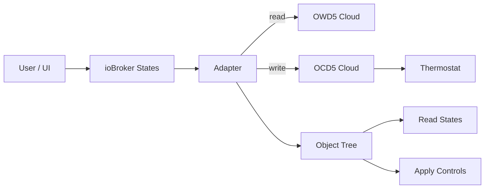
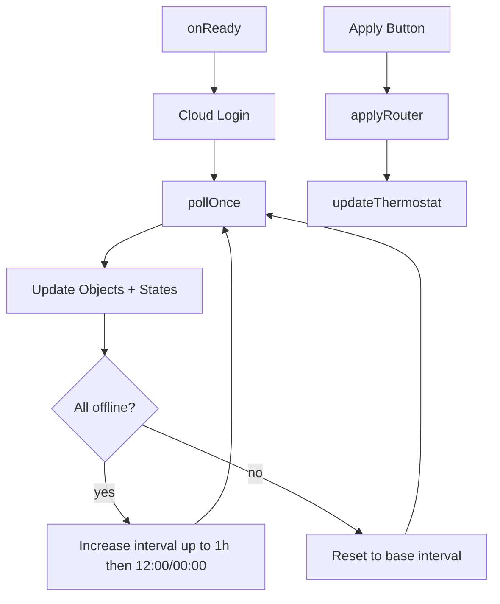

# IoBroker.schlueter-thermostat

**Tests:** 

---

##
## 🌍 Übersicht

Dieser Adapter integriert <strong>Schlüter / OJ Microline OWD5-Thermostate</strong> über die <strong>offiziellen Cloud-APIs</strong> in ioBroker.

Es basiert auf der HA-Integration von @robbinjanssen. Weitere Informationen finden Sie in der Dokumentation.

> **Nur Cloud** — kein lokales Gateway, Modbus oder LAN-API erforderlich.

##
## 🚀 So geht's los
1. Adapter in ioBroker installieren
2. Öffnen Sie die Instanzkonfiguration.
3. Eingabe:

| Schauplatz | Beschreibung |
| ----------------- | ----------------------------- |
| Benutzername | Ihr Schlüter/OJ Cloud-Login |
| Passwort | Cloud-Passwort |
| API-Schlüssel | Der folgende Schlüssel funktioniert in den meisten Fällen |
| Kunden-ID | In den Thermostatinformationen gefunden |
| Client-Softwareversion | Numerischer Wert vom Thermostat |
| Abfrageintervall | Standard: 60 Sekunden |

4. Adapter speichern und starten

Für den API-Schlüssel können Sie Folgendes versuchen: `f219aab4-9ac0-4343-8422-b72203e2fac9`.
Diesen Schlüssel finden Sie im Forum unter `https://community.home-assistant.io/t/mwd5-wifi-thermostat-oj-electronics-microtemp/445601`. Es scheint sich also um einen globalen Schlüssel zu handeln.

##
## Dokumentation
[🇺🇸 Dokumentation](./docs/en/README.md)

[🇩🇪 Dokumentation](./docs/de/README.md)

##
## Überblick über die Kompaktarchitektur
### Architektur-Abzeichen
### Kompakte Programmstruktur

### Interner Durchfluss (Mini)

##
## 📌 Notizen
- Entwickelt und getestet mit einem einzigen Thermostat
- Unterstützung für Umgebungen mit mehreren Geräten, Feedback ist willkommen

##

## Changelog

<!--
	Placeholder for the next version (at the beginning of the line):
	### **WORK IN PROGRESS**
-->
### 0.5.2 (2026-03-20)

- (patricknitsch) Update Readme
- (patricknitsch) Fix Issues from RepoChecker

### 0.5.1 (2026-03-18)

- (copilot) Fix issue with configuration button in Tab

### 0.5.0 (2026-03-17)

- (copilot) Add `admin/tab.html` control panel with green theme, i18n (DE/EN), live status banner, quick modes, temperature control, vacation, schedule viewer and configuration button
- (copilot) Status banner now shows energy consumption for today (kWh)
- (copilot) Instance selector removed — instance is auto-detected from the `?instance=N` URL parameter passed by Admin 7

### 0.4.3 (2026-03-06)

- (patricknitsch) Fix adapter type in io-package.json

### 0.4.2 (2026-03-06)

- (claude) Fixed object hirarchy
- (patricknitsch) Update Readme

### 0.4.1 (2026-02-26)

- (patricknitsch) Update Packages and Workflow

### 0.4.0 (2026-02-11)

- (claude) Fallback if Devices or Cloud offline

### 0.3.2 (2026-01-31)

- (patricknitsch) Update from git to https

### 0.3.1 (2026-01-31)

- (patricknitsch) Add Mode Frost Protection
- (patricknitsch) Show Enum instead of Regulation Number

### 0.3.0 (2026-01-31)

- (patricknitsch) Update Readme
- (patricknitsch) Verify Polling if Thermostat give no Response
- (patricknitsch) Complete Refactoring to handle functions better
- (patricknitsch) encrypt all sensitive credentials -> Relogin necessary
- (patricknitsch) Code Fixing for latest repo

### 0.2.4 (2026-01-28)

- (patricknitsch) Change Format of Times

### 0.2.3 (2026-01-28)

- (patricknitsch) Catch wrong values for Temperature and Regulation Mode

### 0.2.2 (2026-01-28)

- (patricknitsch) Update setStates for ComfortMode
- (patricknitsch) More Debugging

### 0.2.1 (2026-01-28)

- (patricknitsch) Fix JsonConfig

### 0.2.0 (2026-01-28)

- (patricknitsch) add automatic Refresh of Token after Error 403
- (patricknitsch) fix max Value of Regulation Mode to 9 for error preventing
- (patricknitsch) improve Handling of Mode Settings

### 0.1.1 (2026-01-28)

- (patricknitsch) updated Readme

### 0.1.0 (2026-01-28)

- (patricknitsch) initial release
- (patricknitsch) fetch data and write in Datapoints
- (patricknitsch) functional version with Energy and settable functions

##

## License

MIT License

Copyright (c) 2026 patricknitsch <patricknitsch@web.de>

Permission is hereby granted, free of charge, to any person obtaining a copy
of this software and associated documentation files (the "Software"), to deal
in the Software without restriction, including without limitation the rights
to use, copy, modify, merge, publish, distribute, sublicense, and/or sell
copies of the Software, and to permit persons to whom the Software is
furnished to do so, subject to the following conditions:

The above copyright notice and this permission notice shall be included in all
copies or substantial portions of the Software.

THE SOFTWARE IS PROVIDED "AS IS", WITHOUT WARRANTY OF ANY KIND, EXPRESS OR
IMPLIED, INCLUDING BUT NOT LIMITED TO THE WARRANTIES OF MERCHANTABILITY,
FITNESS FOR A PARTICULAR PURPOSE AND NONINFRINGEMENT. IN NO EVENT SHALL THE
AUTHORS OR COPYRIGHT HOLDERS BE LIABLE FOR ANY CLAIM, DAMAGES OR OTHER
LIABILITY, WHETHER IN AN ACTION OF CONTRACT, TORT OR OTHERWISE, ARISING FROM,
OUT OF OR IN CONNECTION WITH THE SOFTWARE OR THE USE OR OTHER DEALINGS IN THE
SOFTWARE.