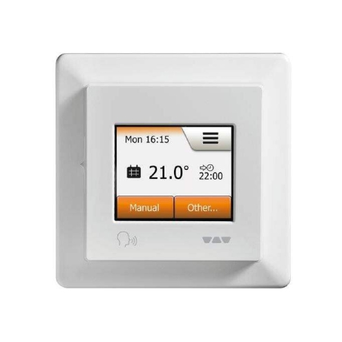
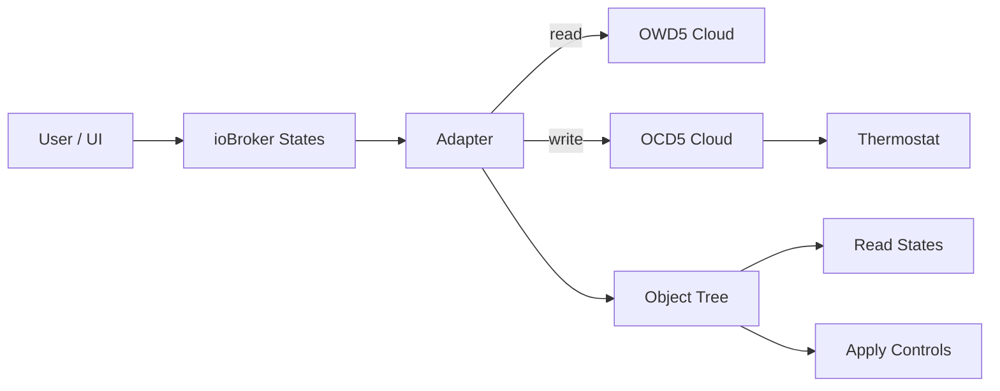
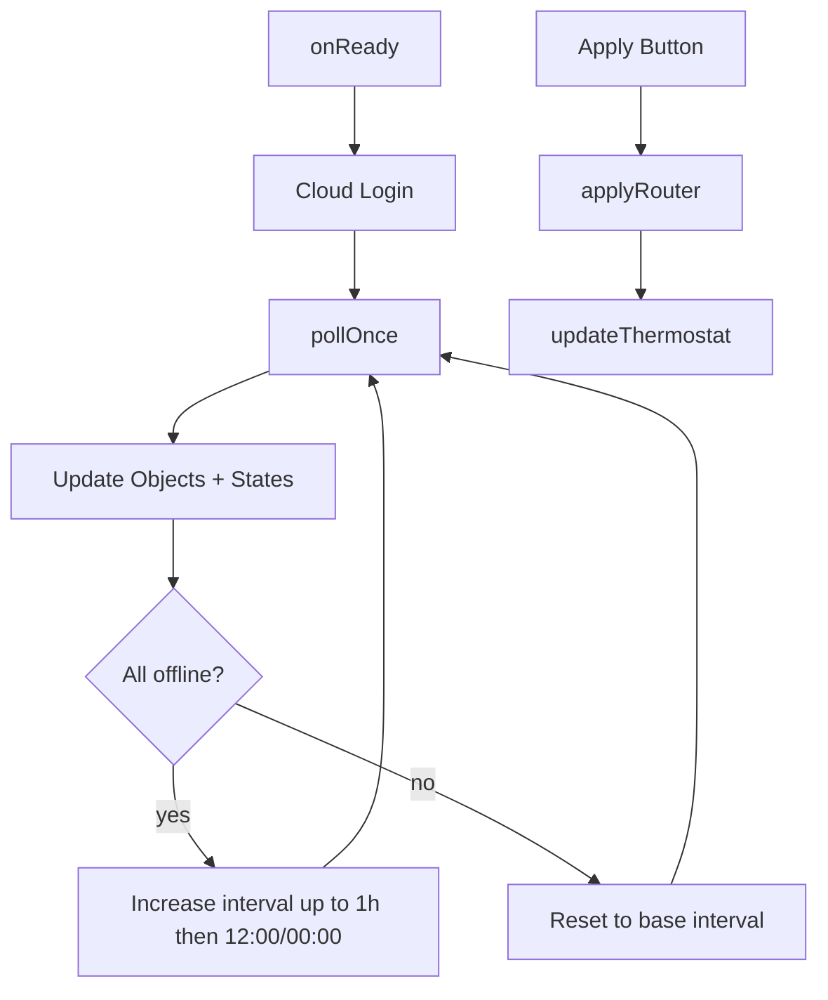

# ioBroker.schlueter-thermostat

---

##

## 🌍 Übersicht

 Dieser Adapter integriert<strong> Schlüter / OJ Microline OWD5 Thermostate</strong> über den ioBroker<strong> offizielle Cloud-APIs</strong> Die

Es basiert auf der HA-Integration von @robbinjanssen. Weitere Informationen finden Sie in der Dokumentation.

> **Rein Cloud-basiert** – kein lokales Gateway, Modbus oder LAN-API erforderlich.

##

## 🚀 So geht's los

1. Adapter in ioBroker installieren
2. Konfiguration der offenen Instanz
3. Eingeben:

| Einstellung            | Beschreibung                                  |
| ---------------------- | --------------------------------------------- |
| Benutzername           | Ihr Schlüter/OJ Cloud-Login                   |
| Passwort               | Cloud-Passwort                                |
| API-Schlüssel          | Folgendes funktioniert in den meisten Fällen. |
| Kunden-ID              | Gefunden in den Thermostatinformationen       |
| Client-Softwareversion | Zahlenwert vom Thermostat                     |
| Umfrageintervall       | Standardwert: 60 Sekunden                     |

4. Adapter speichern und starten

Für den API-Schlüssel können Sie Folgendes versuchen:`f219aab4-9ac0-4343-8422-b72203e2fac9` Diesen Schlüssel finden Sie im Forum:`https://community.home-assistant.io/t/mwd5-wifi-thermostat-oj-electronics-microtemp/445601` Es sieht also nach einem globalen Schlüssel aus.

##

## Dokumentation

[🇺🇸 Dokumentation](/#/docs/adapterref/iobroker.schlueter-thermostat/docs/en/README.md)

[🇩🇪 Dokumentation](https://github.com/patricknitsch/ioBroker.schlueter-thermostat/blob/main/docs/de/README.md)

##

## Überblick über die kompakte Architektur

### Architektur-Abzeichen

### Kompakte Programmstruktur

```mermaid
flowchart LR
  UI[User / UI] --> IO[ioBroker States]
  IO --> ADP[Adapter]

  ADP -->|read| OWD5[OWD5 Cloud]
  ADP -->|write| OCD5[OCD5 Cloud]
  OCD5 --> TH[Thermostat]

  ADP --> OBJ[Object Tree]
  OBJ --> RO[Read States]
  OBJ --> AP[Apply Controls]
```

### Interner Durchfluss (Mini)

```mermaid
flowchart TB
  READY[onReady] --> LOGIN[Cloud Login]
  LOGIN --> POLL[pollOnce]
  POLL --> UPSERT[Update Objects + States]
  UPSERT --> BACKOFF{All offline?}
  BACKOFF -- yes --> INC[Increase interval up to 1h then 12:00/00:00]
  BACKOFF -- no --> RESET[Reset to base interval]
  INC --> POLL
  RESET --> POLL

  APPLYBTN[Apply Button] --> ROUTER[applyRouter]
  ROUTER --> API[updateThermostat]
```

##

## 📌 Notizen

- Entwickelt und getestet mit einem einzigen Thermostat
- Umgebungen mit mehreren Geräten werden unterstützt, Feedback ist jedoch willkommen.

##

## Changelog

<!--
	Placeholder for the next version (at the beginning of the line):
	### **WORK IN PROGRESS**
-->
### 0.7.4 (2026-06-05)
* (copilot) Fixes for Repo Checker

### 0.7.3 (2026-05-25)
* (copilot) Fixes for Repo Checker

### 0.7.2 (2026-05-23)
* (copilot) Add Icons for Notifications

### 0.7.1 (2026-05-21)
* (copilot) Modify notification manager to work with instances
* (copilot) Update Dependencies

### 0.7.0 (2026-05-14)

- (claude) Add Notification Manager

**Older changelog entries can be found in [CHANGELOG_OLD.md](https://github.com/patricknitsch/ioBroker.schlueter-thermostat/blob/main/CHANGELOG_OLD.md).**

## License

MIT License

Copyright (c) 2026 patricknitsch <patricknitsch@web.de>

Permission is hereby granted, free of charge, to any person obtaining a copy
of this software and associated documentation files (the "Software"), to deal
in the Software without restriction, including without limitation the rights
to use, copy, modify, merge, publish, distribute, sublicense, and/or sell
copies of the Software, and to permit persons to whom the Software is
furnished to do so, subject to the following conditions:

The above copyright notice and this permission notice shall be included in all
copies or substantial portions of the Software.

THE SOFTWARE IS PROVIDED "AS IS", WITHOUT WARRANTY OF ANY KIND, EXPRESS OR
IMPLIED, INCLUDING BUT NOT LIMITED TO THE WARRANTIES OF MERCHANTABILITY,
FITNESS FOR A PARTICULAR PURPOSE AND NONINFRINGEMENT. IN NO EVENT SHALL THE
AUTHORS OR COPYRIGHT HOLDERS BE LIABLE FOR ANY CLAIM, DAMAGES OR OTHER
LIABILITY, WHETHER IN AN ACTION OF CONTRACT, TORT OR OTHERWISE, ARISING FROM,
OUT OF OR IN CONNECTION WITH THE SOFTWARE OR THE USE OR OTHER DEALINGS IN THE
SOFTWARE.