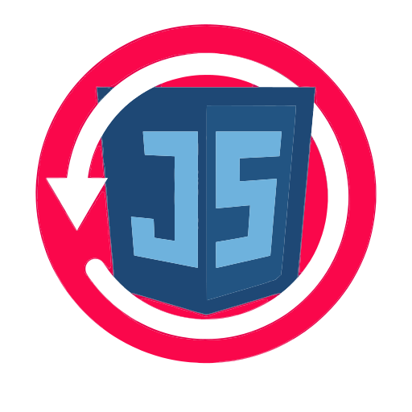

# IoBroker.script-restore
**Tests:** 

## Script-restore-Adapter für ioBroker
Durchsuchen und Wiederherstellen einzelner Skripte aus ioBroker-Backup-Archiven – ohne das gesamte Backup wiederherstellen zu müssen.

## Beschreibung
Der Skript-Wiederherstellungsadapter fügt der ioBroker-Administrationsoberfläche einen Tab hinzu, über den Sie Backup-Archive öffnen und alle darin enthaltenen JavaScript-, TypeScript-, Blockly- und Rules-Skripte durchsuchen können. Sie können den Quellcode jedes Skripts anzeigen und ihn einzeln herunterladen oder kopieren.

Das Archiv wird vollständig im Browser analysiert – während des Browsens werden keine Dateien auf die Festplatte geschrieben.

## Merkmale
- Durchsuchen Sie Backup-Archive direkt über die ioBroker-Admin-Registerkarte.
- Lokale Sicherungsdateien aus dem Sicherungsverzeichnis laden (Standard: `/opt/iobroker/backups`)
- Laden Sie Archivdateien direkt von Ihrem Computer hoch.
- Unterstützte Formate: `.tar.gz`, `.tar`, `.json`, `.jsonl`
- Baumansicht aller Skripte, nach Ordnern geordnet
- Skripte nach Typ filtern: JS, TypeScript, Blockly, Regeln
- Volltextsuche in Skriptnamen, Pfaden und Quellcode
- Quellcode anzeigen (JS/TS/Blockly/Regeln)
- Quellcode in die Zwischenablage kopieren oder als Datei herunterladen
- Vollständig browserbasiertes Parsen – kein Server-Roundtrip für Uploads
- **Skripte direkt in ioBroker wiederherstellen** mit einem konfigurierbaren Suffix (Standard: `_rcvr`) – vorhandene Skripte werden niemals überschrieben

## Konfiguration
| Einstellungen | Beschreibung | Standardwerte |
|---------|-------------|---------|
| Sicherungspfad | Verzeichnis, in dem die ioBroker-Sicherungsdateien gespeichert werden | `/opt/iobroker/backups` |

## Verwendung
### Laden einer lokalen Sicherungsdatei
1. Öffnen Sie den Tab **Script Restore** in der ioBroker-Administration.
2. Klicken Sie auf das Dropdown-Menü **Lokale Dateien**.
3. Wählen Sie eine Sicherungsdatei aus der Liste aus – Skripte werden automatisch geladen

### Hochladen einer Sicherungsdatei
1. Öffnen Sie den Tab **Script Restore** in der ioBroker-Administration.
2. Klicken Sie auf **Archiv hochladen** und wählen Sie eine Datei von Ihrem Computer aus.
3. Das Archiv wird im Browser analysiert und alle Skripte werden angezeigt.

### Skripte anzeigen und herunterladen
- Klicken Sie in der Baumstruktur auf ein Skript, um dessen Quellcode anzuzeigen.
- Verwenden Sie die Schaltfläche **Kopieren**, um den Quelltext in die Zwischenablage zu kopieren.
- Verwenden Sie die Schaltfläche **Herunterladen**, um das Skript als Datei zu speichern.

## Unterstützte Sicherungsformate
| Format | Beschreibung |
|--------|-------------|
| `.tar.gz` | Standard ioBroker-Backup (`iobroker_YYYY-MM-DD-HH-mm_SS_backupiobroker.tar.gz`) |
| `.json` | JavaScript-Adapter-Skriptexport |
| `.jsonl` | ioBroker-Objekte exportieren (JSON-Zeilen) |
| `.jsonl` | ioBroker-Objekte exportieren (JSON-Zeilen) |

## Changelog

<!--
	Placeholder for the next version (at the beginning of the line):
	### **WORK IN PROGRESS**
-->
### 0.1.0 (2026-05-13)
* (ipod86) drop Node.js 20 support (EOL 2026-04-30), require >= 22
* (ipod86) fix: move @iobroker/types to production dependencies to fix CI integration test
* (ipod86) add .npmrc with legacy-peer-deps to resolve peer dependency conflicts
* (ipod86) update dependencies: webdav, basic-ftp, typescript, @types/node, @iobroker/eslint-config

### 0.0.12 (2026-04-30)
* (ipod86) add common.singleton to prevent multiple instances
* (ipod86) complete i18n translations for all supported languages (fr, es, it, nl, pl, pt, ru, uk, zh-cn)

### 0.0.11 (2026-04-13)
* (ipod86) add type filter (JS/TS/Blockly/Rules) in script sidebar
* (ipod86) add direct restore into ioBroker with suffix input and confirm modal
* (ipod86) remove obsolete admin/words.js and .prettierignore

### 0.0.10 (2026-04-08)
* (ipod86) fix jsonConfig responsive sizes lg/xl for backupPath (E5509)
* (ipod86) trim news entries to 7 (W1032)
* (ipod86) add Dependabot npm cooldown of 7 days (W8915)

### 0.0.9 (2026-04-08)
* (ipod86) fix jsonConfig: add responsive size attributes (E5507)
* (ipod86) add i18n translation files (W5022)
* (ipod86) remove outdated index_m.html and style.css (W5047)
* (ipod86) remove invalid copyToField attribute (W5512)

## License
MIT License

Copyright (c) 2026 ipod86 <david@graef.email>

Permission is hereby granted, free of charge, to any person obtaining a copy
of this software and associated documentation files (the "Software"), to deal
in the Software without restriction, including without limitation the rights
to use, copy, modify, merge, publish, distribute, sublicense, and/or sell
copies of the Software, and to permit persons to whom the Software is
furnished to do so, subject to the following conditions:

The above copyright notice and this permission notice shall be included in all
copies or substantial portions of the Software.

THE SOFTWARE IS PROVIDED "AS IS", WITHOUT WARRANTY OF ANY KIND, EXPRESS OR
IMPLIED, INCLUDING BUT NOT LIMITED TO THE WARRANTIES OF MERCHANTABILITY,
FITNESS FOR A PARTICULAR PURPOSE AND NONINFRINGEMENT. IN NO EVENT SHALL THE
AUTHORS OR COPYRIGHT HOLDERS BE LIABLE FOR ANY CLAIM, DAMAGES OR OTHER
LIABILITY, WHETHER IN AN ACTION OF CONTRACT, TORT OR OTHERWISE, ARISING FROM,
OUT OF OR IN CONNECTION WITH THE SOFTWARE OR THE USE OR OTHER DEALINGS IN THE
SOFTWARE.