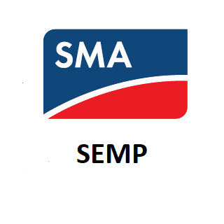

# ioBroker.semp

**Dieser Adapter nutzt die Sentry-Bibliotheken, um Ausnahmen und Codefehler automatisch an die Entwickler zu melden.** Weitere Details und Informationen zum Deaktivieren der Fehlerberichterstattung finden Sie in [der Sentry-Plugin-Dokumentation](https://github.com/ioBroker/plugin-sentry#plugin-sentry) ! Die Sentry-Berichterstattung wird ab js-controller 3.0 verwendet.

**Wenn es Ihnen gefällt, erwägen Sie bitte eine Spende:**

## SMA SEMP-Adapter für ioBroker

Schnittstelle zu SMA SunnyPortal über SunnyHomeManager und SEMP

Fügen Sie Ihre Geräte von ioBroker zu SunnyPortal hinzu. SunnyPortal kann so Ihren Energieverbrauch besser einschätzen und präzisere Prognosen und Empfehlungen erstellen. Sie können Ihre Geräte aber auch von SunnyPortal steuern lassen. Bei ausreichender Solarenergie schaltet SunnyPortal Ihre Geräte ein, bei zu geringer Energiezufuhr schaltet es sie wieder aus. So optimieren Sie Ihren Verbrauch, ohne auf die wenigen von SunnyPortal unterstützten Geräte angewiesen zu sein. Mit dem Adapter lässt sich jedes Gerät von ioBroker in SunnyPortal integrieren. Es ist nicht einmal notwendig, den Verbrauch eines einzelnen Geräts zu messen. Auch Schätzwerte genügen.

## Benutzerdokumentation

siehe [Dokument](/#/docs/adapterref/iobroker.semp/docu/docu_en.md)

Für Details zum Protokoll und zur Verwendung konsultieren Sie bitte [die SMA-Dokumentation](https://github.com/rg-engineering/ioBroker.semp/blob/master/docu/SMA/SEMP-11ZE3315-Specification-1.0.6.pdf) .

Eine Beschreibung zur allgemeinen Verwendung von Energieanfragen finden Sie in [der SMA-Dokumentation](https://github.com/rg-engineering/ioBroker.semp/blob/master/docu/SMA/SSH_KANN-Zeitfenster-TI-de-10.pdf) . (nur auf Deutsch verfügbar)

## Merkmale

- Geräte von ioBroker in SunnyPortal über SMA SEMP hinzufügen
- Informiert das SunnyPortal über den aktuellen Verbrauch
- Lassen Sie SunnyPortal diese Geräte steuern (einschalten, wenn genügend PV-Leistung vorhanden ist, und ausschalten, wenn nicht genügend Solarenergie vorhanden ist).

## Anforderungen

## Geschirrspülermodus: Funktionsweise des Adapters

Mit dem Adapter können Sie einen Geschirrspüler oder andere Geräte steuern, die im Standby-Modus Strom verbrauchen. Er funktioniert wie folgt:

- Der Benutzer schaltet das Gerät wie gewohnt manuell ein.
- Statt sofort zu starten, wird das Gerät ausgeschaltet und bleibt pausiert.
- Sobald genügend Solarenergie zur Verfügung steht, startet das Gerät automatisch und läuft, bis das Programm abgeschlossen ist.
- Etwaige Empfehlungen des Smart Home Managers (SHM), das Gerät auszuschalten, werden während dieses Vorgangs ignoriert.

> **Notiz:**\
> &#x20;Detaillierte Informationen zur technischen Umsetzung finden Sie in [Issue #333](https://github.com/rg-engineering/ioBroker.semp/issues/333) und im unten stehenden Flussdiagramm.

## bekannte Probleme

- Bitte erstellt Issues auf [GitHub](https://github.com/rg-engineering/ioBroker.semp/issues) , wenn ihr Fehler findet oder neue Funktionen wünscht.

## Changelog

<!--
  Placeholder for the next version (at the beginning of the line):
-->
### 2.1.0 (2026-09-08)
* (René) semp protocol verifaction added
* (René) added some additional verification checks for DeviceId and others 
* (copilot) Adapter requires node.js >= 22 now
* (René) dependencies updated

### 2.0.12 (2026-04-24)
* (René) bug fix for issue #451: device base ID is editable now

### 2.0.10 (2026-04-21)
* (René) bug fix for issue #445: planning requests corrected

### 2.0.9 (2026-04-13)
* (René) bug fix in admin, see issue #442: time settings in energy request corrected

### 2.0.8 (2026-04-12)
* (René) bug fix in admin, see issue #442: time settings in energy request corrected

[Older changelogs can be found there](https://github.com/rg-engineering/ioBroker.semp/blob/master/CHANGELOG_OLD.md)

## License
MIT License

Copyright (c) 2022-2026 René G. <info@rg-engineering.eu>

Permission is hereby granted, free of charge, to any person obtaining a copy
of this software and associated documentation files (the "Software"), to deal
in the Software without restriction, including without limitation the rights
to use, copy, modify, merge, publish, distribute, sublicense, and/or sell
copies of the Software, and to permit persons to whom the Software is
furnished to do so, subject to the following conditions:

The above copyright notice and this permission notice shall be included in all
copies or substantial portions of the Software.

THE SOFTWARE IS PROVIDED "AS IS", WITHOUT WARRANTY OF ANY KIND, EXPRESS OR
IMPLIED, INCLUDING BUT NOT LIMITED TO THE WARRANTIES OF MERCHANTABILITY,
FITNESS FOR A PARTICULAR PURPOSE AND NONINFRINGEMENT. IN NO EVENT SHALL THE
AUTHORS OR COPYRIGHT HOLDERS BE LIABLE FOR ANY CLAIM, DAMAGES OR OTHER
LIABILITY, WHETHER IN AN ACTION OF CONTRACT, TORT OR OTHERWISE, ARISING FROM,
OUT OF OR IN CONNECTION WITH THE SOFTWARE OR THE USE OR OTHER DEALINGS IN THE
SOFTWARE.