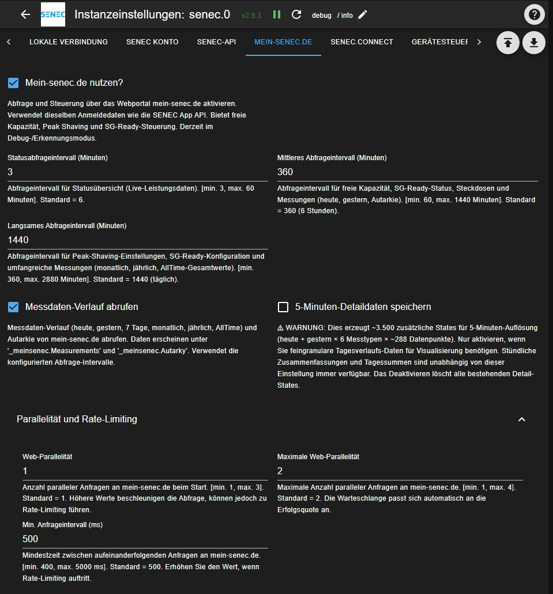
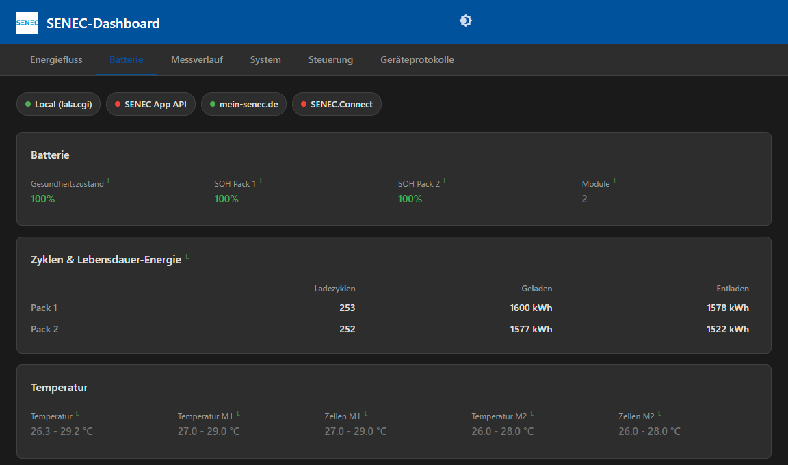
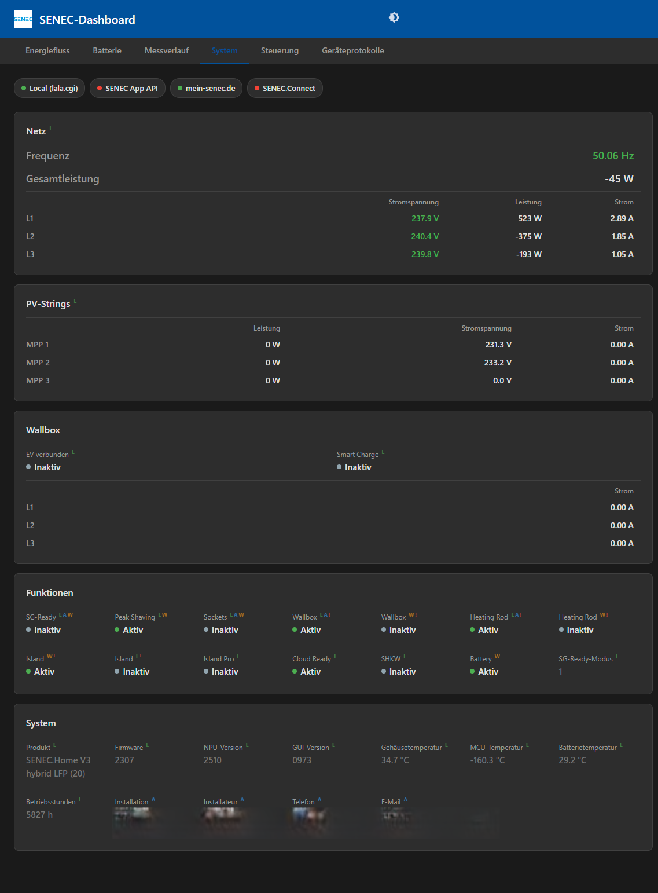
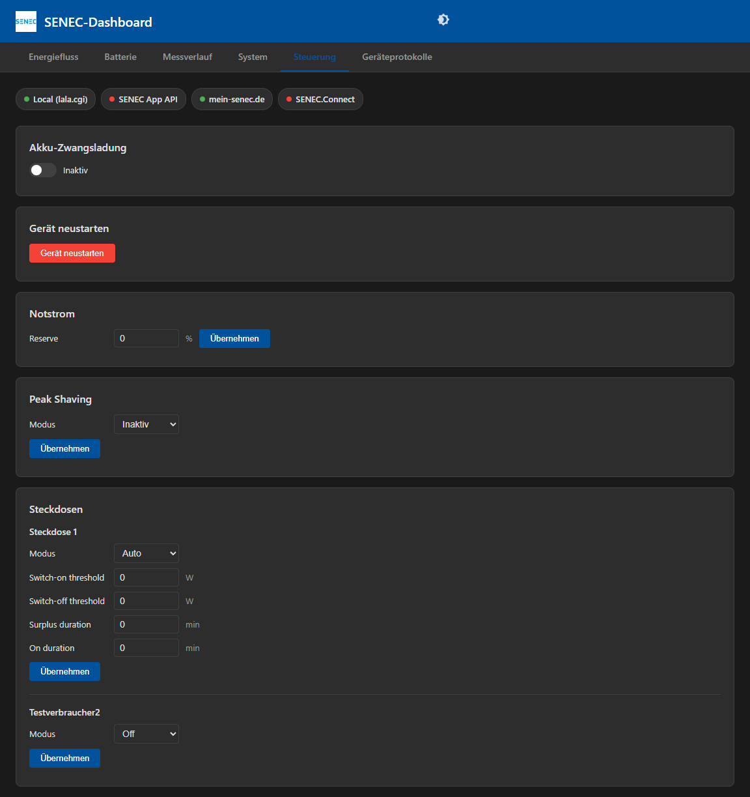

#  ioBroker.senec

## SENEC Adapter für ioBroker

Überwachen und steuern Sie Ihr SENEC Heimspeichersystem. Der Adapter unterstützt vier unabhängige Konnektoren, die einzeln oder kombiniert genutzt werden können:

- **Lokal** (lala.cgi) — Direkte LAN-Abfrage mit 10-Sekunden-Echtzeitdaten. Liefert vollständige BMS-Daten, Netzzähler, Wallbox-Daten und Gerätesteuerung.
- **SENEC App API** — Cloud-basierte Abfrage über die SENEC App API. Dashboard-Daten, Messverlauf, Systemdetails und Wallbox-Informationen.
- **mein-senec.de** — Web-Portal-Abfrage. Statusübersicht, Messverlauf, Autarkie, Notstrom, Peak Shaving, SG-Ready und Steuerung schaltbarer Steckdosen.
- **SENEC.Connect** — Azure-basierte API. Batterie- und Zählerdaten über Subscription-Key.

Es müssen nicht alle Konnektoren aktiviert werden. Wählen Sie je nach Bedarf — rein lokale Setups funktionieren ebenso wie reine Cloud-Konfigurationen für Systeme ohne lokales Webinterface.

### Unterstützte Systeme

Praktisch jedes SENEC-Speichersystem funktioniert: die Home-Reihe von den frühen Blei- und
Lithium-Modellen über V2, V2.1 und V3 bis zur aktuellen Generation V4 | P4 | E4, die
Business-Modelle sowie die Partnervarianten ADS Tec, OEM LG und Solarinvert.

Systeme mit lokalem Webinterface können alle vier Konnektoren nutzen. Systeme ohne — darunter die
V4-Generation — laufen über die SENEC App API, mein-senec.de und SENEC.Connect. Welche Datenpunkte
verfügbar sind, hängt vom Modell ab.

Die [vollständige Modellliste](../SUPPORTED_SYSTEMS.md) hilft beim Wiederfinden des eigenen Systems.

## Haftungsausschluss
**Alle Produkt- und Firmennamen oder -logos sind Warenzeichen™ oder eingetragene® Warenzeichen der jeweiligen Inhaber. Ihre Verwendung impliziert keine Zugehörigkeit oder Befürwortung durch diese oder zugehörige Tochtergesellschaften! Dieses persönliche Projekt wird in der Freizeit gepflegt und hat kein geschäftliches Ziel.**

**Keine Gewährleistung und keine Haftung.** Dieser Adapter ist ein Freizeitprojekt und wird wie besehen unter der MIT-Lizenz bereitgestellt. Er spricht mit einem teuren Gerät über Schnittstellen, die SENEC weder dokumentiert noch unterstützt, und er kann Befehle senden, die das Verhalten dieses Geräts verändern. Alles, was Sie damit tun, geschieht auf eigene Verantwortung. Der Autor haftet nicht für Schäden an Ihrer Anlage, für verlorene oder falsche Daten, entgangene Einspeisung oder sonstige Folgen der Nutzung — und kann Ihnen auch nicht sagen, ob die Nutzung Auswirkungen auf Gewährleistung oder Support durch SENEC oder Ihren Installateur hat. Wer das nicht akzeptieren möchte, sollte diesen Adapter nicht einsetzen.

## Voraussetzungen

- ioBroker mit Node.js >= 22
- SENEC Speichersystem im lokalen Netzwerk (für lokalen Konnektor)
- mein-senec.de Konto (für API- und Web-Konnektor)
- ioBroker.web Adapter installiert (für das integrierte Dashboard)

## Installation

Installieren Sie den Adapter über das ioBroker Adapter-Repository. Nach der Installation erstellen Sie eine Adapter-Instanz und konfigurieren mindestens einen Konnektor.

## Konfiguration

Die Adaptereinstellungen sind in Tabs organisiert — je einer pro Konnektor sowie allgemeine Einstellungen und Debug-Optionen.

### SENEC Konto

Geben Sie hier Ihre mein-senec.de Zugangsdaten ein. Diese werden von der SENEC App API und mein-senec.de gemeinsam genutzt. Hier lässt sich auch der User-Agent-Modus für ausgehende HTTP-Anfragen konfigurieren.

#### Zwei-Faktor-Authentifizierung (2FA)

Ist für das mein-senec.de-Konto eine Zwei-Faktor-Authentifizierung aktiv, kann sich der Adapter trotzdem selbstständig anmelden — es muss niemand danebensitzen und einen Code eintippen.

Bei der Einrichtung wird ein QR-Code für die Authenticator-App angezeigt und daneben dasselbe Geheimnis als Text. Dieser Text gehört in das Feld **TOTP-Secret**. Notieren Sie ihn, solange die Einrichtungsseite offen ist: Nach dem Aktivieren wird das Geheimnis nicht erneut angezeigt, ein neues gibt es nur durch erneutes Einrichten. Leer- und Bindestriche darin spielen keine Rolle.

Gemeint ist das dauerhafte Geheimnis, nicht der sechsstellige Code aus der App — der wechselt alle dreißig Sekunden und wäre längst abgelaufen, bevor der Adapter ihn verwenden könnte.

Ein Geheimnis genügt für beide Cloud-Konnektoren, da sich beide am selben Konto anmelden. Fehlt der Eintrag, obwohl 2FA verlangt wird, weist der Adapter im Log ausdrücklich darauf hin, statt nur einen fehlgeschlagenen Login zu melden.

### Lokale Verbindung (lala.cgi)

| Einstellung | Beschreibung | Standard |
|-------------|-------------|----------|
| Über lala.cgi verbinden | Lokale Abfrage aktivieren | Ein |
| SENEC System IP | IP-Adresse oder FQDN des SENEC Geräts | — |
| HTTPS verwenden | Aktivieren wenn das Gerät HTTPS nutzt | Aus |

**Abfrage-Einstellungen** aufklappen für Timing-Optionen:

| Einstellung | Beschreibung | Standard |
|-------------|-------------|----------|
| Abfrageintervall (hohe Priorität) | Intervall für Echtzeitdaten (Sekunden) | 10 |
| Abfrageintervall (niedrige Priorität) | Intervall für selten geänderte Daten (Minuten) | 60 |
| Abfrage-Timeout | Zeitlimit für HTTP-Anfragen (ms) | 5000 |

Der Adapter wiederholt automatisch mit exponentiellem Backoff bei Verbindungsfehlern — keine manuelle Konfiguration nötig. Wenn das SENEC Gerät vorübergehend nicht erreichbar ist (Neustart, Firmware-Update), wird die Abfrage automatisch fortgesetzt, sobald das Gerät wieder online ist.

#### TLS-Zertifikatsvalidierung

Der Adapter validiert das HTTPS-Zertifikat des SENEC Geräts mit einem mehrstufigen Verfahren:

1. **Benutzer-CA** — Laden Sie das SenecGui-Root CA-Zertifikat über das Dashboard hoch (System-Tab → TLS-Zertifikat). Herunterladen von mein-senec.de (Dokumente / Allgemeine Dokumente / SenecGui-Root), dann die .pem- oder .zip-Datei hochladen. SENEC verteilt dieses Zertifikat hinter einem Login, daher kann der Adapter es nicht mitliefern.
2. **Zwischengespeichertes CA-Zertifikat** — Falls kein Benutzer-Zertifikat vorhanden ist, kann der Adapter das CA-Zertifikat automatisch von mein-senec.de herunterladen (setzt voraus, dass der mein-senec.de-Connector aktiviert ist). Das heruntergeladene Zertifikat wird im Adapter-State gespeichert und bleibt über Neustarts erhalten.
3. **TOFU (Trust On First Use)** — Falls kein CA-Zertifikat validiert, merkt sich der Adapter den Fingerabdruck des Gerätezertifikats beim ersten Kontakt und vergleicht jede weitere Verbindung damit. Bei einer Änderung (z.B. nach einem Firmware-Update) wird eine Warnung protokolliert und der neue Fingerabdruck anschließend automatisch übernommen.

Der Adapter probiert jede Stufe der Reihe nach und verwendet die erste, die validiert.

TOFU ist eine Kontinuitätsprüfung, kein Certificate Pinning: Es meldet Ihnen, dass sich das Zertifikat des Geräts geändert hat, weist das neue aber nicht zurück und prüft auch die Zertifikatskette nicht. Das ist eine bewusste Abwägung für ein Gerät im eigenen Netz — eine legitime Zertifikatsänderung darf den Adapter nicht so lange abkoppeln, bis jemand eine Logzeile bemerkt. Für die vollständige Prüfung hinterlegen Sie die CA: Der Upload ist optional, aber die stärkere Variante.

Falls der automatische CA-Download fehlgeschlagen ist und Sie es erneut versuchen möchten, setzen Sie `_local.tls.certFetchFailed` auf `false` — der Adapter versucht den Download beim nächsten Neustart oder sofort, falls er läuft.

**Wichtig**: Zu häufige Abfragen oder zu viele Datenpunkte können das SENEC Gerät überlasten. Dies kann zu Neustarts, Nicht-Erreichbarkeit oder fehlender Cloud-Synchronisation führen. Bei Problemen die Abfragefrequenz reduzieren oder den Adapter stoppen.

#### Zusätzliche HighPrio-Polling-Datenpunkte

Sie können zusätzliche Datenbereiche (z.B. BMS, PV1, WALLBOX) zum hochprioritären Polling hinzufügen. Dies erfordert die Bestätigung eines Haftungsausschlusses. Es sind nur Zeichen A-Z, Ziffern 0-9 und Kommas erlaubt.

### SENEC App API

| Einstellung | Beschreibung | Standard |
|-------------|-------------|----------|
| SENEC App API nutzen | Cloud-API-Abfrage aktivieren | Aus |
| Dashboard-Intervall | Abfrageintervall für Dashboard/aktuelle Daten (Minuten) | 6 |
| Detail-Intervall | Abfrageintervall für Tagesmesswerte (Minuten) | 60 |
| Heavy-Intervall | Abfrageintervall für Monats-/Jahresmesswerte (Minuten) | 1440 (24h) |
| Parallelität / Max. Parallelität | Limits für parallele API-Anfragen | 1 / 1 |
| Min. Anfrageintervall | Mindestzeit zwischen API-Anfragen (ms) | 400 |
| Zeitlimit für API-Anfragen | Wie lange auf eine normale API-Anfrage gewartet wird — Dashboard, Systemstatus, Details (ms). Erhöhen, wenn diese Abfragen im Log in Timeouts laufen | 30000 |
| Zeitlimit für Messwertabfragen | Wie lange auf eine Messwert-Aggregation gewartet wird (ms). Erhöhen, wenn im Log Heavy-Polls in Timeouts laufen | 60000 |

#### History Rebuild

Der API-Konnektor kann historische Messdaten (AllTime-Summen) komplett neu aufbauen. Konfigurieren Sie bei Bedarf den Rebuild-Modus und das Startjahr. Dies läuft als Hintergrundprozess während des Heavy-Polling-Zyklus.

### mein-senec.de

| Einstellung | Beschreibung | Standard |
|-------------|-------------|----------|
| mein-senec.de nutzen | Web-Portal-Abfrage aktivieren | Aus |
| Status-Intervall | Abfrageintervall für Statusdaten (Minuten) | 6 |
| Medium-Intervall | Abfrageintervall für Gestern/Autarkie/Reservekapazität (Minuten) | 360 (6h) |
| Slow-Intervall | Abfrageintervall für Monats-/Jahres-/AllTime-Daten (Minuten) | 1440 (24h) |
| Messverlauf abfragen | Messdatenabfrage aktivieren | Aus |
| 5-Min-Detaildaten einbeziehen | Feingranulare Detaildaten abfragen (~3.500 zusätzliche States) | Aus |
| Parallelität / Max. Parallelität | Limits für parallele Anfragen | 1 / 2 |
| Min. Anfrageintervall | Mindestzeit zwischen Anfragen (ms) | 500 |

### Weitere Anlagen des Kontos

Sind dem mein-senec.de-Konto mehrere Anlagen zugeordnet — ein ersetztes Gerät bleibt neben seinem Nachfolger sichtbar —, erkennt der Adapter beim Start alle und legt jede unter `_meinsenec.Plants.{steuereinheitnummer}.` an.

Abgefragt wird standardmäßig nur die erste Anlage. Jede weitere erhält einen eigenen Schalter unter `control.Plants.{steuereinheitnummer}.poll`, der zunächst aus ist. Wird er gesetzt, nimmt die langsame Abfrage-Ebene diese Anlage mit auf und füllt dieselbe Messwertstruktur wie bei der Hauptanlage:

| State | Inhalt |
|-------|--------|
| `_meinsenec.Plants.{sn}.System.*` | Produktname, Gerätenummer, Anlagennummer |
| `_meinsenec.Plants.{sn}.Measurements.Daily.today` / `.yesterday` | Stundenwerte |
| `_meinsenec.Plants.{sn}.Measurements.Monthly.*` | Tageswerte je Monat |
| `_meinsenec.Plants.{sn}.Measurements.Yearly.*` | Monatswerte je Jahr |
| `_meinsenec.Plants.{sn}.Measurements.AllTime.*` | Gesamtsummen |
| `_meinsenec.Plants.{sn}.Autarky.*` | Autarkie je Zeitraum |

Die Gesamtsummen werden einmal beim ersten Erkennen einer Anlage geholt, auch bei ausgeschaltetem Schalter — so liegen die Endwerte eines stillgelegten Geräts vor, ohne es dauerhaft abzufragen.

Beachten Sie, dass jede zusätzlich aktivierte Anlage die Anzahl der Portal-Anfragen erhöht. Wer nur die historischen Summen eines Altgeräts braucht, lässt den Schalter am besten aus.

### SENEC.Connect

| Einstellung | Beschreibung | Standard |
|-------------|-------------|----------|
| SENEC.Connect nutzen | Azure-API-Abfrage aktivieren | Aus |
| Abfrageintervall | Abfragefrequenz (Sekunden) | 300 |
| Anfrage-Timeout | Wartezeit auf eine Antwort (ms) | 30000 |
| Subscription Key | Azure API Subscription Key | — |
| Enthaltene Bereiche | Welche Datenbereiche abgefragt werden | battery,meter,evse,bessNameplate |

### Externe Quellen

Fügen Sie externe Energiequellen aus anderen ioBroker-Adaptern hinzu — z.B. Balkon-PV, zusätzliche Wechselrichter, eigenständige Wallboxen, Wärmepumpen oder externe Batteriespeicher. Werte werden auf Watt normalisiert und im Dashboard-Energieflussdiagramm und der Live-Leistungskurve angezeigt.

Verwenden Sie die **State-ID Suche** um die State-ID des gewünschten Datenpunkts zu finden und fügen Sie sie in die Tabelle ein.

| Spalte | Beschreibung |
|--------|-------------|
| State-ID / Formel | Einzelne State-ID (z.B. `solar.0.power`) oder Formel mit `{stateId}`-Referenzen (z.B. `{wallbox.0.l1_amps} * {wallbox.0.l1_volts}`) |
| Typ | PV, Verbraucher (Wallbox, Wärmepumpe, etc.) oder Batterie |
| Einheit | W oder kW — wird auf den Endwert angewendet |
| Modus | **Integrieren** = zum SENEC-Gesamtwert addieren (ein Knoten). **Separat** = als eigener Knoten im Energiefluss anzeigen |
| SOC-State | (Nur Batterie) State-ID für den Ladezustand (%) |
| Kapazität | (Nur Batterie) Batteriekapazität in kWh — ermöglicht Zeitschätzungen |
| Bezeichnung | Anzeigename im Energieflussdiagramm |

Formeln unterstützen `+ - * / ( )` Operatoren. State-IDs ohne geschweifte Klammern werden automatisch erkannt wenn sie Rechenoperatoren enthalten. Für komplexe Formeln ist ein Dashboard-basierter Konfigurator mit interaktiver State-Auswahl geplant.

### Gerätesteuerung

Steuerungsfunktionen ermöglichen das Ändern von Einstellungen am SENEC Gerät. Jede Steuerung ist über bestimmte Konnektoren verfügbar:

| Steuerung | Lokal | API | Web |
|-----------|:-----:|:---:|:---:|
| Akku-Zwangsladung | x | | |
| Entladung blockieren | x | | |
| Gerät neustarten | x | | |
| Notstromreserve | | | x |
| Peak Shaving | | | x |
| SG-Ready | | | x |
| Schaltbare Steckdosen | x | | x |
| Wallbox-Steuerung | x | x | |

**Nutzung auf eigenes Risiko.** Steuerungsfunktionen müssen in den Einstellungen explizit mit Haftungsausschluss aktiviert werden. Der Adapter schützt nicht vor widersprüchlichen Befehlen von mehreren Konnektoren.

### Debug & Logging

Konfigurierbar pro Konnektor (Lokal, API, mein-senec.de, Connect):

- **Polling im Info-Log anzeigen** — Zeigt Polling-Statusmeldungen im Info-Log statt nur im Debug-Log
- **Requests & Responses loggen** — Loggt HTTP-Details auf Debug-Ebene (kann sensible Daten enthalten)
- **Queue-Diagnose ins Info-Log** — Zeigt Queue-Statistiken im Info-Log (nur API + Web)
- **Diagnose in States schreiben** — Schreibt Queue-Daten in dedizierte ioBroker-States (nur API + Web)

#### Debug-Log erstellen

Die meisten Probleme lassen sich aus einem Log ablesen, und fast keines ohne.

1. Log-Level der Instanz auf **debug** setzen: ioBroker-Admin → Instanzen → senec-Instanz → Auswahlfeld für den Log-Level. `silly` gibt es auch, bringt aber selten mehr Erkenntnis und erzeugt sehr viel Rauschen.
2. Im Adapter-Tab **Debug & Protokollierung** für den betroffenen Konnektor *Anfragen & Antworten protokollieren* aktivieren. Diese Einstellung macht aus „eine Anfrage ist fehlgeschlagen" ein „diese URL hat mit diesem Status geantwortet".
3. Lange genug laufen lassen, damit das Problem mindestens einmal auftritt. Bei den langsamen Abfrage-Ebenen — Messwerte, Monats- oder Jahresdaten — kann das bedeuten, auf den nächsten Zyklus zu warten statt neu zu starten.
4. Das Log aus dem ioBroker-Log-Tab kopieren oder die Datei aus `/opt/iobroker/log/` verwenden.
5. Anschließend wieder auf **info** zurückstellen. Debug-Logging ist umfangreich und füllt über Wochen die Festplatte.

**Vor dem Weitergeben bitte durchsehen.** Die Anfrage-Protokollierung enthält URLs und Antworten, darin können Anlagen-ID, Anlagennummer und Seriennummer stehen. Passwörter sind nicht dabei, aber es sind Ihre Daten. Ersetzen Sie, was nicht öffentlich werden soll.

#### Fehler melden

Meldungen bitte über [GitHub](https://github.com/nobl/ioBroker.senec/issues). Was eine Meldung schnell bearbeitbar macht:

- **Welches System** — Modell und, falls bekannt, die Firmware-Version (`_local.FACTORY` und `_local.SYS_UPDATE` enthalten beides, sofern der lokale Konnektor läuft)
- **Welche Konnektoren** aktiv sind, denn dasselbe Symptom hat lokal und in der Cloud unterschiedliche Ursachen
- **Adapter- und ioBroker-Version** sowie die Node.js-Version
- **Was erwartet wurde und was stattdessen passiert ist** — „der Batteriestand fehlt" lässt sich bearbeiten, „geht nicht" erfordert erst eine Rückfrage
- **Der passende Log-Ausschnitt** auf Debug-Level, mit ein paar Zeilen vor und nach dem Fehler statt nur der Fehlerzeile

Vorab noch: Unplausible Werte stammen meist vom Gerät und nicht vom Adapter. Er reicht Werte weitgehend durch, eine im Dashboard falsch wirkende Temperatur oder ein falscher Ladezustand sieht deshalb in der Weboberfläche des Geräts in der Regel genauso falsch aus. Ein Blick dorthin klärt die Frage oft schon — und wenn nicht, ist genau dieser Vergleich die nützlichste Angabe in der Meldung.

## Integriertes Dashboard

Der Adapter enthält ein vollständiges Web-Dashboard, erreichbar unter `http://<iobroker-ip>:8082/senec/`. Es benötigt den ioBroker.web Adapter und erscheint auf der ioBroker.web Startseite.

Funktionen:
- Dunkles und helles Design (umschaltbar in der Titelleiste)
- Internationalisierung — 11 Sprachen, folgt der Browser-Spracheinstellung
- Echtzeit-Updates über socket.io State-Subscriptions
- Daten von allen Konnektoren mit Quell-Badges
- Tastaturzugänglich (Tab-Navigation, ARIA-Labels)

### Übersicht-Tab

**Energiefluss-Diagramm** — Live-SVG-Visualisierung der Energieflüsse zwischen PV, Batterie, Netz, Haus und Wallbox. Animierte Flusspfade mit leistungsproportionaler Dicke. Batterie-SOC-Anzeige mit Füllstand. Betriebsmodus-Badge. Zeitschätzungen (bis leer/voll). Periodensummen (Heute/Monat/Jahr) mit Autarkie-Prozent. Datenquellen-Auswahl (Auto/Lokal/API/Web).

**Live-Leistungskurve** — Echtzeit-Liniendiagramm der Leistung über die Zeit für alle fünf Messwerte (PV, Haus, Netz, Batterie, Wallbox). Glatte monotone kubische Interpolation zwischen Datenpunkten. Zeitfenster-Voreinstellungen von 10 Minuten bis 24 Stunden, plus Mausrad-Zoom (5min–30 Tage, heruntergesampelt für Performance). Ziehen zum Blättern durch die Historie mit Lazy-Loading und Mitternachts-Datumsmarkern. Einzelne Linien ein-/ausblendbar, inklusive einer optionalen Ladezustandslinie (standardmäßig aus) auf einer eigenen rechten 0–100-%-Achse. Pause-/Deaktivierungsschalter. „Live"-Button zum Zurückspringen zur Echtzeit. Bei aktiviertem History-Adapter (InfluxDB, SQL oder History) auf den Leistungs-States wird das Diagramm beim Laden mit historischen Daten vorbefüllt. Jeder State wird einzeln aufgelöst — States können also von unterschiedlichen History-Adaptern aufgezeichnet werden, und ein nicht aufgezeichneter State betrifft nur seine eigene Linie. Der ⓘ-Button listet die States hinter jeder Linie zusammen mit dem aufzeichnenden History-Adapter auf — damit lässt sich nachvollziehen, warum eine Linie keine Vergangenheitsdaten hat.

**Ereignis-Timeline** — Kompakter 24-Stunden-Streifen mit heutigen Warnungen (orange), Fehlern (rot) und Panics (lila) aus dem Geräte-Log. Hover für Details. Automatische Aktualisierung alle 10 Minuten. Erfordert eine konfigurierte Geräte-IP.

### Batterie-Tab

- **Zustandsbericht (SOH)** — System- und pro-Pack-SOH mit farbkodierten Indikatoren (grün > 80%, orange > 60%, rot)
- **Modulstatus** — Anzahl aktiver/ladender/entladender Module
- **Ladezyklen** — Pro-Pack Zyklenanzahl und Lebensdauer-Energie (geladen/entladen)
- **Zellspannungs-Heatmap** — Farbkodiertes Raster der einzelnen Zellspannungen über alle Module. Rot = niedrigste, Grün = höchste. Pro-Modul-Delta-Indikatoren. Macht Zellimbalancen sofort sichtbar.
- **Temperaturen** — Gesamt, pro Modul und pro Zelle
- **Pack-Elektrik** — Pro-Pack Spannung und Strom

Daten aus Lokal (BMS) und/oder API (SystemDetails) mit Quell-Badges.

### Diagramme-Tab

Balkendiagramme für Energiemessdaten:
- **Heute** — Stundenbalken (automatisch auf Stunden mit Daten beschränkt)
- **Dieser Monat** — Tagesbalken
- **Dieses Jahr** — Monatsbalken

Funktionen:
- Einzelne Messtypen ein-/ausblendbar (PV, Verbrauch, Netzbezug/-einspeisung, Batterieladung/-entladung)
- Gestapelte Ansicht (Erzeugung vs. Verbrauch)
- Vergleichsmodus (Gestern, Vormonat, wählbares Jahr)
- Batteriestand (%) Linienoverlay. Der API-Konnektor liest ihn aus der Messwert-Historie. mein-senec.de bietet keine solche Historie, daher tastet der Web-Konnektor stattdessen den Live-Ladezustand ab: Stundenmittel für die Tagesansicht, Tagesmittel für die Monatsansicht. Diese Werte beginnen folglich erst mit dem Adapterbetrieb — für einen Tag, an dem der Adapter über Mitternacht nicht lief, existiert kein Tagesmittel, und es lässt sich auch nicht nachträglich abrufen. Die Jahresansicht hat beim Web-Konnektor keinen Batteriestand.
- Datenquellen-Auswahl (Auto/API/Web)
- Datentabelle
- PNG-Bildexport
- Auto-Update-Modus

### System-Tab

- **Netzqualität** — Frequenz, Gesamtleistung, pro-Phase Spannung/Leistung/Strom. Unterstützt EnFluRi 1 und EnFluRi 2 (automatische Erkennung).
- **PV-Strings** — Pro-Tracker MPP-Leistung, Spannung und Strom
- **Wallbox** — EV-Verbindungsstatus, Smart Charge, pro-Phase Ladestrom
- **Feature-Flags** — Aktive Funktionen pro Konnektor mit Abweichungserkennung
- **Systemdetails** — Produkt, Firmware, GUI/NPU-Version, Wechselrichter-Status, Temperaturen (Gehäuse, MCU, Batterie, Wechselrichter), Betriebsstunden, Installationsdatum, Installateurskontakt

Quell-Badges zeigen an, welcher Konnektor den jeweiligen Wert liefert.

### Steuerung-Tab

Interaktive Steuerung passend zu den Steuerungsfähigkeiten des Adapters:
- Akku-Zwangsladung (Schalter)
- Gerät neustarten (mit Bestätigungsdialog)
- Notstromreserve (Prozenteinstellung)
- Peak Shaving (modusabhängige Felder)
- SG-Ready (Aktivierung + Schwellwerte)
- Schaltbare Steckdosen (pro Steckdose Modus, Schwellwerte, Namensbearbeitung)
- Wallbox (Smart Charge, Stromgrenze)

Steuerungen prüfen die Konnektor-Verfügbarkeit und zeigen Warnungen wenn der benötigte Konnektor nicht aktiv ist. Die Übernehmen-Schaltfläche gibt "Gesendet"-Feedback.

### Statistik-Tab

mein-senec.de bietet einen wöchentlichen CSV-Export mit 5-Minuten-Auflösung, der Jahre zurückreicht — weit mehr Daten, als in ioBroker-States gehören. Daher wird nichts dauerhaft gespeichert: Der Adapter hält nur die einmal täglich aktualisierte Liste der verfügbaren Wochen vor und lädt eine einzelne Woche erst auf Anforderung. Die Daten bestehen nur, solange der Tab geöffnet ist.

- Anlagenauswahl, die auch frühere Geräte des Kontos aufführt (entfällt bei nur einer Anlage). Die von dieser Instanz abgefragte Anlage ist vorausgewählt.
- Wochenauswahl mit Datumsbereich je Woche
- Tagesfilter — grenzt eine Woche mit ~2.000 Zeilen auf einen Tag ein
- Auflösung — Stundenmittel oder 5-Minuten-Rohwerte
- Spaltenschalter für die zehn exportierten Spalten, inklusive Akkuspannung, -strom und -füllstand
- Sortierbare Spaltenköpfe; ein dritter Klick stellt die chronologische Reihenfolge wieder her
- Zusammenfassungszeile mit Minimum, Mittelwert und Maximum der angezeigten Zeilen
- Tabellen- oder Diagrammansicht; im Diagramm teilen sich die Leistungsspalten eine linke kW-Achse, Prozentwerte erhalten eine eigene rechte 0–100-%-Achse, und Lücken in einer Reihe unterbrechen die Linie, statt überbrückt zu werden
- Download der aktuellen Auswahl als CSV

Erfordert einen aktivierten und verbundenen mein-senec.de-Konnektor.

### Protokolle-Tab

Durchsuchen der SENEC Geräteprotokolle nach Datum:
- Filterbare Tabelle (Zeit, Stufe, Kategorie, Nachricht)
- Stufenfilter: Info, Warnung, Fehler, Panik
- Kategoriefilter (automatisch aus Logeinträgen befüllt)
- Freitextsuche
- Farbkodierte Zeilenhervorhebung nach Schweregrad
- Neueste Einträge zuerst
- Live-Modus — aktualisiert automatisch das heutige Log (UTC-berücksichtigt)
- Download der rohen Logdateien

Erfordert eine konfigurierte Geräte-IP (auch wenn der lokale Konnektor nicht aktiviert ist).

## State-Referenz

Der Adapter erstellt States, organisiert nach Konnektor und Datenbereich. Alle States sind schreibgeschützt, sofern nicht explizit als Steuerungs-States gekennzeichnet.

### Verbindung & Status (`info.*`)

| State | Beschreibung |
|-------|-------------|
| `info.connection` | Gesamtverbindungsstatus (true wenn ein Konnektor aktiv) |
| `info.connectionStatus` | Detaillierter Verbindungsstatus: `all` (alle konfigurierten Konnektoren verbunden), `partial` (teilweise verbunden), `none` |
| `info.localConnected` | Lokal (lala.cgi) Verbindungsstatus |
| `info.apiConnected` | SENEC App API Verbindungsstatus |
| `info.webConnected` | mein-senec.de Verbindungsstatus |
| `info.connectConnected` | SENEC.Connect Verbindungsstatus |
| `info.lastPoll.HighPrio` | Zeitstempel der letzten hochprioritären lokalen Abfrage |
| `info.lastPoll.LowPrio` | Zeitstempel der letzten niedrigprioritären lokalen Abfrage |

### TLS States (`_local.tls.*`)

| State | Typ | Schreiben | Beschreibung |
|-------|-----|:---------:|-------------|
| `_local.tls.mode` | string | nein | Aktiver TLS-Validierungsmodus: `user`, `cached`, `tofu` oder `none` |
| `_local.tls.fingerprint` | string | nein | SHA-256-Fingerabdruck des akzeptierten Gerätezertifikats (TOFU-Modus, verschlüsselt) |
| `_local.tls.userCaPem` | string | ja | Vom Benutzer hochgeladenes CA-Zertifikat (PEM, verschlüsselt) |
| `_local.tls.cachedCaPem` | string | nein | Von mein-senec.de heruntergeladenes CA-Zertifikat (PEM, verschlüsselt) |
| `_local.tls.certFetchFailed` | boolean | ja | Auf `false` setzen um einen neuen CA-Download-Versuch auszulösen |

### Lokale States

Daten aus der lala.cgi-Abfrage werden direkt unter dem Bereichsnamen gespeichert (z.B. `ENERGY.*`, `BMS.*`, `PV1.*`, `WIZARD.*`).

**Wichtige ENERGY-States:**

| State | Typ | Beschreibung |
|-------|-----|-------------|
| `ENERGY.GUI_INVERTER_POWER` | Zahl (W) | Aktuelle PV-Erzeugung |
| `ENERGY.GUI_BAT_DATA_POWER` | Zahl (W) | Batterieleistung (positiv = Laden, negativ = Entladen) |
| `ENERGY.GUI_GRID_POW` | Zahl (W) | Netzleistung (positiv = Bezug, negativ = Einspeisung) |
| `ENERGY.GUI_HOUSE_POW` | Zahl (W) | Aktueller Hausverbrauch |
| `ENERGY.GUI_BAT_DATA_FUEL_CHARGE` | Zahl (%) | Batterie-Ladezustand |
| `ENERGY.STAT_STATE` | Zahl | Betriebszustandscode |
| `ENERGY.STAT_STATE_Text` | Text | Betriebszustand in Klartext |
| `ENERGY.STAT_HOURS_OF_OPERATION` | Zahl (h) | Betriebsstunden |

**Wichtige BMS-States:**

| State | Typ | Beschreibung |
|-------|-----|-------------|
| `BMS.MODULE_COUNT` | Zahl | Anzahl der Batteriemodule |
| `BMS.SOH.{n}` | Zahl (%) | Gesundheitszustand pro Modul |
| `BMS.CYCLES.{n}` | Zahl | Ladezyklen pro Modul |
| `BMS.CELL_VOLTAGES_MODULE_{A-D}.{n}` | Zahl (mV) | Einzelne Zellspannungen |
| `BMS.TEMP_MIN.{n}` / `BMS.TEMP_MAX.{n}` | Zahl (°C) | Modul-Temperaturbereich |
| `BMS.VOLTAGE.{n}` / `BMS.CURRENT.{n}` | Zahl (V/A) | Pack-Spannung und -Strom |

### API-States (`_api.*`)

Cloud-API-Daten werden unter `_api.Anlagen.{systemId}.*` gespeichert:

- `Dashboard.currently.*` — Echtzeit-Leistungswerte (W)
- `Measurements.Daily.*` — Stündliche Messdaten (kWh)
- `Measurements.Monthly.*` — Tägliche Messdaten (kWh)
- `Measurements.Yearly.*` — Monatliche Messdaten (kWh)
- `Measurements.AllTime.*` — Lebensdauer-Summen (kWh)
- `SystemDetails.*` — Batteriedetails, Temperaturen, Firmware
- `SystemStatus.*` — Betriebszustand, Feature-Flags

### Web-States (`_meinsenec.*`)

mein-senec.de Daten werden unter `_meinsenec.*` gespeichert:

- `Status.*` — Aktuelle Leistungswerte (kW), Betriebszustand
- `Measurements.*` — Historische Messdaten (kWh)
- `Autarky.*` — Autarkie-Prozentsätze (Tag/Woche/Monat/Jahr/Gesamt)
- `EmergencyPower.*` — Notstromreserve-Einstellungen
- `PeakShaving.*` — Peak-Shaving-Konfiguration
- `SGReady.*` — SG-Ready-Einstellungen
- `Sockets.*` — States der schaltbaren Steckdosen

### Connect-States (`_connect.*`)

SENEC.Connect Daten werden unter `_connect.Systems.{system_id}.*` mit Batterie- und Zähler-Unterbereichen gespeichert. Ein Konto kann mehrere Systeme umfassen; jedes erhält einen eigenen Kanal, benannt nach seinem Modell und adressiert über die in `bessNameplate` gemeldete System-ID — dadurch behält ein System seine States auch dann, wenn die API die Systeme in anderer Reihenfolge zurückgibt. `_connect.info.systemCount` meldet, wie viele Systeme die API sieht.

Der Abschnitt `bessNameplate` wird unabhängig von den konfigurierten Abschnitten immer abgefragt, weil er diese ID enthält.

Wallboxen werden genauso abgelegt, unter der jeweils gemeldeten `id`: `_connect.Systems.{system_id}.evse.{wallbox_id}.*`. Verschwindet eine Wallbox aus der Antwort, werden ihre States entfernt, statt mit den letzten Werten stehen zu bleiben.

Meldet ein System keine `system_id`, wird stattdessen seine Seriennummer verwendet. Ein System wird über jede jemals gemeldete Kennung wiedererkannt — eine Antwort, in der eine davon fehlt, verschiebt das System also nicht auf einen neuen Pfad. Enthält eine Antwort überhaupt keine Kennung, greift für dieses System die Position in der Antwort, genau wie vor 2.15.0, und die Bereinigung wird währenddessen ausgesetzt.

States eines Systems, das die API nicht mehr meldet, werden entfernt. Adapter vor 2.15.0 nummerierten die Systeme nach ihrer Position in der Antwort (`_connect.Systems.0.*`); diese States werden beim ersten Poll nach dem Update gelöscht, sobald die Systeme identifiziert sind.

**Wer SENEC.Connect-States mit einem History-Adapter aufzeichnet** (History, InfluxDB, SQL): Diese Einstellung hängt am State selbst und geht mit dem alten State verloren. Die Aufzeichnung läuft nicht von allein weiter — bitte das Logging nach dem Update für die States unter den neuen Pfaden wieder einschalten.

### Externe States (`_external.*`)

Daten externer Quellen werden unter `_external.{typ}.{index}.*` gespeichert:

| State | Beschreibung |
|-------|-------------|
| `_external.pv.{n}.power` | Externe PV-Leistung (W) |
| `_external.consumer.{n}.power` | Externer Verbraucher (W) |
| `_external.battery.{n}.power` | Externe Batterieleistung (W, vorzeichenbehaftet) |
| `_external.battery.{n}.soc` | Externer Batterie-Ladezustand (%) |
| `_external.battery.{n}.capacity` | Externe Batterie-Kapazität (kWh) |
| `_external.{typ}.{n}.label` | Benutzerdefinierte Bezeichnung |
| `_external.{typ}.{n}.mode` | Anzeigemodus (integrate/separate) |
| `_external.{typ}.{n}.sourceId` | Fremde State-ID oder Formel |

### Steuerungs-States (`control.*`)

Schreibbare States zur Gerätesteuerung:

| State | Typ | Beschreibung |
|-------|-----|-------------|
| `control.ForceCharge` | Boolean | Akku-Zwangsladung ein/aus |
| `control.BlockDischarge` | Boolean | Entladung blockieren ein/aus |
| `control.RebootAppliance` | Boolean | Gerät neustarten auslösen |
| `control.EmergencyPower.ReserveInPercent` | Zahl | Notstromreserve (%) |
| `control.PeakShaving.*` | Diverse | Peak-Shaving-Einstellungen |
| `control.SGReady.*` | Diverse | SG-Ready-Einstellungen |
| `control.Sockets.{n}.*` | Diverse | Pro-Steckdose Steuerung |
| `control.Wallbox.{n}.*` | Diverse | Wallbox-Steuerung |

Steuerungs-States werden nur erstellt, wenn die entsprechende Funktion aktiviert und über den konfigurierten Konnektor verfügbar ist.

## Fehlerbehebung

**Gerät reagiert nicht / häufige Neustarts**: Reduzieren Sie das hochprioritäre Abfrageintervall oder entfernen Sie benutzerdefinierte HighPrio-Datenpunkte. Das SENEC Gerät hat begrenzte Ressourcen.

**Keine Daten von API/Web**: Prüfen Sie Ihre mein-senec.de Zugangsdaten im SENEC Konto Tab. Der Adapter protokolliert Authentifizierungsfehler auf Warnungsstufe.

**Dashboard lädt nicht**: Stellen Sie sicher, dass ioBroker.web auf Port 8082 läuft. Das Dashboard wird als Web-Extension unter `/senec/` bereitgestellt.

**Fehlende States**: Die verfügbaren States hängen von Ihrem SENEC Modell, der Firmware-Version und den konfigurierten Konnektoren ab. Nicht alle States sind auf allen Systemen verfügbar.

**Steuerungs-States erscheinen nicht**: Steuerungsfunktionen müssen in den Gerätesteuerungseinstellungen explizit aktiviert werden. Jede Steuerung erfordert einen bestimmten aktiven Konnektor.

**TLS-Zertifikatsfehler bei lokaler Verbindung**: Der Adapter übernimmt die Zertifikatsvalidierung automatisch. Prüfen Sie `_local.tls.mode` um zu sehen, welche Validierungsmethode aktiv ist. Wenn TOFU-Modus aktiv ist und Sie auf CA-Validierung upgraden möchten, aktivieren Sie den mein-senec.de-Connector — der Adapter versucht das CA-Zertifikat automatisch herunterzuladen. Falls ein früherer Download fehlgeschlagen ist, setzen Sie `_local.tls.certFetchFailed` auf `false` um es erneut zu versuchen.

## Hilfe und Austausch

Für Fragen, Konfigurationen und den Austausch mit anderen Nutzern gibt es einen [eigenen Thread im ioBroker-Forum](https://forum.iobroker.net/topic/30620/neuer-adapter-senec-home-adapter) — meist der schnellste Weg zu einer Antwort.

Sieht es nach einem Fehler aus, bitte ein Issue auf [GitHub](https://github.com/nobl/ioBroker.senec/issues) anlegen. Wie ein [Debug-Log erstellt](#debug-log-erstellen) wird und was eine [Meldung bearbeitbar macht](#fehler-melden), steht weiter oben.

## Changelog

<!--
  Placeholder for the next version (at the beginning of the line):
  ### **WORK IN PROGRESS**
-->
### 2.15.3 (2026-08-31)
- Fix: The SENEC App API login posted only the fields it fills in itself and did not send back the hidden fields the login form contains. A browser sends those back, and the SSO uses them to carry the state of a login across its steps, so an account whose login takes a route that depends on them could not get past the first step. Every field of the form is now returned with the values the adapter supplies on top. This applies to the two-factor step as well, where the form names which of several configured codes is being answered.
- Fix: The mein-senec.de login had the same gap and now sends the form's hidden fields back as well. Its login-page debug dump is redacted before it is written, which it previously was not.
- Change: A login step that fails now records the page the SSO answered with, without *Log requests and responses* having to be switched on beforehand. The instance log level still has to be `debug` or more verbose, and the adapter now checks that before it does the work — it previously prepared the page at every log level and then handed it to a call that discarded it. The one-line reason says which step failed but not what the SSO put in front of the adapter, which is where an unexpected login route shows itself, and by the time a report is written the login that produced it is gone, so it cannot be asked for afterwards. A login failing the same way on every retry writes the page once and afterwards only notes that it has not changed — the comparison now ignores the identifiers the SSO issues afresh for every attempt, which previously differed each time and defeated it.
- Change: More of a logged login page is masked. Login codes are masked as hidden form values as well as in query strings, the account's mail address is masked in its plain, percent-encoded and HTML-entity-encoded spellings, and a password echoed back inside a form value is masked. The pages are shortened before they reach the log.
- Change: The short error text taken from a rejected login page now goes through the same masking as the debug page dump. It is logged at `error` level, so it is visible at the default log level — a wider audience than the page dump reaches, and until now it was the less thoroughly redacted of the two.
- Change: With *Log requests and responses* switched on, the login form as it was served and the page after the username step are logged as well. These say nothing when a login works, so they stay behind the option.

### 2.15.2 (2026-08-28)
- Fix: A failing SENEC App API login reported nothing but `Request failed with status code 400` — neither which of the four requests of the login had failed nor what the SSO had said about it, which is all the information there is. Every step of the login now names itself and repeats the reason the SSO gave, so a login that fails on one account but not on others can be told apart from an outage.
- Fix: The request/response log (settings → SENEC App API → *Log requests and responses*) covered the data requests but not the login, so switching it on to investigate a login problem produced nothing about the login. It now logs each step of the SSO exchange as well, including where a redirect leads. Login codes are masked and neither credentials nor request bodies are ever written to the log.
- Change: A stored refresh token the SSO no longer accepts is an ordinary event — it happens whenever the session behind it has expired, and the full login that follows is the cure, not a symptom. It is no longer logged as a warning, so an ordinary re-login stops reading like a fault.
- Change: When the SSO ends the login somewhere other than the app itself — a further login step, or a refusal — the adapter now names the destination instead of reporting a missing authorization code.
- Dependency Updates

### 2.15.1 (2026-08-23)
- Dependency Updates

### 2.15.0 (2026-08-14)
- 🔎 **Wanted: testers for the SENEC.Connect connector.** I cannot see what your subscription returns, and real responses are what this connector is missing — especially from accounts holding more than one system, and from responses containing more than `battery` and `meter` (`evse`, `bessNameplate`). If SENEC.Connect reports anything at all for your account, please get in touch in the [ioBroker forum thread](https://forum.iobroker.net/topic/30620/neuer-adapter-senec-home-adapter) or via a [GitHub issue](https://github.com/nobl/ioBroker.senec/issues).
- **Breaking (SENEC.Connect only):** The systems of a SENEC.Connect account were stored by their position in the API response, as `_connect.Systems.0.*`, `_connect.Systems.1.*` and so on. The API does not promise an order, so on an account with more than one system that position can change from one poll to the next — two systems then swap their states inside the same history, with nothing in the values to show it happened. Each system is now stored under the system id from its `bessNameplate` section instead, for example `_connect.Systems.P4H1-1234567.*`, and gets a channel named after its model. A system is remembered by every identifier it has ever reported, so a response that omits one of them does not move it; a system that reports no identity at all keeps its old position-based path and is left alone. The old numbered states are deleted on the first poll after the update; scripts, charts and visualisations that refer to them have to be pointed at the new paths, and the history recorded under the old paths ends there. **If you log these states with a history adapter, that setting is stored on the state and does not survive the move — switch logging back on for the new paths, or recording stops silently.** Accounts with a single system are affected the same way, but nothing else changes for them.
- **Breaking (SENEC.Connect only):** Wallboxes are stored under the `id` they report rather than their position in the response, for the same reason and with the same consequence — `_connect.Systems.{system_id}.evse.{wallbox_id}.*`. A wallbox that disappears from the response now has its states removed instead of leaving them frozen at their last values, looking current.
- New: `_connect.info.systemCount` reports how many systems SENEC.Connect returns, and the states of a system the API stops reporting are removed.
- New: SENEC.Connect has its own request timeout, adjustable between 5 and 120 seconds and 30 seconds by default. It previously borrowed the local appliance's timeout, which is capped at ten seconds and is not even shown unless the local connection is switched on — so a slow cloud response failed every poll with no reachable setting to change.
- Fix: A SENEC.Connect reply that arrived with a success code but did not contain the expected data — an error page or a captive portal, for instance — left the connector reporting itself as connected indefinitely while nothing was being read.
- Fix: A SENEC.Connect polling interval outside the permitted range is corrected on start-up, as the other intervals already were. Only a value written directly into the instance settings could get there, but a negative one made the adapter poll a request-metered API in a tight loop.
- Fix: A SENEC.Connect request in progress is now cancelled when the adapter stops, instead of running on and writing during shutdown, and it identifies itself with the same user agent as the adapter's other requests.
- Fix: Clearing the SENEC.Connect section list in the settings fell back to fewer sections than the field's own default, silently dropping wallbox data.
- Change: The `bessNameplate` section is now always requested from SENEC.Connect regardless of the configured sections, because it carries the id the states are stored under. The API is billed per request, not per section, so this costs nothing.
- Fix: When mein-senec.de measurement detail states were cleared at the daily rollover and written again in the same cycle, they came back as bare values — the name, unit and role were gone, because the adapter still believed the deleted definitions existed.
- Fix: On appliances not set to German, `ENERGY.STAT_STATE_Text` was never created at all. It puts the numeric system state into plain language — "Laden", "Akku voll", "Fernabschaltung" — but the English and Italian tables were stored under a name the adapter never looked them up by, so nothing was written and no error appeared. English is also what the adapter falls back to when it cannot read the appliance's language, so this affected most installations. The state now appears; on an affected system it shows up as a new datapoint after the update. `FACTORY.COUNTRY_Text` was missing on Italian appliances for the same reason.
- Fix: System state 41 was labelled "Schlafmodus" / "Sleeping mode". The appliance itself calls it "Abschaltung Lithium" / "Lithium shutdown", which is a different condition; the Italian text already said so. State 74 also carried a spelling mistake.
- New: Three more numeric datapoints are translated into text — `BMS.MANUFACTURER_Text` names the battery module generation (BMZ or Ampace / LFP), `PWR_UNIT.ENFLURI_Text` says which meter a power unit is measured by, and `CASC.STATE_Text` gives the cascade state.
- **Change: A datapoint your appliance does not have no longer gets a state, and an existing one says so.** The adapter asks every appliance for the same set of datapoints and no model provides all of them, so the answer "I do not have that one" is normal rather than a fault. Until now that answer was stored as the value, so the state read `VARIABLE_NOT_FOUND`. No state is created for it any more, and one that already exists is set to "not provided by appliance" so it is obvious at a glance instead of sitting there with a stale number that still looks current. Nothing is deleted, nothing is reported as a problem, and nothing is required of you. A datapoint that merely failed to be read this once is left untouched, because the real reading is expected back. A whole section your appliance does not have is handled the same way; it previously left behind a state called `<SECTION>.OBJECT_NOT_FOUND` holding nothing. This covers what the adapter asks for by name and the sections it requests — a field that quietly vanishes from a section still being provided cannot be detected this way, because the appliance simply omits it rather than saying anything about it.
- Fix: An unreadable datapoint could be published as a real-looking measurement. The appliance answers with a word where a number was expected, and that word slipped into the conversions for flags, factors, dates and IP addresses: a flag was stored as `true`, a scaled value as `NaN`, a timestamp as "Invalid Date" and an address as garbage. Nothing is stored for such an answer any more, so a state either holds a real reading or does not exist. A datapoint answering with an empty value no longer becomes `0` either, and a few value formats the appliance uses were decoded wrongly — text beginning with "u" could be read as a number, so a state could show 14 where the appliance had sent no reading at all.
- Change: `ENERGY.GUI_BAT_DATA_OA_CHARGING` is no longer polled every few seconds. A SENEC.Home V3 does not have it, it is absent from every field that appliance reports for this section, and the appliance's own web interface never asks for it. It remains defined, so an older appliance that still provides it keeps the state from the slower poll.
- Fix: The appliance's display language was read once at start-up, in a race with the first poll of the datapoint that carries it. On a fresh installation the adapter could therefore stay on English for the whole session, and changing the language on the appliance never took effect until the adapter was restarted. It is now picked up as soon as the appliance reports it, and a language the adapter has no texts for falls back to English instead of silently leaving every translated state empty.
- Fix: A code that is not in a translation table was shown as "(unknown)", which discarded the very number needed to identify it. It now reads "(unknown 7)". If you see one, the number is worth reporting.
- Change: Translated `_Text` states are no longer marked writable — writing to them never did anything — and are declared as text rather than as a measurement. Existing ones are corrected on the first poll after the update.
- Fix: The operating-mode text on the web dashboard now comes from the appliance's own system state on English and Italian systems as well. It previously fell back to the cloud status text there, because the local text did not exist.
- Fix: Several labels in the English and Italian system-state lists were misspelled, one Italian entry contained a stray fragment of an untranslated string, and some Italian entries were missing their accents.
- Change: The adapter warns when the datapoints configured for high-priority polling make a request large enough to approach the size the appliance can still answer. Beyond that size the appliance replies with a truncated body, which used to surface only as a connection error.

### 2.14.2 (2026-08-13)
- Dependency updates

### [Former Updates](CHANGELOG_OLD.md)

## License
MIT License

Copyright (c) 2020-2026 Norbert Bluemle <github@bluemle.org>

Permission is hereby granted, free of charge, to any person obtaining a copy
of this software and associated documentation files (the "Software"), to deal
in the Software without restriction, including without limitation the rights
to use, copy, modify, merge, publish, distribute, sublicense, and/or sell
copies of the Software, and to permit persons to whom the Software is
furnished to do so, subject to the following conditions:

The above copyright notice and this permission notice shall be included in all
copies or substantial portions of the Software.

THE SOFTWARE IS PROVIDED "AS IS", WITHOUT WARRANTY OF ANY KIND, EXPRESS OR
IMPLIED, INCLUDING BUT NOT LIMITED TO THE WARRANTIES OF MERCHANTABILITY,
FITNESS FOR A PARTICULAR PURPOSE AND NONINFRINGEMENT. IN NO EVENT SHALL THE
AUTHORS OR COPYRIGHT HOLDERS BE LIABLE FOR ANY CLAIM, DAMAGES OR OTHER
LIABILITY, WHETHER IN AN ACTION OF CONTRACT, TORT OR OTHERWISE, ARISING FROM,
OUT OF OR IN CONNECTION WITH THE SOFTWARE OR THE USE OR OTHER DEALINGS IN THE
SOFTWARE.