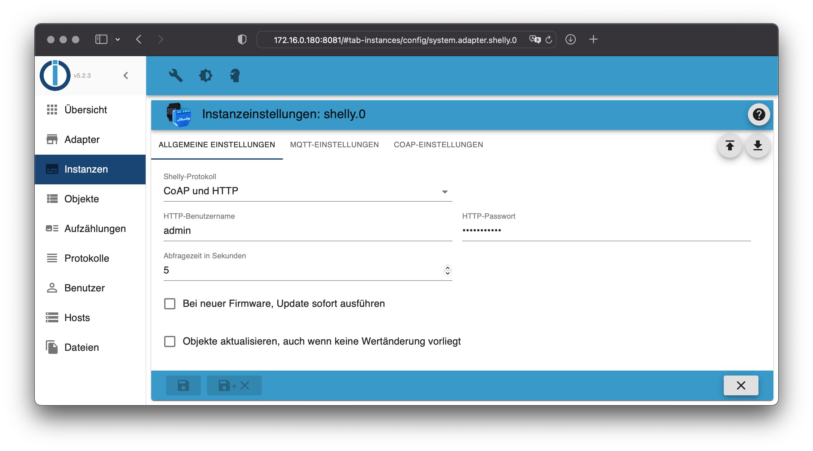

# ioBroker.shelly

This is the German documentation - [🇺🇸 English version](https://github.com/iobroker-community-adapters/ioBroker.shelly/blob/master/docs/en/README.md)

## Inhaltsverzeichnis

- [Devicemanager](/#/docs/adapterref/iobroker.shelly/devicemanager.md)
- [MQTT Protokoll](/#/docs/adapterref/iobroker.shelly/protocol-mqtt.md)
- [CoAP/CoIoT Protokoll](/#/docs/adapterref/iobroker.shelly/protocol-coap.md)
- [BLE Geräte](/#/docs/adapterref/iobroker.shelly/ble-devices.md)
- [Geschützter Login](/#/docs/adapterref/iobroker.shelly/restricted-login.md)
- [Zustandsänderungen](/#/docs/adapterref/iobroker.shelly/state-changes.md)
- [Debug](/#/docs/adapterref/iobroker.shelly/debug.md)
- [FAQ](/#/docs/adapterref/iobroker.shelly/faq.md)

## Anforderungen

1. Node.js 22 (oder neuer)
2. js-controller 7.2.2 (oder neuer)
3. Admin Adapter 8.0.11 (oder neuer)

## Geräte-Generationen

Für mehr Informationen, siehe [*unterstützte Geräte*](https://github.com/iobroker-community-adapters/ioBroker.shelly/blob/master/README.md#supported-devices).

- **Gen 1**: ESP8266 Geräte, [CoAP/CoIoT](/#/docs/adapterref/iobroker.shelly/protocol-coap.md) oder [MQTT](/#/docs/adapterref/iobroker.shelly/protocol-mqtt.md)
- **Gen 2+**: ESP32 Geräte, [MQTT](/#/docs/adapterref/iobroker.shelly/protocol-mqtt.md)

## Allgemein

Der Adapter kann über MQTT (empfohlen) oder CoAP/CoIoT mit den Geräten kommunizieren.

- Der Standard-Modus des Adapters ist MQTT (siehe [Dokumentation](/#/docs/adapterref/iobroker.shelly/protocol-mqtt.md) für mehr Informationen)
- CoAP/CoIoT ist ausschließlich mit Gen1 Geräten kompatibel!
- **Falls Gen2-Geräte integriert werden sollen, muss MQTT konfiguriert werden!**

Fragen? Schaue zuerst in die [FAQ](/#/docs/adapterref/iobroker.shelly/faq.md)!

## Features

- Der Adapter ist in den ioBroker Device Manager integriert. Weitere Informationen in der [Devicemanager-Dokumentation](/#/docs/adapterref/iobroker.shelly/devicemanager.md).

## Einschränkungen

- Der Shelly Adapter unterstützt keine Einbindung von Shellies unter Verwendung von NAT (z.B. viele VPNS und den Shelly Range Extender)

## Changelog

<!--
  Placeholder for the next version (at the beginning of the line):
  ### **WORK IN PROGRESS**
-->
### **WORK IN PROGRESS**
- (@GermanBluefox) Fixed that the adapter needlessly rewrote object definitions on every device update and reconnect, which caused repeated object change events and log spam in other adapters (e.g. valuetrackerovertime). [#1560]

### 12.0.0-alpha.4 (2026-09-09)
- (@mcm1957) **BREAKING:** Adapter requires js-controller >= 7.7.2 and admin >= 8.0.11 now.
- (@GermanBluefox) Added a new "Bluetooth map" tab to the adapter configuration which shows which Bluetooth devices are received by which Shelly gateway, including the signal strength. The gateways are arranged in a circle and each device is shown at the gateway which receives it best - all other connections and the signal values can be switched on.
- (@GermanBluefox) The device manager now updates the device list after renaming a device, after a firmware update and after installing the BLE gateway script - the cards showed outdated values before.
- (@GermanBluefox) The device tiles now show when a device was last seen, and a device which goes offline is marked as disconnected immediately instead of only after reloading the list.
- (@GermanBluefox) The BLE gateway script can now be installed and updated from the device manager - per device or for all devices which already have it installed. The installed script version is shown in the device details.
- (@GermanBluefox) The list of gateways which receive a Bluetooth device (state "receivedBy") now collects all gateways instead of showing only the receivers of the last message. A gateway which stops receiving a device is removed after one hour.
- (@GermanBluefox) Corrected wrong datapoint translations in all supported languages, e.g. current, voltage and apparent power.
- (@patricknitsch) Device Manager now automatically shows power values on the device tile, and voltage, current, energy and frequency in the device info, for any device that reports them.
- (@mcm1957) Added the missing translations for all datapoint names in all supported languages.
- (@mcm1957) Added tests to validate that all datapoint names and descriptions are translated and that all i18n language files are consistent.
- (@mcm1957) Added support for Shelly Duo Bulb E27 Gen 3 (shellyduobulbg3). [#1385]
- (@mcm1957) Added support for Shelly Multicolor Bulb E27 Gen 3 (shellycolorblbg3). [#1386]

### 12.0.0-alpha.2 (2026-08-19)
- (@mcm1957) The transition time can now be written for Shelly Dimmer1/Dimmer2 and for Gen2+ dimmers/lights (incl. Dimmer Gen3 and Dimmer Gen4). [#1214][#1224]
- (@mcm1957) Added support for Top AC Portable EV Charger (topacportableevcharger) - **EXPERIMENTAL ONLY** [#1401]
- (@mcm1957) Added support for Shelly Flood S Gen 4 (shellyfloodsg4). [#1380]
- (@mcm1957) Added monophase mode support for Shelly 3EM G3 (shelly3em63g3). [#1540]

### 12.0.0-alpha.1 (2026-08-19)
- (@GermanBluefox) Added option to ignore the timezone mismatch message (device timezone differs from the ioBroker host timezone).
- (@GermanBluefox) Fixed MQTT errors ("Cannot read properties of undefined") if a device closes the connection while it is still being initialized (e.g. battery powered devices).
- (@floze-the-genius) Corrected roles for Gen 2+ input states. [#1498]
- (@klein0r) Updated ble script (v1.4) for Shelly firmware > 2.0
- (@GermanBluefox) Codebase has been migrated to typescript.

### 11.0.0 (2026-07-03)
- (@klein0r) Updated ble script (v1.3) for Shelly firmware > 2.0
- (@GermanBluefox) Added firmware update available indicator for devices supporting this feature.
- (@copilot) Added Shelly Dimmer 0/1-10V PM Gen4 (shelly0110dimg4).
- (@copilot) Added HiluX DS8 by Shelly (hiluxds8)
- (@copilot) Added Shelly EM Gen4 (shellyemg4)
- (@mcm1957) Adapter requires node.js >= 22, js-controller >= 6.0.11 and admin >= 7.8.23 now.
- (@GermanBluefox) Device manager has been added providing info and control of devices and provisioning.
- (@mcm1957) IMPORTANT: Please read the changelog at README.md listing more information.

### 11.0.0 additional information 
- (@mcm1957) Added Shelly Presence Gen 4
- (@mcm1957) Added Shelly Cury
- (@GermanBluefox) Added support for Device manager: info and control of devices and provisioning
- (@GermanBluefox) Added detection of new devices in the background
- (@mcm1957) Some missing states added at an illuminance component
- (@mcm1957) DISABLE all PLUG_UI functionality due to unrecoverable HW faults.
- (@mcm1957) Dependencies have been updated

### 10.6.1 (2026-02-23)
- (HGlab01) OnUnload handling has been improved. [#1279]
- (@mcm1957) shellypill: missing input 202 has been added, nonexisting analog input has been removed.

### 10.6.0 (2026-02-08)
* (@mcm1957) The-Pill-By-Shelly (shellypill) has been added. [#1232]
* (@mcm1957) Shelly EM mini Gen 4 (shellyemminimg4) and Plug M Gen 3 (shellyplugmg3) have been added. [#1327,#1332]
* (@mcm1957) Shelly BLU H&T Display ZB support for light attribute has been added. [#1230]
* (@mcm1957) Support for favorites for Gen 2+ devices with cover support has been added. [#1001]
* (@mcm1957) Power metering support has been added to RGB and RGBW components. [#1339]
* (@mcm1957) FrankEver Smart Watervalve (watervalve) has been added. [#1341]
* (@mcm1957) LinkedGo ST1820 (st1820) has been added. [#1257]
* (@mcm1957) Dependencies have been updated

[Older changelogs can be found there](CHANGELOG_OLD.md)

## License

The MIT License (MIT)

Copyright (c) 2026 iobroker-community-adapters <iobroker-community-adapters@gmx.de>  
Copyright (c) 2018-2025 Thorsten Stueben <thorsten@stueben.de>,
                        Apollon77 <iobroker@fischer-ka.de> and
                        Matthias Kleine <info@haus-automatisierung.com>

Permission is hereby granted, free of charge, to any person obtaining a copy
of this software and associated documentation files (the "Software"), to deal
in the Software without restriction, including without limitation the rights
to use, copy, modify, merge, publish, distribute, sublicense, and/or sell
copies of the Software, and to permit persons to whom the Software is
furnished to do so, subject to the following conditions:

The above copyright notice and this permission notice shall be included in
all copies or substantial portions of the Software.

THE SOFTWARE IS PROVIDED "AS IS", WITHOUT WARRANTY OF ANY KIND, EXPRESS OR
IMPLIED, INCLUDING BUT NOT LIMITED TO THE WARRANTIES OF MERCHANTABILITY,
FITNESS FOR A PARTICULAR PURPOSE AND NONINFRINGEMENT. IN NO EVENT SHALL THE
AUTHORS OR COPYRIGHT HOLDERS BE LIABLE FOR ANY CLAIM, DAMAGES OR OTHER
LIABILITY, WHETHER IN AN ACTION OF CONTRACT, TORT OR OTHERWISE, ARISING FROM,
OUT OF OR IN CONNECTION WITH THE SOFTWARE OR THE USE OR OTHER DEALINGS IN
THE SOFTWARE.