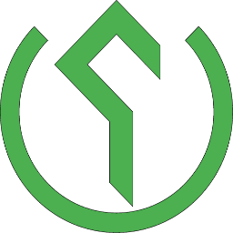

# ioBroker.shrdzm

**Allgemeine Informationen:**   **Version:**   **Tests:**   **Spende:** 

---

## Posten

**Dieser Adapter nutzt die Sentry-Bibliotheken, um Ausnahmen und Codefehler automatisch an die Entwickler zu melden.** Weitere Details und Informationen zum Deaktivieren der Fehlerberichterstattung finden Sie in [der Sentry-Plugin-Dokumentation](https://github.com/ioBroker/plugin-sentry#plugin-sentry) ! Die Sentry-Berichterstattung wird ab js-controller 3.0 verwendet.

---

## shrdzm-Adapter für ioBroker

Dieser Adapter integriert die von _SHRDZM IT Services eU_ bereitgestellte SHRDZM-Smartmeter-Schnittstelle in ioBroker. Eine Beschreibung der Schnittstelle finden Sie [hier](https://cms.shrdzm.com/produkt/smartmeter-modul/) .

Bitte beachten Sie, dass dieser Adapter in keiner Weise mit dem oben genannten Unternehmen in Verbindung steht und dass keinerlei Geschäftsbeziehung besteht.

## Dokumentation

Eine ausführliche Dokumentation ist in mehreren Sprachen verfügbar:

- **Englisch** : [doc/en/DOCUMENTATION\_en.md](/#/docs/adapterref/iobroker.shrdzm/doc/en/DOCUMENTATION_en.md)
- **Deutsch** : [doc/de/DOCUMENTATION\_de.md](https://github.com/mcm4iob/ioBroker.shrdzm/blob/main/doc/de/DOCUMENTATION_de.md)

---

## Haftungsausschluss

**Alle Produkt- und Firmennamen sowie Logos sind Marken™ oder eingetragene® Marken ihrer jeweiligen Inhaber. Ihre Verwendung impliziert weder eine Zugehörigkeit zu noch eine Unterstützung durch diese oder verbundene Tochtergesellschaften! Dieses private Projekt wird in der Freizeit betrieben und verfolgt keine geschäftlichen Ziele.**

---

## Konfiguration

Installieren und konfigurieren Sie Ihre SHRZDM-Schnittstelle gemäß der Dokumentation des Herstellers. Dieser Adapter stellt die Verbindung zur Schnittstelle über eine UDP-Verbindung (IPv4) her. Für die Inbetriebnahme sind folgende Schritte erforderlich:

- Installieren Sie den ioBroker-Adapter auf dem üblichen Weg.

- Öffnen Sie die ioBroker-AdminUI-Oberfläche, um den Adapter zu konfigurieren.

- Wählen Sie in der Admin-Oberfläche einen freien Port aus. Standardmäßig ist Port 9000 eingestellt, es kann aber jeder freie Port verwendet werden.

- SHRZDM-Konfigurationsoberfläche öffnen (über einen Webbrowser)

- Cloud-Konfiguration auswählen

- Geben Sie die IP-Adresse (nur IPv4) Ihres ioBroker-Hosts und die ausgewählte Portnummer in das Feld „Server“ ein.

- 'UDP senden' aktivieren

- Cloud-Einstellungen speichern

Das SHRDZM-Gerät sollte sofort mit dem Senden von Daten in dem auf der Seite „Einstellungen“ konfigurierten Intervall beginnen.

## Betrieb

Der Adapter erstellt Zustände für alle von allen Geräten empfangenen obos-Daten. Wenn Sie mehrere SHRZDM-Geräte installiert haben und die zulässigen Geräte einschränken möchten, können Sie in der Adapterkonfiguration eine Liste der zulässigen Geräte eingeben. Sind keine Geräte konfiguriert, werden Daten von allen Sendern akzeptiert.

## Häufig gestellte Fragen

#### Aktualisierungen erfolgen zu häufig

Die Live-Daten werden aktualisiert, sobald neue Daten vom SHRDZM-Gerät empfangen werden. Um die vom Gerät gesendete Datenmenge zu reduzieren, passen Sie den Intervallparameter auf der Einstellungsseite des Geräts an.

---

**Wenn Ihnen dieser Adapter gefällt, erwägen Sie bitte eine Spende:**

---

## Changelog
<!--
    Placeholder for the next version (at the beginning of the line):
    ### **WORK IN PROGRESS**
-->

### **WORK_IN_PROGRESS**

### 1.0.0 (2025-08-14)
* (mcm1957) Adapter requires node.js 20.x, js-controller 7.0.7 and admin 7.6.17 now.
* (mcm1957) Dependencies have been updated.

### 0.2.0 (2025-04-06)
* (mcm1957) Online indicator has been added to objectview.
* (mcm1957) Translations have been updated.
* (mcm1957) Descriptions have been added to all states and at adminUI.
* (mcm1957) Raw data received from devices can be stored for analyses now.
* (mcm1957) Adapter can handle multiple networks now. 
* (mcm1957) Dependencies have been updated.

### 0.1.1 (2025-03-17)
* (mcm1957) translations have been reviewed and fixed

### 0.1.0 (2025-03-15)
* (mcm1957) initial release

## License
MIT License

Copyright (c) 2025 mcm1957 <mcm57@gmx.at>

Permission is hereby granted, free of charge, to any person obtaining a copy
of this software and associated documentation files (the "Software"), to deal
in the Software without restriction, including without limitation the rights
to use, copy, modify, merge, publish, distribute, sublicense, and/or sell
copies of the Software, and to permit persons to whom the Software is
furnished to do so, subject to the following conditions:

The above copyright notice and this permission notice shall be included in all
copies or substantial portions of the Software.

THE SOFTWARE IS PROVIDED "AS IS", WITHOUT WARRANTY OF ANY KIND, EXPRESS OR
IMPLIED, INCLUDING BUT NOT LIMITED TO THE WARRANTIES OF MERCHANTABILITY,
FITNESS FOR A PARTICULAR PURPOSE AND NONINFRINGEMENT. IN NO EVENT SHALL THE
AUTHORS OR COPYRIGHT HOLDERS BE LIABLE FOR ANY CLAIM, DAMAGES OR OTHER
LIABILITY, WHETHER IN AN ACTION OF CONTRACT, TORT OR OTHERWISE, ARISING FROM,
OUT OF OR IN CONNECTION WITH THE SOFTWARE OR THE USE OR OTHER DEALINGS IN THE
SOFTWARE.