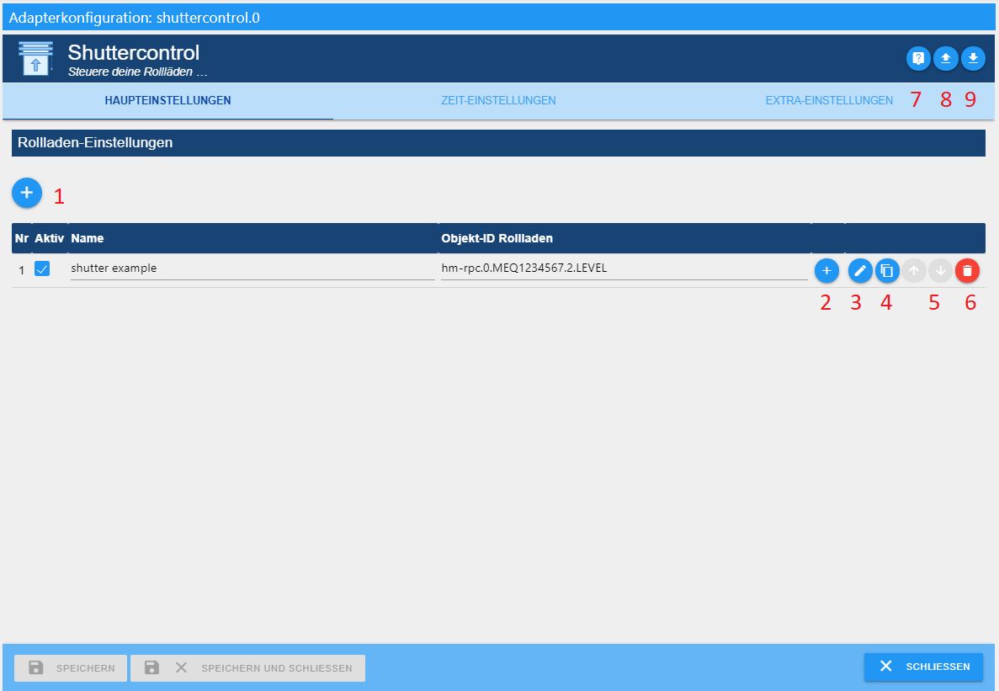
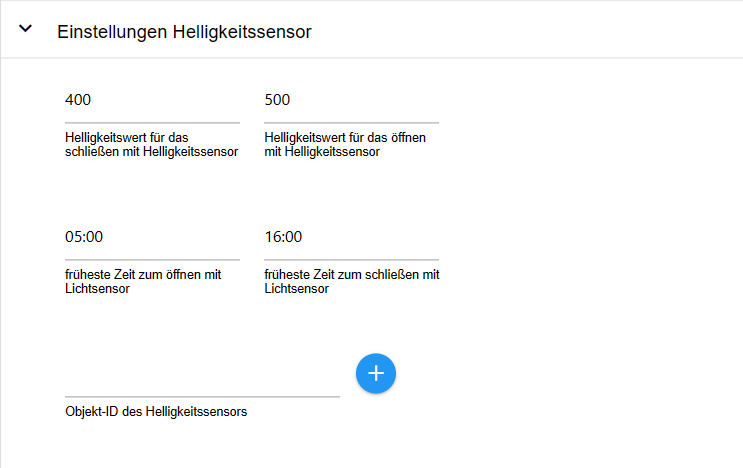

 

[](https://www.npmjs.com/package/iobroker.shuttercontrol)
[](https://www.npmjs.com/package/iobroker.shuttercontrol)
[](https://snyk.io/test/github/simatec/ioBroker.shuttercontrol)


[](https://github.com/simatec/ioBroker.shuttercontrol/blob/master/LICENSE)
[](https://paypal.me/mk1676)
[](https://github.com/sponsors/simatec)


**Wenn Ihnen der Adapter gefällt, denken Sie bitte über eine Spende nach:**
  
[](https://paypal.me/mk1676)


---


# Grundlegendes

>:grey_exclamation: Die Anleitung ist gültig ab Version stable 1.6.2 :grey_exclamation:

Shuttercontrol ist ein Adapter für eine sehr umfangreiche Steuerung von Rollläden,
Jalousien oder Markisen und umfasst sowohl die automatische Beschattung als auch
die nächtliche Verdunklung.

>:point_right: Der Einfachheit halber wird hier nur von Rollläden gesprochen.

Für die Steuerung stehen sehr viele einstellbare Parameter zur Verfügung, z.Bsp.:
* drei unterschiedlich globale Timer für z.B. Wohn-, Schlaf- und Kinderbereich,
* diverse Sonnenstandsabhängige Parameter die individuell je Rollladen eingestellt
werden können,
* Trigger für Tür-/Fenstersensoren die einem Aussperrschutz dienen oder ein automatisches
Öffnen zu einem individuellen Level bei Öffnen der Tür oder des Fensters dienen,
* verschiedene einstellbare Parameter für Beschattung in Abhängigkeit von z.B.
Innentemperatur, Außentemperatur, Helligkeit, Hitzesensor o.ä.,
* Einbeziehung des Sonnenstands um nur Räume zu verdunkeln, die tatsächlich beschienen
werden.

Alle Konfigurationsdatenpunkte sind bereits mit Beispielen voreingestellt, so dass
der Adapter nach Installation und Eingabe von den IDs der Rollladen Aktoren schnell
betriebsbereit ist.

Die weitere Konfiguration dient dann der Anpassung an persönliche Wünsche.

> Shuttercontrol kann Aktoren nur über die Position wie z.B. LEVEL mit Werten
von 0 bis 100 respektive 0-255 steuern. Das jeweilige Rollladen- oder Jalousietiming muss vom
Aktor übernommen werden. Jalousie Aktoren, welche je ein Objekt für "Höhe" und "Lamellenwinkel"
anbieten, können unter Verwendung von zwei Rollladenobjekten mit gleicher Parametrierung verwendet 
werden.


---


# Installation
Der Adapter befindet sich im "stable" Verwahrungsort von ioBroker. Im Reiter "Adapter" wird dann 
"shuttercontrol" ausgewählt und über (+) eine Instanz des Shuttercontrol-Adapters erzeugt.

# Konfiguration
Nach der Erstellung der Instanz öffnet sich automatisch das Konfigurationsfenster mit den 
Reitern HAUPTEINSTELLUNGEN, ZEIT-EINSTELLUNGEN und EXTRA-EINSTELLUNGEN.

>:point_right: Die Reiter [Zeit-Einstellungen][] und [Extra-Einstellungen][] sollten zuerst bearbeitet werden, 
also bevor Rollläden über den Bleistift in den HAUPTEINSTELLUNGEN hinzugefügt werden.


---


## HAUPTEINSTELLUNGEN



---
>:point_right: Über das Fragezeichen oben rechts (7), kann die Dokumentation auf github erreicht werden.

### Adapterkonfiguration sichern oder hochladen

Oben rechts kann mit klicken auf den Pfeil nach unten(9) die Adapterkonfiguration als .json Datei gesichert werden.  
Mit klicken auf den Pfeil nach oben (8) kann eine vorhandene Adapterkonfiguration im .json Format hochgeladen werden.


_[Zurück zum Anfang](#start-of-content)_


---


## ZEIT-EINSTELLUNGEN
Hier werden grundlegende Zeit- bzw. Astro Einstellungen vorgenommen, die später in
den [Rollladeneinstellungen][] für jeden Rollladen verwendet werden.

>:heavy_exclamation_mark: Shuttercontrol schließt Rollläden **Freitags** immer zur eingestellten Zeit vom **Wochenende**  
und **Sonntags** immer zur eingestellten Zeit der **Arbeitswoche** :heavy_exclamation_mark:


### Einstellungen für den Wohnbereich, Schlafbereich und Kinderbereich
Über Dropdown werden die einzelnen Einstellungen geöffnet. Die Beschreibung ist exemplarisch für den Wohnbereich beschrieben und gilt analog
für alle Bereiche.

>:point_right: Natürlich muss diese Kategorisierung nicht zwingend für einen Wohn-, Schlaf- oder
Kinderbereich genutzt werden, sondern ermöglicht drei Bereiche im Gebäude mit unterschiedlichen Fahrzeiten der Rollläden zu definieren.

**Art der Automatiksteuerung für den Wohnbereich**

über Pulldown wird gewählt zwischen:

* **Nur die Zeit Wohnbereich:**  
*Die Rollläden werden ausschließlich zeitgesteuert gefahren.*  

* **Zeit Wohnbereich mit Sonnenauf- & Sonnenuntergang:**  
*Die Rollläden werden nach Sonnenauf- und Sonnenuntergang gesteuert, jedoch fahren nicht  
vor der frühesten Zeit hoch und nicht nach der spätesten Zeit herunter.*  

* **Zeit Wohnbereich mit Golden Hour:**  
*Analog zu dem Sonnenauf- und Sonnenuntergang, jedoch mit dem Beginn und Ende der "Golden Hour" als Referenz*  

**Schließen der Rollläden in der Arbeitswoche:** *Übliche Zeit für die Verdunklung während der Woche*

**früheste Zeit für das hochfahren in der Woche:** *zu dieser Zeit fahren die Rollläden in der Woche frühestens hoch*

**späteste Zeit für das hochfahren in der Woche:** *zu dieser Zeit fahren die Rollläden in der Woche spätestens hoch*

**Zeitverzögerung für das versetzte Fahren der Rollläden (Sekunden):** *Abstand zwischen den einzelnen Rollladenfahrten  
dieses Bereichs um z.Bsp. Funkstörungen zu vermeiden, oder den Anschein zu erwecken, sie würden manuell gefahren.*

**Schließen der Rollläden am Wochenende:** *Übliche Zeit für die Verdunklung am Wochenende **und** an Feiertagen*

**früheste Zeit für das hochfahren am Wochenende:** *zu dieser Zeit fahren die Rollläden am Wochenende **und** an Feiertagen frühestens hoch*

**späteste Zeit für das hochfahren am Wochenende:** *zu dieser Zeit fahren die Rollläden am Wochenende **und** an Feiertagen spätestens hoch*  
  
>:point_right: Sollen Rollläden niemals hochfahren, wenn die Sonne einen bestimmten 
Stand noch nicht überschritten hat, muss diese Zeit auf den spätesten
Zeitpunkt dieses Sonnenstandes (am 21.12.) eingestellt werden.


_[Zurück zum Anfang](#start-of-content)_


---

## EXTRA-EINSTELLUNGEN


### Astro-Einstellungen


**Breiten- und Längengrad:** *Breiten- und Längengrad übernimmt Shuttercontrol aus den ioBroker Systemeinstellungen.  
Shuttercontrol berechnet anhand dieser Werte den Sonnenstand.*

**Beenden der Sonnenschutzfunktion mit Sonnenhöhe (Elevation):** *Sobald die Sonne die hier eingestellte Höhe  
unterschreitet, endet die Beschattung durch Shuttercontrol.*

>:point_right: Evtl. vorhandene vorzeitige Beschattung durch Bebauung oder hohe Bäume,
kann hiermit berücksichtigt werden und die Beschattungsautomatik früher beenden.

**Zeitverzögerung beim Hochfahren bzw. für das Herunterfahren (Minuten):** *Hier kann ein +/- Offset eingegeben werden,  
um den sich die Rollladenfahrten von der in der [Zeit-Einstellungen][] ausgewählten Art der Automatiksteuerung verschieben soll.*

**Zeitverzögerung für das versetzte Fahren der Rollläden (Sekunden):** *Damit nicht alle Rollläden gleichzeitig fahren,  
kann hier eine globale Zeitverzögerung in Sekunden eingestellt werden.*


_[Zurück zum Anfang](#start-of-content)_


---

### Sommer-Einstellungen


**Beginn des Sommers** und **Ende des Sommers:** *Hier kann der Beginn bzw. Ende des Sommers nach eigenen Wünschen festgelegt werden.*

Unter [Rollladen-Einstellungen][] des jeweiligen Rolladens wird dann durch setzen der Checkbox bei ```Rollladen im Sommer nicht schließen``` verhindert, das dieser Rollladen im Sommer schließt.


_[Zurück zum Anfang](#start-of-content)_


---

### Weihnachtseinstellungen


**Beginn der Weihnachtszeit** und **Ende der Weihnachtszeit:** *Hier kann der Beginn bzw. Ende der Weihnachtszeit nach eigenen Wünschen festgelegt werden.*

Unter [Extra-Einstellungen Rollladen][] Weihnachsteinstellungen wird
die zu dieser Zeit gewünschte Funktion eingeschaltet und
die gewünschte Rollladenposition festgelegt.


_[Zurück zum Anfang](#start-of-content)_


---

### Urlaubs- und Feiertagseinstellungen


**Verwenden der gesetzlichen Feiertage:**  *Durch aktivieren dieser Checkbox und mit der Auswahl der entsprechenden Instanz des Feiertage-Adapters fahren die Rollläden an Feiertagen zu den eingestellten Zeiten vom Wochenende.*

>:point_right: Ggf. können zwei Instanzen des Feiertage-Adapters angelegt werden:  
>  eine zum Anzeigen aller möglichen Feiertage und eine mit arbeitszeitrelevanten Feiertagen, auf die dann shuttercontrol zugreift.

**Objekt-ID für das setzen des Urlaubs:**  *Diese Objekt-ID setzt den internen Zustand "Holiday".*  
Hier kann z.Bsp. ein Datenpunkt aus dem iCal-Adapter verwenden werden, der im Urlaubsfall den Wert ```true``` liefert und damit die Rollläden zu den Wochenendzeiten fahren lässt.


_[Zurück zum Anfang](#start-of-content)_


---

### Einstellungen Helligkeitssensor



Sollen die Rolläden anhand eines Helligkeitssensors autom. gefahren werden, wird dieser hier konfiguriert.

Die Aktivierung erfolgt anschließend für jeden Rollladen individuell unter [Haupteinstellungen Rollladen][] 
beim Punkt **Art der Steuerung für schließen (bzw. öffnen) des Rollladens**, indem dort der Eintrag "Helligkeitssensor" ausgewählt wird.

**Helligkeitswert für das schließen mit Helligkeitssensor** *Helligkeitswert, ab dem die Rolläden geschlossen werden sollen.*

**Helligkeitswert für das öffnen mit Helligkeitssensor** *Helligkeitswert, ab dem die Rolläden geöffnet werden sollen*

**Objekt-ID des Helligkeitssensors** *Der Verweis auf den Helligkeitssensor, z.B. von einer Wetterstation oder von einem Bewegungsmelder im Außenbereich oder separaten Helligkeitssensor*


_[Zurück zum Anfang](#start-of-content)_


---

### Schulferien Einstellungen


Hier kann entweder über einen eigenen Datenpunkt mit **Objekt-ID zum Aktivieren/Deaktivieren der Schulferien** oder über setzen des Hakens die Instanz des installierten Schoolfree Adapter die Ferienzeit aktiviert werden.  
Die Rollläden öffnen dann in der Ferienzeit zu den eingestellten Zeiten für das Fahren am Wochenende.  
Der Ferienbetrieb kann für jeden Bereich einzeln aktiviert werden.


_[Zurück zum Anfang](#start-of-content)_


---

### Sonderzeiten


**bestimmte Rollläden später schließen** *Mit dieser Option können alle Rollläden spät abends nochmals runter gefahren werden.*  
Das deckt das Szenario ab, wenn zur normalen Zeit für das Herunterfahren das Fenster
oder die Tür noch offen war, oder wenn nach dem Herunterfahren z.Bsp. die Terrassentür
nochmal geöffnet wird.  
Mit setzen des Hakens erscheint die Einstellung **Zeitpunkt, zu dem die dafür konfigurierten Rollläden spät schließen sollen**

> Diese Funktion muss für jeden Rollladen bei den  [Rollladen-Einstellungen][] mit dem Haken
bei **Rollladen spät schließen** separat aktiviert bzw. falls nicht gewünscht deaktiviert werden.

**Alle Rollläden in der Zwischenpostition vollständig schließen** *Zeit, wann alle Rollläden abends vollständig geschlossen werden (z.Bsp. 22:00Uhr)*

**Öffne Rollladen nur wenn letzte Bewegung x Minuten her:** *Rollladen wird nur dann vom Adapter geöffnet, wenn die hier eingestellte Zeit
abgelaufen ist.*


_[Zurück zum Anfang](#start-of-content)_


---

### Extra-Einstellungen


**Überprüfen des aktuellen Rollladenstatus:**  
Bei einigen Usern (unter anderen shelly User) tritt das Problem auf, dass sich das
Level noch einmal etwas verändert. Aus diesem Grund gibt es hier eine Checkbox.
Bei aktivierter Checkbox, prüft shuttercontrol nach Ablauf der Wartezeit für die 
Überprüfung des Rollladenstatus das aktuelle Level und speichert es temporär.

**Blockieren des Manu-Modus für bekannte Rollladenhöhen** *Auf- bzw. Abrunden der aktuellen Rollladenhöhen*  
Hier kann die Postition der Rolllläden in 5er oder 10er Schritten gerundet werden.


**Objekt ID des Auslösers für den Schlafbereich (Auto):** *Mit diesem Auslöser wird der Automodus des Schlafbereichs aktiviert.*

**Objekt ID des Triggers für den Wohnbereich (Auto):** *Mit diesem Auslöser wird der Automodus des Wohnbereichs aktiviert.*

**Objekt ID des Triggers für den Kinderbereich (Auto):** *Mit diesem Auslöser wird der Automodus des Kinderbereichs aktiviert.*

---
### Alarm-Einstellungen


>:point_right: Zu jedem Alarm wird zur Ansteuerung ein logischer Datenpunkt (true/false) benötigt, 
> der den **Alarm aktiviert** = Status **true** bzw. den **Alarm deaktiviert** = Status **false**.  
>:point_right: Weiter muss zu jedem Alarm festgelegt werden, auf welche Höhe (0-100%) der Rollladen im Alarm-Fall fährt.  
>:point_right: Bei der [Alarm Einstellung][] des jeweiligen Rollladen wird dann definiert, auf welche Alarme der 
Rollladen reagieren soll.  


Prioritäten der einzelnen Alarme:  

Prio 1 (höchste Priorität) --> Feuer:  

Wird dieser Alarm ausgelöst, fahren die dafür konfigurierten Rollläden in **jedem Fall** auf die eingestellte Höhe. 
>:exclamation: Die Rollos sind danach blockiert und schliessen **NICHT** mehr automatisch, auch nicht wenn der Feueralarm zurück gesetzt wird (false).

>:point_right:Die Rollos müssen nach der Rücknahme des Feueralarms zwingend mittels Buttons "openAll" / "closeAll" neu initialisiert werden!!  
Damit wird verhindert, dass im Brandfall aus irgendwelchen Gründen die Rollläden automatisch wieder geschlossen werden.  
Weiter wird sichergestellt dass Fluchtwege offen bleiben und der Zugriff für die Feuerwehr gewährleistet bleibt.
			
Prio 2 - 5 (gleiche Priorität) --> Regen, Wind2, Wind1, Frost:  

Bei Aktivierung dieser Alarme fährt Shuttercontrol den dafür konfigurierten Rollladen auf die als letztes aktiv gesetzte Alarm Höhe.  

Beim deaktivieren der einzelnen Alarme wird aber auf folgende Priorität geachtet:  
			Prio 1 = Feuer  
			Prio 2 = Regen  
			Prio 3 = Wind 2  
			Prio 4 = Wind 1  
			Prio 5 = Frost  

Der Frost Alarm wirkt sich nur dann direkt aus, wenn die aktivierten Rollos bereits geschlossen sind (Gefahr von Festfrieren des Rollos). Wenn der Frostalarm bei noch offenem Rollladen ausgelöst wird, fährt der Rollladen beim Schliessen automatisch nur auf die für Frostalarm eingestelle Höhe. 


_[Zurück zum Anfang](#start-of-content)_


---

## Rollladeneinstellungen


>:point_right: Der Beispiel Aktor *shutter example* wird automatisch angelegt, diesen bitte über den Abfalleimer (5) löschen.

Durch Anklicken des (+) (1) nun die eigenen Rollladen Aktoren hinzufügen. Es öffnet sich die ID Auswahl und 
hier den Datenpunkt LEVEL, der die Position des gewünschten Rollladens wiedergibt, auswählen. 


Aufbau der Tabelle:


* **Nr:**  *fortlaufende Nummer der gelisteten Rollläden*

* **Aktiv:** *Checkbox zur Aktivierung/Deaktivierung der Steuerung des entsprechenden Rollladens*

* **Name:** *Name des Aktors wird bei der Auswahl der ID automatisch aus den Objekten eingelesen
und kann danach nach eigenen Wünschen abgeändert werden.*

* **Objekt-ID Rollladen:** *Eindeutige ID des zu steuernden Datenpunkts in den Objekten*

* **(+)** *Ändern eine ausgewählten Rollladen Aktors*

* **Bleistift** *individuelle Konfiguration des jeweiligen Rollladens öffnen*

* **Doppelblatt:** *Rollladen kopieren* 

* **Pfeile:** *Festlegung der Reihenfolge in der die Rollläden mit gleichen Einstellungen fahren.*

* **Mülleimer:** *Löschen des Rollladen Aktors mit allen konfigurierten Daten*  


Nach dem Anlegen der Rollläden wird durch das betätigen des Bleistifts (3) beim entsprechenden Rollladen mit den Reitern
[HAUPTEINSTELLUNGEN Rollladen][], [SONNENSCHUTZ-EINSTELLUNGEN][] und [EXTRA-EINSTELLUNGEN][]  
jeder Rollladen einzeln weiter konfiguriert.

---

### Haupteinstellungen Rollladen


Im oberen Bereich werden die Zeitpunkte für das Öffnen bzw. Schließen des Rollladens
separat per Pulldown-Menü ausgewählt.
> :point_right: Diese Zeiten wurden  bereits in  [Zeit-Einstellungen][] konfiguriert.

Auswahlmöglichkeiten:
* **Aus:** *keine Zeitvorgaben verwenden*

* **Wohnbereich:** *Der Rollladen fährt zu den Zeiten wie in *Einstellungen für den Wohnbereich* konfiguriert.*

* **Wohnbereich (Automatik):** *Der Rollladen fährt zu den Zeiten wie in *Einstellungen für den Wohnbereich* konfiguriert
**und** zusätzlich wird auf den unter Extra-Einstellungen festgelegten Trigger
```Objekt-ID zum aktivieren/deaktivieren des Auto-Wohnbereichs``` geachtet. Steht
dieser auf false wird der Rollladen **nicht** automatisch gefahren.*

* **Schlafbereich:**  *Der Rollladen fährt zu den Zeiten wie in *Einstellungen für den Schlafbereich* konfiguriert.`*

* **Schlafbereich (Automatik):** *Der Rollladen fährt zu den Zeiten wie in *Einstellungen für den Schlafbereich* konfiguriert
**und** zusätzlich wird auf den unter Extra-Einstellungen festgelegten Trigger
```Objekt-ID zum aktivieren/deaktivieren des Auto-Schlafbereichs``` geachtet.
Steht dieser auf false wird der Rollladen **nicht** automatisch gefahren.*

* **Kinderbereich:** *Der Rollladen fährt zu den Zeiten wie in *Einstellungen für den Kinderbereich* konfiguriert.*

* **Kinderbereich (Automatik):** *Der Rollladen fährt zu den Zeiten wie in *Einstellungen für den Kinderbereich* konfiguriert
**und** zusätzlich wird auf den unter Extra-Einstellungen festgelegten Trigger
```Objekt-ID zum aktivieren/deaktivieren des Auto-Kinderbereichs``` geachtet.
Steht dieser auf false wird der Rollladen **nicht** automatisch gefahren.*

* **Sonnenuntergang/Sonnenaufgang:** *Der Rollladen fährt bei Sonnenuntergang bzw. bei Sonnenaufgang.*

* **Sonnenhöhe (Elevation):** *Unterschreitet die Elevation den hier eingestellten Wert wird der Rollladen geschlossen.*

* **Golden Hour:** *Der Rollläden fährt zur Golden Hour, die je nach Breitengrad und Jahreszeit ca. 1 Stunde
vor Sonnenuntergang bzw. nach Sonnenaufgang ist.*

* **Helligkeitssensor:** *Der Rollladen fährt auschließlich nach dem Helligkeitssensor, der unter [Einstellungen Helligkeitssensor][] eingestellt wird.*

* **nur manueller Betrieb:** *Der Rollladen kann nur manuell in die ausgewählte Richtung bewegt werden.
:point_right: Über die Buttons unter ```shuttercontrol.0.control``` ist keine Bewegung möglich.  
:point_right: Dies kann z.B. bei Markisen hilfreich sein, welche nicht mit anderen Rollläden
zusammen geöffnet werden sollen.*

**Wert des Fenster/Tür Sensors im geschlossenen Zustand:** *Hier wird der Wert festgelegt den der Auslöser unter **Objekt-ID des Fenster/Tür Kontaktes**
(z.B. Fenster- oder Drehgriffkontakt) hat, bei der die Rollladenautomatik unbegrenzt fahren darf.
:point_right: Es können Werte wie true, false, 0, 1 oder 2 ausgewählt werden.*

> :point_right: Ist der Rollladen nicht in der obersten Position und ändert sich der hier angegebene
Sensorstatus, fährt der Rollladen auf die **Rollladenhöhe bei öffnen des Fensters oder Tür**.

**Wert des Fenster/Tür Sensors im gekippten Zustand:** *Hier wird der Wert festgelegt den der Auslöser unter **Objekt-ID des Fenster/Tür Kontaktes**
(z.B. Fenster- oder Drehgriffkontakt) hat, bei der die Rollladenautomatik unbegrenzt fahren darf.  
:point_right: Es können Werte wie true, false, 0, 1 oder 2 ausgewählt werden.*

> :point_right: Ist der Rollladen nicht in der obersten Position und ändert sich der hier angegebene
Sensorstatus, fährt der Rollladen auf die **Rollladenhöhe bei öffnen des Fensters oder Tür**.

> :exclamation: Wenn kein Fensterkontakt mit Kippfunktion vorhanden ist, sollte dieser Werte auf "nicht vorhanden" stehen.

**Rollladen fahren bei Änderung des Fenster/Tür Zustandes:** *Pulldown zur Auswahl der Funktion, die bei Bewegung des Fenster/Tür Sensors
durchgeführt werden soll:*

* **Aus**:  keine Bewegung
* **Öffnen**:  Beim Öffnen des Fensters/Tür fährt der Rollladen auf und verbleibt dort, beim Schließen fährt der Rollladen nicht
* **Schließen**:  Nach Schließen des Fensters/Tür fährt der Rollladen auf die Verdunklungsposition, beim Öffnen fährt der Rollladen nicht.
* **Öffnen und Schließen:**  Der Rollladen fährt beim Öffnen des Fensters/Tür auf und fährt beim Schließen wieder runter


**Rollladenhöhe bei öffnen des Fensters oder Tür:** *gewünschte Rollladenposition von 0-100, z.B. bei Fenstern 25% zum Lüften, oder 100% 
bei Türen um durchgehen zu können.*

**Rollladenhöhe bei gekippten Fenster oder Tür:** *Gewünschte Rollladenposition von 0-100, z.B. bei Fenstern 25% zum Lüften*

**Rollladenautomatik auch bei geöffneten Fenster/Tür benutzen (Aussperrschutz)** *Entspricht zum Zeitpunkt des automatischen Schließens der Fenster/Tür Sensor __nicht__ dem dort eingegebenen Wert (Fenster/Tür geschlossen) wird entsprechend der gewählten Einstellung folgendes ausgeführt:*

* **Aus**: Aussperrschutz ist in beide Richtungen aktiv, die Rollläden bewegen sich bei offenem Fenster nicht.
* **Öffnen**: Nur Hochfahren erlaubt. Bei Verdunklungs- / Beschattungsende fährt der Rollladen trotz offenem Fenster hoch. Der Rollladen wird bei offenem Fenster nicht automatisch geschlossen.
* **Schließen**: Nur Schliessen erlaubt. Bei Verdunklungs- / Beschattungsbeginn fährt der Rollladen trotz offenem Fenster herunter. Der Rollladen wird bei offenem Fenster nicht geöffnet.
* **Öffnen und Schließen**: Der Rollladen darf sich bei offenem Fenster in beide Richtungen bewegen


**Rollladenhöhe beim Runterfahren:** *Positionswert bei geschlossenen Rollladen*

**Rollladenhöhe beim Hochfahren:** *Positionswert bei geöffnetem Rollladen*

> :point_right: Entsprechend der verwendeten Aktoren (0-100 oder 0-255) muss die Rollladenhöhe eingegeben werden:
> 0 = geschlossen und 100 = offen bzw. 0 = offen und 100 = geschlossen

**Objekt-ID des Fenster/Tür Kontaktes:**
über das (+) den Sensor (State) auswählen der eine Rollladenfahrt verhindern soll (z.B. Türkontakt).  


_[Zurück zum Anfang](#start-of-content)_


---

### Sonnenschutz-Einstellungen


**Art der Sonnenschutzsteuerung:**  
Der Sonnenschutz kann über verschiedene Auslöser für die Beschattung und deren Ende gesteuert werden,  
dabei sind folgende Kombinationen über Pulldown auswählbar:

* Aus
* Innen- & Außentemperatur/Lichtsensor
* Himmelsrichtung (Sonnenposition)
* Innen/Außentemperatur/Lichtsensor & Himmelsrichtung
* Außentemperatur/Lichtsensor & Himmelsrichtung
* Außentemperatur/Lichtsensor
* Innentemperatur
 
> :point_right: Der Sonnenschutz löst erst aus wenn ALLE gewählten Auslöser der gewählten Kombination  
aktiv sind (logische UND Verknüpfung) und endet wenn EINER der Auslöser inaktiv wird.

> :point_right: Bei ALLEN gewählten Auslösern muss auch eine Objekt-ID hinterlegt sein.

> :point_right: Der Lichtsensor ist immer optional und darf leer bleiben. Ist der Lichtsensor konfiguriert, 
wird er mit den anderen Parametern UND verknüpft.

**Rollladenhöhe beim Runterfahren:** *Der Wert wie weit der Rollladen bei Beschattung geschlossen werden soll.*

**Himmelsrichtung (Sonnenposition):** *Ausrichtung des Fensters auf der Windrose (0° = Nord; 180° = Süd)*

**+/- Bereich der Sonnenposition für den aktiven Sonnenschutz:** *Bereich in dem die Sonne (um den Mittelpunkt) störend in das Fenster einstrahlen würde. Außerhalb dieses Bereichs findet keine Beschattung statt.*

**Sollwert Außentemperatur:** *Bei diesem Wert (oder höher) startet die Beschattung.* 

**Hysterese Außentemperatur (Prozent):** *Hier kann eine Hysterese in Prozent eingestellt werden, damit der Rollladen bei
Schwankungen nicht ständig hoch und runter fährt.*  
Die Hysterese ist der Unterschied zwischen dem oberen Temperaturwert, bei dem die Beschattung beginnen soll, und dem unteren Temperaturwert, bei dem die Beschattung wieder endet.

**Objekt-ID für die Außentemperatur:**  
Der hier über das (+) ausgewählte Sensor muss nicht zwingend die Außentemperatur messen. Er kann
irgendeinen Wert, der zur Beschattungsauslösung hinzugezogen werden kann, liefern.
Dies kann auch ein Hitzesensor (Temperaturdifferenzsensor) sein.  
Wird kein Außensensor als Auslöser gewählt, dieses Feld leer lassen.

**Sollwert des Sonnenschutzlichtsensors:** *Schwellwert zum Starten der Beschattung.*  
Dieser Wert ist abhängig von dem im Feld **Objekt-ID für die Sonnenschutzlichtsensors** ausgewählten Sensor.

**Hysterese Lichtsensor (Prozent):**  
Hier kann eine Hysterese nach unten in Prozent eingestellt werden, damit der
Rollladen bei Schwankungen durch wechselnde Bewölkung nicht ständig hoch und runter fährt.
Die Hysterese ist der Unterschied zwischen dem eingestellten Sollwert, bei dem die
Beschattung beginnen soll, und dem unteren Helligkeitswert, bei dem die Beschattung
wieder endet.

> :point_right: Beispiel:  
Sollwert des Sonnenschutzlichtsensors ist auf 30.000, Hysterese auf 40% eingestellt:  
Der Sonnenschutz ist aktiv ab 30.000 und bleibt aktiv bis der Wert unter 18.000 fällt.

**Objekt-Id des Sonnenschutzlichtsensors:** *Analog zum Außentemperatursensor*  
Wenn nicht als Auslöser gewählt leer lassen

**Sollwert Innentemperatur:**  
Hier kann eine Temperatur eines zu dem Rollladen zugeordneten Innentemperatursensors
eingegeben werden unter der keine Beschattung stattfinden soll, um z.B. die Wärme-
einstrahlung im Winter zur Heizungsunterstützung zu nutzen.

**Hysterese Innentemperatur (Prozent):** *Hier kann eine Hysterese in Prozent eingestellt werden, damit der Rollladen bei
Innentemperaturschwankungen nicht ständig hoch und runter fährt.*  
Die Hysterese ist der Unterschied zwischen dem oberen Temperaturwert, bei dem die Beschattung beginnen soll, und dem unteren Temperaturwert, bei dem die Beschattung wieder endet.

**Objekt-ID des Innentemperatursensors:**  
über das (+) den Temperatursensor auswählen.  
Ist kein Innensensor als Auslöser gewählt, dieses Feld leer lassen.


_[Zurück zum Anfang](#start-of-content)_


---

### Extra-Einstellungen Rollladen


### Rollladen-Einstellungen


**Rollladen spät schliessen**  
Mit dieser Option wird der Rollladen zu einer definierten Zeit (einstellbar in den 
[Sonderzeiten][]) zusätzlich heruntergefahren.
> :exclamation: Der Aussperrschutz wird hierbei nicht berücksichtigt und der Rollladen trotz offenem Fenster runter gefahren! (Aussperr Gefahr!!) :exclamation:

**Rollladen im Sommer nicht schliessen**  
Manche Rollläden sollen im Sommer nicht geschlossen werden. Der Zeitraum Sommer wird 
in den [Sommer-Einstellungen][] festgelegt.

**Fahren, nachdem Fenster geschlossen wurde**  
Der Rollladen wird nach dem Schliessen des Fensters/Türe auf die zuletzt angeforderte 
Position gefahren. 

> :point_right: Dies funktioniert nur, wenn der Aussperrschutz nicht auf "Aus" steht! 


### Weihnachtseinstellungen


Wenn zur Weihnachtszeit der Rollladen nur teilweise geschlossen werden soll, weil 
ein Schwibbögen o.ä. sichtbar bleiben soll, kann diese Option verwendet werden. Der 
Rollladen wird dann zur normalen Schliesszeit nicht vollständig, sondern nur 
auf einen einzustellenden Pegel gefahren. 
> :point_right: **Der Rollladenpegel zur Weihnachtszeit** ist nur dann sichtbar und einstellbar, 
wenn der Haken für **Der Rollladenpegel zur Weihnachtszeit wird verwendet** gesetzt ist. 

Der Zeitraum wann diese Funktion aktiviert sein soll, wird unter [Weihnachtseinstellungen][] 
eingestellt. 
> :point_right: Sollen später am Abend der Rollladen komplett geschlossen werden, kann die Option 
> **Rollladen spät schliessen** oder **In Zwischenposition fahren und später komplett schliessen** 
> verwendet werden.  
> :point_right: Diese beiden Optionen sind auch unabhängig von den Weihnachtseinstellungen verwendbar.

### Sonnenschutz-Einstellungen


**Halte Rollladen in Sonnenschutz**  
Wird dies Option eingeschaltet, verbleibt der Rollladen im Sonnenschutz, auch wenn 
keine Sonnenschutz- Anforderung mehr besteht und verbleibt so lange im Sonnenschutz,
bis das "Schliessen" Signal am Abend kommt. 
Damit wird verhindert, dass der Rollladen mehrfach pro Tag hoch und runter fährt. 
Sehr praktisch im Jalousie-Betrieb, wenn die Höhe unten gehalten wird (Option angehakt),
und lediglich die Lamellen auf und zu fahren.

**Wärmeschutz**  
Diese Option ermöglicht das vollständige Schließen des Rollladen bei Hitze.
Nach Aktivierung dieser Option erscheint das Feld zur Temperatureingabe in °C.

> :point_right: Wird ein Rollladen manuell verstellt und entspricht die Position nicht der
automatisch angefahrenen, setzt die Automatik aus!  

> :point_right: Wird der Rollladen manuell in die konfigurierte Höhe für öffnen, schließen oder Sonnenschutz gefahren, bleibt die Automatik allerdings bestehen.

### Extra-Einstellungen


**Rollladen Verzögerung bei Fenster öffnen (s)** *Parameter um das Öffnen des Rollladens zu verzögern, nachdem das Fenster/Türe geöffnet wurde (in Sekunden)*

**Rollladen Verzögerung bei Fenster schliessen (s)** *Parameter um das Schliessen des Rollladens zu verzögern, nachdem das Fenster/Türe geschlossen wurde (in Sekunden)*

**In Zwischenposition fahren und später komplett schliessen** *Bei Aktivierung wird **Rollladenhöhe in der Zwischenposition** sichtbar. Der Rollladen fährt dann beim Schließen in die eingestellte Zwischenposition und schließt später komplett*

### Alarm Einstellung


Hier werden die über [Alarm-Einstellungen][] vordefinierten Alarme für den aktuellen Rollladen aktiviert oder deaktiviert. 


_[Zurück zum Anfang](#start-of-content)_


---

# Datenpunkte
Shuttercontrol legt verschiedene Datenpunkte unter folgenden Ordnern an:
* shuttercontrol.x.control
* shuttercontrol.x.info
* shuttercontrol.x.shutters

> :point_right: x steht für die jeweilig installierte Instanz

---
## shuttercontrol0control


Datenpunkte zur Steuerung verschiedener Funktionen wie:
* Holiday  
*Bei ```true```fahren die Rollläden zu den eingestellten Zeiten Wochenende und bei
```false``` zu den Zeiten unter der Woche.*
> :point_right: Kann von eigenen Skripten, die den Urlaub, freie Tage o.ä. berechnen oder darstellen, 
auf true gesetzt werden um die Wochenend-Einstellungen zu aktivieren.

* autoAll  
*Button um **alle** Rollläden in den Auto Mode zu setzen*

* autoChildren  
*Bei Steuerung der Rollläden mit **Kinderbereich (Automatik)** wird hier die Automatik 
mit ```true``` ein- und mit ```false```ausgeschaltet.*

* autoLiving  
*Bei Steuerung der Rollläden mit **Wohnbereich (Automatik)** wird hier die Automatik 
mit ```true``` ein- und mit ```false```ausgeschaltet.*

* autoSleep  
*Bei Steuerung der Rollläden mit **Schlafbereich (Automatik)** wird hier die Automatik 
mit ```true``` ein- und mit ```false```ausgeschaltet.*

* closeAll  
*Button um **alle** Rollläden in **allen Bereichen** zu schließen*

* closeChildren  
*Button um **alle** Rollläden im Kinderbereich zu schließen*

* closeLiving  
*Button um **alle** Rollläden im Wohnbereich zu schließen*

* closeSleep  
*Button um **alle** Rollläden im Schlafbereich zu schließen*

* openAll  
*Button um **alle** Rollläden in **allen Bereichen** zu öffnen*

* openChildren  
*Button um **alle** Rollläden im Kinderbereich zu öffnen*

* openLiving  
Button um **alle** Rollläden im Wohnbereich zu öffnen

* openSleep  
*Button um **alle** Rollläden  im Schlafbereich zu öffnen*

* schoolfree  
*Button um die Ferienzeit manuell zu aktivieren und die Rollläden zur eingestellten Zeit am Wochenende öffnen zu lassen*

* sunProtect  
*Button um die Rollläden in die Sonnenschutzpostion zu fahren*

* sunProtectChildren  
*Button um die Rollläden im Kinderbereich in die Sonnenschutzposition zu fahren*

* sunProtectLiving  
*Button um die Rollläden im Wohnbereich in die Sonnenschutzposition zu fahren*

* sunProtectSleep  
*Button um die Rollläden im Schlafbereich in die Sonnenschutzposition zu fahren*


_[Zurück zum Anfang](#start-of-content)_


---


## shuttercontrol0info
Datenpunkte zur Anzeige berechneter Werte und zur Überprüfung von konfigurierten
Zeiten:


_[Zurück zum Anfang](#start-of-content)_


---


## shuttercontrol0shutters


* autoDown  
*Für jeden Rollladen kann hier das automatische Schließen mit ```false```deaktiviert 
bzw. mit ```true```aktiviert werden.*

* autoLevel  
*Zeigt für jeden Rollladen die aktuelle Position an (Rollladen ist hierrüber nicht steuerbar).*

* autoState  
*Zeigt für jeden Rollladen den aktuellen Status (up, down, Manu_Mode, sunProtect) (Rollladen ist hierrüber nicht steuerbar).*

* autoSun  
*Für jeden Rollladen kann hier die Sonnenschutzfunktion mit ```false```deaktiviert 
bzw. mit ```true```aktiviert werden.*

* autoUp  
*Für jeden Rollladen kann hier das automatische Öffnen mit ```false```deaktiviert 
bzw. mit ```true```aktiviert werden.*


_[Zurück zum Anfang](#start-of-content)_

## Changelog
<!-- ### __WORK IN PROGRESS__ -->
### __WORK IN PROGRESS__
* (simatec) Dependencies updated
* (simatec) @iobroker/adapter-dev added

### 1.6.3 (2023-11-01)
* (simatec) Saturday added as work week
* (simatec) Dependencies updated
* (simatec) Fix Auto-Living, Auto-Sleep & Auto-Children
* (simatec) Timeout Fix
* (FredF63) Update German Docu
* (simatec) Wiki added

### 1.6.2 (2023-08-28)
* (simatec) Dependencies updated
* (simatec) node 20 tests added
* (simatec) Fix ending Sunprotect with open door/window
* (5G7K) Fix timing & some states for sunprotect

### 1.6.1 (2023-07-17)
* (simatec) Fix Heat protection

### 1.6.0 (2023-07-16)
* (simatec) Manu mode block added
* (simatec) Heat protection added
* (simatec) Added rounding of incoming shutter states
* (simatec) Ukrainian language added
* (simatec) small Bugfixes
* (simatec) Dependencies updated

### 1.5.0 (2023-06-05)
* (simatec) new Manu-Mode Check added
* (simatec) suncalc added
* (simatec) Dependencies updated

### 1.4.29 (2023-04-26)
* (simatec) Bugfix Brightness down

### 1.4.28 (2023-04-17)
* (simatec) small Fixes

### 1.4.27 (2023-04-17)
* (simatec) small Fixes

### 1.4.26 (2023-04-14)
* (simatec) Fix Sunprotect

### 1.4.25 (2023-04-13)
* (simatec) small Fixes

### 1.4.24 (2023-04-10)
* (simatec) Fix end of Sunprotect
* (simatec) small Fixes
* (simatec) Fix shutter alarm
* (simatec) Sentry fixes
* (simatec) Bugfix Brightness down
* (simatec) Dependencies updated
* (j4nv) Fix Astro Time

### 1.4.23 (2023-03-28)
* (simatec) Bugfix Brightness-Sensor
* (simatec) Dependencies updated
* (simatec) small fixes

### 1.4.22 (2023-03-18)
* (simatec) Bugfix Brightness-Sensor
* (simatec) Dependencies updated
* (simatec) Fix Alarm Settings

### 1.4.21 (2023-02-02)
* (simatec) fix Brightness Settings
* (simatec) Dependencies updated

### 1.4.20 (2023-01-30)
* (simatec) Bugfix Brightness-Sensor

### 1.4.19 (2023-01-22)
* (simatec) Time config for Brightness-Sensor added
* (simatec) small Bugfixes
* (simatec) Dependencies updated

### 1.4.18 (2022-09-24)
* (simatec) Bugfixes Button Action

### 1.4.17 (2022-09-24)
* (simatec) small Bugfixes

### 1.4.16 (2022-09-19)
* (simatec) small Bugfixes
* (simatec) Dependencies updated
* (simatec) Dev-Dependencies updated
* (simatec) Docu updated
* (simatec) travis deleted
* (simatec) update translation
* (simatec) debug for shutterstate added

### 1.4.14 (2022-06-02)
* (simatec) delay for Lightsensor added
* (simatec) Dependencies updated
* (simatec) Dev-Dependencies updated

### 1.4.13 (2022-05-24)
* (FoxRo) Bugfix Alarm handling
* (simatec) Dependencies updated
* (simatec) Dev-Dependencies updated
* (simatec) more debuglog for Trigger

### 1.4.12 (2022-04-11)
* (FoxRo) Bugfix wrongly open after deactivation of weater alarm
* (simatec) Dependencies updated
* (simatec) Dev-Dependencies updated

### 1.4.11 (2022-02-07)
* (simatec) fix objects value
* (simatec) Dependencies updated
* (simatec) Dev-Dependencies updated

### 1.4.10 (2022-01-16)
* (simatec) Bugfix xmas time
* (simatec) Bugfix Shutter delay
* (simatec) Dependencies updated
* (simatec) Dev-Dependencies updated

### 1.4.9 (2021-12-29)
* (simatec) error handling for trigger added
* (simatec) Bugfix Trigger delay
* (simatec) Dependencies updated
* (simatec) Dev-Dependencies updated

### 1.4.8 (2021-12-25)
* (simatec) error handling for trigger added
* (simatec) Bugfix Trigger delay

### 1.4.7 (2021-12-21)
* (simatec) complete error handling for states added
* (simatec) Bugfix Down Late Option
* (simatec) small Bugfixes
* (simatec) Dependencies updated
* (simatec) Dev-Dependencies updated

### 1.4.6 (2021-12-15)
* (simatec) Bugfixes shuttersettings
* (simatec) Bugfix shutter created

### 1.4.5 (2021-12-14)
* (simatec) small Bugfixes
* (simatec) Code cleaning
* (simatec) try & catch added
* (simatec) source code was converted to async
* (simatec) Dependencies updated
* (simatec) Dev-Dependencies updated

### 1.4.4 (2021-12-08)
* (simatec) Bugfix Trigger after shutter close
* (simatec) Bugfix XMas Level by frost
* (simatec) XMas Level for Elevation added
* (simatec) Summertime for Elevation added
* (simatec) small Bugfixes
* (simatec) shutter Config check added

### 1.4.3 (2021-12-05)
* (simatec) Bugfix Trigger after shutter close
* (simatec) Bugfix XMas Level by frost
* (simatec) XMas Level for GoldenHour added
* (simatec) Summertime for Goldenhour added
* (simatec) small Bugfixes

### 1.4.2 (2021-12-02)
* (simatec) Bugfix Alarm settings
* (simatec) Bugfix move shutter after closing window
* (simatec) better translation for all languages
* (simatec) small Bugfixes

### 1.4.1 (2021-12-01)
* (simatec) Code cleaning
* (simatec) Bugfix Alarm States
* (simatec) try & catch added

### 1.4.0 (2021-11-30)
* (simatec) Source code completely redesigned
* (simatec) Much of the source code was converted to async
* (simatec) many small Bugfixes
* (simatec) Dependencies updated
* (simatec) Dev-Dependencies updated

### 1.3.9 (2021-11-25)
* (simatec) Bugfix between Level
* (simatec) many small Bugfixes
* (simatec) docu updated
* (simatec) Dependencies updated
* (simatec) Dev-Dependencies updated

### 1.3.8 (2021-11-20)
* (simatec) Bugfix XMas-Level
* (simatec) Bugfix Down Complete

### 1.3.7 (2021-11-19)
* (simatec) brightness down State added
* (simatec) BrightnessSensor fix

### 1.3.6 (2021-11-17)
* (simatec) small Bugfixes

### 1.3.5 (2021-11-16)
* (simatec) Bugfix BrightnessSensor
* (simatec) Fix Delay with value 0
* (simatec) DEPENDENCIES updated
* (simatec) Dev-DEPENDENCIES updated

### 1.3.3 (2021-11-07)
* (simatec) Bugfix trigger Tilted

### 1.3.2 (2021-11-05)
* (simatec) Bugfix BrightnessSensor
* (simatec) lastAutoAction in array added
* (simatec) Bugfix Log for alarm

### 1.3.1 (2021-11-04)
* (simatec) Bugfix BrightnessSensor
* (simatec) Object-ID for school holidays added

### 1.3.0 (2021-11-03)
* (FoxRo) alarm function added
* (simatec) Trigger Tilted Window / Door added
* (FoxRo) new Feature Sunprotect end Delay added
* (FoxRo) Bugfix in window trigger
* (FoxRo/simatec) new Features in Docu added
* (simatec) many small BugFix
* (simatec) DEPENDENCIES updated
* (simatec) Dev-DEPENDENCIES updated

### 1.2.1 (2021-06-22)
* (simatec) auto-mode button added
* (simatec) many small BugFix
* (simatec) DEPENDENCIES updated
* (simatec) Dev-DEPENDENCIES updated

### 1.2.0 (2021-05-04)
* (simatec) new Feature shutterSettings added
* (simatec) new Feature brightness sensor for opening added
* (simatec) new Feature brightness sensor for closing added
* (simatec) new Feature schoolfree adapter added
* (simatec) new Feature middle position added
* (simatec) new Feature Xmas position added
* (simatec) Bugfix
* (simatec) DEPENDENCIES updated
* (simatec) Dev-DEPENDENCIES updated
* (simatec) timeout settings for shutterstatus added

### 1.1.5 (2021-01-22)
* (simatec) BugFix io-package
* (simatec) Source code structure changed
* (FoxRo) new Feature "trigger delay"
* (FoxRo) Bugfix for trigger

### 1.1.4 (2021-01-22)
* (simatec) BugFix Log
* (simatec) DEPENDENCIES updated
* (simatec) Dev-DEPENDENCIES updated

### 1.1.3 (2021-01-21)
* (simatec) small fix for objects

### 1.1.2 (2021-01-18)
* (simatec) small fix for holiday state

### 1.1.1 (2021-01-04)
* (René) bug fix xmas time
* (simatec) copy function for shutter-table added

### 1.1.0 (2020-12-08)
* (simatec) GUI redesign
* (simatec) Intermediate position added for closing

### 1.0.5 (2020-12-05)
* (Rene) fix xMas Time

### 1.0.4 (2020-10-28)
* (simatec) fix summertime for childrenarea

### 1.0.3 (2020-10-28)
* (René) bug fix: calculation IsSummerTime
* (René) bug fix: use weekend down time already on friday instead of sunday
* (René) handling of shutters in xmas time added
* (FredF63) documentation updated
* (FredF63) words.js updated
* (simatec) some Bugfixes

### 1.0.2 (2020-10-08)
* (simatec) fix uptime for childrenarea

### 1.0.1 (2020-10-06)
* (simatec) Adjustment of the configuration menu
* (simatec) time settings for the children's area added
* (simatec) button for closing the children's area added
* (simatec) button for opening the children's area added
* (simatec) button for sun protection of the children's area added

### 1.0.0 (2020-09-28)
* (simatec) some Bugfixes
* (simatec) code cleaning
* (simatec) DEPENDENCIES updated
* (simatec) Dev-DEPENDENCIES updated
* (FoxRo) Added buttons for Sunprotect Living and Sunprotect Sleep
* (FoxRo) Included Living-Auto and Sleep-Auto in Buttons for Open/Close Sleep and Living
* (FoxRo) KeepSunprotect added
* (FoxRo) Drive after close added
* (FoxRo) Extend status handling

### 0.8.7 (2020-09-22)
* (simatec) small Bugfix for weekend

### 0.8.6 (2020-08-21)
* (simatec) small Bugfixes trigger

### 0.8.5 (2020-08-03)
* (simatec) small Bugfixes
* (5G7K) bugfixes trigger
* (FredF63) new german doku

### 0.8.4 (2020-07-17)
* (simatec) small Bugfixes
* (5G7K) debug log changed
* (simatec) Dependencies updated
* (MeisterTR) Time left to detect second sleep

### 0.8.3 (2020-07-07)
* (simatec) Bugfix IsSummerTime
* (simatec) Bugfix shutter convert

### 0.8.2 (2020-07-06)
* (simatec) small Bugfixs
* (simatec) Buttons for sunprotect operation added

### 0.8.1 (2020-07-03)
* (simatec) Bugfix shutterstates
* (simatec) support for KNX

### 0.8.0 (2020-07-02)
* (simatec) added state for current shutter Action
* (simatec) added state for current shutter Level
* (simatec) added Indicator for manual operation in the states
* (simatec) code cleanup
* (simatec) complete new structure of the code
* (simatec) Buttons for manual opening and closing operation added
* (simatec) Display in the States if the shutter was moved manually
* (5G7K) Bug fix sunprotect

### 0.7.3 (2020-06-29)
* (simatec) errorhandling for sentry.io
* (simatec) bugfixes
* (simatec) cancel all schedule by unload
* (rg-engineering) bug fix and documentation

### 0.7.2 (2020-06-26)
* (simatec) Bugfix sunprotect for outsidetemp
* (simatec) better translation for all languages
* (simatec) better overview in the user interface

### 0.7.1 (2020-06-24)
* (simatec) small bugfixes
* (simatec) errorhandling for sentry.io

### 0.7.0 (2020-06-23)
* (rg-engineering) better (userfriendly) check for adjustable times
* (rg-engineering) datapoint for Holiday incl. internal check and handling
* (rg-engineering) late all down added 
* (5G7K) Extended sun protection
* (simatec) edited User Menu for Timesettings
* (simatec) Bugfix Lightvalue to 20.000 Lux
* (simatec) added better German Translation

### 0.6.2 (18.05.2020)
* (simatec) errorhandling for sentry.io
* (simatec) Bugfix getState

### 0.6.1 (11.05.2020)
* (simatec) bugfix index_m.html

### 0.6.0 (10.05.2020)
* (simatec) added sentry.io
* (simatec) added node 14 Support
* (simatec) many small Bugfixes
* (simatec) node 8 support removed
* (5G7K) added new feature for sunprotect
* (5G7K) added more debug logs

### 0.5.1 (15.04.2020)
* (simatec) Bugfix for Adapter checker
* (simatec) Added more debug logs
* (simatec) Added node Support
* (simatec) node 8 support removed
* (Rene) late all down added
* (Rene) late all down configurable per shutter
* (Rene) in summer time not to move down (configurable)

### 0.5.0 (06.04.2020)
* (simatec) Bugfix Goldenhour
* (simatec) Bugfix delay for sunprotect
* (simatec) Bugfix Goldhour with living area
* (simatec) Added auto fill for Position
* (simatec) many small Bugfixes
* (simatec) Bugfix Translations
* (simatec) Bugfix compactmode
* (5G7K) Added debug log with more Informations

### 0.4.3 (29.12.2019)
* (simatec) Bugfix update process

### 0.4.2 (22.12.2019)
* (simatec) Fix Trigger added objects

### 0.4.1 (20.10.2019)
* (simatec) Fix update process
* (simatec) Fix appveyor

### 0.4.0 (28.08.2019)
* (simatec) Fix shutdown for Elevation
* (simatec) Fix triggerHeight
* (simatec) Fix Travis

### 0.3.2 (09.07.2019)
* (simatec) Added state check for all shutter
* (simatec) Bugfix sunprotect
* (simatec) Bugfix trigger
* (simatec) Bugfix time settings
* (Homoran) Added German Docu

### 0.3.1 (02.07.2019)
* (simatec) Fix sunprotect for shelly user

### 0.3.0 (01.07.2019)
* (simatec) Fix shutter up for Sunprotect
* (simatec) Fix input for elevation
* (simatec) Fix input for Inside temperature
* (simatec) Fix input for Outside temperature
* (simatec) Fix input for Lightsensor
* (simatec) Added Object to shutter
* (simatec) Added hysteresis for Lightsensor
* (simatec) Added hysteresis for Inside temperature
* (simatec) Added hysteresis for Outside temperature
* (simatec) Added State check after running
* (simatec) Fix autodrive
* (simatec) Added check shutter up for sunprotect
* (simatec) Added Translations
* (simatec) sunprotect changed to switch
* (Homoran/simatec) Added German Docu
* (simatec) Added English Docu

### 0.2.13 (21.06.2019)
* (simatec) small Bugfix

### 0.2.12 (21.06.2019)
* (simatec) Changed Time-Settings
* (simatec) Bugfix Trigger for up and down
* (simatec) Bugfix sunprotect with azimut
* (simatec) Added sunprotect not running on state down
* (simatec) Added debug log for any shutter states

### 0.2.11 (20.06.2019)
* (simatec) Fix debug log
* (simatec) temporary storage of the state
* (simatec) automatic stop of sun protection with manual state change

### 0.2.10 (18.06.2019)
* (simatec) edit extra menu
* (simatec) clean code
* (simatec) save current states on start

### 0.2.9 (17.06.2019)
* (simatec) Bugfix PopUp
* (simatec) Fix TriggerID

### 0.2.8 (17.06.2019)
* (simatec) Menu completely revised
* (simatec) Ease of use improved
* (simatec) Example added
* (simatec) Default settings added for each roller shutter
* (simatec) fixed some bugs

### 0.2.7 (14.06.2019)
* (simatec) Beta 0.2.7

### 0.2.6 (14.06.2019)
* (simatec) Beta 0.2.6

### 0.2.5 (11.06.2019)
* (simatec) Beta 0.2.5

### 0.2.4 (11.06.2019)
* (simatec) Beta 0.2.4

### 0.2.3 (10.06.2019)
* (simatec) Fix Elevation
* (simatec) Fix direction
* (simatec) Add all translate
* (simatec) Add new popup for shutter config
* (simatec) clean table

### 0.2.2 (01.06.2019)
* (simatec) Beta 0.2.2

### 0.2.1 (01.06.2019)
* (simatec) Shutters drive when the trigger is changed
* (simatec) Add Trigger ID for Auto-Living
* (simatec) Add Trigger ID for Auto-Sleep
* (simatec) add shutter height for trigger
* (simatec) Add boolean for drive on change Trigger

### 0.2.0 (31.05.2019)
* (simatec) complete restructuring of functions

### 0.1.0 (11.05.2019)
* (simatec) First Beta

### 0.0.1 (02.04.2019)
* (simatec) initial release


*************************************************************************************************************************************

## License
MIT License

Copyright (c) 2019 - 2024 simatec

Permission is hereby granted, free of charge, to any person obtaining a copy
of this software and associated documentation files (the "Software"), to deal
in the Software without restriction, including without limitation the rights
to use, copy, modify, merge, publish, distribute, sublicense, and/or sell
copies of the Software, and to permit persons to whom the Software is
furnished to do so, subject to the following conditions:

The above copyright notice and this permission notice shall be included in all
copies or substantial portions of the Software.

THE SOFTWARE IS PROVIDED "AS IS", WITHOUT WARRANTY OF ANY KIND, EXPRESS OR
IMPLIED, INCLUDING BUT NOT LIMITED TO THE WARRANTIES OF MERCHANTABILITY,
FITNESS FOR A PARTICULAR PURPOSE AND NONINFRINGEMENT. IN NO EVENT SHALL THE
AUTHORS OR COPYRIGHT HOLDERS BE LIABLE FOR ANY CLAIM, DAMAGES OR OTHER
LIABILITY, WHETHER IN AN ACTION OF CONTRACT, TORT OR OTHERWISE, ARISING FROM,
OUT OF OR IN CONNECTION WITH THE SOFTWARE OR THE USE OR OTHER DEALINGS IN THE
SOFTWARE.