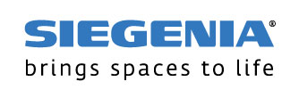

# IoBroker.siegenia

 

**Dieser Adapter verwendet Sentry-Bibliotheken, um den Entwicklern automatisch Ausnahmen und Codefehler zu melden.** Weitere Einzelheiten und Informationen zum Deaktivieren der Fehlerberichterstattung finden Sie unter [Sentry-Plugin Dokumentation](https://github.com/ioBroker/plugin-sentry#plugin-sentry)! Die Sentry-Berichterstattung wird ab js-controller 3.0 verwendet.

Dieser Adapter bietet ioBroker-Unterstützung für Klima- und Luftsteuerungsgeräte von Siegenia (https://www.siegenia.com).

Der Adapter erfordert mindestens Nodejs 8.x.

## Funktionsumfang
Alle aktuellen Geräte werden von diesem Adapter unterstützt:

* AEROPAC
* AEROMAT VT
* DRIVE axxent DK/MH
* SENSOAIR
* AEROVITAL Ambiente
* MHS-Familie
* ACS
* AEROTUBE
* Universalmodul
* enOcean Konvertermodul
* VT-Upgrade
* FAHREN CL
* AEROPLUS

Der Adapter erkennt Siegenia-Geräte im selben Netzwerk wie ioBroker automatisch und listet sie in seiner Admin-Oberfläche auf. Nach der Erkennung müssen Sie lediglich Benutzername und Passwort korrigieren. Sie können IP-Adressen und Anmeldedaten aber auch manuell eingeben.

Alle verfügbaren Datenfelder des erkannten Geräts werden in Objekten angezeigt und liefern aktuelle Daten bzw. ermöglichen die Änderung von Daten.

Timer und andere komplexere Daten werden vom Adapter angezeigt, können aber nur über die Siegenia-App geändert werden.

## Changelog

### __WORK IN PROGRESS__
* (@Apollon77) Add support for enOcean Converter Module, VT Upgrade, DRIVE CL, and AEROPLUS

### 1.1.1 (2021-07-06)
* (thost96/Apollon77) Optimize for js-controller 3.3

### 1.1.0 (2021-01-22)
* (Apollon77) Prevent crash case (Sentry IOBROKER-SIEGENIA-1)
* (Apollon77) js-controller 2.0 is now required at least

### 1.0.1 (2020-12-24)
* (Apollon77) update dependencies
* (Apollon77) disconnect device if authentication was not successful

### 1.0.0
* (Apollon77) initial release

## License
MIT License

Copyright (c) 2019-2025 Apollon77 iobroker@fischer-ka.de

Permission is hereby granted, free of charge, to any person obtaining a copy
of this software and associated documentation files (the "Software"), to deal
in the Software without restriction, including without limitation the rights
to use, copy, modify, merge, publish, distribute, sublicense, and/or sell
copies of the Software, and to permit persons to whom the Software is
furnished to do so, subject to the following conditions:

The above copyright notice and this permission notice shall be included in all
copies or substantial portions of the Software.

THE SOFTWARE IS PROVIDED "AS IS", WITHOUT WARRANTY OF ANY KIND, EXPRESS OR
IMPLIED, INCLUDING BUT NOT LIMITED TO THE WARRANTIES OF MERCHANTABILITY,
FITNESS FOR A PARTICULAR PURPOSE AND NONINFRINGEMENT. IN NO EVENT SHALL THE
AUTHORS OR COPYRIGHT HOLDERS BE LIABLE FOR ANY CLAIM, DAMAGES OR OTHER
LIABILITY, WHETHER IN AN ACTION OF CONTRACT, TORT OR OTHERWISE, ARISING FROM,
OUT OF OR IN CONNECTION WITH THE SOFTWARE OR THE USE OR OTHER DEALINGS IN THE
SOFTWARE.