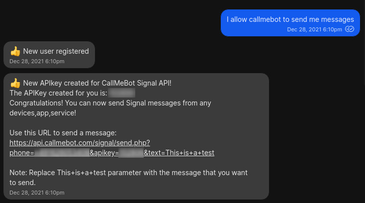
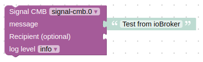
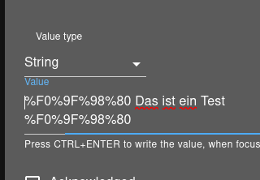
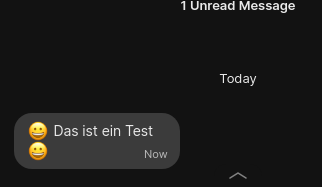

# ioBroker.signal-cmb

## signal-cmb-Adapter für ioBroker

Dank des kostenlosen [CallMeBot-](https://www.callmebot.com/blog/free-api-signal-send-messages/) Dienstes ermöglicht dieser Adapter das Senden von Signal-Nachrichten an sich selbst oder an andere Nummern.

**Hinweis** : _Die kostenlose API ist nur für den persönlichen Gebrauch bestimmt!_

### Konfiguration

_Die folgende Dokumentation wurde von [der CallMeBot](https://www.callmebot.com/blog/free-api-signal-send-messages/) -Seite kopiert._

Sie müssen den API-Schlüssel vom Bot erhalten, bevor Sie die API verwenden können:

- Fügen Sie die Telefonnummer des CallMeBot zu Ihren Telefonkontakten hinzu (benennen Sie sie nach Belieben). Die Telefonnummer finden Sie hier: <https://www.callmebot.com/blog/free-api-signal-send-messages/>
- Sende diese Nachricht`I allow callmebot to send me messages` (auf Englisch) an den neu erstellten Kontakt (natürlich über Signal).<br> Wenn Sie im „Testlink“ eine GUID erhalten, können Sie diese GUID anstelle Ihrer Telefonnummer im Adapter verwenden. Sie können auch senden<br> die Botschaft`I allow callmebot to send me messages` Wiederum. Normalerweise sollte Ihre Telefonnummer jetzt im Link angezeigt werden und Sie können Ihre Telefonnummer im Adapter verwenden.
- Warten Sie, bis Sie die Nachricht erhalten.`API Activated for your phone number. Your APIKEY is 123123` vom Bot. Da sich dies noch in der Beta-Testphase befindet, kann die Aktivierung bis zu 2 Minuten dauern.
- Die Signalnachricht des Bots enthält den API-Schlüssel, der zum Senden von Nachrichten über die API benötigt wird.
- Sie können den API-Schlüssel nun in der ioBroker-Konfiguration verwenden.

Beispiel:

### Verwendung

Es gibt zwei Möglichkeiten, Nachrichten zu senden: ACHTUNG! Es wurde festgestellt, dass CallMeBot einen Benutzer für 15 Minuten sperrt, wenn mehrere Nachrichten innerhalb einer Sekunde gesendet werden. Daher muss sichergestellt werden, dass nur eine Nachricht pro Sekunde gesendet wird.

- über`signal-cmb.0.sendMessage` Geben Sie einfach einen Text in dieses Feld ein, und die Nachricht wird an die in den Einstellungen konfigurierte Standardnummer gesendet.
- per Nachricht vom JavaScript-Adapter:

```
sendTo('signal-cmb.0', 'send', {
    text: 'My message', 
    phone: '+491234567890' // optional, if empty the message will be sent to the default configured number
});
```



### Emojis

Um Emojis zu senden, müssen Sie Ihrer Nachricht einige **„Codes“** hinzufügen. Alle verfügbaren Codes finden Sie hier: <https://www.callmebot.com/uncategorized/list-of-urlencoded-unicode-emoticons-emojis/>

### Verfügbare Emojis

Folgende Emojis werden offiziell von CallMeBot unterstützt:

| Code         | Emojie                                                                                        |
| ------------ | --------------------------------------------------------------------------------------------- |
| %F0%9F%98%80 |                                                       |
| %F0%9F%98%83 |                                 |
| %F0%9F%98%84 |                                   |
| %F0%9F%98%81 |                        |
| %F0%9F%98%86 |                 |
| %F0%9F%98%85 |                                         |
| %F0%9F%A4%A3 |     |
| %F0%9F%A4%A3 |                        |
| %F0%9F%98%82 |                         |
| %F0%9F%99%82 |                                    |
| %F0%9F%98%89 |                                        |
| %F0%9F%98%8A |  |
| %F0%9F%98%87 |            |

#### Verwende Emojis

Um ein Emoji zu verwenden, müssen Sie den Code des Emojis in Ihren Text einfügen, den Sie senden möchten.



Der **Signal-CMB-** Adapter URL-codiert diesen Code, und Sie sehen das Emoji in Ihrem Signal Messenger auf Ihrem Telefon.



## **IN BEARBEITUNG**

- Es wurden einige Änderungen vorgenommen.
- Habe noch einige Änderungen vorgenommen -->

### 0.3.1 (28.12.22)

- (derAlff) Aktualisierte 'package.json', um eine Minimalversion von NodeJS zu verwenden.
- (derAlff) Aktualisierte Beschreibung zur Konfiguration von CallMeBot in 'index\_m.html'
- (derAlff) Aktualisierter Konfigurationstext mit dem GUID-Problem in der README-Datei

### 0.2.3 (08.12.22)

- (derAlff) Unterstützung für 'kodierte Zeilenumbrüche' in Zeichenketten hinzugefügt
- (derAlff) Aktualisierte README-Datei

### 0.2.2 (07.12.22)

- (derAlff) Versionsänderung für NPM

### 0.2.1 (07.12.22)

- (derAlff) Versionsänderung für NPM

### 0.2.0 (07.12.22)

- (derAlff) Unterstützung für Emojis hinzugefügt
- (derAlff) Informationen zu Emojis in der README-Datei hinzugefügt
- (derAlff) Die Telefonnummer in der README/Konfiguration wurde durch einen Link zur tatsächlichen Telefonnummer auf der CallMeBot-Website ersetzt.

### 0.1.7 (16.02.22)

- (derAlff) Versionsänderung für NPM

### 0.1.6 (2022-01-22)

- (derAlff) Veröffentlicht auf npm
- (derAlff) README.md aktualisiert
- (derAlff) Übersetzte Beschreibung in io-package.json
- (derAlff) hat den Verbindungstyp auf Cloud geändert.
- (derAlff) Geänderter nativer Teil

### 0.1.5 (2022-01-22)

- (derAlff) Blockly-Problem behoben

### 0.1.4 (2022-01-22)

- (derAlff) Aktualisierte io-package.json und package.json.
- (derAlff) Fügte "messagebox": true zu io-package.json hinzu.
- (derAlff) Telefonnummer auf der Admin-Seite geändert.

### 0.1.3 (2022-01-21)

- (derAlff) README.md, io-package.json und package.json aktualisiert

### 0.1.0

- (derAlff) Die Version 0.1.0 wurde getestet und läuft.

### 0.0.1 (2022-01-21)

- (derAlff) Erste Veröffentlichung.

## Aufgaben

- Telefonbuch hinzufügen
- Mehrere Benutzer hinzufügen (Telefonnummern und API-Schlüssel)

## Changelog
<!--
Placeholder for the next version (at the beginning of the line):

## License
MIT License

Copyright (c) 2022 derAlff <derAlff@gmail.com>

Permission is hereby granted, free of charge, to any person obtaining a copy
of this software and associated documentation files (the "Software"), to deal
in the Software without restriction, including without limitation the rights
to use, copy, modify, merge, publish, distribute, sublicense, and/or sell
copies of the Software, and to permit persons to whom the Software is
furnished to do so, subject to the following conditions:

The above copyright notice and this permission notice shall be included in all
copies or substantial portions of the Software.

THE SOFTWARE IS PROVIDED "AS IS", WITHOUT WARRANTY OF ANY KIND, EXPRESS OR
IMPLIED, INCLUDING BUT NOT LIMITED TO THE WARRANTIES OF MERCHANTABILITY,
FITNESS FOR A PARTICULAR PURPOSE AND NONINFRINGEMENT. IN NO EVENT SHALL THE
AUTHORS OR COPYRIGHT HOLDERS BE LIABLE FOR ANY CLAIM, DAMAGES OR OTHER
LIABILITY, WHETHER IN AN ACTION OF CONTRACT, TORT OR OTHERWISE, ARISING FROM,
OUT OF OR IN CONNECTION WITH THE SOFTWARE OR THE USE OR OTHER DEALINGS IN THE
SOFTWARE.